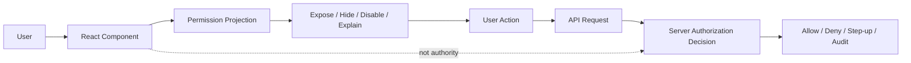
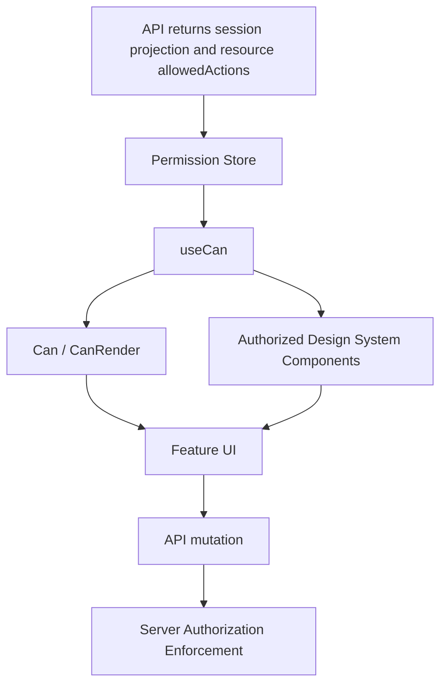

# Part 051 — Component Authorization Patterns

A React component should never be the final authority for authorization.

But it is still one of the most important places where authorization mistakes become visible.

The mistake is subtle:

```txt
Wrong mental model:
"If the user cannot click the button, the action is secured."

Correct mental model:
"The server secures the action. React controls whether exposing the action is useful, safe, and honest."
```

Component authorization is therefore not about replacing backend checks. It is about shaping the UI so that the user only sees capabilities that are currently meaningful for their identity, tenant, resource, workflow state, and session assurance level.

This part focuses on patterns.

Not one pattern.

In real production systems, you will usually combine several:

- route-level policy metadata,
- design-system components,
- `useCan()` hooks,
- `Can` components,
- per-resource allowed actions from the API,
- field-level editability,
- and backend-side enforcement on every write/read boundary.

The goal is not to hide every forbidden thing.

The goal is to make capability exposure **correct, consistent, testable, and fail-closed**.

---

## 1. The component authorization boundary

A component authorization boundary answers this question:

```txt
Should this UI element expose this capability in this current context?
```

It does **not** answer:

```txt
Should the backend allow the request?
```

That second question belongs to the API/resource server/policy engine.

A useful mental model:



React sees a **projection** of authorization.

The server owns the **decision**.

That distinction prevents the most common frontend auth bug: assuming a hidden button means the operation is safe.

---

## 2. What component authorization must optimize for

A component authorization pattern must satisfy several competing constraints.

### 2.1 Security correctness

It must fail closed.

If permission state is unknown, stale, loading, or malformed, the component should not expose a privileged capability.

```tsx
// Bad: unknown permission accidentally renders a destructive button
{permission !== false && <DeleteButton />}

// Better: only explicit allow renders the capability
{permission === true && <DeleteButton />}
```

### 2.2 Product clarity

Security does not mean randomly hiding everything.

Sometimes the right UI is:

- hide the action,
- disable the action,
- show a locked action,
- show a request-access CTA,
- show a step-up authentication prompt,
- show read-only content,
- show an explanation with a correlation ID.

The decision is product- and risk-dependent.

### 2.3 Consistency

The same permission should behave consistently across:

- page actions,
- row actions,
- bulk actions,
- keyboard shortcuts,
- command palette,
- context menus,
- mobile action sheets,
- forms,
- route navigation,
- deep links.

A permission pattern that only protects visible buttons will miss invisible action surfaces.

### 2.4 Testability

Component authorization must be easy to test with a permission matrix.

If every component hardcodes `user.role === "admin"`, testing becomes a scavenger hunt.

If every capability flows through `can()`/`useCan()`/`Can`, the authorization surface becomes visible.

### 2.5 Evolvability

Good component authorization can survive changes from:

- RBAC to permission-based RBAC,
- role checks to ABAC,
- ACL to ReBAC,
- static permissions to server-projected allowed actions,
- SPA token model to BFF session model,
- single-tenant to multi-tenant.

The component should care about capabilities, not the internal policy model.

---

## 3. Authorization vocabulary used in components

Before discussing patterns, define the vocabulary.

```ts
type Action =
  | "case.view"
  | "case.update"
  | "case.close"
  | "case.assign"
  | "case.escalate"
  | "case.delete"
  | "evidence.upload"
  | "comment.create";

type ResourceRef = {
  type: "case" | "evidence" | "comment" | "tenant";
  id?: string;
  tenantId?: string;
  state?: string;
  ownerId?: string;
};

type PermissionReasonCode =
  | "allowed"
  | "anonymous"
  | "session_expired"
  | "forbidden"
  | "missing_permission"
  | "wrong_tenant"
  | "resource_locked"
  | "workflow_state_denied"
  | "requires_step_up"
  | "permission_unknown";

type PermissionDecision = {
  allowed: boolean;
  reason: PermissionReasonCode;
  message?: string;
  requiresStepUp?: boolean;
  policyVersion?: string;
};
```

The important part is not the exact type names.

The important part is that components consume an **explicit decision**, not raw role strings.

```txt
Component should ask:
"Can the current subject perform action X on resource Y?"

Component should not ask:
"Is current user admin?"
```

---

## 4. Pattern taxonomy

There are several common patterns.

They are not mutually exclusive.

| Pattern | Best for | Risk | Recommendation |
|---|---|---|---|
| Inline conditional | Very local display logic | Repeated checks, inconsistent denial behavior | Use sparingly |
| Guard component | Declarative show/hide/disable | Can hide too much context | Good for design system and layout |
| Render prop | Need decision object in UI branch | More verbose | Good for reason-aware UI |
| Hook | Fine-grained logic inside component | Can be misused in loops/conditions | Core primitive |
| HOC | Legacy/class components | Composition complexity | Avoid for new code unless necessary |
| Design-system wrapper | Buttons, menu items, table actions | Requires strong API design | Highly recommended |
| Server-projected allowed actions | Row/resource-specific actions | Stale projection if not invalidated | Highly recommended for object-level auth |
| Route metadata | Navigation and layout gating | Not enough for backend auth | Use with loader/action enforcement |

A mature system usually uses:

```txt
Server policy decision -> permission projection -> useCan() -> Can/design-system wrappers -> server enforcement again
```

---

## 5. Pattern 1 — Inline conditional rendering

The simplest pattern is direct conditional rendering.

```tsx
function CaseHeader({ caseRecord, permissions }: Props) {
  return (
    <header>
      <h1>{caseRecord.reference}</h1>

      {permissions.canCloseCase && (
        <button type="button">Close case</button>
      )}
    </header>
  );
}
```

This is fine for low-risk local display logic.

But it decays quickly.

### 5.1 Why inline checks decay

Inline checks become dangerous when they spread:

```tsx
{user.role === "admin" && <DeleteButton />}
{user.roles.includes("MANAGER") && <AssignButton />}
{caseRecord.ownerId === user.id && <EditButton />}
{user.permissions.includes("case:close") && <CloseButton />}
```

Now the policy is not a policy anymore.

It is duplicated UI folklore.

### 5.2 When inline checks are acceptable

Inline checks are acceptable when:

- the permission was already computed by a reliable projection,
- the check is explicitly boolean and scoped,
- the action is low-risk exposure control,
- there is no duplicated business rule,
- backend still enforces the operation.

Example:

```tsx
function CaseToolbar({ allowedActions }: Props) {
  return (
    <div>
      {allowedActions.includes("case.update") ? <EditCaseButton /> : null}
      {allowedActions.includes("case.close") ? <CloseCaseButton /> : null}
    </div>
  );
}
```

This is acceptable because `allowedActions` is already a projection.

The component is not deriving policy from raw identity.

---

## 6. Pattern 2 — Guard component

A guard component wraps a child and decides whether to render it.

```tsx
type CanProps = {
  action: Action;
  resource?: ResourceRef;
  children: React.ReactNode;
  fallback?: React.ReactNode;
};

function Can({ action, resource, children, fallback = null }: CanProps) {
  const decision = useCan(action, resource);

  if (decision.status !== "ready") {
    return fallback;
  }

  if (!decision.allowed) {
    return fallback;
  }

  return <>{children}</>;
}
```

Usage:

```tsx
<Can action="case.close" resource={{ type: "case", id: caseId }}>
  <CloseCaseButton caseId={caseId} />
</Can>
```

This makes component authorization declarative.

### 6.1 Guard component variants

A production guard usually needs more than show/hide.

```tsx
type CanProps = {
  action: Action;
  resource?: ResourceRef;
  children: React.ReactNode;
  fallback?: React.ReactNode;
  loading?: React.ReactNode;
  mode?: "hide" | "disable" | "explain";
};
```

But be careful.

If a single `Can` component tries to cover all UI behavior, it becomes a product-policy monster.

A cleaner split:

```txt
Can             -> show/hide a branch
AuthorizedButton -> disable/hide/explain an action button
AuthorizedMenuItem -> command/menu-specific behavior
AuthorizedField -> field-level read-only/hidden behavior
```

---

## 7. Pattern 3 — Render prop guard

Sometimes the UI needs the reason.

For example:

- show locked icon,
- explain missing permission,
- show request-access button,
- trigger step-up authentication,
- display “case is closed” rather than “permission denied”.

A render prop is useful here.

```tsx
type CanRenderProps = {
  action: Action;
  resource?: ResourceRef;
  children: (decision: PermissionDecisionState) => React.ReactNode;
};

function CanRender({ action, resource, children }: CanRenderProps) {
  const decision = useCan(action, resource);
  return <>{children(decision)}</>;
}
```

Usage:

```tsx
<CanRender action="case.close" resource={{ type: "case", id: caseId }}>
  {(decision) => {
    if (decision.status === "loading") {
      return <CloseCaseButton disabled label="Checking..." />;
    }

    if (!decision.allowed) {
      return (
        <CloseCaseButton
          disabled
          label="Close case"
          tooltip={decision.message ?? "You cannot close this case."}
        />
      );
    }

    return <CloseCaseButton caseId={caseId} />;
  }}
</CanRender>
```

Render prop is verbose, but it is honest.

It exposes the full decision state to the UI.

---

## 8. Pattern 4 — Hook-first authorization

The hook is usually the core primitive.

```tsx
function CloseCaseAction({ caseRecord }: Props) {
  const closeDecision = useCan("case.close", {
    type: "case",
    id: caseRecord.id,
    tenantId: caseRecord.tenantId,
    state: caseRecord.state,
  });

  if (closeDecision.status === "loading") {
    return <button disabled>Checking...</button>;
  }

  if (!closeDecision.allowed) {
    return <button disabled title={closeDecision.message}>Close case</button>;
  }

  return <button>Close case</button>;
}
```

This is flexible.

But it requires discipline.

### 8.1 Hook misuse examples

Do not call hooks conditionally.

```tsx
// Bad
if (caseRecord.state === "OPEN") {
  const decision = useCan("case.close", resource);
}
```

Do not call hooks inside loops.

```tsx
// Bad
return rows.map((row) => {
  const decision = useCan("case.close", { type: "case", id: row.id });
  return <Row decision={decision} />;
});
```

Instead, batch or use child components.

```tsx
return rows.map((row) => (
  <CaseRow key={row.id} row={row} />
));
```

Or better, fetch allowed actions with the row list.

```ts
type CaseListItem = {
  id: string;
  reference: string;
  state: string;
  allowedActions: Action[];
};
```

The hook should not become a distributed N+1 policy query generator.

---

## 9. Pattern 5 — Higher-order component

A higher-order component wraps a component with authorization behavior.

```tsx
function withPermission<P>(
  Component: React.ComponentType<P>,
  required: { action: Action; getResource?: (props: P) => ResourceRef },
) {
  return function AuthorizedComponent(props: P) {
    const decision = useCan(
      required.action,
      required.getResource?.(props),
    );

    if (decision.status !== "ready" || !decision.allowed) {
      return null;
    }

    return <Component {...props} />;
  };
}
```

Usage:

```tsx
const AuthorizedCloseCaseButton = withPermission(CloseCaseButton, {
  action: "case.close",
  getResource: (props) => ({ type: "case", id: props.caseId }),
});
```

HOCs are useful when:

- you have legacy class components,
- you need framework integration,
- you need to wrap exported modules,
- your design system is HOC-heavy.

For new React code, hooks and explicit guard components are usually clearer.

---

## 10. Pattern 6 — Design-system authorization wrappers

The most scalable frontend pattern is often not `Can`.

It is authorization-aware design-system primitives.

```tsx
type AuthorizedButtonProps = {
  action: Action;
  resource?: ResourceRef;
  children: React.ReactNode;
  deniedBehavior?: "hide" | "disable" | "explain";
  onClick: () => void;
};

function AuthorizedButton({
  action,
  resource,
  children,
  deniedBehavior = "disable",
  onClick,
}: AuthorizedButtonProps) {
  const decision = useCan(action, resource);

  if (decision.status !== "ready") {
    return <button disabled>{children}</button>;
  }

  if (!decision.allowed) {
    if (deniedBehavior === "hide") return null;

    return (
      <button
        disabled
        title={decision.message ?? "You do not have access to this action."}
      >
        {children}
      </button>
    );
  }

  return <button onClick={onClick}>{children}</button>;
}
```

Usage:

```tsx
<AuthorizedButton
  action="case.escalate"
  resource={{ type: "case", id: caseId, state: caseState }}
  onClick={openEscalationDialog}
>
  Escalate
</AuthorizedButton>
```

Why this is powerful:

- buttons behave consistently,
- disabled/hide/explain policy is centralized,
- analytics can mark denied exposure safely,
- testing is reusable,
- accessibility can be handled once,
- tooltips and request-access flows are consistent.

### 10.1 Do not over-centralize product semantics

A generic `AuthorizedButton` should not encode every domain rule.

Bad:

```tsx
<AuthorizedButton action="case.close" knowsAboutCaseAppealWindow />
```

Better:

```tsx
<AuthorizedButton
  action="case.close"
  resource={{
    type: "case",
    id: caseRecord.id,
    state: caseRecord.state,
    tenantId: caseRecord.tenantId,
  }}
>
  Close case
</AuthorizedButton>
```

The policy system handles rules.

The component handles rendering.

---

## 11. Pattern 7 — Server-projected allowed actions

For object-level authorization, the API should often return allowed actions with the resource.

```json
{
  "id": "case_123",
  "reference": "REG-2026-000123",
  "state": "UNDER_REVIEW",
  "title": "Suspicious transaction review",
  "allowedActions": [
    "case.view",
    "case.update",
    "case.assign",
    "comment.create"
  ],
  "deniedActions": {
    "case.close": {
      "reason": "workflow_state_denied",
      "message": "Case can be closed only after supervisory review."
    }
  },
  "permissionVersion": "pol_v42"
}
```

Then the UI uses projection:

```tsx
function CaseRowActions({ caseRecord }: Props) {
  return (
    <Menu>
      {caseRecord.allowedActions.includes("case.update") && (
        <MenuItem>Edit</MenuItem>
      )}

      {caseRecord.allowedActions.includes("case.assign") && (
        <MenuItem>Assign</MenuItem>
      )}

      {caseRecord.deniedActions?.["case.close"] && (
        <MenuItem disabled>
          Close — {caseRecord.deniedActions["case.close"].message}
        </MenuItem>
      )}
    </Menu>
  );
}
```

This is better than asking the frontend to reconstruct object-level policy.

### 11.1 Why server projection works well

The backend already has:

- authoritative subject identity,
- tenant context,
- resource state,
- ownership data,
- workflow status,
- policy version,
- current grants,
- separation-of-duties constraints.

React should not refetch all of that just to decide whether to display a menu item.

### 11.2 Projection is not enforcement

Even with server-projected actions, the backend must check again when the user submits the operation.

Projection can go stale.

Between rendering and clicking:

- the user may lose the role,
- the case may move to a different state,
- the tenant membership may be revoked,
- a supervisor may lock the case,
- a policy deploy may change rules.

So the invariant stays:

```txt
Projection improves UX.
Server-side decision enforces security.
```

---

## 12. Pattern 8 — Field-level authorization

Field-level permission is not just “hide input”.

It controls how the user can interact with each field.

Common modes:

```ts
type FieldAccess =
  | { mode: "hidden" }
  | { mode: "readonly"; reason?: string }
  | { mode: "editable" }
  | { mode: "redacted"; reason?: string };
```

Example API projection:

```json
{
  "case": {
    "id": "case_123",
    "summary": "...",
    "riskScore": 82,
    "internalNotes": "..."
  },
  "fieldAccess": {
    "summary": { "mode": "editable" },
    "riskScore": { "mode": "readonly", "reason": "Calculated field" },
    "internalNotes": { "mode": "redacted", "reason": "Requires senior investigator role" }
  }
}
```

Component:

```tsx
function AuthorizedField({
  label,
  value,
  access,
  onChange,
}: {
  label: string;
  value: string;
  access: FieldAccess;
  onChange: (value: string) => void;
}) {
  if (access.mode === "hidden") return null;

  if (access.mode === "redacted") {
    return (
      <div>
        <label>{label}</label>
        <span>Restricted</span>
      </div>
    );
  }

  if (access.mode === "readonly") {
    return (
      <div>
        <label>{label}</label>
        <input value={value} readOnly title={access.reason} />
      </div>
    );
  }

  return (
    <div>
      <label>{label}</label>
      <input value={value} onChange={(event) => onChange(event.target.value)} />
    </div>
  );
}
```

Backend must still ignore or reject unauthorized field changes.

A malicious client can submit hidden fields.

---

## 13. Pattern 9 — Bulk action authorization

Bulk actions are where many frontend permission designs break.

A user selects 100 rows.

Some rows can be closed.

Some cannot.

What should the UI do?

A robust API returns eligibility.

```json
{
  "action": "case.close",
  "eligibleCount": 72,
  "ineligibleCount": 28,
  "items": [
    { "id": "case_1", "allowed": true },
    {
      "id": "case_2",
      "allowed": false,
      "reason": "workflow_state_denied",
      "message": "Case is pending supervisory review."
    }
  ]
}
```

Then the UI can show:

```txt
72 of 100 selected cases can be closed.
28 will be skipped because they are not eligible.
```

Or require the user to filter to eligible items first.

What you should not do:

```txt
If at least one selected row is allowed, enable the bulk action blindly.
```

Bulk operations need explicit partial-eligibility semantics.

---

## 14. Pattern 10 — Permission-aware command palette

Many teams secure buttons and forget the command palette.

Command palettes, keyboard shortcuts, context menus, and deep links are alternate action surfaces.

A capability should be registered with permission metadata.

```ts
type Command = {
  id: string;
  label: string;
  action: Action;
  getResource?: () => ResourceRef | undefined;
  run: () => void;
};

function useAuthorizedCommands(commands: Command[]) {
  const permissionService = usePermissionService();

  return commands.filter((command) => {
    const decision = permissionService.canSync(
      command.action,
      command.getResource?.(),
    );

    return decision.allowed;
  });
}
```

If an action can be triggered by:

- button,
- menu item,
- shortcut,
- command palette,
- URL action,
- drag-and-drop,
- bulk toolbar,

then all surfaces must use the same capability vocabulary.

---

## 15. Component policy composition

Components often need multiple permissions.

Example:

```txt
Show Assign button when:
- user can view the case,
- user can assign the case,
- case is not closed,
- user is operating in the case tenant,
- session assurance level is sufficient.
```

Do not encode this with scattered booleans.

```tsx
// Bad
if (
  user.role === "manager" &&
  caseRecord.state !== "CLOSED" &&
  user.tenantId === caseRecord.tenantId &&
  session.mfa === true
) {
  return <AssignButton />;
}
```

Use a capability.

```tsx
<AuthorizedButton
  action="case.assign"
  resource={{
    type: "case",
    id: caseRecord.id,
    tenantId: caseRecord.tenantId,
    state: caseRecord.state,
  }}
>
  Assign
</AuthorizedButton>
```

The policy layer can change implementation without requiring component rewrites.

---

## 16. Choosing hide, disable, explain, or request access

A component pattern needs display semantics.

| Situation | Recommended UI | Why |
|---|---|---|
| User should not know capability exists | Hide | Reduces information disclosure |
| User knows capability exists but cannot use now | Disable + reason | Improves clarity |
| Capability depends on workflow state | Disable + domain reason | Teaches valid process |
| Capability requires MFA/step-up | Show action and prompt step-up | Recoverable denial |
| User can request permission | Show locked action + request access | Supports access workflow |
| Privilege is sensitive/destructive | Prefer explicit denial and audit | Avoid accidental exposure |

The decision is not purely technical.

It involves:

- security risk,
- product education,
- organizational transparency,
- regulatory defensibility,
- support burden,
- threat model.

---

## 17. A practical component authorization stack

A good production stack looks like this:



Each layer has a job.

| Layer | Job |
|---|---|
| API | Authoritative projection and final enforcement |
| Permission store | Cache projection, expose snapshots, invalidate on epoch changes |
| `useCan()` | React-friendly decision access |
| `Can` | Declarative branch rendering |
| Design-system wrappers | Consistent button/menu/field behavior |
| Feature UI | Domain composition and user journey |
| Server enforcement | Security boundary |

---

## 18. Minimal permission service interface

A component should not know whether permissions come from:

- JWT claims,
- `/me`,
- `/permissions`,
- resource payload,
- OpenFGA,
- OPA,
- Cedar,
- custom RBAC tables.

It should call an interface.

```ts
type PermissionStatus = "ready" | "loading" | "error";

type PermissionDecisionState =
  | {
      status: "loading";
      allowed: false;
      reason: "permission_unknown";
    }
  | {
      status: "error";
      allowed: false;
      reason: "permission_unknown";
      message: string;
    }
  | ({
      status: "ready";
    } & PermissionDecision);

type PermissionService = {
  canSync(action: Action, resource?: ResourceRef): PermissionDecisionState;
  canManySync(requests: PermissionRequest[]): Record<string, PermissionDecisionState>;
  subscribe(listener: () => void): () => void;
  getSnapshot(): PermissionSnapshot;
};
```

Then React components become independent of policy internals.

---

## 19. Anti-pattern catalog

### 19.1 Raw role checks in components

```tsx
{user.role === "admin" && <DeleteUserButton />}
```

Why it fails:

- role meaning changes,
- tenant scope is missing,
- resource ownership is missing,
- workflow state is missing,
- step-up requirement is missing,
- role explosion leaks into UI.

Prefer:

```tsx
<AuthorizedButton action="user.delete" resource={{ type: "user", id: userId }}>
  Delete user
</AuthorizedButton>
```

### 19.2 Token claim as UI policy

```tsx
const claims = decodeJwt(accessToken);
return claims.scope.includes("case:close") ? <CloseButton /> : null;
```

Why it fails:

- token may be stale,
- scope may be API-level not domain-level,
- resource context is missing,
- tenant context may be missing,
- frontend decode is not validation.

### 19.3 `disabled` as security

```tsx
<button disabled={!canDelete}>Delete</button>
```

Disabled is UX only.

A malicious client can still call the API.

### 19.4 One permission to rule everything

```tsx
if (canManageCases) {
  showEditAssignCloseEscalateDeleteEverything();
}
```

Over-broad permissions create hidden privilege coupling.

Prefer action-specific capabilities.

### 19.5 Loading means allow

```tsx
if (permission.loading) return <DeleteButton />;
```

Unknown must not expose privileged actions.

### 19.6 Inconsistent surfaces

Button checks permission.

Keyboard shortcut does not.

Context menu does not.

Command palette does not.

Deep link does not.

This is a UI authorization drift bug.

---

## 20. Testing component authorization patterns

Component authorization should be tested as a matrix.

Example:

```ts
describe("CloseCaseButton", () => {
  it("renders enabled when allowed", () => {
    renderWithPermissions(
      <CloseCaseButton caseId="case_1" />,
      {
        decisions: {
          "case.close:case:case_1": {
            status: "ready",
            allowed: true,
            reason: "allowed",
          },
        },
      },
    );

    expect(screen.getByRole("button", { name: /close case/i })).toBeEnabled();
  });

  it("fails closed when permission is loading", () => {
    renderWithPermissions(
      <CloseCaseButton caseId="case_1" />,
      {
        decisions: {
          "case.close:case:case_1": {
            status: "loading",
            allowed: false,
            reason: "permission_unknown",
          },
        },
      },
    );

    expect(screen.getByRole("button", { name: /close case/i })).toBeDisabled();
  });

  it("shows denial reason when forbidden", () => {
    renderWithPermissions(
      <CloseCaseButton caseId="case_1" />,
      {
        decisions: {
          "case.close:case:case_1": {
            status: "ready",
            allowed: false,
            reason: "workflow_state_denied",
            message: "Case requires supervisory review first.",
          },
        },
      },
    );

    expect(screen.getByText(/supervisory review/i)).toBeInTheDocument();
  });
});
```

Test states should include:

- allowed,
- forbidden,
- loading,
- error,
- stale,
- wrong tenant,
- requires step-up,
- workflow denied,
- resource locked,
- permission projection missing.

---

## 21. Review checklist

Use this checklist during PR review.

```txt
Component authorization checklist:

[ ] Does the component ask for capability, not role?
[ ] Does unknown permission fail closed?
[ ] Is backend enforcement still present?
[ ] Are alternate action surfaces covered?
[ ] Are denied/loading/error states explicit?
[ ] Is tenant/resource/workflow context included?
[ ] Is stale permission handled?
[ ] Is field-level access handled safely?
[ ] Are bulk action semantics explicit?
[ ] Is the permission decision testable?
[ ] Is denial copy safe and useful?
[ ] Is the design-system behavior consistent?
```

---

## 22. Final mental model

Component authorization is not a single component.

It is a layered projection system.

```txt
Backend policy decides.
API projects.
Permission store caches.
Hooks expose.
Components render.
Design system standardizes.
Tests prevent drift.
Server enforces again.
```

If you remember only one thing from this part, remember this:

```txt
React component authorization is capability exposure control, not access-control enforcement.
```

That distinction lets you build UI that is safe, clear, maintainable, and compatible with serious backend authorization.

---

## References

- React Docs — Conditional Rendering: https://react.dev/learn/conditional-rendering
- React Docs — Built-in Hooks: https://react.dev/reference/react/hooks
- React Docs — Rules of Hooks: https://react.dev/reference/rules/rules-of-hooks
- OWASP Authorization Cheat Sheet: https://cheatsheetseries.owasp.org/cheatsheets/Authorization_Cheat_Sheet.html
- OWASP Top 10 — Broken Access Control: https://owasp.org/Top10/A01_2021-Broken_Access_Control/
