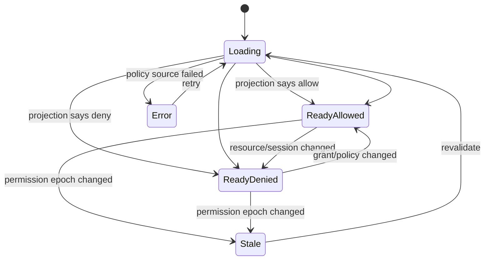

# Part 052 — Designing `useCan()`

A weak `useCan()` hook is just a fancy `if` statement.

A strong `useCan()` hook is a boundary between React rendering and your authorization projection model.

It should answer one question clearly:

```txt
Given the current session projection, tenant context, resource context, policy version, and permission cache, what should this component expose right now?
```

It should not answer:

```txt
Will the server definitely allow the request later?
```

That second question belongs to the server.

The purpose of `useCan()` is to make capability exposure in React:

- explicit,
- typed,
- deny-by-default,
- cache-aware,
- tenant-aware,
- resource-aware,
- step-up-aware,
- testable,
- and resilient to stale state.

---

## 1. Why `useCan()` deserves serious design

A naive implementation looks like this:

```tsx
function useCan(permission: string) {
  const user = useUser();
  return user.permissions.includes(permission);
}
```

This works for demos.

It fails in serious systems.

Why?

Because production authorization usually depends on more than a flat permission string.

It may depend on:

- current tenant,
- resource ownership,
- object ACL,
- relationship graph,
- workflow state,
- record lock,
- step-up authentication freshness,
- policy version,
- delegated authority,
- impersonation constraints,
- time window,
- emergency access,
- separation of duties,
- server-side revocation,
- and cache invalidation.

So `useCan("case.close")` without a resource is often under-specified.

A more realistic question is:

```ts
useCan("case.close", {
  type: "case",
  id: "case_123",
  tenantId: "tenant_a",
  state: "UNDER_REVIEW",
});
```

The hook API should make missing context visible.

---

## 2. Design goals

A production-grade `useCan()` should satisfy these goals.

### 2.1 Fail closed

Unknown, loading, error, stale, and malformed permission state must not expose privileged actions.

```txt
No explicit allow = do not expose privileged capability.
```

### 2.2 Return a decision object, not just boolean

A boolean cannot explain:

- why access is denied,
- whether step-up is required,
- whether the state is loading,
- whether the decision is stale,
- which policy version produced the decision,
- whether request access is possible.

Use a decision object.

### 2.3 Support resource-aware checks

A user may be able to edit one case but not another.

`useCan()` must accept resource context.

### 2.4 Support sync and async permission sources

Some permissions are already projected into memory.

Others may require a network check or batch endpoint.

The hook must not cause chaotic request storms.

### 2.5 Avoid N+1 authorization calls

Rendering a table of 100 rows should not automatically trigger 100 independent permission calls.

Prefer server-projected allowed actions or batched permission checks.

### 2.6 Be tenant-aware

Same user, same action, same resource ID, different tenant = different decision.

Tenant must be part of the decision key.

### 2.7 Be testable

Tests should be able to inject permission snapshots without booting the entire auth provider.

---

## 3. The core type model

Start with a capability vocabulary.

```ts
type Action =
  | "case.view"
  | "case.update"
  | "case.assign"
  | "case.close"
  | "case.escalate"
  | "evidence.upload"
  | "comment.create"
  | "user.invite";

type ResourceType =
  | "case"
  | "evidence"
  | "comment"
  | "tenant"
  | "user";

type ResourceRef = {
  type: ResourceType;
  id?: string;
  tenantId?: string;
  state?: string;
  ownerId?: string;
  attributes?: Record<string, string | number | boolean | null>;
};

type PermissionRequest = {
  action: Action;
  resource?: ResourceRef;
};
```

Then model decision state explicitly.

```ts
type PermissionReasonCode =
  | "allowed"
  | "permission_unknown"
  | "anonymous"
  | "session_expired"
  | "missing_permission"
  | "wrong_tenant"
  | "resource_not_found"
  | "resource_locked"
  | "workflow_state_denied"
  | "requires_step_up"
  | "policy_unavailable";

type ReadyPermissionDecision = {
  status: "ready";
  allowed: boolean;
  reason: PermissionReasonCode;
  message?: string;
  requiresStepUp?: boolean;
  canRequestAccess?: boolean;
  policyVersion?: string;
  decisionId?: string;
};

type LoadingPermissionDecision = {
  status: "loading";
  allowed: false;
  reason: "permission_unknown";
};

type ErrorPermissionDecision = {
  status: "error";
  allowed: false;
  reason: "policy_unavailable" | "permission_unknown";
  message: string;
};

type StalePermissionDecision = {
  status: "stale";
  allowed: false;
  reason: "permission_unknown";
  previous?: ReadyPermissionDecision;
};

type PermissionDecisionState =
  | ReadyPermissionDecision
  | LoadingPermissionDecision
  | ErrorPermissionDecision
  | StalePermissionDecision;
```

Notice the invariant:

```ts
status !== "ready" implies allowed === false
```

This is fail-closed by type design.

---

## 4. Boolean convenience without losing information

Developers often want this:

```tsx
const canClose = useCan("case.close", resource);
```

But if `canClose` is a boolean, you lose state.

A better API returns a decision:

```tsx
const close = useCan("case.close", resource);

if (close.allowed) {
  return <CloseCaseButton />;
}
```

Because `allowed` is always false when loading/error/stale, simple usage remains safe.

But advanced UI can still read the reason:

```tsx
if (close.reason === "requires_step_up") {
  return <Button onClick={startStepUp}>Verify identity to close case</Button>;
}

if (!close.allowed) {
  return <Button disabled title={close.message}>Close case</Button>;
}
```

This gives you boolean ergonomics without boolean blindness.

---

## 5. Decision state machine

`useCan()` should behave like a small state machine.



The important property:

```txt
Only ReadyAllowed exposes privileged capability.
```

Everything else should render as hidden, disabled, loading, or explanatory depending on the component.

---

## 6. Permission key design

A permission cache needs stable keys.

Bad key:

```ts
const key = action;
```

This ignores resource, tenant, and state.

Better:

```ts
function permissionKey(request: PermissionRequest): string {
  const resource = request.resource;

  return JSON.stringify({
    action: request.action,
    resourceType: resource?.type ?? null,
    resourceId: resource?.id ?? null,
    tenantId: resource?.tenantId ?? null,
    state: resource?.state ?? null,
  });
}
```

For high-volume systems, prefer a normalized stable string:

```ts
function permissionKey(request: PermissionRequest): string {
  const r = request.resource;

  return [
    request.action,
    r?.type ?? "_",
    r?.id ?? "_",
    r?.tenantId ?? "_",
    r?.state ?? "_",
  ].join("|");
}
```

Do not include unstable objects directly.

```tsx
// Bad: new object every render may create unstable checks if not normalized
useCan("case.close", { type: "case", id: caseId, attributes: expensiveObject });
```

Normalize the subset of attributes needed by the projection.

---

## 7. Permission snapshot

A snapshot is the frontend's current view of permission state.

```ts
type PermissionSnapshot = {
  sessionId?: string;
  subjectId?: string;
  tenantId?: string;
  permissionEpoch: string;
  policyVersion?: string;
  decisions: Record<string, PermissionDecisionState>;
  globalPermissions: Set<Action>;
};
```

Example:

```ts
const snapshot: PermissionSnapshot = {
  sessionId: "sess_abc",
  subjectId: "usr_123",
  tenantId: "tenant_a",
  permissionEpoch: "perm_epoch_42",
  policyVersion: "policy_2026_07_08_1",
  decisions: {
    "case.close|case|case_123|tenant_a|UNDER_REVIEW": {
      status: "ready",
      allowed: false,
      reason: "workflow_state_denied",
      message: "Case requires supervisory review first.",
      policyVersion: "policy_2026_07_08_1",
    },
  },
  globalPermissions: new Set(["case.view", "comment.create"]),
};
```

The snapshot is not the source of truth.

It is a local projection.

---

## 8. A small permission store

A store lets components subscribe to permission updates without threading props everywhere.

```ts
type Listener = () => void;

class PermissionStore {
  private snapshot: PermissionSnapshot = {
    permissionEpoch: "initial",
    decisions: {},
    globalPermissions: new Set(),
  };

  private listeners = new Set<Listener>();

  getSnapshot = () => this.snapshot;

  subscribe = (listener: Listener) => {
    this.listeners.add(listener);
    return () => this.listeners.delete(listener);
  };

  replaceSnapshot(next: PermissionSnapshot) {
    this.snapshot = next;
    this.emit();
  }

  setDecision(key: string, decision: PermissionDecisionState) {
    this.snapshot = {
      ...this.snapshot,
      decisions: {
        ...this.snapshot.decisions,
        [key]: decision,
      },
    };
    this.emit();
  }

  invalidate(nextEpoch: string) {
    this.snapshot = {
      ...this.snapshot,
      permissionEpoch: nextEpoch,
      decisions: Object.fromEntries(
        Object.entries(this.snapshot.decisions).map(([key, decision]) => [
          key,
          decision.status === "ready"
            ? { status: "stale", allowed: false, reason: "permission_unknown", previous: decision }
            : decision,
        ]),
      ),
    };
    this.emit();
  }

  private emit() {
    for (const listener of this.listeners) {
      listener();
    }
  }
}
```

This store can be backed by:

- `/session`,
- `/me`,
- `/permissions`,
- resource payloads,
- TanStack Query cache,
- router loader data,
- WebSocket invalidation,
- or BFF session projection.

---

## 9. React integration with `useSyncExternalStore`

React provides `useSyncExternalStore` for subscribing to an external store.

```tsx
import { createContext, useContext, useMemo, useSyncExternalStore } from "react";

const PermissionStoreContext = createContext<PermissionStore | null>(null);

export function PermissionProvider({ children }: { children: React.ReactNode }) {
  const store = useMemo(() => new PermissionStore(), []);

  return (
    <PermissionStoreContext.Provider value={store}>
      {children}
    </PermissionStoreContext.Provider>
  );
}

function usePermissionStore() {
  const store = useContext(PermissionStoreContext);

  if (!store) {
    throw new Error("usePermissionStore must be used inside PermissionProvider");
  }

  return store;
}

function usePermissionSnapshot() {
  const store = usePermissionStore();

  return useSyncExternalStore(
    store.subscribe,
    store.getSnapshot,
    store.getSnapshot,
  );
}
```

Then `useCan()` reads a snapshot.

```tsx
export function useCan(action: Action, resource?: ResourceRef): PermissionDecisionState {
  const snapshot = usePermissionSnapshot();
  const key = permissionKey({ action, resource });

  const resourceDecision = snapshot.decisions[key];

  if (resourceDecision) {
    return resourceDecision;
  }

  if (!resource && snapshot.globalPermissions.has(action)) {
    return {
      status: "ready",
      allowed: true,
      reason: "allowed",
      policyVersion: snapshot.policyVersion,
    };
  }

  return {
    status: "loading",
    allowed: false,
    reason: "permission_unknown",
  };
}
```

This is intentionally conservative.

If the exact resource decision is missing, it does not guess allow.

---

## 10. `useCan()` with options

A real hook often needs options.

```ts
type UseCanOptions = {
  suspense?: boolean;
  staleMode?: "deny" | "show-previous-disabled";
  requireFresh?: boolean;
  reasonMode?: "safe" | "detailed";
};
```

Example:

```tsx
const decision = useCan(
  "case.close",
  { type: "case", id: caseId, tenantId, state },
  { requireFresh: true },
);
```

But do not overload the hook until it becomes impossible to reason about.

A good rule:

```txt
useCan should retrieve and normalize decisions.
Rendering semantics belong to components.
```

So prefer:

```tsx
const decision = useCan("case.close", resource);
return <AuthorizedButton decision={decision}>Close case</AuthorizedButton>;
```

Instead of:

```tsx
useCan("case.close", resource, {
  renderAs: "disabled-button-with-tooltip-and-request-access",
});
```

---

## 11. Sync vs async permissions

There are two common approaches.

### 11.1 Synchronous projection

The app already has permission data in memory.

Examples:

- global permissions from `/session`,
- resource `allowedActions` from list/detail API,
- route loader returned permission projection,
- server-rendered session projection.

`useCan()` simply reads the snapshot.

This is best for rendering.

### 11.2 Async check

The component requests a permission decision on demand.

Example:

```ts
POST /authorization/check
{
  "action": "case.close",
  "resource": {
    "type": "case",
    "id": "case_123"
  }
}
```

This is sometimes necessary for:

- rare sensitive actions,
- complex ReBAC decisions,
- access explanation,
- dynamic object context,
- step-up preflight.

But async checks can cause performance and consistency problems.

### 11.3 Preferred rule

```txt
Render from projection.
Preflight asynchronously only when necessary.
Enforce on mutation regardless.
```

---

## 12. Async `useCan()` without request storms

If you support async checks, dedupe them.

```ts
type CheckPermission = (request: PermissionRequest) => Promise<ReadyPermissionDecision>;

class PermissionCheckClient {
  private inFlight = new Map<string, Promise<ReadyPermissionDecision>>();

  constructor(private checkPermission: CheckPermission) {}

  check(request: PermissionRequest) {
    const key = permissionKey(request);
    const existing = this.inFlight.get(key);

    if (existing) return existing;

    const promise = this.checkPermission(request)
      .finally(() => this.inFlight.delete(key));

    this.inFlight.set(key, promise);
    return promise;
  }
}
```

Then integrate with the store.

```tsx
function useCanAsync(action: Action, resource?: ResourceRef): PermissionDecisionState {
  const store = usePermissionStore();
  const snapshot = usePermissionSnapshot();
  const key = permissionKey({ action, resource });

  const existing = snapshot.decisions[key];

  useEffect(() => {
    if (existing && existing.status !== "stale") return;

    let cancelled = false;

    store.setDecision(key, {
      status: "loading",
      allowed: false,
      reason: "permission_unknown",
    });

    permissionCheckClient
      .check({ action, resource })
      .then((decision) => {
        if (!cancelled) store.setDecision(key, decision);
      })
      .catch(() => {
        if (!cancelled) {
          store.setDecision(key, {
            status: "error",
            allowed: false,
            reason: "policy_unavailable",
            message: "Permission check failed.",
          });
        }
      });

    return () => {
      cancelled = true;
    };
  }, [action, key, resource, existing, store]);

  return existing ?? {
    status: "loading",
    allowed: false,
    reason: "permission_unknown",
  };
}
```

This is illustrative.

In production, be careful with `resource` object stability. You may want callers to pass a stable normalized `resourceKey` or memoize `ResourceRef`.

---

## 13. Batching permission checks

For tables and dashboards, prefer batch checks.

```ts
type PermissionBatchRequest = {
  requests: PermissionRequest[];
};

type PermissionBatchResponse = {
  decisions: Array<PermissionRequest & ReadyPermissionDecision>;
  policyVersion: string;
  permissionEpoch: string;
};
```

Example:

```tsx
function useCanMany(requests: PermissionRequest[]) {
  const store = usePermissionStore();
  const snapshot = usePermissionSnapshot();

  const keys = requests.map(permissionKey);

  useEffect(() => {
    const missing = requests.filter((request) => {
      const decision = snapshot.decisions[permissionKey(request)];
      return !decision || decision.status === "stale";
    });

    if (missing.length === 0) return;

    void checkManyPermissions(missing).then((response) => {
      for (const decision of response.decisions) {
        store.setDecision(permissionKey(decision), decision);
      }
    });
  }, [store, snapshot.permissionEpoch, keys.join(";")]);

  return Object.fromEntries(
    requests.map((request) => {
      const key = permissionKey(request);
      return [key, snapshot.decisions[key] ?? {
        status: "loading",
        allowed: false,
        reason: "permission_unknown",
      }];
    }),
  );
}
```

But if an API can return `allowedActions` with each row, that is often better than client-side batch checks.

---

## 14. Resource identity and stale decisions

The same resource ID may have different authorization depending on resource state.

Example:

```txt
case.close allowed when state = READY_FOR_CLOSURE
case.close denied when state = UNDER_REVIEW
```

If your permission key only includes resource ID, you may reuse a stale allow after the case changes state.

Include state or permission version when relevant.

```ts
const resource = {
  type: "case",
  id: caseRecord.id,
  tenantId: caseRecord.tenantId,
  state: caseRecord.state,
};

const close = useCan("case.close", resource);
```

If resource state changes, the key changes and the previous decision does not accidentally authorize the UI.

For complex objects, do not include the whole record.

Include only authorization-relevant projection fields.

---

## 15. Tenant-aware `useCan()`

Tenant scoping is not optional in multi-tenant systems.

Bad:

```tsx
useCan("case.view", { type: "case", id: caseId });
```

Better:

```tsx
useCan("case.view", {
  type: "case",
  id: caseId,
  tenantId: activeTenantId,
});
```

The hook should detect mismatches.

```ts
function resolveDecision(snapshot: PermissionSnapshot, request: PermissionRequest) {
  if (
    request.resource?.tenantId &&
    snapshot.tenantId &&
    request.resource.tenantId !== snapshot.tenantId
  ) {
    return {
      status: "ready",
      allowed: false,
      reason: "wrong_tenant",
      message: "This resource belongs to a different workspace.",
      policyVersion: snapshot.policyVersion,
    } satisfies ReadyPermissionDecision;
  }

  // continue normal resolution
}
```

This prevents confused UI after tenant switching.

---

## 16. Step-up aware `useCan()`

Some actions are not permanently denied.

They require stronger authentication.

```ts
const decision: ReadyPermissionDecision = {
  status: "ready",
  allowed: false,
  reason: "requires_step_up",
  requiresStepUp: true,
  message: "Verify your identity to approve this transfer.",
};
```

Component:

```tsx
function ApproveTransferButton({ transferId }: Props) {
  const decision = useCan("transfer.approve", {
    type: "case",
    id: transferId,
  });

  if (decision.reason === "requires_step_up") {
    return (
      <button onClick={() => startStepUp({ returnTo: window.location.pathname })}>
        Verify identity to approve
      </button>
    );
  }

  if (!decision.allowed) {
    return <button disabled>{decision.message ?? "Approve"}</button>;
  }

  return <button>Approve</button>;
}
```

Do not model step-up as simple `forbidden`.

It is a recoverable authorization-adjacent state.

---

## 17. Integrating `useCan()` with server-projected allowed actions

For resource payloads:

```ts
type CaseDto = {
  id: string;
  tenantId: string;
  state: string;
  allowedActions: Action[];
  deniedActions?: Partial<Record<Action, Omit<ReadyPermissionDecision, "status" | "allowed">>>;
  permissionVersion: string;
};
```

When loading a case, hydrate the permission store.

```ts
function hydrateCasePermissions(store: PermissionStore, caseRecord: CaseDto) {
  const resource = {
    type: "case" as const,
    id: caseRecord.id,
    tenantId: caseRecord.tenantId,
    state: caseRecord.state,
  };

  for (const action of caseRecord.allowedActions) {
    store.setDecision(permissionKey({ action, resource }), {
      status: "ready",
      allowed: true,
      reason: "allowed",
      policyVersion: caseRecord.permissionVersion,
    });
  }

  for (const [action, denial] of Object.entries(caseRecord.deniedActions ?? {})) {
    store.setDecision(permissionKey({ action: action as Action, resource }), {
      status: "ready",
      allowed: false,
      ...denial,
      policyVersion: caseRecord.permissionVersion,
    });
  }
}
```

Now components can use `useCan()` without knowing where the decision came from.

---

## 18. Handling policy unavailable

What happens if the permission source is down?

Bad default:

```txt
Permission service unavailable -> allow all to avoid blocking users
```

Correct default:

```txt
Permission service unavailable -> fail closed for privileged actions
```

But UX can be nuanced.

| Capability | Failure behavior |
|---|---|
| Destructive mutation | Disable/deny |
| Sensitive read | Hide/deny |
| Low-risk navigation | Show generic unavailable state |
| Access request | Maybe allow if separate service works |
| Public content | Continue |

Decision object:

```ts
{
  status: "error",
  allowed: false,
  reason: "policy_unavailable",
  message: "We could not verify access right now. Try again later."
}
```

This is safer and supportable.

---

## 19. SSR and hydration considerations

With SSR or React Server Components, `useCan()` has another problem:

```txt
Server rendered with one permission snapshot.
Client hydrates with another.
```

Possible causes:

- session expired between render and hydration,
- permission changed,
- tenant switched in another tab,
- cookie refresh happened,
- resource state changed,
- policy version changed.

Design rules:

```txt
1. Server should not render privileged controls unless permission is known server-side.
2. Client should revalidate session/permission epoch after hydration.
3. Unknown or mismatched epoch should fail closed.
4. Do not render protected shell first and correct it later.
```

For server-projected snapshots, include metadata:

```ts
type HydratedPermissionSnapshot = PermissionSnapshot & {
  renderedAt: string;
  serverSessionVersion: string;
};
```

On hydration, compare with current session version.

If mismatch, invalidate and re-bootstrap.

---

## 20. Avoiding render loops

`useCan()` should be pure from React's rendering perspective.

Bad:

```tsx
function useCan(action: Action, resource?: ResourceRef) {
  const [decision, setDecision] = useState(...);

  fetch("/authorization/check", ...).then(setDecision); // Bad inside render

  return decision;
}
```

Side effects belong in `useEffect`, route loaders, query functions, or store actions.

The hook should not fetch during render unless using a framework-supported data mechanism.

---

## 21. Memoization and stable inputs

The caller should avoid recreating noisy resource objects.

```tsx
const resource = useMemo(
  () => ({
    type: "case" as const,
    id: caseRecord.id,
    tenantId: caseRecord.tenantId,
    state: caseRecord.state,
  }),
  [caseRecord.id, caseRecord.tenantId, caseRecord.state],
);

const close = useCan("case.close", resource);
```

But `useCan()` should also normalize internally.

Do not rely on object identity as the permission key.

---

## 22. API ergonomics examples

### 22.1 Simple global permission

```tsx
const invite = useCan("user.invite");

return invite.allowed ? <InviteUserButton /> : null;
```

### 22.2 Resource-specific permission

```tsx
const update = useCan("case.update", {
  type: "case",
  id: caseRecord.id,
  tenantId: caseRecord.tenantId,
  state: caseRecord.state,
});

return <EditCaseButton disabled={!update.allowed} reason={update.message} />;
```

### 22.3 Step-up action

```tsx
const approve = useCan("case.approve", resource);

if (approve.requiresStepUp) {
  return <VerifyAndContinueButton action="case.approve" resource={resource} />;
}
```

### 22.4 Bulk action

```tsx
const decisions = useCanMany(
  selectedRows.map((row) => ({
    action: "case.close",
    resource: {
      type: "case",
      id: row.id,
      tenantId: row.tenantId,
      state: row.state,
    },
  })),
);

const eligible = Object.values(decisions).filter((d) => d.allowed).length;
```

---

## 23. Test helper design

Testing should be easy.

```tsx
function renderWithPermissions(
  ui: React.ReactElement,
  snapshot: Partial<PermissionSnapshot>,
) {
  const store = new PermissionStore();

  store.replaceSnapshot({
    permissionEpoch: "test",
    decisions: {},
    globalPermissions: new Set(),
    ...snapshot,
  });

  return render(
    <PermissionStoreContext.Provider value={store}>
      {ui}
    </PermissionStoreContext.Provider>,
  );
}
```

Test example:

```tsx
it("fails closed when decision is missing", () => {
  renderWithPermissions(<CloseCaseButton caseId="case_1" />, {
    tenantId: "tenant_a",
  });

  expect(screen.getByRole("button", { name: /close/i })).toBeDisabled();
});
```

Testing matrix:

```txt
[ ] allowed
[ ] denied missing permission
[ ] denied wrong tenant
[ ] denied workflow state
[ ] requires step-up
[ ] loading
[ ] stale
[ ] policy unavailable
[ ] missing resource context
[ ] tenant changed
[ ] permission epoch changed
```

---

## 24. Common `useCan()` anti-patterns

### 24.1 Boolean-only hook

```tsx
const canDelete = useCan("case.delete");
```

If `useCan()` returns only boolean, denial reason and loading state disappear.

### 24.2 Hook directly reads JWT claims

```tsx
function useCan(scope: string) {
  const token = useAccessToken();
  return decodeJwt(token).scope.includes(scope);
}
```

This ignores validation, revocation, object context, tenant context, and policy freshness.

### 24.3 Hook performs one network request per component

```tsx
function TableRow({ row }) {
  const canClose = useCanAsync("case.close", { type: "case", id: row.id });
}
```

For large tables, this creates request storms.

Use allowed actions or batching.

### 24.4 Hook allows while loading

```tsx
return decision ?? { allowed: true };
```

This is a security bug.

### 24.5 Hook hides backend denial

```tsx
if (frontendAllowed) {
  await closeCase();
  showSuccess();
}
```

The mutation can still return `403` because server is authoritative.

Handle backend denial explicitly.

---

## 25. A good default implementation contract

For most serious React apps, start with this contract:

```ts
type UseCan = (
  action: Action,
  resource?: ResourceRef,
) => PermissionDecisionState;
```

Guarantees:

```txt
1. Missing exact decision does not imply allow.
2. Loading/error/stale returns allowed=false.
3. Tenant mismatch returns allowed=false.
4. Resource state is part of the key when provided.
5. Hook never performs unbounded per-render fetch.
6. Decision includes reason and optional message.
7. Backend still enforces all requests.
```

This contract is simple enough for product engineers and strict enough for security review.

---

## 26. Final mental model

`useCan()` is not an authorization engine.

It is a React adapter over an authorization projection.

```txt
Policy engine/server decides.
API projects.
Store caches.
useCan reads.
Component renders.
API enforces again.
```

A strong `useCan()` design makes authorization visible and testable in the React layer without pretending the React layer is the security boundary.

If you design it this way, you can later change your backend model from RBAC to ABAC or ReBAC without rewriting every component.

That is the real power of the hook.

---

## References

- React Docs — Built-in Hooks: https://react.dev/reference/react/hooks
- React Docs — `useSyncExternalStore`: https://react.dev/reference/react/useSyncExternalStore
- React Docs — `useContext`: https://react.dev/reference/react/useContext
- React Docs — Rules of Hooks: https://react.dev/reference/rules/rules-of-hooks
- React Docs — Conditional Rendering: https://react.dev/learn/conditional-rendering
- OWASP Authorization Cheat Sheet: https://cheatsheetseries.owasp.org/cheatsheets/Authorization_Cheat_Sheet.html
