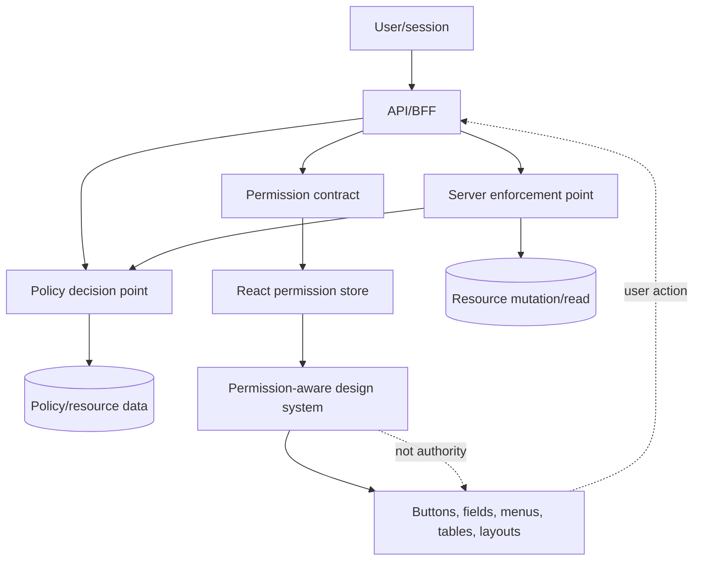
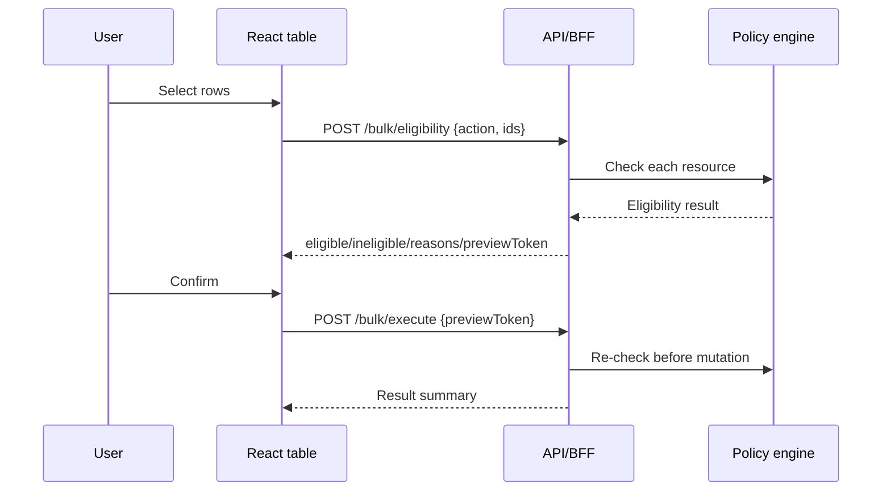

# Part 053 — Permission-aware Design System

A design system normally standardizes buttons, inputs, tables, dialogs, layout, typography, and interaction states.

A permission-aware design system standardizes something more important:

```txt
How capability exposure is represented consistently across the product.
```

That means every place where a user can discover or trigger an action should follow the same authorization semantics:

- navigation menu,
- route layout,
- table row action,
- bulk action,
- toolbar button,
- form field,
- submit button,
- command palette item,
- context menu,
- keyboard shortcut,
- empty state CTA,
- banner,
- modal primary action,
- mobile swipe action,
- admin console control.

If each team writes its own permission checks, your product slowly becomes an authorization lottery.

One screen hides `Delete`.

Another screen disables `Delete`.

A third screen still allows the keyboard shortcut.

A fourth screen hides the menu item but leaves the API call reachable through the browser console.

A fifth screen uses `user.role === "admin"` because the developer did not know there was already a permission contract.

That is how mature products get subtle access-control bugs.

This part designs the design-system layer that prevents that drift.

---

## 1. The core distinction

A design system cannot authorize a request.

A design system can standardize the **projection** of authorization decisions into UI.

```txt
Server-side authorization = enforcement
React permission UI      = exposure control
Design system            = consistent exposure primitives
```

The design system must never claim:

```txt
This button is secure because it is hidden.
```

It should claim:

```txt
This button uses the same permission decision model, fallback semantics, disabled/hide behavior, reason display, analytics policy, and test harness as the rest of the product.
```

That is valuable.

Not because it replaces backend authorization.

Because it removes inconsistency from the user journey.

---

## 2. Authority chain

The clean architecture looks like this:



The direction matters.

The design system consumes permission decisions.

It does not invent permission decisions.

It may make local fallback decisions like:

```txt
unknown permission state => do not expose destructive action
```

But it must not derive domain authority from role strings, JWT claims, CSS classes, or route names.

---

## 3. Why this belongs in the design system

Without a permission-aware design system, authorization UI becomes duplicated application code.

Duplicated authorization UI has predictable failure modes.

### Failure mode 1 — inconsistent exposure

```tsx
// Page A
{canDelete && <Button>Delete</Button>}

// Page B
<Button disabled={!canDelete}>Delete</Button>

// Page C
<MenuItem hidden={!user.roles.includes("admin")}>Delete</MenuItem>

// Page D
<CommandItem action="delete" /> // forgot permission
```

The product now teaches users different rules for the same action.

### Failure mode 2 — hidden action still reachable

The button is hidden, but:

- keyboard shortcut still fires,
- command palette still shows the command,
- bulk action toolbar still contains it,
- URL action route still exists,
- optimistic mutation still sends request,
- cached row action is stale.

The design system must ensure all action surfaces use one primitive.

### Failure mode 3 — security copy leaks information

Bad denial copy:

```txt
You cannot delete this investigation because it is locked by Case Officer Maria.
```

Maybe the user should not know Maria exists or that the case is locked.

Better copy may be:

```txt
You do not have access to delete this case.
```

Or, if the user is allowed to know the reason:

```txt
This case cannot be deleted while it is under review.
```

Reason visibility is also policy.

### Failure mode 4 — accessibility drift

Some teams use `disabled`.

Some use `aria-disabled`.

Some use `pointer-events: none`.

Some leave focusable controls that do nothing.

Some hide controls entirely.

Permission-aware design-system components should encode the semantics intentionally.

### Failure mode 5 — design tokens become fake security

A red destructive button is not security.

A locked icon is not security.

A disabled opacity token is not security.

Visual treatment helps comprehension, but authorization is a decision contract plus server enforcement.

---

## 4. The design-system responsibility boundary

A permission-aware design system should own:

- consistent action exposure,
- consistent disabled/hidden/read-only rendering,
- consistent denial reason display,
- consistent access-request CTA,
- consistent loading/unknown permission state,
- consistent destructive action confirmation semantics,
- consistent telemetry events,
- consistent testing helpers,
- consistent accessibility behavior.

It should not own:

- role assignment,
- policy evaluation,
- token validation,
- resource ownership calculation,
- backend authorization,
- tenant membership validation,
- audit-log final authority.

A useful rule:

```txt
The design system may decide how to render a decision.
It must not decide whether the user truly has permission.
```

---

## 5. Permission decision object

Do not pass booleans everywhere.

A boolean cannot explain uncertainty, stale state, step-up requirement, tenant mismatch, or access-request eligibility.

Use a structured decision.

```ts
export type PermissionStatus =
  | "allowed"
  | "denied"
  | "unknown"
  | "loading"
  | "stale"
  | "requires_step_up";

export type PermissionReasonCode =
  | "missing_permission"
  | "resource_locked"
  | "workflow_state"
  | "tenant_mismatch"
  | "requires_mfa"
  | "ownership_required"
  | "policy_unavailable"
  | "permission_stale"
  | "not_authenticated";

export interface PermissionDecision {
  status: PermissionStatus;
  action: string;
  resourceType?: string;
  resourceId?: string;
  tenantId?: string;
  policyVersion?: string;
  evaluatedAt?: string;
  reasonCode?: PermissionReasonCode;
  reason?: string;
  safeUserMessage?: string;
  canRequestAccess?: boolean;
  requestAccessHref?: string;
  stepUpHref?: string;
  constraints?: Record<string, unknown>;
}
```

The UI can now distinguish:

```txt
Denied because no permission
Denied because resource locked
Denied because MFA needed
Unknown because permissions are loading
Stale because tenant changed
```

That is how you produce a good UX without weakening security.

---

## 6. The first primitive: `PermissionGate`

Everything else can be built on top of one primitive.

```tsx
interface PermissionGateProps {
  decision: PermissionDecision;
  expose?: "hide" | "disable" | "readonly" | "replace";
  fallback?: React.ReactNode;
  children: React.ReactNode | ((decision: PermissionDecision) => React.ReactNode);
}

export function PermissionGate({
  decision,
  expose = "hide",
  fallback = null,
  children,
}: PermissionGateProps) {
  if (decision.status === "allowed") {
    return typeof children === "function" ? <>{children(decision)}</> : <>{children}</>;
  }

  if (decision.status === "requires_step_up") {
    return <StepUpRequired decision={decision} />;
  }

  if (decision.status === "loading" || decision.status === "unknown") {
    return expose === "hide" ? null : <PermissionSkeleton />;
  }

  if (expose === "replace") {
    return <>{fallback}</>;
  }

  if (expose === "hide") {
    return null;
  }

  return <DisabledPermissionWrapper decision={decision}>{children}</DisabledPermissionWrapper>;
}
```

This is a simplified example.

The production version needs to be stricter:

- handle stale decisions,
- avoid wrapping invalid DOM structures,
- support render-prop children for custom controls,
- enforce accessibility rules,
- emit safe telemetry,
- integrate with access-request flows,
- avoid leaking sensitive denial details.

But the key idea is already visible:

```txt
Rendering is a function of a decision object, not a random boolean.
```

---

## 7. Action component taxonomy

Most authorization UI can be categorized by intent.

| UI surface | Examples | Permission concern |
|---|---|---|
| Primary action | Save, Submit, Approve | Action allowed for current resource and state |
| Destructive action | Delete, Revoke, Close case | Permission + confirmation + audit reason |
| Navigation | Sidebar, tabs, breadcrumbs | Route/resource discovery |
| Row action | Edit row, view details, archive | Per-resource decision |
| Bulk action | Approve selected, export selected | Mixed eligibility |
| Field | Editable amount, owner, status | Field-level permission |
| Command | Command palette, keyboard shortcut | Hidden non-visual action surface |
| Empty state CTA | Create first project | Permission to create |
| Modal action | Confirm, invite, transfer | Contextual decision and freshness |
| Upload/download | Attach file, export CSV | Data exfiltration risk |

A mature design system exposes components for each category.

Not because every component is complex.

Because every component must behave consistently under authorization pressure.

---

## 8. `AuthorizedButton`

A button is deceptively dangerous.

It often triggers state mutation.

It is copied everywhere.

It appears in toolbars, dialogs, empty states, cards, and tables.

A permission-aware button should make authorization explicit.

```tsx
interface AuthorizedButtonProps extends ButtonProps {
  decision: PermissionDecision;
  deniedMode?: "hide" | "disable" | "explain";
  onUnauthorizedClick?: (decision: PermissionDecision) => void;
}

export function AuthorizedButton({
  decision,
  deniedMode = "disable",
  onUnauthorizedClick,
  onClick,
  children,
  ...buttonProps
}: AuthorizedButtonProps) {
  if (decision.status === "allowed") {
    return (
      <Button {...buttonProps} onClick={onClick}>
        {children}
      </Button>
    );
  }

  if (decision.status === "requires_step_up") {
    return (
      <Button {...buttonProps} onClick={() => navigateToStepUp(decision)}>
        Continue with verification
      </Button>
    );
  }

  if (deniedMode === "hide") {
    return null;
  }

  if (deniedMode === "explain") {
    return (
      <Tooltip content={decision.safeUserMessage ?? "You do not have access to this action."}>
        <Button
          {...buttonProps}
          aria-disabled="true"
          onClick={(event) => {
            event.preventDefault();
            onUnauthorizedClick?.(decision);
          }}
        >
          {children}
        </Button>
      </Tooltip>
    );
  }

  return (
    <Button {...buttonProps} disabled>
      {children}
    </Button>
  );
}
```

Important distinction:

- `disabled` removes normal interaction.
- `aria-disabled` exposes disabled semantics but does not automatically block behavior for custom controls.
- `pointer-events: none` is not an accessibility or security model.

Use each intentionally.

---

## 9. Hide vs disable vs explain

This is not a styling decision.

It is a product-security decision.

| Mode | Use when | Risk |
|---|---|---|
| Hide | User should not discover the action exists | Can confuse users if action appears elsewhere |
| Disable | User may know action exists but cannot perform it now | Disabled reason may leak sensitive state |
| Explain | User needs a recovery path or access request | Copy must be safe and accurate |
| Read-only | User can view value but not edit | Must still enforce on submit/API |
| Mask | User can know field exists but not value | Requires server-side data minimization |
| Replace | Show alternate CTA like request access | Access workflow can become spam/noise |

Do not pick one globally.

Pick based on the action surface.

### Example decision policy

```ts
export function exposureFor(decision: PermissionDecision, surface: "nav" | "button" | "field" | "rowAction") {
  if (decision.status === "allowed") return "show";

  if (surface === "nav") return "hide";

  if (decision.status === "requires_step_up") return "explain";

  if (decision.canRequestAccess) return "explain";

  if (decision.reasonCode === "workflow_state") return "disable";

  if (surface === "field") return "readonly";

  return "hide";
}
```

This should be a conscious product contract.

Not a random component-level choice.

---

## 10. Permission-aware menu item

Menus are common leak points.

You may hide buttons, but forget:

- kebab menu,
- context menu,
- row menu,
- right-click menu,
- mobile action sheet,
- command palette,
- keyboard shortcut.

Create a shared action descriptor.

```ts
export interface ProductAction<TResource = unknown> {
  id: string;
  label: string;
  icon?: React.ComponentType;
  intent?: "default" | "primary" | "danger";
  getDecision: (resource: TResource, context: PermissionContext) => PermissionDecision;
  run: (resource: TResource) => Promise<void> | void;
  exposure?: "hide" | "disable" | "explain";
}
```

Then every surface uses the same descriptor.

```tsx
function PermissionedMenuItem<T>({ action, resource }: { action: ProductAction<T>; resource: T }) {
  const context = usePermissionContext();
  const decision = action.getDecision(resource, context);

  if (decision.status !== "allowed" && action.exposure === "hide") {
    return null;
  }

  return (
    <MenuItem
      disabled={decision.status !== "allowed"}
      danger={action.intent === "danger"}
      onSelect={() => {
        if (decision.status !== "allowed") return;
        return action.run(resource);
      }}
    >
      {action.label}
    </MenuItem>
  );
}
```

The same `ProductAction` can feed:

- toolbar button,
- row menu,
- command palette,
- keyboard shortcut registration,
- bulk action preview,
- audit event metadata,
- E2E permission matrix.

This is how a design system prevents authorization drift.

---

## 11. Permission-aware command palette

Command palettes are often forgotten.

That is dangerous because command palettes expose actions without visible buttons.

```tsx
function CommandPalette() {
  const commands = useRegisteredCommands();
  const context = usePermissionContext();

  const visibleCommands = commands.filter((command) => {
    const decision = command.getDecision(context);
    return decision.status === "allowed" || decision.status === "requires_step_up";
  });

  return <CommandList commands={visibleCommands} />;
}
```

Do not only filter by route.

Filter by:

- session status,
- tenant,
- current resource,
- selected rows,
- workflow state,
- assurance level,
- impersonation mode,
- policy version.

Also ensure keyboard shortcuts use the same authorization function.

```tsx
useKeyboardShortcut("mod+shift+d", () => {
  const decision = can("case.delete", currentCase);

  if (decision.status !== "allowed") {
    showDeniedToast(decision);
    return;
  }

  openDeleteDialog(currentCase);
});
```

A hidden button plus active shortcut is a broken permission UI.

---

## 12. Permission-aware table actions

Tables create object-level authorization pressure.

Each row may have different allowed actions.

```tsx
interface RowActionSet {
  view: PermissionDecision;
  edit: PermissionDecision;
  delete: PermissionDecision;
  assign: PermissionDecision;
}
```

A good API returns row action projections from the server:

```json
{
  "items": [
    {
      "id": "case_123",
      "title": "Case 123",
      "state": "UNDER_REVIEW",
      "allowedActions": {
        "case.view": { "status": "allowed" },
        "case.edit": { "status": "denied", "reasonCode": "workflow_state" },
        "case.delete": { "status": "denied", "reasonCode": "resource_locked" }
      }
    }
  ],
  "policyVersion": "pol_2026_07_08_01"
}
```

The table should not recompute everything from role strings.

It can consume projected decisions.

```tsx
function CaseRowActions({ row }: { row: CaseRow }) {
  return (
    <RowActionMenu>
      <PermissionedMenuItem decision={row.allowedActions["case.view"]}>View</PermissionedMenuItem>
      <PermissionedMenuItem decision={row.allowedActions["case.edit"]}>Edit</PermissionedMenuItem>
      <PermissionedMenuItem decision={row.allowedActions["case.delete"]} intent="danger">
        Delete
      </PermissionedMenuItem>
    </RowActionMenu>
  );
}
```

The row action menu is UX.

The API mutation must still enforce the decision.

---

## 13. Permission-aware bulk actions

Bulk actions are harder than row actions.

A user may select 20 rows where:

- 15 are editable,
- 3 are locked,
- 2 belong to another tenant,
- 1 requires step-up,
- 4 are stale because workflow state changed.

A boolean is useless.

Use an eligibility preview.

```ts
export interface BulkEligibility {
  action: string;
  total: number;
  eligible: number;
  ineligible: number;
  requiresStepUp: number;
  reasons: Array<{
    reasonCode: PermissionReasonCode;
    count: number;
    safeUserMessage: string;
  }>;
  eligibleIds?: string[];
  previewToken?: string;
}
```

UI behavior:

```txt
Approve selected (15 eligible, 5 skipped)
```

Or, for destructive actions:

```txt
Delete 15 eligible cases. 5 cannot be deleted.
```

Do not silently operate on a subset unless the product explicitly chooses that semantics.

Bulk actions require precise user confirmation.



Notice the re-check before mutation.

The preview is not authority.

---

## 14. Permission-aware form controls

Form fields are not just inputs.

They are resource attribute mutation surfaces.

A field may be:

- visible and editable,
- visible and read-only,
- visible but masked,
- hidden,
- conditionally required,
- editable only with reason,
- editable only after step-up,
- editable only in a workflow state,
- editable only by a specific role within a tenant.

The design system should support field permission metadata.

```ts
export interface FieldPermissionDecision extends PermissionDecision {
  field: string;
  mode: "hidden" | "masked" | "readonly" | "editable" | "requires_step_up";
  constraints?: {
    maxLength?: number;
    min?: number;
    max?: number;
    allowedValues?: string[];
    requiresChangeReason?: boolean;
  };
}
```

Then a field component can render consistently.

```tsx
function PermissionedTextField({
  field,
  decision,
  value,
  onChange,
  label,
}: {
  field: string;
  decision: FieldPermissionDecision;
  value: string;
  onChange: (value: string) => void;
  label: string;
}) {
  if (decision.mode === "hidden") return null;

  if (decision.mode === "masked") {
    return <ReadOnlyField label={label} value="••••••" />;
  }

  if (decision.mode === "readonly") {
    return <TextField label={label} value={value} readOnly />;
  }

  if (decision.mode === "requires_step_up") {
    return <StepUpField label={label} decision={decision} />;
  }

  return <TextField label={label} value={value} onChange={(e) => onChange(e.target.value)} />;
}
```

Part 054 goes deeper into this.

For now, the design-system principle is enough:

```txt
Field authorization must be represented as a first-class field mode, not improvised with CSS.
```

---

## 15. Permission-aware empty states

Empty states often contain CTAs:

```txt
No projects yet. Create your first project.
```

But not every user can create.

A weak empty state says:

```tsx
<EmptyState action={<Button>Create project</Button>} />
```

A stronger empty state says:

```tsx
<PermissionedEmptyState
  title="No projects yet"
  actionDecision={canCreateProject}
  allowedAction={<Button>Create project</Button>}
  deniedAction={<RequestAccessLink action="project.create" />}
/>
```

This matters because empty states are often the first interaction for new users.

Bad permission UI makes users think the product is broken.

Good permission UI shows safe recovery paths when allowed.

---

## 16. Permission-aware dialogs

Dialogs often contain the final action.

Example:

- Delete case dialog,
- Approve investigation dialog,
- Transfer ownership dialog,
- Invite user dialog,
- Revoke API key dialog.

Permission can change between opening the dialog and clicking confirm.

A good dialog revalidates before submission.

```tsx
function DeleteCaseDialog({ caseId }: { caseId: string }) {
  const decision = useCan("case.delete", { type: "case", id: caseId });
  const mutation = useDeleteCaseMutation();

  return (
    <Dialog>
      <DialogTitle>Delete case?</DialogTitle>
      <DialogBody>This action cannot be undone.</DialogBody>
      <DialogFooter>
        <Button variant="secondary">Cancel</Button>
        <AuthorizedButton
          intent="danger"
          decision={decision}
          onClick={() => mutation.mutate({ caseId })}
        >
          Delete
        </AuthorizedButton>
      </DialogFooter>
    </Dialog>
  );
}
```

But again:

```txt
The server still enforces DELETE /cases/:id.
```

The dialog is not the guard.

The dialog is a consistent UI projection.

---

## 17. Permission-aware destructive actions

Destructive actions deserve extra conventions.

A permission-aware design system should standardize:

- danger intent visual treatment,
- confirmation requirement,
- typed confirmation for high-risk actions,
- reason capture if required,
- step-up trigger,
- audit metadata,
- idempotency key,
- server re-check,
- safe failure copy,
- retry semantics.

Example descriptor:

```ts
const deleteCaseAction: ProductAction<CaseSummary> = {
  id: "case.delete",
  label: "Delete case",
  intent: "danger",
  getDecision: (resource, context) =>
    context.permissions.forResource(resource.id).decision("case.delete"),
  run: async (resource) => {
    await api.deleteCase({
      id: resource.id,
      idempotencyKey: crypto.randomUUID(),
    });
  },
};
```

A destructive action should not be a random `onClick` on a red button.

It should be a governed action primitive.

---

## 18. Permission-aware design tokens

Design tokens can help, but they should not encode policy.

Useful tokens:

```ts
const permissionTokens = {
  deniedOpacity: "0.56",
  deniedIcon: "lock",
  requiresStepUpIcon: "shield-check",
  accessRequestIcon: "key-plus",
};
```

Dangerous tokens:

```ts
const roleTokens = {
  adminButtonColor: "red",
  managerCanEdit: true,
};
```

Do not put authorization logic into theme tokens.

Tokens are presentation.

Policy belongs in the permission model.

---

## 19. Reason display

A denial reason is not automatically safe to show.

Classify reasons.

```ts
type ReasonVisibility = "public" | "same_tenant" | "privileged" | "internal_only";

interface DenialReasonDefinition {
  code: PermissionReasonCode;
  defaultMessage: string;
  visibility: ReasonVisibility;
  allowAccessRequest: boolean;
}
```

Example:

| Reason | Safe user message | Visibility |
|---|---|---|
| `missing_permission` | You do not have access to this action. | public |
| `workflow_state` | This item cannot be edited in its current state. | same tenant |
| `tenant_mismatch` | You do not have access to this item. | public |
| `policy_unavailable` | Access could not be verified. Try again. | public |
| `resource_locked_by_user` | This item is currently locked. | maybe privileged |

Do not leak internal policy names.

Bad:

```txt
Denied by POL_CASE_DELETE_AFTER_ESCALATION_V3 because user missing senior_enforcement_officer role.
```

Good:

```txt
You do not have access to delete this case.
```

Policy diagnostics belong in logs, not general UI.

---

## 20. Access request CTA

A permission-aware design system can standardize access-request affordances.

```tsx
function DeniedActionHint({ decision }: { decision: PermissionDecision }) {
  if (!decision.canRequestAccess || !decision.requestAccessHref) {
    return <span>{decision.safeUserMessage ?? "You do not have access."}</span>;
  }

  return (
    <InlineMessage>
      {decision.safeUserMessage ?? "You do not have access."}
      <Link to={decision.requestAccessHref}>Request access</Link>
    </InlineMessage>
  );
}
```

But access request must be governed too.

Questions:

- Can any user request any permission?
- Can users request access to objects they cannot discover?
- Does the request disclose resource metadata?
- Does the request expire?
- Who approves?
- Is approval audited?
- Is approval temporary?
- Is there a separation-of-duties rule?

The design-system component should only render the CTA when the server says it is appropriate.

---

## 21. Permission-aware layout primitives

A layout primitive can consume route/resource permissions.

```tsx
function PermissionedPageHeader({
  title,
  actions,
}: {
  title: string;
  actions: ProductAction[];
}) {
  const context = usePermissionContext();

  return (
    <PageHeader title={title}>
      {actions.map((action) => {
        const decision = action.getDecision(context);
        return (
          <AuthorizedButton key={action.id} decision={decision}>
            {action.label}
          </AuthorizedButton>
        );
      })}
    </PageHeader>
  );
}
```

The layout should not know roles.

It should know action descriptors.

This makes page headers, toolbars, and action bars consistent.

---

## 22. Design-system integration with route metadata

Route metadata from Part 039 can feed layout/action rendering.

```tsx
export const handle = {
  auth: {
    requiresAuth: true,
    actions: ["case.view", "case.update", "case.close"],
  },
};
```

The design-system layout can read matched route handles.

```tsx
function SecureLayout() {
  const matches = useMatches();
  const routeActions = matches.flatMap((m) => m.handle?.auth?.actions ?? []);

  return <PermissionedLayout routeActions={routeActions} />;
}
```

This is useful for consistent navigation, breadcrumbs, page actions, and command palette registration.

But do not confuse route metadata with authorization enforcement.

Route metadata is declaration.

Server-side policy is authority.

---

## 23. Permission-aware loading state

Unknown permission should not default to allowed.

```txt
unknown => hide sensitive controls or show skeleton
```

Design-system components should have a consistent loading strategy.

```tsx
function PermissionSkeleton() {
  return <span className="permission-skeleton" aria-hidden="true" />;
}
```

Be careful with layout shift.

For critical actions, you may reserve space.

For sensitive actions, you may hide until known.

For low-risk actions, you may show a neutral loading indicator.

Do not show destructive controls while permission is loading.

---

## 24. Permission-aware telemetry

Authorization UI telemetry is useful, but dangerous if it captures sensitive context.

Safe telemetry examples:

```json
{
  "event": "permission_denied_ui_exposed",
  "action": "case.delete",
  "resourceType": "case",
  "reasonCode": "workflow_state",
  "tenantScope": "same_tenant",
  "policyVersion": "pol_2026_07_08_01"
}
```

Avoid:

```json
{
  "resourceTitle": "Investigation into ACME Bank Fraud",
  "deniedBecause": "User lacks Senior Fraud Investigator role",
  "caseOwner": "maria@example.com"
}
```

Design-system components can emit generic telemetry hooks.

```ts
interface PermissionTelemetryAdapter {
  onDeniedExposure?(decision: PermissionDecision, surface: string): void;
  onUnauthorizedClick?(decision: PermissionDecision, surface: string): void;
  onStepUpPrompt?(decision: PermissionDecision, surface: string): void;
}
```

Keep event payloads minimal and safe.

---

## 25. Permission-aware SSR and hydration

SSR can introduce permission mismatches.

Server renders:

```txt
allowed
```

Client hydrates:

```txt
stale session / tenant switched / policy updated
```

The design system should handle mismatch safely.

Recommended invariant:

```txt
If server and client permission snapshots disagree, client must not preserve a more privileged UI without revalidation.
```

Use permission snapshot metadata.

```ts
interface PermissionSnapshotMeta {
  subjectId: string;
  tenantId: string;
  sessionEpoch: number;
  policyVersion: string;
  issuedAt: string;
}
```

Hydration check:

```ts
function isSnapshotCompatible(server: PermissionSnapshotMeta, client: PermissionSnapshotMeta) {
  return (
    server.subjectId === client.subjectId &&
    server.tenantId === client.tenantId &&
    server.sessionEpoch === client.sessionEpoch &&
    server.policyVersion === client.policyVersion
  );
}
```

If incompatible:

- hide privileged controls,
- re-fetch session/permissions,
- invalidate queries,
- avoid optimistic mutations,
- log a safe diagnostic event.

---

## 26. Design-system anti-patterns

### Anti-pattern 1 — role props

```tsx
<Button visibleForRoles={["admin", "manager"]}>Delete</Button>
```

This couples component code to role design.

Better:

```tsx
<AuthorizedButton decision={canDeleteCase}>Delete</AuthorizedButton>
```

### Anti-pattern 2 — permission string in every component

```tsx
<AuthorizedButton permission="case.delete" resourceId={case.id} />
```

This can be acceptable, but it can also scatter policy lookup semantics everywhere.

For complex systems, prefer action descriptors or server-projected decisions.

### Anti-pattern 3 — CSS-only disabled state

```css
.disabled {
  pointer-events: none;
  opacity: 0.5;
}
```

This is not enough.

It does not necessarily communicate disabled semantics to assistive technology.

It does not prevent keyboard activation in all cases.

It does not enforce backend authorization.

### Anti-pattern 4 — hiding all denied actions

Hiding everything can make the product impossible to learn.

Some denied actions should be visible with a safe explanation.

Example:

```txt
You can view this case, but editing is locked after escalation.
```

### Anti-pattern 5 — explaining all denied actions

Explaining everything can leak sensitive policy and resource state.

Example:

```txt
You cannot view this suspicious transaction because it belongs to the AML team.
```

Maybe the user should not know that transaction exists.

---

## 27. Design-system package shape

A realistic internal package might expose:

```txt
@company/auth-ui
  PermissionProvider
  usePermissionContext
  useCan
  Can
  PermissionGate
  AuthorizedButton
  PermissionedMenuItem
  PermissionedCommand
  PermissionedField
  PermissionedBulkActionBar
  PermissionedEmptyState
  PermissionDeniedMessage
  StepUpRequired
  RequestAccessLink
  createActionDescriptor
  createPermissionTestHarness
```

Example usage:

```tsx
const actions = [viewCaseAction, editCaseAction, closeCaseAction, deleteCaseAction];

function CaseHeader({ caseSummary }: { caseSummary: CaseSummary }) {
  return (
    <PermissionedActionBar
      resource={caseSummary}
      actions={actions}
      placement="page-header"
    />
  );
}
```

The application team uses actions.

The design system controls rendering semantics.

The API/BFF controls decision projection.

The backend controls enforcement.

---

## 28. Testing the permission-aware design system

Test the primitives once.

Then reuse them everywhere.

### Unit test matrix

| Case | Expected result |
|---|---|
| `allowed` + button | Renders enabled button |
| `denied` + hide | Renders nothing |
| `denied` + disable | Renders disabled control |
| `denied` + explain | Shows safe reason |
| `requires_step_up` | Shows verification CTA |
| `unknown` | Does not expose destructive action |
| `stale` | Does not expose privileged action |
| `canRequestAccess` | Shows request access when safe |

Example:

```tsx
it("does not expose destructive action while permission is unknown", () => {
  render(
    <AuthorizedButton
      decision={{ status: "unknown", action: "case.delete" }}
      deniedMode="hide"
    >
      Delete
    </AuthorizedButton>
  );

  expect(screen.queryByRole("button", { name: /delete/i })).not.toBeInTheDocument();
});
```

### Integration test matrix

| Surface | Test |
|---|---|
| Sidebar | Denied route not shown |
| Page header | Denied action hidden/disabled consistently |
| Row menu | Per-row decision applied |
| Bulk bar | Mixed eligibility shown correctly |
| Command palette | Denied commands not executable |
| Keyboard shortcut | Unauthorized shortcut blocked |
| Dialog | Permission rechecked before submit |
| Form | Read-only field not submitted as unauthorized mutation |

### E2E test matrix

Use seeded users:

- viewer,
- editor,
- approver,
- tenant admin,
- global admin,
- impersonating support user,
- stale permission user,
- step-up required user.

For each user, assert:

- expected actions visible,
- forbidden actions not executable,
- direct API still rejects unauthorized attempts,
- error copy is safe,
- audit event generated for denied mutation.

---

## 29. Review checklist

Before merging a new permission-aware component, ask:

- Does it consume a structured permission decision, not a raw role?
- Does it deny by default for unknown/loading/stale state?
- Does it have a safe hidden/disabled/explain policy?
- Does it avoid leaking sensitive denial details?
- Does it support step-up auth?
- Does it support access-request CTA only when server permits it?
- Does it behave correctly for keyboard users?
- Does it behave correctly for command palette or shortcuts?
- Does it avoid CSS-only disabled semantics?
- Does it emit safe telemetry?
- Is the corresponding server mutation/read still enforcing authorization?
- Is there a test case for denied state?
- Is there a test case for stale permission state?

---

## 30. Practical rulebook

Use this as a compact rulebook for teams.

```txt
1. Components do not check roles directly.
2. Components consume permission decisions or action descriptors.
3. Unknown permission never exposes privileged controls.
4. Every action surface uses the same authorization primitive.
5. Keyboard shortcuts and command palette are action surfaces.
6. Denial copy is policy-controlled and leak-aware.
7. Disabled is UX, not security.
8. Hidden is exposure control, not security.
9. Backend re-check is mandatory.
10. Permission UI is tested as a design-system behavior.
```

This is how a React design system becomes an authorization reliability layer.

Not an enforcement layer.

A reliability layer.

It makes the correct thing easy, visible, and repeatable.

---

## 31. What to internalize

A permission-aware design system is not about adding `canEdit` props to buttons.

It is about turning authorization UI into a standardized product language.

The same action should mean the same thing everywhere.

The same denial should feel the same everywhere.

The same recovery path should be available everywhere it is safe.

The same backend enforcement should exist regardless of what the UI shows.

When this is done well, engineers stop asking:

```txt
Should I hide this button or disable it?
```

They ask:

```txt
What does the permission decision say, and what is the approved exposure mode for this surface?
```

That is the shift from ad hoc UI to authorization architecture.

---

## References

- OWASP Authorization Cheat Sheet — validates authorization must be checked on every request, and access should be denied by default.
- React Documentation — Conditional Rendering.
- MDN Web Docs — `disabled`, `readonly`, and `aria-disabled` semantics.
