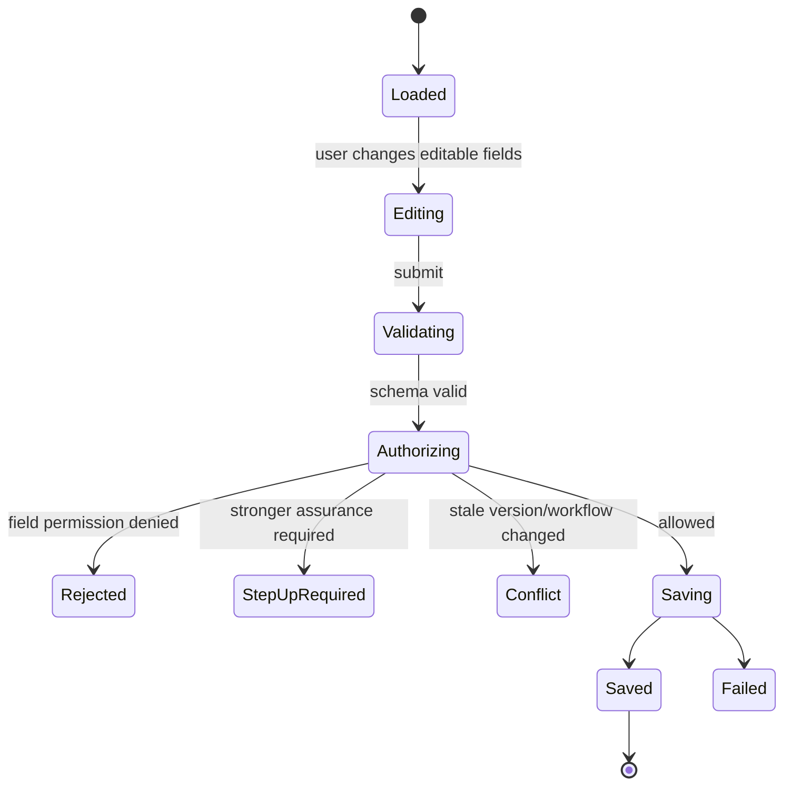
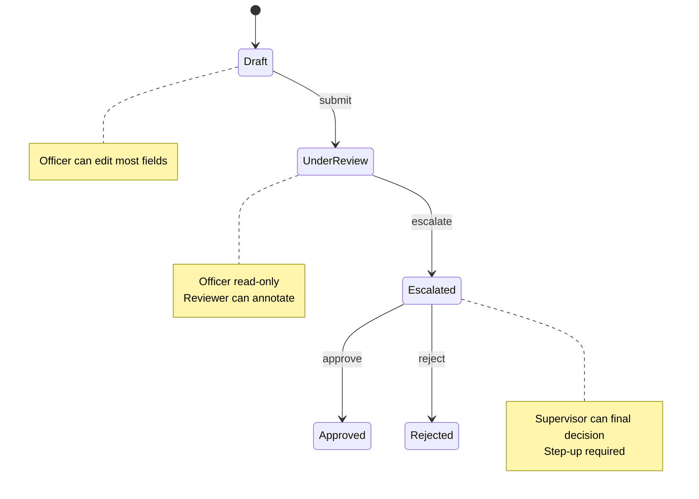
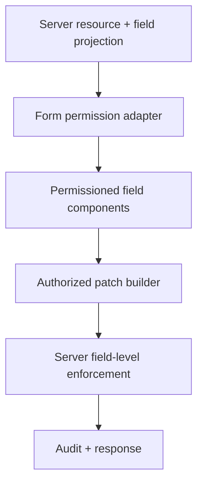

# Part 054 — Forms and Field-level Permission

Forms are not input containers.

Forms are mutation surfaces.

Every editable field is a potential write operation against some resource attribute.

That means field-level permission is not a nice-to-have UI detail. It is the bridge between:

```txt
User intent -> form state -> validation -> authorization -> mutation -> audit
```

In simple apps, the question is:

```txt
Can the user edit this page?
```

In serious systems, the question becomes:

```txt
Which fields can this user view, edit, mask, submit, or request access to, for this resource, in this tenant, at this workflow state, under this session assurance level?
```

That sounds long because the real system is long.

A regulated case-management platform, banking workflow, healthcare portal, insurance claims system, internal admin console, or enterprise SaaS product rarely has one permission for the entire form.

It has field-specific constraints.

Example:

| Field | Viewer | Case officer | Supervisor | Auditor |
|---|---|---|---|---|
| Case title | view | edit | edit | view |
| Risk score | masked | view | edit | view |
| Enforcement recommendation | hidden | edit draft | approve | view |
| Final decision | hidden | view | edit after step-up | view |
| Internal notes | hidden | edit own | view all | view all |
| Sanction amount | hidden | propose | approve with limit | view |

If the frontend treats this as a single `canEditCase` boolean, it will either overexpose fields or create a maze of one-off conditions.

This part designs the field-level permission model properly.

---

## 1. The core principle

Field-level permission has two halves.

```txt
Frontend: project field capability into a safe and understandable form UI.
Backend: enforce read/write permission per field/resource/action on every request.
```

The frontend can decide:

- whether a field is shown,
- whether it is read-only,
- whether it is masked,
- whether it prompts for step-up,
- whether it asks for change reason,
- whether it disables submit,
- whether it shows a request-access CTA.

The backend must decide:

- whether the user can read the field value,
- whether the user can submit changes to that field,
- whether the submitted value satisfies policy constraints,
- whether workflow state permits the change,
- whether the mutation should be audited,
- whether stale decisions must be rejected.

A React form cannot be the enforcement boundary because the user can modify DOM, bypass disabled inputs, call API directly, replay requests, or send fields not visible in the UI.

---

## 2. Mental model: form as a state transition

A form submission is not just data save.

It is a state transition.



Notice the order:

```txt
input -> validation -> authorization -> mutation
```

In practice, validation and authorization may happen together on the server, but conceptually they are not the same thing.

Validation asks:

```txt
Is this value well-formed?
```

Authorization asks:

```txt
May this subject change this field on this resource right now?
```

Do not collapse these concepts.

---

## 3. Validation is not authorization

A common mistake:

```ts
const schema = z.object({
  title: z.string().min(1),
  sanctionAmount: z.number().max(1_000_000),
});
```

Then assume:

```txt
If the submitted payload passes schema validation, it is safe.
```

It is not safe.

The user may not be allowed to set `sanctionAmount` at all.

Validation checks shape and domain constraints.

Authorization checks authority.

You need both.

```ts
const patch = validatePatch(request.body);

const decision = await authorizeFieldPatch({
  subject: session.subject,
  tenantId: session.tenantId,
  resourceType: "case",
  resourceId: params.caseId,
  patch,
  context: {
    workflowState: caseRecord.state,
    assuranceLevel: session.assuranceLevel,
  },
});

if (!decision.allowed) {
  throw forbidden(decision.safeProblemDetails);
}

await updateCaseFields(patch);
```

The frontend can help avoid invalid/unauthorized submissions.

The backend still decides.

---

## 4. Field modes

A field-level permission system should represent modes explicitly.

```ts
export type FieldMode =
  | "hidden"
  | "masked"
  | "readonly"
  | "editable"
  | "requires_step_up"
  | "requestable";
```

Meaning:

| Mode | UI behavior | Data exposure | Submit behavior |
|---|---|---|---|
| `hidden` | Field absent | No value exposed | Must not submit |
| `masked` | Field shown as redacted | Value not exposed or partially exposed | Must not submit actual value |
| `readonly` | Field visible but not editable | Value exposed | Submit only if backend allows unchanged echo, preferably omit |
| `editable` | Field editable | Value exposed | Submit changed value |
| `requires_step_up` | Field locked until verification | Depends on policy | Submit blocked until step-up |
| `requestable` | Access request CTA | Usually no value exposed | Submit blocked |

Do not use a single `disabled` boolean for all of this.

---

## 5. Field permission contract

A server-projected field contract might look like this:

```json
{
  "resource": {
    "type": "case",
    "id": "case_123",
    "version": "v17",
    "workflowState": "UNDER_REVIEW"
  },
  "policyVersion": "pol_2026_07_08_01",
  "fields": {
    "title": {
      "mode": "editable",
      "actions": ["case.field.title.update"],
      "constraints": {
        "maxLength": 120
      }
    },
    "riskScore": {
      "mode": "readonly",
      "reasonCode": "computed_field"
    },
    "sanctionAmount": {
      "mode": "editable",
      "constraints": {
        "min": 0,
        "max": 50000,
        "requiresChangeReason": true
      }
    },
    "internalNotes": {
      "mode": "hidden",
      "reasonCode": "missing_permission"
    },
    "finalDecision": {
      "mode": "requires_step_up",
      "reasonCode": "requires_mfa",
      "stepUpHref": "/verify?intent=case.finalDecision.update"
    }
  }
}
```

This contract gives React enough information to render correctly without embedding domain policy in components.

The backend still revalidates all submitted changes.

---

## 6. TypeScript model

```ts
export interface FieldConstraint {
  required?: boolean;
  maxLength?: number;
  minLength?: number;
  min?: number;
  max?: number;
  pattern?: string;
  allowedValues?: string[];
  requiresChangeReason?: boolean;
  requiresAttachment?: boolean;
}

export interface FieldDecision {
  field: string;
  label?: string;
  mode: FieldMode;
  reasonCode?: string;
  safeUserMessage?: string;
  constraints?: FieldConstraint;
  stepUpHref?: string;
  requestAccessHref?: string;
  policyVersion?: string;
}

export interface FormPermissionProjection<TFields extends string = string> {
  resource: {
    type: string;
    id: string;
    version: string;
    workflowState?: string;
  };
  tenantId: string;
  policyVersion: string;
  fields: Record<TFields, FieldDecision>;
}
```

Then field rendering becomes mechanical.

```tsx
function fieldMode(projection: FormPermissionProjection, field: string): FieldMode {
  return projection.fields[field]?.mode ?? "hidden";
}
```

Defaulting to `hidden` is intentional.

Unknown field permission should not expose a field.

---

## 7. Rendering field permission

A field wrapper can centralize semantics.

```tsx
interface PermissionedFieldProps<TValue> {
  decision: FieldDecision;
  label: string;
  value: TValue;
  renderEditable: (props: { value: TValue; disabled?: boolean; readOnly?: boolean }) => React.ReactNode;
  renderReadonly?: (value: TValue) => React.ReactNode;
}

export function PermissionedField<TValue>({
  decision,
  label,
  value,
  renderEditable,
  renderReadonly,
}: PermissionedFieldProps<TValue>) {
  switch (decision.mode) {
    case "hidden":
      return null;

    case "masked":
      return <ReadOnlyField label={label} value="••••••" />;

    case "readonly":
      return renderReadonly ? (
        <>{renderReadonly(value)}</>
      ) : (
        <FieldFrame label={label}>{renderEditable({ value, readOnly: true })}</FieldFrame>
      );

    case "requires_step_up":
      return <StepUpField label={label} decision={decision} />;

    case "requestable":
      return <RequestableField label={label} decision={decision} />;

    case "editable":
      return <FieldFrame label={label}>{renderEditable({ value })}</FieldFrame>;
  }
}
```

This prevents every form from reinventing hidden/masked/readonly behavior.

---

## 8. `readonly` vs `disabled`

This distinction matters.

`readonly` fields can still be focusable and generally submitted as part of form data depending on the control type.

`disabled` controls are not submitted and generally cannot receive focus.

For authorization UI, both have risks.

### `readonly`

Good for:

- showing immutable values,
- copyable text,
- fields visible but not editable,
- audit-friendly review screens.

Risk:

- users may still submit the value,
- malicious users can remove `readonly` in DevTools,
- backend must ignore/reject unauthorized modifications.

### `disabled`

Good for:

- actions unavailable due to workflow state,
- controls that should not participate in submit,
- explicit disabled interaction.

Risk:

- disabled field values are omitted from native form submit,
- screen reader/focus behavior differs,
- using disabled for security is false confidence.

Recommended approach for important forms:

```txt
Submit a deliberate patch of changed editable fields, not a raw serialization of all DOM controls.
```

---

## 9. Submit patch, not full form dump

Do not submit everything the form knows.

Submit only authorized changed fields.

Weak pattern:

```ts
await api.updateCase(formValues);
```

Better pattern:

```ts
const patch = buildAuthorizedPatch({
  initialValues,
  currentValues,
  fieldDecisions,
});

await api.patchCase({
  caseId,
  resourceVersion,
  policyVersion,
  patch,
});
```

Patch builder:

```ts
function buildAuthorizedPatch<T extends Record<string, unknown>>({
  initialValues,
  currentValues,
  fieldDecisions,
}: {
  initialValues: T;
  currentValues: T;
  fieldDecisions: Record<keyof T, FieldDecision>;
}) {
  const patch: Partial<T> = {};

  for (const key of Object.keys(currentValues) as Array<keyof T>) {
    const decision = fieldDecisions[key];

    if (!decision || decision.mode !== "editable") {
      continue;
    }

    if (!Object.is(currentValues[key], initialValues[key])) {
      patch[key] = currentValues[key];
    }
  }

  return patch;
}
```

This reduces accidental unauthorized writes.

It does not replace backend enforcement.

---

## 10. Backend enforcement for field patches

The backend should reject unauthorized field changes even when the frontend behaves correctly.

Example server-side logic:

```ts
async function authorizeCasePatch(input: {
  subject: Subject;
  caseRecord: CaseRecord;
  patch: Record<string, unknown>;
  tenantId: string;
  assuranceLevel: string;
}) {
  const deniedFields: Array<{ field: string; reasonCode: string }> = [];

  for (const field of Object.keys(input.patch)) {
    const decision = await policy.check({
      subject: input.subject,
      action: `case.field.${field}.update`,
      resource: {
        type: "case",
        id: input.caseRecord.id,
        tenantId: input.tenantId,
        state: input.caseRecord.state,
      },
      context: {
        assuranceLevel: input.assuranceLevel,
      },
    });

    if (!decision.allowed) {
      deniedFields.push({ field, reasonCode: decision.reasonCode });
    }
  }

  if (deniedFields.length > 0) {
    return { allowed: false, deniedFields };
  }

  return { allowed: true };
}
```

Also check constraints:

```ts
if (field === "sanctionAmount" && value > subject.approvalLimit) {
  deny("approval_limit_exceeded");
}
```

Field-level permission often includes value-level constraints.

---

## 11. Field constraints as authorization obligations

Constraints are not always validation.

Some are obligations.

Example:

```json
{
  "sanctionAmount": {
    "mode": "editable",
    "constraints": {
      "max": 50000,
      "requiresChangeReason": true,
      "requiresAttachment": true
    }
  }
}
```

Meaning:

```txt
The user may edit sanctionAmount only up to 50,000 and must provide a reason and attachment.
```

This is both UX and policy.

The form should render the required reason field.

The server must enforce it.

```tsx
{sanctionDecision.constraints?.requiresChangeReason && (
  <TextArea
    label="Reason for changing sanction amount"
    value={changeReason}
    onChange={setChangeReason}
    required
  />
)}
```

Do not allow frontend-only obligations.

---

## 12. Field visibility and data minimization

If a user cannot view a field, the server should ideally not send the value.

Bad response:

```json
{
  "salary": 200000,
  "fieldPermissions": {
    "salary": { "mode": "hidden" }
  }
}
```

The UI hides salary, but the value is in the network response.

Better response:

```json
{
  "fieldPermissions": {
    "salary": { "mode": "hidden" }
  }
}
```

Or masked response:

```json
{
  "salary": null,
  "salaryDisplay": "••••••",
  "fieldPermissions": {
    "salary": { "mode": "masked" }
  }
}
```

Hidden means hidden from UI and payload unless there is a strong reason otherwise.

Frontend hiding is not data minimization.

Server response shaping is data minimization.

---

## 13. Field-level read permission vs write permission

Read and write are different permissions.

A user may:

- read but not write,
- write but not read existing value in rare workflows,
- view masked value but update with explicit confirmation,
- edit draft value but not final value,
- propose change but not approve change.

Represent read/write separately if needed.

```ts
interface FieldAccess {
  read: "hidden" | "masked" | "visible";
  write: "none" | "propose" | "edit" | "approve" | "requires_step_up";
}
```

Example:

```json
{
  "field": "sanctionAmount",
  "read": "visible",
  "write": "propose"
}
```

The UI may render:

```txt
Propose new amount
```

instead of:

```txt
Save
```

This is important in regulated workflows where users submit proposals, not final mutations.

---

## 14. Workflow-state-driven fields

Fields often change permissions by workflow state.



Do not hardcode workflow state checks in React components.

Bad:

```tsx
const canEdit = user.role === "officer" && case.state === "DRAFT";
```

Better:

```tsx
const titleDecision = fieldPermissions.title;
```

The frontend can know workflow state for display.

The field permission projection should decide editability.

---

## 15. Multi-tenant forms

A field decision must be scoped to tenant context.

A user can be:

- admin in tenant A,
- viewer in tenant B,
- suspended in tenant C,
- support impersonator in tenant D.

A cached form permission from tenant A must not apply in tenant B.

Cache key:

```ts
const queryKey = [
  "case-form",
  tenantId,
  subjectId,
  caseId,
  sessionEpoch,
  policyVersion,
];
```

On tenant switch:

- cancel in-flight form requests,
- discard draft state or mark it tenant-bound,
- clear field permission projection,
- re-fetch resource and permissions,
- prevent stale submit.

Do not preserve editable fields across tenant context changes.

---

## 16. Stale permission handling

Permission can change while the form is open.

Causes:

- role changed,
- case assigned to someone else,
- workflow advanced,
- tenant switched,
- session assurance expired,
- resource locked,
- policy version deployed,
- account suspended,
- supervisor revoked access.

Frontend must be ready.

Submission payload should include resource and policy metadata.

```json
{
  "resourceVersion": "v17",
  "policyVersion": "pol_2026_07_08_01",
  "patch": {
    "title": "Updated title"
  }
}
```

Server may return:

```json
{
  "type": "https://example.com/problems/permission-stale",
  "title": "Permission changed",
  "status": 403,
  "code": "PERMISSION_STALE",
  "safeUserMessage": "Your access changed while editing. Review the latest version and try again."
}
```

React response:

- stop optimistic save,
- re-fetch resource and field permissions,
- preserve user draft only if safe,
- show diff if appropriate,
- avoid resubmitting automatically.

---

## 17. Preserving drafts safely

When permission changes, should you keep unsaved draft values?

It depends.

Safe for:

- non-sensitive text fields user authored,
- local validation errors,
- client-only notes not yet sent.

Unsafe for:

- values user no longer has permission to view,
- fields that became hidden,
- cross-tenant drafts,
- impersonation session drafts,
- fields containing privileged data.

Draft preservation rule:

```ts
function canPreserveDraftField(field: string, nextDecision: FieldDecision) {
  return nextDecision.mode === "editable" || nextDecision.mode === "readonly";
}
```

If a field becomes hidden or masked, clear it from memory.

```ts
for (const [field, decision] of Object.entries(nextPermissions.fields)) {
  if (decision.mode === "hidden" || decision.mode === "masked") {
    draft.clear(field);
  }
}
```

This is not just UX.

It is client-side data minimization after permission change.

---

## 18. Step-up for fields

Some fields require stronger authentication before editing.

Examples:

- final enforcement decision,
- sanction amount above threshold,
- payment destination,
- API key secret rotation,
- user role assignment,
- destructive account action.

Field decision:

```json
{
  "finalDecision": {
    "mode": "requires_step_up",
    "reasonCode": "requires_mfa",
    "stepUpHref": "/verify?intent=case.finalDecision.update&caseId=case_123"
  }
}
```

UI:

```tsx
function StepUpField({ label, decision }: { label: string; decision: FieldDecision }) {
  return (
    <FieldFrame label={label}>
      <InlineMessage>
        Verification is required before editing this field.
        <Button onClick={() => navigate(decision.stepUpHref!)}>Verify</Button>
      </InlineMessage>
    </FieldFrame>
  );
}
```

After step-up:

- session assurance level changes,
- session epoch may change,
- field permission projection must refresh,
- form must not assume the old decision became editable automatically.

---

## 19. Dynamic field constraints

Some constraints depend on subject/resource/context.

Example:

```txt
A supervisor can approve sanctions up to their approval limit.
```

Projection:

```json
{
  "sanctionAmount": {
    "mode": "editable",
    "constraints": {
      "min": 0,
      "max": 50000
    },
    "safeUserMessage": "You can approve amounts up to 50,000."
  }
}
```

Frontend uses it for UX.

Backend enforces it for security.

Do not send internal calculations unless safe.

Maybe saying `50,000` is fine.

Maybe saying `because your approval tier is S2` leaks internal hierarchy.

Reason copy is policy.

---

## 20. Form submit button authorization

Submit is not a single permission.

A form submit may contain multiple field changes.

Submit eligibility is derived from:

- at least one editable changed field,
- all changed fields authorized,
- required obligations satisfied,
- schema validation passed,
- resource version not stale,
- session assurance sufficient,
- tenant context stable,
- no pending permission refresh.

```ts
interface SubmitDecision {
  status: "allowed" | "disabled" | "requires_step_up" | "stale";
  reasons: string[];
}
```

Example:

```ts
function deriveSubmitDecision(input: {
  patch: Record<string, unknown>;
  fieldDecisions: Record<string, FieldDecision>;
  isValid: boolean;
  isPermissionRefreshing: boolean;
}): SubmitDecision {
  if (input.isPermissionRefreshing) {
    return { status: "disabled", reasons: ["Checking access..."] };
  }

  if (!input.isValid) {
    return { status: "disabled", reasons: ["Fix validation errors before saving."] };
  }

  const fields = Object.keys(input.patch);

  if (fields.length === 0) {
    return { status: "disabled", reasons: ["No changes to save."] };
  }

  const denied = fields.filter((field) => input.fieldDecisions[field]?.mode !== "editable");

  if (denied.length > 0) {
    return { status: "stale", reasons: ["Your access changed. Reload the form."] };
  }

  return { status: "allowed", reasons: [] };
}
```

The submit button can use `AuthorizedButton`, but the decision should be form-specific.

---

## 21. Read-only review screens

Many systems have review screens where users view a submitted form.

Do not reuse edit form with everything disabled without thinking.

Review screen requirements differ:

- show computed values,
- show audit trail,
- show who changed what,
- show hidden fields only if readable,
- show masked fields consistently,
- show decision reasons where safe,
- show propose/approve/reject actions separately.

A good architecture separates:

```txt
Form editor       -> mutation-focused
Form review       -> read/audit-focused
Form approval     -> transition-focused
Form comparison   -> diff-focused
```

They may share field components, but they should not be the same permission model.

---

## 22. Multi-step forms

Multi-step forms introduce new risks.

A user may be allowed to edit step 1 but not step 3.

A later step may reveal fields the user should not see.

Step permissions should be explicit.

```json
{
  "steps": {
    "basicInfo": { "mode": "editable" },
    "riskAssessment": { "mode": "readonly" },
    "finalDecision": { "mode": "requires_step_up" }
  },
  "fields": {
    "title": { "mode": "editable" },
    "riskScore": { "mode": "readonly" },
    "finalDecision": { "mode": "requires_step_up" }
  }
}
```

Do not rely on client step navigation to hide inaccessible fields.

Server must shape data per step and reject unauthorized patch fields.

---

## 23. Field arrays and nested resources

Forms often contain arrays:

- team members,
- attachments,
- checklist items,
- addresses,
- line items,
- child cases,
- enforcement actions.

An array item may be a nested resource.

Do not treat it as a simple field.

```txt
case.enforcementActions[3].amount
```

May require authorization on:

```txt
enforcementAction.updateAmount
```

not merely:

```txt
case.update
```

Represent nested resource decisions.

```json
{
  "enforcementActions": [
    {
      "id": "action_1",
      "fields": {
        "amount": { "mode": "editable" },
        "recipient": { "mode": "readonly" }
      },
      "allowedActions": {
        "remove": { "status": "denied", "reasonCode": "workflow_state" }
      }
    }
  ]
}
```

This avoids over-broad parent permissions.

---

## 24. File fields

File upload/download fields have high risk.

A file input may require permission for:

- selecting a file,
- uploading a file,
- attaching to resource,
- downloading existing file,
- previewing file,
- deleting attachment,
- replacing attachment,
- viewing metadata,
- scanning result visibility.

Do not model all of that as `case.edit`.

Example:

```json
{
  "attachments": {
    "mode": "editable",
    "allowedActions": {
      "attachment.upload": { "status": "allowed" },
      "attachment.download": { "status": "allowed" },
      "attachment.delete": { "status": "denied", "reasonCode": "workflow_state" }
    }
  }
}
```

Uploading a file usually requires a server-issued upload target or direct API upload with server-side authorization.

Never assume that hiding the file input prevents upload abuse.

---

## 25. Optimistic UI and forms

Optimistic form saves are risky with authorization.

If the form optimistically updates a field and the server rejects authorization, the UI must roll back accurately.

Recommended approach:

- avoid optimistic UI for high-risk fields,
- use pending state for regulated mutations,
- include resource version and policy version,
- display server rejection safely,
- refresh field permissions after `403` or `409`,
- preserve draft only if still safe.

Example:

```ts
try {
  await savePatch(patch);
  toast.success("Changes saved.");
} catch (error) {
  if (isPermissionStale(error)) {
    await refetchFormProjection();
    toast.error("Your access changed. Review the latest form before saving again.");
    return;
  }

  if (isForbidden(error)) {
    discardUnauthorizedDraftFields(error.deniedFields);
    toast.error(error.safeUserMessage);
    return;
  }

  toast.error("Could not save changes.");
}
```

Do not auto-retry forbidden submissions.

---

## 26. Error response shape for field denial

A field-level denial should return structured errors.

```json
{
  "type": "https://example.com/problems/field-authorization-denied",
  "title": "Some fields could not be changed",
  "status": 403,
  "code": "FIELD_AUTHORIZATION_DENIED",
  "safeUserMessage": "Some changes are no longer allowed.",
  "deniedFields": [
    {
      "field": "sanctionAmount",
      "reasonCode": "approval_limit_exceeded",
      "safeUserMessage": "You cannot approve this amount."
    },
    {
      "field": "finalDecision",
      "reasonCode": "requires_mfa",
      "safeUserMessage": "Verification is required before changing the final decision."
    }
  ],
  "policyVersion": "pol_2026_07_08_02"
}
```

React can map errors back to fields.

```ts
for (const deniedField of error.deniedFields) {
  form.setError(deniedField.field, {
    type: "authorization",
    message: deniedField.safeUserMessage,
  });
}
```

This is better than a generic `403 Forbidden` toast.

---

## 27. Controlled components and permission changes

Controlled inputs keep state in React.

When a field becomes hidden, React state may still hold the value.

That matters.

If a user loses permission to view a field, remove the value from client state if possible.

```ts
useEffect(() => {
  for (const field of Object.keys(values)) {
    const decision = fieldDecisions[field];
    if (decision?.mode === "hidden" || decision?.mode === "masked") {
      setValue(field, undefined);
    }
  }
}, [fieldDecisions]);
```

Be careful with form libraries that preserve unmounted field values.

Unmounting a field does not always erase its value from form state.

Configure or clear intentionally.

---

## 28. Hidden fields are not secure fields

HTML hidden inputs are still client-controlled.

Bad:

```html
<input type="hidden" name="role" value="viewer" />
```

Then server trusts it.

Never trust hidden inputs for authority.

Hidden form fields can carry harmless UI state, but never:

- user role,
- tenant id without server verification,
- price,
- approval limit,
- owner id,
- workflow state,
- permission decision,
- policy version as authority.

The server may accept version IDs as concurrency hints.

It must not trust them as authorization proof.

---

## 29. Permission-aware schema generation

You can derive client validation schema from field constraints.

```ts
function buildClientSchema(fields: Record<string, FieldDecision>) {
  const shape: Record<string, unknown> = {};

  for (const [field, decision] of Object.entries(fields)) {
    if (decision.mode !== "editable") continue;

    shape[field] = createValidatorFromConstraints(decision.constraints);
  }

  return shape;
}
```

This helps UX.

But never let server validation depend on client-generated schema.

Server owns final validation and authorization.

Client schema is advisory.

---

## 30. Admin and impersonation forms

Impersonation makes forms more dangerous.

A support user may view the UI as another user, but should not perform all actions as that user.

Field projection should include impersonation context.

```json
{
  "impersonation": {
    "active": true,
    "mode": "view_only_support"
  },
  "fields": {
    "email": { "mode": "readonly" },
    "plan": { "mode": "readonly" },
    "internalSupportNote": { "mode": "editable" }
  }
}
```

UI should show a clear impersonation banner.

Mutations should be blocked or constrained server-side.

Audit should include actor and effective subject.

```txt
actor = support_user_123
subject = customer_user_456
action = support_note.create
```

Do not allow impersonation mode to silently inherit all user permissions.

---

## 31. Testing field-level permission

Field-level permission needs explicit test matrices.

### Unit tests

| Scenario | Expected |
|---|---|
| Hidden field | Not rendered and not included in patch |
| Masked field | Value not exposed and not submitted |
| Read-only field | Rendered read-only and excluded from patch if changed maliciously |
| Editable field | Included in patch only when changed |
| Step-up field | Shows verification CTA and submit blocked |
| Permission refresh | Stale fields cleared if hidden/masked |
| Constraint requires reason | Reason field rendered and required |
| Tenant switch | Draft cleared or scoped correctly |

Example:

```ts
it("excludes readonly fields from patch even if local state changes", () => {
  const patch = buildAuthorizedPatch({
    initialValues: { title: "A", riskScore: 90 },
    currentValues: { title: "B", riskScore: 10 },
    fieldDecisions: {
      title: { field: "title", mode: "editable" },
      riskScore: { field: "riskScore", mode: "readonly" },
    },
  });

  expect(patch).toEqual({ title: "B" });
});
```

### Integration tests

| Test | Why |
|---|---|
| Viewer opens form | No editable fields exposed |
| Editor opens draft | Draft fields editable |
| Editor opens submitted case | Fields become read-only |
| Supervisor opens escalated case | Approval fields editable |
| Role changes while form open | Submit denied, projection refreshed |
| Resource version changes | Conflict shown, no blind overwrite |
| Step-up expires | Sensitive field locked again |

### E2E tests

Do not only test UI absence.

Also test direct API denial.

```txt
Given viewer user
When viewer sends PATCH /cases/:id {sanctionAmount: 1000}
Then API returns 403
And audit logs denied mutation attempt
```

The UI test proves exposure behavior.

The API test proves enforcement.

You need both.

---

## 32. Review checklist

Before merging a form with field-level permission, ask:

- Does the server shape readable fields based on read permission?
- Are hidden/masked field values absent from the payload where possible?
- Are field modes represented explicitly?
- Does the form submit a patch instead of full uncontrolled dump?
- Are only editable changed fields included in the patch?
- Does the server re-check every submitted field?
- Are workflow state and tenant context included in authorization?
- Are stale resource/policy versions handled?
- Are `readonly` and `disabled` used intentionally?
- Are hidden inputs not trusted for authority?
- Are field-level denial errors mapped back safely?
- Are draft values cleared when permission is lost?
- Is step-up handled as a permission mode?
- Are obligations like change reason enforced server-side?
- Are direct API forbidden tests present?

---

## 33. Practical implementation pattern

A strong form architecture has five layers.



Each layer has a clear job.

| Layer | Job |
|---|---|
| Server projection | Send only safe data and field modes |
| Form adapter | Convert projection into field props/schema |
| Field components | Render hidden/masked/readonly/editable consistently |
| Patch builder | Submit only changed editable fields |
| Server enforcement | Re-check every submitted field and constraint |

If any layer is missing, bugs become more likely.

---

## 34. What to internalize

Field-level permission is not about disabling inputs.

It is about preserving the integrity of resource mutation.

A field is an attribute of a protected resource.

Editing that field is an authorized action.

A form is a batch of field-level actions.

A submit is a state transition.

A good React form makes that visible:

```txt
Only authorized fields are editable.
Only changed editable fields are submitted.
The server re-checks every field.
The user gets safe, precise feedback when access changes.
```

That is the standard.

Anything weaker works for demos.

It does not hold up in serious systems.

---

## References

- OWASP Authorization Cheat Sheet — authorization must be checked on every request and access should be denied by default.
- React Documentation — form input rendering and conditional rendering concepts.
- MDN Web Docs — `disabled`, `readonly`, form-control behavior, and accessibility semantics.
