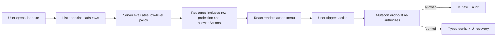
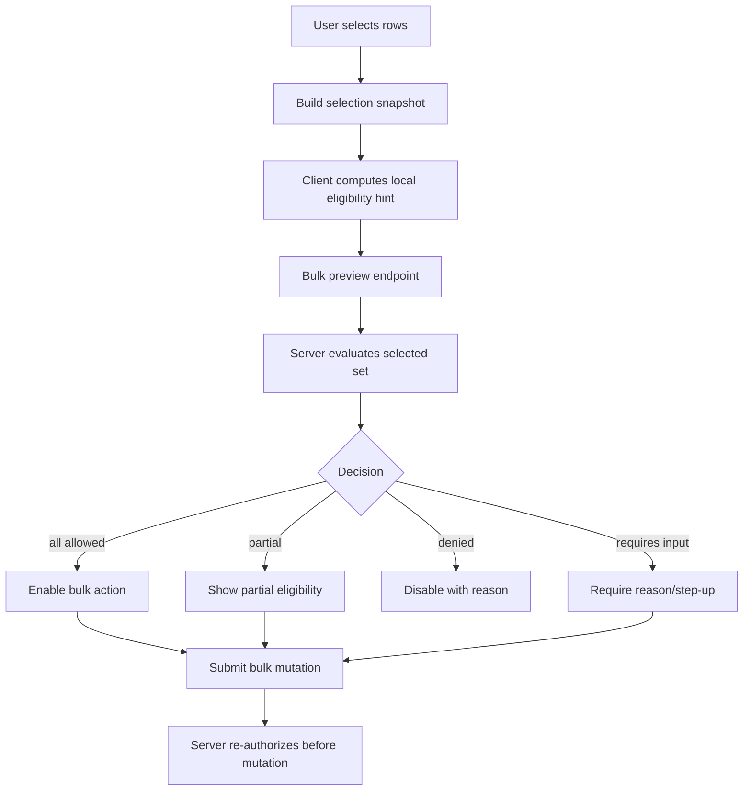
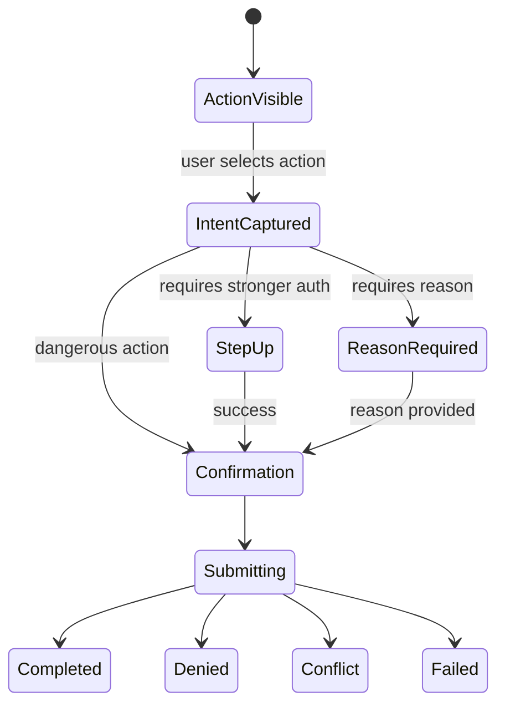

# Part 055 — Table Row Action Authorization

A table is not just a data display.

A table is a compressed map of many resources and many possible actions.

That is why table authorization is one of the first places where simple permission models break.

A normal product table asks:

```txt
Can the current user delete cases?
```

A serious system asks:

```txt
For each visible row, which actions can this user perform on that specific resource,
in this tenant, at this workflow state, with this ownership relationship,
under this session assurance level, considering stale policy and bulk constraints?
```

The difference matters.

The user may be allowed to close one case but not another. They may be allowed to edit draft records but only view submitted records. They may approve records assigned to their unit but not records they created themselves. They may export low-risk rows but require step-up authentication for high-risk rows. They may be allowed to select ten rows but not bulk-close the mixed selection because one row is locked.

If the table UI uses only a global `canEditCases` flag, it will lie.

It will either expose actions that will fail later, or hide actions the user should have.

This part designs row-level and bulk-action authorization as a first-class UI architecture.

---

## 1. Core principle

Row actions must be resource-specific.

```txt
Global permission answers: can this user generally perform an action type?
Row permission answers: can this user perform this action on this exact resource now?
```

The frontend may render action affordances, explanations, disabled states, and bulk previews.

The backend must still enforce authorization at mutation time.

A row action button is not a permission check.

It is a projection of a server-side decision.



The repeated server authorization in the mutation endpoint is not duplication. It is the real enforcement boundary.

The list response is a hint for good UX.

The mutation check is the authority.

---

## 2. Why table authorization is harder than button authorization

A normal button represents one action against one known context.

A table represents:

- many resources,
- many workflow states,
- many row owners,
- many tenant scopes,
- many locks,
- many selected rows,
- many action combinations,
- many stale data possibilities,
- many visibility constraints.

Example:

| Row | State | Owner | Risk | Lock | Allowed actions |
|---|---|---|---|---|---|
| CASE-001 | draft | current user | low | none | edit, submit, delete |
| CASE-002 | submitted | another user | medium | none | view, comment |
| CASE-003 | pending approval | current user | high | none | view only, cannot approve own case |
| CASE-004 | pending approval | other unit | high | none | view only |
| CASE-005 | pending approval | same unit | high | legal hold | view, request unlock |
| CASE-006 | approved | same unit | high | none | view, export with step-up |

There is no honest global boolean for this table.

The UI needs a row-specific decision contract.

---

## 3. The wrong pattern: global role checks in table cells

This is common and brittle:

```tsx
function CaseRowActions({ row }: { row: CaseRow }) {
  const { user } = useAuth();

  return (
    <Menu>
      {user.role === 'admin' && <MenuItem>Edit</MenuItem>}
      {user.role === 'admin' && <MenuItem>Delete</MenuItem>}
      {user.role === 'supervisor' && <MenuItem>Approve</MenuItem>}
    </Menu>
  );
}
```

It looks simple, but it encodes multiple false assumptions:

1. role equals permission,
2. permission is not resource-specific,
3. workflow state does not matter,
4. tenant does not matter,
5. ownership does not matter,
6. legal hold does not matter,
7. stale role/session changes do not matter,
8. the backend will probably accept whatever the UI exposes.

The actual bug is not the syntax.

The bug is the model.

---

## 4. Better model: rows carry an action projection

The list endpoint should return rows plus a permission projection for each row.

```ts
export type ActionId =
  | 'case.view'
  | 'case.edit'
  | 'case.submit'
  | 'case.approve'
  | 'case.reject'
  | 'case.delete'
  | 'case.export'
  | 'case.request_unlock';

export type PermissionMode =
  | 'allowed'
  | 'denied'
  | 'requires_step_up'
  | 'requires_reason'
  | 'requires_unlock'
  | 'unknown';

export type RowActionDecision = {
  action: ActionId;
  mode: PermissionMode;
  reasonCode?: string;
  reasonText?: string;
  requiredAssuranceLevel?: 'aal1' | 'aal2' | 'aal3';
  requiredFields?: string[];
  constraints?: Record<string, unknown>;
};

export type CaseListRow = {
  id: string;
  version: number;
  tenantId: string;
  displayId: string;
  title: string;
  status: 'draft' | 'submitted' | 'pending_approval' | 'approved' | 'closed';
  riskLevel: 'low' | 'medium' | 'high';
  locked: boolean;
  allowedActions: RowActionDecision[];
};
```

The row does not need to expose the entire policy.

It exposes a safe projection that helps the UI behave correctly.

The server remains the authority.

---

## 5. Action decision shape

A boolean is too small for serious authorization.

A row action decision should answer more than yes/no.

```ts
export type Decision =
  | {
      mode: 'allowed';
      action: ActionId;
    }
  | {
      mode: 'denied';
      action: ActionId;
      reasonCode: string;
      reasonText: string;
    }
  | {
      mode: 'requires_step_up';
      action: ActionId;
      reasonCode: string;
      requiredAssuranceLevel: 'aal2' | 'aal3';
    }
  | {
      mode: 'requires_reason';
      action: ActionId;
      requiredFields: ['changeReason'];
    }
  | {
      mode: 'requires_unlock';
      action: ActionId;
      reasonCode: 'RESOURCE_LOCKED';
    };
```

Why?

Because a row action often has more than two outcomes:

| Decision | UI behavior |
|---|---|
| `allowed` | Show enabled action. |
| `denied` | Hide or show disabled with explanation. |
| `requires_step_up` | Show action, trigger step-up before mutation. |
| `requires_reason` | Show action, open modal requiring reason. |
| `requires_unlock` | Show request-unlock action instead of edit/delete. |
| `unknown` | Fail closed and revalidate. |

A mature UI does not reduce all of that to `true` or `false`.

---

## 6. Row action rendering model

Render row actions from decisions, not from roles.

```tsx
const ACTION_LABEL: Record<ActionId, string> = {
  'case.view': 'View',
  'case.edit': 'Edit',
  'case.submit': 'Submit',
  'case.approve': 'Approve',
  'case.reject': 'Reject',
  'case.delete': 'Delete',
  'case.export': 'Export',
  'case.request_unlock': 'Request unlock',
};

function decisionFor(row: CaseListRow, action: ActionId): RowActionDecision | undefined {
  return row.allowedActions.find((entry) => entry.action === action);
}

function canExpose(decision: RowActionDecision | undefined) {
  if (!decision) return false;

  return (
    decision.mode === 'allowed' ||
    decision.mode === 'requires_step_up' ||
    decision.mode === 'requires_reason' ||
    decision.mode === 'requires_unlock'
  );
}

function isDisabled(decision: RowActionDecision | undefined) {
  return !decision || decision.mode === 'denied' || decision.mode === 'unknown';
}

function CaseRowActions({ row }: { row: CaseListRow }) {
  const actions: ActionId[] = [
    'case.view',
    'case.edit',
    'case.submit',
    'case.approve',
    'case.reject',
    'case.delete',
    'case.export',
  ];

  const visible = actions
    .map((action) => ({ action, decision: decisionFor(row, action) }))
    .filter(({ decision }) => canExpose(decision));

  if (visible.length === 0) return null;

  return (
    <ActionMenu label={`Actions for ${row.displayId}`}>
      {visible.map(({ action, decision }) => (
        <ActionMenuItem
          key={action}
          disabled={isDisabled(decision)}
          description={decision?.reasonText}
          onSelect={() => runRowAction(row, action, decision!)}
        >
          {ACTION_LABEL[action]}
        </ActionMenuItem>
      ))}
    </ActionMenu>
  );
}
```

Notice the absence of `user.role === ...`.

The UI consumes a permission projection.

The policy may be RBAC, ABAC, ReBAC, ACL, workflow-based, or a hybrid. The component should not know.

---

## 7. Hide, disable, or explain?

Row action UX has a real trade-off.

| Strategy | Use when | Risk |
|---|---|---|
| Hide denied action | Action is irrelevant or sensitive. | User may not understand why it is missing. |
| Disable with reason | User expects the action but cannot perform it now. | Can leak existence of capability or policy. |
| Show request access | Access can be requested legitimately. | Can create noisy access workflows. |
| Show step-up action | User can perform action after stronger auth. | Must not imply final authorization before server check. |
| Show alternative action | Example: `Request unlock` instead of `Edit`. | Can complicate menu semantics. |

The rule of thumb:

```txt
Hide capabilities the user should not know exist.
Explain capabilities the user reasonably expects but cannot use in the current state.
```

For internal enterprise systems, explanations are often better because they reduce support load:

```txt
Cannot approve: you created this case. Approval requires a different officer.
```

For public-facing systems, hidden actions may be safer:

```txt
Do not reveal admin-only moderation actions to normal users.
```

---

## 8. Accessibility: disabled action is not always enough

A disabled menu item without explanation is hostile.

It also creates testing ambiguity.

The user needs to know:

- is this action unavailable because data is loading?
- because they lack permission?
- because the row is locked?
- because the workflow state changed?
- because step-up authentication is required?

Example:

```tsx
<ActionMenuItem
  disabled={decision.mode === 'denied'}
  aria-describedby={`reason-${row.id}-approve`}
>
  Approve
</ActionMenuItem>

{decision.mode === 'denied' && (
  <span id={`reason-${row.id}-approve`} className="sr-only">
    {decision.reasonText}
  </span>
)}
```

Menu accessibility is not unique to authorization, but authorization makes it more important because unavailable actions often represent real business rules.

For row action menus, prefer predictable keyboard behavior, explicit labels, and stable focus behavior.

---

## 9. Bulk action authorization

Bulk authorization is not just `every selected row allows action`.

Bulk actions add another layer of policy.

Example:

```txt
User can close each case individually.
But user cannot bulk-close more than 50 cases.
User cannot bulk-close cases across tenants.
User cannot bulk-approve cases they created.
User must provide a reason for high-risk cases.
```

A bulk action decision depends on the entire selected set.



Do not rely only on client-side selection math.

Use a bulk preview endpoint when bulk operations are important.

---

## 10. Bulk preview contract

A good bulk preview endpoint tells the UI what will happen before the mutation.

```ts
export type BulkActionPreviewRequest = {
  action: ActionId;
  resourceType: 'case';
  resourceIds: string[];
  selectionVersion?: string;
};

export type BulkRowEligibility = {
  resourceId: string;
  displayId: string;
  version: number;
  decision:
    | { mode: 'allowed' }
    | { mode: 'denied'; reasonCode: string; reasonText: string }
    | { mode: 'requires_step_up'; requiredAssuranceLevel: 'aal2' | 'aal3' }
    | { mode: 'requires_reason'; requiredFields: string[] };
};

export type BulkActionPreviewResponse = {
  action: ActionId;
  totalSelected: number;
  allowedCount: number;
  deniedCount: number;
  requiresStepUpCount: number;
  requiresReasonCount: number;
  canSubmit: boolean;
  submitMode: 'all_or_nothing' | 'allowed_only' | 'not_allowed';
  rows: BulkRowEligibility[];
  policyVersion: string;
};
```

This lets the UI show a defensible preview:

```txt
Approve 18 cases

16 cases can be approved.
2 cases cannot be approved:
- CASE-003: you created this case.
- CASE-009: case is on legal hold.

Proceed with eligible cases only?
```

That is much better than letting the mutation fail after a vague 403.

---

## 11. All-or-nothing versus allowed-only bulk operations

Bulk operations need explicit semantics.

| Mode | Meaning | Use when |
|---|---|---|
| `all_or_nothing` | If any row is denied, reject the entire operation. | Financial posting, approval, state transitions requiring consistency. |
| `allowed_only` | Apply to allowed rows and skip denied rows. | Tagging, export, notification, non-critical batch operations. |
| `not_allowed` | Selection cannot be submitted. | Policy conflict, stale selection, tenant mismatch. |

Do not leave this implicit.

For regulated workflows, default to `all_or_nothing` unless the product explicitly supports partial success.

Partial success requires strong audit and user feedback.

---

## 12. Selection snapshot

Selection is not just an array of IDs.

Selection should capture the version of what the user selected.

```ts
export type SelectedResource = {
  id: string;
  version: number;
  displayId: string;
};

export type SelectionSnapshot = {
  resourceType: 'case';
  tenantId: string;
  selectedAt: string;
  policyVersion: string;
  rows: SelectedResource[];
};
```

Why include `version`?

Because the row may change between preview and submit.

Example:

1. User selects CASE-101 as `pending_approval`.
2. Preview says approval is allowed.
3. Another user approves CASE-101.
4. User submits stale approval.
5. Server must reject or convert to no-op according to business rules.

The frontend should expect this.

---

## 13. Stale row action recovery

A row action decision can go stale.

Common causes:

- session role changed,
- permission grant revoked,
- tenant switched,
- row workflow state changed,
- row lock acquired,
- legal hold applied,
- object moved to another unit,
- policy version changed,
- row version changed,
- step-up session expired.

Mutation endpoint should return typed denial, not just generic `403`.

```json
{
  "type": "authorization_denied",
  "code": "RESOURCE_STATE_CHANGED",
  "message": "This case can no longer be approved because it has already been approved.",
  "resourceId": "case_123",
  "currentVersion": 12,
  "requiredRefresh": ["row", "permissions"]
}
```

React should treat this as recoverable:

```tsx
async function runRowAction(row: CaseListRow, action: ActionId, decision: RowActionDecision) {
  if (decision.mode === 'requires_step_up') {
    await beginStepUp({ requiredAssuranceLevel: decision.requiredAssuranceLevel! });
  }

  try {
    await mutateRowAction({
      rowId: row.id,
      rowVersion: row.version,
      action,
    });

    toast.success('Action completed.');
    await revalidateList();
  } catch (error) {
    const problem = parseProblem(error);

    if (problem.code === 'RESOURCE_STATE_CHANGED') {
      toast.warning(problem.message);
      await revalidateRow(row.id);
      return;
    }

    if (problem.type === 'authorization_denied') {
      toast.error(problem.message);
      await revalidatePermissions();
      return;
    }

    throw error;
  }
}
```

This is not pessimistic.

It is honest.

---

## 14. Server-side mutation enforcement

The mutation endpoint must not trust the row action projection returned earlier.

Example server pseudo-code:

```ts
app.post('/api/cases/:caseId/actions/approve', async (req, res) => {
  const session = await requireSession(req);
  const caseRecord = await caseRepository.getForUpdate(req.params.caseId);

  const decision = await policyEngine.check({
    subject: session.subject,
    action: 'case.approve',
    resource: caseRecord,
    context: {
      tenantId: session.tenantId,
      assuranceLevel: session.assuranceLevel,
      requestId: req.id,
    },
  });

  if (decision.mode !== 'allowed') {
    await audit.denied({
      subjectId: session.subject.id,
      action: 'case.approve',
      resourceId: caseRecord.id,
      reasonCode: decision.reasonCode,
      requestId: req.id,
    });

    return res.status(decision.httpStatus ?? 403).json(toProblem(decision));
  }

  if (caseRecord.version !== req.body.expectedVersion) {
    return res.status(409).json({
      type: 'conflict',
      code: 'RESOURCE_VERSION_CHANGED',
      message: 'The case changed. Refresh and try again.',
    });
  }

  await workflow.approve(caseRecord, {
    actor: session.subject,
    reason: req.body.reason,
    requestId: req.id,
  });

  await audit.allowed({
    subjectId: session.subject.id,
    action: 'case.approve',
    resourceId: caseRecord.id,
    requestId: req.id,
  });

  return res.status(204).send();
});
```

The list page permission and the mutation permission may use the same policy engine.

But the mutation permission must still execute.

---

## 15. List endpoint projection

The list endpoint can evaluate row actions efficiently if it is designed for it.

```ts
app.get('/api/cases', async (req, res) => {
  const session = await requireSession(req);
  const rows = await caseRepository.search({
    tenantId: session.tenantId,
    filters: req.query,
  });

  const actionProjection = await policyEngine.batchCheck({
    subject: session.subject,
    resources: rows,
    actions: [
      'case.view',
      'case.edit',
      'case.submit',
      'case.approve',
      'case.reject',
      'case.delete',
      'case.export',
    ],
    context: {
      tenantId: session.tenantId,
      assuranceLevel: session.assuranceLevel,
    },
  });

  return res.json({
    rows: rows.map((row) => ({
      id: row.id,
      version: row.version,
      displayId: row.displayId,
      title: row.title,
      status: row.status,
      riskLevel: row.riskLevel,
      locked: row.locked,
      allowedActions: actionProjection.forResource(row.id),
    })),
    policyVersion: actionProjection.policyVersion,
  });
});
```

This avoids scattering policy logic across React cells.

It also supports batch evaluation and auditability.

---

## 16. Performance model

Row-level authorization can be expensive if implemented naively.

Avoid this shape:

```txt
For 100 rows and 8 actions, call policy engine 800 times serially.
```

Better options:

1. batch checks,
2. precomputed allowed actions,
3. coarse list filtering plus row-specific actions,
4. policy decision cache with short TTL,
5. relationship tuple batch evaluation,
6. database-side permission joins for simple ACLs,
7. policy snapshot/version for list page.

But do not sacrifice correctness for performance.

The most dangerous optimization is returning a row the user should not see because filtering was “too expensive”.

List visibility is authorization too.

---

## 17. Filtering versus action projection

There are two different questions:

```txt
Can the user see this row?
Can the user perform this action on this row?
```

Do not solve both with the same UI trick.

| Concern | Where it belongs |
|---|---|
| Row visibility | Server query/resource authorization. |
| Sensitive field masking | Server projection and frontend display mode. |
| Row action exposure | Server action projection and React rendering. |
| Mutation permission | Server mutation endpoint. |
| Denial explanation | Server decision contract and React UI. |

A table should not receive rows the user is not allowed to know exist.

That is not a row action problem.

That is list endpoint authorization.

---

## 18. Row action menus and dangerous actions

Dangerous actions need a different interaction shape.

Examples:

- delete,
- approve,
- close,
- publish,
- revoke access,
- export sensitive data,
- bulk transition,
- transfer ownership.

A serious row action pipeline:



Do not allow dangerous row actions to be one-click unless the domain explicitly supports it.

---

## 19. Confirmation dialog is not authorization

A confirmation dialog answers:

```txt
Did the user intend this action?
```

Authorization answers:

```txt
Is the user allowed to perform this action now?
```

These are different checks.

Bad:

```tsx
if (window.confirm('Delete this case?')) {
  await deleteCase(row.id);
}
```

Better:

```tsx
const decision = decisionFor(row, 'case.delete');

if (decision?.mode !== 'allowed') {
  showDenied(decision);
  return;
}

const confirmed = await confirmDangerousAction({
  title: `Delete ${row.displayId}?`,
  body: 'This action cannot be undone.',
  requireTypedConfirmation: row.riskLevel === 'high',
});

if (!confirmed) return;

await mutateRowAction({
  rowId: row.id,
  rowVersion: row.version,
  action: 'case.delete',
});
```

Still, the backend must re-authorize.

---

## 20. Optimistic UI and row actions

Optimistic UI is risky for authorization-sensitive operations.

Use optimistic UI only for low-risk, reversible, non-sensitive changes.

Safe-ish examples:

- starring a row,
- expanding/collapsing local UI,
- marking a local notification as read,
- applying a non-critical tag if backend can roll back cleanly.

Risky examples:

- approve,
- delete,
- transfer ownership,
- export,
- publish,
- revoke access,
- submit regulatory decision.

For risky actions, use pessimistic confirmation and server result.

```txt
The UI may show pending state.
It should not claim success before authorization and mutation complete.
```

---

## 21. Bulk optimistic UI is usually a bad idea

Bulk optimistic UI amplifies errors.

If a single optimistic row can lie, fifty optimistic rows can create chaos.

Prefer:

1. preview,
2. confirm,
3. submit,
4. show progress,
5. report exact success/failure per row,
6. revalidate list.

Bulk result contract:

```ts
export type BulkActionResult = {
  action: ActionId;
  totalRequested: number;
  succeeded: Array<{ resourceId: string; displayId: string; newVersion: number }>;
  failed: Array<{
    resourceId: string;
    displayId: string;
    status: 403 | 409 | 423 | 500;
    code: string;
    message: string;
  }>;
  auditBatchId: string;
};
```

A regulated UI should expose the audit batch ID or support reference for failure investigation.

---

## 22. Permission-aware table component boundary

Do not make every table know your auth system.

Create a boundary between generic table mechanics and auth-specific action projection.

```tsx
type TableRowAction<T> = {
  id: string;
  label: string;
  isVisible: (row: T) => boolean;
  isDisabled: (row: T) => boolean;
  disabledReason?: (row: T) => string | undefined;
  run: (row: T) => Promise<void>;
};

type PermissionAwareTableProps<T> = {
  rows: T[];
  getRowId: (row: T) => string;
  columns: Array<ColumnDef<T>>;
  actions: Array<TableRowAction<T>>;
};
```

Then adapt your authorization model outside the table core:

```tsx
const caseRowActions: Array<TableRowAction<CaseListRow>> = [
  {
    id: 'edit',
    label: 'Edit',
    isVisible: (row) => canExpose(decisionFor(row, 'case.edit')),
    isDisabled: (row) => isDisabled(decisionFor(row, 'case.edit')),
    disabledReason: (row) => decisionFor(row, 'case.edit')?.reasonText,
    run: (row) => runRowAction(row, 'case.edit', decisionFor(row, 'case.edit')!),
  },
  {
    id: 'approve',
    label: 'Approve',
    isVisible: (row) => canExpose(decisionFor(row, 'case.approve')),
    isDisabled: (row) => isDisabled(decisionFor(row, 'case.approve')),
    disabledReason: (row) => decisionFor(row, 'case.approve')?.reasonText,
    run: (row) => runRowAction(row, 'case.approve', decisionFor(row, 'case.approve')!),
  },
];
```

This keeps the table reusable.

The app-specific adapter understands permission decisions.

---

## 23. The command/query split

A list page has two authorization layers:

```txt
Query authorization: what rows and fields can be returned?
Command authorization: what actions can be performed?
```

Do not let command authorization compensate for weak query authorization.

Bad:

```txt
Return all cases, but hide edit/delete buttons for unauthorized rows.
```

Better:

```txt
Return only cases visible to the user.
For each visible case, return allowed actions.
Mutation endpoints re-authorize commands.
```

The first design leaks resource existence.

The second design separates visibility and mutability.

---

## 24. Row-level permission in paginated and virtualized tables

Pagination and virtualization add a subtle issue.

The user sees only a subset of rows, but the selected set may span pages.

Common cases:

- select rows across pages,
- select all matching filter,
- virtualized list renders only visible rows,
- stale row projections after filter changes,
- permission changes while selection persists.

Selection must be explicit.

There are two different selection modes:

```ts
export type SelectionMode =
  | {
      type: 'explicit_rows';
      rows: SelectedResource[];
    }
  | {
      type: 'query_match';
      queryId: string;
      excludedIds: string[];
    };
```

`query_match` is dangerous.

It means:

```txt
Apply this action to every resource matching the server-side query, not merely the rows visible in the browser.
```

That must be authorized and previewed server-side.

---

## 25. Export is a row/table action too

Export is often treated as a harmless table feature.

It is not harmless.

Export can bypass field masking, pagination, row-level visibility, and audit expectations.

Export authorization must answer:

- can the user export at all?
- which rows can be exported?
- which fields can be exported?
- is step-up required?
- is a business reason required?
- is the export limited by tenant/unit?
- must the export be watermarked?
- must the export be audited?
- should export be async with approval?

A good export preview:

```json
{
  "action": "case.export",
  "selection": "current_filter",
  "estimatedRows": 128,
  "allowedRows": 120,
  "excludedRows": 8,
  "fields": [
    { "name": "displayId", "mode": "allowed" },
    { "name": "riskScore", "mode": "masked" },
    { "name": "internalNotes", "mode": "denied" }
  ],
  "requiresReason": true,
  "requiresStepUp": true
}
```

A table export button is an authorization surface.

Treat it like one.

---

## 26. Multi-tenant row actions

Tenant scope must be explicit in row actions.

A row should include tenant identity if the UI can switch tenants or show cross-tenant data.

```ts
export type TenantScopedRow = {
  id: string;
  tenantId: string;
  tenantDisplayName?: string;
  allowedActions: RowActionDecision[];
};
```

Mutation request should not trust tenant from the browser as authority.

```ts
await policyEngine.check({
  subject: session.subject,
  action: 'case.approve',
  resource: caseRecord,
  context: {
    sessionTenantId: session.tenantId,
    resourceTenantId: caseRecord.tenantId,
  },
});
```

The backend should reject tenant mismatch.

The frontend should clear row selection when tenant changes.

---

## 27. Impersonation and row actions

When admin impersonation exists, row actions must show the active actor context.

There are at least two identities:

```txt
Real actor: support admin.
Effective subject: user being impersonated.
```

The UI should avoid ambiguity:

```txt
You are viewing as Maria Santos.
Actions will be audited as: support_admin_17 acting as maria_santos_42.
```

Some actions should be blocked during impersonation:

- payments,
- approval,
- credential changes,
- sensitive export,
- privilege grant,
- destructive admin action.

This should not be a scattered frontend condition.

It belongs in the permission decision:

```json
{
  "action": "case.approve",
  "mode": "denied",
  "reasonCode": "BLOCKED_DURING_IMPERSONATION",
  "reasonText": "Approval is disabled while impersonating another user."
}
```

---

## 28. Audit model

Row actions are audit-worthy because they bind user intent to a resource.

Audit event should capture:

- actor subject,
- effective subject if impersonating,
- tenant,
- resource id,
- action,
- decision,
- reason code,
- row version,
- policy version,
- request id,
- session id or session handle,
- assurance level,
- IP/device metadata where appropriate,
- submitted business reason,
- batch id for bulk action.

For denied actions, audit only what is appropriate.

In some systems, denied action audit is valuable.

In others, logging too much denial detail can create noise or leak sensitive metadata into logs.

Make this a policy decision.

---

## 29. Observability signals

Track row action behavior as product and security telemetry.

Useful metrics:

```txt
row_action_visible_total{action}
row_action_clicked_total{action}
row_action_denied_total{action,reason}
row_action_conflict_total{action}
bulk_preview_requested_total{action}
bulk_submit_denied_total{action,reason}
step_up_required_total{action}
step_up_completed_total{action}
```

Useful logs:

- row action click with request id,
- mutation denied with reason code,
- stale version conflict,
- permission projection version mismatch,
- bulk preview/submission mismatch.

High denial rates can mean:

- policy changed but UI cache is stale,
- list projection is wrong,
- users misunderstand workflow,
- role design is wrong,
- a client bug is exposing invalid actions,
- malicious probing.

---

## 30. Testing row action authorization

Test at four layers.

### 30.1 Unit tests

```ts
it('hides approve action when decision is denied and policy says action is sensitive', () => {
  const row = makeCaseRow({
    allowedActions: [
      {
        action: 'case.approve',
        mode: 'denied',
        reasonCode: 'CREATOR_CANNOT_APPROVE_OWN_CASE',
        reasonText: 'You cannot approve a case you created.',
      },
    ],
  });

  expect(getVisibleRowActions(row)).not.toContain('case.approve');
});
```

### 30.2 Component tests

```tsx
it('shows disabled action reason for expected but unavailable row action', async () => {
  render(<CaseRowActions row={makeLockedCaseRow()} />);

  await user.click(screen.getByRole('button', { name: /actions/i }));

  expect(screen.getByText(/request unlock/i)).toBeInTheDocument();
  expect(screen.queryByText(/^edit$/i)).not.toBeInTheDocument();
});
```

### 30.3 Integration tests

```txt
Given list endpoint returns allowed action
When mutation endpoint denies due to stale version
Then UI shows conflict message and refreshes row
```

### 30.4 E2E tests

```txt
User A creates case.
User A cannot approve own case in table row action.
User B with supervisor role can approve if same unit and case is pending approval.
User B cannot bulk approve mixed selection if one case is legal hold.
```

---

## 31. Test matrix

| Scenario | Expected UI | Expected server behavior |
|---|---|---|
| User can edit row | Edit visible/enabled | Mutation allowed. |
| User cannot edit row | Edit hidden or disabled with reason | Mutation denied if called directly. |
| Row locked | Edit replaced by request unlock | Edit mutation returns locked/denied. |
| Step-up required | Action visible, triggers step-up | Mutation allowed only after assurance updated. |
| Row state changed | Action may appear stale | Mutation returns conflict or typed denial. |
| Tenant changed | Selection cleared | Old tenant resource mutation denied. |
| Bulk partial allowed | Preview shows allowed/denied counts | Submit follows explicit bulk mode. |
| Export with masked fields | Export preview shows field modes | Export endpoint enforces field projection. |
| Impersonation active | Restricted actions denied | Audit records real and effective actor. |

---

## 32. Anti-pattern catalog

Avoid these patterns:

```txt
user.role === 'admin' inside row cell
```

```txt
One global canEdit flag for all rows
```

```txt
Returning hidden rows and relying on button hiding
```

```txt
Bulk action enabled if at least one row allows action without preview
```

```txt
Optimistic approval/delete before server response
```

```txt
Export button not checked as sensitive action
```

```txt
Disabled action with no explanation in internal workflow apps
```

```txt
Mutation endpoint trusting allowedActions from the list response
```

```txt
Selection persists across tenant switch
```

```txt
Direct API call succeeds even though row action was hidden
```

The last anti-pattern is the real security bug.

Everything else is usually a symptom.

---

## 33. Implementation checklist

Before shipping table row authorization, verify:

- [ ] list endpoint filters rows server-side by visibility permission,
- [ ] list response includes row-level allowed action projection,
- [ ] action decision shape is richer than boolean,
- [ ] row actions render from decisions, not roles,
- [ ] hidden/disabled/explained policy is explicit,
- [ ] dangerous actions require confirmation and/or reason,
- [ ] step-up actions are represented explicitly,
- [ ] mutation endpoints re-authorize every action,
- [ ] row version/conflict handling exists,
- [ ] permission/policy version is included where useful,
- [ ] tenant switch clears selection and table caches,
- [ ] bulk preview exists for sensitive bulk actions,
- [ ] bulk semantics are explicit: all-or-nothing or allowed-only,
- [ ] export is treated as an authorization-sensitive action,
- [ ] denied and allowed actions are audited appropriately,
- [ ] tests cover direct API bypass of hidden actions.

---

## 34. Mental compression

You can compress this whole part into one invariant:

```txt
A row action is allowed only if the exact subject can perform the exact action
on the exact resource in the exact current context, and the server confirms it
at mutation time.
```

React can help users see what is possible.

React must not become the authority for what is allowed.

That is the line.

---

## 35. What to carry forward

From this part, keep these rules:

1. table rows are resource instances,
2. row actions are resource-specific capability projections,
3. bulk actions require set-level authorization,
4. stale row permissions are normal,
5. exports are sensitive actions,
6. hidden buttons are not security,
7. mutation endpoints must re-authorize,
8. table UX should explain expected but unavailable actions,
9. row action telemetry is both product signal and security signal.

The next part moves from tables to navigation.

Navigation is another projection problem.

A sidebar, breadcrumb, tab bar, and command palette are all maps of possible destinations.

They should be permission-aware, but they must never be confused with access control enforcement.

---

## References

- OWASP Authorization Cheat Sheet — permission validation on every request and deny-by-default guidance.
- OWASP Top 10:2021 A01 Broken Access Control — least privilege and deny-by-default failure modes.
- React Conditional Rendering documentation — rendering different UI based on state.
- WAI-ARIA Authoring Practices Menu Button Pattern — menu button accessibility model for action menus.
