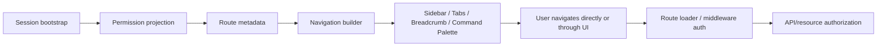

# Part 056 — Navigation/Menu Permission

Navigation is not access control.

Navigation is a map.

A sidebar tells the user where they can go. A tab bar tells them what views exist inside a resource. A breadcrumb tells them where they are in the hierarchy. A command palette tells them what actions or destinations are discoverable.

In an authenticated React app, all of those are permission projections.

But none of them is an enforcement boundary.

A hidden sidebar item does not secure a route.

A hidden tab does not secure a data endpoint.

A missing command palette action does not secure a mutation.

The real question is:

```txt
How do we make navigation honest, useful, tenant-aware, permission-aware,
and consistent with route/data/server enforcement without turning it into scattered role checks?
```

That is the focus of this part.

---

## 1. Core principle

Navigation permission has two responsibilities.

```txt
Frontend navigation: expose a safe and useful map of available destinations/actions.
Backend/router/API: enforce actual access when the destination or action is requested.
```

The navigation system should reduce confusion and accidental denial.

It should not be trusted as the only guard.



Navigation is upstream of access.

It is not a replacement for access.

---

## 2. The common bad pattern

This is common:

```tsx
function Sidebar() {
  const { user } = useAuth();

  return (
    <nav>
      <Link to="/dashboard">Dashboard</Link>
      {user.role === 'admin' && <Link to="/admin/users">Users</Link>}
      {user.role === 'manager' && <Link to="/reports">Reports</Link>}
      {user.role === 'auditor' && <Link to="/audit">Audit</Link>}
    </nav>
  );
}
```

This is not merely repetitive.

It creates architectural drift.

The sidebar now has its own policy language.

Routes may have another policy language.

Loaders may have another.

API endpoints may have another.

Soon, the app has four different versions of authorization.

The correct target is one permission vocabulary projected into multiple UI surfaces.

---

## 3. Navigation should be derived, not hand-authored everywhere

A good navigation model starts with route metadata and permission contract.

```ts
export type NavPolicy = {
  action: string;
  resourceType?: string;
  resourceIdParam?: string;
  requiresAuth?: boolean;
  requiresTenant?: boolean;
  requiresAssuranceLevel?: 'aal1' | 'aal2' | 'aal3';
};

export type NavItem = {
  id: string;
  label: string;
  to: string;
  icon?: string;
  group?: string;
  order?: number;
  policy?: NavPolicy;
  children?: NavItem[];
};
```

Example:

```ts
export const navCatalog: NavItem[] = [
  {
    id: 'dashboard',
    label: 'Dashboard',
    to: '/dashboard',
    policy: { action: 'dashboard.view' },
  },
  {
    id: 'cases',
    label: 'Cases',
    to: '/cases',
    policy: { action: 'case.list', requiresTenant: true },
  },
  {
    id: 'case-admin',
    label: 'Case Admin',
    to: '/admin/cases',
    policy: { action: 'case.admin' },
  },
  {
    id: 'audit-log',
    label: 'Audit Log',
    to: '/audit',
    policy: { action: 'audit.view' },
  },
];
```

Then the sidebar is generated from decisions.

Not from roles.

---

## 4. Navigation decision shape

A navigation item can be more than visible or hidden.

```ts
export type NavDecision =
  | {
      mode: 'visible';
    }
  | {
      mode: 'hidden';
      reasonCode?: string;
    }
  | {
      mode: 'disabled';
      reasonCode: string;
      reasonText: string;
    }
  | {
      mode: 'requires_tenant';
      reasonText: string;
    }
  | {
      mode: 'requires_step_up';
      requiredAssuranceLevel: 'aal2' | 'aal3';
      reasonText: string;
    };
```

Examples:

| Decision | UI behavior |
|---|---|
| `visible` | Show normal link. |
| `hidden` | Do not show item. |
| `disabled` | Show item but cannot activate; include explanation. |
| `requires_tenant` | Show item after tenant selection or direct user to tenant switcher. |
| `requires_step_up` | Show item but start step-up on activation. |

Why not just hide everything denied?

Because different navigation surfaces have different product jobs.

A sidebar should often be concise.

An admin console may need disabled items to explain missing setup.

A command palette should avoid showing sensitive commands that the user cannot execute.

A tab inside a resource may show disabled state to explain workflow constraints.

---

## 5. Route access and navigation exposure are different

Do not confuse these two questions:

```txt
Should a link be shown?
Should the route be accessible if requested?
```

They often have the same policy, but they are checked at different boundaries.

| Concern | Boundary |
|---|---|
| Sidebar item visible | Navigation projection. |
| Direct URL `/admin/users` allowed | Route loader/middleware. |
| API request from admin page allowed | API/resource authorization. |
| Admin menu item visible in command palette | Command projection. |
| Admin mutation allowed | Mutation endpoint authorization. |

The direct URL case is the key.

A user can type `/admin/users` manually.

If the route loads, the sidebar hiding was irrelevant.

---

## 6. Route metadata integration

If you use React Router, route metadata can be used as the source for navigation and auth policy.

Conceptually:

```ts
export const routes = [
  {
    path: '/cases',
    loader: casesLoader,
    handle: {
      nav: {
        id: 'cases',
        label: 'Cases',
        icon: 'folder',
        order: 20,
      },
      auth: {
        action: 'case.list',
        requiresTenant: true,
      },
    },
  },
  {
    path: '/admin/users',
    loader: usersAdminLoader,
    handle: {
      nav: {
        id: 'admin-users',
        label: 'Users',
        group: 'Admin',
        order: 90,
      },
      auth: {
        action: 'user.admin',
        requiresAssuranceLevel: 'aal2',
      },
    },
  },
];
```

The loader still checks authorization.

The navigation builder uses metadata for exposure.

```ts
export function buildNavigation(params: {
  catalog: NavItem[];
  permissions: PermissionSnapshot;
  tenantId?: string;
  assuranceLevel: 'aal1' | 'aal2' | 'aal3';
}): NavItem[] {
  return params.catalog
    .map((item) => projectNavItem(item, params))
    .filter((item): item is NavItem => item !== null)
    .sort((a, b) => (a.order ?? 0) - (b.order ?? 0));
}
```

This avoids duplicating sidebar policy across components.

---

## 7. Implementing nav projection

```ts
export type PermissionSnapshot = {
  version: string;
  tenantId?: string;
  can: (query: {
    action: string;
    resourceType?: string;
    resourceId?: string;
  }) => boolean;
};

function evaluateNavPolicy(
  item: NavItem,
  ctx: {
    permissions: PermissionSnapshot;
    tenantId?: string;
    assuranceLevel: 'aal1' | 'aal2' | 'aal3';
  },
): NavDecision {
  const policy = item.policy;

  if (!policy) return { mode: 'visible' };

  if (policy.requiresTenant && !ctx.tenantId) {
    return {
      mode: 'requires_tenant',
      reasonText: 'Choose an organization to view this section.',
    };
  }

  if (
    policy.requiresAssuranceLevel &&
    compareAssurance(ctx.assuranceLevel, policy.requiresAssuranceLevel) < 0
  ) {
    return {
      mode: 'requires_step_up',
      requiredAssuranceLevel: policy.requiresAssuranceLevel,
      reasonText: 'Additional verification is required.',
    };
  }

  const allowed = ctx.permissions.can({
    action: policy.action,
    resourceType: policy.resourceType,
  });

  if (!allowed) {
    return { mode: 'hidden', reasonCode: 'NAV_PERMISSION_DENIED' };
  }

  return { mode: 'visible' };
}
```

Then render from decisions:

```tsx
function SidebarNav({ items }: { items: NavItem[] }) {
  return (
    <nav aria-label="Primary navigation">
      {items.map((item) => (
        <SidebarNavItem key={item.id} item={item} />
      ))}
    </nav>
  );
}
```

The sidebar should not know how RBAC, ABAC, ReBAC, or ACL works.

It only consumes a permission snapshot.

---

## 8. Fail closed during unknown permission state

Do not render privileged navigation while permissions are loading.

Bad:

```tsx
if (permissions.loading) {
  return <FullSidebarWithEverything />;
}
```

Better:

```tsx
if (permissions.status === 'unknown') {
  return <SidebarSkeleton />;
}

if (permissions.status === 'anonymous') {
  return <PublicNavigation />;
}

return <SidebarNav items={buildNavigation(...)} />;
```

Unknown means unknown.

Unknown does not mean allowed.

This prevents privileged link flash during session bootstrap or hydration.

---

## 9. Sidebar permission

Sidebar navigation usually represents high-level product areas.

Use sidebar visibility for durable capabilities:

- case list,
- reports,
- admin,
- audit,
- billing,
- settings,
- integrations.

Do not use sidebar visibility for volatile object-level conditions.

Bad:

```txt
Show Cases sidebar item only if user can edit at least one case.
```

Better:

```txt
Show Cases sidebar item if user can list/view cases.
Inside the case list, row-level actions decide edit/approve/delete.
```

The sidebar should not require querying every object.

---

## 10. Nested menu permission

If a group contains no visible children, hide the group.

```ts
function projectNavItem(
  item: NavItem,
  ctx: ProjectionContext,
): NavItem | null {
  const decision = evaluateNavPolicy(item, ctx);

  if (decision.mode === 'hidden') return null;

  const children = item.children
    ?.map((child) => projectNavItem(child, ctx))
    .filter((child): child is NavItem => child !== null);

  if (item.children && children?.length === 0 && !item.to) {
    return null;
  }

  return {
    ...item,
    children,
    decision,
  };
}
```

This avoids empty sections like:

```txt
Admin
  [nothing]
```

Empty groups leak structure and look broken.

---

## 11. Breadcrumb permission

Breadcrumbs are tricky.

They can leak hierarchy.

Example:

```txt
Organizations > Enforcement Division > High Risk Cases > CASE-123
```

If the user can view CASE-123 but not the parent division, should the breadcrumb reveal the division name?

Maybe.

Maybe not.

Breadcrumb projection should be explicit:

```ts
export type BreadcrumbItem = {
  label: string;
  to?: string;
  visibility: 'visible' | 'redacted' | 'hidden';
};
```

Example:

```tsx
function Breadcrumbs({ items }: { items: BreadcrumbItem[] }) {
  const visibleItems = items.filter((item) => item.visibility !== 'hidden');

  return (
    <nav aria-label="Breadcrumb">
      <ol>
        {visibleItems.map((item, index) => (
          <li key={index}>
            {item.visibility === 'redacted' ? (
              <span>Restricted</span>
            ) : item.to ? (
              <Link to={item.to}>{item.label}</Link>
            ) : (
              <span>{item.label}</span>
            )}
          </li>
        ))}
      </ol>
    </nav>
  );
}
```

Breadcrumbs are not always harmless.

They expose organizational structure.

---

## 12. Tab permission

Tabs often represent subresources or workflow sections.

Example case detail tabs:

```txt
Overview | Evidence | Internal Notes | Decisions | Audit | Access
```

Each tab may need different permission.

| Tab | Permission |
|---|---|
| Overview | `case.view` |
| Evidence | `case.evidence.view` |
| Internal Notes | `case.internal_notes.view` |
| Decisions | `case.decision.view` |
| Audit | `case.audit.view` |
| Access | `case.access.manage` |

Tab content must also be guarded by route loader/API.

Hiding the tab is not enough.

If tabs are backed by nested routes, each nested route loader should re-check permission.

```txt
/cases/:caseId/evidence
/cases/:caseId/internal-notes
/cases/:caseId/audit
```

Direct URL access must not bypass the tab UI.

---

## 13. Disabled tabs versus hidden tabs

Use hidden tabs when the user should not know the section exists.

Use disabled tabs when the section exists but is unavailable due to state.

Examples:

| Situation | UI |
|---|---|
| User lacks audit permission | Hide Audit tab. |
| Case has no evidence yet but user can add evidence | Show Evidence tab or empty state. |
| Decision tab unavailable until case submitted | Show disabled Decision tab with reason. |
| Access tab admin-only | Hide for non-admin users. |
| Export requires step-up | Show export action and start step-up. |

This is product-sensitive.

Document the policy.

---

## 14. Command palette permission

Command palettes are dangerous because they centralize hidden power.

A command palette can expose:

- admin routes,
- destructive actions,
- export actions,
- impersonation,
- internal tools,
- feature flags,
- debug pages.

Build command palette entries from the same permission projection.

```ts
export type Command = {
  id: string;
  label: string;
  keywords: string[];
  kind: 'navigation' | 'action';
  policy: NavPolicy;
  run: () => void | Promise<void>;
};

export function projectCommands(commands: Command[], ctx: ProjectionContext) {
  return commands.filter((command) => {
    const decision = evaluateNavPolicy(
      {
        id: command.id,
        label: command.label,
        to: '#',
        policy: command.policy,
      },
      ctx,
    );

    return decision.mode === 'visible' || decision.mode === 'requires_step_up';
  });
}
```

Do not allow command palette to become a bypass around sidebar checks.

---

## 15. Search result permission

Navigation search is also an authorization surface.

Example global search result:

```txt
CASE-123 — High Risk Investigation
```

If the user cannot view that case, the result should not appear.

If the user can view the case but not the sensitive title, return a redacted projection.

```json
{
  "results": [
    {
      "type": "case",
      "id": "case_123",
      "displayId": "CASE-123",
      "title": "Restricted",
      "visibility": "redacted"
    }
  ]
}
```

Do not fetch everything and filter in React.

Global search must be authorized server-side.

---

## 16. Tenant-aware navigation

Multi-tenant navigation should answer:

```txt
Which product areas are available in the active tenant for this user?
```

The same user may have different permissions per tenant.

Example:

| Tenant | Role | Visible nav |
|---|---|---|
| Org A | Case Officer | Cases, Evidence, My Tasks |
| Org B | Auditor | Cases, Audit, Reports |
| Org C | Billing Admin | Billing, Users |

Tenant switch must invalidate navigation.

```ts
function useTenantNavigation() {
  const tenant = useActiveTenant();
  const permissions = usePermissionSnapshot({ tenantId: tenant.id });

  return useMemo(
    () => buildNavigation({ catalog: navCatalog, permissions, tenantId: tenant.id }),
    [permissions.version, tenant.id],
  );
}
```

Never cache navigation only by user id in multi-tenant systems.

Cache by:

```txt
subjectId + tenantId + permissionVersion + assuranceLevel + featureFlagSnapshot
```

---

## 17. Feature flags are not permissions

Feature flags may affect navigation.

But feature flags are not authorization.

Example:

```txt
New Reports page enabled for 10% of users.
```

That does not mean the user is authorized to view reports.

Navigation visibility should be the intersection:

```txt
feature enabled AND permission allowed
```

Not either one.

```ts
function isNavItemVisible(item: NavItem, ctx: ProjectionContext) {
  const featureEnabled = item.featureFlag ? ctx.flags.isEnabled(item.featureFlag) : true;
  const decision = evaluateNavPolicy(item, ctx);

  return featureEnabled && decision.mode === 'visible';
}
```

We will go deeper on feature flags versus permissions in the next part.

---

## 18. Route loader enforcement

Every protected route should enforce access independently of navigation.

Conceptual React Router loader:

```ts
export async function adminUsersLoader({ request }: LoaderFunctionArgs) {
  const session = await requireSession(request);

  const decision = await authorize({
    subject: session.subject,
    action: 'user.admin',
    resource: { type: 'tenant', id: session.tenantId },
    context: {
      assuranceLevel: session.assuranceLevel,
    },
  });

  if (decision.mode === 'requires_step_up') {
    throw redirect(
      `/step-up?returnTo=${encodeURIComponent(new URL(request.url).pathname)}`,
    );
  }

  if (decision.mode !== 'allowed') {
    throw new Response('Forbidden', { status: 403 });
  }

  return loadAdminUsers(session.tenantId);
}
```

This loader must still run even if the sidebar hides the link.

Direct URL access is normal user behavior and normal attacker behavior.

---

## 19. Navigation and SSR/hydration

SSR can leak navigation if server and client disagree.

Common mismatch:

```txt
Server renders full navigation because session unknown.
Client hydrates and hides admin links.
```

That creates a flash of privileged UI.

Better:

1. server resolves session before rendering protected shell,
2. server renders only authorized navigation,
3. client hydrates from the same permission snapshot,
4. client revalidates if snapshot is stale,
5. unknown state renders skeleton, not full nav.

For SSR apps:

```txt
permission snapshot used for server render must match initial client snapshot.
```

If not, choose fail-closed skeleton.

---

## 20. Back button and navigation cache

Browsers can restore pages from back/forward cache.

If user logs out or switches tenant, old navigation may reappear when they press Back.

Mitigations:

- broadcast logout/tenant switch across tabs,
- clear client caches on logout,
- revalidate session on page visibility or navigation restore,
- use cache-control headers for sensitive pages,
- fail closed if session projection is stale,
- include auth epoch in permission snapshots.

Navigation is often the first visible symptom of stale auth state.

If the sidebar shows old tenant items, users lose trust quickly.

---

## 21. Service worker and navigation

If a service worker caches your app shell, it may serve stale navigation code or stale bootstrap responses.

Rules:

- never cache `/me`, `/session`, `/permissions` as static assets,
- separate app shell cache from authenticated data cache,
- clear relevant caches on logout,
- include auth epoch/version in permission responses,
- treat offline navigation as limited/degraded.

Offline navigation should not imply offline authorization for sensitive actions.

---

## 22. Navigation for degraded auth state

What should navigation show when auth server is partially unavailable?

Options:

| State | Navigation behavior |
|---|---|
| Session known, permissions stale | Show safe cached nav with stale banner, or skeleton for sensitive sections. |
| Session unknown | Show public/loading nav only. |
| Tenant unknown | Show tenant picker; hide tenant-scoped sections. |
| Permission API down | Fail closed for privileged nav; allow already-loaded low-risk public/internal shell only if policy permits. |
| Step-up provider down | Show action but explain verification unavailable. |

Do not silently show everything.

Unknown is not allowed.

---

## 23. Admin navigation

Admin navigation is high-risk because it exposes power centers.

Admin nav should be:

- permission-aware,
- audit-aware for actions,
- step-up-aware for sensitive areas,
- tenant-aware,
- hidden from non-admin users unless product needs request-access UX,
- backed by route loader checks,
- monitored for denial spikes.

Admin navigation often has sub-permissions:

```txt
admin.users.view
admin.users.invite
admin.users.disable
admin.roles.view
admin.roles.edit
admin.audit.view
admin.impersonation.start
admin.billing.manage
```

Do not use one `isAdmin` boolean for everything.

That creates overprivileged users.

---

## 24. Settings navigation

Settings pages often combine unrelated privileges.

Example:

```txt
Profile
Security
Organization
Members
Billing
API Keys
Integrations
Audit
```

A user may manage billing but not API keys.

A user may manage API keys but not members.

A user may view audit logs but not organization settings.

Settings navigation should be section-specific.

```ts
const settingsNav: NavItem[] = [
  { id: 'profile', label: 'Profile', to: '/settings/profile' },
  { id: 'security', label: 'Security', to: '/settings/security' },
  {
    id: 'members',
    label: 'Members',
    to: '/settings/members',
    policy: { action: 'org.members.manage' },
  },
  {
    id: 'billing',
    label: 'Billing',
    to: '/settings/billing',
    policy: { action: 'billing.manage' },
  },
  {
    id: 'api-keys',
    label: 'API Keys',
    to: '/settings/api-keys',
    policy: { action: 'api_key.manage', requiresAssuranceLevel: 'aal2' },
  },
];
```

---

## 25. Navigation copy and denial UX

A navigation denial should be boring and clear.

Bad:

```txt
Access denied. Contact administrator.
```

Better:

```txt
You do not have permission to view audit logs for this organization.
```

Even better when access request exists:

```txt
You do not have permission to view audit logs for this organization.
Request Audit Viewer access from an organization administrator.
```

But be careful with sensitive resources.

Do not reveal the existence of pages or resources that should be hidden.

---

## 26. Access request from navigation

Navigation can be a good place to request access.

Example:

```txt
Reports
Locked — Request access
```

But this should be explicit product behavior.

Access request event should capture:

- requested capability,
- tenant,
- subject,
- reason,
- source surface: sidebar/tab/command palette/direct URL,
- current role/permission summary,
- approver group,
- expiry if temporary.

Do not make access request a generic email link if the system needs auditability.

---

## 27. Command palette direct actions

A command palette can execute actions directly, not only navigate.

Example:

```txt
Create case
Invite user
Generate report
Export current view
Start impersonation
```

These are not just nav items.

They are action surfaces.

Each command needs action authorization and sometimes step-up.

```ts
export type ActionCommand = {
  id: string;
  label: string;
  action: string;
  kind: 'action';
  run: () => Promise<void>;
  dangerous?: boolean;
  requiresReason?: boolean;
};
```

Run pipeline:

```txt
command visible -> user selects -> re-check permission if needed -> step-up/reason/confirm -> execute mutation -> audit
```

Do not execute sensitive command based only on palette visibility.

---

## 28. Navigation observability

Track navigation permission health.

Useful metrics:

```txt
nav_projection_built_total
nav_item_hidden_total{item,reason}
nav_item_disabled_total{item,reason}
nav_direct_url_denied_total{route,reason}
nav_permission_snapshot_stale_total
nav_tenant_switch_rebuild_total
command_palette_denied_total{command,reason}
```

Useful product signals:

- users repeatedly search for hidden command,
- users frequently hit 403 from direct URL,
- disabled navigation item receives many clicks,
- access requests spike after role change,
- nav differs unexpectedly between SSR and client.

Navigation is where authorization problems become visible to users.

Measure it.

---

## 29. Testing navigation permission

Test these layers:

### 29.1 Projection unit tests

```ts
it('hides admin users nav when user lacks user.admin permission', () => {
  const permissions = permissionSnapshot({ allowed: ['case.list'] });

  const nav = buildNavigation({
    catalog: navCatalog,
    permissions,
    tenantId: 'tenant_1',
    assuranceLevel: 'aal1',
  });

  expect(flattenNavIds(nav)).not.toContain('admin-users');
});
```

### 29.2 Component tests

```tsx
it('renders tenant picker instead of tenant-scoped nav when tenant is missing', () => {
  render(<AppShell permissions={makePermissionSnapshot()} tenant={null} />);

  expect(screen.getByRole('button', { name: /choose organization/i })).toBeInTheDocument();
  expect(screen.queryByRole('link', { name: /cases/i })).not.toBeInTheDocument();
});
```

### 29.3 Route tests

```txt
Given sidebar hides /admin/users
When user manually visits /admin/users
Then loader returns 403 or redirects to step-up/access-denied
```

### 29.4 E2E tests

```txt
User with Case Officer role sees Cases and My Tasks, but not Admin.
User manually enters /admin/users and receives Forbidden.
User switches tenant and sidebar rebuilds with tenant-specific permissions.
User logs out in another tab and current tab navigation collapses to public state.
```

---

## 30. Navigation test matrix

| Scenario | Expected navigation | Expected enforcement |
|---|---|---|
| Permission allowed | Link visible | Route/API allowed. |
| Permission denied | Link hidden or disabled | Direct URL denied. |
| Tenant missing | Tenant-scoped nav hidden or blocked | Tenant route redirects to tenant picker. |
| Tenant switched | Navigation rebuilt | Old tenant route/data denied or reloaded. |
| Step-up required | Link visible with verification flow | Route redirects to step-up if freshness missing. |
| Permission loading | Skeleton/safe nav only | Protected route waits or denies. |
| Permission stale | Revalidate or fail closed | Server denies stale mutation. |
| Command palette | Only authorized commands shown | Command mutation re-authorized. |
| Breadcrumb parent restricted | Parent hidden/redacted | Parent route denied if opened. |
| Tab hidden | Tab route still guarded | Direct tab URL denied. |

---

## 31. Anti-pattern catalog

Avoid these:

```txt
Sidebar uses user.role checks while route loaders use permission checks.
```

```txt
Admin route protected only by hiding Admin menu.
```

```txt
Command palette includes every route and filters only by text search.
```

```txt
Navigation cache keyed only by user id in multi-tenant app.
```

```txt
SSR renders all navigation before client hides unauthorized items.
```

```txt
Breadcrumb reveals restricted parent names.
```

```txt
Tabs are hidden but nested tab routes are unprotected.
```

```txt
Feature flag enabled means user is authorized.
```

```txt
Unknown permission state renders privileged nav.
```

```txt
Logout does not clear stale navigation in other tabs.
```

These problems look like UX bugs at first.

Many become authorization bugs later.

---

## 32. Implementation checklist

Before shipping permission-aware navigation, verify:

- [ ] navigation is derived from a catalog/route metadata, not scattered role checks,
- [ ] permission snapshot has version, tenant, and assurance context,
- [ ] unknown permission state fails closed,
- [ ] sidebar, tabs, breadcrumbs, command palette use the same permission vocabulary,
- [ ] direct URL access is enforced by route loader/middleware,
- [ ] API endpoints enforce authorization independently,
- [ ] tenant switch invalidates navigation and route/data caches,
- [ ] SSR and client use consistent permission snapshot,
- [ ] command palette does not expose unauthorized actions/routes,
- [ ] sensitive breadcrumbs are hidden or redacted,
- [ ] hidden tabs still have protected routes,
- [ ] feature flags are intersected with permission decisions,
- [ ] logout and cross-tab changes clear stale navigation,
- [ ] observability tracks direct URL denial and nav projection drift.

---

## 33. Mental compression

Compress this part into one sentence:

```txt
Navigation is a permission-aware map of possible destinations, not the lock on the door.
```

The lock is still the route loader, middleware, API endpoint, policy engine, and resource authorization check.

The map should be honest.

The lock should be authoritative.

---

## 34. What to carry forward

From this part, keep these rules:

1. navigation visibility is not authorization enforcement,
2. route loaders/middleware must protect direct URLs,
3. command palette is an action surface,
4. breadcrumbs can leak hierarchy,
5. tabs must have route/data guards,
6. tenant-specific permissions require tenant-specific navigation,
7. feature flags and permissions must be intersected,
8. SSR must avoid privileged nav flash,
9. unknown permission state must fail closed.

The next part separates feature flags from permissions.

That distinction is critical because many teams accidentally use rollout controls as access controls.

That mistake works until the first security review, tenant-specific exception, or compliance incident.

---

## References

- OWASP Authorization Cheat Sheet — permission validation on every request and deny-by-default guidance.
- OWASP Top 10:2021 A01 Broken Access Control — common access control failure modes.
- React Conditional Rendering documentation — UI rendering based on state.
- WAI-ARIA Authoring Practices Menu Button Pattern and MDN ARIA menu role — accessible menu behavior and focus expectations.
