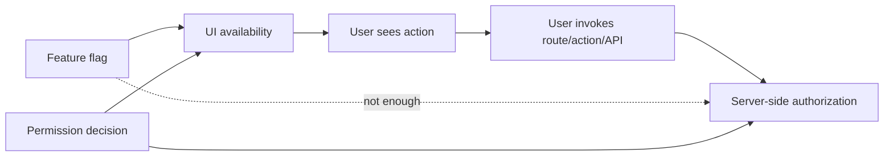
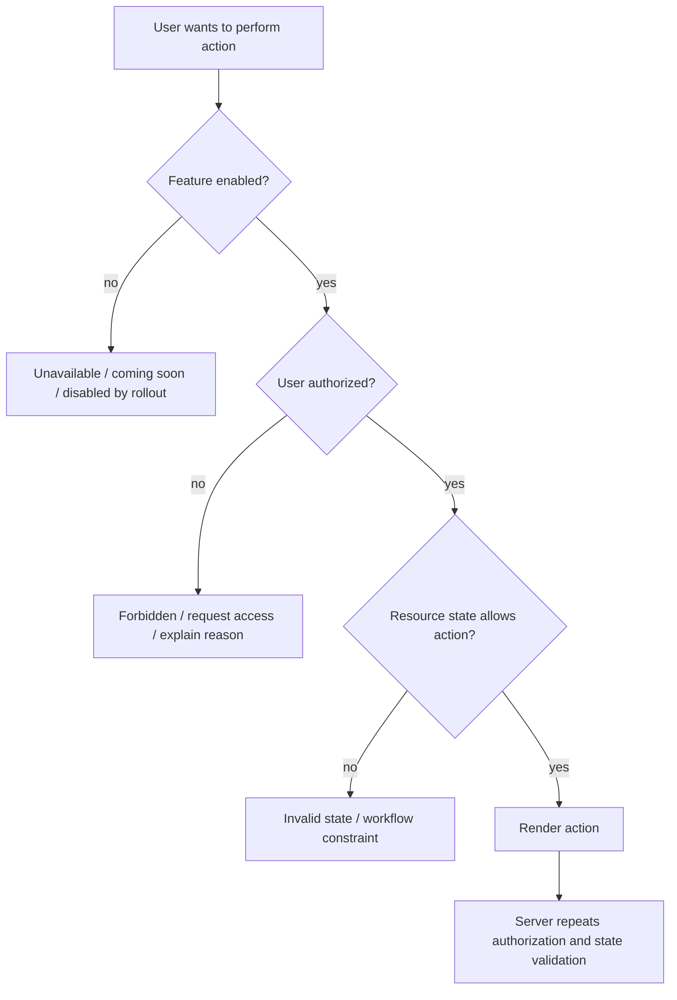
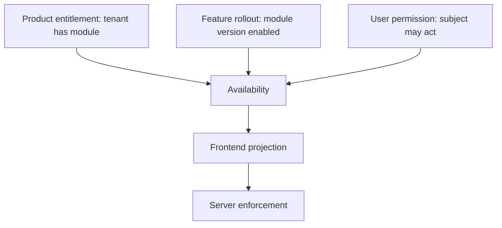

# Part 057 — Feature Flags vs Permissions

Feature flags are not permissions.

Permissions are not feature flags.

They often look similar in React because both produce the same surface-level UI question:

```txt
Should this thing be visible or usable?
```

That similarity is dangerous.

A feature flag answers:

```txt
Is this capability released, enabled, or configured for this environment/cohort/customer?
```

A permission answers:

```txt
Is this subject allowed to perform this action on this resource in this context?
```

Those are different systems with different invariants.

Conflating them causes subtle security bugs, product bugs, audit gaps, and operational incidents.

The common failure is this:

```tsx
if (flags.newAdminPage) {
  return <AdminPage />;
}
```

That code answers only whether the page is released.

It does not answer whether the user is allowed to administer anything.

This part builds the mental model and implementation boundary for using feature flags and permissions together without mixing their responsibilities.

---

## 1. The one-sentence rule

Use this rule in design review:

```txt
A feature flag controls whether code or product capability is enabled.
A permission controls whether a subject may act on a resource.
```

Feature flags are release/configuration controls.

Permissions are authorization controls.

A feature flag can participate in the final UI decision, but it must not replace authorization.



The safe equation is:

```txt
show action = feature is enabled AND user is authorized AND state allows action
```

Not:

```txt
show action = feature is enabled
```

Not:

```txt
show action = user is in beta cohort
```

Not:

```txt
show action = frontend received true from flag SDK
```

---

## 2. Why the confusion happens

React makes this easy to confuse because both systems become booleans.

```tsx
const canExport = useCan('case.export', caseId);
const exportEnabled = useFlag('case-export');

return canExport.allowed && exportEnabled.value ? <ExportButton /> : null;
```

At the JSX layer both values look interchangeable.

But they are not interchangeable because they come from different authority models.

| Concern | Feature flag | Permission |
|---|---|---|
| Primary question | Is this capability enabled? | Is this subject allowed? |
| Owner | Product/platform/release team | Security/domain/admin/policy owner |
| Common key | `new-report-export` | `report.export` |
| Targeting input | environment, cohort, account, percentage, plan | subject, action, resource, tenant, workflow state |
| Failure default | usually off/default variation | deny |
| Enforcement location | app/runtime config | server/resource boundary |
| Audit expectation | flag evaluation/config change | access decision/access denial/action attempt |
| Revocation urgency | product-dependent | often security-critical |
| Attack consequence | feature exposure or product inconsistency | unauthorized access/data mutation |

The key difference is not syntax.

The key difference is **authority**.

A feature flag service is normally trusted to answer rollout/configuration.

An authorization service is trusted to answer access.

Do not ask one system to do the other system's job.

---

## 3. Release control vs access control

Release control manages product evolution.

Examples:

```txt
- Enable the new report builder for 5% of users.
- Turn on the new case timeline component in staging.
- Enable bulk export only for tenant A while we validate performance.
- Disable experimental WebSocket presence when error rate spikes.
- Switch from old API endpoint to new endpoint for a cohort.
```

Access control manages authority.

Examples:

```txt
- This investigator may view this case.
- This supervisor may approve this escalation.
- This analyst may export records only inside assigned region.
- This tenant admin may invite users to this organization.
- This user may edit field X but not field Y.
```

A release decision can be broad and reversible.

An authorization decision must be specific and enforceable.

A release bug might annoy users.

An authorization bug might leak data, violate policy, or create regulatory exposure.

---

## 4. The mental model: two gates, different semantics

A production action often passes through multiple gates.



These gates should not collapse into one boolean.

Because they produce different UX.

A disabled-by-rollout feature might say:

```txt
This feature is not enabled for your workspace yet.
```

A permission denial might say:

```txt
You do not have permission to export this case.
```

A workflow denial might say:

```txt
This case cannot be exported while an appeal is pending.
```

If all three become `false`, the product becomes opaque and the engineering system becomes untestable.

---

## 5. Feature flag taxonomy

Not every feature flag is the same.

A mature system distinguishes at least these categories.

### 5.1 Release flag

Controls progressive rollout.

```txt
new-case-timeline: true for 10% of tenants
```

Expected lifetime: short.

Security posture: not an authorization control.

### 5.2 Experiment flag

Controls A/B or multivariate experiment.

```txt
case-search-ranking-v2: variant B for 50% of users
```

Expected lifetime: short to medium.

Security posture: not an authorization control.

### 5.3 Operational kill switch

Disables a risky or degraded capability.

```txt
bulk-export-enabled: false when export worker is failing
```

Expected lifetime: may be long.

Security posture: availability/safety control, not user authorization.

### 5.4 Configuration flag

Controls runtime behavior.

```txt
case-page-size: 100
```

Expected lifetime: long.

Security posture: config, not permission.

### 5.5 Entitlement-like flag

Controls product packaging or customer entitlement.

```txt
advanced-audit-module: enabled for enterprise plan
```

Expected lifetime: long.

Security posture: adjacent to authorization, but still not enough.

This one is the most dangerous because it looks like permission.

A tenant may be entitled to the module.

That does not mean every user in the tenant may use every action in the module.

```txt
Tenant entitlement: organization has purchased advanced audit module.
User permission: Alice may view audit events for Case 123.
```

Do not flatten those.

---

## 6. Permission taxonomy

Permissions should describe domain authority.

Examples:

```txt
case.view
case.update
case.close
case.reopen
case.assign
case.export
case.comment.add
case.evidence.download
user.invite
role.grant
report.schedule
```

Good permission names are usually:

```txt
<resource>.<action>
```

or:

```txt
<bounded-context>.<resource>.<action>
```

Examples:

```txt
enforcement.case.approveClosure
enforcement.case.escalate
audit.event.view
identity.user.invite
```

Permissions should not be named after UI components.

Bad:

```txt
showExportButton
showAdminSidebar
newCasePageAccess
```

Better:

```txt
case.export
admin.user.manage
case.view
```

A permission should survive UI redesign.

A flag may be tied to UI rollout.

That distinction matters.

---

## 7. The dangerous anti-pattern: flag as permission

This is dangerous:

```tsx
const canUseBulkExport = useFlag('bulk-export');

if (!canUseBulkExport) {
  return null;
}

return <BulkExportButton />;
```

Why?

Because the flag probably says:

```txt
The bulk export feature is enabled for this environment/tenant/cohort.
```

It does not say:

```txt
This user may export these selected records.
```

The backend might still protect the endpoint.

If it does, the frontend creates bad UX because unauthorized users see an action and then receive a `403`.

If it does not, the app has broken access control.

The fix is composition:

```tsx
function BulkExportAction({ selectedCaseIds }: { selectedCaseIds: string[] }) {
  const exportFeature = useFlag('case-bulk-export');
  const bulkDecision = useBulkPermissionPreview({
    action: 'case.export',
    resourceIds: selectedCaseIds,
  });

  if (!exportFeature.enabled) return null;
  if (bulkDecision.status === 'loading') return <ExportSkeleton />;

  return (
    <AuthorizedButton
      decision={bulkDecision.summary}
      onClick={() => startExport(selectedCaseIds)}
    >
      Export selected cases
    </AuthorizedButton>
  );
}
```

The server must still enforce:

```ts
app.post('/api/cases/export', async (req, res) => {
  const session = await requireSession(req);
  const { caseIds } = parseExportRequest(req.body);

  const flag = await flags.getBooleanValue('case-bulk-export', false, {
    tenantId: session.tenantId,
  });

  if (!flag) {
    throw new ProblemError({
      status: 404,
      code: 'FEATURE_NOT_AVAILABLE',
      title: 'Feature not available',
    });
  }

  const decision = await policy.canBulk(session.subject, 'case.export', caseIds, {
    tenantId: session.tenantId,
  });

  if (!decision.allowed) {
    throw new ProblemError({
      status: 403,
      code: 'PERMISSION_DENIED',
      title: 'Not allowed',
      detail: 'You are not allowed to export one or more selected cases.',
    });
  }

  const job = await exportCases(caseIds, session);
  res.json({ jobId: job.id });
});
```

Notice the sequence.

The feature gate says whether the product capability exists.

The policy gate says whether the subject may perform the action.

Both are repeated server-side for sensitive actions.

---

## 8. The opposite anti-pattern: permission as feature flag

This is also bad:

```tsx
if (can('report.viewAdvanced')) {
  return <NewReportBuilder />;
}
```

`report.viewAdvanced` may be a real permission.

But it does not say whether the new report builder is released, stable, enabled in this environment, or included in a rollout cohort.

Permissions answer authority.

Flags answer availability.

A user can be authorized to use a feature that is currently disabled.

A feature can be enabled for a tenant while a user is not authorized to use it.

Both states must be expressible.

---

## 9. Feature flag client-side evaluation risks

Feature flag systems often support client-side SDKs.

That is useful for UI variation.

But client-side flag evaluation has security boundaries.

A client-side flag result is visible to the user.

A client-side flag key may be discoverable.

A client-side flag payload may reveal upcoming features, segments, or configuration.

A malicious user can modify JavaScript runtime state.

Therefore:

```txt
Client-side feature flags are fine for UI exposure and experience.
They are not sufficient for sensitive enforcement.
```

For sensitive operations, evaluate the relevant flag server-side as well.

Especially for:

```txt
- exports
- destructive mutations
- admin operations
- paid entitlements
- regulated workflow actions
- sensitive data views
- high-cost background jobs
```

Frontend flag evaluation improves UX.

Backend flag evaluation protects system behavior.

Backend authorization protects resources.

---

## 10. A correct combined decision model

Do not return a bare boolean from the UI composition layer.

Return a typed availability decision.

```ts
type AvailabilityKind =
  | 'available'
  | 'feature_disabled'
  | 'unauthenticated'
  | 'permission_denied'
  | 'requires_step_up'
  | 'invalid_resource_state'
  | 'loading'
  | 'unknown';

type AvailabilityDecision = {
  kind: AvailabilityKind;
  allowed: boolean;
  reasonCode?: string;
  message?: string;
  supportAction?:
    | { type: 'request_access'; resourceId: string; action: string }
    | { type: 'upgrade_plan'; plan: string }
    | { type: 'perform_step_up'; assuranceLevel: 'aal2' | 'aal3' }
    | { type: 'retry' };
};
```

Then compose gates explicitly:

```ts
function combineAvailability(input: {
  feature: { ready: boolean; enabled: boolean; reason?: string };
  permission: {
    status: 'loading' | 'ready' | 'error';
    allowed?: boolean;
    reasonCode?: string;
  };
  resourceState?: 'ready' | 'locked' | 'closed' | 'archived';
}): AvailabilityDecision {
  if (!input.feature.ready) {
    return { kind: 'loading', allowed: false };
  }

  if (!input.feature.enabled) {
    return {
      kind: 'feature_disabled',
      allowed: false,
      reasonCode: input.feature.reason ?? 'FEATURE_DISABLED',
      message: 'This feature is not enabled for this workspace.',
    };
  }

  if (input.permission.status === 'loading') {
    return { kind: 'loading', allowed: false };
  }

  if (input.permission.status === 'error') {
    return {
      kind: 'unknown',
      allowed: false,
      reasonCode: 'PERMISSION_UNKNOWN',
      message: 'We could not verify your access. Try again.',
    };
  }

  if (!input.permission.allowed) {
    return {
      kind: 'permission_denied',
      allowed: false,
      reasonCode: input.permission.reasonCode ?? 'PERMISSION_DENIED',
      message: 'You do not have permission to perform this action.',
      supportAction: { type: 'request_access', resourceId: 'current', action: 'current' },
    };
  }

  if (input.resourceState === 'closed') {
    return {
      kind: 'invalid_resource_state',
      allowed: false,
      reasonCode: 'CASE_CLOSED',
      message: 'This action is unavailable because the case is closed.',
    };
  }

  return { kind: 'available', allowed: true };
}
```

This makes the UI honest.

It also makes testing possible.

---

## 11. React integration pattern

A clean React boundary separates flag hooks, permission hooks, and composed availability hooks.

```tsx
type ActionAvailabilityInput = {
  featureKey: string;
  action: string;
  resource: {
    type: string;
    id: string;
    state?: string;
  };
};

function useActionAvailability(input: ActionAvailabilityInput): AvailabilityDecision {
  const feature = useFeatureFlag(input.featureKey);
  const permission = useCan({
    action: input.action,
    resourceType: input.resource.type,
    resourceId: input.resource.id,
  });

  return useMemo(
    () =>
      combineAvailability({
        feature,
        permission,
        resourceState: input.resource.state as any,
      }),
    [feature, permission, input.resource.state]
  );
}
```

Usage:

```tsx
function ExportCaseButton({ caseRecord }: { caseRecord: CaseRecord }) {
  const availability = useActionAvailability({
    featureKey: 'case-export',
    action: 'case.export',
    resource: {
      type: 'case',
      id: caseRecord.id,
      state: caseRecord.status,
    },
  });

  if (availability.kind === 'feature_disabled') return null;

  return (
    <ActionButton
      disabled={!availability.allowed}
      reason={availability.reasonCode}
      tooltip={availability.message}
      onClick={() => exportCase(caseRecord.id)}
    >
      Export
    </ActionButton>
  );
}
```

The button does not know how feature flags are evaluated.

It does not know how permissions are computed.

It only renders a domain availability decision.

---

## 12. Entitlements: the bridge between flags and permissions

Entitlements are where teams most often get confused.

An entitlement says:

```txt
This account/tenant/customer has access to a product capability under commercial or plan rules.
```

Example:

```txt
Tenant Acme has purchased Advanced Audit.
```

A permission says:

```txt
This user may perform this action on this resource.
```

Example:

```txt
Alice may view audit events for tenant Acme.
```

An entitlement might be implemented in the same platform as feature flags.

That does not make it the same as authorization.

A safe model has three layers:



Example:

```ts
type ModuleAvailability = {
  entitlement: 'included' | 'not_in_plan' | 'trial_expired';
  rollout: 'enabled' | 'disabled' | 'degraded';
  permission: 'allowed' | 'denied' | 'requires_step_up';
};
```

The UI should express these differently.

```txt
not_in_plan      -> upgrade/contact sales
trial_expired    -> renew subscription/contact admin
disabled rollout -> not available yet
permission denied -> request access/contact admin
requires step-up -> verify identity
```

If the UI shows the same message for all of them, users cannot recover and support cannot diagnose.

---

## 13. Flag targeting is not authorization

Feature flag tools often target by user, organization, segment, attributes, or percentage rollout.

That feels like ABAC.

It is not necessarily authorization.

Example flag targeting:

```txt
Enable `advanced-search-v2` when:
- tenant.plan == enterprise
- tenant.region == eu
- user.email ends with @example.com
```

That logic decides product exposure.

It may not include:

```txt
- object ownership
- resource state
- legal hold state
- tenant membership freshness
- separation of duties
- delegated administration
- temporary grants
- revocation rules
- audit obligations
```

A flag segment can answer:

```txt
Is this user in the rollout cohort?
```

It should not answer:

```txt
May this user approve this enforcement action?
```

The danger is **capability gating masquerading as authorization**.

---

## 14. Kill switches and authorization

Operational kill switches are useful.

They can disable an entire capability quickly.

Example:

```txt
bulk-export-kill-switch = off
```

When a kill switch is off, the action should be unavailable for everyone.

But when it is on, authorization is still required.

```txt
kill switch off -> deny availability globally
kill switch on  -> continue normal authorization
```

Server-side example:

```ts
async function requireExportAvailability(ctx: RequestContext) {
  const enabled = await flags.boolean('bulk-export-enabled', false, {
    tenantId: ctx.tenantId,
    environment: ctx.environment,
  });

  if (!enabled) {
    throw new ProblemError({
      status: 503,
      code: 'FEATURE_TEMPORARILY_DISABLED',
      title: 'Export is temporarily disabled',
    });
  }
}

async function exportCasesEndpoint(req: Request) {
  const ctx = await requireSession(req);
  await requireExportAvailability(ctx);
  await requirePermission(ctx, 'case.export', { ids: req.body.caseIds });
  return startExport(ctx, req.body.caseIds);
}
```

The order is intentional.

If the feature is globally disabled, you may choose to avoid expensive policy evaluation.

But do not confuse the kill-switch pass with authorization pass.

---

## 15. Route-level design

Routes often need both release and authorization metadata.

```ts
type RouteFeaturePolicy = {
  flag?: string;
  entitlement?: string;
};

type RouteAuthPolicy = {
  requiresAuth?: boolean;
  action?: string;
  resourceType?: string;
  resourceIdParam?: string;
};

type RouteHandle = {
  feature?: RouteFeaturePolicy;
  auth?: RouteAuthPolicy;
};
```

Example:

```tsx
export const handle: RouteHandle = {
  feature: {
    flag: 'case-timeline-v2',
    entitlement: 'advanced-case-management',
  },
  auth: {
    requiresAuth: true,
    action: 'case.timeline.view',
    resourceType: 'case',
    resourceIdParam: 'caseId',
  },
};
```

Loader-level composition:

```ts
export async function loader({ request, params }: LoaderArgs) {
  const session = await requireSession(request);

  await requireEntitlement(session.tenantId, 'advanced-case-management');
  await requireFeatureFlag('case-timeline-v2', { tenantId: session.tenantId });
  await requirePermission(session.subject, 'case.timeline.view', {
    type: 'case',
    id: params.caseId!,
    tenantId: session.tenantId,
  });

  return loadTimeline(params.caseId!, session);
}
```

The order may vary by system.

The separation should not.

---

## 16. Error semantics

Do not return the same error for every gate.

Use typed errors.

```ts
type AvailabilityProblemCode =
  | 'FEATURE_NOT_ENABLED'
  | 'ENTITLEMENT_REQUIRED'
  | 'PERMISSION_DENIED'
  | 'AUTHENTICATION_REQUIRED'
  | 'STEP_UP_REQUIRED'
  | 'RESOURCE_STATE_INVALID';
```

HTTP mapping can vary, but a common model is:

| Condition | Status | Code | Notes |
|---|---:|---|---|
| Not logged in | 401 | `AUTHENTICATION_REQUIRED` | User may login. |
| Not allowed | 403 | `PERMISSION_DENIED` | User is known but not allowed. |
| Feature not purchased | 403 or 402 | `ENTITLEMENT_REQUIRED` | Product decision; often tenant admin path. |
| Feature disabled rollout | 404 or 403 | `FEATURE_NOT_ENABLED` | Avoid exposing unreleased routes if needed. |
| Temporary kill switch | 503 | `FEATURE_TEMPORARILY_DISABLED` | Operational degradation. |
| Resource state invalid | 409 | `RESOURCE_STATE_INVALID` | Workflow/domain conflict. |

The exact status depends on product/security policy.

The important point is that internal code remains typed.

---

## 17. UI message strategy

The user does not need to know your architecture.

But the UI should give the right recovery path.

| Gate failure | User-facing message | Recovery |
|---|---|---|
| Feature flag off | This feature is not available yet. | None, or link to changelog. |
| Entitlement missing | This feature is not included in your plan. | Contact admin / upgrade. |
| Permission denied | You do not have permission to do this. | Request access. |
| Step-up required | Verify your identity to continue. | MFA/passkey step-up. |
| Resource state invalid | This item is not in a state where this action is allowed. | Explain allowed state. |
| Service degraded | This feature is temporarily unavailable. | Retry/status page. |

This matters because “disabled” is not a reason.

A disabled action without reason is a support ticket generator.

---

## 18. Test matrix

Test feature and permission composition as a matrix.

```ts
describe('export action availability', () => {
  it.each([
    {
      feature: false,
      permission: true,
      expected: 'feature_disabled',
    },
    {
      feature: true,
      permission: false,
      expected: 'permission_denied',
    },
    {
      feature: true,
      permission: true,
      expected: 'available',
    },
    {
      feature: false,
      permission: false,
      expected: 'feature_disabled',
    },
  ])('returns $expected', ({ feature, permission, expected }) => {
    const decision = combineAvailability({
      feature: { ready: true, enabled: feature },
      permission: { status: 'ready', allowed: permission },
      resourceState: 'ready',
    });

    expect(decision.kind).toBe(expected);
  });
});
```

Also test server-side enforcement:

```txt
- feature off + authorized user -> denied by feature gate
- feature on + unauthorized user -> denied by policy gate
- feature on + authorized user + invalid state -> denied by workflow gate
- feature on + authorized user + valid state -> allowed
```

Do not test only the happy path.

---

## 19. Observability

Log these separately.

```txt
feature_evaluation
entitlement_check
authorization_decision
action_attempt
action_denied
action_completed
```

A useful event shape:

```json
{
  "event": "action_availability_evaluated",
  "action": "case.export",
  "resourceType": "case",
  "resourceId": "case_123",
  "tenantId": "tenant_456",
  "featureKey": "case-export",
  "featureEnabled": true,
  "entitlement": "included",
  "permissionAllowed": false,
  "decision": "permission_denied",
  "reasonCode": "REGION_SCOPE_MISMATCH"
}
```

Do not put sensitive resource data or raw token claims in client analytics.

In regulated systems, client-side telemetry may itself become a data exposure path.

---

## 20. Migration from flag-as-permission

Many systems start with feature flags and later discover they accidentally built authorization on top of them.

A safe migration path:

```txt
1. Inventory flags used for access-like behavior.
2. Classify each as release, experiment, kill switch, entitlement, or actual permission misuse.
3. Create domain permission names.
4. Add server-side enforcement for sensitive endpoints.
5. Add permission projection endpoint or policy decision API.
6. Compose flag + permission in UI.
7. Run shadow evaluation to compare old flag behavior and new permission behavior.
8. Add audit events for authorization decisions.
9. Remove role/flag checks from scattered components.
10. Retire obsolete flags after rollout.
```

Example inventory table:

| Existing flag | Current use | New model |
|---|---|---|
| `admin-page` | Shows admin page | flag `admin-page-v2` + permission `admin.user.manage` |
| `bulk-export` | Enables export button | flag `case-bulk-export` + permission `case.export` |
| `audit-module` | Enterprise customers only | entitlement `advanced-audit` + permission `audit.event.view` |
| `new-search` | A/B experiment | keep as feature flag only |

The migration is not just code cleanup.

It is boundary repair.

---

## 21. Architecture checklist

Use this checklist during PR/design review.

```txt
Feature flag / permission separation
[ ] Does the flag answer release/configuration, not authority?
[ ] Does the permission answer subject-action-resource-context?
[ ] Is the sensitive action enforced server-side?
[ ] Is entitlement separate from user permission?
[ ] Are deny reasons typed?
[ ] Are disabled UI states explainable?
[ ] Are route loaders/actions protected beyond sidebar visibility?
[ ] Are flag defaults safe?
[ ] Are permission defaults deny-by-default?
[ ] Are client-side flag values treated as non-secret?
[ ] Are backend flags used for expensive/destructive/sensitive actions?
[ ] Are tests covering flag on/off and permission allowed/denied combinations?
[ ] Are audit/telemetry events separated for flag evaluation and authorization decision?
```

---

## 22. Anti-pattern catalog

### Anti-pattern: one `canAccessFeature()` for everything

```ts
canAccessFeature('bulk-export')
```

This name hides whether the decision is a flag, entitlement, permission, or workflow constraint.

Prefer explicit composition.

```ts
getActionAvailability({ action: 'case.export', feature: 'case-bulk-export' })
```

### Anti-pattern: plan as role

```tsx
if (user.plan === 'enterprise') {
  return <AuditLog />;
}
```

A plan is not a user permission.

Use:

```txt
tenant entitlement + user permission + resource scope
```

### Anti-pattern: role as flag target

```txt
Enable delete-user feature for role == admin
```

That is not wrong as rollout targeting, but it must not be the only authorization check.

### Anti-pattern: flag value stored forever

Feature flag state can change.

Do not cache flag-derived availability indefinitely.

### Anti-pattern: hiding as compliance

Hiding a button can improve UX.

It does not prove enforcement.

---

## 23. The regulated workflow angle

In case-management or enforcement systems, actions are often constrained by:

```txt
- identity
- assignment
- jurisdiction
- case state
- legal basis
- escalation path
- separation of duties
- temporary delegation
- audit obligations
- organizational authority
- feature availability
```

A feature flag might enable the “appeal workflow” module.

But the permission decision may still depend on:

```txt
Can this officer submit this appeal recommendation for this case in this state?
```

That cannot be represented safely by a feature flag named:

```txt
appeal-workflow-enabled
```

The domain decision is richer.

React should project that richness without becoming the authority.

---

## 24. Final mental model

Think of flags and permissions as two different axes.

```txt
Feature flag axis: Is capability available?
Permission axis: Is subject authorized?
Resource state axis: Is action valid now?
```

The UI is a projection of all axes.

The server is the enforcement point for sensitive operations.

A good React app does not ask:

```txt
Should I show this because flag is true?
```

It asks:

```txt
What is the typed availability decision for this action in this context?
```

That shift is what keeps product rollout flexible without weakening access control.

---

## 25. References

- OWASP Authorization Cheat Sheet — validate permissions on every request, deny-by-default, least privilege.
- OpenFeature Specification — vendor-neutral feature flag evaluation API, evaluation context, hooks, providers.
- LaunchDarkly SDK Documentation — client-side vs server-side SDK security considerations and flag evaluation models.
- React Documentation — conditional rendering as UI composition, not security enforcement.
- Previous parts in this series: Part 041 Authorization Mental Model, Part 048 Frontend Permission Contract, Part 050 Deny-by-default React UI.
