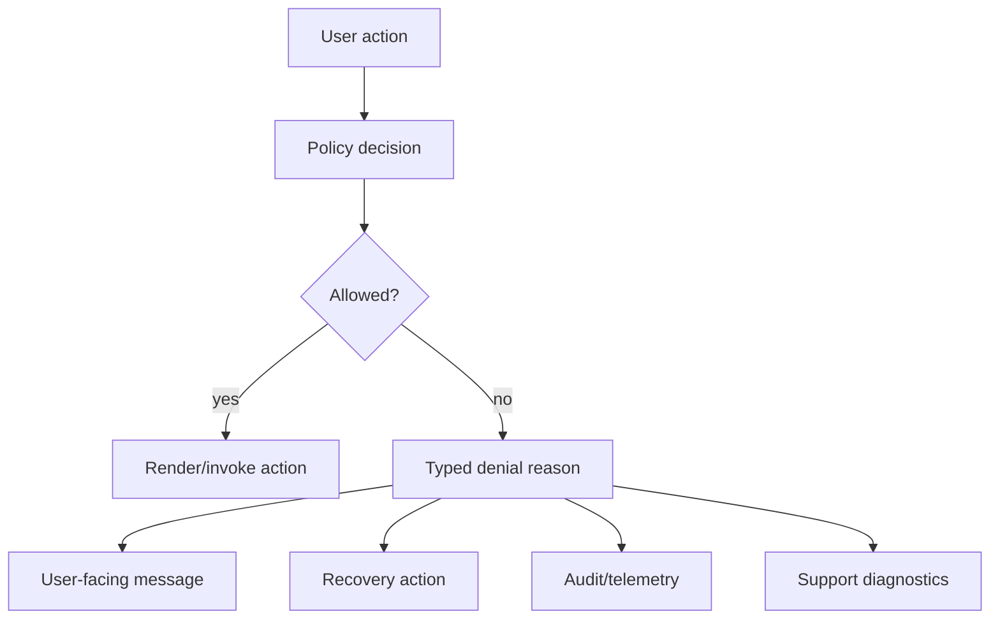
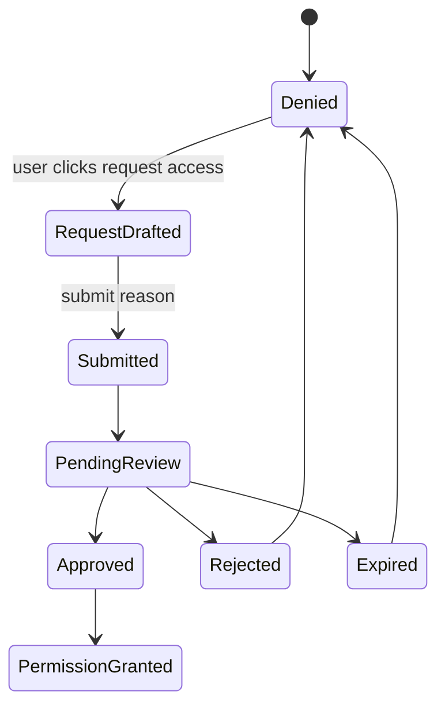

# Part 058 — Permission Reason and User Feedback

A denied action is not the end of the design.

It is the beginning of a recovery path.

Most React apps stop too early:

```tsx
<Button disabled={!canEdit}>Edit</Button>
```

That tells the browser the button is disabled.

It does not tell the user why.

It does not tell support what happened.

It does not tell auditors whether denial was correct.

It does not tell the system whether the user needs login, step-up authentication, a role grant, a tenant switch, plan upgrade, or workflow transition.

A permission reason is the missing bridge between authorization, UX, supportability, and auditability.

The question in this part is:

```txt
How do we explain denied or unavailable actions without leaking sensitive information,
without lying to the user, and without turning the frontend into the source of authority?
```

---

## 1. The core model

A permission decision should not be a boolean.

A boolean loses too much information.

Bad:

```ts
type PermissionDecision = boolean;
```

Better:

```ts
type PermissionDecision = {
  allowed: boolean;
  code: PermissionDecisionCode;
  reason?: PermissionReason;
  recoverability: Recoverability;
  correlationId?: string;
};
```

The reason is not only for rendering.

It is part of the authorization contract.



The UI should not invent authorization reasons.

It should render reasons returned by a trusted policy/session/resource layer.

---

## 2. Why `disabled={true}` is not enough

A disabled button has many possible meanings.

```txt
- You are not logged in.
- Your session expired.
- You have the wrong role.
- You are in the wrong tenant.
- You are not assigned to this case.
- The case is closed.
- The feature is not enabled.
- The feature is temporarily degraded.
- The action requires MFA/step-up.
- The selected rows have mixed eligibility.
- The policy engine is unavailable.
- The app has not loaded permissions yet.
```

Those states require different behavior.

A single disabled button compresses all of them into silence.

Silence creates three problems:

```txt
1. User confusion.
2. Support tickets.
3. Security workarounds.
```

Users who cannot understand the system will try to bypass it socially or operationally.

That is not a UI problem.

It is a system-design problem.

---

## 3. Permission reasons must be typed

Do not use free-text strings as your internal permission model.

Bad:

```json
{
  "allowed": false,
  "reason": "You can't do this because the case is closed"
}
```

Better:

```json
{
  "allowed": false,
  "code": "RESOURCE_STATE_DENIED",
  "reason": {
    "type": "case_closed",
    "requiredState": ["open", "under_review"],
    "actualState": "closed"
  },
  "recoverability": "not_recoverable_by_user",
  "correlationId": "authz_01HX..."
}
```

Internal reason codes should be stable.

User-facing copy can change.

Telemetry can group by code.

Tests can assert code.

Support can search correlation ID.

Audit can reconstruct the denial.

---

## 4. A practical reason taxonomy

Start with a taxonomy like this.

```ts
type PermissionDecisionCode =
  | 'ALLOWED'
  | 'AUTHENTICATION_REQUIRED'
  | 'SESSION_EXPIRED'
  | 'TENANT_REQUIRED'
  | 'TENANT_MISMATCH'
  | 'PERMISSION_DENIED'
  | 'ROLE_REQUIRED'
  | 'SCOPE_DENIED'
  | 'OWNERSHIP_REQUIRED'
  | 'ASSIGNMENT_REQUIRED'
  | 'RESOURCE_NOT_FOUND_OR_NOT_ACCESSIBLE'
  | 'RESOURCE_STATE_DENIED'
  | 'FIELD_DENIED'
  | 'STEP_UP_REQUIRED'
  | 'SEPARATION_OF_DUTIES_DENIED'
  | 'FEATURE_NOT_ENABLED'
  | 'ENTITLEMENT_REQUIRED'
  | 'POLICY_UNAVAILABLE'
  | 'UNKNOWN';

type Recoverability =
  | 'login'
  | 'refresh_session'
  | 'switch_tenant'
  | 'request_access'
  | 'contact_admin'
  | 'upgrade_plan'
  | 'perform_step_up'
  | 'change_resource_state'
  | 'retry'
  | 'not_recoverable_by_user';
```

This taxonomy is not universal.

But the pattern matters.

Reason code and recoverability should be separated.

The same reason can have different recoverability depending on organization policy.

Example:

```txt
PERMISSION_DENIED -> request_access
PERMISSION_DENIED -> contact_admin
PERMISSION_DENIED -> not_recoverable_by_user
```

---

## 5. Do not leak sensitive facts

Permission feedback can leak information.

Example dangerous message:

```txt
You cannot view Case 9281 because it belongs to the Financial Crime Unit.
```

If the user is not allowed to know the case exists or which unit owns it, that message leaks data.

Safer message:

```txt
You do not have access to this case.
```

For highly sensitive resources, even existence may be hidden.

```txt
404 Not Found
```

may be safer than:

```txt
403 Forbidden
```

But internally, you still want typed reasons.

```json
{
  "publicCode": "RESOURCE_NOT_FOUND_OR_NOT_ACCESSIBLE",
  "internalCode": "TENANT_MISMATCH",
  "correlationId": "authz_01HX..."
}
```

The frontend should receive only the public-safe shape.

Logs/audit can receive more detail if protected properly.

---

## 6. Public reason vs internal reason

Separate them explicitly.

```ts
type PublicPermissionDecision = {
  allowed: boolean;
  publicCode: PublicPermissionCode;
  messageKey: string;
  recoverability: Recoverability;
  support?: {
    correlationId: string;
  };
};

type InternalPermissionDecision = PublicPermissionDecision & {
  internalCode: InternalPermissionCode;
  policyId: string;
  policyVersion: string;
  evaluatedInputs: RedactedPolicyInputs;
};
```

The backend can map internal reasons to public reasons.

```ts
function toPublicDecision(internal: InternalPermissionDecision): PublicPermissionDecision {
  if (internal.internalCode === 'CASE_EXISTS_IN_OTHER_TENANT') {
    return {
      allowed: false,
      publicCode: 'RESOURCE_NOT_FOUND_OR_NOT_ACCESSIBLE',
      messageKey: 'access.notFoundOrNotAccessible',
      recoverability: 'not_recoverable_by_user',
      support: { correlationId: internal.support!.correlationId },
    };
  }

  return {
    allowed: internal.allowed,
    publicCode: internal.publicCode,
    messageKey: internal.messageKey,
    recoverability: internal.recoverability,
    support: internal.support,
  };
}
```

This prevents React from becoming a leak-prone policy explanation engine.

---

## 7. Reason-aware UI primitives

A good design system should accept a decision object, not just `disabled`.

```tsx
type AuthorizedButtonProps = {
  decision: PublicPermissionDecision;
  children: React.ReactNode;
  onClick: () => void;
};

function AuthorizedButton({ decision, children, onClick }: AuthorizedButtonProps) {
  if (decision.allowed) {
    return <button onClick={onClick}>{children}</button>;
  }

  if (decision.publicCode === 'FEATURE_NOT_ENABLED') {
    return null;
  }

  return (
    <button
      type="button"
      disabled
      aria-disabled="true"
      title={translate(decision.messageKey)}
    >
      {children}
    </button>
  );
}
```

A more complete version can render a tooltip or inline explanation.

```tsx
function ActionWithReason({ decision, label, onClick }: {
  decision: PublicPermissionDecision;
  label: string;
  onClick: () => void;
}) {
  if (decision.allowed) {
    return <button onClick={onClick}>{label}</button>;
  }

  return (
    <div className="action-with-reason">
      <button disabled aria-disabled="true">
        {label}
      </button>
      <PermissionReason decision={decision} />
    </div>
  );
}
```

The primitive centralizes behavior.

Every team does not need to invent its own denial UX.

---

## 8. Hide, disable, or explain?

There is no single correct rendering for every denial.

Use a policy.

| Situation | Recommended UI | Why |
|---|---|---|
| Feature unreleased | Hide | Avoid exposing unreleased product. |
| User lacks permission but can request access | Disable + explain + request access | Helps recovery. |
| User lacks permission and resource is sensitive | Hide or generic denial | Avoid existence leak. |
| Action invalid due to workflow state | Disable + explain | User needs domain feedback. |
| Step-up required | Show action + step-up prompt | User can recover immediately. |
| Entitlement missing | Show upgrade/contact admin CTA | Product recovery path. |
| Permission still loading | Skeleton/placeholder | Avoid false allow or false denial. |
| Policy unavailable | Disable + retry/degraded copy | Fail closed without lying. |

Decision function:

```ts
type RenderTreatment = 'hide' | 'disable' | 'explain' | 'prompt_step_up' | 'upgrade' | 'retry';

function treatmentFor(decision: PublicPermissionDecision): RenderTreatment {
  if (decision.allowed) return 'explain';

  switch (decision.recoverability) {
    case 'perform_step_up':
      return 'prompt_step_up';
    case 'request_access':
    case 'contact_admin':
    case 'change_resource_state':
      return 'explain';
    case 'upgrade_plan':
      return 'upgrade';
    case 'retry':
      return 'retry';
    case 'not_recoverable_by_user':
      return decision.publicCode === 'RESOURCE_NOT_FOUND_OR_NOT_ACCESSIBLE' ? 'hide' : 'disable';
    default:
      return 'disable';
  }
}
```

The policy should be consistent across the app.

---

## 9. Request access flow

Many systems need a permission recovery path.

A request access flow is itself a workflow.

It is not just a modal.



A request should capture:

```ts
type AccessRequest = {
  id: string;
  requesterId: string;
  tenantId: string;
  action: string;
  resource: {
    type: string;
    id: string;
  };
  reasonCode: string;
  businessJustification: string;
  requestedDuration?: string;
  createdAt: string;
  status: 'pending' | 'approved' | 'rejected' | 'expired' | 'cancelled';
};
```

Do not let the frontend decide who approves.

The backend/workflow service should derive approvers from policy.

---

## 10. Access request UI pattern

```tsx
function PermissionReason({ decision }: { decision: PublicPermissionDecision }) {
  const message = translate(decision.messageKey);

  return (
    <div role="note" className="permission-reason">
      <span>{message}</span>
      <RecoveryAction decision={decision} />
      {decision.support?.correlationId && (
        <small>Reference: {decision.support.correlationId}</small>
      )}
    </div>
  );
}

function RecoveryAction({ decision }: { decision: PublicPermissionDecision }) {
  switch (decision.recoverability) {
    case 'request_access':
      return <RequestAccessButton decision={decision} />;
    case 'perform_step_up':
      return <StepUpButton decision={decision} />;
    case 'switch_tenant':
      return <SwitchTenantLink />;
    case 'retry':
      return <RetryPermissionCheckButton />;
    default:
      return null;
  }
}
```

This keeps explanation and recovery close to the denied action.

For high-volume surfaces like tables, use compact treatment.

```txt
Row action menu:
- disabled item
- short reason in tooltip
- optional "request access" action
```

For full-page denial, use richer treatment.

```txt
- clear title
- safe explanation
- recovery action
- correlation ID
- link to help/access policy
```

---

## 11. Step-up reason

Step-up is not the same as permission denial.

A user may be authorized but not sufficiently authenticated for a sensitive action.

Example:

```json
{
  "allowed": false,
  "publicCode": "STEP_UP_REQUIRED",
  "messageKey": "access.stepUpRequired",
  "recoverability": "perform_step_up",
  "requiredAssuranceLevel": "aal2",
  "maxAgeSeconds": 300
}
```

UI:

```tsx
function DeleteUserButton({ userId }: { userId: string }) {
  const decision = useCan({ action: 'user.delete', resourceType: 'user', resourceId: userId });

  if (decision.publicCode === 'STEP_UP_REQUIRED') {
    return (
      <button onClick={() => beginStepUp({ returnToAction: 'user.delete', resourceId: userId })}>
        Verify identity to delete user
      </button>
    );
  }

  return <AuthorizedButton decision={decision} onClick={() => deleteUser(userId)}>Delete user</AuthorizedButton>;
}
```

This produces better UX than a generic disabled button.

It also preserves security semantics.

---

## 12. Bulk action reasons

Bulk actions need aggregate reasons.

Example: user selects 100 rows.

```txt
- 70 can be exported
- 20 are outside region scope
- 10 are closed
```

A boolean cannot represent this.

Use preview decisions.

```ts
type BulkPermissionPreview = {
  action: string;
  total: number;
  allowedCount: number;
  deniedCount: number;
  groups: Array<{
    code: PermissionDecisionCode;
    count: number;
    messageKey: string;
  }>;
  mode: 'all_allowed' | 'partial_allowed' | 'none_allowed';
  operationPolicy: 'all_or_nothing' | 'allowed_subset';
};
```

UI copy:

```txt
Export selected cases
70 of 100 selected cases can be exported.
20 are outside your region. 10 are closed.
```

The server must repeat the check during submit.

Bulk preview is a projection.

It is not a grant.

---

## 13. Field-level reasons

Field-level authorization also needs reasons.

Example:

```json
{
  "field": "sanctionRecommendation",
  "mode": "readonly",
  "reasonCode": "SEPARATION_OF_DUTIES_DENIED",
  "messageKey": "field.sodDenied"
}
```

React pattern:

```tsx
function AuthorizedField({ field, permission, children }: {
  field: string;
  permission: FieldPermission;
  children: React.ReactNode;
}) {
  if (permission.mode === 'hidden') return null;

  return (
    <div>
      {cloneField(children, { readonly: permission.mode === 'readonly' })}
      {permission.reasonCode && <FieldPermissionHint permission={permission} />}
    </div>
  );
}
```

Do not rely on readonly UI for enforcement.

Server-side patch validation must reject forbidden fields.

---

## 14. Full-page denial pattern

A full-page denial should be structured.

```tsx
function AccessDeniedPage({ decision }: { decision: PublicPermissionDecision }) {
  return (
    <main className="access-denied">
      <h1>{titleFor(decision)}</h1>
      <p>{translate(decision.messageKey)}</p>
      <RecoveryAction decision={decision} />
      {decision.support?.correlationId && (
        <p className="reference">Reference: {decision.support.correlationId}</p>
      )}
    </main>
  );
}
```

Bad full-page denial:

```txt
Access denied.
```

Better:

```txt
You do not have access to this case.
Request access from your supervisor or contact support with reference AUTHZ-7K4F2.
```

For sensitive resources, keep copy generic.

```txt
This page is unavailable or you do not have access.
```

---

## 15. Error response shape

For HTTP APIs, use a problem-like shape.

```json
{
  "type": "https://example.com/problems/permission-denied",
  "title": "Permission denied",
  "status": 403,
  "code": "PERMISSION_DENIED",
  "messageKey": "access.permissionDenied",
  "recoverability": "request_access",
  "correlationId": "authz_01HX..."
}
```

The frontend can map it into a decision.

```ts
function decisionFromProblem(problem: AuthzProblem): PublicPermissionDecision {
  return {
    allowed: false,
    publicCode: problem.code,
    messageKey: problem.messageKey,
    recoverability: problem.recoverability,
    support: { correlationId: problem.correlationId },
  };
}
```

Do not parse English text to decide UI behavior.

Use codes.

---

## 16. Safe copy rules

Permission copy needs security review.

Rules:

```txt
1. Do not reveal resource existence unless the user may know it exists.
2. Do not reveal sensitive ownership, assignment, region, or classification unless allowed.
3. Do not disclose internal role names if they reveal organization structure unnecessarily.
4. Do not expose raw policy names, SQL filters, tuple paths, or internal IDs.
5. Provide correlation IDs for support instead of internal details.
6. Make recovery clear when recovery is allowed.
7. Do not encourage users to ask random admins for broad access.
8. Prefer least-privilege request paths.
```

Example unsafe:

```txt
Only members of the Anti-Money Laundering Special Investigation Team can view this case.
```

Example safer:

```txt
You do not have access to this case. Request access if you need it for your work.
```

Example even safer for existence-sensitive systems:

```txt
This case is unavailable or you do not have access.
```

---

## 17. Reason source of truth

Where should reasons come from?

Not from scattered React conditionals.

Good hierarchy:

```txt
Policy/resource service returns typed decision.
Session/permission projection carries public-safe decision.
React renders the decision.
Design system standardizes treatment.
```

Bad hierarchy:

```txt
React component guesses why user.role !== 'admin'.
```

React can derive presentation treatment.

React should not derive domain reason from raw role.

---

## 18. Permission reason and audit

Every denied sensitive action should be auditable.

Audit event example:

```json
{
  "event": "authorization.denied",
  "decisionId": "authz_01HX...",
  "subjectId": "user_123",
  "tenantId": "tenant_456",
  "action": "case.export",
  "resourceType": "case",
  "resourceId": "case_789",
  "publicCode": "PERMISSION_DENIED",
  "internalCode": "REGION_SCOPE_MISMATCH",
  "policyVersion": "2026-07-08.4",
  "requestId": "req_abc",
  "occurredAt": "2026-07-08T03:40:00Z"
}
```

For privacy, not all fields belong in frontend logs.

But backend audit needs enough context to verify that denial was correct.

---

## 19. Permission reason and supportability

Support teams need a safe reference.

Do not ask users to screenshot sensitive data.

Give them a correlation ID.

```txt
Reference: AUTHZ-6G9Q2
```

Support tooling can resolve that ID to internal reason if the support agent is authorized.

This avoids leaking internal policy details into UI while preserving debuggability.

---

## 20. Internationalization

Do not send complete user-facing text from the policy engine unless you have a strong reason.

Prefer message keys and parameters.

```json
{
  "messageKey": "access.case.requestAccess",
  "messageParams": {
    "resourceLabel": "case"
  }
}
```

React can localize:

```ts
translate(decision.messageKey, decision.messageParams)
```

But parameters must be safe.

Do not include sensitive names in message params unless the user may see them.

---

## 21. Permission reason testing

Test reasons, not only visibility.

```ts
describe('case export reason', () => {
  it('shows request access when user lacks export permission', () => {
    render(
      <ExportCaseButton
        decision={{
          allowed: false,
          publicCode: 'PERMISSION_DENIED',
          messageKey: 'access.permissionDenied',
          recoverability: 'request_access',
        }}
      />
    );

    expect(screen.getByRole('button', { name: /export/i })).toBeDisabled();
    expect(screen.getByText(/request access/i)).toBeInTheDocument();
  });

  it('does not reveal resource state when decision is not-found-or-not-accessible', () => {
    render(
      <AccessDeniedPage
        decision={{
          allowed: false,
          publicCode: 'RESOURCE_NOT_FOUND_OR_NOT_ACCESSIBLE',
          messageKey: 'access.notFoundOrNotAccessible',
          recoverability: 'not_recoverable_by_user',
        }}
      />
    );

    expect(screen.queryByText(/tenant mismatch/i)).not.toBeInTheDocument();
    expect(screen.queryByText(/financial crime unit/i)).not.toBeInTheDocument();
  });
});
```

Also test matrix:

```txt
- unauthenticated -> login CTA
- expired session -> re-login or refresh path
- tenant mismatch -> tenant switch or generic denial
- permission denied -> request access if allowed
- resource state denied -> state explanation
- step-up required -> MFA/passkey prompt
- policy unavailable -> retry/degraded state
```

---

## 22. Accessibility

Disabled controls are often hard to discover and may not expose enough information to assistive technology.

Design carefully.

Guidelines:

```txt
- Do not rely only on tooltip hover for critical reason.
- Provide inline text or accessible description for important denial.
- Use aria-describedby to connect disabled action and reason when possible.
- Avoid focus traps in denied states.
- Ensure request-access actions are keyboard accessible.
- Avoid hiding controls that users need to discover for access request unless security requires hiding.
```

Example:

```tsx
function DisabledActionWithReason({ id, label, reason }: {
  id: string;
  label: string;
  reason: string;
}) {
  const reasonId = `${id}-reason`;

  return (
    <div>
      <button disabled aria-describedby={reasonId}>
        {label}
      </button>
      <p id={reasonId}>{reason}</p>
    </div>
  );
}
```

Security UX still needs accessibility.

---

## 23. The “why can’t I?” panel

For complex enterprise apps, a reusable access explanation panel is useful.

```txt
Why can't I do this?
- Required action: case.export
- Your access: view only
- Resource state: closed
- What you can do: request export access or reopen case if permitted
- Reference: AUTHZ-6G9Q2
```

But be careful.

Only show details the user is allowed to know.

A safe panel receives a public explanation model.

```ts
type PublicAccessExplanation = {
  titleKey: string;
  summaryKey: string;
  bullets: Array<{
    key: string;
    params?: Record<string, string>;
  }>;
  recovery?: PublicRecoveryAction;
  correlationId?: string;
};
```

Do not render raw policy traces to end users.

Policy traces are for authorized administrators and support tooling.

---

## 24. Admin-facing explanation

Admin screens can show richer explanation.

Example:

```txt
Alice cannot export Case 123 because:
- Alice has role Investigator in Tenant A.
- Case 123 is assigned to Region B.
- Policy case.export requires region match or supervisor override.
- No active override grant exists.
```

This is valuable for access administration.

But this screen must itself be authorization-protected.

Admin explanation is sensitive.

It reveals policy structure and organization assignments.

---

## 25. Policy trace vs user feedback

A policy trace is not a user message.

Policy trace:

```json
{
  "rule": "case_export_region_scope",
  "subject.region": "north",
  "resource.region": "south",
  "result": "deny"
}
```

User feedback:

```txt
You do not have permission to export this case.
```

Support feedback:

```txt
Denied because requester region does not match case region. Reference AUTHZ-6G9Q2.
```

Admin feedback:

```txt
Grant temporary cross-region export permission or reassign the case.
```

Different audiences need different projections.

---

## 26. Avoiding policy oracle behavior

A permission explanation endpoint can become an oracle.

An attacker might probe resources/actions and learn which ones exist.

Mitigations:

```txt
- Authenticate explanation endpoints.
- Rate limit sensitive explanation checks.
- Return generic messages for existence-sensitive resources.
- Redact internal reasons unless caller has admin/support permission.
- Log suspicious repeated denial probes.
- Do not let client submit arbitrary resource IDs for detailed explanation unless scoped.
```

Example safe endpoint:

```ts
app.post('/api/permissions/explain', async (req, res) => {
  const session = await requireSession(req);
  const request = parseExplainRequest(req.body);

  const decision = await policy.explainPublic(session.subject, request);

  // Public explanation is already redacted and existence-safe.
  res.json(decision.publicExplanation);
});
```

Do not expose raw `policy.explainInternal()` to regular users.

---

## 27. Permission reason in optimistic UI

Optimistic UI must handle denial after submit.

Example:

```tsx
async function approveCase(caseId: string) {
  optimisticMarkApproved(caseId);

  try {
    await api.approveCase(caseId);
  } catch (error) {
    rollbackApproval(caseId);

    const problem = parseAuthzProblem(error);
    if (problem) {
      showPermissionToast(decisionFromProblem(problem));
      invalidatePermissionCache({ action: 'case.approve', resourceId: caseId });
      return;
    }

    throw error;
  }
}
```

A denial after optimistic update is not merely a toast.

It is evidence your projection was stale.

Invalidate the relevant permission/resource cache.

---

## 28. Permission reason and stale state

A reason can be stale.

Example:

```txt
User opens case page.
Permission says case.close allowed.
Supervisor closes the case in another tab.
User clicks close.
Server returns RESOURCE_STATE_DENIED.
```

The UI should:

```txt
1. Roll back optimistic changes.
2. Show safe reason.
3. Revalidate resource and permission projection.
4. Avoid retrying automatically if denial is deterministic.
```

Do not hide the denial behind “Something went wrong”.

That destroys trust and supportability.

---

## 29. Design checklist

```txt
Permission reason design
[ ] Does every denied sensitive action have a typed reason code?
[ ] Are internal reasons separated from public reasons?
[ ] Are messages safe against resource existence leaks?
[ ] Is recoverability explicit?
[ ] Can the UI render login, step-up, request access, tenant switch, retry, and generic denial differently?
[ ] Is there a correlation ID for support?
[ ] Are reasons localized via message keys?
[ ] Are field-level and bulk-action reasons supported?
[ ] Are denial reasons tested, not just visibility?
[ ] Are policy traces protected from regular users?
[ ] Does the server repeat authorization on submit?
[ ] Does stale denial invalidate relevant caches?
```

---

## 30. Final mental model

Permission feedback is not decoration.

It is part of the access-control product.

A mature React auth system does not ask only:

```txt
Can the user do this?
```

It asks:

```txt
What is the safe, typed, recoverable explanation for the current access decision?
```

That explanation must be:

```txt
- truthful enough for the user
- safe enough for security
- structured enough for code
- stable enough for tests
- useful enough for support
- complete enough for audit
```

A boolean cannot do that.

A permission reason can.

---

## 31. References

- OWASP Authorization Cheat Sheet — deny-by-default, validate permissions on every request, least privilege.
- OWASP Error Handling Cheat Sheet — error handling can leak sensitive implementation details and must be designed carefully.
- RFC 7807 / RFC 9457 Problem Details — structured error response model for HTTP APIs.
- WAI/WCAG and MDN accessibility guidance for disabled controls, descriptions, and accessible UI feedback.
- Previous parts in this series: Part 048 Frontend Permission Contract, Part 050 Deny-by-default React UI, Part 054 Forms and Field-level Permission, Part 055 Table Row Action Authorization.
