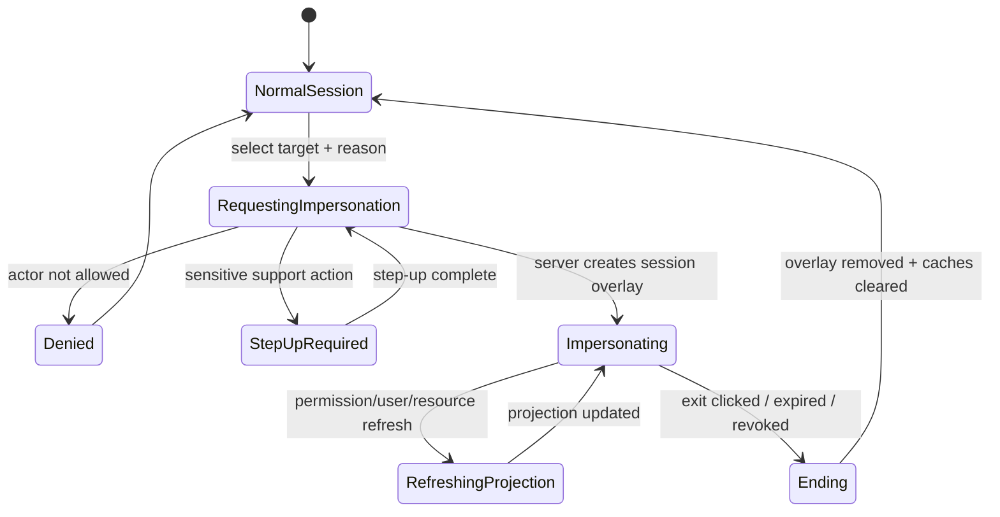
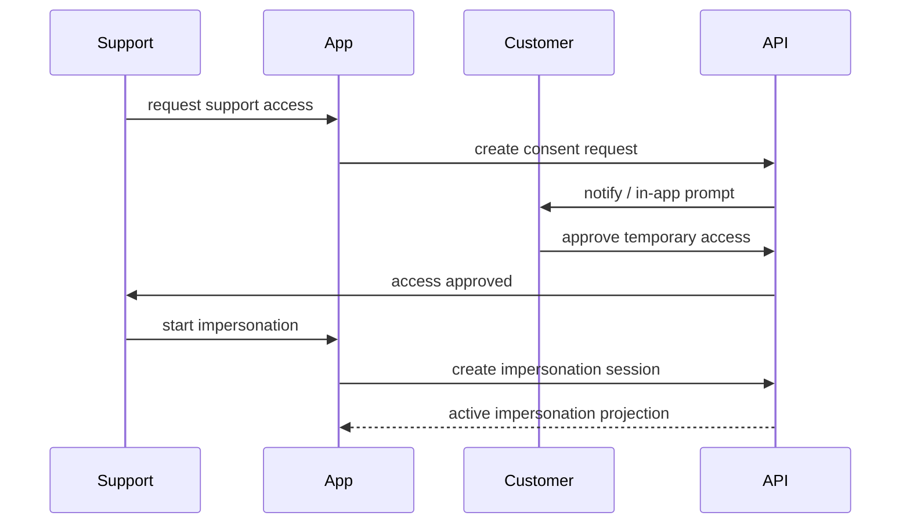
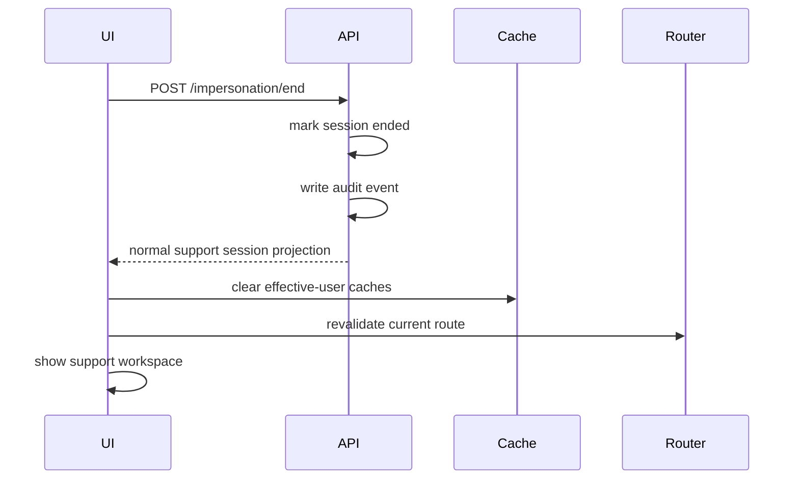

# Part 059 — Admin Impersonation UI

Admin impersonation is one of the most useful support features in a SaaS product.

It is also one of the easiest features to turn into a privilege escalation disaster.

The naive version sounds simple:

```txt
Let support log in as a customer.
```

The production version is not simple:

```txt
Let a tightly authorized operator temporarily observe or act inside a user context,
under explicit scope, with visible UI state, server-side constraints, immutable audit,
no credential sharing, no accidental privilege inheritance, and no silent persistence.
```

The React part matters because users and support engineers live inside the UI.

A bad UI can make impersonation invisible.

A bad UI can make the support user forget they are acting as someone else.

A bad UI can leak sensitive data that the support user should not see.

A bad UI can let an impersonated session look like a normal customer session in logs.

A bad UI can turn a temporary diagnostic tool into a long-lived shadow access channel.

This part builds a production-grade mental model for admin impersonation UI.

---

## 1. The core rule

Impersonation is not login.

It is delegated, constrained, auditable, temporary acting context.

Bad model:

```txt
support becomes the user
```

Better model:

```txt
support remains support
support receives a temporary view/action context for target user
system records both actor and subject
all enforcement sees impersonation explicitly
```

Use two identities:

```ts
type Principal = {
  id: string;
  email: string;
  kind: 'human' | 'service' | 'support_operator';
};

type ActingSubject = {
  id: string;
  email: string;
  tenantId: string;
  kind: 'customer_user';
};

type ImpersonationContext = {
  active: true;
  sessionId: string;
  actor: Principal;
  subject: ActingSubject;
  reason: string;
  ticketId?: string;
  mode: 'view_only' | 'support_action';
  startedAt: string;
  expiresAt: string;
  permissions: ImpersonationPermissionProjection;
};
```

The actor never disappears.

The subject never becomes the actor.

Every audit event must preserve both.

---

## 2. Why impersonation exists

Impersonation exists because production bugs are often contextual.

Support may need to see:

```txt
- the exact tenant
- the exact role assignment
- the exact resource state
- the exact navigation menu
- the exact plan entitlement
- the exact policy denial reason
- the exact form state
- the exact integration status
```

Screenshots are often insufficient.

Logs are often incomplete.

Customer descriptions are often imprecise.

But the fact that impersonation is useful does not mean it should be broad.

The safer framing is:

```txt
What minimal diagnostic capability does support need to resolve this case?
```

Not:

```txt
How can support become any user?
```

This difference drives the whole design.

---

## 3. Impersonation threat model

Impersonation creates a privileged path around normal authentication.

Threats include:

```txt
1. Rogue support user abuses access.
2. Compromised support account impersonates customers.
3. Support accidentally performs destructive action as customer.
4. Impersonation session persists after support case is done.
5. Audit log cannot distinguish actor from subject.
6. UI hides impersonation banner on some routes.
7. Sensitive customer fields are visible to support.
8. Impersonation bypasses MFA or step-up rules.
9. Cross-tenant target selection is too broad.
10. Support role changes are not reflected in active impersonation sessions.
11. Browser tab confusion causes action in wrong context.
12. API accepts impersonation headers from untrusted clients.
```

The goal is not to make impersonation invisible and convenient.

The goal is to make it useful while impossible to forget, hard to misuse, easy to audit, and easy to revoke.

---

## 4. Impersonation is a state machine

Model impersonation as an explicit session overlay.



The UI must not treat impersonation as a boolean theme switch.

It is a separate operating mode with its own lifecycle.

---

## 5. Session model

There are three common models.

### Model A — Replace user session

```txt
support session becomes customer session
```

This is dangerous.

Problems:

```txt
- actor identity is lost in frontend state
- audit may show customer as actor
- support may inherit customer tokens
- exit can be ambiguous
- destructive actions look normal
```

Avoid this for serious systems.

### Model B — Client-side header override

```txt
X-Impersonate-User: user_123
```

This is worse if the browser can set it directly.

Never trust a client-supplied impersonation header unless the server maps it to an authorized server-side impersonation session.

### Model C — Server-side impersonation overlay

```txt
support has normal support session
server creates temporary impersonation session overlay
browser receives projection that says impersonation is active
server enforces overlay constraints on every request
```

This is the preferred model.

The browser does not grant impersonation.

The browser displays and carries the state that the server already authorized.

---

## 6. Actor vs subject vs effective permissions

A mature impersonation model has at least three permission layers.

```txt
actor permissions
  what the support operator is allowed to do as support

subject permissions
  what the customer user can normally do

impersonation constraints
  what the actor is allowed to do while acting inside subject context
```

The effective permission is the intersection:

```ts
type EffectiveImpersonationDecision = {
  allowed: boolean;
  actorAllowed: boolean;
  subjectAllowed: boolean;
  impersonationAllowed: boolean;
  reason?:
    | 'ACTOR_NOT_ALLOWED_TO_IMPERSONATE'
    | 'SUBJECT_NOT_ALLOWED'
    | 'IMPERSONATION_MODE_DENIES_ACTION'
    | 'SENSITIVE_ACTION_BLOCKED_DURING_IMPERSONATION'
    | 'TENANT_BOUNDARY_DENIED'
    | 'IMPERSONATION_EXPIRED';
};
```

Equivalent logic:

```txt
effectiveAllowed = actorCanImpersonateTarget
                && subjectCanDoAction
                && impersonationPolicyAllowsAction
```

Do not let the actor's support role add capabilities to the customer.

Do not let the customer's role add capabilities to support outside the target context.

Do not let impersonation skip normal resource authorization.

---

## 7. View-only should be the default

Most support debugging does not require mutation.

Default impersonation mode should be:

```txt
view_only
```

View-only means:

```txt
- forms render as readonly or disabled
- destructive actions are hidden or disabled
- exports are blocked unless explicitly allowed
- payment/security/account ownership actions are blocked
- PII may be masked unless support role allows disclosure
- mutation endpoints reject requests under view-only impersonation
```

The frontend should reflect this clearly.

```tsx
function AuthorizedButton({ action, resource, children }: Props) {
  const decision = useCan(action, resource);

  if (decision.reason === 'IMPERSONATION_VIEW_ONLY') {
    return (
      <Tooltip content="Unavailable during view-only impersonation">
        <Button disabled>{children}</Button>
      </Tooltip>
    );
  }

  if (!decision.allowed) return null;

  return <Button>{children}</Button>;
}
```

But the server must still enforce it.

The UI is only a projection.

---

## 8. The impersonation banner

Every impersonation session needs an always-visible banner.

Not a small badge.

Not hidden inside account menu.

Not route-specific.

A banner.

It should show:

```txt
- that impersonation is active
- the target user
- the target tenant/org
- the actor/support identity, when appropriate
- mode: view-only or support-action
- expiry countdown or expiry timestamp
- linked ticket/reason if allowed
- exit button
- audit/correlation identifier for support
```

Example component:

```tsx
type ImpersonationBannerProps = {
  context: ImpersonationContext;
  onExit: () => Promise<void>;
};

export function ImpersonationBanner({ context, onExit }: ImpersonationBannerProps) {
  return (
    <section
      role="status"
      aria-live="polite"
      className="impersonation-banner"
      data-testid="impersonation-banner"
    >
      <strong>Impersonating</strong>
      <span>{context.subject.email}</span>
      <span>in tenant {context.subject.tenantId}</span>
      <span>Mode: {context.mode === 'view_only' ? 'View only' : 'Support action'}</span>
      <span>Expires: {formatTime(context.expiresAt)}</span>
      <button type="button" onClick={onExit}>
        Exit impersonation
      </button>
    </section>
  );
}
```

Make it route-independent:

```tsx
export function AuthenticatedShell() {
  const session = useSession();

  return (
    <>
      {session.impersonation?.active ? (
        <ImpersonationBanner
          context={session.impersonation}
          onExit={exitImpersonation}
        />
      ) : null}

      <AppLayout />
    </>
  );
}
```

The banner should be outside nested routes so it cannot disappear because one route forgot to include it.

---

## 9. Do not hide the original support identity

A common mistake is to replace the account menu with target user's name only.

That creates confusion:

```txt
Who am I?
Am I support or customer?
Will this action be audited as me or them?
```

The account area should show both:

```txt
Support: alice@company.com
Viewing as: customer@example.com
```

A compact layout:

```tsx
function IdentityChip() {
  const session = useSession();

  if (!session.impersonation?.active) {
    return <span>{session.actor.email}</span>;
  }

  return (
    <div aria-label="Active impersonation identity">
      <div>Support: {session.impersonation.actor.email}</div>
      <div>Viewing as: {session.impersonation.subject.email}</div>
    </div>
  );
}
```

The UI should make identity duality unavoidable.

---

## 10. Starting impersonation

Starting impersonation should require explicit intent.

Minimum inputs:

```txt
- target user
- target tenant/org
- reason
- ticket/case ID when applicable
- requested mode
```

Example command model:

```ts
type StartImpersonationCommand = {
  targetUserId: string;
  tenantId: string;
  mode: 'view_only' | 'support_action';
  reason: string;
  ticketId?: string;
};
```

Frontend form:

```tsx
function StartImpersonationForm({ targetUser }: { targetUser: UserSummary }) {
  const [reason, setReason] = useState('');
  const [ticketId, setTicketId] = useState('');
  const [mode, setMode] = useState<'view_only' | 'support_action'>('view_only');

  const canStart = reason.trim().length >= 12;

  return (
    <form method="post" action="/support/impersonation/start">
      <input type="hidden" name="targetUserId" value={targetUser.id} />
      <input type="hidden" name="tenantId" value={targetUser.tenantId} />

      <label>
        Mode
        <select name="mode" value={mode} onChange={(e) => setMode(e.target.value as typeof mode)}>
          <option value="view_only">View only</option>
          <option value="support_action">Support action</option>
        </select>
      </label>

      <label>
        Support ticket
        <input name="ticketId" value={ticketId} onChange={(e) => setTicketId(e.target.value)} />
      </label>

      <label>
        Reason
        <textarea
          name="reason"
          value={reason}
          onChange={(e) => setReason(e.target.value)}
          required
          minLength={12}
        />
      </label>

      <button disabled={!canStart}>Start impersonation</button>
    </form>
  );
}
```

Client validation is only ergonomics.

Server validation is authority.

---

## 11. Server start flow

The server should check:

```txt
1. Actor is authenticated.
2. Actor has support role/capability.
3. Actor recently completed MFA/step-up if required.
4. Actor can impersonate this tenant.
5. Actor can impersonate this specific user category.
6. Target user exists in target tenant.
7. Target user is not protected from impersonation, if applicable.
8. Requested mode is allowed.
9. Reason/ticket policy is satisfied.
10. No conflicting impersonation session is already active, or policy allows it.
11. Impersonation session is created server-side with expiry.
12. Audit event is written before returning success.
```

Pseudocode:

```ts
async function startImpersonation(actor: Principal, command: StartImpersonationCommand) {
  assertAuthenticated(actor);
  assertFreshMfa(actor, 'support.impersonation.start');

  const target = await users.getById(command.targetUserId);
  if (!target || target.tenantId !== command.tenantId) {
    throw forbidden('TARGET_NOT_AVAILABLE');
  }

  const actorDecision = await policy.check({
    subject: actor,
    action: 'impersonation.start',
    resource: { type: 'tenant_user', id: target.id, tenantId: target.tenantId },
    context: { mode: command.mode, ticketId: command.ticketId },
  });

  if (!actorDecision.allowed) {
    throw forbidden(actorDecision.reason);
  }

  const session = await impersonationSessions.create({
    actorId: actor.id,
    subjectUserId: target.id,
    tenantId: target.tenantId,
    mode: command.mode,
    reason: command.reason,
    ticketId: command.ticketId,
    expiresInMinutes: command.mode === 'view_only' ? 30 : 10,
  });

  await audit.write({
    type: 'IMPERSONATION_STARTED',
    actorId: actor.id,
    subjectUserId: target.id,
    tenantId: target.tenantId,
    impersonationSessionId: session.id,
    reason: command.reason,
    ticketId: command.ticketId,
  });

  return session;
}
```

Do not issue the customer's real access token to support.

Issue an impersonation-aware session or token with explicit actor/subject context.

---

## 12. Token/session claims during impersonation

If your architecture uses a session cookie, the server can store impersonation state server-side.

If your architecture uses tokens, the access token must make impersonation explicit.

Example effective token projection:

```json
{
  "sub": "support_user_123",
  "act": {
    "sub": "customer_user_456"
  },
  "tenant_id": "tenant_789",
  "impersonation": {
    "sid": "imp_abc",
    "mode": "view_only",
    "exp": "2026-07-08T05:10:00Z"
  }
}
```

Do not invent token semantics casually.

The important application invariant is:

```txt
actor identity and subject identity are both explicit to every enforcement point.
```

If downstream services receive requests, they must receive enough context to audit and constrain impersonation.

---

## 13. API enforcement pattern

Every API handler should derive request context from server-trusted session state.

```ts
type RequestAuthContext = {
  actor: Principal;
  subject: ActingSubject;
  tenantId: string;
  impersonation?: ImpersonationContext;
};

function getEffectiveSubject(ctx: RequestAuthContext) {
  return ctx.impersonation?.active ? ctx.subject : ctx.actor;
}
```

Then policy evaluation includes impersonation:

```ts
await policy.enforce({
  actor: ctx.actor,
  subject: getEffectiveSubject(ctx),
  action: 'case.update',
  resource: caseRecord,
  context: {
    tenantId: ctx.tenantId,
    impersonation: ctx.impersonation,
    requestId: ctx.requestId,
  },
});
```

Do not authorize only as the target user.

Authorize as:

```txt
actor operating through impersonation context on behalf of subject
```

That distinction is what prevents invisible support abuse.

---

## 14. UI permission projection under impersonation

The frontend should receive a permission projection shaped for impersonation.

```ts
type ImpersonationPermissionProjection = {
  mode: 'view_only' | 'support_action';
  blockedActions: Array<{
    action: string;
    reason: 'VIEW_ONLY' | 'SENSITIVE_ACTION' | 'PII_RESTRICTED' | 'TENANT_BOUNDARY';
  }>;
  maskedFields: string[];
  allowedSupportActions: string[];
};
```

Example `/session` response:

```json
{
  "authenticated": true,
  "actor": {
    "id": "support_123",
    "email": "alice@company.com"
  },
  "effectiveUser": {
    "id": "user_456",
    "email": "customer@example.com",
    "tenantId": "tenant_789"
  },
  "impersonation": {
    "active": true,
    "sessionId": "imp_abc",
    "mode": "view_only",
    "expiresAt": "2026-07-08T05:10:00Z",
    "ticketId": "SUP-1832",
    "permissions": {
      "blockedActions": [
        { "action": "billing.updatePaymentMethod", "reason": "SENSITIVE_ACTION" },
        { "action": "case.delete", "reason": "VIEW_ONLY" }
      ],
      "maskedFields": ["ssn", "cardLast4", "recoveryCodes"]
    }
  }
}
```

The UI then renders from projection.

It does not infer impersonation policy from role names.

---

## 15. Impersonation banner as policy surface

The banner should do more than warn.

It should expose useful controls:

```txt
- exit impersonation
- copy audit/correlation ID
- open support ticket
- show allowed mode
- show remaining time
- show read-only status
- show sensitive data masking status
```

Example:

```tsx
function ImpersonationControls() {
  const { impersonation } = useSession();

  if (!impersonation?.active) return null;

  return (
    <div className="impersonation-controls">
      <span>Audit ID: {impersonation.sessionId}</span>
      <span>{impersonation.mode === 'view_only' ? 'Mutations blocked' : 'Support actions enabled'}</span>
      <button onClick={() => navigator.clipboard.writeText(impersonation.sessionId)}>
        Copy audit ID
      </button>
      <button onClick={exitImpersonation}>Exit</button>
    </div>
  );
}
```

Do not make the exit action hard to find.

Exiting should be one click.

---

## 16. Route and navigation behavior

Navigation should be filtered under impersonation.

Some routes should be unavailable:

```txt
- password change
- MFA setup
- recovery code view
- API key creation
- payment method update
- organization ownership transfer
- irreversible deletion
- data export, depending on policy
```

Represent this in route metadata:

```ts
type RouteAuthHandle = {
  requiredAction?: string;
  denyDuringImpersonation?: boolean;
  impersonationMode?: 'allow_view_only' | 'allow_support_action' | 'deny';
};

export const handle: RouteAuthHandle = {
  requiredAction: 'billing.updatePaymentMethod',
  impersonationMode: 'deny',
};
```

Router guard:

```ts
function checkRouteAccess(session: SessionProjection, handle: RouteAuthHandle) {
  if (session.impersonation?.active && handle.impersonationMode === 'deny') {
    return {
      allowed: false,
      reason: 'ROUTE_BLOCKED_DURING_IMPERSONATION',
    };
  }

  return can(session.permissions, handle.requiredAction);
}
```

Backend route/API must still reject blocked operations.

---

## 17. Sensitive data masking

Impersonation often reveals data support should not need.

Examples:

```txt
- national identifiers
- payment data
- recovery codes
- private notes
- legal evidence
- medical data
- secret keys
- access tokens
- personally sensitive communications
```

Support may need to see that data exists without seeing the data itself.

Field contract:

```ts
type FieldExposure =
  | { mode: 'visible'; value: string }
  | { mode: 'masked'; label: string; reason: 'PII_RESTRICTED' | 'SECRET' | 'LEGAL_SENSITIVE' }
  | { mode: 'hidden'; reason: 'NO_BUSINESS_NEED' };
```

UI component:

```tsx
function SensitiveField({ field }: { field: FieldExposure }) {
  if (field.mode === 'visible') return <span>{field.value}</span>;

  if (field.mode === 'masked') {
    return <span aria-label={field.label}>••••••</span>;
  }

  return null;
}
```

Masking must be enforced by the API response.

Do not send sensitive values and rely on React to hide them.

---

## 18. Destructive action blocking

During impersonation, block actions that can cause irreversible harm.

Common blocked actions:

```txt
- delete account
- delete tenant
- transfer ownership
- update payment method
- reveal recovery codes
- create API keys
- disable MFA
- change password/email
- export all data
- submit legally binding decision
```

UI pattern:

```tsx
function DestructiveAction({ action, resource, children }: Props) {
  const decision = useCan(action, resource);

  if (!decision.allowed) {
    return (
      <Tooltip content={decision.publicMessage ?? 'Action unavailable'}>
        <Button variant="danger" disabled>{children}</Button>
      </Tooltip>
    );
  }

  return <Button variant="danger">{children}</Button>;
}
```

Server pattern:

```ts
if (ctx.impersonation?.active && isSensitiveAction(action)) {
  throw forbidden('SENSITIVE_ACTION_BLOCKED_DURING_IMPERSONATION');
}
```

The UI should explain.

The server should enforce.

---

## 19. Audit log requirements

Every impersonation session should produce audit events.

Minimum events:

```txt
IMPERSONATION_STARTED
IMPERSONATION_ENDED
IMPERSONATION_EXPIRED
IMPERSONATION_REVOKED
IMPERSONATED_VIEW
IMPERSONATED_ACTION_ATTEMPTED
IMPERSONATED_ACTION_ALLOWED
IMPERSONATED_ACTION_DENIED
SENSITIVE_FIELD_MASKED
SENSITIVE_ACTION_BLOCKED
```

Minimum event fields:

```ts
type ImpersonationAuditEvent = {
  type: string;
  timestamp: string;
  requestId: string;
  actorId: string;
  actorEmail?: string;
  subjectUserId: string;
  subjectEmail?: string;
  tenantId: string;
  impersonationSessionId: string;
  action?: string;
  resourceType?: string;
  resourceId?: string;
  decision?: 'allowed' | 'denied';
  reason?: string;
  supportTicketId?: string;
  ipAddress?: string;
  userAgent?: string;
};
```

An audit event that only says:

```txt
user_456 updated case_789
```

is misleading.

It must say:

```txt
support_123 acting through impersonation session imp_abc attempted to update case_789 as user_456
```

---

## 20. Audit visibility in the product

Customers may need to know impersonation happened.

Policy varies by product, regulation, and customer contract.

Possible visibility models:

```txt
internal_only
  only internal security/support/admin can view impersonation audit

customer_admin_visible
  tenant admins can view support access events

customer_user_visible
  target user can see account access history

consent_required
  support cannot start until customer grants permission
```

React should support these models without hardcoding.

```ts
type AuditVisibility =
  | 'internal_only'
  | 'customer_admin_visible'
  | 'customer_user_visible'
  | 'consent_required';
```

If customers can view support access, show:

```txt
- who accessed
- when
- why/ticket ID if allowed
- what broad area was accessed
- whether mutations occurred
```

Avoid showing sensitive internal notes.

---

## 21. Consent-based impersonation

Some products should require customer consent.

Flow:



Consent model:

```ts
type SupportAccessConsent = {
  id: string;
  tenantId: string;
  targetUserId: string;
  requestedByActorId: string;
  status: 'pending' | 'approved' | 'denied' | 'expired' | 'revoked';
  scope: 'view_only' | 'support_action';
  expiresAt: string;
  reason: string;
};
```

Consent does not remove server-side authorization.

Consent is an additional condition.

---

## 22. Expiry and revocation

Impersonation sessions must expire.

They must also be revocable.

Expiry should be short:

```txt
view_only: perhaps 15-60 minutes
support_action: perhaps 5-15 minutes
sensitive debugging: even shorter
```

Frontend behavior on expiry:

```txt
1. Stop accepting actions.
2. Clear impersonation projection.
3. Revalidate session.
4. Clear user-specific caches.
5. Return to support context.
6. Show explicit message.
```

Example:

```ts
function useImpersonationExpiry() {
  const session = useSession();
  const queryClient = useQueryClient();

  useEffect(() => {
    const imp = session.impersonation;
    if (!imp?.active) return;

    const ms = Date.parse(imp.expiresAt) - Date.now();
    if (ms <= 0) {
      void exitExpiredImpersonation();
      return;
    }

    const timer = window.setTimeout(async () => {
      await exitExpiredImpersonation();
      queryClient.clear();
    }, ms);

    return () => window.clearTimeout(timer);
  }, [session.impersonation?.sessionId]);
}
```

Server expiry is authority.

Client timer is only UX.

---

## 23. Cache isolation

Impersonation changes identity context.

All data caches must be scoped.

Bad query key:

```ts
['cases', tenantId]
```

Better:

```ts
[
  'cases',
  {
    tenantId,
    effectiveUserId: session.effectiveUser.id,
    impersonationSessionId: session.impersonation?.sessionId ?? null,
    authEpoch: session.authEpoch,
  },
]
```

On start or exit impersonation:

```txt
- cancel in-flight queries
- clear or invalidate effective-user-scoped cache
- clear permission cache
- clear route loader data if needed
- clear form drafts for target context
- clear previews/download URLs
```

Never let customer data remain visible after returning to support context.

---

## 24. Multi-tab behavior

Support may have multiple tabs open.

Starting impersonation in one tab can confuse another tab.

You need explicit cross-tab policy:

```txt
Option A: impersonation is global to support session
Option B: impersonation is tab-scoped
Option C: only one active impersonation tab allowed
```

Global is simpler but risky.

Tab-scoped is safer but more complex.

If global, broadcast changes:

```ts
type ImpersonationTabEvent =
  | { type: 'IMPERSONATION_STARTED'; sessionId: string }
  | { type: 'IMPERSONATION_ENDED'; sessionId: string }
  | { type: 'IMPERSONATION_REVOKED'; sessionId: string }
  | { type: 'IMPERSONATION_EXPIRED'; sessionId: string };
```

On event:

```txt
- cancel in-flight requests
- re-fetch /session
- clear scoped caches
- show banner/message
```

Support tools are often multi-tab by nature.

Design for it.

---

## 25. Browser history and back button

A common leak:

```txt
1. Support impersonates customer.
2. Support views customer page.
3. Support exits impersonation.
4. Browser back button shows cached customer page.
```

Mitigation:

```txt
- set cache-control headers on sensitive pages/API responses
- clear client caches on exit
- include auth epoch in route data
- revalidate loaders on auth context change
- avoid storing sensitive impersonated views in persistent client storage
```

In React Router/Data Mode, force revalidation after exit.

```ts
await exitImpersonation();
queryClient.clear();
router.revalidate();
```

Do not assume logout/exit automatically clears browser memory.

---

## 26. Downloads and exports

Downloads are high-risk during impersonation.

They can outlive the browser session.

They can be forwarded.

They can include broad data.

Policy options:

```txt
- block all exports during impersonation
- allow only scoped exports with watermark
- allow only view-only screenshots, not raw data
- require additional approval for export
- log every export attempt
```

If allowed, watermark:

```txt
Generated during support impersonation
Actor: support_123
Subject: user_456
Tenant: tenant_789
Audit ID: imp_abc
Generated at: 2026-07-08T05:03:00Z
```

Frontend should show this warning before export.

Server should enforce and log.

---

## 27. Analytics and monitoring risk

Frontend analytics can leak impersonated data.

During impersonation:

```txt
- do not send customer PII as analytics traits
- mark events as impersonated
- include actor/subject separation only where allowed
- avoid recording full-session replay unless policy allows
- disable heatmaps/session replay for sensitive screens
```

Event shape:

```ts
analytics.track('Case Viewed', {
  tenantId,
  caseId,
  impersonated: true,
  impersonationSessionId: imp.sessionId,
  actorRole: 'support',
});
```

Do not send raw customer email/name unless needed and allowed.

---

## 28. Support action mode

Sometimes support must perform limited actions.

Examples:

```txt
- resend invitation
- trigger sync
- retry failed integration job
- acknowledge support-visible diagnostic issue
- fix metadata typo under approval
```

Support action mode should not mean full mutation access.

Design a small allowlist:

```ts
type SupportAction =
  | 'invitation.resend'
  | 'integration.sync.retry'
  | 'case.debugNote.create'
  | 'account.emailVerification.resend';
```

Policy:

```txt
support_action mode allows only support-safe actions
customer's normal permissions are still evaluated
sensitive customer-owned actions remain blocked
```

UI copy:

```txt
Support action mode is active. Only approved support actions are enabled.
```

---

## 29. Impersonation and step-up authentication

Starting impersonation should often require step-up auth for the support operator.

Especially if:

```txt
- target tenant is high value
- target user is admin/owner
- mode is support_action
- sensitive fields may be visible
- actor has not recently completed MFA
```

Decision:

```ts
type ImpersonationStartDecision =
  | { allowed: true }
  | { allowed: false; reason: 'STEP_UP_REQUIRED'; challenge: StepUpChallenge }
  | { allowed: false; reason: 'NOT_ALLOWED' };
```

React flow:

```txt
click Start Impersonation
server returns STEP_UP_REQUIRED
React shows step-up dialog or redirects to challenge
server verifies challenge
React retries start command with challenge transaction
server creates impersonation session
```

Do not treat support login from yesterday as enough for high-risk impersonation.

---

## 30. Protected users and tenants

Some users should not be impersonatable by default.

Examples:

```txt
- tenant owners
- privileged admins
- security officers
- legal/regulatory users
- break-glass accounts
- internal system accounts
- minors or protected customer categories
```

Target search should reflect this safely.

Do not leak:

```txt
This CEO account is protected.
```

Show generic denial:

```txt
Support access is not available for this account.
```

Support audit can contain internal reason.

User-facing support UI should be safe.

---

## 31. Tenant boundary

In multi-tenant systems, impersonation target selection must be tenant-scoped.

Bad:

```ts
GET /support/users?email=customer@example.com
```

Better:

```ts
GET /support/tenants/:tenantId/users?email=customer@example.com
```

And server checks actor can support that tenant.

React should display tenant context everywhere:

```txt
Viewing as customer@example.com in Acme Corp
```

If the customer belongs to multiple tenants, require explicit tenant selection.

Do not infer tenant from email alone.

---

## 32. Impersonation in regulated workflow systems

In case management or enforcement lifecycle systems, impersonation is especially sensitive.

You may have:

```txt
- case ownership
- segregation of duties
- appeal/review states
- evidentiary records
- non-repudiation requirements
- privileged notes
- legal holds
- escalation rules
```

Support should rarely be able to act as an investigator, reviewer, approver, or subject-matter decision maker.

For regulated systems, default policy:

```txt
view_only for diagnostics
no legally meaningful workflow transitions
no evidence modification
no final decisions
no role assignment changes
full audit for every viewed case
```

If support needs to fix data, use a separate admin correction workflow with approval and audit, not customer impersonation.

---

## 33. UI copy patterns

Good banner copy:

```txt
You are viewing Acme Corp as Maya Chen. Mutations are blocked. Audit ID: IMP-1832.
```

Good disabled action copy:

```txt
This action is unavailable during support impersonation.
```

Good exit copy:

```txt
Exit impersonation and return to your support workspace.
```

Bad copy:

```txt
Logged in as Maya Chen
```

Why bad?

Because support did not log in as Maya.

Support is acting under a constrained impersonation session.

Words shape mental models.

---

## 34. Frontend store shape

Keep impersonation explicit in session state.

```ts
type SessionProjection = {
  authenticated: boolean;
  actor: Principal;
  effectiveUser: {
    id: string;
    email: string;
    tenantId: string;
  };
  impersonation?: ImpersonationContext;
  authEpoch: number;
  permissionVersion: string;
};
```

Avoid naming everything `user`.

Bad:

```ts
const user = useUser();
```

Better:

```ts
const { actor, effectiveUser, impersonation } = useSession();
```

Naming prevents bugs.

---

## 35. Exit impersonation

Exit must be explicit, reliable, and cache-safe.

Flow:



Client implementation:

```ts
async function exitImpersonation() {
  await api.post('/impersonation/end');
  authStore.setStatus('refreshing');
  queryClient.clear();
  await authStore.refreshSession();
  router.revalidate();
}
```

If the exit request fails, do not pretend impersonation ended.

Show a safe failure state:

```txt
Could not exit impersonation. Please retry or close this session.
```

Also provide forced full-page reload if needed.

---

## 36. Error handling

Impersonation errors should be typed.

```ts
type ImpersonationErrorCode =
  | 'IMPERSONATION_NOT_ALLOWED'
  | 'IMPERSONATION_STEP_UP_REQUIRED'
  | 'IMPERSONATION_TARGET_NOT_AVAILABLE'
  | 'IMPERSONATION_TARGET_PROTECTED'
  | 'IMPERSONATION_TENANT_DENIED'
  | 'IMPERSONATION_ALREADY_ACTIVE'
  | 'IMPERSONATION_EXPIRED'
  | 'IMPERSONATION_REVOKED'
  | 'IMPERSONATION_VIEW_ONLY'
  | 'IMPERSONATION_SENSITIVE_ACTION_BLOCKED';
```

Use safe messages.

```ts
const publicMessages: Record<ImpersonationErrorCode, string> = {
  IMPERSONATION_NOT_ALLOWED: 'Support access is not available for this account.',
  IMPERSONATION_STEP_UP_REQUIRED: 'Please verify your identity to continue.',
  IMPERSONATION_TARGET_NOT_AVAILABLE: 'Support access is not available for this account.',
  IMPERSONATION_TARGET_PROTECTED: 'Support access is not available for this account.',
  IMPERSONATION_TENANT_DENIED: 'Support access is not available for this tenant.',
  IMPERSONATION_ALREADY_ACTIVE: 'An impersonation session is already active.',
  IMPERSONATION_EXPIRED: 'The support access session has expired.',
  IMPERSONATION_REVOKED: 'The support access session was revoked.',
  IMPERSONATION_VIEW_ONLY: 'This action is unavailable in view-only mode.',
  IMPERSONATION_SENSITIVE_ACTION_BLOCKED: 'This sensitive action cannot be performed during support access.',
};
```

Do not leak protected-target reasons to users who should not know them.

---

## 37. Testing matrix

Test state, not only components.

```txt
Start impersonation
[ ] support without permission cannot start
[ ] support with permission can start view-only
[ ] support action mode requires extra capability
[ ] protected target returns safe denial
[ ] tenant mismatch denied
[ ] reason/ticket required when policy says so
[ ] MFA/step-up required for high-risk targets

Banner
[ ] banner visible on every authenticated route
[ ] banner survives nested route navigation
[ ] banner shows subject, tenant, mode, expiry, exit
[ ] account menu shows actor and subject

Permissions
[ ] view-only disables mutations
[ ] sensitive actions blocked in every route
[ ] server rejects blocked mutation even if UI is bypassed
[ ] masked fields are not present in API payload
[ ] route metadata denies protected routes

Caches
[ ] start clears support-context route data
[ ] exit clears impersonated user data
[ ] back button does not reveal stale customer screen
[ ] multi-tab start/exit updates other tabs

Audit
[ ] start audit event written
[ ] exit audit event written
[ ] allowed action audit includes actor and subject
[ ] denied action audit includes actor and subject
[ ] audit event includes impersonation session ID
```

Do not ship impersonation without server bypass tests.

---

## 38. Observability

Track impersonation health and risk.

Useful metrics:

```txt
impersonation.start.count
impersonation.start.denied.count
impersonation.duration.seconds
impersonation.active_sessions.count
impersonation.action.allowed.count
impersonation.action.denied.count
impersonation.sensitive_action_blocked.count
impersonation.expired.count
impersonation.revoked.count
impersonation.exit.failure.count
```

Alert candidates:

```txt
- support user starts unusually many sessions
- many protected-target denials
- mutation attempts in view-only mode
- session remains active near max duration
- impersonation from unusual IP/device
- exports attempted during impersonation
```

Security features without observability become blind spots.

---

## 39. Anti-pattern catalog

Avoid these:

```txt
- replacing the user's session with target user's real session
- hiding impersonation in a small account menu badge
- allowing destructive actions during view-only support access
- trusting client-supplied X-Impersonate-User header
- logging only the target user, not the support actor
- sending sensitive fields to browser then hiding them in React
- letting impersonation survive logout/role change/revocation
- failing to clear cache on start/exit
- allowing customer exports without explicit policy
- allowing support to impersonate tenant owners by default
- using role name "admin" as authorization for impersonation
- no reason/ticket requirement
- no expiry
- no step-up
- no audit search
```

Most impersonation incidents come from convenience-first design.

Design the guardrails first.

---

## 40. Design checklist

```txt
Impersonation model
[ ] Actor and subject are separate in session state.
[ ] Impersonation is server-side, not client-header-only.
[ ] Effective permission is actor ∩ subject ∩ impersonation constraints.
[ ] View-only is default.
[ ] Support-action mode is allowlisted.
[ ] Sensitive actions are blocked by server.
[ ] Sensitive fields are masked by API, not just UI.

UI
[ ] Persistent banner appears on every route.
[ ] Account menu shows actor and subject.
[ ] Exit is visible and one click.
[ ] Mode, expiry, tenant, and audit ID are visible.
[ ] Disabled actions explain impersonation-specific reason.
[ ] Protected routes are denied under impersonation.

Lifecycle
[ ] Start requires reason/ticket when policy requires it.
[ ] Step-up is required for high-risk starts.
[ ] Session expires server-side.
[ ] Exit clears caches and revalidates routes.
[ ] Multi-tab behavior is defined.
[ ] Revocation is propagated.

Audit and compliance
[ ] Start/end/expiry/revocation are audited.
[ ] Allowed/denied actions include actor, subject, tenant, session ID.
[ ] Customer-visible audit policy is explicit.
[ ] Support analytics do not leak PII.
[ ] Alerts exist for suspicious impersonation patterns.
```

---

## 41. Final mental model

Admin impersonation is not a shortcut around authorization.

It is a specialized authorization workflow.

The safe model is:

```txt
support actor + target subject + tenant + mode + reason + expiry + constraints + audit
```

React's job is to make that state impossible to miss.

The server's job is to make that state impossible to bypass.

A production-grade impersonation system does not ask:

```txt
Can support become this user?
```

It asks:

```txt
What exact constrained, temporary, auditable support capability is justified here?
```

That is the difference between a support tool and a security incident waiting to happen.

---

## 42. References

- OWASP Authorization Cheat Sheet — deny-by-default, least privilege, validate permissions on every request.
- OWASP Logging Cheat Sheet — security logging requirements and event attributes.
- OWASP Session Management Cheat Sheet — session lifecycle, timeout, and server-side enforcement.
- NIST SP 800-53 Rev. 5 AC-6 — least privilege control family.
- WorkOS AuthKit Impersonation documentation — modern example of auditable opt-in impersonation support.
- Previous parts in this series: Part 048 Frontend Permission Contract, Part 049 Permission Cache Invalidation, Part 050 Deny-by-default React UI, Part 058 Permission Reason and User Feedback.
