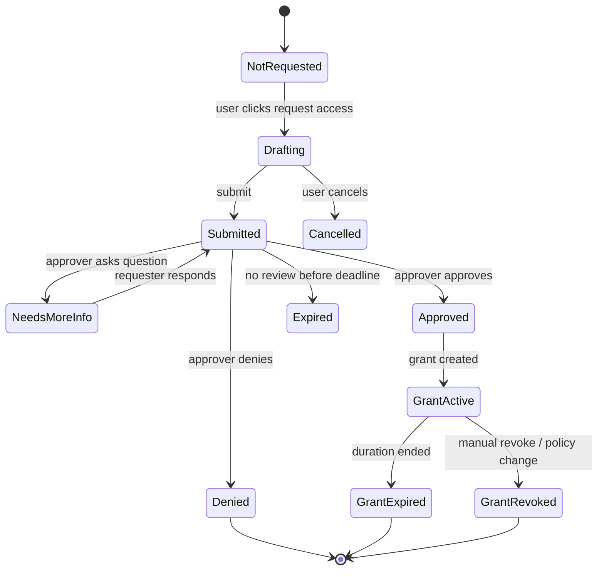
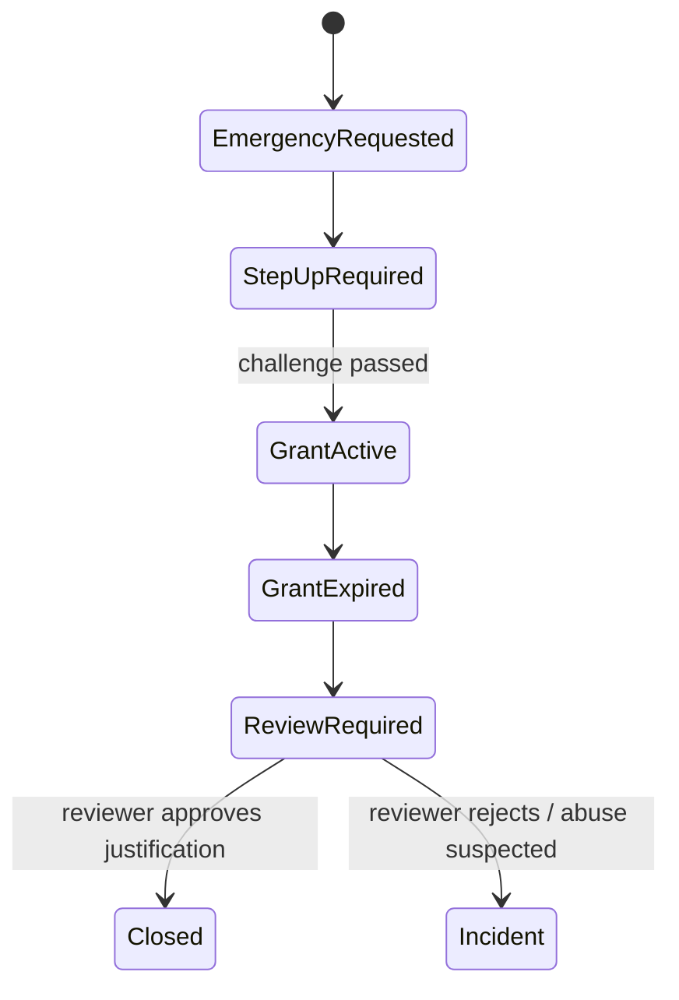

# Part 060 — Access Request Workflows

A mature authorization system does not stop at denial.

It gives the user a safe path to ask for access.

But access request workflows are dangerous when designed casually.

A button that says:

```txt
Request access
```

can become:

```txt
privilege escalation as a feature
```

The correct model is not “user asks, admin approves”.

The correct model is:

```txt
A denied subject requests a specific capability on a specific resource for a specific purpose and duration.
A policy-aware workflow routes that request to legitimate approvers.
The system grants the minimum access required, records why, expires it, and keeps the frontend projection synchronized.
```

This part builds the production model.

---

## 1. Access request is part of authorization

Access request is often treated as workflow UX.

That is incomplete.

It is authorization lifecycle management.

The lifecycle is:

```txt
denial -> explanation -> request -> review -> grant -> use -> expire/revoke -> audit/review
```

The React app participates in all stages:

```txt
- rendering request CTA after denial
- collecting reason/scope/duration
- showing request status
- preventing duplicate requests
- reflecting approved grants
- expiring stale UI
- guiding approvers
- showing audit trail
```

But the React app must not decide who gets access.

It only projects workflow state.

---

## 2. The request target must be precise

Bad request:

```txt
Please give me access.
```

Better request:

```txt
Subject: user_123
Action: case.approve
Resource: case_456
Tenant: tenant_789
Reason: Need to cover reviewer on approved leave
Duration: 2 days
Context: escalation queue Q3
```

A request without precise target is hard to approve safely.

Model it explicitly:

```ts
type AccessRequestTarget = {
  tenantId: string;
  resourceType: string;
  resourceId?: string;
  action: string;
  scope:
    | 'single_resource'
    | 'resource_collection'
    | 'tenant_role'
    | 'project_role'
    | 'temporary_delegation';
};

type AccessRequest = {
  id: string;
  requesterId: string;
  target: AccessRequestTarget;
  reason: string;
  requestedDuration?: string;
  status: AccessRequestStatus;
  createdAt: string;
  expiresAt?: string;
};

type AccessRequestStatus =
  | 'draft'
  | 'submitted'
  | 'needs_more_info'
  | 'approved'
  | 'denied'
  | 'expired'
  | 'cancelled'
  | 'grant_active'
  | 'grant_expired'
  | 'grant_revoked';
```

Access request target should use the same action vocabulary as authorization.

Do not maintain separate words for approval UI and policy engine.

---

## 3. Request access starts from a denial

The best request flow starts from a concrete denial.

Example decision:

```ts
type PermissionDecision = {
  allowed: false;
  code: 'DENIED';
  reason:
    | 'MISSING_PERMISSION'
    | 'NOT_RESOURCE_MEMBER'
    | 'WORKFLOW_ROLE_REQUIRED'
    | 'TENANT_ROLE_REQUIRED'
    | 'APPROVAL_REQUIRED';
  requestable: boolean;
  requestTemplate?: AccessRequestTemplate;
  correlationId: string;
};
```

When the user is denied, the server can say whether request is allowed.

```json
{
  "allowed": false,
  "reason": "WORKFLOW_ROLE_REQUIRED",
  "requestable": true,
  "requestTemplate": {
    "action": "case.approve",
    "resourceType": "case",
    "resourceId": "case_456",
    "suggestedDuration": "P2D",
    "requiredFields": ["reason", "managerId"]
  }
}
```

React should not infer requestability from UI state.

Requestability is policy too.

---

## 4. Request state machine

Access request is a workflow.

Model it as state.



Do not collapse this to `pending | approved | denied` too early.

The missing states are where bugs live.

---

## 5. Request form design

A request form should collect minimum justification.

Common fields:

```txt
- action/resource being requested
- reason/business justification
- duration
- urgency
- approver, when user-selected approver is allowed
- ticket/case/change request reference
- whether access is temporary or permanent
```

Example:

```tsx
type AccessRequestFormProps = {
  template: AccessRequestTemplate;
  onSubmit: (input: SubmitAccessRequestInput) => Promise<void>;
};

export function AccessRequestForm({ template, onSubmit }: AccessRequestFormProps) {
  const [reason, setReason] = useState('');
  const [duration, setDuration] = useState(template.suggestedDuration ?? 'P1D');

  const valid = reason.trim().length >= 20;

  return (
    <form
      onSubmit={(event) => {
        event.preventDefault();
        void onSubmit({
          action: template.action,
          resourceType: template.resourceType,
          resourceId: template.resourceId,
          reason,
          duration,
        });
      }}
    >
      <p>
        Requesting <strong>{template.action}</strong> on{' '}
        <strong>{template.resourceType}</strong>
      </p>

      <label>
        Business reason
        <textarea value={reason} onChange={(e) => setReason(e.target.value)} required minLength={20} />
      </label>

      <label>
        Duration
        <select value={duration} onChange={(e) => setDuration(e.target.value)}>
          <option value="PT4H">4 hours</option>
          <option value="P1D">1 day</option>
          <option value="P2D">2 days</option>
          <option value="P7D">7 days</option>
        </select>
      </label>

      <button disabled={!valid}>Submit request</button>
    </form>
  );
}
```

The UI makes safe requests easy.

The server makes unsafe requests impossible.

---

## 6. Server-side validation

The server should validate:

```txt
1. Requester is authenticated.
2. Request target exists, or target existence can be safely hidden.
3. Requester belongs to the tenant/context.
4. Requested action is requestable.
5. Requested scope is allowed for requester.
6. Requested duration does not exceed policy.
7. Reason satisfies policy.
8. Duplicate request policy is enforced.
9. Approver routing is computed server-side.
10. Audit event is written.
```

Pseudocode:

```ts
async function submitAccessRequest(ctx: RequestContext, input: SubmitAccessRequestInput) {
  const target = await resolveRequestTarget(input.target);

  const requestability = await policy.check({
    subject: ctx.subject,
    action: 'access_request.submit',
    resource: target,
    context: {
      requestedAction: input.action,
      requestedDuration: input.duration,
      tenantId: ctx.tenantId,
    },
  });

  if (!requestability.allowed) {
    throw forbidden(requestability.reason);
  }

  const route = await approverRouting.compute({
    requester: ctx.subject,
    target,
    requestedAction: input.action,
    duration: input.duration,
  });

  const request = await accessRequests.create({
    requesterId: ctx.subject.id,
    tenantId: ctx.tenantId,
    target,
    requestedAction: input.action,
    duration: input.duration,
    reason: input.reason,
    approverRoute: route,
  });

  await audit.write({
    type: 'ACCESS_REQUEST_SUBMITTED',
    requestId: request.id,
    requesterId: ctx.subject.id,
    tenantId: ctx.tenantId,
    target,
    requestedAction: input.action,
  });

  return request;
}
```

Never trust frontend-selected approver blindly.

Approver routing is authorization logic.

---

## 7. Approver routing

Who can approve access?

Naive answer:

```txt
admin
```

Better answer:

```txt
An approver must have authority over the resource, must not violate separation of duties,
must not be the requester for self-approval, and must be valid for the requested action/scope/duration.
```

Routing examples:

```txt
project document edit -> project owner
case approval permission -> case supervisor
tenant role grant -> tenant admin with grant-role capability
sensitive export -> data protection officer + manager
production break-glass -> security approver + incident commander
```

Routing result:

```ts
type ApproverRoute = {
  mode: 'single' | 'any_of' | 'all_of' | 'ordered';
  steps: Array<{
    id: string;
    approverType: 'user' | 'role' | 'group' | 'relationship';
    approverRef: string;
    required: boolean;
  }>;
};
```

React can display the route.

But the server computes and enforces it.

---

## 8. Separation of duties

Access request workflows must prevent self-approval.

Rules:

```txt
- requester cannot approve own request
- delegate cannot approve request that grants them direct benefit
- approver must not be subordinate when policy forbids it
- maker/checker workflows require different identities
- emergency break-glass requires after-the-fact review
```

Decision shape:

```ts
type ApprovalDecision = {
  allowed: boolean;
  reason?:
    | 'NOT_APPROVER'
    | 'SELF_APPROVAL_DENIED'
    | 'SEPARATION_OF_DUTIES_DENIED'
    | 'REQUEST_ALREADY_RESOLVED'
    | 'POLICY_VERSION_CHANGED';
};
```

UI should handle these reasons clearly.

```txt
You cannot approve this request because you are the requester.
```

But for sensitive resource existence, use safer wording.

---

## 9. Temporary grants

Most approved requests should create temporary grants.

Permanent grants should be exceptional.

Temporary grant model:

```ts
type TemporaryGrant = {
  id: string;
  subjectId: string;
  tenantId: string;
  action: string;
  resourceType: string;
  resourceId?: string;
  sourceRequestId: string;
  grantedBy: string;
  reason: string;
  startsAt: string;
  expiresAt: string;
  status: 'active' | 'expired' | 'revoked';
};
```

Grant creation should be transactional with approval:

```txt
approve request
create grant
write audit event
invalidate permission projection
notify requester
```

Do not approve the workflow and forget to update permission caches.

---

## 10. Expiry semantics

Expiry must be enforced by the authorization service.

React may show countdowns.

React may warn users.

React may revalidate.

But React cannot enforce expiry.

Frontend projection:

```json
{
  "temporaryGrants": [
    {
      "id": "grant_123",
      "action": "case.approve",
      "resourceType": "case",
      "resourceId": "case_456",
      "expiresAt": "2026-07-10T10:00:00Z"
    }
  ]
}
```

UI pattern:

```tsx
function TemporaryGrantNotice({ grant }: { grant: TemporaryGrant }) {
  return (
    <aside role="status">
      Temporary access active for {grant.action}. Expires {formatRelative(grant.expiresAt)}.
    </aside>
  );
}
```

On expiry:

```txt
- permission endpoint stops returning allowed action
- API rejects action
- frontend invalidates permission cache
- active screen shows expired grant recovery
```

---

## 11. Revocation

Access must be revocable before expiry.

Revocation triggers:

```txt
- requester no longer needs access
- approver revokes
- manager changes
- resource state changes
- user leaves tenant
- role changes
- incident response
- policy version change
```

Revocation endpoint:

```ts
async function revokeTemporaryGrant(ctx: RequestContext, grantId: string, reason: string) {
  const grant = await grants.get(grantId);

  await policy.enforce({
    subject: ctx.subject,
    action: 'temporary_grant.revoke',
    resource: grant,
    context: { tenantId: ctx.tenantId },
  });

  await grants.revoke(grantId, { revokedBy: ctx.subject.id, reason });
  await permissionInvalidation.publish({ subjectId: grant.subjectId, tenantId: grant.tenantId });
  await audit.write({ type: 'TEMPORARY_GRANT_REVOKED', grantId, reason });
}
```

React should show revoked state explicitly.

Do not leave an approved request looking active after revocation.

---

## 12. Duplicate request policy

Users will click request access repeatedly if nothing happens.

Decide duplicate behavior:

```txt
same requester + same action + same resource + pending request -> show existing request
same requester + same action + same resource + denied request -> allow appeal or block cooldown
same requester + same action + same resource + active grant -> show active grant
same resource but broader scope -> require explicit escalation
```

Frontend helper:

```ts
type ExistingAccessRequestResult =
  | { kind: 'none' }
  | { kind: 'pending'; requestId: string }
  | { kind: 'active_grant'; grantId: string; expiresAt: string }
  | { kind: 'cooldown'; retryAfter: string };
```

Use idempotency keys for submit.

```ts
await api.post('/access-requests', input, {
  headers: { 'Idempotency-Key': crypto.randomUUID() },
});
```

Duplicate handling is both UX and abuse prevention.

---

## 13. Request status UI

The requester needs status.

Status card:

```tsx
function AccessRequestStatusCard({ request }: { request: AccessRequest }) {
  return (
    <section>
      <h3>Access request</h3>
      <dl>
        <dt>Status</dt>
        <dd>{request.status}</dd>
        <dt>Action</dt>
        <dd>{request.target.action}</dd>
        <dt>Resource</dt>
        <dd>{request.target.resourceType}</dd>
        <dt>Requested at</dt>
        <dd>{formatTime(request.createdAt)}</dd>
      </dl>
    </section>
  );
}
```

Important states:

```txt
submitted -> waiting for approver
needs_more_info -> requester action needed
approved -> grant may be active or pending propagation
denied -> show safe denial reason
expired -> request no longer reviewable
grant_active -> show duration/revoke option
grant_expired -> show request again if policy allows
```

Avoid vague “pending” forever.

---

## 14. Approver inbox

Approvers need enough context to decide safely.

Show:

```txt
- requester identity
- requested action
- resource summary
- scope
- duration
- reason
- risk level
- existing requester roles/grants
- recent related requests
- conflict-of-interest warnings
- policy recommendation
- audit history link
```

Do not show data the approver is not allowed to see.

Approver UI is also authorization-gated.

```tsx
function ApprovalActions({ request }: { request: AccessRequest }) {
  const approve = useCan('access_request.approve', request);
  const deny = useCan('access_request.deny', request);

  return (
    <div>
      <Button disabled={!approve.allowed}>Approve</Button>
      <Button disabled={!deny.allowed}>Deny</Button>
    </div>
  );
}
```

Again: server enforces.

---

## 15. Approval action design

Approval should not be a one-click accident for sensitive access.

For low-risk:

```txt
Approve -> grant temporary access
```

For high-risk:

```txt
Approve -> confirm scope/duration -> optional step-up -> grant
```

Approval command:

```ts
type ApproveAccessRequestInput = {
  requestId: string;
  approvedScope: AccessRequestTarget;
  approvedDuration: string;
  approverComment?: string;
  idempotencyKey: string;
};
```

Server checks:

```txt
- request is still pending
- approver is authorized
- approved scope does not exceed requested scope unless escalation allowed
- approved duration does not exceed policy
- separation of duties holds
- policy version is current
```

Approval is not just setting status.

Approval creates authority.

---

## 16. Denial design

Denying request should require a reason for audit and user feedback.

```ts
type DenyAccessRequestInput = {
  requestId: string;
  reasonCode:
    | 'BUSINESS_JUSTIFICATION_INSUFFICIENT'
    | 'SCOPE_TOO_BROAD'
    | 'NOT_NEEDED_FOR_ROLE'
    | 'CONFLICT_OF_INTEREST'
    | 'POLICY_DENIED'
    | 'OTHER';
  comment?: string;
};
```

Public message may differ from internal reason.

Requester sees:

```txt
Denied: business justification was insufficient.
```

Audit sees:

```txt
Approver denied because requester is under review team conflict policy.
```

Separate safe user feedback from internal policy trace.

---

## 17. Needs more information

Binary approve/deny is not enough.

Approvers often need clarification.

State:

```txt
needs_more_info
```

Flow:

```txt
approver asks question
requester gets task
requester responds
request returns to submitted
SLA timer may pause or continue depending on policy
```

Model comments as first-class.

```ts
type AccessRequestComment = {
  id: string;
  requestId: string;
  authorId: string;
  visibility: 'requester_and_approvers' | 'internal_only';
  body: string;
  createdAt: string;
};
```

Do not put internal-only comments in requester payload.

---

## 18. Access request notification

Users need notification when status changes.

Channels:

```txt
- in-app notification
- email
- Slack/Teams, if enterprise integration exists
- task inbox
- audit feed
```

Frontend should update via:

```txt
- polling
- invalidation after mutation
- WebSocket/SSE event
- notification click revalidation
```

Event:

```ts
type AccessRequestEvent =
  | { type: 'ACCESS_REQUEST_APPROVED'; requestId: string }
  | { type: 'ACCESS_REQUEST_DENIED'; requestId: string }
  | { type: 'ACCESS_REQUEST_NEEDS_MORE_INFO'; requestId: string }
  | { type: 'TEMPORARY_GRANT_EXPIRED'; grantId: string }
  | { type: 'TEMPORARY_GRANT_REVOKED'; grantId: string };
```

After receiving event, invalidate permission projection.

---

## 19. Permission cache invalidation

Access request approval changes authorization.

The frontend must update.

On grant created:

```txt
- invalidate /session or /permissions
- invalidate affected resource query
- invalidate route loader data
- update navigation/menu if new route becomes visible
- update pending request status
```

With TanStack Query style keys:

```ts
await queryClient.invalidateQueries({ queryKey: ['permissions', tenantId, userId] });
await queryClient.invalidateQueries({ queryKey: ['access-requests', userId] });
await queryClient.invalidateQueries({ queryKey: ['resource', resourceType, resourceId] });
```

With router data:

```ts
router.revalidate();
```

Do not require full logout/login to pick up a grant.

That signals weak permission invalidation design.

---

## 20. Access request and resource lifecycle

Resources change while requests are pending.

Examples:

```txt
- case moved to closed state
- document deleted
- project archived
- requester removed from tenant
- approver lost authority
- policy changed
```

Server should re-evaluate on approval.

```txt
request submitted under policy v3
approval attempted under policy v4
server re-checks requestability and approver authority
server may require re-submit or deny
```

UI state:

```ts
type RequestReviewability =
  | { reviewable: true }
  | { reviewable: false; reason: 'RESOURCE_STATE_CHANGED' | 'POLICY_CHANGED' | 'REQUESTER_NO_LONGER_ELIGIBLE' };
```

Never approve stale authority blindly.

---

## 21. Scope narrowing and widening

Approvers may approve less than requested.

Example:

```txt
requested: edit all project documents for 7 days
approved: edit document doc_123 for 1 day
```

Scope narrowing is usually safe.

Scope widening is dangerous.

Policy:

```txt
approve narrower scope -> allowed if approver has authority
approve broader scope -> require new request or explicit escalation policy
```

UI should make final grant clear:

```txt
Approved scope differs from requested scope.
You now have access only to Document A until July 10.
```

Do not hide scope changes.

---

## 22. Emergency access / break-glass

Sometimes access is needed immediately.

Break-glass is not normal request access.

Break-glass properties:

```txt
- strong step-up authentication
- explicit emergency reason
- short expiry
- broad audit
- immediate alert
- after-the-fact review
- limited set of users/actions
```

State machine:



React should show break-glass mode with unmistakable UI.

```txt
Emergency access active. All actions are audited and require post-review.
```

Do not bury break-glass behind the same “request access” button.

---

## 23. Delegation

Delegation is a special access request.

A user delegates authority to another user.

Examples:

```txt
- manager delegates approval while on leave
- case owner delegates edit to backup investigator
- tenant admin delegates billing read access to finance user
```

Delegation model:

```ts
type Delegation = {
  id: string;
  delegatorId: string;
  delegateeId: string;
  tenantId: string;
  actions: string[];
  resourceScope: AccessRequestTarget;
  startsAt: string;
  expiresAt: string;
  reason: string;
  status: 'scheduled' | 'active' | 'expired' | 'revoked';
};
```

Rules:

```txt
- delegator can only delegate authority they actually hold
- some actions are non-delegable
- delegation should be temporary by default
- delegatee actions must audit delegator context when relevant
- separation of duties can block delegation
```

React should distinguish:

```txt
You have delegated access from Maya Chen until Friday.
```

Not:

```txt
You are Maya Chen.
```

Delegation is not impersonation.

---

## 24. Access request vs role request vs entitlement request

Not all requests are equal.

```txt
Access request
  specific action/resource permission

Role request
  membership in a role, often broad

Entitlement request
  plan/product capability, often billing/commercial

Delegation request
  temporary authority from another user

Break-glass request
  emergency access with post-review
```

React should not render one generic form for all.

Use request type:

```ts
type RequestKind =
  | 'resource_access'
  | 'role_membership'
  | 'entitlement'
  | 'delegation'
  | 'break_glass';
```

Different kinds have different approvers, risk, duration, audit, and revocation semantics.

---

## 25. Access review integration

Access requests create grants.

Grants need review.

Periodic access review answers:

```txt
Who has access?
Why?
Who approved it?
When does it expire?
Was it used?
Is it still needed?
```

Grant should retain source request:

```ts
type GrantProvenance = {
  source: 'access_request' | 'role_assignment' | 'delegation' | 'break_glass' | 'system_migration';
  sourceId: string;
  approvedBy?: string;
  reason?: string;
};
```

React admin UI should show provenance.

```txt
Granted via Access Request AR-123, approved by Jordan Lee, expires in 2 days.
```

Without provenance, later cleanup is guesswork.

---

## 26. Audit log design

Minimum audit events:

```txt
ACCESS_REQUEST_SUBMITTED
ACCESS_REQUEST_UPDATED
ACCESS_REQUEST_CANCELLED
ACCESS_REQUEST_NEEDS_MORE_INFO
ACCESS_REQUEST_APPROVED
ACCESS_REQUEST_DENIED
TEMPORARY_GRANT_CREATED
TEMPORARY_GRANT_USED
TEMPORARY_GRANT_EXPIRED
TEMPORARY_GRANT_REVOKED
BREAK_GLASS_ACTIVATED
BREAK_GLASS_REVIEWED
DELEGATION_CREATED
DELEGATION_REVOKED
```

Audit event shape:

```ts
type AccessWorkflowAuditEvent = {
  type: string;
  timestamp: string;
  requestId?: string;
  grantId?: string;
  tenantId: string;
  actorId: string;
  requesterId?: string;
  approverId?: string;
  subjectId?: string;
  action?: string;
  resourceType?: string;
  resourceId?: string;
  decision?: 'approved' | 'denied' | 'revoked' | 'expired';
  reasonCode?: string;
  requestIdempotencyKey?: string;
  correlationId: string;
};
```

Audit is not optional.

Access workflows exist to explain authority.

If they do not produce reliable audit, they fail their own purpose.

---

## 27. Frontend route model

Access request screens usually include:

```txt
/request-access/new
/request-access/:requestId
/request-access/inbox
/request-access/history
/admin/access/grants
/admin/access/reviews
```

Route metadata:

```ts
type RouteHandle = {
  requiredAction: string;
  resource?: string;
};

export const handle: RouteHandle = {
  requiredAction: 'access_request.review',
  resource: 'tenant',
};
```

Loader-level checks:

```ts
export async function loader({ request, params }: LoaderArgs) {
  const session = await requireSession(request);
  const accessRequest = await accessRequests.get(params.requestId);

  await authorize(session, 'access_request.view', accessRequest);

  return { accessRequest };
}
```

Approver inbox must not list requests the viewer cannot review.

---

## 28. API contract

Useful endpoints:

```txt
GET    /access/request-template?action=&resourceType=&resourceId=
POST   /access/requests
GET    /access/requests/:id
GET    /access/requests?role=requester|approver
POST   /access/requests/:id/cancel
POST   /access/requests/:id/approve
POST   /access/requests/:id/deny
POST   /access/requests/:id/comment
GET    /access/grants
POST   /access/grants/:id/revoke
```

Request template endpoint is important.

It lets server tell React:

```txt
- whether request is possible
- what fields are required
- maximum duration
- suggested approvers, if any
- safe denial copy
```

Do not hardcode request rules in the React form.

---

## 29. Request template

Template shape:

```ts
type AccessRequestTemplate = {
  requestable: boolean;
  nonRequestableReason?: string;
  action: string;
  resourceType: string;
  resourceId?: string;
  maxDuration: string;
  suggestedDuration: string;
  requiresReason: boolean;
  requiresTicket: boolean;
  requiredFields: Array<'reason' | 'ticketId' | 'duration' | 'managerId'>;
  approverHint?: string;
  riskLevel: 'low' | 'medium' | 'high';
};
```

React flow:

```txt
user clicks Request Access
React fetches request template
if requestable=false show safe message
if requestable=true render form from template
submit request
show request status
```

This keeps policy close to the server.

---

## 30. Access request from hidden actions

If you hide actions the user cannot perform, how do they request access?

There are two patterns.

### Pattern A — Hide non-requestable, show requestable

```txt
If action is denied and requestable, render disabled/request CTA.
If action is denied and not requestable, hide it.
```

### Pattern B — Dedicated access center

```txt
User opens Access Center and requests known roles/resources.
```

Use both for mature apps.

Inline request is best for concrete task.

Access center is best for planned access.

---

## 31. Request access CTA

Component:

```tsx
type RequestAccessButtonProps = {
  decision: PermissionDecision;
  onRequest: (template: AccessRequestTemplate) => void;
};

function RequestAccessButton({ decision, onRequest }: RequestAccessButtonProps) {
  if (decision.allowed) return null;
  if (!decision.requestable || !decision.requestTemplate) return null;

  return (
    <Button onClick={() => onRequest(decision.requestTemplate)}>
      Request access
    </Button>
  );
}
```

Use decision-provided template.

Do not build access requests from arbitrary user-entered action strings.

---

## 32. Preventing privilege escalation

Access request workflows create a new attack surface.

Controls:

```txt
- deny-by-default requestability
- server-computed approver route
- no self-approval
- no scope widening without explicit escalation
- duration caps
- sensitive actions require step-up
- duplicate/cooldown policy
- audit every transition
- request approval re-checks current policy
- grants expire by default
- grant usage is logged
- revoke on tenant membership loss
```

The system must be safe even if a user tampers with the form payload.

Example tampering:

```json
{
  "action": "tenant.owner.transfer",
  "duration": "P3650D",
  "resourceType": "tenant",
  "resourceId": "tenant_important"
}
```

Server should reject because action/scope/duration are not requestable by that user.

---

## 33. Multi-tenant considerations

Access request must be tenant-scoped.

Every request includes tenant.

Every approver route is computed within tenant.

Every grant is tenant-bound.

Every cache key includes tenant.

```ts
const accessRequestKey = ['access-request', tenantId, requestId];
const approverInboxKey = ['access-request-inbox', tenantId, viewerId];
```

If the user switches tenant:

```txt
- clear draft request forms
- invalidate request templates
- hide pending requests from previous tenant
- reload permission projection
```

Never let an approval from Tenant A create grant in Tenant B.

---

## 34. Regulated case management example

Suppose a user tries to approve a case.

They are denied because only assigned reviewers can approve.

Decision:

```json
{
  "allowed": false,
  "reason": "WORKFLOW_ROLE_REQUIRED",
  "requestable": true,
  "requestTemplate": {
    "action": "case.approve",
    "resourceType": "case",
    "resourceId": "case_123",
    "suggestedDuration": "P1D",
    "maxDuration": "P3D",
    "requiresReason": true,
    "riskLevel": "high"
  }
}
```

Request:

```txt
I need temporary reviewer access for case_123 because the assigned reviewer is unavailable and the SLA expires today.
```

Approver route:

```txt
case supervisor + compliance reviewer
```

Grant:

```txt
case.approve on case_123, expires in 24 hours
```

Audit:

```txt
request submitted -> approved by supervisor -> approved by compliance -> temporary grant created -> case approved -> grant expired
```

This is defensible.

A broad role grant would not be.

---

## 35. Request access and workflow state

Some access only makes sense in certain resource states.

Example:

```txt
case.approve is requestable only when case.status = READY_FOR_REVIEW
case.editEvidence is not requestable after case.status = CLOSED
document.publish is requestable only from DRAFT
```

Request template should include resource state.

```ts
type RequestTemplateContext = {
  resourceState: string;
  requestableUntil?: string;
  stateReason?: string;
};
```

On approval, server re-checks state.

If state changed, request becomes not reviewable.

React shows:

```txt
This request can no longer be approved because the case has moved to Closed.
```

---

## 36. UX for denied access request

Denial should not be a dead end.

Possible next states:

```txt
- user can edit and resubmit with better reason
- user can appeal
- user can request narrower scope
- user can ask resource owner directly
- user cannot request again due to policy
```

Response:

```ts
type DeniedRequestProjection = {
  status: 'denied';
  publicReason: string;
  nextActions: Array<'resubmit' | 'appeal' | 'request_narrower_scope' | 'none'>;
  cooldownUntil?: string;
};
```

Do not always show “Try again”.

Sometimes denial is final.

---

## 37. Access request abuse controls

Users can spam requests.

Controls:

```txt
- rate limit request submissions
- deduplicate pending requests
- require reason length/quality for high-risk access
- cooldown after repeated denial
- notify managers only for valid requestable targets
- hide approver identities if exposing them creates pressure
- audit repeated broad-scope attempts
```

Frontend should handle rate limit gracefully:

```txt
You have submitted several similar requests. Please wait before trying again.
```

Do not expose internal abuse scores.

---

## 38. Testing matrix

```txt
Request creation
[ ] denied permission with requestable=true shows Request Access CTA
[ ] denied permission with requestable=false does not show CTA
[ ] request template is loaded from server
[ ] tampered action is rejected server-side
[ ] duration over max is rejected server-side
[ ] duplicate request returns existing pending request
[ ] request reason is required when policy requires it

Approval
[ ] unauthorized viewer cannot see approver inbox item
[ ] approver can approve valid request
[ ] requester cannot self-approve
[ ] approver cannot widen scope unless policy allows
[ ] approval re-checks current resource state
[ ] approved request creates temporary grant
[ ] approval invalidates permission cache

Grant lifecycle
[ ] temporary grant allows target action
[ ] grant expires server-side
[ ] expired grant removes UI capability
[ ] revoked grant removes UI capability
[ ] tenant switch clears request/grant projection

Audit
[ ] request submission is audited
[ ] approval/denial is audited
[ ] grant creation/usage/expiry/revocation is audited
[ ] audit event includes requester, approver, action, resource, tenant, reason

UX
[ ] requester sees pending status
[ ] requester sees needs-more-info state
[ ] approver sees risk/scope/duration
[ ] denial shows safe reason
[ ] break-glass mode shows unmistakable warning
```

Test workflows as workflows.

Do not only test buttons.

---

## 39. Observability

Useful metrics:

```txt
access_request.submitted.count
access_request.approved.count
access_request.denied.count
access_request.needs_more_info.count
access_request.time_to_approval.seconds
access_request.duplicate.count
temporary_grant.created.count
temporary_grant.expired.count
temporary_grant.revoked.count
temporary_grant.used.count
break_glass.activated.count
access_request.self_approval_denied.count
access_request.scope_widen_denied.count
```

Useful alerts:

```txt
- spike in high-risk access requests
- repeated broad-scope requests by same requester
- grants not expiring
- high number of break-glass activations
- approval by unusual approver
- grant used after policy should have revoked it
```

Authorization workflows require operational visibility.

---

## 40. Anti-pattern catalog

Avoid these:

```txt
- generic “request access” without action/resource/scope
- letting requester choose any approver without server validation
- approving broad roles when narrow grant would work
- permanent grants by default
- no expiry
- no self-approval prevention
- no separation-of-duties rules
- no policy re-check at approval time
- no cache invalidation after grant
- no audit provenance
- no revocation
- no duplicate handling
- request UI hardcodes requestability instead of using server template
- hiding denial reason so user cannot recover
- exposing internal policy trace to requester
```

If your request workflow makes access easier to obtain than the original policy intended, it is not recovery.

It is a bypass.

---

## 41. Design checklist

```txt
Request model
[ ] Request target includes subject/action/resource/context/tenant.
[ ] Requestability is decided server-side.
[ ] Request template comes from server.
[ ] Request includes reason and duration where required.
[ ] Duplicate request behavior is defined.
[ ] Request state machine includes needs_more_info, expired, cancelled, revoked.

Approval model
[ ] Approver route is computed server-side.
[ ] Self-approval is blocked.
[ ] Separation of duties is enforced.
[ ] Approval re-checks current resource/policy state.
[ ] Scope widening is blocked or explicitly escalated.
[ ] High-risk approval requires step-up.

Grant model
[ ] Grants are temporary by default.
[ ] Grants include provenance.
[ ] Grant expiry is enforced server-side.
[ ] Grants are revocable.
[ ] Permission cache invalidates on grant create/revoke/expire.
[ ] Grant use is auditable.

Frontend
[ ] Denied requestable actions show Request Access CTA.
[ ] Non-requestable actions do not create false hope.
[ ] Requester can see status.
[ ] Approver gets enough context but not unauthorized data.
[ ] Tenant switch clears relevant request state.
[ ] Break-glass mode is visually distinct.

Audit and ops
[ ] Every transition creates audit event.
[ ] Metrics exist for request/approval/grant lifecycle.
[ ] Alerts exist for suspicious request and grant patterns.
```

---

## 42. Final mental model

Access request is not a convenience layer.

It is the recovery path of authorization.

A good workflow preserves least privilege:

```txt
denied action
  -> precise request
  -> legitimate approver
  -> narrow temporary grant
  -> synchronized permission projection
  -> expiry/revocation
  -> audit and review
```

A bad workflow destroys least privilege:

```txt
denied action
  -> broad role request
  -> admin approves casually
  -> permanent access
  -> no audit provenance
```

React's role is to make the safe path natural.

The server's role is to make unsafe paths impossible.

When access request workflows are done well, denial becomes productive without becoming porous.

That is the mark of a mature authorization system.

---

## 43. References

- OWASP Authorization Cheat Sheet — least privilege, deny-by-default, validate permissions on every request.
- OWASP Logging Cheat Sheet — security event logging and attributes.
- NIST SP 800-53 Rev. 5 AC-2 and AC-6 — account management and least privilege control families.
- NIST SP 800-162 — ABAC concepts for subject/resource/action/environment attributes.
- Previous parts in this series: Part 041 Authorization Mental Model, Part 048 Frontend Permission Contract, Part 049 Permission Cache Invalidation, Part 058 Permission Reason and User Feedback, Part 059 Admin Impersonation UI.
