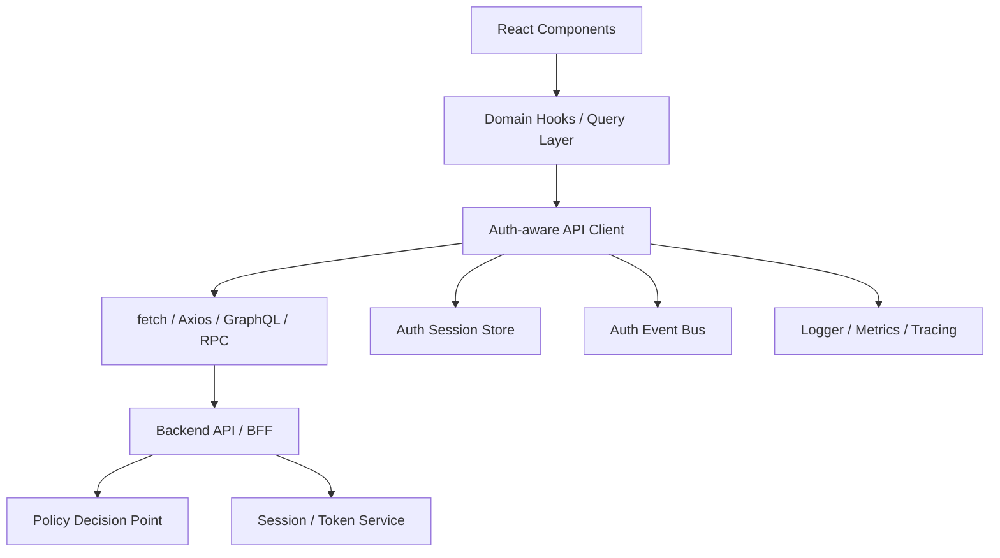
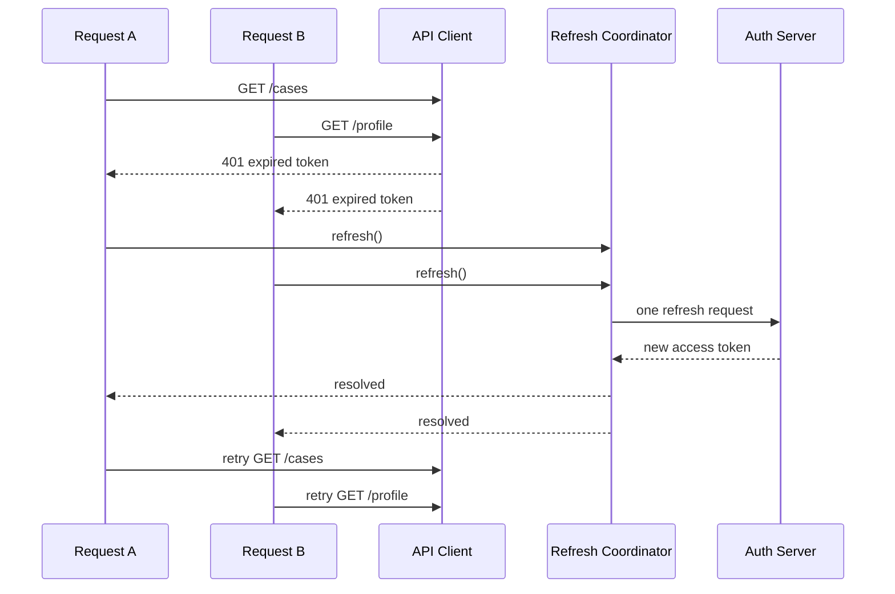

# Part 061 — API Client Auth Boundary

A React app talks to the backend through an API client.

That sounds mundane.

It is not.

The API client is the place where several dangerous things quietly converge:

```txt
session state
access token attachment
cookie semantics
CSRF protection
retry policy
refresh token rotation
tenant context
impersonation context
correlation IDs
error normalization
abort/cancellation
cache invalidation signals
observability
```

If the API client is casual, the whole auth system becomes casual.

A common implementation looks like this:

```ts
const token = localStorage.getItem('token')

export function api(path: string, options?: RequestInit) {
  return fetch(`/api${path}`, {
    ...options,
    headers: {
      ...options?.headers,
      Authorization: `Bearer ${token}`,
    },
  })
}
```

This is not an API client boundary.

It is a token stapler.

A production API client must model the request lifecycle as a state machine.

It must know when a request is safe to retry, when it must be canceled, when a `401` means session recovery, when a `403` means policy denial, when a token refresh should be single-flight, and when the correct behavior is to fail closed.

The API client is not the authorization authority.

But it is the frontend's most important enforcement adapter.

---

## 1. What the API client is responsible for

The API client has five responsibilities.

```txt
1. Transport authentication material correctly.
2. Attach request context safely.
3. Normalize auth-related failures.
4. Coordinate recovery without replaying unsafe requests.
5. Emit signals for cache, router, UI, and observability layers.
```

It does not decide whether the user is authorized.

It does not trust decoded JWT claims as policy.

It does not hide backend errors with generic redirects.

It does not blindly refresh-and-retry every failed request.

A good API client is boring because it makes failure explicit.

---

## 2. Boundary map

The API client sits below React components and above browser/network primitives.



The important point:

```txt
React components should not know how authentication is transported.
```

A component should not decide:

```txt
- should I attach Authorization header?
- should I include credentials?
- should I refresh token?
- should I redirect after 401?
- should I retry this POST?
```

Those decisions belong to the client boundary.

---

## 3. The API client must support multiple auth transports

The same React app may run with different auth architecture choices:

```txt
- BFF + HTTP-only cookie session
- server session cookie directly to API
- access token in memory with Authorization header
- OAuth/OIDC SDK that returns access token on demand
- hybrid cookie + CSRF token
- internal service gateway with short-lived proof token
```

So the API client should not be hardcoded around one token source.

Use a transport strategy.

```ts
type AuthTransport =
  | { kind: 'cookie'; credentials: RequestCredentials; csrf?: CsrfProvider }
  | { kind: 'bearer'; getAccessToken: () => Promise<string | null> }
  | { kind: 'none' }

type CsrfProvider = {
  getToken(): string | null
}
```

The API client can then attach auth material based on configuration.

```ts
async function applyAuthTransport(
  headers: Headers,
  transport: AuthTransport,
  method: string,
): Promise<RequestCredentials | undefined> {
  if (transport.kind === 'bearer') {
    const token = await transport.getAccessToken()
    if (token) headers.set('Authorization', `Bearer ${token}`)
    return undefined
  }

  if (transport.kind === 'cookie') {
    if (isUnsafeMethod(method)) {
      const csrf = transport.csrf?.getToken()
      if (csrf) headers.set('X-CSRF-Token', csrf)
    }
    return transport.credentials
  }

  return undefined
}

function isUnsafeMethod(method: string) {
  return !['GET', 'HEAD', 'OPTIONS', 'TRACE'].includes(method.toUpperCase())
}
```

This keeps React code independent from storage details.

A route loader, mutation hook, or component can call:

```ts
api.get('/cases/123')
```

without knowing whether the session is cookie-backed, token-backed, or BFF-backed.

---

## 4. Do not make every request know about auth

A common smell:

```ts
await fetch('/api/cases', {
  headers: {
    Authorization: `Bearer ${auth.accessToken}`,
    'X-Tenant-ID': tenantId,
  },
})
```

Repeated across the codebase, this creates drift.

Some calls forget the tenant.

Some calls forget credentials.

Some calls retry wrong.

Some calls parse `403` differently.

Some calls redirect on any error.

The fix is not just a wrapper.

The fix is a typed boundary.

```ts
type ApiClient = {
  request<T>(input: ApiRequest): Promise<T>
  get<T>(path: string, init?: ApiRequestInit): Promise<T>
  post<T>(path: string, body?: unknown, init?: ApiRequestInit): Promise<T>
  patch<T>(path: string, body?: unknown, init?: ApiRequestInit): Promise<T>
  delete<T>(path: string, init?: ApiRequestInit): Promise<T>
}
```

The caller provides domain intent.

The API client provides security mechanics.

---

## 5. Normalize error shape before React sees it

Never let every feature parse auth failures differently.

Backend error responses should ideally use a typed problem shape.

```ts
type ApiProblem = {
  type: string
  title: string
  status: number
  detail?: string
  code?: string
  correlationId?: string
  auth?: AuthProblem
}

type AuthProblem =
  | { kind: 'unauthenticated'; reason: 'missing_session' | 'expired_session' | 'invalid_token' }
  | { kind: 'forbidden'; reason: 'missing_permission' | 'tenant_mismatch' | 'resource_denied'; required?: string[] }
  | { kind: 'step_up_required'; reason: 'mfa_required' | 'recent_login_required'; challengeUrl?: string }
  | { kind: 'session_revoked'; reason: 'logout' | 'admin_revoked' | 'compromise_suspected' }
```

The API client should convert transport-level and HTTP-level failures into typed errors.

```ts
class ApiError extends Error {
  constructor(
    message: string,
    readonly status: number,
    readonly problem?: ApiProblem,
  ) {
    super(message)
    this.name = 'ApiError'
  }

  get isAuthError() {
    return this.status === 401 || this.status === 403
  }
}
```

React code should not inspect raw strings like:

```txt
"jwt expired"
```

or:

```txt
"Access denied"
```

It should receive a stable contract.

---

## 6. 401 and 403 must mean different things

A very common bug:

```ts
if (response.status === 401 || response.status === 403) {
  redirectToLogin()
}
```

This destroys semantics.

`401 Unauthorized` means the request lacks valid authentication credentials.

`403 Forbidden` means the server understood the request but refuses to authorize it.

Frontend behavior should differ.

```txt
401 expired session       -> attempt safe recovery, then login if recovery fails
401 missing session       -> login
401 invalid token         -> clear auth state and login
403 missing permission    -> show forbidden / disable action / request access
403 tenant mismatch       -> force tenant context recovery
403 step-up required      -> start step-up flow
403 resource denied       -> show not-found-like response if resource existence is sensitive
```

The API client should preserve this difference.

---

## 7. Refresh-and-retry is not a universal solution

A naive API client does this:

```txt
request fails with 401
refresh token
retry original request
```

This is dangerous when applied blindly.

Questions you must answer first:

```txt
Was the original request idempotent?
Was it a mutation?
Did the server already process it?
Was the request body replayable?
Was there an idempotency key?
Was the failure caused by expired token or revoked session?
Are multiple tabs refreshing at the same time?
Was the user logging out?
```

For `GET`, safe retry is usually acceptable after refresh.

For mutation, retry needs explicit policy.

```ts
type RetryAfterRefreshPolicy =
  | 'never'
  | 'safe-methods-only'
  | 'idempotency-key-required'
```

Do not retry unsafe mutations unless you can prove replay safety.

---

## 8. Single-flight token refresh

If ten requests hit expired token at once, the API client must not trigger ten refresh calls.

Use a single-flight coordinator.

```ts
class RefreshCoordinator {
  private inFlight: Promise<void> | null = null

  constructor(private readonly refresh: () => Promise<void>) {}

  run(): Promise<void> {
    if (!this.inFlight) {
      this.inFlight = this.refresh().finally(() => {
        this.inFlight = null
      })
    }

    return this.inFlight
  }
}
```

The request flow becomes:



But remember: this only solves in-tab concurrency.

Cross-tab coordination was covered in Part 018.

For browser-wide correctness, combine single-flight with `BroadcastChannel`, a refresh lock, or server-side token family reuse detection.

---

## 9. Refresh failure is an auth event

When refresh fails, do not just throw.

The application must know what happened.

```ts
type AuthEvent =
  | { type: 'session.expired'; correlationId?: string }
  | { type: 'session.revoked'; reason?: string; correlationId?: string }
  | { type: 'session.refresh_failed'; reason: string; correlationId?: string }
  | { type: 'permission.denied'; path: string; correlationId?: string }
  | { type: 'step_up.required'; challengeUrl?: string; correlationId?: string }
```

The API client emits an event.

The auth store handles state transition.

The router handles redirect.

The query/cache layer clears sensitive data.

The UI shows recovery.

Do not let the API client directly mutate every subsystem.

Use event boundaries.

---

## 10. A production fetch client skeleton

Below is a simplified but realistic boundary.

```ts
type HttpMethod = 'GET' | 'POST' | 'PUT' | 'PATCH' | 'DELETE'

type ApiRequestInit = {
  signal?: AbortSignal
  headers?: HeadersInit
  retryAfterRefresh?: RetryAfterRefreshPolicy
  idempotencyKey?: string
  authRequired?: boolean
  tenantScoped?: boolean
}

type ApiClientConfig = {
  baseUrl: string
  transport: AuthTransport
  refresh?: () => Promise<void>
  onAuthEvent?: (event: AuthEvent) => void
  getTenantId?: () => string | null
  getCorrelationId?: () => string
}

export function createApiClient(config: ApiClientConfig): ApiClient {
  const refreshCoordinator = config.refresh
    ? new RefreshCoordinator(config.refresh)
    : null

  async function request<T>(
    method: HttpMethod,
    path: string,
    body?: unknown,
    init: ApiRequestInit = {},
    attemptedRefresh = false,
  ): Promise<T> {
    const headers = new Headers(init.headers)
    headers.set('Accept', 'application/json')

    const correlationId = config.getCorrelationId?.()
    if (correlationId) headers.set('X-Correlation-ID', correlationId)

    const tenantId = config.getTenantId?.()
    if (init.tenantScoped !== false && tenantId) {
      headers.set('X-Tenant-ID', tenantId)
    }

    if (body !== undefined) {
      headers.set('Content-Type', 'application/json')
    }

    if (init.idempotencyKey) {
      headers.set('Idempotency-Key', init.idempotencyKey)
    }

    const credentials = await applyAuthTransport(headers, config.transport, method)

    const response = await fetch(new URL(path, config.baseUrl), {
      method,
      headers,
      body: body === undefined ? undefined : JSON.stringify(body),
      credentials,
      signal: init.signal,
    })

    if (response.ok) {
      if (response.status === 204) return undefined as T
      return parseJson<T>(response)
    }

    const error = await parseApiError(response)

    if (
      response.status === 401 &&
      !attemptedRefresh &&
      refreshCoordinator &&
      canRetryAfterRefresh(method, init)
    ) {
      try {
        await refreshCoordinator.run()
        return request<T>(method, path, body, init, true)
      } catch (refreshError) {
        config.onAuthEvent?.({
          type: 'session.refresh_failed',
          reason: refreshError instanceof Error ? refreshError.message : 'unknown',
          correlationId,
        })
        throw error
      }
    }

    if (response.status === 401) {
      config.onAuthEvent?.({ type: 'session.expired', correlationId })
    }

    if (response.status === 403) {
      const auth = error.problem?.auth
      if (auth?.kind === 'step_up_required') {
        config.onAuthEvent?.({
          type: 'step_up.required',
          challengeUrl: auth.challengeUrl,
          correlationId,
        })
      } else {
        config.onAuthEvent?.({ type: 'permission.denied', path, correlationId })
      }
    }

    throw error
  }

  return {
    request: <T>(input) => request<T>(input.method, input.path, input.body, input),
    get: <T>(path, init) => request<T>('GET', path, undefined, init),
    post: <T>(path, body, init) => request<T>('POST', path, body, init),
    patch: <T>(path, body, init) => request<T>('PATCH', path, body, init),
    delete: <T>(path, init) => request<T>('DELETE', path, undefined, init),
  }
}

function canRetryAfterRefresh(method: HttpMethod, init: ApiRequestInit): boolean {
  const policy = init.retryAfterRefresh ?? 'safe-methods-only'

  if (policy === 'never') return false
  if (policy === 'safe-methods-only') return method === 'GET'
  if (policy === 'idempotency-key-required') return Boolean(init.idempotencyKey)

  return false
}
```

This is still not a full production client.

But it has the right shape:

```txt
- auth transport is abstracted
- tenant/correlation context is centralized
- refresh is single-flight
- retry policy is explicit
- auth events are emitted
- errors are normalized
```

---

## 11. Parsing errors safely

Do not assume every failed response is JSON.

Your auth server, WAF, CDN, gateway, or proxy may return HTML, plain text, or empty body.

```ts
async function parseApiError(response: Response): Promise<ApiError> {
  const contentType = response.headers.get('content-type') ?? ''

  if (contentType.includes('application/json')) {
    try {
      const problem = (await response.json()) as ApiProblem
      return new ApiError(problem.title ?? response.statusText, response.status, problem)
    } catch {
      return new ApiError(response.statusText, response.status)
    }
  }

  const text = await response.text().catch(() => '')
  const message = text && text.length < 200 ? text : response.statusText

  return new ApiError(message, response.status)
}
```

Do not display raw server error text to users.

Normalize it first.

---

## 12. Request cancellation is part of auth correctness

When the user logs out, switches tenant, or loses session, in-flight requests may still return later.

If old responses are allowed to update UI, you get stale authenticated state.

Use `AbortController` and auth epoch checks.

```ts
class AuthEpoch {
  private value = 0

  current() {
    return this.value
  }

  bump() {
    this.value += 1
  }
}

const authEpoch = new AuthEpoch()

async function guardedRequest<T>(fn: () => Promise<T>): Promise<T> {
  const epochAtStart = authEpoch.current()
  const result = await fn()

  if (epochAtStart !== authEpoch.current()) {
    throw new ApiError('Stale auth response ignored', 499)
  }

  return result
}
```

On logout:

```ts
authEpoch.bump()
abortAllInFlightRequests()
queryClient.clear()
clearAuthProjection()
```

Do not merely delete token and navigate.

---

## 13. Abort registry

You can keep a registry of abort controllers.

```ts
class RequestAbortRegistry {
  private controllers = new Set<AbortController>()

  create(): AbortSignal {
    const controller = new AbortController()
    this.controllers.add(controller)

    controller.signal.addEventListener('abort', () => {
      this.controllers.delete(controller)
    })

    return controller.signal
  }

  abortAll(reason?: string) {
    for (const controller of this.controllers) {
      controller.abort(reason)
    }

    this.controllers.clear()
  }
}
```

Then the auth system can call:

```ts
requestAbortRegistry.abortAll('logout')
```

when session changes.

This is especially important for:

```txt
- search requests
- long polling
- file uploads
- export jobs
- background sync
- tenant switch
- impersonation exit
```

---

## 14. Axios interceptors: useful but easy to misuse

Axios interceptors can centralize request and response behavior.

But they often become invisible global magic.

Bad pattern:

```ts
axios.interceptors.response.use(undefined, async error => {
  if (error.response.status === 401) {
    await refresh()
    return axios(error.config)
  }
})
```

Problems:

```txt
- retries all methods unless guarded
- can replay POST accidentally
- can loop forever
- may not handle multiple simultaneous refreshes
- may reuse stale config
- may bypass caller cancellation
- may hide 403 as login problem
```

If using Axios, keep the same policy model.

```ts
api.interceptors.response.use(
  response => response,
  async error => {
    const config = error.config as AxiosRequestConfig & {
      _attemptedRefresh?: boolean
      retryAfterRefresh?: RetryAfterRefreshPolicy
    }

    const status = error.response?.status

    if (
      status === 401 &&
      !config._attemptedRefresh &&
      canRetryAfterRefresh((config.method ?? 'GET').toUpperCase() as HttpMethod, config)
    ) {
      config._attemptedRefresh = true
      await refreshCoordinator.run()
      return api(config)
    }

    throw normalizeAxiosError(error)
  },
)
```

Interceptors should implement explicit policy.

Not vibes.

---

## 15. Cookie auth requires CSRF strategy

If your auth model uses cookies, the browser attaches cookies automatically based on origin/site rules.

That is convenient.

It also means unsafe methods need CSRF protection.

The API client should not let every mutation decide CSRF handling.

Centralize it:

```ts
if (transport.kind === 'cookie' && isUnsafeMethod(method)) {
  const csrf = csrfStore.getToken()
  if (!csrf) {
    throw new ApiError('Missing CSRF token', 419)
  }

  headers.set('X-CSRF-Token', csrf)
}
```

For BFF designs, the CSRF token may come from:

```txt
- a bootstrap `/session` response
- a non-HttpOnly anti-CSRF cookie paired with server validation
- a meta tag rendered by server
- a dedicated `/csrf` endpoint
```

React should treat it as request protection material, not as identity.

---

## 16. Tenant context is not a cosmetic header

Multi-tenant apps often attach:

```txt
X-Tenant-ID: tenant_123
```

This header is not authorization by itself.

It is context.

Server must verify:

```txt
- authenticated user belongs to tenant
- tenant is active
- subject has required membership or role
- resource belongs to tenant
- requested action is valid for that tenant/resource
```

The API client can centralize tenant context.

```ts
type TenantContextProvider = {
  getTenantId(): string | null
  getTenantEpoch(): number
}
```

Then query/cache layers can include tenant epoch in keys.

But never treat the tenant header as proof.

It is input.

---

## 17. Correlation ID is not optional

Auth bugs are hard to debug because they cross layers:

```txt
browser -> router -> API client -> gateway -> auth middleware -> policy engine -> database
```

Add correlation ID at the API client boundary.

```ts
headers.set('X-Correlation-ID', correlationId)
```

The server should include it in errors.

```json
{
  "type": "https://example.com/problems/forbidden",
  "title": "Forbidden",
  "status": 403,
  "code": "MISSING_PERMISSION",
  "correlationId": "req_01HX..."
}
```

The React error boundary can show:

```txt
Request ID: req_01HX...
```

This helps support without leaking internals.

---

## 18. Idempotency keys for sensitive mutations

If the API client may retry a mutation after auth recovery, use idempotency keys.

```ts
await api.post('/payments', payload, {
  idempotencyKey: crypto.randomUUID(),
  retryAfterRefresh: 'idempotency-key-required',
})
```

Server behavior:

```txt
same idempotency key + same actor + same operation -> return same result
same idempotency key + different payload -> reject
same idempotency key + different actor/tenant -> reject
```

This is critical for:

```txt
- payment creation
- case submission
- approval action
- file upload finalization
- irreversible workflow transition
```

Do not replay irreversible actions casually.

---

## 19. Domain API clients should wrap the generic client

The low-level API client should not spread endpoint strings everywhere.

Create domain clients.

```ts
type CaseApi = {
  getCase(id: CaseId, options?: ApiRequestInit): Promise<CaseDetail>
  transitionCase(id: CaseId, command: TransitionCommand): Promise<CaseDetail>
  listCaseActions(id: CaseId): Promise<AllowedAction[]>
}

function createCaseApi(api: ApiClient): CaseApi {
  return {
    getCase: (id, options) => api.get(`/cases/${id}`, options),
    transitionCase: (id, command) =>
      api.post(`/cases/${id}/transitions`, command, {
        idempotencyKey: command.idempotencyKey,
        retryAfterRefresh: 'idempotency-key-required',
      }),
    listCaseActions: (id) => api.get(`/cases/${id}/actions`),
  }
}
```

This lets domain operations express replay risk.

The generic client handles security mechanics.

---

## 20. GraphQL and RPC still need the same boundary

Do not think this is only REST.

GraphQL clients still need:

```txt
- auth transport
- 401/403 handling
- operation-level retry policy
- tenant context
- correlation ID
- cache invalidation
- field-level denial handling
```

RPC clients still need:

```txt
- typed auth errors
- session recovery
- retry/idempotency policy
- cancellation
- audit-friendly metadata
```

Transport changes.

Invariants do not.

---

## 21. Never let the API client become a policy engine

It is tempting to add logic like:

```ts
if (user.role !== 'admin') {
  throw new Error('Forbidden')
}
```

inside the API client.

Do not do this.

The API client can avoid obviously wrong calls when a permission projection says no.

But it should not implement authorization policy.

Better:

```ts
if (!permissionSnapshot.can('case.approve', { id: caseId })) {
  throw new ClientDeniedError('case.approve')
}

await api.post(`/cases/${caseId}/approve`, command)
```

And the server still checks.

Frontend denial is UX optimization.

Server denial is security enforcement.

---

## 22. Recommended API error taxonomy

Use explicit categories.

```ts
type ApiFailureKind =
  | 'network_unreachable'
  | 'request_aborted'
  | 'timeout'
  | 'unauthenticated'
  | 'forbidden'
  | 'step_up_required'
  | 'tenant_mismatch'
  | 'csrf_failed'
  | 'validation_failed'
  | 'conflict'
  | 'rate_limited'
  | 'server_error'
  | 'unknown'
```

This enables stable UI behavior.

```txt
network_unreachable -> retry later / offline UI
request_aborted -> usually silent
unauthenticated -> auth recovery/login
forbidden -> forbidden UI/request access
step_up_required -> re-auth/MFA
csrf_failed -> session recovery and safe reload
validation_failed -> form errors
conflict -> refetch and show conflict
rate_limited -> backoff UI
server_error -> error boundary/support
```

Do not collapse everything to `Error`.

---

## 23. API client observability

Emit metrics.

```txt
api.request.count
api.request.duration_ms
api.request.abort.count
api.response.status.count
api.auth.401.count
api.auth.403.count
api.auth.refresh.count
api.auth.refresh.failure.count
api.auth.retry_after_refresh.count
api.auth.step_up_required.count
api.auth.tenant_mismatch.count
```

Tag carefully.

Safe dimensions:

```txt
route pattern
endpoint pattern
method
status
failure kind
tenant class, not tenant id if sensitive
client version
```

Avoid logging:

```txt
access tokens
refresh tokens
full URLs with sensitive query params
PII response bodies
raw authorization headers
CSRF tokens
```

The API client is a natural place to accidentally leak secrets into logs.

---

## 24. Security review checklist

Review the API client with these questions:

```txt
[ ] Is auth transport centralized?
[ ] Are access tokens never read directly by components?
[ ] Are cookies sent only with the intended credentials policy?
[ ] Are unsafe cookie-auth requests protected by CSRF token?
[ ] Is refresh single-flight?
[ ] Is mutation retry disabled unless idempotent?
[ ] Are 401 and 403 handled differently?
[ ] Are auth failures typed?
[ ] Are in-flight requests canceled on logout/tenant switch?
[ ] Is stale auth epoch checked?
[ ] Are tenant and impersonation contexts centralized?
[ ] Are correlation IDs attached?
[ ] Are sensitive values excluded from logs?
[ ] Are errors normalized before UI?
[ ] Are retry loops bounded?
[ ] Is service-worker/cache interaction reviewed?
```

---

## 25. Test matrix

Test with realistic failure modes.

| Scenario | Expected behavior |
|---|---|
| GET returns `401 expired_session` | single refresh, retry once |
| ten concurrent GET requests return `401` | one refresh call only |
| POST returns `401` without idempotency key | no automatic replay |
| POST returns `401` with idempotency key and policy enabled | refresh then retry once |
| refresh fails | auth event emitted, session moved to expired/revoked |
| request returns `403 missing_permission` | no login redirect; forbidden behavior |
| request returns `403 step_up_required` | step-up event emitted |
| logout during in-flight GET | request aborted or stale response ignored |
| tenant switch during in-flight list request | stale response ignored |
| backend returns HTML error | normalized `ApiError`, no raw display |
| CSRF token missing on unsafe cookie-auth request | fail before network or recover session |
| network offline | no auth logout; offline failure type |

---

## 26. Anti-pattern catalog

Avoid these:

```txt
- localStorage token read inside every component
- global Axios interceptor that retries all 401s forever
- redirecting to login on 403
- decoding JWT in API client to decide authorization
- retrying POST after refresh without idempotency key
- logging Authorization header for debugging
- mixing tenant ID from route params into trust decision
- clearing token but leaving query cache on logout
- swallowing 401 and returning null data
- showing raw backend auth errors to users
- coupling API client directly to React Router navigation
```

Each one looks small.

Each one becomes expensive in production.

---

## 27. Final mental model

The API client is the frontend's auth boundary adapter.

It is not the policy engine.

It is not the identity provider.

It is not the session store.

It is the place where the frontend converts domain intent into safe network behavior.

A mature API client asks:

```txt
What auth context should this request carry?
Is this request safe to retry?
What does this failure mean?
What system state must be updated after this failure?
What sensitive data must not leak?
```

If those questions are answered centrally, React auth becomes coherent.

If every feature answers them independently, auth becomes folklore.

---

## 28. References

- OWASP Authorization Cheat Sheet — validate permissions on every request, deny-by-default, least privilege.
- OWASP Cross-Site Request Forgery Prevention Cheat Sheet — CSRF protection for cookie-authenticated unsafe requests.
- MDN Web Docs — `Authorization` header, `AbortController`, `AbortSignal`, and Fetch API behavior.
- Axios Documentation — request and response interceptors.
- OAuth 2.0 Security Best Current Practice RFC 9700 — modern OAuth security guidance, refresh token rotation, bearer-token risk.
- Previous parts in this series: Part 018 Cross-tab Session Coordination, Part 034 Action-level Authorization, Part 049 Permission Cache Invalidation.
