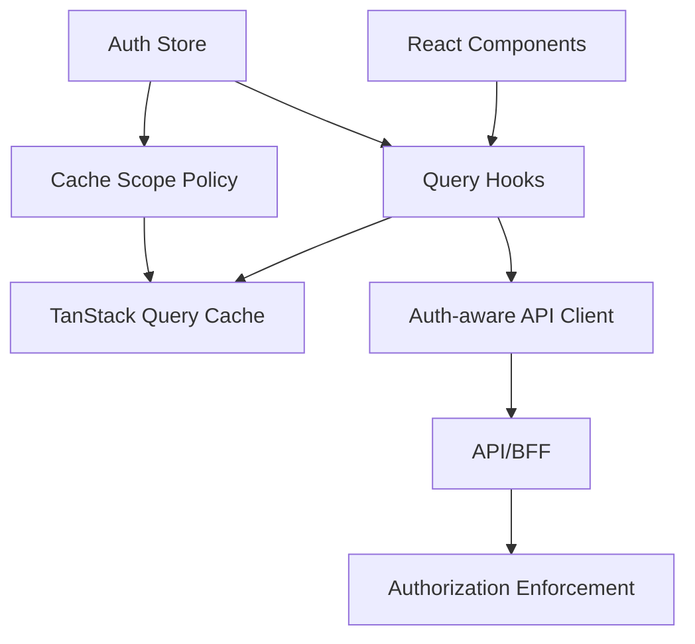
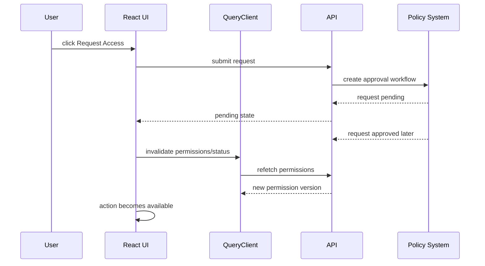

# Part 062 — TanStack Query Auth Integration

TanStack Query is not an auth library.

But in a React app, it often becomes the place where authenticated data lives longest.

That means TanStack Query is part of your auth attack surface.

Not because it authenticates users.

Because it caches projections of what authenticated users were allowed to see.

That cache can outlive:

```txt
- logout
- tenant switch
- role change
- permission revocation
- impersonation exit
- step-up expiration
- session refresh failure
- browser tab restore
- persisted cache rehydration
```

If you integrate auth casually, you get stale privilege in the UI.

A user logs out, another user logs in, and sees previous user's data for one render.

A support admin exits impersonation but still sees the subject's cached case details.

A tenant switch happens but the old tenant's list query briefly appears.

A permission is revoked but the app keeps rendering old allowed actions.

This part is about preventing those failures.

---

## 1. Core principle: query cache is auth-scoped data

Every query result must be interpreted relative to an auth snapshot.

```txt
auth snapshot = user + session + tenant + impersonation + permission version + auth epoch
```

The exact fields depend on your architecture.

But the principle is stable:

```txt
A query result fetched under one auth snapshot must not be silently reused under another incompatible auth snapshot.
```

TanStack Query gives you a powerful cache.

Auth decides the cache boundary.

---

## 2. Boundary map



TanStack Query should not replace the API client.

It should call the API client.

The API client handles transport/security.

TanStack Query handles async state, caching, invalidation, deduplication, and mutation lifecycle.

---

## 3. Do not put raw tokens in query keys

This is a common mistake:

```ts
useQuery({
  queryKey: ['cases', accessToken],
  queryFn: () => api.get('/cases'),
})
```

Do not include raw token values in query keys.

Reasons:

```txt
- token may leak through devtools/logs
- token changes frequently and destroys cache usefulness
- token is not the domain identity
- access token expiry does not necessarily mean data scope changed
- query keys should represent data identity and safe cache scope
```

Use an auth scope instead.

```ts
type AuthQueryScope = {
  userId: string | null
  tenantId: string | null
  authEpoch: number
  permissionVersion?: string | number
  impersonationSubjectId?: string | null
}
```

Then create safe keys.

```ts
const caseListKey = (scope: AuthQueryScope, filters: CaseFilters) => [
  'tenant', scope.tenantId,
  'authEpoch', scope.authEpoch,
  'permissionVersion', scope.permissionVersion ?? 'unknown',
  'cases',
  filters,
]
```

This keeps cache scoped without exposing credentials.

---

## 4. Auth epoch is the easiest safety lever

An auth epoch is a monotonic number.

It increments whenever cached authenticated data may no longer be safe.

```ts
type AuthStore = {
  userId: string | null
  tenantId: string | null
  permissionVersion: string | null
  impersonationSubjectId: string | null
  authEpoch: number
  bumpAuthEpoch(reason: string): void
}
```

Bump auth epoch on:

```txt
- login
- logout
- session restore with different user
- tenant switch
- role or permission version change
- impersonation start
- impersonation exit
- step-up context change for sensitive data
- forced session revocation
```

Then use `authEpoch` in query keys for sensitive authenticated data.

This prevents old query results from being reused accidentally.

But query keys alone are not enough.

You still clear or remove sensitive cache on logout.

---

## 5. Clear cache on logout

On logout, do not rely only on query key changes.

Call cache cleanup explicitly.

```ts
async function logout() {
  await authApi.logout().catch(() => undefined)

  authStore.transitionToAnonymous()
  requestAbortRegistry.abortAll('logout')

  queryClient.clear()
}
```

Why `clear()`?

Because logout is a hard trust boundary.

You do not want inactive queries, previous observers, or persisted sensitive results lingering.

A softer option like `invalidateQueries()` is not enough for logout because it marks data stale; it does not necessarily remove sensitive data immediately.

---

## 6. Tenant switch is not always full logout

Tenant switch has two possible policies.

```txt
Policy A: full cache clear
Policy B: tenant-scoped removal/invalidation
```

For regulated or high-isolation systems, choose full clear unless you have a strong reason not to.

```ts
function switchTenant(nextTenantId: string) {
  authStore.setTenant(nextTenantId)
  authStore.bumpAuthEpoch('tenant_switch')
  requestAbortRegistry.abortAll('tenant_switch')
  queryClient.clear()
}
```

For lower-risk apps, remove tenant-scoped queries.

```ts
queryClient.removeQueries({
  predicate: query => query.queryKey.includes('tenant'),
})
```

Be explicit.

Do not let tenant-scoped and global queries mix casually.

---

## 7. Permission version belongs in cache design

When permissions change, data may still be the same but allowed actions differ.

Example:

```json
{
  "id": "case_123",
  "status": "READY_FOR_REVIEW",
  "allowedActions": ["case.approve", "case.reject"]
}
```

If the user's role changes, the same case details may now have different allowed actions.

So either:

```txt
- include permissionVersion in query keys, or
- invalidate permission-bearing queries when permissionVersion changes, or
- separate resource data from permission projection
```

A pragmatic strategy:

```ts
useEffect(() => {
  queryClient.invalidateQueries({ queryKey: ['permissions'] })
  queryClient.invalidateQueries({
    predicate: q => q.meta?.containsPermissionProjection === true,
  })
}, [auth.permissionVersion])
```

Set query metadata when permission is embedded.

```ts
useQuery({
  queryKey: caseDetailKey(scope, caseId),
  queryFn: ({ signal }) => caseApi.getCase(caseId, { signal }),
  meta: { containsPermissionProjection: true },
})
```

---

## 8. Session query: `/session` or `/me`

Auth bootstrap often starts with a session query.

```ts
type SessionProjection = {
  state: 'anonymous' | 'authenticated'
  user?: {
    id: string
    displayName: string
  }
  tenant?: {
    id: string
    name: string
  }
  permissionVersion?: string
  csrfToken?: string
}
```

A hook:

```ts
function useSessionQuery() {
  return useQuery({
    queryKey: ['session'],
    queryFn: ({ signal }) => api.get<SessionProjection>('/session', { signal }),
    retry: false,
    staleTime: 30_000,
  })
}
```

Keep session bootstrap different from domain data.

Domain queries should depend on session state.

```ts
function useCases(filters: CaseFilters) {
  const scope = useAuthQueryScope()

  return useQuery({
    queryKey: caseListKey(scope, filters),
    queryFn: ({ signal }) => caseApi.listCases(filters, { signal }),
    enabled: Boolean(scope.userId && scope.tenantId),
  })
}
```

`enabled` avoids calling authenticated endpoints while auth state is unknown.

---

## 9. Avoid “enabled false forever” bugs

`enabled` is useful.

But it can hide broken state transitions.

Bad:

```ts
useQuery({
  queryKey: ['cases'],
  queryFn: fetchCases,
  enabled: !!user,
})
```

This ignores tenant, auth bootstrap state, and permission context.

Better:

```ts
const auth = useAuthSnapshot()

const canLoadCases =
  auth.state === 'authenticated' &&
  auth.tenantId !== null &&
  auth.permissions.status === 'ready'

useQuery({
  queryKey: caseListKey(auth.queryScope, filters),
  queryFn: ({ signal }) => caseApi.listCases(filters, { signal }),
  enabled: canLoadCases,
})
```

Treat query enablement as a state-machine guard.

---

## 10. Use AbortSignal from TanStack Query

TanStack Query provides an `AbortSignal` to query functions.

Pass it to the API client.

```ts
useQuery({
  queryKey: caseDetailKey(scope, caseId),
  queryFn: ({ signal }) => caseApi.getCase(caseId, { signal }),
})
```

The API client passes it to `fetch`.

```ts
api.get(`/cases/${id}`, { signal })
```

This matters for auth because stale requests should not keep updating the UI after:

```txt
- route change
- logout
- tenant switch
- impersonation exit
- permission epoch change
```

Cancellation is not just performance.

It is correctness.

---

## 11. Retry policy must understand auth failures

TanStack Query retries failed queries by policy.

Do not retry `401` and `403` like transient network failures.

```ts
function authAwareRetry(failureCount: number, error: unknown) {
  const apiError = error instanceof ApiError ? error : null

  if (!apiError) return failureCount < 2

  if (apiError.status === 401) return false
  if (apiError.status === 403) return false
  if (apiError.status === 400) return false
  if (apiError.status === 404) return false
  if (apiError.status === 409) return false
  if (apiError.status === 429) return failureCount < 1

  return failureCount < 2
}
```

Why not retry `401` in Query?

Because token/session recovery belongs in the API client boundary.

If the API client attempted safe refresh and still returned `401`, the query layer should not second-guess it.

---

## 12. Query defaults

Create a query client with auth-aware defaults.

```ts
const queryClient = new QueryClient({
  defaultOptions: {
    queries: {
      retry: authAwareRetry,
      refetchOnWindowFocus: true,
      throwOnError: false,
    },
    mutations: {
      retry: false,
    },
  },
})
```

Mutations usually should not auto-retry by default.

A mutation retry can duplicate side effects unless the domain operation is idempotent.

For specific safe mutations, opt in.

```ts
useMutation({
  mutationFn: command => caseApi.saveDraft(command),
  retry: 1,
})
```

For irreversible workflow transitions, use idempotency keys and explicit retry policy in the API client.

---

## 13. Invalidate vs reset vs remove vs clear

You need different tools for different auth events.

```txt
invalidateQueries -> mark stale and refetch when appropriate
resetQueries      -> reset to initial state and notify subscribers
removeQueries     -> remove matching inactive queries from cache
clear             -> clear all query/mutation caches and subscribers
```

Practical mapping:

| Event | Preferred action |
|---|---|
| User edits a case | invalidate case detail/list queries |
| Permission version changes | invalidate permission-bearing queries |
| Tenant switch high-security | clear |
| Tenant switch low-risk | remove tenant-scoped queries, invalidate session |
| Logout | clear |
| Impersonation start/exit | clear |
| Access request approved | invalidate permissions and relevant resources |
| Step-up completed | invalidate sensitive action availability |
| Session refresh success | usually no cache change unless auth projection changed |
| Session refresh failure | clear after transition to anonymous/expired |

The wrong tool can leak data.

`invalidateQueries()` is not a privacy wipe.

---

## 14. Query keys should encode resource identity and safe scope

A case detail query key might look like this:

```ts
const caseDetailKey = (scope: AuthQueryScope, caseId: CaseId) => [
  'tenant', scope.tenantId,
  'authEpoch', scope.authEpoch,
  'permissionVersion', scope.permissionVersion ?? 'unknown',
  'case',
  caseId,
]
```

A global profile key might look like:

```ts
const profileKey = (scope: AuthQueryScope) => [
  'user', scope.userId,
  'authEpoch', scope.authEpoch,
  'profile',
]
```

A public reference-data key should not include auth scope unnecessarily.

```ts
const countriesKey = ['public', 'countries']
```

Separate public and private data deliberately.

---

## 15. Meta flags help targeted invalidation

TanStack Query supports query metadata.

Use it to classify cache content.

```ts
useQuery({
  queryKey: caseDetailKey(scope, caseId),
  queryFn: ({ signal }) => caseApi.getCase(caseId, { signal }),
  meta: {
    authScoped: true,
    tenantScoped: true,
    containsPermissionProjection: true,
    sensitivity: 'confidential',
  },
})
```

Then invalidate or remove by predicate.

```ts
queryClient.removeQueries({
  predicate: query => query.meta?.authScoped === true,
})
```

This is useful for large apps where keys alone become inconsistent.

Still, metadata is not a substitute for good keys.

Use both.

---

## 16. Mutation handling: optimistic UI must respect authorization

Optimistic UI is dangerous when authorization is uncertain.

Bad:

```ts
useMutation({
  mutationFn: approveCase,
  onMutate: async caseId => {
    queryClient.setQueryData(['case', caseId], old => ({
      ...old,
      status: 'APPROVED',
    }))
  },
})
```

Better:

```ts
useMutation({
  mutationFn: command => caseApi.approveCase(command.caseId, command),

  onMutate: async command => {
    const permission = permissionStore.can('case.approve', {
      type: 'case',
      id: command.caseId,
    })

    if (!permission.allowed) {
      throw new ClientDeniedError(permission.reason)
    }

    await queryClient.cancelQueries({
      queryKey: caseDetailKey(command.scope, command.caseId),
    })

    const previous = queryClient.getQueryData(
      caseDetailKey(command.scope, command.caseId),
    )

    queryClient.setQueryData(
      caseDetailKey(command.scope, command.caseId),
      optimisticApprove,
    )

    return { previous }
  },

  onError: (error, command, context) => {
    if (context?.previous) {
      queryClient.setQueryData(
        caseDetailKey(command.scope, command.caseId),
        context.previous,
      )
    }
  },

  onSettled: (_data, _error, command) => {
    queryClient.invalidateQueries({
      queryKey: caseDetailKey(command.scope, command.caseId),
    })
  },
})
```

Client-side permission check is still not enforcement.

It prevents obviously invalid optimistic state.

Server remains authority.

---

## 17. Handling mutation 403

A mutation that returns `403` should not be treated as generic failure.

It means the user attempted an action they are not authorized to perform now.

Possible reasons:

```txt
- permission changed since UI rendered
- resource state changed
- assignment changed
- tenant context changed
- step-up required
- stale optimistic UI
- backend policy bug
```

Response behavior:

```ts
onError: (error, command) => {
  if (error instanceof ApiError && error.status === 403) {
    queryClient.invalidateQueries({
      queryKey: caseDetailKey(command.scope, command.caseId),
    })
    queryClient.invalidateQueries({ queryKey: ['permissions'] })
    showForbiddenToast(error.problem?.auth)
    return
  }

  showGenericMutationError(error)
}
```

For regulated workflows, also surface correlation ID.

---

## 18. `401` after API-client recovery

If a query receives `401`, assume the API client could not recover.

The query layer should coordinate state transition.

```ts
const authEventHandler = (event: AuthEvent) => {
  if (event.type === 'session.expired' || event.type === 'session.refresh_failed') {
    authStore.transitionToExpired()
    requestAbortRegistry.abortAll('session_expired')
    queryClient.clear()
    router.navigate('/login', { replace: true })
  }
}
```

Do not let every query redirect independently.

That causes redirect storms.

Centralize auth events.

---

## 19. Permission query design

A permission projection can be query-backed.

```ts
type PermissionProjection = {
  version: string
  global: Record<string, Decision>
  tenant: Record<string, Decision>
  resources?: Record<string, Record<string, Decision>>
}
```

Hook:

```ts
function usePermissionProjection() {
  const scope = useAuthQueryScope()

  return useQuery({
    queryKey: ['permissions', scope.userId, scope.tenantId, scope.authEpoch],
    queryFn: ({ signal }) => permissionApi.getProjection({ signal }),
    enabled: Boolean(scope.userId && scope.tenantId),
    staleTime: 15_000,
    retry: authAwareRetry,
  })
}
```

But beware large permission payloads.

For resource-heavy apps, prefer server-projected allowed actions per list/detail endpoint.

Do not fetch the universe of permissions if the user only needs current screen decisions.

---

## 20. `useCan()` with TanStack Query

`useCan()` can combine local projection and server check.

```ts
function useCan(action: string, resource?: ResourceRef) {
  const projection = usePermissionProjection()

  const localDecision = projection.data
    ? evaluateProjection(projection.data, action, resource)
    : { status: 'unknown', allowed: false as const }

  const needsServerCheck =
    localDecision.status === 'unknown' && resource?.id !== undefined

  const serverCheck = useQuery({
    queryKey: ['permission-check', action, resource?.type, resource?.id],
    queryFn: ({ signal }) => permissionApi.check({ action, resource }, { signal }),
    enabled: needsServerCheck,
    staleTime: 5_000,
  })

  if (needsServerCheck) {
    return serverCheck.data ?? { status: 'loading', allowed: false }
  }

  return localDecision
}
```

Deny-by-default still applies.

Unknown is not allowed.

Unknown is pending or denied for exposure purposes.

---

## 21. Do not persist sensitive query cache casually

TanStack Query can be used with persistence plugins.

That is useful.

It is dangerous for authenticated data.

Risk:

```txt
- cached user data survives logout
- another local user opens app and sees stale data
- tenant data persists across tenant switch
- permission projection persists after revocation
- offline cache bypasses latest access decision in UI
```

If you use persistence:

```txt
- persist public/reference data only, or
- encrypt and bind cache to user/session/device, or
- clear persisted cache on logout/session expiry, or
- include auth epoch and short maxAge, or
- separate public and private QueryClients
```

Default recommendation for regulated apps:

```txt
Do not persist authenticated query cache unless you have explicit security design and review.
```

---

## 22. Public and private QueryClients

For complex apps, split caches.

```ts
const publicQueryClient = new QueryClient()
const privateQueryClient = new QueryClient()
```

Public data:

```txt
- countries
- product metadata
- public feature metadata
- static lookup tables
```

Private data:

```txt
- user profile
- case records
- permissions
- tenant data
- audit views
- drafts
```

On logout:

```ts
privateQueryClient.clear()
```

Public cache can remain.

This separation reduces accidental data wipe and accidental data leak.

---

## 23. SSR and hydration risk

If using SSR/Next.js/React Router Framework Mode, dehydrated query state can contain sensitive data.

Rules:

```txt
- never dehydrate private data into a public/shared cache document without review
- set Cache-Control headers correctly
- scope dehydrated state to the authenticated request
- do not reuse server QueryClient across requests
- do not include tokens or secrets in dehydrated state
- avoid hydrating another user's data after session mismatch
```

Server-side QueryClient must be per request.

```ts
function createServerQueryClient() {
  return new QueryClient({
    defaultOptions: {
      queries: {
        retry: false,
      },
    },
  })
}
```

Never create one global QueryClient for all SSR users.

---

## 24. Refetch on focus is not permission refresh

TanStack Query can refetch when window regains focus.

This helps freshness.

But do not depend on it for security.

Permission revocation must be enforced server-side on every request.

Frontend refetch only improves projection freshness.

Use it as a UX aid:

```txt
window focus -> refetch session/permissions -> UI updates faster
```

Not as an authorization guarantee.

---

## 25. Cross-tab invalidation

When logout happens in one tab, other tabs must clear private cache.

Use the auth event bus from Part 018.

```ts
authChannel.onmessage = event => {
  if (event.data.type === 'logout') {
    authStore.transitionToAnonymous()
    requestAbortRegistry.abortAll('cross_tab_logout')
    queryClient.clear()
  }

  if (event.data.type === 'permission_version_changed') {
    authStore.setPermissionVersion(event.data.version)
    queryClient.invalidateQueries({ queryKey: ['permissions'] })
    queryClient.invalidateQueries({
      predicate: q => q.meta?.containsPermissionProjection === true,
    })
  }
}
```

TanStack Query also has experimental broadcast/persistence-related ecosystem tools, but auth correctness should not depend on magic synchronization you have not threat-modeled.

Make your auth events explicit.

---

## 26. File download/export queries

Be careful with file downloads.

Do not cache signed download URLs longer than their validity.

```ts
useQuery({
  queryKey: ['case-export', scope.authEpoch, caseId, exportId],
  queryFn: ({ signal }) => exportApi.getExportStatus(caseId, exportId, { signal }),
  enabled: Boolean(exportId),
  refetchInterval: data => data?.status === 'RUNNING' ? 2_000 : false,
  meta: { authScoped: true, containsPermissionProjection: true },
})
```

For actual download URL:

```txt
- prefer direct navigation only after server authorization
- short-lived signed URL
- no persistent query cache
- clear on logout/tenant switch
- do not store in localStorage
```

---

## 27. Service worker interaction

If your app has a service worker, it may cache API responses.

That is outside TanStack Query.

But it affects the same data boundary.

On logout, clearing QueryClient is not enough if service worker cache still contains authenticated responses.

Policy:

```txt
- do not cache authenticated API responses in service worker by default
- use Cache-Control headers to prevent sensitive caching
- version caches by auth scope only with review
- purge service worker private caches on logout
```

Otherwise, your app may clear React cache but still serve sensitive data from browser cache.

---

## 28. Access request approval flow

When an access request is approved, update projection carefully.

Flow:



Do not locally grant permission after request submission.

Only update after server-approved permission projection changes.

---

## 29. Step-up authentication flow

For sensitive data/actions, query may fail with step-up required.

Example:

```ts
function useSensitiveAuditTrail(caseId: CaseId) {
  const scope = useAuthQueryScope()

  return useQuery({
    queryKey: ['audit-trail', scope.authEpoch, caseId],
    queryFn: ({ signal }) => auditApi.getTrail(caseId, { signal }),
    retry: false,
    meta: { authScoped: true, sensitivity: 'restricted' },
  })
}
```

If server returns step-up required:

```txt
- do not treat as generic 403
- show step-up CTA
- preserve safe return intent
- invalidate/refetch after successful step-up
- expire step-up context when server says so
```

Query cache should include auth/assurance context if sensitive data differs by assurance level.

---

## 30. Testing strategy

Test query/auth integration like a system, not isolated hooks only.

| Scenario | Expected behavior |
|---|---|
| user logs out | private query cache cleared immediately |
| user A logs out, user B logs in | no render of user A data |
| tenant switch | old tenant queries removed/cleared; in-flight requests aborted |
| permission version changes | permission-bearing queries invalidated/refetched |
| mutation returns 403 | optimistic state rolled back; relevant queries invalidated |
| query returns 401 after API refresh failed | auth expired state; cache clear; single redirect |
| query aborted due to navigation | no error toast |
| persisted cache exists after logout | private cache not rehydrated |
| SSR request for user A then user B | per-request QueryClient prevents cross-user leak |
| offline mode with stale permission | sensitive actions disabled or require server revalidation |

---

## 31. Anti-pattern catalog

Avoid these:

```txt
- query keys that omit tenant/user/auth scope for private data
- raw access token in query key
- invalidateQueries used as logout cleanup
- persisted authenticated cache without review
- retrying 401/403 at query layer
- mutation optimistic update without permission precheck and rollback
- global QueryClient reused across SSR requests
- permission projection stored forever with infinite staleTime
- direct use of fetch in queryFn bypassing auth-aware API client
- keeping old tenant queries after tenant switch
- treating refetchOnWindowFocus as authorization enforcement
- caching signed URLs or sensitive exports indefinitely
```

---

## 32. Production checklist

```txt
[ ] All private query keys include safe auth scope or are cleared on boundary changes.
[ ] Logout calls queryClient.clear() or equivalent private-cache wipe.
[ ] Tenant switch policy is explicit.
[ ] Permission version change invalidates permission-bearing queries.
[ ] Query functions pass AbortSignal to API client.
[ ] API client handles safe refresh before query layer sees 401.
[ ] Query retry policy does not retry 401/403.
[ ] Mutations do not auto-retry irreversible operations.
[ ] Optimistic mutations rollback on 403/conflict.
[ ] Persisted cache excludes private data or is security-reviewed.
[ ] SSR QueryClient is per request.
[ ] Cross-tab logout clears private query cache.
[ ] Service worker does not cache sensitive API responses casually.
[ ] Error boundaries distinguish 401, 403, step-up, and network failures.
```

---

## 33. Final mental model

TanStack Query is a cache and async state engine.

Auth turns that cache into a trust boundary.

A production React app does not ask:

```txt
How do I fetch this data with React Query?
```

It asks:

```txt
Under which auth snapshot was this data fetched?
When does that snapshot become invalid?
What must happen to the cache when identity, tenant, session, or permission changes?
Can this mutation be replayed safely?
Does this cached data include permission projection?
```

Once you think that way, TanStack Query becomes a strong ally.

Without that model, it becomes a stale privilege machine.

---

## 34. References

- TanStack Query Documentation — query invalidation, QueryClient methods, query cancellation, retries, mutations, and caching behavior.
- MDN Web Docs — `AbortController` and `AbortSignal` for request cancellation.
- OWASP Authorization Cheat Sheet — validate permissions on every request, deny-by-default, least privilege.
- OWASP Session Management Cheat Sheet — session lifecycle and server-side expiration responsibilities.
- Previous parts in this series: Part 049 Permission Cache Invalidation, Part 050 Deny-by-default React UI, Part 061 API Client Auth Boundary.
