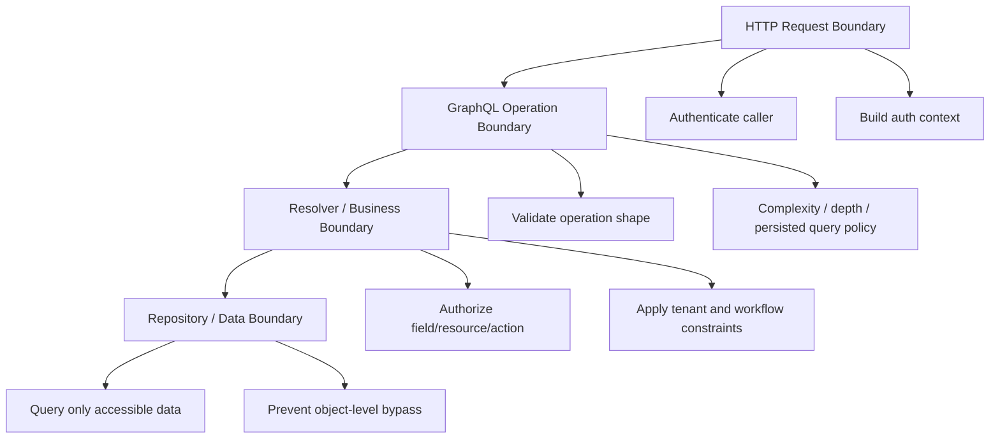
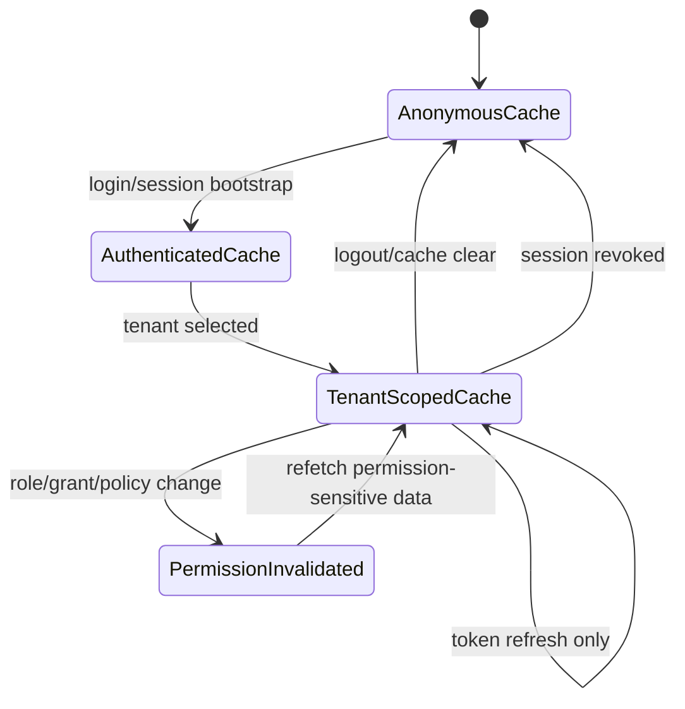

# Part 063 — GraphQL Auth in React

GraphQL changes the shape of the auth problem.

In REST, the route often gives you a clue:

```txt
GET /cases/123
POST /cases/123/assign
DELETE /documents/abc
```

In GraphQL, one request can contain many fields, nested resources, aliases, fragments, and sometimes several operations. A single HTTP request can mix data from multiple authorization domains:

```graphql
query CaseWorkspace($caseId: ID!) {
  case(id: $caseId) {
    id
    title
    assignee { id name }
    privateNotes { id body createdBy { id name } }
    documents { id name downloadUrl }
    allowedActions
  }
  currentUser {
    id
    organizations { id name }
  }
}
```

That shape is useful for product engineering. It is also dangerous if the team thinks GraphQL auth is solved by attaching a token to the request.

The core rule:

> GraphQL authentication can happen at the HTTP/request boundary. GraphQL authorization must happen at the resolver/business/resource boundary.

GraphQL.org's HTTP guidance says authentication should happen before GraphQL validation, while authorization belongs in business logic. That distinction is the spine of this part.

---

## 1. The mental model

GraphQL has three different auth layers:



Each boundary answers a different question.

| Boundary | Question | Example |
|---|---|---|
| HTTP request | Who is calling? | Parse session cookie or bearer token. |
| GraphQL operation | Is this operation allowed to run structurally? | Reject anonymous introspection, excessive depth, unknown persisted query. |
| Resolver/business | May this subject read or mutate this resource/field? | Can this user read `case.privateNotes`? |
| Data access | Does the query itself constrain data by tenant/permission? | `where tenant_id = subject.tenantId`. |

React is not the enforcement point. React consumes decisions, projects them into UI, avoids accidental data leaks, and handles partial/typed errors cleanly.

---

## 2. GraphQL auth is not one check

A naive GraphQL server often does this:

```ts
const context = async ({ req }) => {
  const user = await authenticate(req.headers.authorization);
  return { user };
};
```

That is only authentication. It says nothing about whether the user may read a field or mutate an object.

A serious GraphQL auth design separates:

```ts
type GraphQLAuthContext = {
  session: {
    subjectId: string;
    actorId?: string; // impersonation/support actor
    tenantId: string;
    assuranceLevel: 'aal1' | 'aal2' | 'aal3';
    authEpoch: number;
  } | null;

  authorize: (input: AuthorizationInput) => Promise<AuthorizationDecision>;

  loaders: {
    caseById: DataLoader<string, CaseRecord | null>;
    visibleDocumentsByCaseId: DataLoader<string, DocumentRecord[]>;
  };

  request: {
    correlationId: string;
    ip?: string;
    userAgent?: string;
  };
};
```

Authentication creates context. Authorization consumes context.

---

## 3. React's job in GraphQL auth

React should do five things:

1. Attach credentials according to the chosen transport.
2. Scope client cache by identity/tenant/permission version.
3. Render partial data without leaking forbidden data.
4. Handle GraphQL auth errors as typed domain errors, not random exceptions.
5. Use server-projected permissions for UI exposure, not token claims or guessed roles.

React should not do these things:

- decide final access from decoded JWT claims;
- trust hidden fields/buttons as authorization;
- assume a successful GraphQL HTTP `200` means every field was allowed;
- cache authenticated GraphQL data across users or tenants;
- treat GraphQL fragments as safe just because the component is hidden.

---

## 4. Authentication transport for GraphQL clients

The transport choice is the same as the API client boundary from Part 061, but GraphQL adds cache and batching consequences.

### 4.1 Bearer token header

```ts
const authLink = setContext(async (_, { headers }) => {
  const token = await authClient.getAccessToken();

  return {
    headers: {
      ...headers,
      ...(token ? { authorization: `Bearer ${token}` } : {}),
      'x-correlation-id': correlationId(),
    },
  };
});
```

This is straightforward but token-bearing requests must still handle refresh, replay, cache cleanup, and cancellation.

### 4.2 HTTP-only cookie + CSRF token

```ts
const httpLink = new HttpLink({
  uri: '/graphql',
  credentials: 'include',
  headers: {
    'x-csrf-token': csrfTokenStore.get(),
  },
});
```

Cookie auth means browser sends the credential automatically. For state-changing mutations, do not forget CSRF defense.

### 4.3 BFF GraphQL gateway

```txt
React App --> /bff/graphql --> Internal GraphQL/API services
```

In this model, React never sees upstream access tokens. The BFF owns session cookie validation, token exchange, upstream calls, and policy-aware response shaping.

This is often the cleanest model for enterprise SaaS and regulated workflow systems.

---

## 5. GraphQL partial data changes UI thinking

GraphQL can return both `data` and `errors`.

```json
{
  "data": {
    "case": {
      "id": "case_123",
      "title": "Investigation A",
      "privateNotes": null
    }
  },
  "errors": [
    {
      "message": "Forbidden",
      "path": ["case", "privateNotes"],
      "extensions": {
        "code": "FORBIDDEN",
        "reason": "PRIVATE_NOTES_RESTRICTED"
      }
    }
  ]
}
```

This is not the same as REST where an endpoint often returns one status code for the whole response.

For React, partial data means:

- do not treat any `data` as globally authorized;
- inspect field-level errors when rendering sensitive panels;
- keep forbidden fields nullable or omitted by contract;
- avoid rendering fallback text that reveals existence of hidden data;
- avoid caching forbidden `null` as if the field does not exist.

A safe UI boundary looks like this:

```tsx
type FieldErrorCode = 'FORBIDDEN' | 'UNAUTHENTICATED' | 'STEP_UP_REQUIRED';

function getFieldError(
  errors: readonly GraphQLErrorLike[] | undefined,
  pathPrefix: readonly (string | number)[],
): GraphQLErrorLike | undefined {
  return errors?.find((error) => {
    const path = error.path ?? [];
    return pathPrefix.every((segment, index) => path[index] === segment);
  });
}

function PrivateNotesPanel({ result }: { result: CaseWorkspaceResult }) {
  const error = getFieldError(result.errors, ['case', 'privateNotes']);

  if (error?.extensions?.code === 'FORBIDDEN') {
    return <AccessDeniedCard reason="You do not have access to private notes." />;
  }

  if (error?.extensions?.code === 'STEP_UP_REQUIRED') {
    return <StepUpRequiredCard action="case.privateNotes.read" />;
  }

  if (!result.data?.case?.privateNotes) {
    return null;
  }

  return <PrivateNotesList notes={result.data.case.privateNotes} />;
}
```

The UI handles denial explicitly. It does not guess.

---

## 6. Field-level authorization

GraphQL makes field-level authorization very visible.

Example schema:

```graphql
type Case {
  id: ID!
  title: String!
  status: CaseStatus!
  publicSummary: String
  privateNotes: [PrivateNote!]
  financialExposure: Money
  allowedActions: [CaseAction!]!
}
```

The resolver should authorize sensitive fields independently:

```ts
const CaseResolvers = {
  privateNotes: async (caseRecord, _args, ctx) => {
    const decision = await ctx.authorize({
      subject: ctx.session,
      action: 'case.privateNotes.read',
      resource: { type: 'case', id: caseRecord.id, tenantId: caseRecord.tenantId },
      context: { workflowState: caseRecord.status },
    });

    if (!decision.allowed) {
      throw forbiddenField('PRIVATE_NOTES_RESTRICTED');
    }

    return ctx.loaders.privateNotesByCaseId.load(caseRecord.id);
  },

  financialExposure: async (caseRecord, _args, ctx) => {
    const decision = await ctx.authorize({
      subject: ctx.session,
      action: 'case.financialExposure.read',
      resource: { type: 'case', id: caseRecord.id, tenantId: caseRecord.tenantId },
    });

    if (!decision.allowed) {
      return null; // only if schema contract says forbidden sensitive field is masked
    }

    return caseRecord.financialExposure;
  },
};
```

There are two safe denial shapes:

| Shape | Use when | React consequence |
|---|---|---|
| `null` masking | Existence itself should not be revealed | UI treats field as unavailable without reason. |
| typed GraphQL error | User may safely know access is denied | UI shows reason or request-access path. |

Do not mix these randomly. Choose by data classification.

---

## 7. Operation-level authorization is not enough

It is tempting to allow/deny whole GraphQL operations:

```graphql
query AdminDashboard { ... }
```

This helps with coarse access, but it is not enough.

Why?

- Fragments can be reused in different screens.
- One query may fetch multiple resource types.
- A list can contain resources with different per-object permissions.
- A user may read a case title but not private notes.
- A user may mutate a resource only in certain workflow states.

Use operation-level policy for broad constraints:

```ts
if (!ctx.session) throw unauthenticated();
if (operationName === 'AdminDashboard' && !ctx.session.isStaff) throw forbidden();
```

Use resolver/data policy for actual resource access:

```ts
await authorize({ action: 'case.read', resource: caseRecord, subject });
await authorize({ action: 'case.privateNotes.read', resource: caseRecord, subject });
```

---

## 8. Permission projection inside GraphQL

A good GraphQL API can return both resource data and allowed actions:

```graphql
query CasePage($id: ID!) {
  case(id: $id) {
    id
    title
    status
    allowedActions
    fieldPermissions {
      field
      mode
      reason
    }
  }
}
```

Example response:

```json
{
  "data": {
    "case": {
      "id": "case_123",
      "title": "Investigation A",
      "status": "UNDER_REVIEW",
      "allowedActions": ["case.comment.create", "case.document.upload"],
      "fieldPermissions": [
        { "field": "title", "mode": "readonly", "reason": null },
        { "field": "priority", "mode": "editable", "reason": null },
        { "field": "closureReason", "mode": "hidden", "reason": "NOT_CLOSED" }
      ]
    }
  }
}
```

React uses this projection to render UI.

The server still validates every mutation.

---

## 9. Mutation authorization

GraphQL mutations are not safer than REST POST endpoints. They need the same object/action/state authorization.

```graphql
mutation AssignCase($input: AssignCaseInput!) {
  assignCase(input: $input) {
    case {
      id
      assignee { id name }
      allowedActions
    }
    auditEventId
  }
}
```

Server resolver:

```ts
const Mutation = {
  assignCase: async (_root, { input }, ctx) => {
    const caseRecord = await ctx.repositories.cases.getById(input.caseId);

    if (!caseRecord) {
      throw notFoundOrForbidden();
    }

    await ctx.authorizeOrThrow({
      subject: ctx.session,
      action: 'case.assign',
      resource: {
        type: 'case',
        id: caseRecord.id,
        tenantId: caseRecord.tenantId,
      },
      context: {
        workflowState: caseRecord.status,
        targetAssigneeId: input.assigneeId,
      },
    });

    const updated = await ctx.services.caseAssignment.assign({
      caseId: caseRecord.id,
      assigneeId: input.assigneeId,
      actorId: ctx.session!.subjectId,
      correlationId: ctx.request.correlationId,
    });

    return {
      case: updated,
      auditEventId: updated.auditEventId,
    };
  },
};
```

React mutation handling:

```tsx
const [assignCase] = useMutation(ASSIGN_CASE, {
  optimisticResponse: undefined, // do not optimistically assign if authorization is state-sensitive
  update(cache, result) {
    const updatedCase = result.data?.assignCase?.case;
    if (!updatedCase) return;

    cache.modify({
      id: cache.identify(updatedCase),
      fields: {
        assignee: () => updatedCase.assignee,
        allowedActions: () => updatedCase.allowedActions,
      },
    });
  },
  onError(error) {
    const authError = toAuthGraphQLError(error);

    if (authError?.code === 'FORBIDDEN') {
      showAccessDeniedToast(authError.reason);
      refetchCase();
      return;
    }

    if (authError?.code === 'STEP_UP_REQUIRED') {
      startStepUpFlow(authError.action);
      return;
    }

    showGenericError();
  },
});
```

Do not optimistically mutate sensitive workflow state unless you can roll back safely and refresh permission projection.

---

## 10. GraphQL cache isolation

GraphQL clients normalize data. This is powerful and risky.

Apollo, Relay, urql, and similar clients can store object records by ID. If cache is not scoped by identity/tenant, one user can see stale data from another login session in the same browser.

Minimum cache key dimensions:

```ts
type AuthCacheScope = {
  subjectId: string;
  tenantId: string;
  authEpoch: number;
  permissionVersion: number;
  impersonationSubjectId?: string;
};
```

Safe cache lifecycle:



For Apollo-style clients:

```ts
async function onAuthChanged(next: AuthSnapshot) {
  if (next.kind === 'anonymous') {
    await apolloClient.clearStore();
    permissionStore.reset();
    return;
  }

  const scopeChanged = !sameAuthScope(currentScope, next.scope);

  if (scopeChanged) {
    await apolloClient.clearStore();
    permissionStore.replace(next.permissionSnapshot);
    currentScope = next.scope;
    return;
  }

  if (next.permissionVersion !== currentScope.permissionVersion) {
    await apolloClient.refetchQueries({
      include: permissionSensitiveQueries,
    });
  }
}
```

The invariant: token refresh alone should not clear all data; identity/tenant/permission scope changes should.

---

## 11. Fragment-level leakage

A fragment can accidentally pull sensitive fields into a screen that does not need them.

```graphql
fragment CaseCard_case on Case {
  id
  title
  status
  privateNotes { id body } # leak risk
}
```

A component might not render `privateNotes`, but the client still requested it. The browser may hold it in memory, devtools, logs, error payloads, or normalized cache.

Better:

```graphql
fragment CaseCard_case on Case {
  id
  title
  status
  allowedActions
}
```

Only sensitive panels should request sensitive fields:

```graphql
fragment PrivateNotesPanel_case on Case {
  id
  privateNotes {
    id
    body
    createdAt
    createdBy { id displayName }
  }
}
```

The mental model:

> A hidden component is not a hidden query.

Review GraphQL fragments like you review API endpoints.

---

## 12. Global IDs and object authorization

GraphQL commonly uses opaque/global IDs:

```graphql
node(id: "Q2FzZTpjYXNlXzEyMw==") {
  id
  ... on Case { title }
}
```

Opaque IDs reduce enumeration but do not provide authorization. A user can still paste a valid ID from another tenant, another account, a log, a shared screenshot, or a browser history entry.

Server-side rule:

```ts
async function resolveNode(id: string, ctx: GraphQLAuthContext) {
  const decoded = decodeGlobalId(id);
  const record = await repositories.getByTypeAndId(decoded.type, decoded.id);

  if (!record) {
    return null;
  }

  const decision = await ctx.authorize({
    subject: ctx.session,
    action: `${decoded.type}.read`,
    resource: record,
  });

  if (!decision.allowed) {
    return null; // or throw, depending on existence-disclosure policy
  }

  return record;
}
```

Never decode a global ID on the client and assume it implies anything about access.

---

## 13. Subscription and realtime GraphQL auth

Subscriptions add long-lived state.

Auth questions:

- Is the connection authenticated?
- Is the subscription operation authorized?
- Are individual events authorized at publish time?
- What happens when permission changes while the socket is open?
- What happens when tenant changes in another tab?

A safe server checks both subscription start and event delivery:

```ts
const Subscription = {
  caseUpdated: {
    subscribe: async (_root, { caseId }, ctx) => {
      const caseRecord = await ctx.repositories.cases.getById(caseId);

      await ctx.authorizeOrThrow({
        subject: ctx.session,
        action: 'case.subscribe',
        resource: caseRecord,
      });

      return ctx.pubsub.asyncIterator(`case:${caseId}`);
    },

    resolve: async (event, _args, ctx) => {
      const decision = await ctx.authorize({
        subject: ctx.session,
        action: 'case.read',
        resource: event.case,
      });

      if (!decision.allowed) {
        return null;
      }

      return event.case;
    },
  },
};
```

React should reconnect or unsubscribe on auth scope changes:

```ts
authEvents.on('scopeChanged', () => {
  graphqlRealtimeClient.close({ reason: 'auth_scope_changed' });
});
```

---

## 14. Persisted queries and auth

Persisted queries help reduce arbitrary query execution risk. They are not authorization.

```txt
Client sends: queryHash=abc123 variables={caseId: "case_123"}
Server maps: abc123 -> CaseWorkspace query
Server still validates: can subject read case_123 and requested fields?
```

Use persisted queries for:

- operation allowlisting;
- reducing query parsing overhead;
- blocking unknown operations in production;
- easier audit of frontend-accessible GraphQL surface;
- better complexity control.

Do not use persisted queries as a substitute for resource authorization.

---

## 15. Error taxonomy for GraphQL auth

A production GraphQL API should have stable error codes.

```ts
type GraphQLAuthErrorCode =
  | 'UNAUTHENTICATED'
  | 'SESSION_EXPIRED'
  | 'FORBIDDEN'
  | 'TENANT_MISMATCH'
  | 'STEP_UP_REQUIRED'
  | 'POLICY_VERSION_STALE'
  | 'RESOURCE_NOT_FOUND_OR_FORBIDDEN';
```

Example error extension:

```json
{
  "message": "Forbidden",
  "path": ["case", "privateNotes"],
  "extensions": {
    "code": "FORBIDDEN",
    "reason": "PRIVATE_NOTES_RESTRICTED",
    "action": "case.privateNotes.read",
    "correlationId": "req_01JZ..."
  }
}
```

React handling:

```ts
function classifyGraphQLAuthError(error: CombinedGraphQLError): AuthFailure | null {
  const authError = error.graphQLErrors.find((e) =>
    ['UNAUTHENTICATED', 'SESSION_EXPIRED', 'FORBIDDEN', 'STEP_UP_REQUIRED'].includes(
      String(e.extensions?.code),
    ),
  );

  if (!authError) return null;

  return {
    code: String(authError.extensions?.code),
    reason: String(authError.extensions?.reason ?? 'UNKNOWN'),
    action: typeof authError.extensions?.action === 'string' ? authError.extensions.action : undefined,
    path: authError.path ?? [],
  };
}
```

Do not branch UI on raw `message` strings. Use stable extension codes.

---

## 16. React GraphQL auth checklist

Before shipping GraphQL auth, verify:

- [ ] Authentication happens before GraphQL request validation/execution.
- [ ] Context contains typed session, tenant, actor, assurance, and correlation data.
- [ ] Resolver/business layer performs resource/action/field authorization.
- [ ] Data loaders do not bypass tenant/permission constraints.
- [ ] Global IDs are treated as untrusted input.
- [ ] Field-level forbidden data is either masked or returned with typed error by contract.
- [ ] React handles partial data and GraphQL errors explicitly.
- [ ] Client cache is cleared on logout and auth-scope change.
- [ ] Query keys/cache identity include subject, tenant, auth epoch, and permission version where needed.
- [ ] Fragments are reviewed for sensitive field leakage.
- [ ] Mutations validate object-level permission server-side.
- [ ] Subscriptions re-check permission on event delivery or disconnect on permission change.
- [ ] Persisted queries are used as operation allowlisting, not authorization.
- [ ] Security tests include cross-tenant ID, forbidden field, stale permission, and partial-data cases.

---

## 17. The part to remember

GraphQL gives React a powerful data graph. That graph must not become a permission bypass graph.

A top-tier React engineer treats GraphQL auth as a layered system:

```txt
HTTP authentication
  -> GraphQL operation policy
  -> resolver/resource authorization
  -> field-level contract
  -> cache isolation
  -> explicit partial-data UI
```

The best GraphQL UI is not the one that hides forbidden buttons. It is the one that never requests unnecessary sensitive fields, scopes its cache correctly, handles partial authorization honestly, and assumes every ID/field/mutation still needs server-side enforcement.

