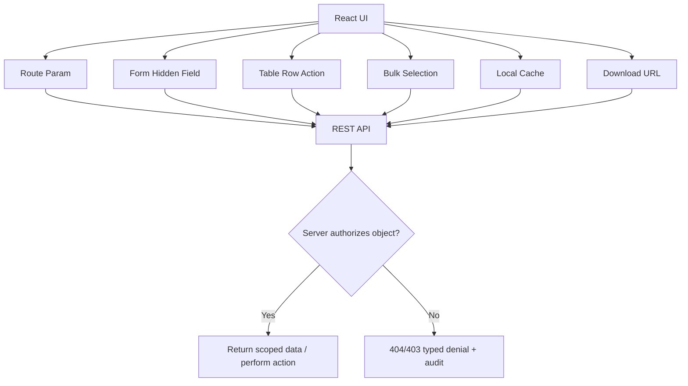
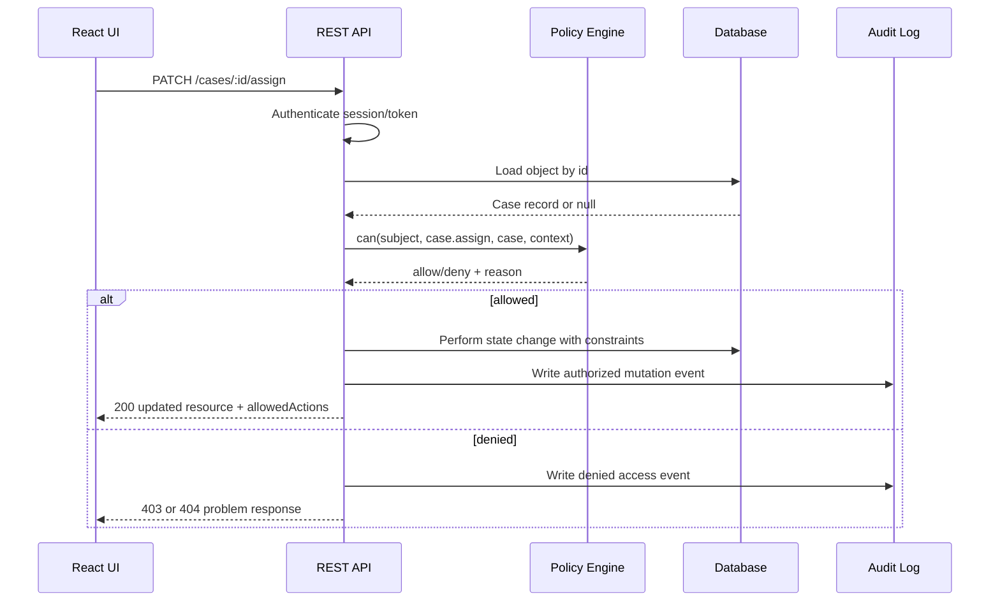

# Part 064 — REST BOLA/IDOR Defense from Frontend Perspective

BOLA and IDOR are not backend-only topics.

Yes, the final enforcement must happen on the server. But React engineers shape the request surface: URLs, route params, hidden fields, table row actions, cached IDs, optimistic mutations, bulk operations, and deep links. Bad frontend design can make object-level authorization bugs easier to introduce, easier to exploit, and harder to detect.

The core rule:

> Every object identifier sent by the frontend is attacker-controlled input.

It does not matter whether the ID came from a dropdown, table row, hidden input, route param, local cache, signed URL, search result, or previous API response.

If it crosses the network, the server must re-authorize it.

---

## 1. BOLA and IDOR in one sentence

BOLA, Broken Object Level Authorization, happens when an API accepts an object reference and fails to verify that the caller may access that specific object.

Classic example:

```http
GET /api/cases/case_123
Authorization: Bearer token_of_user_A
```

Attacker changes the ID:

```http
GET /api/cases/case_999
Authorization: Bearer token_of_user_A
```

If `case_999` belongs to another tenant/user and the API returns it, authorization failed.

The vulnerability is not that the ID is visible. The vulnerability is that the server trusted the ID without checking object-level access.

---

## 2. The frontend perspective

React engineers often assume:

> The user can only click what we render.

That assumption is false.

A user can:

- edit route params in the address bar;
- replay requests from DevTools;
- modify hidden form values;
- call endpoints directly with curl/Postman;
- mutate IDs in request payloads;
- copy IDs from logs, URLs, email links, screenshots, or browser history;
- use stale cache after role/tenant changes;
- tamper with optimistic UI payloads;
- intercept client-side generated URLs.

React UI is an honest user interface. It is not an adversarial boundary.

---

## 3. The object identifier threat model



Every arrow into the API must be treated as hostile.

---

## 4. Common React patterns that create BOLA pressure

### 4.1 Route params as authority

```tsx
const { caseId } = useParams();
const caseQuery = useQuery({
  queryKey: ['case', caseId],
  queryFn: () => api.get(`/api/cases/${caseId}`),
});
```

This is normal. The bug happens if the backend treats `caseId` as sufficient.

Frontend invariant:

> A route param selects a requested resource. It does not prove access.

Backend invariant:

```sql
select *
from cases
where id = :case_id
  and tenant_id = :subject_tenant_id
  and exists_authorized_access(:subject_id, id, 'case.read');
```

### 4.2 Hidden form fields

```tsx
<input type="hidden" name="caseId" value={case.id} />
```

Hidden only means hidden from the visual UI. It does not mean protected.

Server must ignore any privileged fields from the client if they can be derived server-side.

```ts
// Bad: trust payload tenantId.
await createComment({
  caseId: input.caseId,
  tenantId: input.tenantId,
  body: input.body,
});

// Better: load case, authorize, derive tenant from server record.
const caseRecord = await cases.getById(input.caseId);
await authorizeOrThrow(subject, 'case.comment.create', caseRecord);
await createComment({
  caseId: caseRecord.id,
  tenantId: caseRecord.tenantId,
  body: input.body,
});
```

### 4.3 Table row action

```tsx
<button onClick={() => archiveCase(row.id)}>Archive</button>
```

Even if the table only shows visible rows, the mutation endpoint must verify `case.archive` for that object at the time of mutation.

Why?

- table cache may be stale;
- role may have changed;
- row may have moved workflow state;
- tenant may have switched in another tab;
- attacker may call mutation for an ID not in the table.

### 4.4 Bulk operations

```json
{
  "caseIds": ["case_1", "case_2", "case_3"],
  "action": "close"
}
```

Bulk operations are BOLA multipliers. The server must authorize each object.

Possible response shape:

```json
{
  "operationId": "bulk_123",
  "succeeded": ["case_1"],
  "failed": [
    {
      "id": "case_2",
      "code": "FORBIDDEN",
      "reason": "NOT_ASSIGNED_INVESTIGATOR"
    },
    {
      "id": "case_3",
      "code": "INVALID_STATE",
      "reason": "CASE_ALREADY_CLOSED"
    }
  ]
}
```

React must be prepared for mixed results.

---

## 5. ID shape does not fix BOLA

Teams sometimes believe this:

> We use UUIDs, so IDOR is solved.

No.

Opaque IDs, UUIDs, ULIDs, hashids, slugs, global IDs, and signed-looking strings make guessing harder. They do not prove access.

| ID style | Helps with | Does not solve |
|---|---|---|
| Sequential integer | Nothing security-wise | Easy enumeration and no auth. |
| UUID/ULID | Reduces guessing | Leaked IDs still work if server lacks auth. |
| Hashid | Obfuscation | Not authorization. |
| Slug | Human-readable UX | Often more guessable. |
| Opaque/global ID | Hides type/internal ID | Still attacker-controlled. |
| Signed URL | Time-limited delegated access | Must scope action/object/expiry carefully. |

The server must answer:

```txt
Can this subject perform this action on this specific object now?
```

Not:

```txt
Does this ID look hard to guess?
```

---

## 6. REST endpoint authorization pattern

A secure REST endpoint should follow this order:



The load step must be scoped correctly. There are two common safe approaches.

### Approach A — load then authorize

```ts
app.patch('/api/cases/:caseId/assign', async (req, res) => {
  const subject = await requireSession(req);
  const caseRecord = await caseRepository.findById(req.params.caseId);

  if (!caseRecord) {
    return res.status(404).json(problem('NOT_FOUND'));
  }

  const decision = await policy.can(subject, 'case.assign', caseRecord, {
    targetAssigneeId: req.body.assigneeId,
  });

  if (!decision.allowed) {
    return res.status(403).json(problem('FORBIDDEN', decision.publicReason));
  }

  const updated = await caseService.assign(caseRecord.id, req.body.assigneeId, subject.id);
  return res.json(toCaseDto(updated, subject));
});
```

This is good when the service has a central policy engine.

### Approach B — authorization-constrained query

```ts
const caseRecord = await db.case.findFirst({
  where: {
    id: req.params.caseId,
    tenantId: subject.tenantId,
    assignments: {
      some: { investigatorId: subject.id },
    },
  },
});

if (!caseRecord) {
  return res.status(404).json(problem('NOT_FOUND_OR_FORBIDDEN'));
}
```

This is good for simple read access or performance-sensitive queries.

Often, mature systems combine both: coarse scoping in query, domain policy before mutation.

---

## 7. 403 vs 404: existence disclosure policy

If a user requests an object they cannot access, should the API return `403 Forbidden` or `404 Not Found`?

There is no universal answer. The choice depends on whether object existence is sensitive.

| Situation | Recommended response | Reason |
|---|---|---|
| Object existence is sensitive | `404` or `404 NOT_FOUND_OR_FORBIDDEN` | Avoid confirming existence. |
| User knows object exists but lacks action | `403` with safe reason | Enables request access/recovery. |
| Session missing/expired | `401` | Caller must authenticate. |
| Authenticated but step-up required | `403` or domain-specific `STEP_UP_REQUIRED` | Caller has identity but insufficient assurance. |
| Wrong tenant context | Usually `404` or `403 TENANT_MISMATCH` depending support needs | Avoid cross-tenant leakage. |

React should not need to infer this from free-text messages. Use typed problem responses.

```json
{
  "type": "https://example.com/problems/forbidden",
  "title": "Forbidden",
  "status": 403,
  "code": "FORBIDDEN",
  "reason": "NOT_CASE_ASSIGNEE",
  "action": "case.archive",
  "correlationId": "req_01JZ..."
}
```

---

## 8. Frontend contract for BOLA-safe APIs

A React-friendly, BOLA-aware REST API should return enough information for safe UX without leaking authority.

### Detail endpoint

```http
GET /api/cases/case_123
```

```json
{
  "id": "case_123",
  "title": "Investigation A",
  "status": "UNDER_REVIEW",
  "allowedActions": [
    "case.comment.create",
    "case.document.upload"
  ],
  "links": {
    "self": "/api/cases/case_123",
    "comments": "/api/cases/case_123/comments",
    "documents": "/api/cases/case_123/documents"
  },
  "permissionVersion": 42
}
```

### Mutation response

```http
POST /api/cases/case_123/archive
```

```json
{
  "id": "case_123",
  "status": "ARCHIVED",
  "allowedActions": ["case.restore"],
  "permissionVersion": 43,
  "auditEventId": "audit_789"
}
```

The server returns updated `allowedActions` because the action may change the resource state and therefore the permission surface.

---

## 9. React route loaders and BOLA-safe detail pages

Bad pattern:

```tsx
function CasePage() {
  const { caseId } = useParams();
  const query = useCase(caseId!);

  if (query.error) return <Error />;
  if (!query.data) return <Spinner />;

  return <CaseWorkspace case={query.data} />;
}
```

This may be functionally okay, but it delays auth failure until render and often produces poor error handling.

Better with a loader/data boundary:

```ts
export async function caseLoader({ params, request }: LoaderFunctionArgs) {
  const caseId = requireParam(params.caseId);

  const response = await api.get(`/api/cases/${encodeURIComponent(caseId)}`, {
    signal: request.signal,
  });

  if (response.status === 401) {
    throw redirect(`/login?returnTo=${safeReturnTo(request.url)}`);
  }

  if (response.status === 403 || response.status === 404) {
    throw response;
  }

  return response.json();
}
```

Then route error boundary can render safe denial UI.

```tsx
export function CaseErrorBoundary() {
  const error = useRouteError();

  if (isRouteErrorResponse(error) && error.status === 404) {
    return <NotFoundOrNoAccess />;
  }

  if (isRouteErrorResponse(error) && error.status === 403) {
    return <AccessDenied />;
  }

  return <UnexpectedError />;
}
```

This does not enforce authorization. It makes frontend recovery safe and explicit.

---

## 10. Query cache and object-level access

A BOLA-safe frontend must not leak cached object data across identity scopes.

Unsafe cache key:

```ts
['case', caseId]
```

Safer cache key:

```ts
[
  'case',
  auth.scope.subjectId,
  auth.scope.tenantId,
  auth.scope.permissionVersion,
  caseId,
]
```

But do not overfit. Sometimes clearing cache on auth scope changes is simpler and safer:

```ts
authEvents.on('logout', () => queryClient.clear());

authEvents.on('tenantChanged', () => {
  queryClient.removeQueries({ predicate: (q) => q.queryKey[0] !== 'publicConfig' });
});

authEvents.on('permissionInvalidated', () => {
  queryClient.invalidateQueries({ predicate: isPermissionSensitiveQuery });
});
```

Auth-aware cache behavior prevents stale privilege display. It does not replace backend checks.

---

## 11. Optimistic UI and BOLA

Optimistic UI can accidentally lie about authorization.

Risky:

```tsx
const mutation = useMutation({
  mutationFn: ({ caseId }) => api.post(`/api/cases/${caseId}/archive`),
  onMutate: ({ caseId }) => {
    queryClient.setQueryData(['case', caseId], (old) => ({ ...old, status: 'ARCHIVED' }));
  },
});
```

If the server returns `403`, the UI must roll back and refresh permission state.

Safer:

```tsx
const mutation = useMutation({
  mutationFn: archiveCase,

  async onMutate(input) {
    await queryClient.cancelQueries({ queryKey: caseKey(input.caseId) });
    const previous = queryClient.getQueryData<CaseDto>(caseKey(input.caseId));

    const canArchive = previous?.allowedActions.includes('case.archive');

    if (canArchive) {
      queryClient.setQueryData(caseKey(input.caseId), {
        ...previous,
        status: 'ARCHIVING',
      });
    }

    return { previous };
  },

  onError(error, input, context) {
    if (context?.previous) {
      queryClient.setQueryData(caseKey(input.caseId), context.previous);
    }

    if (isForbidden(error)) {
      showAccessDeniedToast(error.reason);
      queryClient.invalidateQueries({ queryKey: caseKey(input.caseId) });
      return;
    }

    showGenericError();
  },

  onSuccess(updatedCase) {
    queryClient.setQueryData(caseKey(updatedCase.id), updatedCase);
  },
});
```

For high-risk actions, avoid optimistic changes and use pending UI only.

---

## 12. Bulk operation design

A mature bulk API should not be ambiguous.

Bad:

```http
POST /api/cases/bulk-close
```

```json
{ "ids": ["case_1", "case_2", "case_3"] }
```

Response:

```json
{ "success": true }
```

Better:

```json
{
  "operationId": "bulk_789",
  "mode": "PARTIAL_SUCCESS",
  "results": [
    { "id": "case_1", "status": "SUCCEEDED" },
    { "id": "case_2", "status": "DENIED", "reason": "NOT_OWNER" },
    { "id": "case_3", "status": "FAILED", "reason": "INVALID_STATE" }
  ],
  "permissionVersion": 44
}
```

React should show:

- how many succeeded;
- how many were denied;
- which can be retried;
- whether access can be requested;
- whether the list should be refreshed.

Bulk BOLA defense requires per-object server checks and honest partial-result UX.

---

## 13. File and object URL BOLA

Download/preview endpoints are a common object-level authorization failure.

```http
GET /api/documents/doc_123/download
```

Server must check:

```txt
subject can document.download on doc_123 now
```

If using signed URLs:

```json
{
  "downloadUrl": "https://storage.example.com/...signature...",
  "expiresAt": "2026-07-08T12:05:00Z",
  "scope": "document.download",
  "documentId": "doc_123"
}
```

Signed URL design rules:

- short expiry;
- bind to object and action;
- avoid broad bucket/path grants;
- do not put long-lived signed URLs in local storage;
- revoke or rotate if document permission changes;
- audit generation of signed URL, not only storage access;
- avoid leaking signed URL into analytics/referrer/logs.

React should treat signed URLs as sensitive, temporary credentials.

---

## 14. Multi-tenant BOLA

Multi-tenant systems require tenant scoping everywhere.

Frontend request:

```http
GET /api/tenants/tnt_a/cases/case_123
```

Do not trust `tnt_a` from the URL. It is also attacker-controlled.

Server must verify:

```txt
subject is member of tenant tnt_a
AND case_123 belongs to tenant tnt_a
AND subject can case.read on case_123 within tenant tnt_a
```

React cache must also be tenant-aware:

```ts
const caseKey = (tenantId: string, caseId: string) => ['tenant', tenantId, 'case', caseId];
```

On tenant switch:

```ts
await queryClient.cancelQueries();
queryClient.removeQueries({ predicate: isTenantScopedQuery });
router.navigate(`/tenants/${nextTenantId}/dashboard`);
```

Tenant switch is an authorization-scope change, not just a dropdown state change.

---

## 15. BOLA-safe frontend review checklist

When reviewing a React PR, search for these patterns:

```txt
useParams(
params.
?id=
/id/
caseId
userId
tenantId
organizationId
documentId
hidden
selectedIds
bulk
archive
assign
approve
downloadUrl
```

Ask:

- Where did this ID come from?
- Can the user edit this ID?
- Does the API authorize this object on the server?
- Is the endpoint scoped by tenant?
- Is the action authorized, not only the read?
- What happens if the object moved state after the UI loaded?
- What happens if the user loses permission while the tab is open?
- Does the response return updated `allowedActions`?
- Are `403`/`404` handled safely?
- Is cache cleared on logout/tenant switch/permission invalidation?
- Are bulk operations per-object authorized?
- Are signed URLs temporary and action-scoped?
- Is denial audited?

A frontend PR can catch BOLA before the backend bug ships.

---

## 16. Test cases from the frontend angle

### 16.1 Route param tampering

```ts
test('case detail handles forbidden route param safely', async ({ page }) => {
  await loginAs(page, 'investigator_a');
  await page.goto('/cases/case_owned_by_b');
  await expect(page.getByText(/not found|no access/i)).toBeVisible();
  await expect(page.getByText(/private notes/i)).not.toBeVisible();
});
```

### 16.2 Mutation ID tampering

```ts
test('archive mutation denial rolls back UI', async ({ page }) => {
  await loginAs(page, 'investigator_a');

  await page.route('**/api/cases/case_owned_by_b/archive', async (route) => {
    await route.fulfill({
      status: 403,
      contentType: 'application/problem+json',
      body: JSON.stringify({ code: 'FORBIDDEN', reason: 'NOT_ASSIGNEE' }),
    });
  });

  await page.evaluate(() => {
    return fetch('/api/cases/case_owned_by_b/archive', { method: 'POST' });
  });

  await expect(page.getByText(/access denied/i)).toBeVisible();
});
```

### 16.3 Tenant switch cache isolation

```ts
test('tenant switch clears old tenant case cache', async ({ page }) => {
  await loginAs(page, 'multi_tenant_user');

  await page.goto('/tenants/tnt_a/cases/case_1');
  await expect(page.getByText('Tenant A Case')).toBeVisible();

  await switchTenant(page, 'tnt_b');

  await expect(page.getByText('Tenant A Case')).not.toBeVisible();
});
```

### 16.4 Bulk partial authorization

```ts
test('bulk operation displays per-object denied results', async ({ page }) => {
  await loginAs(page, 'supervisor_limited');
  await page.goto('/cases');

  await selectRows(page, ['case_1', 'case_2', 'case_3']);
  await page.getByRole('button', { name: /close selected/i }).click();

  await expect(page.getByText('1 succeeded')).toBeVisible();
  await expect(page.getByText('2 could not be closed')).toBeVisible();
  await expect(page.getByText(/not assigned/i)).toBeVisible();
});
```

---

## 17. Anti-pattern catalog

### Anti-pattern: “The button is hidden, so the endpoint is safe”

Hidden buttons protect UX, not data.

### Anti-pattern: “The ID is a UUID, so it cannot be guessed”

BOLA is about authorization, not only enumeration.

### Anti-pattern: “The list endpoint only returns allowed rows, so row action is safe”

A mutation must re-authorize because list data can be stale or bypassed.

### Anti-pattern: “The tenant ID is in the URL, so the API is scoped”

The tenant ID in the URL is also attacker-controlled input.

### Anti-pattern: “Frontend validates ownership before submit”

Frontend ownership check is a UX hint. Server must own the decision.

### Anti-pattern: “404 means no access and 403 means access denied, but we choose randomly”

Choose an existence disclosure policy and apply it consistently.

---

## 18. Production checklist

Before shipping REST resource flows:

- [ ] Every endpoint with an object ID has object-level authorization.
- [ ] Every mutation validates action-level permission on the specific object.
- [ ] Tenant membership and object tenant ownership are both checked.
- [ ] Server derives trusted fields instead of trusting hidden payload fields.
- [ ] Bulk operations authorize each object independently.
- [ ] Mutation responses return updated resource state and allowed actions.
- [ ] Frontend handles typed `401`, `403`, `404`, and `STEP_UP_REQUIRED` responses.
- [ ] Cache clears on logout and tenant switch.
- [ ] Permission-sensitive queries invalidate after grant/role/policy change.
- [ ] Optimistic UI rolls back on denial.
- [ ] Download/preview URLs are short-lived and scoped.
- [ ] Denied access attempts are audited with correlation ID.
- [ ] E2E tests include tampered route params and tampered mutation IDs.

---

## 19. The part to remember

React cannot fix BOLA. But React engineers can prevent the system from drifting toward BOLA-prone design.

The right frontend posture is:

```txt
IDs are selectors, not proof.
Hidden UI is presentation, not protection.
Allowed actions are hints, not authority.
Server authorization is required on every object/action.
Cache is projection, not truth.
```

When you design React screens this way, your APIs become easier to secure, easier to test, easier to audit, and harder to accidentally misuse.

