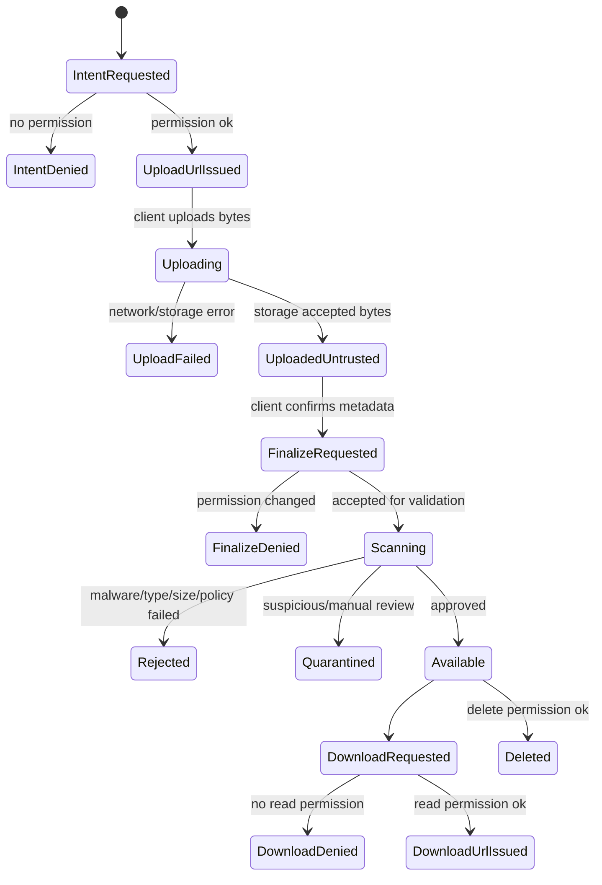
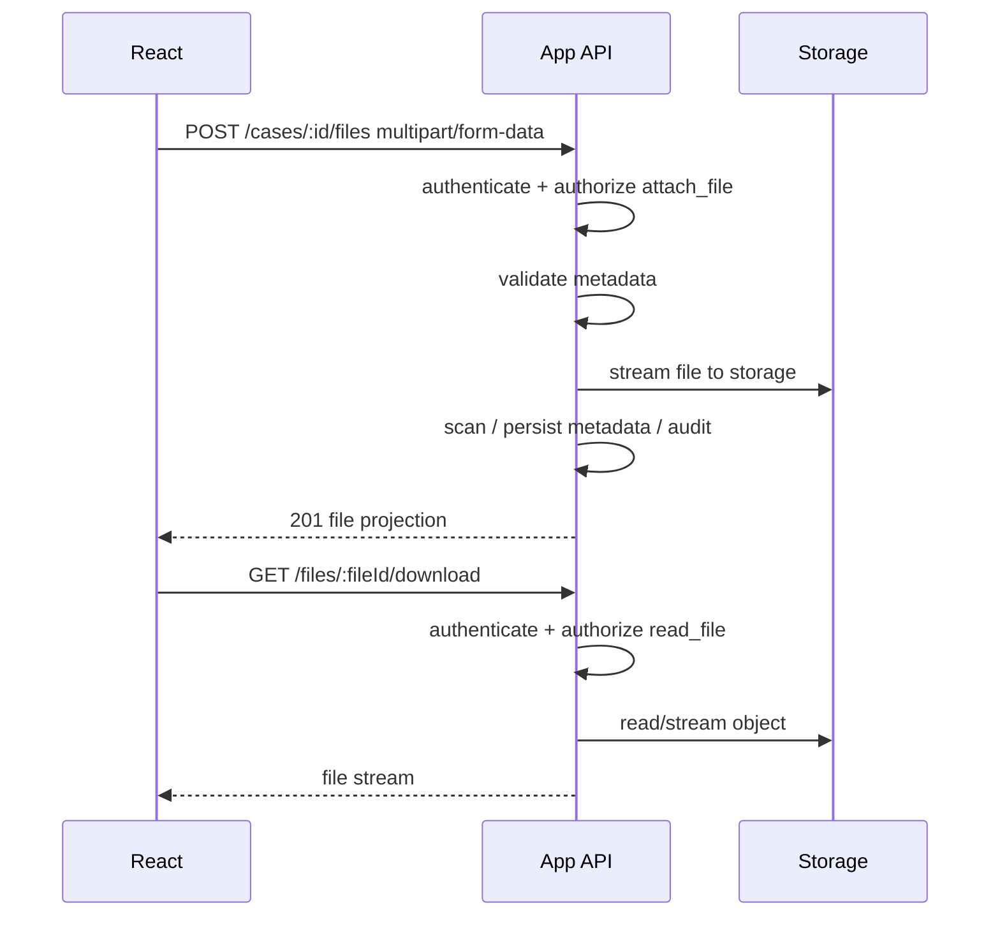
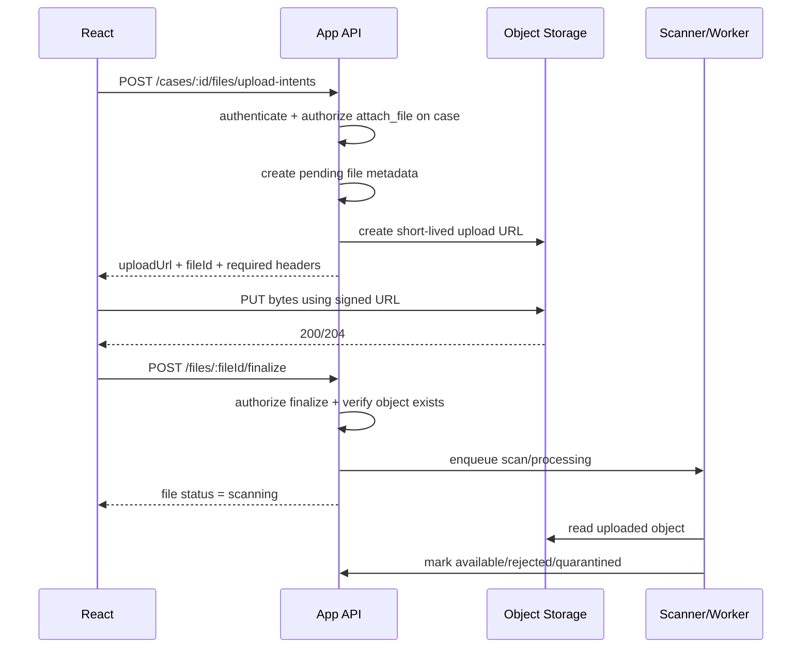
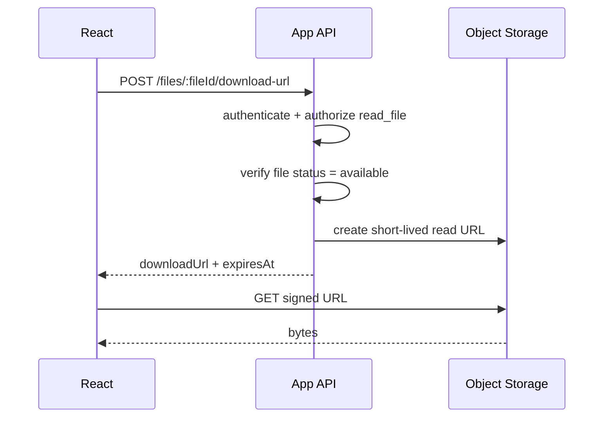
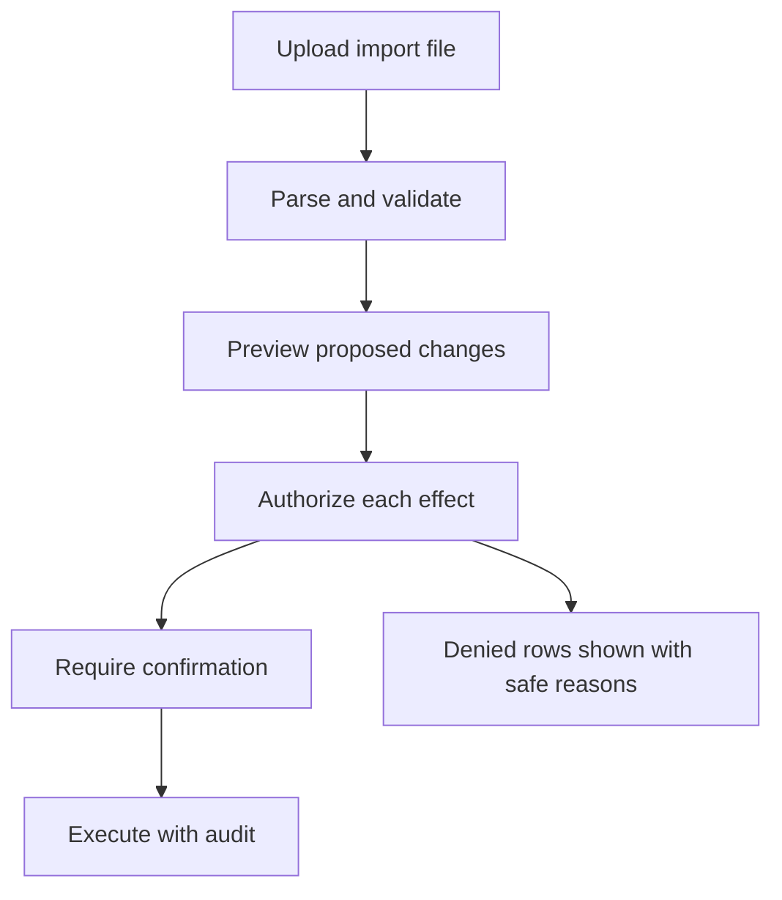

# Part 065 — File Upload/Download Authorization

File handling is where many React auth systems accidentally become object-level authorization systems.

A document preview, avatar upload, evidence attachment, invoice download, export file, CSV import, or signed URL looks like a product feature. Under the hood it is a protected resource boundary.

The dangerous simplification is this:

> If the user can see the upload/download button, the file operation is allowed.

That is wrong.

A file operation usually touches more than one resource:

```txt
actor -> parent resource -> file object -> storage object -> derived artifacts -> audit trail
```

For example, attaching evidence to a case is not merely `upload file`.

It is:

```txt
Can actor attach a file
  to this case
  in this tenant
  at this workflow state
  with this classification
  using this upload channel
  under this size/type policy?
```

React must model that workflow clearly, but the server must enforce it.

---

## 1. Mental model

A file is not just bytes.

In production systems a file has at least four identities:

| Identity | Example | Security meaning |
|---|---|---|
| Product identity | `evidenceAttachmentId` | What the app talks about. |
| Metadata identity | `fileId`, `documentId` | What permission/audit systems usually reference. |
| Storage identity | S3 key, GCS object name, blob path | What object storage uses. |
| Derived identity | thumbnail, preview, OCR text, virus scan result, export URL | Often forgotten but still sensitive. |

The authorization mistake is letting one identity impersonate another.

A storage key is not permission.

A file ID is not permission.

A signed URL is not permission.

A visible button is not permission.

They are only handles.

---

## 2. File authorization invariants

Use these invariants during design review:

```txt
1. File bytes are untrusted until validated/scanned.
2. File metadata is untrusted until finalized server-side.
3. Storage object keys are implementation details, not API authorization proof.
4. Direct upload URLs are short-lived capabilities, not permanent access grants.
5. Direct download URLs are bearer capabilities, not identity-aware sessions.
6. Preview/thumbnail/OCR/export artifacts inherit the parent file's access policy.
7. Parent resource authorization is checked on every upload, finalize, download, preview, delete, and share operation.
8. Client-side file type checks are UX hints only.
9. Every file operation is auditable.
10. Revocation must stop future access even if old UI state says allowed.
```

The key phrase is **future access**. A signed URL already issued might remain usable until expiry. That means TTL, object-key design, and revocation strategy matter.

---

## 3. File operations are resource transitions

Most teams treat file upload as one request.

A safer model treats it as a state machine.



React should represent this workflow explicitly instead of pretending upload is a single happy path.

---

## 4. Common architectures

### Architecture A — Proxy upload/download through application server



Good when:

- files are small/medium;
- server must inspect content inline;
- you need tight authorization at request time;
- you want simple browser auth via existing cookies/session;
- object storage should never be exposed to the browser.

Trade-off:

- app server handles bandwidth;
- upload/download performance may be worse;
- large files require streaming/backpressure care.

### Architecture B — Direct upload with signed URL



Good when:

- files are large;
- you want object storage to handle bandwidth;
- upload needs resumability/multipart;
- app server should not stream bytes.

Trade-off:

- signed URL becomes a bearer capability;
- object key and metadata design become critical;
- upload is no longer automatically tied to the user's session at storage request time;
- you need a finalize/scan/publish protocol.

### Architecture C — Direct download with signed URL



Good when:

- downloads are large;
- CDN/object storage should serve bytes;
- API should only authorize and issue capability.

Trade-off:

- URL can be copied until expiry;
- CDN/browser/proxy logs may contain the URL;
- revocation is not instantaneous unless TTL is short or object key is rotated/blocked.

---

## 5. Signed URL is a capability

A signed URL answers a narrow question:

> Does this URL holder possess a valid cryptographic capability to perform this storage operation until expiry?

It does not answer:

- who is the current user?
- is the user still employed?
- did the user's role change?
- was the case reassigned?
- was the file quarantined?
- did the tenant revoke access?

That means React must not treat signed URL issuance as a permanent file permission.

A signed URL should be:

```txt
short-lived
operation-specific
object-specific
method-specific
content-bound where possible
header-bound where possible
not persisted in app state longer than needed
not stored in analytics/logs
not placed in long-lived cache
```

AWS S3 presigned URLs are valid for the configured expiration window; AWS documents console-generated URLs from 1 minute to 12 hours and SDK/CLI-generated URLs up to 7 days. That is a storage capability lifetime, not an application permission lifetime.

---

## 6. Direct upload: the safe protocol

Do not let the browser ask storage for arbitrary object keys.

The safe shape is:

```txt
React asks app server for an upload intent.
App server authorizes the parent resource.
App server chooses the object key.
App server returns a short-lived upload capability.
Browser uploads bytes.
Browser finalizes.
Server verifies, scans, persists, and publishes.
```

### Upload intent request

```ts
export type CreateUploadIntentRequest = {
  parentType: 'case' | 'profile' | 'invoice' | 'message';
  parentId: string;
  purpose: 'evidence' | 'avatar' | 'attachment' | 'import' | 'export_result';
  filename: string;
  sizeBytes: number;
  contentType: string;
  checksumSha256?: string;
};
```

The client may send metadata, but metadata is not authority.

The server must decide:

```ts
type UploadIntentDecision = {
  allowed: boolean;
  reason?:
    | 'NOT_AUTHENTICATED'
    | 'NO_ATTACH_PERMISSION'
    | 'CASE_CLOSED'
    | 'TENANT_MISMATCH'
    | 'FILE_TOO_LARGE'
    | 'FILE_TYPE_NOT_ALLOWED'
    | 'STEP_UP_REQUIRED';
};
```

### Upload intent response

```ts
export type UploadIntentResponse = {
  fileId: string;
  uploadUrl: string;
  method: 'PUT' | 'POST';
  expiresAt: string;
  requiredHeaders: Record<string, string>;
  maxSizeBytes: number;
  acceptedContentTypes: string[];
  finalizeUrl: string;
};
```

Notice what is missing:

- no user-chosen storage key;
- no permanent download URL;
- no claim that the file is available;
- no permission decision beyond this upload attempt.

### Finalize request

```ts
export type FinalizeUploadRequest = {
  fileId: string;
  checksumSha256?: string;
  clientObservedSizeBytes?: number;
};
```

Finalize is not cosmetic. It is where the server verifies:

- file belongs to the pending upload intent;
- object exists at the expected key;
- actor can still attach to the parent resource;
- metadata matches server policy;
- object has not exceeded allowed size;
- object is moved into scan/pending state;
- audit event is written.

---

## 7. React upload state machine

A robust upload component should not be a boolean `isUploading`.

Use explicit states:

```ts
type UploadState =
  | { tag: 'idle' }
  | { tag: 'requesting_intent' }
  | { tag: 'intent_denied'; reason: string }
  | { tag: 'uploading'; fileId: string; progress: number; abort: AbortController }
  | { tag: 'uploaded_unfinalized'; fileId: string }
  | { tag: 'finalizing'; fileId: string }
  | { tag: 'scanning'; fileId: string }
  | { tag: 'available'; fileId: string }
  | { tag: 'rejected'; fileId: string; reason: string }
  | { tag: 'failed'; error: string; retryable: boolean };
```

Why this matters:

- user can close tab after upload but before finalize;
- permission can change during upload;
- storage can accept bytes but app server can reject metadata;
- scanner can reject after UI thought upload succeeded;
- retry must not create orphaned objects;
- cancellation must not leave published files.

---

## 8. Minimal React direct upload skeleton

```tsx
async function uploadAttachment(input: {
  caseId: string;
  file: File;
  api: ApiClient;
  onProgress?: (percentage: number) => void;
}) {
  const intent = await input.api.post<UploadIntentResponse>(
    `/api/cases/${input.caseId}/files/upload-intents`,
    {
      filename: input.file.name,
      sizeBytes: input.file.size,
      contentType: input.file.type || 'application/octet-stream',
    }
  );

  const uploadResponse = await fetch(intent.uploadUrl, {
    method: intent.method,
    headers: {
      ...intent.requiredHeaders,
      'Content-Type': input.file.type || 'application/octet-stream',
    },
    body: input.file,
  });

  if (!uploadResponse.ok) {
    throw new Error(`Storage upload failed: ${uploadResponse.status}`);
  }

  const finalized = await input.api.post(`/api/files/${intent.fileId}/finalize`, {
    clientObservedSizeBytes: input.file.size,
  });

  return finalized;
}
```

This skeleton is intentionally incomplete. Production code still needs:

- abort support;
- progress reporting through `XMLHttpRequest` or library support if required;
- retry policy;
- checksum validation;
- single-file/multi-file state isolation;
- duplicate upload handling;
- finalize recovery if tab crashes;
- query invalidation after status changes;
- typed error handling.

---

## 9. Client-side validation is UX, not security

React should validate file size/type before upload because it improves UX and reduces waste.

But client-side validation is bypassable.

```ts
const allowed = ['application/pdf', 'image/png', 'image/jpeg'];

function validateBeforeUpload(file: File) {
  if (file.size > 25 * 1024 * 1024) {
    return { ok: false, reason: 'File is larger than 25 MB.' };
  }

  if (!allowed.includes(file.type)) {
    return { ok: false, reason: 'Only PDF, PNG, and JPEG files are allowed.' };
  }

  return { ok: true };
}
```

This is not sufficient.

The server still must validate:

- extension allowlist;
- actual content/magic bytes where appropriate;
- MIME/content-type;
- size;
- archive extraction policy;
- filename normalization;
- path traversal attempts;
- malware scanning;
- image/document parser risk;
- CDR policy if required;
- upload quota;
- tenant storage policy.

OWASP's file upload guidance emphasizes extension allowlists, filename safety, size limits, storage location, and content validation/scanning. React is only one layer in that chain.

---

## 10. Filename is hostile input

Never trust `file.name`.

Bad assumptions:

```txt
invoice.pdf is safe because it ends in .pdf
../../x is impossible because the browser selected it
case_123_evidence.pdf means it belongs to case_123
résumé.pdf and resume.pdf are always distinguishable
```

Better model:

```txt
Original filename = display metadata.
Storage key = server-generated random/internal identifier.
File type = server-validated classification.
Parent association = server-side relation.
```

Example:

```ts
type FileRecord = {
  id: string;
  tenantId: string;
  parentType: 'case';
  parentId: string;
  originalFilename: string;
  safeDisplayName: string;
  storageBucket: string;
  storageKey: string;
  contentType: string;
  sizeBytes: number;
  status: 'pending' | 'scanning' | 'available' | 'rejected' | 'deleted';
  createdBy: string;
  createdAt: string;
};
```

The UI displays `safeDisplayName`. The API never lets the client choose `storageKey`.

---

## 11. Download authorization patterns

### Pattern 1 — App server streams the file

```http
GET /api/files/file_123/content
Cookie: session=...
```

Server flow:

```txt
authenticate user
load file metadata
authorize read_file on file and parent
verify file status = available
stream object bytes
set safe headers
audit download event
```

Pros:

- strong per-request authorization;
- simple revocation;
- easier audit;
- no signed URL leakage.

Cons:

- app server handles bandwidth;
- less efficient for very large objects;
- server needs stream/backpressure handling.

### Pattern 2 — App server issues short-lived download URL

```http
POST /api/files/file_123/download-url
Cookie: session=...
```

Response:

```json
{
  "url": "https://storage.example.com/...signed...",
  "expiresAt": "2026-07-08T09:15:00Z",
  "filename": "case-evidence.pdf"
}
```

Pros:

- storage/CDN handles bandwidth;
- good for large downloads;
- easy browser download.

Cons:

- URL is bearer capability;
- revocation is bounded by TTL;
- URL leakage matters;
- audit of actual byte access may move to storage logs.

### Pattern 3 — Authorized CDN/private origin

Good for high-volume media/document preview, but complex.

You still need:

- application-level authorization before issuing signed cookie/URL;
- short TTL;
- key rotation;
- origin access restriction;
- cache segmentation;
- consistent purge/revocation strategy.

---

## 12. Download response headers

When proxying downloads, headers matter.

Example:

```http
Content-Type: application/pdf
Content-Disposition: attachment; filename="case-evidence.pdf"
Cache-Control: private, no-store
X-Content-Type-Options: nosniff
```

Guidelines:

- use `attachment` for untrusted user-uploaded content unless inline preview is explicitly safe;
- set `nosniff` to reduce content sniffing surprises;
- avoid public caching for sensitive documents;
- use safe/encoded filename handling;
- avoid exposing internal storage keys in headers;
- avoid embedding signed URLs in HTML where analytics/logging may capture them.

---

## 13. Preview is download

A preview is not less sensitive than download.

Preview can leak:

- image thumbnails;
- first page of PDFs;
- OCR text;
- metadata;
- redacted/unredacted versions;
- converted HTML;
- extracted attachments;
- transcript text;
- EXIF/GPS data;
- error messages from document parsers.

The rule:

```txt
Preview artifacts inherit the original file's access policy unless explicitly more restrictive.
```

If a user cannot download the evidence file, they usually should not see the generated thumbnail, OCR text, AI summary, or preview image either.

---

## 14. Derived artifacts require policy propagation

File processing often creates derived resources:

```txt
original.pdf
original-preview-page-1.png
original-thumbnail.webp
original-ocr.txt
original-redacted.pdf
original-virus-scan-report.json
original-export.csv
```

Every derived artifact needs:

- parent file reference;
- tenant reference;
- classification label;
- generation status;
- access policy;
- retention policy;
- audit behavior;
- deletion behavior.

Bad design:

```txt
/files/file_123/download is protected
/previews/file_123/page-1.png is public
```

Better design:

```txt
/files/file_123/preview/page/1
  -> authenticate
  -> authorize read_preview on file_123
  -> serve artifact or issue signed URL
```

---

## 15. Import flows are authorization-sensitive

CSV/Excel imports are file upload plus bulk mutation.

Do not authorize only `upload_import_file`.

You also need to authorize the effects.

Example:

```txt
User uploads users.csv
Import would create users, assign roles, move cases, update status
```

Authorization should be staged:



React UI should show:

- rows that will succeed;
- rows that are denied;
- rows needing step-up;
- rows needing correction;
- total blast radius;
- whether operation is partial or all-or-nothing.

---

## 16. Export flows are authorization-sensitive

Export is also a file operation.

A user may be allowed to view a paginated list but not export all records.

Export authorization must consider:

- row-level access;
- field-level access;
- export size;
- tenant scope;
- filters;
- hidden columns;
- masking/redaction;
- background job access;
- download expiry;
- audit.

React should not send arbitrary filter JSON and assume the export service will behave.

Use an export intent:

```ts
type ExportIntentRequest = {
  resource: 'cases';
  filters: CaseFilterDto;
  fields: string[];
  format: 'csv' | 'xlsx' | 'pdf';
};

type ExportIntentResponse = {
  exportJobId: string;
  status: 'queued';
  estimatedRows?: number;
  requiresStepUp?: boolean;
  deniedFields?: string[];
};
```

The server must authorize fields and rows when creating the job, and again when generating or downloading the result if policy can change.

---

## 17. File deletion authorization

Delete has more states than `can delete file`.

Questions:

- delete from UI only or physically delete from storage?
- soft-delete or hard-delete?
- does retention/legal hold override user permission?
- should derived artifacts be deleted too?
- should the file remain in audit trail?
- can the uploader delete it after case submission?
- can supervisors delete evidence after escalation?

Model this explicitly:

```ts
type DeleteFileDecision =
  | { allowed: true; mode: 'soft_delete' | 'hard_delete' }
  | { allowed: false; reason: 'LEGAL_HOLD' | 'CASE_CLOSED' | 'NO_PERMISSION' };
```

React should not just hide delete. It should be able to explain why deletion is unavailable when product policy requires transparency.

---

## 18. Sharing files

File sharing is grant creation.

It is not a UI shortcut.

A share operation should authorize:

```txt
Can actor create grant
  for target principal
  on this file/parent resource
  with this permission level
  until this expiry
  under tenant policy?
```

Common share patterns:

| Pattern | Risk |
|---|---|
| Public link | High leakage risk; should be rare in regulated systems. |
| Authenticated link | Requires session and file permission. |
| Time-limited external link | Capability URL; requires short TTL and audit. |
| Grant-based sharing | Best for collaboration; explicit target identity. |
| Download once | Useful but hard to guarantee across retries/proxies. |

React share UI should show:

- recipient identity;
- access level;
- expiry;
- whether download is allowed;
- whether preview only is allowed;
- whether onward sharing is allowed;
- audit implications.

---

## 19. React Query / cache implications

File metadata is permission-sensitive.

Use auth-scoped keys:

```ts
const fileKey = (ctx: AuthContext, fileId: string) => [
  'file',
  ctx.tenantId,
  ctx.userId,
  ctx.permissionEpoch,
  fileId,
];
```

On logout:

```ts
queryClient.clear();
```

On tenant switch:

```ts
queryClient.removeQueries({ queryKey: ['file'] });
queryClient.removeQueries({ queryKey: ['case'] });
```

On permission change event:

```ts
queryClient.invalidateQueries({ queryKey: ['file'] });
queryClient.invalidateQueries({ queryKey: ['case'] });
```

Do not persist signed URLs in long-lived offline cache.

Do not put signed URLs into analytics events.

Do not put signed URLs into error reporting breadcrumbs.

---

## 20. Direct object key leakage

Avoid URLs like:

```txt
https://cdn.example.com/tenant-a/cases/123/evidence/report.pdf
```

This leaks:

- tenant identity;
- resource type;
- case ID;
- filename;
- business process;
- sometimes user names or dates.

Prefer opaque storage keys:

```txt
objects/2026/07/08/f_7QnX0T6pR2.bin
```

Then keep business meaning in protected metadata.

---

## 21. Multi-tenant file boundary

Every file must carry tenant identity server-side.

```ts
type TenantScopedFile = {
  id: string;
  tenantId: string;
  parentTenantId: string;
  storagePartition: string;
  storageKey: string;
};
```

Checks:

```txt
session.tenantId == route.tenantId
file.tenantId == session.tenantId
file.parentId belongs to session.tenantId
storage partition matches file tenant or isolation policy
```

React must clear file state on tenant switch.

If the user switches from Tenant A to Tenant B while a download modal is open, the modal should close or revalidate.

---

## 22. Error handling

Use typed errors.

```ts
type FileAuthError =
  | { type: 'UNAUTHENTICATED' }
  | { type: 'FORBIDDEN'; reason: 'NO_FILE_READ_PERMISSION' | 'TENANT_MISMATCH' }
  | { type: 'NOT_FOUND_OR_NOT_ALLOWED' }
  | { type: 'FILE_NOT_AVAILABLE'; status: 'scanning' | 'quarantined' | 'rejected' }
  | { type: 'SIGNED_URL_EXPIRED' }
  | { type: 'STEP_UP_REQUIRED'; challengeId: string };
```

UI recovery:

| Error | UI response |
|---|---|
| `UNAUTHENTICATED` | Re-login, preserve safe intent. |
| `FORBIDDEN` | Explain or offer request access. |
| `NOT_FOUND_OR_NOT_ALLOWED` | Avoid existence leak if policy says so. |
| `FILE_NOT_AVAILABLE` | Show scan/quarantine/rejection state. |
| `SIGNED_URL_EXPIRED` | Request a fresh URL if still authorized. |
| `STEP_UP_REQUIRED` | Launch step-up flow. |

---

## 23. Observability and audit

File auth bugs are often discovered late because file access happens outside normal API paths.

Audit events:

```ts
type FileAuditEvent = {
  eventType:
    | 'FILE_UPLOAD_INTENT_CREATED'
    | 'FILE_UPLOAD_COMPLETED'
    | 'FILE_FINALIZED'
    | 'FILE_SCAN_REJECTED'
    | 'FILE_DOWNLOAD_URL_ISSUED'
    | 'FILE_DOWNLOADED'
    | 'FILE_PREVIEWED'
    | 'FILE_DELETED'
    | 'FILE_SHARE_CREATED'
    | 'FILE_ACCESS_DENIED';
  actorUserId: string;
  tenantId: string;
  fileId?: string;
  parentType?: string;
  parentId?: string;
  decision?: 'allow' | 'deny';
  reason?: string;
  correlationId: string;
  at: string;
};
```

Metrics:

- upload intent denial rate;
- finalize failure rate;
- storage upload success but finalize missing;
- scan rejection rate;
- expired signed URL rate;
- denied download rate;
- download URL issuance vs actual storage access gap;
- orphaned object count;
- upload retry count;
- tenant mismatch attempts.

---

## 24. Security review checklist

For file upload/download features:

- [ ] Parent resource authorization is checked before upload intent.
- [ ] Server chooses storage key.
- [ ] Upload URL is short-lived and operation-specific.
- [ ] Client-provided filename is treated as display metadata only.
- [ ] Server validates extension/content/size/policy.
- [ ] Uploaded files remain unavailable until finalize/scan completes.
- [ ] Finalize re-checks permission.
- [ ] Orphaned uploads are cleaned up.
- [ ] Download checks read permission at request time.
- [ ] Signed download URL TTL is short.
- [ ] Preview/thumbnail/OCR artifacts inherit file access policy.
- [ ] Export/import flows authorize the effect, not only the file transfer.
- [ ] Cache is cleared on logout and tenant switch.
- [ ] Signed URLs are excluded from logs/analytics/error breadcrumbs.
- [ ] File operations have audit events.
- [ ] Denied access has safe error semantics.
- [ ] Tests include tampered file ID, parent ID, tenant ID, and expired signed URL.

---

## 25. Testing matrix

| Scenario | Expected result |
|---|---|
| User uploads to case they can edit | Upload intent created. |
| User uploads to closed case | Denied before storage URL issued. |
| Permission removed during upload | Finalize denied or file quarantined/deleted. |
| User changes parent ID in finalize | Denied. |
| User downloads file from another tenant | Denied or not-found according to policy. |
| Signed URL expires | UI requests new URL if still allowed. |
| File is scanning | Preview/download unavailable. |
| File rejected by scan | UI shows rejection state. |
| Tenant switch while preview open | Preview closes/revalidates. |
| Bulk export includes denied fields | Denied fields omitted or export denied. |
| Upload abandoned before finalize | Cleanup job removes orphan. |
| Public cache receives sensitive file | Test fails. |

Example Playwright-style test:

```ts
test('cannot finalize upload after permission is revoked', async ({ page }) => {
  await loginAs(page, 'case_worker');
  await page.goto('/cases/case_123/files');

  const intent = await requestUploadIntent(page, 'case_123', 'evidence.pdf');

  await revokePermission('case_worker', 'case_123', 'attach_file');

  await uploadToStorage(intent.uploadUrl, samplePdfBuffer());

  const response = await finalizeUpload(intent.fileId);

  expect(response.status()).toBe(403);
});
```

---

## 26. Anti-pattern catalog

### Anti-pattern: “Use the file URL as the permission model”

A URL is a locator or capability. It is not a policy.

### Anti-pattern: “The storage bucket is private, so the app is safe”

Private bucket helps. Your signed URL issuance logic can still be broken.

### Anti-pattern: “The client tells us the content type”

The browser-provided content type is a hint, not proof.

### Anti-pattern: “Preview is harmless”

Preview can expose the same sensitive content as download.

### Anti-pattern: “File upload succeeded, so the file is available”

Storage accepted bytes. Product acceptance requires finalize, validation, scan, and authorization.

### Anti-pattern: “Signed URL can be valid for days because users dislike expiry”

Long-lived capabilities are authorization debt.

### Anti-pattern: “Exports are just downloads”

Exports may contain aggregated data beyond what the user can view row-by-row.

---

## 27. The part to remember

File authorization is object authorization plus workflow authorization plus storage capability management.

The safe mental model:

```txt
React requests intent.
Server authorizes intent.
Storage accepts bytes or serves bytes.
Server finalizes and audits product state.
Signed URLs are short-lived capabilities.
Derived artifacts inherit access policy.
Every file operation re-checks parent/resource permission.
```

If your design follows that shape, file handling stops being an accidental backdoor and becomes a controlled, observable part of your authorization system.

---

## References

- OWASP File Upload Cheat Sheet — https://cheatsheetseries.owasp.org/cheatsheets/File_Upload_Cheat_Sheet.html
- OWASP Insecure Direct Object Reference Prevention Cheat Sheet — https://cheatsheetseries.owasp.org/cheatsheets/Insecure_Direct_Object_Reference_Prevention_Cheat_Sheet.html
- OWASP Authorization Cheat Sheet — https://cheatsheetseries.owasp.org/cheatsheets/Authorization_Cheat_Sheet.html
- Amazon S3 User Guide, presigned URLs — https://docs.aws.amazon.com/AmazonS3/latest/userguide/using-presigned-url.html
- MDN, Content-Disposition — https://developer.mozilla.org/en-US/docs/Web/HTTP/Headers/Content-Disposition
- MDN, X-Content-Type-Options — https://developer.mozilla.org/en-US/docs/Web/HTTP/Headers/X-Content-Type-Options
