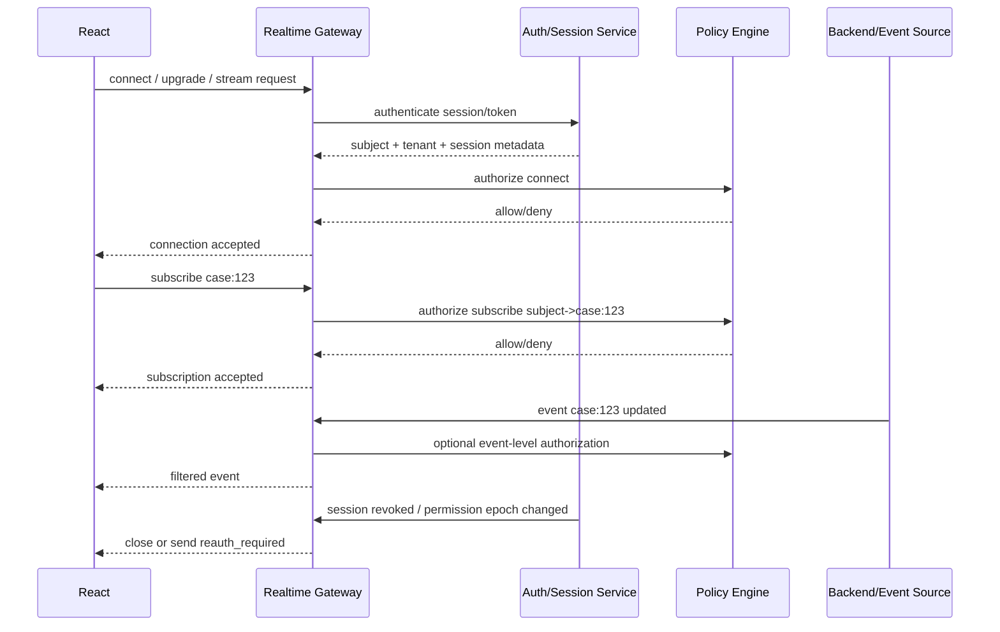
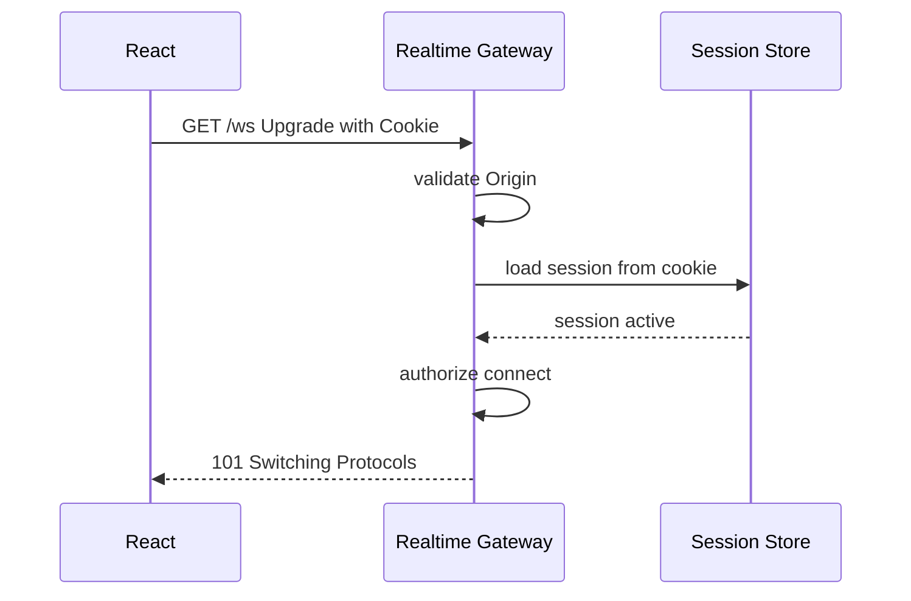
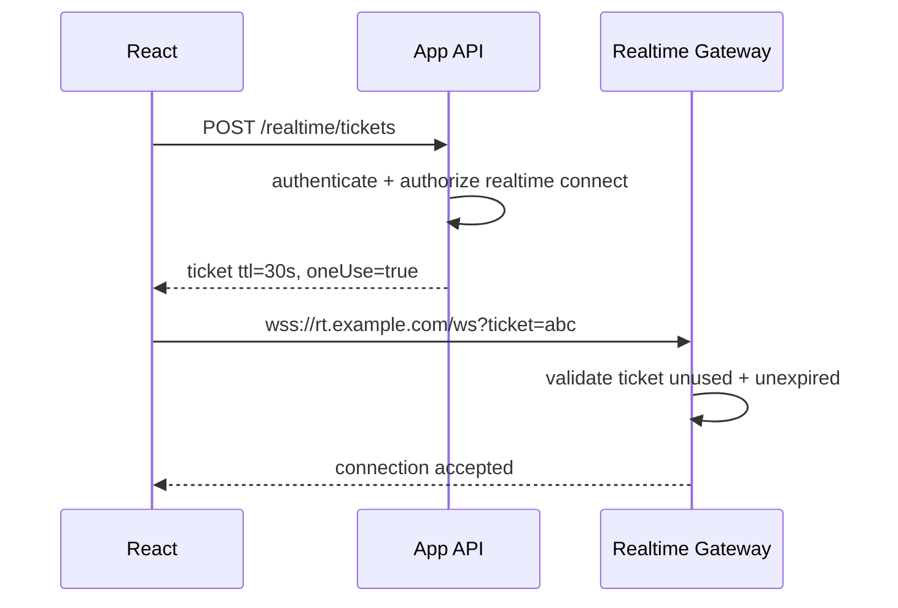
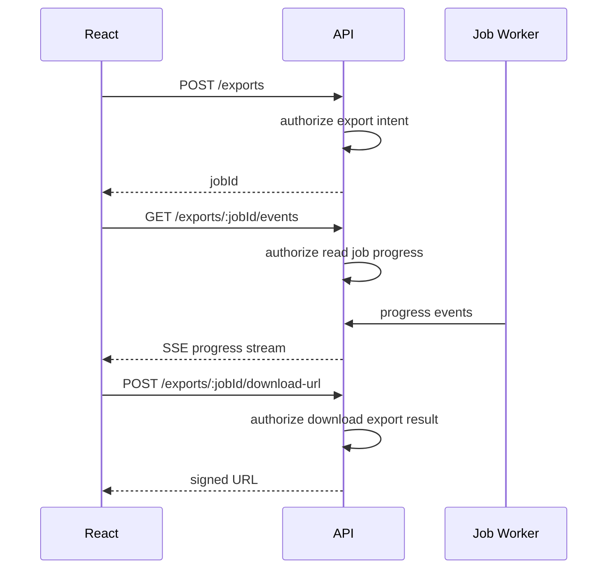

# Part 066 — WebSocket/SSE Auth

Realtime changes the auth problem.

A normal HTTP request has a clear lifecycle:

```txt
authenticate -> authorize -> execute -> respond -> finish
```

A realtime connection does not finish quickly.

A WebSocket may stay open for hours. An SSE stream may auto-reconnect. Permission may change while the connection is alive. Tenant context may switch. Session may expire. A role may be revoked. A channel may become forbidden. A case may move into a restricted workflow state.

The hard question is not only:

> Can the user connect?

The harder question is:

> Can the user continue receiving this event right now?

That is the mental model for this part.

---

## 1. WebSocket vs SSE in one table

| Property | WebSocket | Server-Sent Events / SSE |
|---|---|---|
| Direction | Bidirectional | Server to client only |
| Browser API | `WebSocket` | `EventSource` |
| Transport start | HTTP upgrade handshake | HTTP response stream |
| Typical use | chat, collaborative editing, notifications, subscriptions, commands | notifications, progress, activity feed, job updates |
| Custom headers from browser API | Not exposed in constructor; constructor accepts URL and optional protocols | Not exposed like `fetch`; constructor accepts URL and options including credentials mode |
| Cookie auth | Possible if same-site/cross-site cookie policy allows | Possible with credentials mode/CORS constraints |
| Bearer token header | Not directly via browser `WebSocket` constructor | Not directly via native `EventSource` |
| Reconnect behavior | App/library-owned | Built-in retry behavior in `EventSource`, usually still needs app-level policy |
| Server push granularity | Messages/frames | Text event stream |
| Auth challenge mid-stream | App protocol needed | Usually close/reconnect or event instructs app |

Neither technology removes authorization requirements.

They only change where the checks happen.

---

## 2. The core invariant

```txt
Handshake authentication is not channel authorization.
Channel authorization is not event authorization.
Event authorization is not UI rendering authorization.
```

A user can be authenticated and still not allowed to subscribe to a channel.

A user can be allowed to subscribe to a channel and still not allowed to see every event on that channel.

A user can be allowed to see an event and still not allowed to execute the action linked inside the event.

---

## 3. Realtime auth lifecycle



Notice the multiple boundaries:

1. connection authentication;
2. connection authorization;
3. subscription/channel authorization;
4. event-level filtering;
5. action authorization when user clicks something caused by the event;
6. revocation/revalidation while connected.

---

## 4. WebSocket authentication transport options

Browser WebSocket API is not `fetch`.

The constructor shape is basically:

```ts
new WebSocket(url, protocols?)
```

That means the browser API does not give React a general `headers` object like `fetch` does.

Common options:

| Option | Example | Pros | Risks |
|---|---|---|---|
| Same-site HttpOnly cookie | `wss://app.example.com/ws` | Token not exposed to JS; simple with BFF/session cookie | CSRF-like cross-site connection concerns; Origin check required |
| Short-lived one-time ticket in URL | `wss://.../ws?ticket=...` | Works with browser API; can be bound/short-lived | URL logging/leakage if mishandled |
| Token in query string | `?access_token=...` | Easy | High leakage/logging risk; avoid for long-lived bearer tokens |
| Token in subprotocol | `new WebSocket(url, ['app.v1', token])` | Avoids query string | Misuses subprotocol; may leak in logs; awkward server support |
| Initial auth message | connect then send `{type:'authenticate'}` | Flexible | unauthenticated connection window; must timeout/limit strictly |
| BFF-issued connection | browser uses cookie to BFF/gateway | Strong boundary | Requires gateway/BFF design |

Recommended default for serious React apps:

```txt
Prefer same-site HttpOnly cookie + Origin checks for first-party apps,
or short-lived one-time connection ticket issued by authenticated HTTPS endpoint.
Avoid long-lived bearer tokens in query strings.
```

---

## 5. Cookie-authenticated WebSocket

Flow:



Security requirements:

- use `wss://`, not `ws://` in production;
- validate the `Origin` header on the server;
- require an active session;
- bind connection to tenant/session/user;
- close connection on logout/revocation;
- do not trust client-sent tenant/user IDs;
- rate limit connection attempts;
- do not treat connection as subscription permission.

Why `Origin` matters:

A browser can initiate cross-origin WebSocket connections. Cookies may be included depending on cookie attributes and browser policy. Server-side origin allowlist is therefore part of the security boundary.

---

## 6. One-time connection ticket pattern

This is often the best pattern when you cannot or do not want cookie-authenticated realtime.



Ticket properties:

```ts
type RealtimeTicket = {
  id: string;
  subjectId: string;
  tenantId: string;
  sessionId: string;
  audience: 'realtime-gateway';
  allowedConnectionTypes: Array<'ws' | 'sse'>;
  issuedAt: string;
  expiresAt: string;
  oneTimeUse: true;
  permissionEpoch: number;
};
```

Rules:

- TTL should be short, often seconds;
- mark ticket as used atomically;
- bind ticket to session/user/tenant;
- do not persist ticket in localStorage;
- do not log ticket value;
- do not reuse for multiple tabs unless designed intentionally;
- require fresh ticket after logout/login/tenant switch.

---

## 7. Bad pattern: long-lived access token in URL

This is convenient:

```ts
const ws = new WebSocket(`wss://rt.example.com/ws?access_token=${token}`);
```

It is usually a bad production default.

Why:

- URLs appear in server logs;
- URLs may appear in reverse proxy logs;
- URLs may appear in browser/network tooling;
- URLs may be captured by error reporting;
- tokens can be long-lived enough to be useful if leaked;
- token replay is easy;
- refresh/rotation becomes awkward.

If a URL credential is unavoidable, make it a short-lived, one-time, realtime-specific ticket, not your normal access token.

---

## 8. Channel authorization

Connection allowed does not mean subscription allowed.

Bad protocol:

```json
{ "type": "subscribe", "channel": "case:123" }
```

Server blindly subscribes.

Better protocol:

```json
{ "type": "subscribe", "resourceType": "case", "resourceId": "case_123", "events": ["case.updated", "comment.created"] }
```

Server evaluates:

```txt
subject can subscribe to case_123 updates?
subject can read case_123?
subject tenant matches case tenant?
subject clearance covers case classification?
subject session assurance is enough?
```

Decision response:

```json
{
  "type": "subscription_result",
  "correlationId": "sub_01",
  "status": "denied",
  "reason": "NO_CASE_READ_PERMISSION"
}
```

Do not let the client invent trusted channel names.

---

## 9. Topic design

Topic names often leak sensitive data.

Bad:

```txt
tenant-acme/case-123/evidence-uploaded
vip-customer-jane-doe/fraud-investigation
```

Better internal topic:

```txt
rt:t_8f9a:case:c_4k2x:events
```

Best application protocol:

```txt
Client asks for resource subscription by ID.
Server maps resource to internal topic after authorization.
Client never sees broker topic names.
```

If the frontend knows broker topics, the frontend becomes tightly coupled to backend topology and may leak internal security structure.

---

## 10. Event-level authorization

Subscription-level authorization is sometimes not enough.

Example:

A user can read a case, but not all fields of the case.

Event:

```json
{
  "type": "case.updated",
  "caseId": "case_123",
  "changes": {
    "status": "ESCALATED",
    "assignedInvestigator": "user_999",
    "sensitiveNotes": "..."
  }
}
```

Event-level authorization options:

### Option A — Filter before publish

Publisher emits only events to authorized audiences.

Pros: efficient for known groups.

Cons: hard when authorization is personalized.

### Option B — Gateway filters per connection

Gateway evaluates each event against each connection/subscription.

Pros: strong personalized filtering.

Cons: can be expensive.

### Option C — Event contains only IDs; client refetches

```json
{ "type": "case.changed", "caseId": "case_123", "version": 42 }
```

Client invalidates query and fetches via normal HTTP authorization.

Pros: simple and safe.

Cons: extra request; not ideal for high-frequency streams.

For sensitive business apps, Option C is often a strong default:

```txt
Realtime event tells the UI that something changed.
HTTP API remains the source of authorized data.
```

---

## 11. React event handler pattern

Do not directly merge arbitrary stream payload into sensitive UI state unless the event is already authorized and schema-validated.

Safer pattern:

```tsx
function useCaseRealtime(caseId: string) {
  const queryClient = useQueryClient();
  const auth = useAuthSnapshot();

  useRealtimeSubscription({
    resourceType: 'case',
    resourceId: caseId,
    enabled: auth.status === 'authenticated',
    onEvent(event) {
      switch (event.type) {
        case 'case.changed':
          queryClient.invalidateQueries({
            queryKey: ['case', auth.tenantId, auth.permissionEpoch, caseId],
          });
          break;

        case 'permission.changed':
          queryClient.invalidateQueries({ queryKey: ['permissions'] });
          queryClient.invalidateQueries({ queryKey: ['case', auth.tenantId, caseId] });
          break;
      }
    },
  });
}
```

The event becomes a cache invalidation signal, not an unreviewed data patch.

---

## 12. SSE authentication

SSE uses `EventSource`.

Basic shape:

```ts
const events = new EventSource('/api/events');
```

For cross-origin credentialed requests, native `EventSource` has a `withCredentials` option:

```ts
const events = new EventSource('https://api.example.com/events', {
  withCredentials: true,
});
```

Implications:

- cookie auth can work if CORS and cookie attributes allow it;
- custom `Authorization` header is not available through native `EventSource` like it is with `fetch`;
- if you need bearer-header semantics, use a fetch-based SSE parser/library or a BFF endpoint;
- reconnect must revalidate session and subscription permissions.

---

## 13. SSE stream protocol

Example server event:

```txt
event: case.changed
id: 42
data: {"caseId":"case_123","version":42}
```

Client:

```tsx
useEffect(() => {
  const source = new EventSource('/api/events', { withCredentials: true });

  source.addEventListener('case.changed', (message) => {
    const event = JSON.parse((message as MessageEvent).data) as {
      caseId: string;
      version: number;
    };

    queryClient.invalidateQueries({ queryKey: ['case', event.caseId] });
  });

  source.addEventListener('auth.revoked', () => {
    source.close();
    authStore.transition({ type: 'SESSION_REVOKED' });
  });

  source.onerror = () => {
    // EventSource will usually try to reconnect.
    // App-level logic should still avoid infinite noisy UI.
  };

  return () => source.close();
}, [queryClient]);
```

The server must still authorize every stream connection and every event stream scope.

---

## 14. Reconnect is an auth event

Realtime clients reconnect frequently:

- laptop sleeps/wakes;
- mobile network changes;
- server deploys;
- proxy idle timeout;
- token expires;
- cookie session rotates;
- tenant switches;
- browser throttles background tabs.

Reconnect must not silently resurrect old access.

Reconnect algorithm:

```txt
on disconnect:
  mark realtime state degraded
  stop sending user actions over stale socket

before reconnect:
  re-check auth state
  obtain fresh ticket if ticket-based
  use current tenant/session/permission epoch

on reconnect:
  resubscribe only to resources still visible/allowed
  reconcile missed events by refetching authoritative HTTP state
```

React state:

```ts
type RealtimeState =
  | { tag: 'disconnected' }
  | { tag: 'connecting' }
  | { tag: 'connected'; connectionId: string }
  | { tag: 'degraded'; reason: 'network' | 'auth_refreshing' | 'server_restart' }
  | { tag: 'reauth_required' }
  | { tag: 'forbidden'; reason: string };
```

---

## 15. Session expiry while connected

Do not assume a WebSocket remains valid forever because it was authenticated once.

Strategies:

### Strategy A — Close on expiry/revocation

Server tracks session expiry/revocation and closes connections.

Close code/protocol message:

```json
{ "type": "reauth_required", "reason": "SESSION_EXPIRED" }
```

Then close socket.

### Strategy B — Periodic revalidation

Gateway periodically validates session or permission epoch.

```txt
every N minutes:
  check session active
  check permission epoch unchanged
  close or downgrade if invalid
```

### Strategy C — Token/ticket renewal protocol

Client sends refreshed credential over app protocol.

This is more complex. Use carefully.

If using cookie/BFF session, server-side tracking is often simpler.

---

## 16. Permission change while connected

When permission changes:

```txt
role removed
case reassigned
tenant membership revoked
case classification raised
user enters/exits impersonation
step-up requirement introduced
```

Realtime gateway should do one of:

1. close connection;
2. unsubscribe affected channels;
3. send `permission.changed` and force HTTP refetch;
4. downgrade payloads;
5. require step-up.

Do not merely update UI menus.

The stream itself must stop sending newly forbidden data.

---

## 17. Multi-tab coordination

Multiple tabs can create multiple connections.

Problems:

- duplicate notifications;
- refresh storms;
- multiple ticket issuance;
- inconsistent tenant context;
- logout not closing all streams;
- permission epoch differs per tab.

Patterns:

### Pattern A — One connection per tab

Simple, but more backend load.

Use BroadcastChannel for logout/tenant switch coordination.

### Pattern B — SharedWorker connection

One shared connection per browser profile/origin.

More complex, not always worth it.

### Pattern C — Leader election

One tab owns realtime connection; other tabs receive events through BroadcastChannel.

Complex but useful for heavy streams.

Default recommendation:

```txt
Start with one connection per active tab.
Add cross-tab logout/tenant-switch invalidation.
Optimize later if load demands it.
```

---

## 18. Cross-tab logout example

```ts
const channel = new BroadcastChannel('auth-events');

function announceLogout() {
  channel.postMessage({ type: 'LOGOUT', at: Date.now() });
}

function useRealtimeLogoutBridge(socketRef: React.RefObject<WebSocket | null>) {
  useEffect(() => {
    channel.onmessage = (message) => {
      if (message.data?.type === 'LOGOUT') {
        socketRef.current?.close(4001, 'logout');
        socketRef.current = null;
      }
    };

    return () => {
      channel.close();
    };
  }, [socketRef]);
}
```

This is UI coordination only. Server session revocation is still required.

---

## 19. CSRF-like concerns for cookie realtime

If WebSocket/SSE uses cookies, ask:

- can another site initiate the connection?
- will browser include cookies?
- does server validate `Origin`?
- are commands accepted over the socket?
- are subscriptions authorized?
- are side effects possible without CSRF token or equivalent?

For read-only streams, unauthorized connection can still leak data.

For bidirectional sockets, commands over socket are mutations and need the same authorization/CSRF mindset as HTTP actions.

Server rules:

```txt
Validate Origin.
Authenticate session.
Authorize connect.
Authorize subscription.
Authorize every mutation message.
Rate limit.
Close invalid sessions.
Audit sensitive actions.
```

---

## 20. Commands over WebSocket

If the socket allows commands:

```json
{ "type": "case.close", "caseId": "case_123" }
```

Treat it like an HTTP action:

```txt
authenticate connection subject
authorize action on resource
validate workflow transition
validate idempotency/correlation ID
audit
return typed success/denial
```

Response:

```json
{
  "type": "command_result",
  "correlationId": "cmd_123",
  "status": "denied",
  "reason": "CASE_ALREADY_ESCALATED"
}
```

Do not rely on subscription permission to authorize commands.

---

## 21. Backpressure and abuse

Realtime channels are abuse surfaces.

Risks:

- connection floods;
- subscription floods;
- expensive authorization checks per event;
- high-cardinality topics;
- unbounded message queues;
- client cannot keep up;
- replay/reconnect storm after deploy;
- notification spam;
- large payload amplification.

Controls:

- connection limit per user/session/IP/tenant;
- subscription limit per connection;
- message size limit;
- heartbeat/ping timeout;
- backpressure queue size;
- rate limit commands;
- coalesce high-frequency events;
- prefer invalidation events over full payloads;
- close slow clients safely.

React should treat realtime as eventually consistent hints, not a guaranteed command log unless you build a real sync protocol.

---

## 22. Heartbeat and liveness

A connected socket does not always mean the app is fresh.

Use heartbeats:

```json
{ "type": "ping", "serverTime": "2026-07-08T09:00:00Z" }
```

Client state:

```ts
if (Date.now() - lastMessageAt > HEARTBEAT_TIMEOUT_MS) {
  realtimeStore.set({ tag: 'degraded', reason: 'network' });
}
```

When degraded:

- show subtle status;
- stop optimistic realtime-only claims;
- allow manual refresh;
- refetch critical data on reconnect.

---

## 23. React provider shape

A realtime provider should not expose raw socket everywhere.

Better:

```tsx
type RealtimeClient = {
  state: RealtimeState;
  subscribe(input: SubscriptionInput): () => void;
  sendCommand(input: CommandInput): Promise<CommandResult>;
};

const RealtimeContext = createContext<RealtimeClient | null>(null);

export function useRealtime() {
  const value = useContext(RealtimeContext);
  if (!value) throw new Error('useRealtime must be used inside RealtimeProvider');
  return value;
}
```

The provider owns:

- connection lifecycle;
- auth state integration;
- tenant integration;
- reconnect policy;
- ticket refresh;
- event schema validation;
- subscription registry;
- cleanup on logout;
- observability.

Feature components should subscribe semantically:

```tsx
useCaseRealtime(caseId);
useJobProgress(jobId);
useNotificationFeed();
```

not:

```tsx
socket.send(JSON.stringify({ channel: `case:${caseId}` }));
```

---

## 24. Schema validation

Stream data is external input.

Validate it.

```ts
import { z } from 'zod';

const CaseChangedEvent = z.object({
  type: z.literal('case.changed'),
  caseId: z.string(),
  version: z.number(),
});

function handleMessage(raw: MessageEvent) {
  const parsed = JSON.parse(raw.data);
  const result = CaseChangedEvent.safeParse(parsed);

  if (!result.success) {
    telemetry.warn('invalid_realtime_event', { reason: result.error.message });
    return;
  }

  queryClient.invalidateQueries({ queryKey: ['case', result.data.caseId] });
}
```

Do not let malformed events crash your auth-sensitive UI.

---

## 25. Close codes and typed disconnect reasons

Use an application-level close reason taxonomy.

```ts
type RealtimeCloseReason =
  | 'NORMAL'
  | 'LOGOUT'
  | 'SESSION_EXPIRED'
  | 'SESSION_REVOKED'
  | 'TENANT_SWITCHED'
  | 'PERMISSION_REVOKED'
  | 'STEP_UP_REQUIRED'
  | 'SERVER_RESTART'
  | 'RATE_LIMITED'
  | 'PROTOCOL_ERROR';
```

Map to UI:

| Reason | UI behavior |
|---|---|
| `LOGOUT` | Close silently. |
| `SESSION_EXPIRED` | Re-login flow. |
| `SESSION_REVOKED` | Clear auth state and cache. |
| `TENANT_SWITCHED` | Reconnect under new tenant. |
| `PERMISSION_REVOKED` | Close affected views/refetch. |
| `STEP_UP_REQUIRED` | Trigger step-up for sensitive stream. |
| `RATE_LIMITED` | Backoff and show degraded state. |
| `SERVER_RESTART` | Reconnect with jitter. |

---

## 26. SSE job progress example

Job progress is a good SSE use case.

Flow:



React pattern:

```tsx
function useExportProgress(jobId: string | null) {
  const queryClient = useQueryClient();
  const [progress, setProgress] = useState<number | null>(null);

  useEffect(() => {
    if (!jobId) return;

    const source = new EventSource(`/api/exports/${jobId}/events`, {
      withCredentials: true,
    });

    source.addEventListener('progress', (message) => {
      const data = JSON.parse((message as MessageEvent).data) as { percentage: number };
      setProgress(data.percentage);
    });

    source.addEventListener('complete', () => {
      queryClient.invalidateQueries({ queryKey: ['export', jobId] });
      source.close();
    });

    source.addEventListener('denied', () => {
      queryClient.invalidateQueries({ queryKey: ['export', jobId] });
      source.close();
    });

    return () => source.close();
  }, [jobId, queryClient]);

  return progress;
}
```

The final download remains separately authorized.

---

## 27. Notification feed authorization

Notification feeds are subtle.

A notification can leak:

- existence of a restricted case;
- sender identity;
- tenant/project names;
- status changes;
- comments or excerpts;
- assignment changes;
- security events.

Safer notification payload:

```json
{
  "type": "notification.created",
  "notificationId": "notif_123"
}
```

Then React fetches the notification list through normal authorized HTTP.

If you send full notification payloads, the server/gateway must filter them per connection.

---

## 28. SSR and hydration

Realtime should usually start after client hydration and auth bootstrap.

Avoid:

```txt
connect socket before session bootstrap finishes
subscribe before tenant context is known
subscribe using stale server-rendered user projection
hydrate with sensitive event data embedded in HTML
```

Better:

```tsx
const auth = useAuthSnapshot();

useEffect(() => {
  if (auth.status !== 'authenticated') return;
  if (!auth.tenantId) return;

  realtime.connect({
    tenantId: auth.tenantId,
    permissionEpoch: auth.permissionEpoch,
  });

  return () => realtime.disconnect('component_unmounted');
}, [auth.status, auth.tenantId, auth.permissionEpoch]);
```

---

## 29. Observability

Metrics:

- connection attempts;
- connection denials by reason;
- active connections per tenant/user;
- subscription attempts;
- subscription denials;
- event filtering drops;
- session-revoked disconnects;
- permission-revoked disconnects;
- reconnect rate;
- reconnect storm after deploy;
- invalid message count;
- command denial rate;
- average connection duration;
- slow client disconnects.

Audit events:

```ts
type RealtimeAuditEvent = {
  eventType:
    | 'REALTIME_CONNECT_ALLOWED'
    | 'REALTIME_CONNECT_DENIED'
    | 'REALTIME_SUBSCRIBE_ALLOWED'
    | 'REALTIME_SUBSCRIBE_DENIED'
    | 'REALTIME_COMMAND_ALLOWED'
    | 'REALTIME_COMMAND_DENIED'
    | 'REALTIME_SESSION_REVOKED_DISCONNECT'
    | 'REALTIME_PERMISSION_REVOKED_UNSUBSCRIBE';
  actorUserId?: string;
  tenantId?: string;
  sessionId?: string;
  connectionId?: string;
  resourceType?: string;
  resourceId?: string;
  reason?: string;
  correlationId: string;
  at: string;
};
```

Do not log raw credentials, tickets, tokens, or sensitive payloads.

---

## 30. Testing matrix

| Scenario | Expected result |
|---|---|
| Anonymous user connects | Denied. |
| Authenticated user connects | Accepted if realtime allowed. |
| Bad Origin connects with cookie | Denied. |
| User subscribes to allowed case | Subscription accepted. |
| User subscribes to forbidden case | Denied. |
| Permission revoked while subscribed | Unsubscribed or disconnected. |
| Session expires while connected | Reauth/close. |
| Tenant switches in another tab | Socket closes/reconnects under new tenant. |
| Event for forbidden resource arrives | Dropped or transformed into safe invalidation only. |
| Socket command mutates forbidden resource | Command denied and audited. |
| Network reconnects | Fresh auth/ticket used. |
| Invalid event schema received | Ignored and logged safely. |
| Server deploy causes disconnect | Reconnect with jitter. |
| Rate limit hit | Backoff and degraded UI. |

Example test shape:

```ts
test('forbidden subscription is denied even when connection is authenticated', async () => {
  const socket = await connectRealtimeAs('case_worker');

  const result = await socket.subscribe({
    resourceType: 'case',
    resourceId: 'case_from_other_tenant',
    events: ['case.changed'],
  });

  expect(result.status).toBe('denied');
  expect(result.reason).toBe('TENANT_MISMATCH');
});
```

---

## 31. Production checklist

Before shipping WebSocket/SSE auth:

- [ ] Connection authentication is explicit.
- [ ] Server validates `Origin` for cookie-authenticated WebSocket.
- [ ] Long-lived bearer tokens are not placed in WebSocket query strings.
- [ ] Ticket-based auth uses short-lived, one-time, audience-bound tickets.
- [ ] Connection authorization is separate from channel authorization.
- [ ] Subscription requests are authorized against resource/action/tenant context.
- [ ] Event payloads are filtered or reduced to invalidation signals.
- [ ] Commands over socket are authorized like HTTP mutations.
- [ ] Session expiry/revocation closes or downgrades connections.
- [ ] Permission changes unsubscribe/close/refetch affected streams.
- [ ] Reconnect obtains fresh auth context.
- [ ] Logout closes streams across tabs.
- [ ] Tenant switch clears/reconnects streams.
- [ ] Client validates event schemas.
- [ ] Metrics cover denials, reconnects, and invalid payloads.
- [ ] Logs exclude tokens/tickets/sensitive payloads.

---

## 32. Anti-pattern catalog

### Anti-pattern: “The socket connected, so all channels are allowed”

Connection auth is not subscription auth.

### Anti-pattern: “We send full payload events to everyone and hide fields in React”

That leaks data over the wire.

### Anti-pattern: “Use access token in query string because it works”

It works mechanically and fails operationally through logs/leakage/replay.

### Anti-pattern: “Session was valid at connect time, so stream can stay forever”

Permissions and sessions change.

### Anti-pattern: “Notifications are not sensitive”

Notification metadata can reveal restricted resource existence.

### Anti-pattern: “WebSocket commands are internal UI events”

They are remote mutation requests and need server-side authorization.

---

## 33. The part to remember

Realtime auth is not a one-time gate.

The safe model is:

```txt
Authenticate connection.
Authorize connection.
Authorize subscription.
Filter or minimize events.
Authorize commands.
Revalidate on reconnect.
React to revocation.
Close on logout.
Treat events as hints unless fully authorized.
```

A realtime connection is a living authorization relationship. Design it like one.

---

## References

- MDN WebSocket API — https://developer.mozilla.org/en-US/docs/Web/API/WebSockets_API
- MDN WebSocket constructor — https://developer.mozilla.org/en-US/docs/Web/API/WebSocket/WebSocket
- WHATWG WebSockets Standard — https://websockets.spec.whatwg.org/
- MDN EventSource — https://developer.mozilla.org/en-US/docs/Web/API/EventSource
- WHATWG HTML, Server-sent events — https://html.spec.whatwg.org/multipage/server-sent-events.html
- MDN CORS credentials error guidance — https://developer.mozilla.org/en-US/docs/Web/HTTP/Guides/CORS/Errors/CORSMIssingAllowCredentials
- OWASP Authorization Cheat Sheet — https://cheatsheetseries.owasp.org/cheatsheets/Authorization_Cheat_Sheet.html
- OWASP Session Management Cheat Sheet — https://cheatsheetseries.owasp.org/cheatsheets/Session_Management_Cheat_Sheet.html
