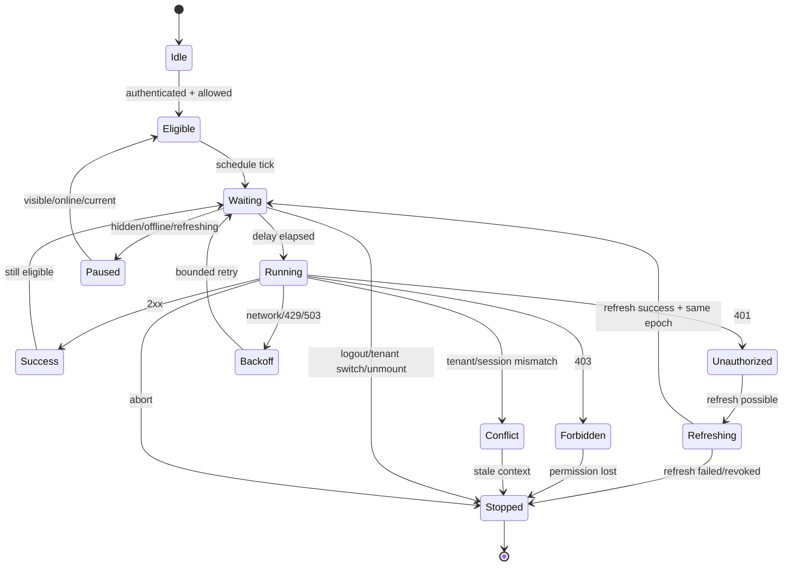
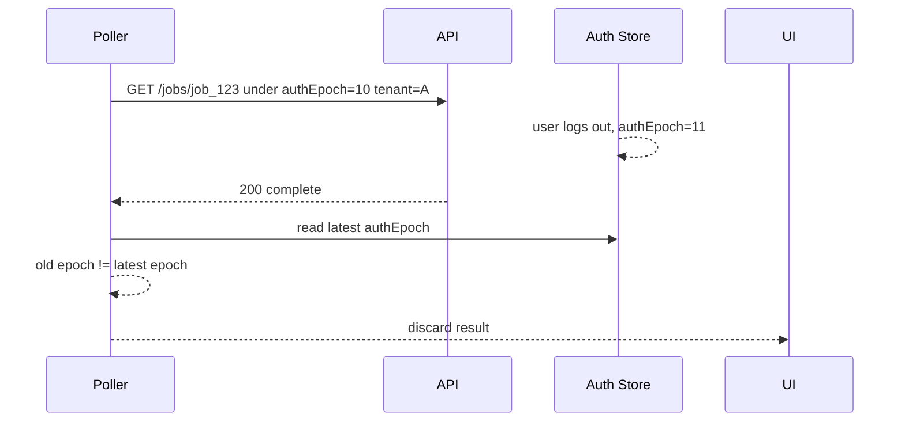
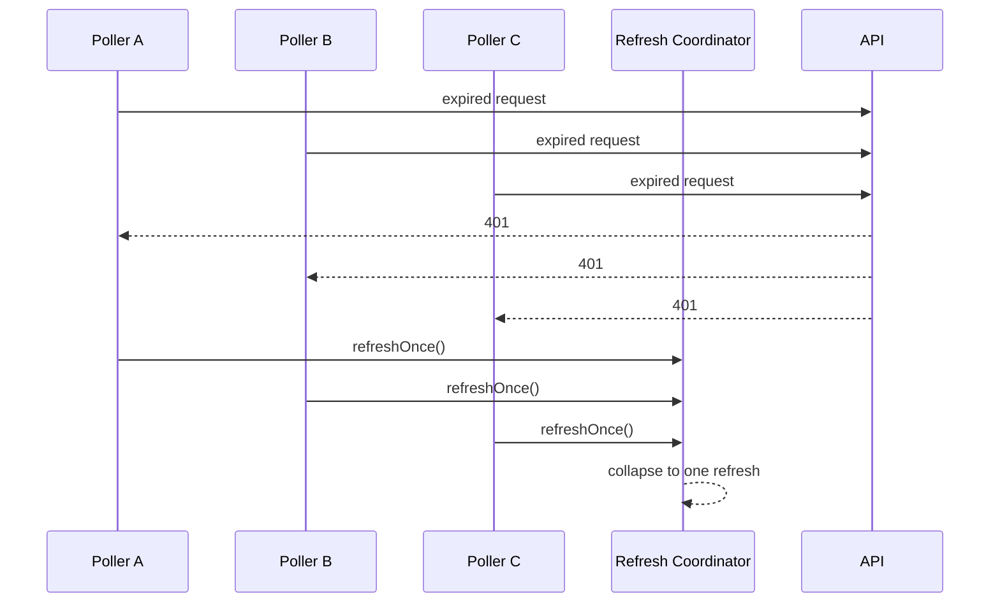
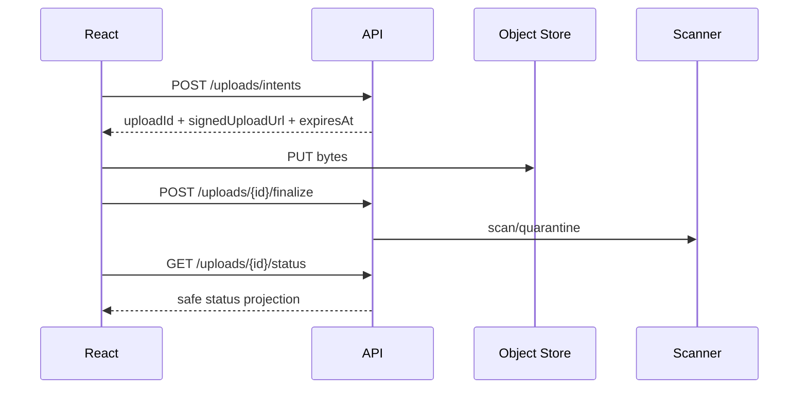

# Part 067 — Background Jobs and Polling Auth

Background work is where many React auth bugs hide.

A user logs out, but a polling interval keeps calling `/api/jobs/123`.

A role is revoked, but the browser still shows completion for an export job containing restricted data.

A user switches tenant, but an old hidden tab keeps polling tenant A while the visible tab shows tenant B.

A token expires, ten pollers fail at once, every poller triggers refresh, and the app creates a refresh storm.

The root mistake:

> Treating polling as “just data fetching”.

Polling is a background actor running inside the browser. It must obey the same auth lifecycle as visible UI.

---

## 1. What counts as background work?

In production React apps, background work includes:

| Mechanism | Common purpose | Auth risk |
|---|---|---|
| `setInterval` polling | job status, notifications, dashboards | continues after logout or tenant switch |
| TanStack Query `refetchInterval` | periodic server sync | stale cache or retry storm |
| visibility/refocus refetch | refresh when tab becomes active | stale data appears after auth changed |
| Web Worker | parsing, upload prep, expensive CPU work | stale auth context outside React tree |
| Service Worker | offline cache/background sync | cached/replayed authenticated requests |
| SSE/WebSocket reconnect | realtime updates | reconnects under old identity |
| autosave | drafts/forms | writes after permission changes |
| upload/download progress | file operations | object permission may change mid-operation |
| async export/report job | private artifact generation | status/result endpoint can leak metadata |

If the work can run while the user is not actively looking at the screen, it needs an auth policy.

---

## 2. Mental model

```txt
background work = scheduled request + auth context + resource context + cancellation policy
```

Do not model polling as:

```ts
setInterval(fetchData, 5000);
```

Model it as:

```txt
while current auth context is eligible:
  wait according to policy
  run request with abort support
  reconcile response with latest auth context
  render only if still current
```

The important word is **current**.

A request may start under one auth state and finish under another.

---

## 3. Core invariants

### Invariant 1 — no background request without current auth context

A poller must know the current security scope:

```ts
type AuthContext = {
  authEpoch: number;
  status: 'anonymous' | 'authenticated' | 'refreshing' | 'expired' | 'revoked';
  userId?: string;
  tenantId?: string;
  sessionId?: string;
  permissionVersion?: string;
};
```

A request is invalid if the context is missing, stale, or belongs to a previous tenant/session.

### Invariant 2 — logout cancels work

Logout must:

```txt
cancel timers
abort in-flight requests
clear query cache
close realtime connections
stop upload/autosave tasks
broadcast logout to other tabs
ignore late responses from old auth epoch
```

### Invariant 3 — tenant switch cancels tenant-scoped work

```txt
tenant A polling loop must not survive transition to tenant B
```

Tenant switch is partial logout for tenant-scoped data.

### Invariant 4 — permission revocation beats progress continuity

Never assume:

```txt
allowed at job start => allowed forever
```

The status endpoint, output endpoint, download endpoint, and notification endpoint each need authorization.

### Invariant 5 — refresh must be single-flight

If ten pollers receive `401` at the same time, there must be one refresh attempt, not ten.

```txt
many failed requests -> one refresh coordinator -> safe replay only
```

### Invariant 6 — background failure must not create foreground redirect loops

A hidden polling failure should not repeatedly redirect the visible page to login.

Background auth recovery must be bounded and event-driven.

---

## 4. Polling lifecycle



The danger is not one request. The danger is a loop that does the wrong thing repeatedly.

---

## 5. Polling policy is a security control

| Policy dimension | Bad default | Safer default |
|---|---|---|
| while anonymous | keep polling and expect `401` | stop immediately |
| while refreshing | every poller refreshes | pause behind refresh coordinator |
| hidden tab | continue high-frequency polling | pause or slow down intentionally |
| after `401` | redirect from every request | refresh once or stop via auth event |
| after `403` | retry forever | stop and invalidate permission projection |
| after tenant switch | reuse old key | cancel and require tenant-scoped key |
| after logout | keep timers alive | abort and clear work |
| network error | retry forever | exponential backoff + circuit breaker |

The Page Visibility API is useful as a lifecycle signal, but visible page is not proof of user presence.

---

## 6. Background job authorization model

A background job usually has multiple resources:

```txt
job metadata resource
generated output resource
underlying source resources
```

Example:

```txt
POST /api/cases/export
GET  /api/jobs/job_123
GET  /api/exports/export_456/download
```

Each endpoint needs its own policy.

| Endpoint | Authorization requirement |
|---|---|
| create job | can request operation over selected resource set |
| read job status | can view job created by self/delegated actor in tenant |
| read output metadata | can see generated artifact metadata |
| download output | can still access exported data |
| cancel job | can cancel own job or has admin/support rule |

A status response can leak sensitive information.

Bad:

```json
{
  "id": "job_123",
  "status": "complete",
  "rows": 8942,
  "fileName": "high-risk-investigations.csv"
}
```

Safer denial:

```json
{
  "type": "https://example.com/problems/forbidden",
  "title": "Access denied",
  "status": 403,
  "code": "JOB_ACCESS_DENIED",
  "correlationId": "req_7b2f"
}
```

If existence itself is sensitive, return the same public shape as not found and log the true reason server-side.

---

## 7. Minimal auth-aware polling primitive

Create a reusable primitive instead of scattering intervals.

```ts
type PollContext = {
  authEpoch: number;
  tenantId: string;
  permissionVersion?: string;
};

type PollPolicy = {
  intervalMs: number;
  hiddenIntervalMs?: number;
  stopOnUnauthorized: boolean;
  stopOnForbidden: boolean;
  maxConsecutiveFailures: number;
};

type PollTask<T> = {
  name: string;
  getContext: () => PollContext | null;
  isEligible: (context: PollContext) => boolean;
  run: (context: PollContext, signal: AbortSignal) => Promise<T>;
  onResult: (result: T, context: PollContext) => void;
  onStop?: (reason: string) => void;
};
```

Implementation sketch:

```ts
export function startAuthAwarePolling<T>(task: PollTask<T>, policy: PollPolicy) {
  let stopped = false;
  let timer: number | undefined;
  let controller: AbortController | undefined;
  let failures = 0;

  function stop(reason: string) {
    if (stopped) return;
    stopped = true;
    if (timer !== undefined) window.clearTimeout(timer);
    controller?.abort();
    task.onStop?.(reason);
  }

  function schedule(delay: number) {
    if (stopped) return;
    if (timer !== undefined) window.clearTimeout(timer);
    timer = window.setTimeout(tick, delay);
  }

  async function tick() {
    const context = task.getContext();
    if (!context) return stop('no_auth_context');
    if (!task.isEligible(context)) return stop('not_eligible');

    const startedEpoch = context.authEpoch;
    const startedTenant = context.tenantId;
    controller = new AbortController();

    try {
      const result = await task.run(context, controller.signal);
      const latest = task.getContext();

      if (!latest || latest.authEpoch !== startedEpoch) return stop('auth_epoch_changed');
      if (latest.tenantId !== startedTenant) return stop('tenant_changed');

      failures = 0;
      task.onResult(result, latest);

      const delay = document.visibilityState === 'hidden'
        ? policy.hiddenIntervalMs ?? policy.intervalMs
        : policy.intervalMs;

      schedule(delay);
    } catch (error) {
      if (controller.signal.aborted) return;

      const status = toHttpStatus(error);
      if (status === 401 && policy.stopOnUnauthorized) return stop('unauthorized');
      if (status === 403 && policy.stopOnForbidden) return stop('forbidden');

      failures += 1;
      if (failures >= policy.maxConsecutiveFailures) return stop('too_many_failures');
      schedule(backoff(policy.intervalMs, failures));
    }
  }

  schedule(0);
  return () => stop('unmounted');
}

function backoff(base: number, failures: number) {
  const jitter = Math.floor(Math.random() * 250);
  return Math.min(base * 2 ** failures + jitter, 60_000);
}

function toHttpStatus(error: unknown): number | undefined {
  if (typeof error === 'object' && error !== null && 'status' in error) {
    return Number((error as { status: unknown }).status);
  }
}
```

The shape matters:

```txt
context snapshot -> request -> latest context reconciliation -> controlled continuation
```

---

## 8. Why reconcile after response?



The request was valid when started. The render is invalid when completed.

That is why late responses need auth-epoch checks.

---

## 9. React hook pattern

```tsx
type JobStatus =
  | { state: 'queued' }
  | { state: 'running'; percent?: number }
  | { state: 'complete'; outputId: string }
  | { state: 'failed'; reason: string }
  | { state: 'cancelled' };

export function useJobPolling(jobId: string, tenantId: string) {
  const auth = useAuthSnapshot();
  const can = useCan();
  const [status, setStatus] = React.useState<JobStatus | null>(null);
  const [stoppedReason, setStoppedReason] = React.useState<string | null>(null);

  React.useEffect(() => {
    if (auth.status !== 'authenticated') return;

    const allowed = can({
      action: 'job.read_status',
      resource: { type: 'job', id: jobId, tenantId },
    });

    if (!allowed.allowed) {
      setStoppedReason(allowed.reason.code);
      return;
    }

    return startAuthAwarePolling<JobStatus>(
      {
        name: `job:${jobId}`,
        getContext: () => {
          const latest = getAuthSnapshot();
          if (latest.status !== 'authenticated') return null;
          return {
            authEpoch: latest.authEpoch,
            tenantId: latest.tenantId,
            permissionVersion: latest.permissionVersion,
          };
        },
        isEligible: (ctx) => ctx.tenantId === tenantId,
        run: (_ctx, signal) => api.get(`/api/jobs/${jobId}`, { signal }),
        onResult: setStatus,
        onStop: setStoppedReason,
      },
      {
        intervalMs: 3000,
        hiddenIntervalMs: 15000,
        stopOnUnauthorized: true,
        stopOnForbidden: true,
        maxConsecutiveFailures: 5,
      }
    );
  }, [auth.status, auth.authEpoch, auth.tenantId, auth.permissionVersion, jobId, tenantId]);

  return { status, stoppedReason };
}
```

The dependency on `authEpoch` is intentional. A login/logout/session replacement should deterministically restart or stop the loop.

---

## 10. TanStack Query polling pattern

Bad:

```ts
useQuery({
  queryKey: ['job', jobId],
  queryFn: () => api.get(`/api/jobs/${jobId}`),
  refetchInterval: 3000,
});
```

Better:

```tsx
function useJobStatus(jobId: string) {
  const auth = useAuthSnapshot();

  return useQuery({
    queryKey: [
      'tenant', auth.tenantId,
      'authEpoch', auth.authEpoch,
      'permissionVersion', auth.permissionVersion,
      'job', jobId,
    ],
    enabled: auth.status === 'authenticated',
    queryFn: ({ signal }) => api.get(`/api/jobs/${jobId}`, { signal }),
    refetchInterval: (query) => {
      const data = query.state.data as JobStatus | undefined;
      if (!data) return 3000;
      if (data.state === 'complete' || data.state === 'failed' || data.state === 'cancelled') return false;
      if (document.visibilityState === 'hidden') return 15000;
      return 3000;
    },
    retry: (failureCount, error) => {
      const status = toHttpStatus(error);
      if (status === 401 || status === 403 || status === 404) return false;
      return failureCount < 3;
    },
  });
}
```

Authenticated query keys should include the security context that makes the data valid.

---

## 11. Refresh storms

Refresh storm sequence:



A simple coordinator:

```ts
class RefreshCoordinator {
  private inFlight: Promise<void> | null = null;

  refreshOnce(refresh: () => Promise<void>) {
    if (!this.inFlight) {
      this.inFlight = refresh().finally(() => {
        this.inFlight = null;
      });
    }
    return this.inFlight;
  }
}
```

Replay policy matters:

| Request kind | Replay after refresh? |
|---|---|
| idempotent status `GET` | usually yes |
| notification summary `GET` | usually yes |
| form mutation `POST` | only with idempotency and explicit policy |
| payment/irreversible command | no automatic replay |
| upload chunk | depends on resumable protocol |

---

## 12. Logout and tenant switch registry

Without a registry, background work becomes invisible.

```ts
class PollingRegistry {
  private stops = new Map<string, () => void>();

  register(key: string, stop: () => void) {
    this.stops.set(key, stop);
    return () => this.stops.delete(key);
  }

  stopAll(reason: string) {
    for (const stop of this.stops.values()) stop();
    this.stops.clear();
    console.info('polling_stopped', { reason });
  }
}
```

Use it from auth events:

```ts
authEvents.subscribe((event) => {
  if (event.type === 'LOGOUT') {
    pollingRegistry.stopAll('logout');
    queryClient.clear();
  }

  if (event.type === 'TENANT_SWITCH') {
    pollingRegistry.stopAll('tenant_switch');
    queryClient.removeQueries({
      predicate: (query) => query.queryKey.includes(event.fromTenantId),
    });
  }
});
```

---

## 13. Permission drift during long jobs

There are three common choices.

### A. Snapshot permission at job start

```txt
If user could start job, job may complete and result remains available to that user.
```

Good for low-risk reports. Risky for sensitive data.

### B. Recheck permission at result access

```txt
User may start job, but must still be allowed to download result.
```

Good for sensitive exports and regulated data.

### C. Cancel/quarantine job on permission revocation

```txt
Revocation invalidates running job.
```

Good for incident containment and high-risk systems.

React should not guess the policy. The backend should expose a clear status/reason contract.

---

## 14. Status response contract

```ts
type JobPollResponse =
  | {
      kind: 'job_status';
      jobId: string;
      tenantId: string;
      status: 'queued' | 'running' | 'complete' | 'failed' | 'cancelled';
      progress?: { completed: number; total: number };
      nextPollAfterMs?: number;
    }
  | {
      kind: 'access_denied';
      code: 'JOB_PERMISSION_REVOKED' | 'TENANT_MISMATCH' | 'JOB_NOT_VISIBLE';
      correlationId: string;
    }
  | {
      kind: 'reauth_required';
      code: 'SESSION_EXPIRED' | 'STEP_UP_REQUIRED';
      returnTo: string;
    };
```

The server may return `nextPollAfterMs` because it often knows the job queue state better than the browser.

---

## 15. Status code taxonomy

| Status | Meaning | Client behavior |
|---|---|---|
| `200` | status visible | render if context still current |
| `202` | accepted/running | continue with policy delay |
| `304` | unchanged | keep current projection if context valid |
| `400` | invalid request | stop and log developer error |
| `401` | unauthenticated/expired | refresh once or stop |
| `403` | forbidden | stop and invalidate permission cache |
| `404` | not found/not visible | stop; do not reveal distinction unless policy allows |
| `409` | state conflict | refetch parent/workflow state |
| `410` | gone/expired artifact | stop and show expired state |
| `423` | locked | continue only if lock is visible to user |
| `429` | rate limited | back off using `Retry-After` if present |
| `5xx` | server failure | bounded retry; no auth mutation |

Do not treat all errors as “try again forever”.

---

## 16. Autosave is a background mutation

Autosave writes data silently.

Bad:

```ts
setInterval(() => saveDraft(formState), 5000);
```

Safer autosave policy:

```txt
authenticated only
current tenant only
current field-level write permission only
idempotency/versioning required
abort on logout/tenant switch
stop on 401/403
server enforces permission again
```

Sketch:

```ts
async function autosave(payload: DraftPatch, signal: AbortSignal) {
  const permission = permissionStore.can({
    action: 'case.update_draft',
    resource: { type: 'case', id: payload.caseId },
  });

  if (!permission.allowed) throw new ForbiddenError(permission.reason.code);

  return api.patch(`/api/cases/${payload.caseId}/draft`, payload, {
    signal,
    headers: { 'Idempotency-Key': stableAutosaveKey(payload) },
  });
}
```

Autosave is not harmless because it is quiet.

---

## 17. Upload/download progress

A secure upload lifecycle:



Checks exist at every stage:

| Stage | Requirement |
|---|---|
| create intent | can attach file to resource |
| upload bytes | signed URL bound to intent and expiry |
| finalize | same actor/session/tenant or delegated rule |
| poll status | can view upload status |
| access final file | can view final object |
| delete/cancel | can manage attachment |

For sensitive systems, logout should abort unfinished uploads and invalidate upload intent.

---

## 18. Offline replay warning

Offline queues are background mutations with a time gap.

A queued operation needs metadata:

```ts
type QueuedOperation = {
  operationId: string;
  operationType: string;
  resource: { type: string; id: string; tenantId: string };
  createdByUserId: string;
  createdUnderSessionId: string;
  createdUnderPermissionVersion: string;
  expiresAt: string;
  payloadHash: string;
};
```

Before replay:

```txt
session still valid?
user still same?
tenant still same?
permission still valid?
workflow state still allows operation?
queued operation not expired?
```

Do not replay privileged mutations only because they were allowed earlier.

---

## 19. Multi-tab coordination

One user with five tabs can create five pollers.

Options:

| Strategy | Trade-off |
|---|---|
| all tabs poll | simple but wasteful/storm-prone |
| visible tabs poll | better but still multiple windows |
| leader tab polls | efficient but coordination complexity |
| server push | efficient but needs realtime authorization |

Leader rules:

```txt
leader scoped by tenant and auth epoch
heartbeat expires quickly
logout releases leadership
tenant switch releases leadership
followers discard old-epoch results
```

This is not always required. It is useful for expensive/high-frequency/sensitive polling.

---

## 20. Observability

Track background auth behavior explicitly.

| Metric | Why it matters |
|---|---|
| active pollers per session | detects leaks |
| poll requests per user | detects storms |
| polling `401` rate | expiry/refresh issue |
| polling `403` rate | stale permissions or bad projection |
| refresh collapse count | single-flight effectiveness |
| aborted requests on logout | lifecycle hygiene |
| stale response discarded count | race detection |
| hidden-tab polling rate | policy review |
| tenant mismatch discard count | tenant switch defects |

Structured event:

```json
{
  "event": "background_poll_stopped",
  "poller": "job-status",
  "reason": "tenant_changed",
  "authEpoch": 42,
  "tenantId": "ten_A",
  "correlationId": "req_abc"
}
```

Never log raw tokens, session IDs, or sensitive job payloads.

---

## 21. Testing matrix

| Scenario | Expected behavior |
|---|---|
| logout while poll request in-flight | request aborted or late response discarded |
| session expires during polling | one refresh attempt; no redirect storm |
| refresh fails | pollers stop; auth becomes expired/revoked |
| permission revoked mid-job | polling stops or returns safe denial |
| tenant switch during poll | old response discarded; cache cleared |
| tab hidden | polling pauses/slows according to policy |
| tab visible again | session revalidated before stale data shown |
| server returns `429` | backoff applied |
| server returns `403` | stop + permission invalidation |
| job completes after logout | no toast/result shown |
| offline then online | auth revalidated before replay |
| multiple tabs | no duplicated refresh storm |
| worker finishes after logout | result discarded by auth epoch |

Example test:

```ts
it('discards job status from old auth epoch', async () => {
  const auth = createAuthStore({ authEpoch: 10, tenantId: 'A' });
  const results: JobStatus[] = [];
  const request = deferred<JobStatus>();

  const stop = startAuthAwarePolling<JobStatus>(
    {
      name: 'job:test',
      getContext: () => auth.snapshot(),
      isEligible: () => true,
      run: () => request.promise,
      onResult: (result) => results.push(result),
    },
    { intervalMs: 1, stopOnForbidden: true, stopOnUnauthorized: true, maxConsecutiveFailures: 1 }
  );

  auth.logout();
  request.resolve({ state: 'complete', outputId: 'out_1' });
  await flushPromises();

  expect(results).toEqual([]);
  stop();
});
```

---

## 22. Anti-pattern catalog

### Raw interval in component

```ts
React.useEffect(() => {
  const id = setInterval(load, 5000);
  return () => clearInterval(id);
}, []);
```

Missing: auth context, tenant, permission, abort, visibility, error taxonomy, refresh coordination, and late response discard.

### Retrying `403`

`403` is an authorization decision. Stop and invalidate projection.

### Polling after logout because “it will return 401”

That wastes resources and creates noisy security telemetry.

### Global query keys

```ts
['notifications']
```

should usually include tenant/auth/permission scope.

### Background output toast after logout

Toasts are UI memory. Bind them to auth epoch and tenant.

---

## 23. Production checklist

- [ ] Every poller has an owner and lifecycle.
- [ ] Every poller is scoped by auth epoch and tenant.
- [ ] Logout cancels timers and in-flight requests.
- [ ] Tenant switch cancels tenant-scoped work.
- [ ] Query keys include tenant and relevant auth/permission version.
- [ ] `401` does not create redirect storms.
- [ ] Refresh is single-flight.
- [ ] `403` stops or invalidates permission projection.
- [ ] Hidden tab behavior is intentional.
- [ ] Offline replay revalidates auth and permission.
- [ ] Long-running job output is separately authorized.
- [ ] Late responses from old auth context are discarded.
- [ ] Sensitive notification counts do not leak hidden resources.
- [ ] Worker/service-worker background work receives logout/tenant-switch signals.
- [ ] Metrics exist for active pollers, stops, aborts, stale discards, and auth failures.

---

## 24. Final mental model

A background task is not exempt from auth because it is invisible.

It is more dangerous because it is invisible.

The rule:

```txt
Every background request must prove it still belongs to the current authenticated context before it starts, while it runs, and before its result mutates UI state.
```

Start under current auth. Finish under current auth. Render only under current auth.

---

## References

- MDN — Page Visibility API: https://developer.mozilla.org/en-US/docs/Web/API/Page_Visibility_API
- MDN — `visibilitychange` event: https://developer.mozilla.org/en-US/docs/Web/API/Document/visibilitychange_event
- MDN — AbortController: https://developer.mozilla.org/en-US/docs/Web/API/AbortController
- TanStack Query — Query Invalidation: https://tanstack.com/query/latest/docs/framework/react/guides/query-invalidation
- TanStack Query — Query Cancellation: https://tanstack.com/query/latest/docs/framework/react/guides/query-cancellation
- OWASP — Authorization Cheat Sheet: https://cheatsheetseries.owasp.org/cheatsheets/Authorization_Cheat_Sheet.html
- OWASP — Session Management Cheat Sheet: https://cheatsheetseries.owasp.org/cheatsheets/Session_Management_Cheat_Sheet.html
