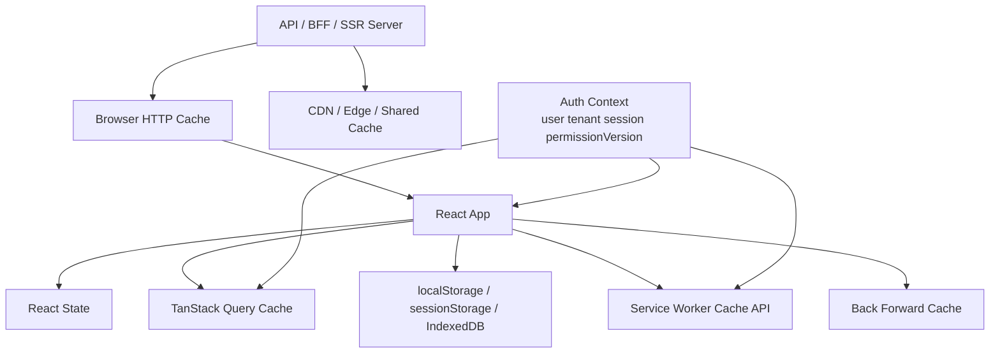

# Part 068 — Cache Control for Authenticated UI

Caching is not just performance.

In authenticated systems, caching is controlled duplication of sensitive state.

A user-specific response can be copied into:

```txt
React memory
TanStack Query cache
browser HTTP cache
back/forward cache
service worker cache
IndexedDB
localStorage/sessionStorage
CDN/shared proxy cache
server-side render cache
edge cache
logs/analytics/session replay tools
```

Every copy can outlive the permission decision that produced it.

The mental model:

> Authenticated UI is not only rendered. It is remembered.

---

## 1. The core problem

A request is authorized at time `T1`.

The response is cached.

At time `T2`, one of these happens:

```txt
user logs out
session expires
user switches tenant
role is revoked
object ACL changes
case moves to restricted state
user presses browser back
another user uses the same machine
CDN reuses the response
service worker serves stale data
```

If the app serves the cached response without revalidation or context check, authorization has been bypassed by memory.

The server may have done the right thing at `T1`. The system can still leak at `T2`.

---

## 2. Cache layers in a React app



| Layer | Purpose | Auth risk |
|---|---|---|
| React state | current UI state | late response after logout |
| query cache | data reuse/refetch | stale tenant/permission data |
| browser HTTP cache | avoid network | sensitive response stored |
| bfcache | instant back/forward nav | logged-out page visually restored |
| service worker cache | offline/PWA/performance | private response served after logout |
| localStorage/IndexedDB | persistence | data remains across users/sessions |
| CDN/shared cache | global performance | personalized response reused cross-user |
| SSR/edge cache | server performance | user HTML/data reused incorrectly |

Safe default:

```txt
cache public immutable assets aggressively
cache authenticated/sensitive responses conservatively
scope client caches by auth context
never put personalized responses in shared caches accidentally
clear or invalidate auth-scoped caches on logout/tenant/permission changes
```

---

## 3. Classify before configuring

Do not start with headers. Start with data classification.

| Response class | Examples | Cache posture |
|---|---|---|
| public immutable asset | hashed JS/CSS/images | long public cache |
| public data | public docs/config | normal HTTP caching |
| authenticated low-sensitivity | UI schema, non-sensitive preferences | private/no-cache or short TTL |
| user-specific data | profile, notifications, job status | private or no-store depending sensitivity |
| sensitive data | case details, PII, exports | no-store |
| auth projection | `/me`, `/session`, `/permissions` | no-store |
| generated artifact | CSV/PDF/report | no-store or short-lived signed URL |
| auth error | 401/403/404 for private resources | usually no-store |

A response containing user-specific or tenant-specific data should never accidentally become public cacheable content.

---

## 4. Cache-Control vocabulary

### `no-store`

```http
Cache-Control: no-store
```

Means caches should not store the response.

Use for:

```txt
/session
/me
/permissions
case details
sensitive search results
generated exports
auth callback responses
logout responses
session/token-bearing responses
```

OWASP recommends `no-store` for sensitive/session-related responses.

### `private`

```http
Cache-Control: private, max-age=60
```

Means private browser cache may store, but shared caches should not.

`private` is not the same as “safe”. It still stores data on the user's device.

### `no-cache`

```http
Cache-Control: private, no-cache
```

The name is misleading. `no-cache` allows storage but requires revalidation before reuse.

If storage itself is unacceptable, use `no-store`.

### `max-age`

```http
Cache-Control: private, max-age=30
```

Fresh for 30 seconds. For auth-sensitive data, that 30 seconds is a security decision because permissions may change inside that window.

### `must-revalidate`

```http
Cache-Control: private, max-age=0, must-revalidate
```

Useful when storage is acceptable but stale reuse is not.

### `s-maxage`

Targets shared caches. Do not use it on personalized responses unless CDN keying and variation are explicitly designed.

---

## 5. Bad header patterns

### Authenticated JSON with no explicit cache policy

```http
HTTP/1.1 200 OK
Content-Type: application/json

{"caseId":"case_123","subject":"..."}
```

Sensitive responses should be explicit.

### User-specific response marked public

```http
Cache-Control: public, max-age=300
```

This can cause shared-cache leaks.

### Assuming cookies imply private cache

A response controlled by cookies is not automatically private. Set explicit directives.

### Using `no-cache` when you mean `no-store`

```http
Cache-Control: no-cache
```

This permits storage. Use `no-store` when storage is unacceptable.

---

## 6. Practical header policies

### Sensitive API response

```http
Cache-Control: no-store
Pragma: no-cache
Expires: 0
Vary: Authorization, Cookie
```

### Auth projection response

```http
Cache-Control: no-store
Vary: Cookie, Authorization
```

Examples:

```txt
GET /api/session
GET /api/me
GET /api/permissions
```

### Authenticated but low-sensitivity metadata

```http
Cache-Control: private, no-cache, must-revalidate
Vary: Cookie, Authorization
```

Use only when browser storage is acceptable.

### Public hashed asset

```http
Cache-Control: public, max-age=31536000, immutable
```

Good for fingerprinted static assets, not authenticated data.

### Logout response

```http
Cache-Control: no-store
Clear-Site-Data: "cache", "storage"
```

Whether to include `"cookies"` depends on architecture. Clearing cookies may remove more than intended if cookie domain/path design is broad.

---

## 7. Server middleware

Express-style middleware:

```ts
import type { Request, Response, NextFunction } from 'express';

export function noStore(_req: Request, res: Response, next: NextFunction) {
  res.setHeader('Cache-Control', 'no-store');
  res.setHeader('Pragma', 'no-cache');
  res.setHeader('Expires', '0');
  next();
}

export function varyAuth(_req: Request, res: Response, next: NextFunction) {
  res.vary('Cookie');
  res.vary('Authorization');
  next();
}

app.use('/api/session', noStore, varyAuth);
app.use('/api/me', noStore, varyAuth);
app.use('/api/permissions', noStore, varyAuth);
app.use('/api/cases', noStore, varyAuth);
app.use('/api/exports', noStore, varyAuth);
```

BFF example:

```ts
app.get('/bff/session', noStore, async (req, res) => {
  const session = await requireSession(req);
  res.json(projectSession(session));
});
```

The goal is to make dangerous defaults hard.

---

## 8. CDN and shared-cache rules

Shared caches turn one-user mistakes into multi-user incidents.

Rules:

```txt
Never cache personalized responses as public.
Never rely on cookies alone to prevent CDN caching.
Ensure CDN cache key includes required variation dimensions.
Prefer no-store/private for authenticated API responses.
Separate public asset paths from authenticated API/page paths.
```

Danger:

```txt
GET /dashboard with Cookie user=A -> CDN caches HTML
GET /dashboard with Cookie user=B -> CDN serves user A dashboard
```

Defense at origin:

```http
Cache-Control: private, no-store
Vary: Cookie
```

But some CDNs need explicit bypass rules. Review CDN behavior, not only application code.

---

## 9. `Vary` is necessary but not magical

`Vary` tells compliant caches which request headers affect the response.

```http
Vary: Authorization, Cookie
```

This helps prevent reuse across different credentials.

But `Vary` does not answer whether a response should be stored at all.

For sensitive data:

```http
Cache-Control: no-store
Vary: Authorization, Cookie
```

---

## 10. React Query cache is also cache-control

HTTP headers do not clear JavaScript memory caches.

If TanStack Query holds user A's data and user B logs in on the same browser session, HTTP `no-store` does not remove that in-memory cache.

You need auth lifecycle invalidation:

```ts
authEvents.subscribe((event) => {
  if (event.type === 'LOGOUT') {
    queryClient.clear();
  }

  if (event.type === 'TENANT_SWITCH') {
    queryClient.removeQueries({
      predicate: (query) => query.queryKey.includes(event.fromTenantId),
    });
  }

  if (event.type === 'PERMISSIONS_CHANGED') {
    queryClient.invalidateQueries();
  }
});
```

Auth-scoped key:

```ts
const queryKey = [
  'tenant', auth.tenantId,
  'authEpoch', auth.authEpoch,
  'permissionVersion', auth.permissionVersion,
  'case', caseId,
];
```

For authenticated data, a cache key is a security boundary.

---

## 11. Cache key dimensions

Weak key:

```ts
['case', caseId]
```

Stronger key:

```ts
[
  'user', auth.userId,
  'tenant', auth.tenantId,
  'authEpoch', auth.authEpoch,
  'permissionVersion', auth.permissionVersion,
  'case', caseId,
]
```

Rule:

```txt
If changing X can change whether cached data is valid or visible, X belongs in cache scope or invalidation triggers.
```

| Dimension | Include when |
|---|---|
| user ID | data is user-specific |
| tenant ID | data is tenant-specific |
| auth epoch | login/logout/session replacement affects validity |
| permission version | role/ACL/policy changes affect visibility |
| impersonation actor | support/admin mode changes projection |
| feature flag version | response shape changes by flag |

---

## 12. Logout cleanup

Client-side logout cleanup:

```ts
async function clientLogoutCleanup() {
  pollingRegistry.stopAll('logout');
  realtimeRegistry.closeAll('logout');
  uploadRegistry.abortAll('logout');

  queryClient.clear();
  sessionStorage.clear();

  await clearServiceWorkerSensitiveCaches();
  toast.dismiss();

  authStore.resetToAnonymous();
}
```

Service worker cache cleanup:

```ts
async function clearServiceWorkerSensitiveCaches() {
  if (!('caches' in window)) return;

  const names = await caches.keys();
  await Promise.all(
    names
      .filter((name) => name.startsWith('auth-data-'))
      .map((name) => caches.delete(name))
  );
}
```

Server response:

```http
POST /logout
Cache-Control: no-store
Clear-Site-Data: "cache", "storage"
Set-Cookie: __Host-session=; Max-Age=0; Path=/; Secure; HttpOnly; SameSite=Lax
```

`Clear-Site-Data` is origin-scoped. Use it intentionally.

---

## 13. Back button and bfcache

The browser back/forward cache can restore a full page snapshot after navigation.

Scenario:

```txt
user views sensitive case page
user logs out
user presses browser back
browser restores previous page from memory snapshot
```

Defenses:

1. sensitive pages/data use `Cache-Control: no-store`;
2. app clears sensitive state on logout;
3. app listens for `pageshow` with `event.persisted`;
4. app revalidates session on restore;
5. route loaders re-check auth before data render.

Client revalidation:

```ts
window.addEventListener('pageshow', (event) => {
  if (event.persisted) {
    authStore.revalidateSession({ reason: 'bfcache_restore' });
  }
});
```

If invalid:

```ts
authStore.resetToAnonymous();
queryClient.clear();
router.navigate('/login', { replace: true });
```

Do not rely only on preventing back navigation. Survive restore by revalidating.

---

## 14. Service Worker cache risk

Dangerous service worker:

```ts
self.addEventListener('fetch', (event) => {
  event.respondWith(
    caches.match(event.request).then((cached) => cached || fetch(event.request))
  );
});
```

This may serve authenticated API responses from cache.

Safer allowlist mindset:

```ts
const PUBLIC_ASSET_PREFIXES = ['/assets/', '/static/', '/favicon'];

self.addEventListener('fetch', (event) => {
  const url = new URL(event.request.url);

  const isPublicAsset = PUBLIC_ASSET_PREFIXES.some((prefix) =>
    url.pathname.startsWith(prefix)
  );

  if (!isPublicAsset) {
    event.respondWith(fetch(event.request));
    return;
  }

  // Cache public assets only.
});
```

Allowlist public things. Do not blocklist private things and hope the list is complete.

---

## 15. Web Storage and IndexedDB

HTTP cache-control does not govern Web Storage or IndexedDB.

Rules:

```txt
Do not persist tokens in localStorage.
Do not persist sensitive user data unless offline use case truly requires it.
Scope persisted data by user/tenant/session.
Clear persisted auth data on logout.
Expire persisted data.
Revalidate before using persisted data after app start.
Never use persisted data as authorization authority.
```

A persisted draft is sensitive. A persisted permission cache can become stale. A persisted query cache can leak previous user data on shared devices.

---

## 16. SSR/RSC/server-rendered pages

Server-rendered authenticated pages can embed:

```txt
HTML with user data
serialized loader data
RSC payload
hydration script
preloaded JSON
error details
```

For sensitive SSR pages:

```http
Cache-Control: no-store
Vary: Cookie
```

React Router-style loader:

```ts
export async function loader({ request, params }: LoaderArgs) {
  const session = await requireSession(request);
  const data = await loadCaseForUser(session, params.caseId);

  return json(data, {
    headers: {
      'Cache-Control': 'no-store',
      Vary: 'Cookie',
    },
  });
}
```

Public shell + private client fetch is fine only if the shell embeds no private data.

---

## 17. Route cache classification

| Route type | Example | Cache policy |
|---|---|---|
| public landing | `/` | public cache possible |
| login page | `/login` | usually no-store or short private |
| auth callback | `/callback` | no-store |
| app shell without private data | `/app` | cache only if no private data embedded |
| dashboard | `/app/dashboard` | no-store/private no-cache |
| case detail | `/app/cases/:id` | no-store |
| admin | `/app/admin` | no-store |
| export download | `/api/exports/:id/download` | no-store |

A route that embeds private `loaderData` must be treated like a private API response.

---

## 18. API response examples

### `/api/session`

```http
HTTP/1.1 200 OK
Content-Type: application/json
Cache-Control: no-store
Vary: Cookie, Authorization

{
  "status": "authenticated",
  "userId": "usr_123",
  "tenantId": "ten_456",
  "authEpoch": 42
}
```

### `/api/permissions`

```http
HTTP/1.1 200 OK
Content-Type: application/json
Cache-Control: no-store
Vary: Cookie, Authorization

{
  "permissionVersion": "perm_9f2",
  "allowedActions": ["case.read", "case.comment"]
}
```

### `/api/public/config`

```http
HTTP/1.1 200 OK
Content-Type: application/json
Cache-Control: public, max-age=300
```

### `/assets/app.3f2a1.js`

```http
HTTP/1.1 200 OK
Content-Type: application/javascript
Cache-Control: public, max-age=31536000, immutable
```

The difference is not technology. The difference is data classification.

---

## 19. Generated downloads

Generated exports are dangerous because they may appear in browser download history, temp files, antivirus scanners, CDN logs, and user-shared folders.

Rules:

```txt
short-lived signed URLs
authorization check before issuing URL
authorization check before serving if proxied
Cache-Control: no-store for sensitive downloads
safe Content-Disposition filename
audit download events
result expiry and revocation
```

Download response:

```http
HTTP/1.1 200 OK
Content-Type: text/csv
Content-Disposition: attachment; filename="export.csv"
Cache-Control: no-store
X-Content-Type-Options: nosniff
```

Avoid filenames like:

```txt
high-risk-sanctions-investigation-tenant-a.csv
```

Filenames leak through download history and logs.

---

## 20. Error responses are cacheable too

Auth error responses can cause stale or misleading UI if cached.

| Cached error | Bad outcome |
|---|---|
| cached `401` | login loop after session restored |
| cached `403` | user remains blocked after permission granted |
| cached `404` | object remains invisible after access granted |

For authenticated resources, use explicit no-store on auth-shaped errors.

```http
Cache-Control: no-store
```

---

## 21. React state after logout

Even with perfect HTTP headers, React memory can hold sensitive data:

```txt
global stores
query cache
context providers
error boundaries
form state
toast payloads
modal state
recently viewed lists
```

Logout cleanup should clear app memory, not only cookies/tokens.

Toasts are caches too.

Bad:

```ts
toast.success(`Export for ${caseName} is ready`);
```

Safer:

```ts
function showAuthScopedToast(message: string, context: AuthContext) {
  const latest = authStore.snapshot();
  if (latest.authEpoch !== context.authEpoch) return;
  if (latest.tenantId !== context.tenantId) return;
  toast.success(message);
}
```

On logout:

```ts
toast.dismiss();
```

---

## 22. Analytics and session replay

Cache-control headers do not protect analytics pipelines.

Analytics/session replay may capture:

```txt
URLs
page titles
DOM text
button labels
form values
error messages
network metadata
```

Rules:

```txt
mask sensitive DOM
avoid sensitive data in URLs
sanitize error messages
configure session replay redaction
avoid sending permission details as analytics properties unless approved
```

This is a separate data exfiltration path.

---

## 23. URL leakage

Bad:

```txt
/app/cases?personName=Jane+Doe&ssn=...
```

URLs can appear in:

```txt
browser history
server logs
proxy logs
analytics
Referer headers
screenshots
support tickets
```

Prefer opaque IDs and POST-based search for sensitive filters where appropriate.

Opaque IDs are not authorization. Server checks remain mandatory.

---

## 24. ETag and conditional requests

ETags can improve performance, but authenticated data needs care.

Risky:

```http
ETag: "case-123-v7"
Cache-Control: public, max-age=60
```

Safer for private low-sensitivity data:

```http
Cache-Control: private, no-cache
ETag: "opaque-user-scoped-etag"
Vary: Cookie, Authorization
```

For sensitive data, prefer `no-store`.

If you use ETags for authenticated data, ensure validators do not reveal sensitive versioning or existence.

---

## 25. Permission projection cache

Bad:

```ts
localStorage.setItem('permissions', JSON.stringify(permissions));
```

Why bad:

```txt
permissions become stale after role/ACL change
permissions are script-readable
permissions may persist across users
permissions may be treated as authority by mistake
```

If cached in memory:

```ts
type PermissionSnapshot = {
  userId: string;
  tenantId: string;
  permissionVersion: string;
  generatedAt: string;
  allowedActions: string[];
};
```

Invalidate on:

```txt
logout
login as different user
tenant switch
role/ACL change
policy version change
403 stale-permission response
impersonation start/end
```

---

## 26. BFF cache-control

A BFF hides tokens from the browser, but it still sends private data to the browser.

```txt
browser -> BFF -> resource API
```

BFF should normalize cache policy by sensitivity.

```ts
app.get('/bff/cases/:caseId', requireSession, async (req, res) => {
  const result = await caseService.getCaseForViewer(req.session, req.params.caseId);

  res.setHeader('Cache-Control', 'no-store');
  res.setHeader('Vary', 'Cookie');
  res.json(result);
});
```

A BFF is a trust boundary. Trust boundaries should normalize headers.

---

## 27. Framework/server-first React cache rule

In server-first React frameworks:

```txt
Any render path that depends on cookies/session/user/tenant/permission must be dynamic/private and must not be globally cached.
```

Sensitive fetch:

```ts
await fetch('https://api.example.com/cases/123', {
  cache: 'no-store',
  headers: { Cookie: request.headers.get('cookie') ?? '' },
});
```

Public data:

```ts
await fetch('https://api.example.com/public/config', {
  next: { revalidate: 300 },
});
```

The important point is not the framework API. The important point is classification.

---

## 28. Clear-Site-Data

`Clear-Site-Data` lets a server ask the browser to clear data associated with an origin.

Common values:

```http
Clear-Site-Data: "cache", "storage"
```

Potential value:

```http
Clear-Site-Data: "cookies"
```

Use cases:

```txt
logout cleanup
account switch cleanup
incident response after cache leak
reset corrupted offline data
```

Caution:

```txt
origin-scoped
may clear unrelated app data on same origin
not a replacement for server-side session revocation
cookie clearing depends on cookie domain/path design
```

Best flow:

```txt
server revokes session
server expires auth cookie
server sends Clear-Site-Data if appropriate
client clears in-memory/query/service-worker caches
```

---

## 29. Auth transitions and cache actions

| Transition | Cache action |
|---|---|
| anonymous -> authenticated | clear anonymous transient state, bootstrap session |
| authenticated -> logout | clear all auth-scoped caches and UI memory |
| tenant A -> tenant B | clear tenant A data and connections |
| role changed | invalidate permission-scoped data |
| object ACL changed | invalidate affected object/list caches |
| impersonation start | clear normal-user projection |
| impersonation end | clear impersonated projection |
| step-up completed | invalidate higher-assurance route/action state |
| session expired | clear or freeze sensitive data according to policy |

Auth events should be first-class, not incidental.

---

## 30. Cache policy registry

Centralize policy names.

```ts
type CacheSensitivity =
  | 'public_asset'
  | 'public_data'
  | 'private_low'
  | 'private_sensitive'
  | 'auth_projection'
  | 'download_sensitive';

type CachePolicy = {
  cacheControl: string;
  vary?: string[];
};

const cachePolicies: Record<CacheSensitivity, CachePolicy> = {
  public_asset: { cacheControl: 'public, max-age=31536000, immutable' },
  public_data: { cacheControl: 'public, max-age=300' },
  private_low: {
    cacheControl: 'private, no-cache, must-revalidate',
    vary: ['Cookie', 'Authorization'],
  },
  private_sensitive: {
    cacheControl: 'no-store',
    vary: ['Cookie', 'Authorization'],
  },
  auth_projection: {
    cacheControl: 'no-store',
    vary: ['Cookie', 'Authorization'],
  },
  download_sensitive: {
    cacheControl: 'no-store',
    vary: ['Cookie', 'Authorization'],
  },
};
```

Middleware:

```ts
function applyCachePolicy(res: ResponseLike, sensitivity: CacheSensitivity) {
  const policy = cachePolicies[sensitivity];

  res.setHeader('Cache-Control', policy.cacheControl);

  for (const vary of policy.vary ?? []) {
    res.vary?.(vary);
  }
}
```

Reviewers can reason about `private_sensitive` more easily than scattered header strings.

---

## 31. Testing matrix

| Scenario | Expected behavior |
|---|---|
| logout from sensitive page | query cache cleared; no sensitive UI restored |
| browser back after logout | session revalidated; redirect/anonymous state |
| tenant switch | old tenant data removed and late responses ignored |
| role revoked | permission-scoped queries invalidated |
| API sensitive response | `Cache-Control: no-store` present |
| `/session` response | `no-store` + `Vary` present |
| public asset | long public immutable cache allowed |
| CDN request for dashboard | not cached publicly |
| service worker sees `/api/cases` | network pass-through, no cache |
| generated export download | no-store, short-lived, audited |
| cached `403` after grant | app refetches/invalidation works |
| bfcache restore | session revalidation fires |
| analytics/session replay | sensitive fields masked |
| shared device login as different user | previous user data not shown |

Header test:

```ts
it('marks session projection as no-store', async () => {
  const response = await request(app)
    .get('/api/session')
    .set('Cookie', validSessionCookie);

  expect(response.headers['cache-control']).toContain('no-store');
  expect(response.headers['vary']).toMatch(/Cookie|Authorization/);
});
```

Client cache cleanup test:

```ts
it('clears query cache on logout', () => {
  queryClient.setQueryData(['tenant', 'A', 'case', '1'], { title: 'Secret' });

  authEvents.emit({ type: 'LOGOUT', authEpoch: 11, reason: 'manual' });

  expect(queryClient.getQueryCache().findAll()).toHaveLength(0);
});
```

---

## 32. Incident scenarios

### CDN cached private dashboard

Containment:

```txt
purge CDN cache
change origin headers to no-store/private
add CDN bypass rule for authenticated paths
review logs for affected users
notify according to policy
add regression header tests
```

Root cause:

```txt
origin sent public cache headers?
CDN ignored origin headers?
route misclassified as public?
Vary missing?
SSR framework statically rendered private page?
```

### Back button shows private page after logout

Containment:

```txt
clear in-memory cache on logout
add pageshow persisted revalidation
send no-store for sensitive pages
ensure logout clears app state before navigation
```

### Service worker serves stale case data

Containment:

```txt
remove private routes from SW cache
ship SW cache purge
send Clear-Site-Data if appropriate
version service worker cache names
use allowlist-only caching
```

### Persisted cache leaks previous user

Containment:

```txt
disable persistence for sensitive queries
scope persisted cache by user/tenant/session
clear storage on logout/account switch
force rebootstrap on app start
```

---

## 33. Review checklist

- [ ] Which responses contain user, tenant, permission, or resource-specific data?
- [ ] Which responses require `no-store`?
- [ ] Are `/session`, `/me`, `/permissions`, auth callback, and logout responses `no-store`?
- [ ] Are public assets separated from private data?
- [ ] Are authenticated API responses protected from shared-cache reuse?
- [ ] Are CDN rules aligned with origin headers?
- [ ] Do query keys include tenant/auth/permission context where needed?
- [ ] Does logout clear React state, query cache, persisted cache, toasts, modals, pollers, and realtime connections?
- [ ] Does tenant switch clear tenant-scoped data?
- [ ] Does permission change invalidate permission-sensitive data?
- [ ] Does service worker avoid caching authenticated API responses by default?
- [ ] Does bfcache restore trigger auth revalidation?
- [ ] Are generated downloads no-store/short-lived/audited?
- [ ] Are URLs free from sensitive data?
- [ ] Are analytics/session replay tools redacting sensitive DOM?
- [ ] Are header tests part of CI?

---

## 34. Anti-pattern catalog

### “We use JWT, so cache is fine”

Token format has nothing to do with response caching safety.

### “The API requires auth, so CDN will not cache it”

CDNs cache according to configuration and headers. Auth requirement is not automatically a cache policy.

### `no-cache` for secrets

`no-cache` permits storage. Use `no-store` when storage itself is unacceptable.

### Caching `/permissions` in localStorage

Permission projection becomes stale and script-readable.

### Service worker cache-first for all requests

Cache-first belongs to known public assets, not unknown authenticated APIs.

### Logout only deletes cookie

Logout must clear client memory and persisted state too.

### Sensitive data in filenames/URLs

Headers do not protect browser history, download history, server logs, or referer leakage.

---

## 35. Final mental model

Caching is memory.

Memory is a security concern.

For authenticated React apps:

```txt
Every cached value must have an owner, scope, lifetime, invalidation trigger, and sensitivity classification.
```

If you cannot answer these five questions, do not cache the value:

```txt
Who is allowed to see it?
Which tenant/resource does it belong to?
How long is it valid?
What event invalidates it?
Where can a copy survive logout?
```

The best cache policy is not the most aggressive one. It is the one whose safety properties are explicit and testable.

---

## References

- MDN — Cache-Control header: https://developer.mozilla.org/en-US/docs/Web/HTTP/Reference/Headers/Cache-Control
- MDN — HTTP caching guide: https://developer.mozilla.org/en-US/docs/Web/HTTP/Guides/Caching
- MDN — Clear-Site-Data header: https://developer.mozilla.org/en-US/docs/Web/HTTP/Reference/Headers/Clear-Site-Data
- MDN — Window `pageshow` event: https://developer.mozilla.org/en-US/docs/Web/API/Window/pageshow_event
- OWASP — Session Management Cheat Sheet: https://cheatsheetseries.owasp.org/cheatsheets/Session_Management_Cheat_Sheet.html
- OWASP — REST Security Cheat Sheet: https://cheatsheetseries.owasp.org/cheatsheets/REST_Security_Cheat_Sheet.html
- OWASP — HTTP Security Response Headers Cheat Sheet: https://cheatsheetseries.owasp.org/cheatsheets/HTTP_Headers_Cheat_Sheet.html
- TanStack Query — Query Invalidation: https://tanstack.com/query/latest/docs/framework/react/guides/query-invalidation
