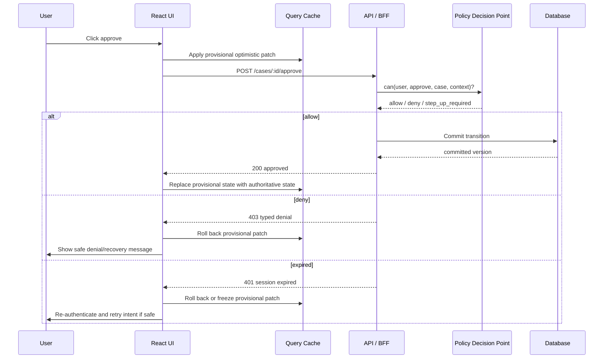
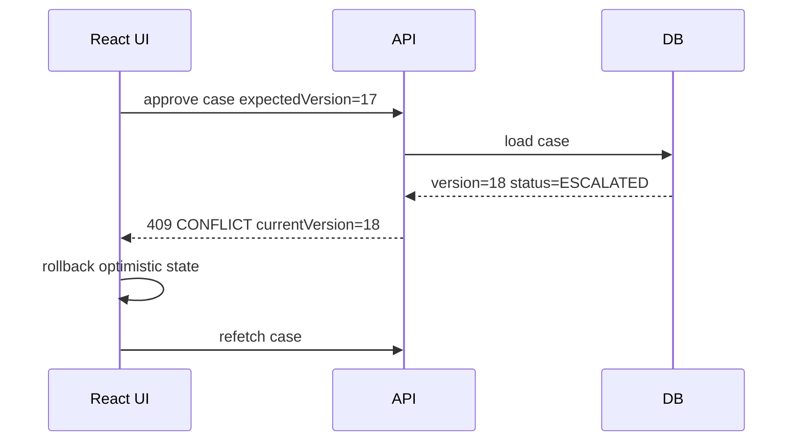
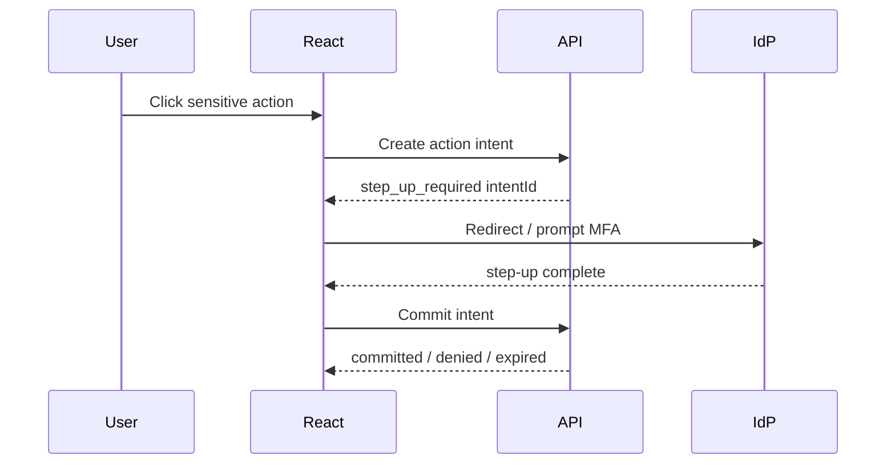
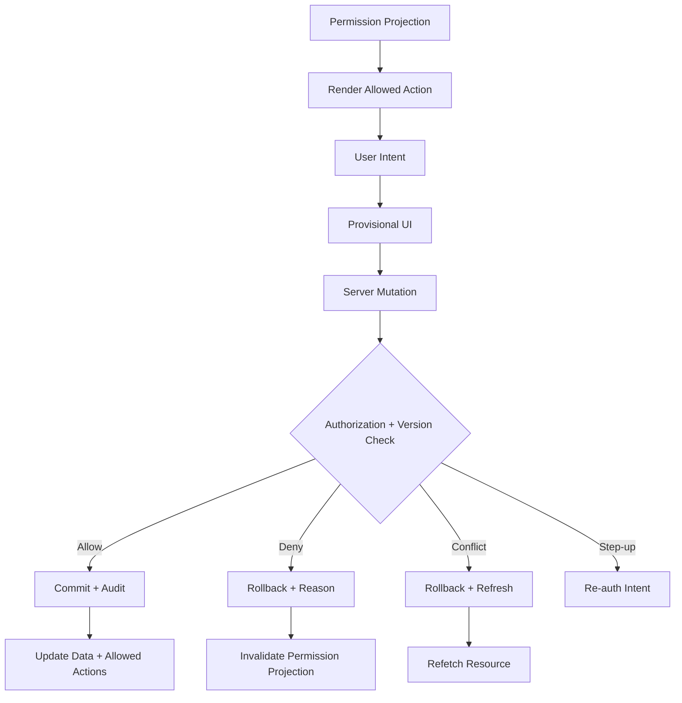

# Part 069 — Optimistic UI with Authorization

Optimistic UI is a lie told for speed.

In ordinary product engineering, that lie is acceptable when the server usually agrees.

In authorization-sensitive systems, the lie can become dangerous if the UI treats a predicted success as an actual permission decision.

The correct model is not:

```txt
user clicked button -> UI changes -> server catches up
```

The correct model is:

```txt
user expressed intent -> UI may show a provisional state -> server evaluates authorization + mutation -> UI reconciles with authoritative result
```

Optimistic UI is a latency-hiding technique.

Authorization is a safety boundary.

Do not confuse them.

---

## 1. The core problem

A user sees an action:

```txt
Approve case
Delete file
Assign investigator
Submit enforcement decision
Change tenant billing settings
Grant user access
Move document to restricted folder
```

The frontend has a permission projection saying:

```json
{
  "resource": "case:CAS-1001",
  "allowedActions": ["case.approve"]
}
```

The user clicks.

The UI optimistically changes from:

```txt
status = Pending Approval
```

to:

```txt
status = Approved
```

But between permission projection and mutation commit, any of these may happen:

```txt
role revoked
case state changed
approval deadline expired
tenant switched
object ACL changed
session expired
step-up authentication required
separation-of-duties check failed
record locked by another reviewer
server-side validation failed
policy version changed
```

If the UI treats the optimistic state as committed, the user sees an impossible world.

In low-risk CRUD, this is annoying.

In regulated workflows, money movement, access management, or enforcement lifecycle systems, this can become an audit, compliance, or integrity failure.

---

## 2. Optimistic UI is not optimistic authorization

There are two separate predictions:

```txt
Prediction A: the mutation will succeed technically.
Prediction B: the user is authorized to perform the mutation.
```

Do not merge them.

A good optimistic UI may predict visual state.

It must not predict final authorization.



The server decision is still the source of truth.

The optimistic patch is only a temporary rendering layer.

---

## 3. The invariant

Use this invariant in code review:

> An optimistic mutation may change local presentation before the server responds, but it must not create durable user belief, durable cache state, downstream side effects, or follow-up actions that assume authorization succeeded.

That means:

```txt
Allowed:
- show row as pending
- disable duplicate submit
- show temporary spinner
- update local counter provisionally
- render provisional item with "syncing" status
- rollback on failure

Not allowed:
- unlock a protected screen based only on optimistic success
- navigate to an admin-only page before server confirmation
- enqueue additional privileged actions from provisional state
- write optimistic permission grants into durable cache
- persist optimistic mutation across logout without revalidation
- mark workflow as complete before server commit
```

Optimistic UI may improve perceived latency.

It must not weaken authorization.

---

## 4. Decision framework: should this action be optimistic?

Do not make every mutation optimistic.

Use a risk matrix.

| Mutation class | Example | Optimistic? | Why |
|---|---|---:|---|
| Local preference | Toggle theme | Yes | Low risk, user-scoped, easy rollback. |
| Draft editing | Rename draft note | Usually | Low/medium risk if versioned. |
| Comment creation | Add internal comment | Maybe | Depends on moderation, ACL, audit. |
| Case workflow transition | Approve/reject/escalate case | Usually no | Legal/audit meaning; server state matters. |
| Permission grant | Add user as admin | No | Access expansion must be server-confirmed. |
| Money/billing/security action | Transfer funds, rotate key | No | High impact and often step-up protected. |
| File deletion | Delete evidence file | No or soft optimistic | Dangerous; prefer pending deletion state. |
| Bulk mutation | Close 200 cases | No direct optimism | Need preview/result reconciliation. |

A safe default:

```txt
Optimistic by default for low-risk personal UI state.
Pessimistic by default for authorization-sensitive domain state.
```

The more a mutation affects other users, permissions, audit, money, legal state, or irreversible resources, the less optimistic it should be.

---

## 5. Optimistic UI states

A poor optimistic UI has two states:

```txt
before
success-looking-after
```

A production optimistic UI needs at least these states:

```ts
export type MutationVisualState =
  | { kind: 'idle' }
  | { kind: 'provisional'; mutationId: string; startedAt: string }
  | { kind: 'committed'; version: number }
  | { kind: 'rolled_back'; reason: string }
  | { kind: 'rejected'; reasonCode: string; correlationId?: string }
  | { kind: 'requires_reauth'; returnIntentId: string }
  | { kind: 'conflicted'; serverVersion: number };
```

The key word is **provisional**.

Do not call it `success` until the server says so.

Bad copy:

```txt
Approved
```

Better copy:

```txt
Approving...
```

or:

```txt
Approval pending confirmation
```

For high-risk actions, use no optimistic domain state at all:

```txt
Submitting approval...
```

then after response:

```txt
Approved
```

---

## 6. Permission projection is a hint, not an authority

By the time a user clicks, the permission projection may be stale.

```txt
T1: /cases/1001 returns allowedActions = [approve]
T2: another reviewer approves the case
T3: current user clicks Approve
T4: server rejects because case is already approved
```

The frontend did nothing wrong by showing the button at `T1`.

It becomes wrong only if it refuses to reconcile at `T4`.

Authorization-sensitive optimistic UI must be built around **reconciliation**.

```txt
Local projection says: likely allowed.
Server says: authoritative result.
```

---

## 7. A safer mutation response contract

Do not return only:

```json
{ "ok": false }
```

Use typed failure.

```ts
export type MutationResult<T> =
  | {
      ok: true;
      data: T;
      resourceVersion: number;
      permissionEpoch: number;
      committedAt: string;
    }
  | {
      ok: false;
      error:
        | {
            kind: 'UNAUTHENTICATED';
            code: 'SESSION_EXPIRED' | 'LOGIN_REQUIRED';
            retryable: true;
          }
        | {
            kind: 'FORBIDDEN';
            code:
              | 'MISSING_PERMISSION'
              | 'TENANT_MISMATCH'
              | 'POLICY_CHANGED'
              | 'SEPARATION_OF_DUTIES'
              | 'RESOURCE_STATE_FORBIDS_ACTION';
            publicMessage: string;
            correlationId: string;
          }
        | {
            kind: 'STEP_UP_REQUIRED';
            assuranceLevel: 'aal2' | 'aal3';
            intentId: string;
          }
        | {
            kind: 'CONFLICT';
            serverVersion: number;
            currentStateUrl: string;
          };
    };
```

This lets the frontend choose the right recovery:

```txt
401 -> session recovery
403 -> rollback + explain/request access
step-up -> rollback or freeze intent + re-auth
409 -> rollback + refresh current server state
422 -> rollback field-level validation
429 -> rollback or keep pending retry depending on idempotency
5xx -> rollback or retry with explicit policy
```

---

## 8. TanStack Query optimistic mutation pattern

TanStack Query supports optimistic updates by applying a local patch in `onMutate`, then rolling back in `onError` or reconciling in `onSettled`.

For auth-sensitive mutations, do not hide the rollback logic inside generic utilities.

Make the authorization outcome explicit.

```ts
import { useMutation, useQueryClient } from '@tanstack/react-query';

type Case = {
  id: string;
  status: 'DRAFT' | 'PENDING_APPROVAL' | 'APPROVED' | 'REJECTED';
  version: number;
  allowedActions: string[];
};

type ApproveCaseInput = {
  caseId: string;
  expectedVersion: number;
  idempotencyKey: string;
};

type RollbackContext = {
  previousCase?: Case;
  queryKey: readonly unknown[];
};

async function approveCase(input: ApproveCaseInput): Promise<Case> {
  const response = await fetch(`/api/cases/${input.caseId}/approve`, {
    method: 'POST',
    headers: {
      'Content-Type': 'application/json',
      'Idempotency-Key': input.idempotencyKey,
    },
    credentials: 'include',
    body: JSON.stringify({ expectedVersion: input.expectedVersion }),
  });

  if (!response.ok) {
    const problem = await response.json().catch(() => null);
    throw new AuthAwareMutationError(response.status, problem);
  }

  return response.json();
}

export function useApproveCase(caseId: string) {
  const queryClient = useQueryClient();
  const queryKey = ['case', caseId] as const;

  return useMutation<Case, AuthAwareMutationError, ApproveCaseInput, RollbackContext>({
    mutationFn: approveCase,

    onMutate: async (input) => {
      await queryClient.cancelQueries({ queryKey });

      const previousCase = queryClient.getQueryData<Case>(queryKey);

      if (previousCase) {
        queryClient.setQueryData<Case>(queryKey, {
          ...previousCase,
          status: 'APPROVED',
          // Critical: this is a UI marker, not server state.
          allowedActions: [],
          version: previousCase.version,
          optimistic: true as never,
        });
      }

      return { previousCase, queryKey };
    },

    onError: (error, _input, context) => {
      if (context?.previousCase) {
        queryClient.setQueryData(context.queryKey, context.previousCase);
      }

      if (error.status === 401) {
        authEvents.emit({ type: 'session-expired' });
        return;
      }

      if (error.status === 403) {
        permissionEvents.emit({
          type: 'mutation-denied',
          reason: error.problem?.code ?? 'FORBIDDEN',
          correlationId: error.problem?.correlationId,
        });
        return;
      }

      if (error.status === 409) {
        queryClient.invalidateQueries({ queryKey });
      }
    },

    onSuccess: (serverCase) => {
      queryClient.setQueryData(queryKey, serverCase);
    },

    onSettled: () => {
      queryClient.invalidateQueries({ queryKey });
    },
  });
}
```

This pattern has four important properties:

```txt
1. It captures previous state before optimistic patch.
2. It marks the optimistic state as provisional.
3. It rolls back typed authorization failures.
4. It reconciles with server state after commit.
```

Do not use optimistic UI if you cannot roll back cleanly.

---

## 9. Prefer provisional overlays over destructive optimistic patches

For high-risk resources, do not mutate the domain object optimistically.

Instead, overlay pending intent.

```ts
type CaseViewModel = {
  id: string;
  status: 'PENDING_APPROVAL' | 'APPROVED' | 'REJECTED';
  pendingIntent?:
    | { kind: 'approve'; mutationId: string; startedAt: string }
    | { kind: 'reject'; mutationId: string; startedAt: string };
};
```

UI:

```tsx
function CaseStatusBadge({ caseVm }: { caseVm: CaseViewModel }) {
  if (caseVm.pendingIntent?.kind === 'approve') {
    return <Badge tone="pending">Approving...</Badge>;
  }

  return <Badge>{caseVm.status}</Badge>;
}
```

This avoids showing false committed state.

It also makes rollback visually natural:

```txt
Approving... -> Pending Approval
```

instead of:

```txt
Approved -> Pending Approval
```

The second version feels like the system changed its mind.

The first version feels like the system confirmed or denied an attempt.

---

## 10. Rollback semantics by error class

Not every failure should be handled the same way.

| Error | Meaning | UI recovery |
|---|---|---|
| `401 UNAUTHENTICATED` | No valid session/token | Roll back or freeze, start session recovery. |
| `403 FORBIDDEN` | User/session not allowed | Roll back, explain denial, invalidate permission projection. |
| `403 STEP_UP_REQUIRED` | User may be allowed after stronger auth | Freeze intent or roll back with re-auth CTA. |
| `404 NOT_FOUND` | Resource absent or intentionally hidden | Roll back, refresh list/detail. |
| `409 CONFLICT` | Version/workflow state changed | Roll back, refetch, show conflict. |
| `412 PRECONDITION_FAILED` | Expected version/etag mismatch | Roll back and refresh. |
| `422 VALIDATION_ERROR` | Request invalid | Roll back affected fields only. |
| `429 RATE_LIMITED` | Abuse/throttling/protection | Roll back or keep queued only if safe. |
| `5xx` | Server uncertainty | Roll back unless idempotent retry is explicitly safe. |

A common mistake is treating `403` as a generic network error.

That causes bad UX:

```txt
Something went wrong. Try again.
```

For authorization denial, retrying usually does not help.

Better:

```txt
You no longer have permission to approve this case. Refreshing permissions.
```

or:

```txt
This case can no longer be approved because its state changed.
```

---

## 11. Idempotency is mandatory for retryable optimistic mutations

If a mutation may be retried, it needs an idempotency key.

Without idempotency, this can happen:

```txt
T1: user clicks Approve
T2: frontend sends request
T3: server commits approval
T4: network drops before response reaches client
T5: frontend retries
T6: server processes duplicate approval or emits duplicate audit
```

Use:

```txt
Idempotency-Key: <stable-per-user-intent-id>
```

The server should store:

```txt
user/session/actor
tenant
resource
action
request hash
result
expiry
created_at
```

For security-sensitive actions, the idempotency key must not let another user replay someone else's operation.

Bind it to actor + tenant + action + resource.

---

## 12. Expected version prevents stale optimistic commits

Optimistic UI should usually send an expected resource version.

```http
POST /api/cases/CAS-1001/approve
Content-Type: application/json
Idempotency-Key: 8f7f...e22

{
  "expectedVersion": 17
}
```

Server rule:

```txt
if current.version != expectedVersion:
    return 409 CONFLICT
```

This prevents a user from approving based on stale UI.

It also makes conflict recovery deterministic.



---

## 13. Permission epoch prevents stale privilege illusion

Resource version is not enough.

The resource may be unchanged, but permission may have changed.

Use a permission epoch or policy version.

```json
{
  "subject": "user:123",
  "tenant": "org:acme",
  "permissionEpoch": 9241,
  "permissions": {
    "case:CAS-1001": ["case.approve", "case.comment"]
  }
}
```

On mutation:

```json
{
  "expectedResourceVersion": 17,
  "expectedPermissionEpoch": 9241
}
```

Server can choose:

```txt
If epoch stale but action still allowed -> commit and return new epoch.
If epoch stale and action denied -> 403 POLICY_CHANGED.
If epoch stale and unclear -> 409/428 requiring refresh.
```

This helps the frontend explain denial:

```txt
Your permissions changed. We refreshed this page.
```

---

## 14. Bulk optimistic UI is usually a trap

Bulk actions create mixed outcomes.

Example:

```txt
Approve 100 cases
```

At selection time:

```txt
80 allowed
10 missing permission
5 already approved
3 locked
2 require step-up
```

A naive optimistic UI marks all 100 as approved.

That is wrong.

Better model:

```txt
1. Preview eligibility.
2. Confirm action scope.
3. Submit bulk operation.
4. Show operation progress.
5. Reconcile per-item result.
```

Response:

```ts
type BulkApproveResult = {
  operationId: string;
  summary: {
    requested: number;
    approved: number;
    denied: number;
    conflicted: number;
    failed: number;
  };
  items: Array<
    | { caseId: string; status: 'APPROVED'; version: number }
    | { caseId: string; status: 'DENIED'; reasonCode: string }
    | { caseId: string; status: 'CONFLICT'; currentVersion: number }
  >;
};
```

For bulk operations, prefer **operation progress UI** over row-level optimistic mutation.

```txt
Submitting bulk approval...
23 / 100 processed
17 approved
3 denied
3 conflicted
```

---

## 15. Do not optimistically grant permissions

Never optimistically expand access.

Bad:

```txt
Admin clicks "Make Jane Owner"
UI immediately shows Jane as Owner everywhere
```

Why bad:

```txt
- grant may fail policy
- separation of duties may block it
- target user may be outside tenant
- role may require approval
- group sync may be delayed
- grant may require audit/expiry
```

Safer:

```txt
Granting owner access...
```

Then:

```txt
Jane is now Owner
```

or:

```txt
Owner access requires approval
```

Access expansion is security-sensitive. Treat it as server-confirmed only.

---

## 16. Do not optimistically hide audit-critical actions

Optimistic UI often removes buttons after click.

```txt
Approve button disappears
```

That is fine only if the pending state is visible.

Bad:

```txt
button disappears, no trace
```

Better:

```txt
Approve button disabled
Status: Approval pending confirmation
Cancel? only if server supports cancellation
```

For regulated workflows, the UI should preserve the fact that an intent was submitted.

```ts
type PendingIntent = {
  id: string;
  action: 'case.approve';
  resourceId: string;
  actorId: string;
  submittedAt: string;
  status: 'submitting' | 'committed' | 'denied' | 'conflicted' | 'unknown';
  correlationId?: string;
};
```

This makes support and audit easier.

---

## 17. Offline queued optimistic mutations need reauthorization

Offline optimistic mutations are especially risky.

At offline time:

```txt
user seems allowed
```

At sync time:

```txt
permission may be revoked
session may expire
tenant membership may change
resource may move state
policy may change
```

So the sync algorithm must be:

```txt
1. Keep offline mutation as local intent, not committed state.
2. On reconnect, re-authenticate if needed.
3. Revalidate tenant/session/permission/resource version.
4. Submit with idempotency key.
5. Reconcile authoritative response.
```

Never design offline sync as:

```txt
Queue authorized mutation now -> blindly replay later
```

The queued item is not an authorization decision.

It is only intent.

Part 070 will go deeper into offline/degraded auth.

---

## 18. Step-up authentication and optimistic UI

Sensitive actions may require stronger authentication.

Examples:

```txt
grant admin role
export evidence
approve enforcement penalty
change payout destination
view sealed document
```

If server returns:

```json
{
  "kind": "STEP_UP_REQUIRED",
  "intentId": "intent_123",
  "requiredAssurance": "aal2"
}
```

The UI should not show committed state.

Options:

```txt
Option A: Roll back and show re-auth CTA.
Option B: Freeze pending intent while user completes step-up.
```

For critical actions, prefer explicit step-up before mutation:

```txt
Click approve -> server creates intent -> step-up -> server commits intent
```

Flow:



This avoids pretending the action happened before assurance is met.

---

## 19. Optimistic UI and tenant switch

Tenant switch invalidates optimistic assumptions.

Imagine:

```txt
T1: user is in Tenant A
T2: user submits optimistic mutation
T3: before response, user switches to Tenant B
T4: response from Tenant A returns
```

If the frontend blindly writes the response into current cache, Tenant B UI may show Tenant A data.

Every mutation context should include:

```ts
type MutationContext = {
  tenantId: string;
  authEpoch: number;
  permissionEpoch: number;
  resourceVersion?: number;
};
```

When response arrives:

```ts
function shouldApplyMutationResult(current: AuthContext, mutation: MutationContext) {
  return (
    current.tenantId === mutation.tenantId &&
    current.authEpoch === mutation.authEpoch
  );
}
```

If context differs:

```txt
Do not apply result into current visible cache.
Invalidate old tenant cache if needed.
Log stale response suppression.
```

---

## 20. Optimistic UI with server-generated side effects

Some mutations have side effects:

```txt
send email
emit notification
create audit log
start workflow timer
publish websocket event
generate document
trigger billing update
```

Never represent those as complete until server confirms.

Instead:

```txt
Request submitted
Notification will be sent after confirmation
```

or:

```txt
Generating export...
```

For server-generated artifacts, optimistic UI should create **placeholder state**, not final artifact state.

```ts
type ExportRow =
  | { kind: 'pending'; operationId: string }
  | { kind: 'ready'; fileId: string; downloadUrl: string; expiresAt: string }
  | { kind: 'denied'; reasonCode: string };
```

---

## 21. Optimistic permission invalidation

On denial, invalidate both data and permission projection.

```ts
function handleForbidden(problem: ForbiddenProblem, queryClient: QueryClient) {
  queryClient.invalidateQueries({ queryKey: ['session'] });
  queryClient.invalidateQueries({ queryKey: ['permissions'] });

  if (problem.resourceId) {
    queryClient.invalidateQueries({ queryKey: ['resource', problem.resourceType, problem.resourceId] });
  }
}
```

Why?

Because `403` may mean:

```txt
button projection stale
role changed
object state changed
tenant membership changed
policy changed
```

If the UI rolls back but leaves stale permission cache, the same forbidden button remains clickable.

That creates repeated denial loops.

---

## 22. Avoid optimistic navigation into protected routes

Bad:

```txt
Create case -> optimistically navigate to /cases/temp-id/admin
```

Better:

```txt
Create case -> show pending shell -> navigate only after server returns resource id and allowed actions
```

For create operations, the server may decide:

```txt
created but user cannot view due to assignment rule
created in different workflow state
created but requires supervisor review
create denied due to quota/policy
create accepted asynchronously
```

Use server response to decide next route.

```ts
type CreateCaseResponse =
  | {
      ok: true;
      caseId: string;
      nextRoute: string;
      allowedActions: string[];
    }
  | {
      ok: false;
      reasonCode: string;
    };
```

Do not derive destination from local assumptions.

---

## 23. UI copy matters

Auth-sensitive optimistic UI should avoid final-language verbs until commit.

| Bad | Better |
|---|---|
| `Approved` | `Approving...` |
| `Deleted` | `Deleting...` |
| `Access granted` | `Granting access...` |
| `Case closed` | `Closing case...` |
| `Export ready` | `Preparing export...` |

When denied:

```txt
Approval was not applied. This case changed or you no longer have permission.
```

When session expired:

```txt
Your session expired before the action was confirmed. Sign in again to continue.
```

When conflicted:

```txt
This case changed while you were reviewing it. We refreshed the latest version.
```

Avoid:

```txt
Oops
Something went wrong
Error
```

Authorization failures need actionable explanation.

---

## 24. Optimistic UI and audit events

Frontend should not emit authoritative audit events like:

```txt
case.approved
permission.granted
file.deleted
```

before server commit.

It may emit UI telemetry:

```txt
case.approve.clicked
case.approve.optimistic_started
case.approve.rollback
case.approve.denied_visible
```

Server emits authoritative audit:

```txt
case.approve.committed
case.approve.denied
case.approve.step_up_required
```

Keep telemetry and audit separate.

Telemetry tells product/system behavior.

Audit tells authoritative security/domain events.

---

## 25. Optimistic UI testing matrix

Test these cases for every auth-sensitive optimistic mutation:

```txt
allowed -> committed
allowed -> network timeout after commit -> idempotent retry returns committed result
allowed projection stale -> 403 rollback
resource state stale -> 409 rollback/refetch
session expired -> rollback/session recovery
permission revoked while request in flight -> rollback + permission invalidation
tenant switched while request in flight -> suppress stale response
logout while request in flight -> abort or ignore response
step-up required -> no committed UI before step-up
bulk operation mixed results -> per-item reconciliation
server returns new allowedActions -> update UI actions
```

A useful fake API behavior:

```ts
server.post('/api/cases/:id/approve', async ({ params, request }) => {
  const scenario = request.headers.get('X-Test-Scenario');

  if (scenario === 'forbidden') {
    return HttpResponse.json(
      {
        type: 'https://example.com/problems/forbidden',
        code: 'RESOURCE_STATE_FORBIDS_ACTION',
        publicMessage: 'This case can no longer be approved.',
        correlationId: 'corr_test_1',
      },
      { status: 403 }
    );
  }

  if (scenario === 'conflict') {
    return HttpResponse.json(
      {
        code: 'VERSION_CONFLICT',
        serverVersion: 18,
      },
      { status: 409 }
    );
  }

  return HttpResponse.json({
    id: params.id,
    status: 'APPROVED',
    version: 18,
    allowedActions: ['case.comment'],
  });
});
```

---

## 26. Checklist

Before allowing optimistic UI for a mutation, answer:

```txt
Is the mutation low-risk enough to show provisional state?
Can the state be rolled back cleanly?
Is there an idempotency key?
Is there an expected resource version or ETag?
Is there a permission epoch or equivalent invalidation strategy?
Are 401, 403, 409, 412, 422, 429, and 5xx handled differently?
Does the UI avoid final success language before server confirmation?
Does denial invalidate permission projection?
Does tenant switch suppress stale response?
Does logout cancel or ignore in-flight mutation?
Does server enforce authorization independently?
Does audit event come from server commit, not optimistic UI?
```

If the answer is no, use pessimistic UI.

---

## 27. Anti-pattern catalog

### Anti-pattern 1: optimistic admin grant

```txt
Click "Make admin" -> UI immediately shows user as admin
```

Fix:

```txt
Show "Granting admin access..." until server confirms.
```

### Anti-pattern 2: stale permission retry loop

```txt
403 -> rollback -> button still visible -> user clicks again -> 403
```

Fix:

```txt
Invalidate permissions and resource after authorization denial.
```

### Anti-pattern 3: optimistic route unlock

```txt
User submits request -> UI navigates to protected route before server confirms.
```

Fix:

```txt
Navigate based on server-confirmed next route.
```

### Anti-pattern 4: hidden rollback

```txt
UI silently reverts without explanation.
```

Fix:

```txt
Show typed denial/conflict/session recovery message.
```

### Anti-pattern 5: generic retry for 403

```txt
403 treated as retryable network error.
```

Fix:

```txt
403 is usually policy denial. Roll back, explain, refresh permission projection.
```

---

## 28. Production reference pattern

Use three layers:

```txt
Layer 1: Permission projection
- controls button/menu visibility
- deny-by-default when unknown
- refreshed on epoch change

Layer 2: Optimistic visual intent
- provisional only
- rollback-capable
- bound to tenant/auth epoch/resource version

Layer 3: Server authorization + commit
- authoritative decision
- emits audit
- returns updated resource + allowedActions
```



This gives you latency hiding without lying about authorization.

---

## 29. Final mental model

Optimistic UI should answer:

> What should the user see while the system is deciding?

Authorization should answer:

> Is this actor allowed to perform this action on this resource in this context now?

Those are different questions.

The top 1% engineering habit is to keep them different in code.

---

## References

- TanStack Query — Optimistic Updates: https://tanstack.com/query/v5/docs/framework/react/guides/optimistic-updates
- TanStack Query — Query Cancellation: https://tanstack.com/query/v5/docs/framework/react/guides/query-cancellation
- OWASP Authorization Cheat Sheet: https://cheatsheetseries.owasp.org/cheatsheets/Authorization_Cheat_Sheet.html
- OWASP API Security Top 10 2023 — Broken Object Level Authorization: https://owasp.org/API-Security/editions/2023/en/0xa1-broken-object-level-authorization/
- MDN — AbortController: https://developer.mozilla.org/en-US/docs/Web/API/AbortController
- RFC 9110 — HTTP Semantics: https://www.rfc-editor.org/rfc/rfc9110
