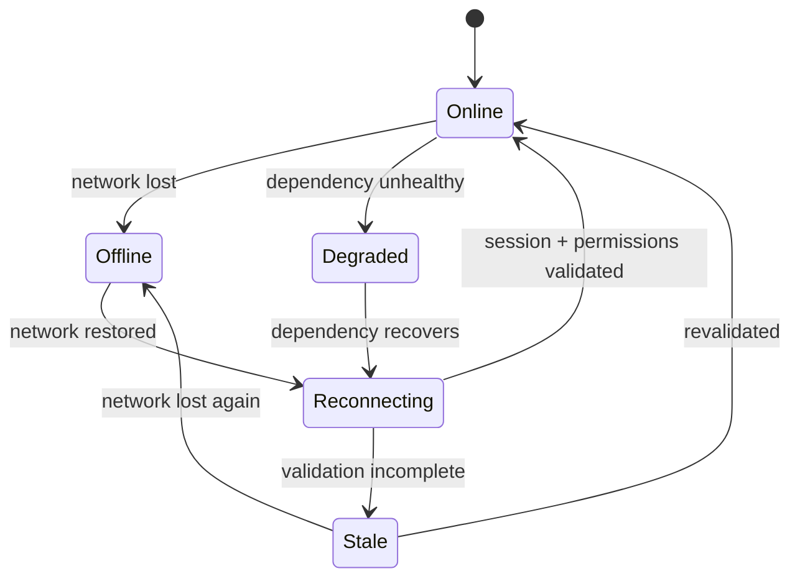
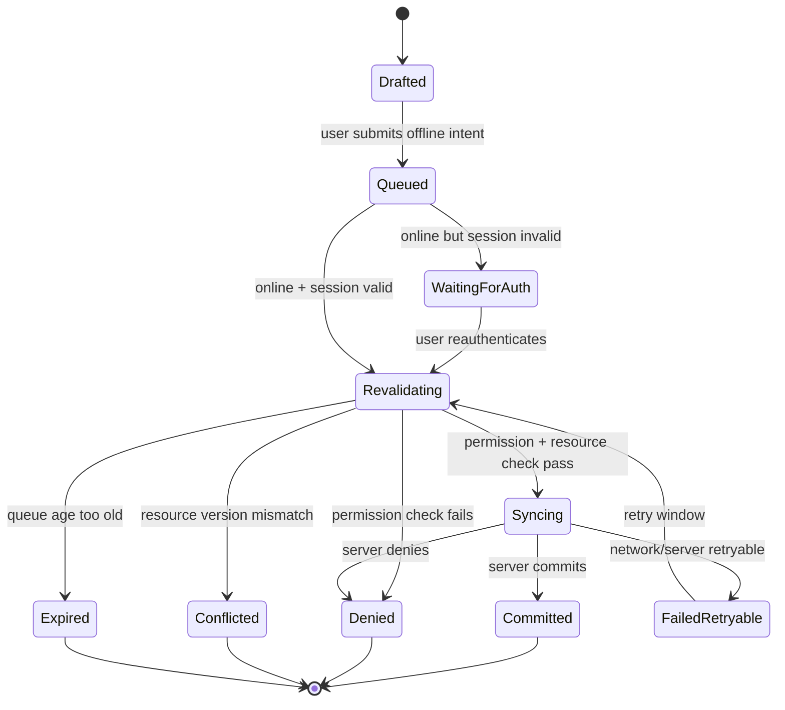
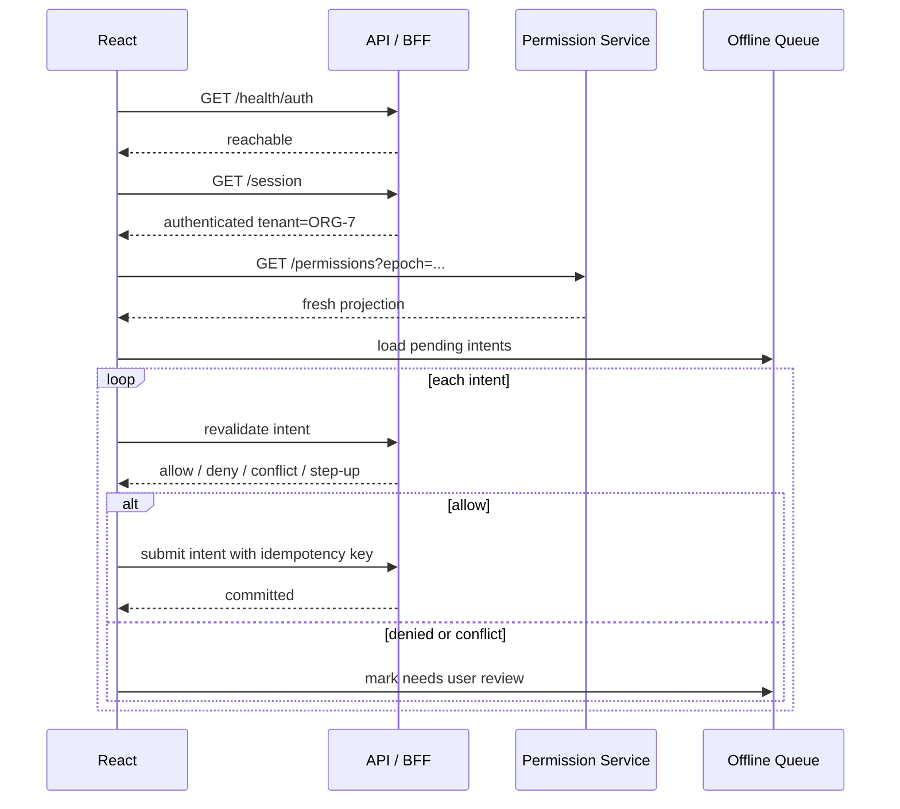

# Part 070 — Offline and Degraded Auth

Offline auth is where many frontend security models quietly collapse.

When the network is gone, the app still has:

```txt
old UI
old data
old permissions
old session projection
old feature flags
old tenant context
old service worker cache
old query cache
pending user intent
```

But it no longer has reliable access to:

```txt
current session validity
current permission decision
current resource state
current policy version
current revocation state
current tenant membership
current MFA/step-up freshness
```

That mismatch creates the central problem:

> Offline state can remember what used to be true, but authorization asks what is true now.

The safest default is simple:

```txt
Offline reads may be allowed only from explicitly safe cached data.
Offline writes must be treated as local intent and reauthorized before sync.
```

---

## 1. Vocabulary: offline, degraded, disconnected

Use precise language.

| State | Meaning | Example |
|---|---|---|
| Online | Network and auth dependencies healthy | API, IdP, policy service reachable. |
| Offline | Browser cannot reach network/API | Airplane mode, no connection. |
| Degraded | Network exists but dependency is unhealthy | IdP down, policy engine slow, API partial outage. |
| Captive/uncertain | Browser thinks online but app cannot reach API | Hotel Wi-Fi login page, DNS issue. |
| Stale | App has cached data but cannot validate freshness | Old permissions/query cache. |
| Reconnecting | Network returns and app is reconciling state | Sync queue, refetch, session restore. |

Do not reduce this to:

```ts
if (navigator.onLine) { ... }
```

`navigator.onLine` is a weak signal. Browsers implement it differently, and `true` does not prove your API, IdP, or policy engine is reachable.

Use active health checks for application dependencies.

---

## 2. Offline auth state machine

A production app should model offline/degraded auth explicitly.

```ts
export type AuthConnectivityState =
  | { kind: 'online'; checkedAt: string }
  | { kind: 'offline'; detectedAt: string }
  | { kind: 'degraded'; dependency: 'api' | 'idp' | 'policy' | 'storage'; detectedAt: string }
  | { kind: 'reconnecting'; startedAt: string }
  | { kind: 'stale'; reason: 'permission_ttl_expired' | 'session_unknown' | 'tenant_unknown' };
```

Do not pretend that offline is only a network banner.

Offline changes what actions are safe.



---

## 3. The offline authorization invariant

Use this invariant:

> A cached permission may support UI explanation, but it must not authorize a new protected side effect while offline.

That means:

```txt
Allowed:
- show cached case detail if policy allows offline read cache
- show last-known allowed actions as stale/disabled
- let user draft comments locally
- let user prepare forms locally
- queue intent for later reauthorization

Not allowed:
- commit approval offline
- grant access offline
- delete object offline
- export sensitive data from stale cache without policy
- replay queued protected mutation without session + permission revalidation
- treat old role claim as current authority
```

Offline UI is allowed to preserve work.

It is not allowed to bypass policy.

---

## 4. Classify offline actions

Every product action should have an offline classification.

| Class | Example | Offline behavior |
|---|---|---|
| Safe local preference | Theme, table density | Apply locally. Sync later if needed. |
| Draft-only domain data | Draft note, unsent form | Save locally as draft. No server side effect. |
| Cached read | View downloaded case summary | Allowed only if cache policy permits. Show stale marker. |
| Protected mutation | Approve, reject, delete, assign | Queue intent only; reauthorize before sync. |
| Access expansion | Grant role, share file | Usually blocked offline. |
| Sensitive export | Download evidence, export report | Usually blocked offline unless pre-authorized artifact exists. |
| Step-up action | High-risk workflow transition | Block or require online step-up. |

Do this classification at design time.

If the team does not define offline semantics, the frontend will accidentally invent them.

---

## 5. Cached read model

Cached reads can be acceptable when explicitly designed.

A cached read should carry metadata:

```ts
type CachedResource<T> = {
  data: T;
  resourceId: string;
  tenantId: string;
  fetchedAt: string;
  resourceVersion: number;
  permissionEpoch: number;
  cachePolicy: {
    offlineReadable: boolean;
    maxStaleSeconds: number;
    containsSensitiveData: boolean;
    requireDeviceProtection?: boolean;
  };
};
```

Render logic:

```tsx
function CachedCaseView({ cached }: { cached: CachedResource<CaseDto> }) {
  if (!cached.cachePolicy.offlineReadable) {
    return <UnavailableOffline reason="This case cannot be viewed offline." />;
  }

  if (isTooStale(cached)) {
    return <UnavailableOffline reason="This cached case is too old to display." />;
  }

  return (
    <StaleDataFrame fetchedAt={cached.fetchedAt}>
      <CaseDetail data={cached.data} mode="offline-readonly" />
    </StaleDataFrame>
  );
}
```

Do not show sensitive cached data just because it exists.

Existence in cache is not permission.

---

## 6. Permission TTL

Permissions should have freshness constraints.

```ts
type PermissionSnapshot = {
  subjectId: string;
  tenantId: string;
  epoch: number;
  issuedAt: string;
  expiresAt: string;
  offlineUsableUntil?: string;
  decisions: Record<string, string[]>;
};
```

`expiresAt` answers:

```txt
When should online app refresh this projection?
```

`offlineUsableUntil` answers:

```txt
How long may the app use this projection for offline UI display?
```

For many systems:

```txt
offlineUsableUntil = none
```

Meaning:

```txt
Permissions cannot be used to enable protected actions offline.
```

That is normal.

Offline support should be deliberate, not accidental.

---

## 7. Queued writes are not queued authorizations

This is the main rule.

Bad model:

```txt
User was allowed when offline queue item was created.
Therefore replay item later.
```

Correct model:

```txt
User created intent while offline.
When online, authenticate, revalidate permission, revalidate resource version, then submit.
```

Queued item:

```ts
type OfflineIntent = {
  intentId: string;
  actorId: string;
  tenantId: string;
  action: string;
  resourceType: string;
  resourceId?: string;
  payload: unknown;
  createdAt: string;
  createdFrom: {
    resourceVersion?: number;
    permissionEpoch?: number;
    route: string;
  };
  idempotencyKey: string;
  syncPolicy: {
    requiresOnlineReauth: boolean;
    requiresPermissionRecheck: boolean;
    requiresResourceVersionCheck: boolean;
    maxQueueAgeSeconds: number;
  };
};
```

Sync algorithm:

```txt
for each intent:
  if session invalid -> pause and request login
  if tenant mismatch -> pause or discard with user confirmation
  if queue age expired -> mark expired
  if permission recheck fails -> mark denied
  if resource version conflict -> mark conflicted
  submit with idempotency key
  reconcile result
```

The queue stores intent, not authority.

---

## 8. Offline queue state machine



The dangerous shortcut is:

```txt
Queued -> Syncing
```

without revalidation.

Do not do that for protected mutations.

---

## 9. Service worker threat model

A service worker can intercept requests, serve cached responses, and perform background work.

That is powerful.

It also means a bad service worker strategy can bypass the app's current auth assumptions.

Problems:

```txt
serves stale authenticated response after logout
replays queued mutation after permission revocation
caches sensitive API responses accidentally
mixes tenant data in cache keys
continues background sync after session expiry
returns cache-first data for authorization-sensitive endpoint
```

Use explicit cache strategy per endpoint:

| Endpoint | Service worker strategy |
|---|---|
| `/assets/*` | Cache-first or stale-while-revalidate. |
| `/api/session` | Network-only, no-store. |
| `/api/permissions` | Network-only or short TTL with auth epoch. |
| `/api/cases/:id` | Network-first only if offline policy allows cached read. |
| `/api/cases/:id/approve` | Never cache. Never replay without revalidation. |
| `/api/files/:id/download` | Usually network-only / signed URL policy. |

Do not let generic PWA caching touch authenticated APIs by default.

---

## 10. Background Sync risk

Background Sync can defer work to a service worker and retry later.

This is useful for low-risk operations.

It is risky for protected mutations.

For auth-sensitive sync, require:

```txt
idempotency key
queue age limit
session revalidation
permission revalidation
resource version check
tenant check
explicit per-action allowlist
safe user-visible reconciliation
```

Do not register generic background sync like:

```txt
sync all failed POST requests
```

That turns every failed mutation into a future side effect.

Instead:

```ts
type SyncableActionPolicy = {
  action: string;
  syncAllowed: boolean;
  requiresForegroundConfirmation: boolean;
  requiresStepUp: boolean;
};
```

For high-risk actions:

```txt
requiresForegroundConfirmation = true
```

Meaning the user must return online and confirm after fresh authorization.

---

## 11. Auth dependency degradation

Offline is not the only failure mode.

Your app may be online while auth dependencies are degraded.

Examples:

```txt
Identity provider login endpoint down
policy service latency high
permission projection endpoint returns 503
session introspection slow
OIDC JWKS endpoint unreachable
BFF session store degraded
```

Do not respond by allowing everything.

Use fail modes:

| Dependency | Failure | Safe mode |
|---|---|---|
| IdP login | Cannot start new login | Existing sessions may continue if locally/server valid; new login unavailable. |
| Session store | Cannot validate session | Fail closed for protected APIs. |
| Policy engine | Cannot evaluate permission | Fail closed for protected mutation; maybe cached read-only if explicit. |
| Permission projection API | Cannot refresh UI permissions | Show stale/disabled actions; do not unlock new actions. |
| Audit pipeline | Cannot write audit | For critical mutation, fail closed or durable local/server queue. |
| Notification service | Down | Commit may continue only if notification is non-critical. |

A degraded auth system should have explicit business policy.

For regulated systems, many critical actions should fail closed if audit or policy decision cannot be guaranteed.

---

## 12. Degraded UI modes

Use user-visible modes.

```ts
type DegradedMode =
  | { kind: 'read_only'; reason: 'offline' | 'policy_unavailable' }
  | { kind: 'limited_write'; allowedLocalDrafts: string[] }
  | { kind: 'login_unavailable'; existingSessionUsable: boolean }
  | { kind: 'sync_required'; pendingIntentCount: number }
  | { kind: 'blocked'; reason: string };
```

Render:

```tsx
function DegradedBanner({ mode }: { mode: DegradedMode }) {
  switch (mode.kind) {
    case 'read_only':
      return <Banner tone="warning">Read-only mode. Actions are disabled until access can be verified.</Banner>;
    case 'login_unavailable':
      return <Banner tone="critical">Sign-in is temporarily unavailable.</Banner>;
    case 'sync_required':
      return <Banner tone="info">{mode.pendingIntentCount} offline changes need review before sync.</Banner>;
    default:
      return null;
  }
}
```

Avoid saying:

```txt
You are offline, but keep working as normal.
```

That is rarely true for authorization-sensitive apps.

---

## 13. Offline form strategy

For forms, separate **draft** from **submit**.

Offline allowed:

```txt
fill form locally
save draft locally
attach local-only pending file reference
validate simple client constraints
```

Online required:

```txt
server validation
authorization
workflow transition
file upload finalization
submission audit
case state change
notifications
```

Draft schema:

```ts
type OfflineDraft<T> = {
  draftId: string;
  tenantId: string;
  resourceId?: string;
  formType: string;
  data: T;
  createdAt: string;
  updatedAt: string;
  baseResourceVersion?: number;
  containsSensitiveData: boolean;
  encryptionStatus: 'none' | 'device' | 'app-managed';
};
```

Submit button behavior:

```txt
Offline: Save draft only
Online: Submit to server after fresh auth/permission/resource checks
```

This preserves user work without pretending the domain mutation occurred.

---

## 14. Offline sensitive data storage

Do not store sensitive data offline by default.

Questions before caching sensitive authenticated data:

```txt
Is offline read required by product?
Is the data PII, evidence, financial, regulated, or legally sensitive?
Should this be encrypted at rest?
Can the user revoke device access?
Can remote logout clear it?
Can logout clear service worker/cache/indexeddb?
Can data expire automatically?
Can another OS user access the browser profile?
Is session replay/analytics excluded from this data?
```

Browser storage is not a secure vault.

Offline sensitive data needs its own risk acceptance.

---

## 15. Tenant isolation in offline cache

Offline cache must be tenant-scoped.

Bad key:

```txt
case:CAS-1001
```

Better:

```txt
tenant:ORG-7:case:CAS-1001:version:17
```

Cache metadata:

```ts
type TenantScopedCacheEntry<T> = {
  tenantId: string;
  subjectId: string;
  authEpoch: number;
  permissionEpoch: number;
  resourceKey: string;
  data: T;
};
```

On tenant switch:

```txt
hide previous tenant offline cache
cancel previous tenant queue processing
revalidate session membership
clear visible query cache
```

Never show cached tenant A data while tenant B is active.

---

## 16. Reconnect reconciliation

Reconnect is a protocol.

Do not simply refetch everything and hope.

Use a staged process:

```txt
1. Detect API reachability.
2. Restore/validate session.
3. Validate tenant membership.
4. Refresh permission projection.
5. Refresh critical resource versions.
6. Reconcile cached reads.
7. Revalidate offline intents.
8. Sync allowed intents.
9. Resolve conflicts.
10. Clear expired/denied intents.
```



Reconnect is not just network recovery.

It is security state recovery.

---

## 17. Conflict resolution

Offline work often conflicts with server state.

Example:

```txt
User edits enforcement recommendation offline based on version 12.
Supervisor modifies recommendation online to version 13.
User reconnects and submits version 12 edit.
```

Server returns:

```json
{
  "kind": "CONFLICT",
  "resourceId": "case:CAS-1001",
  "baseVersion": 12,
  "currentVersion": 13,
  "mergeStrategy": "manual_review_required"
}
```

UI options:

```txt
view your draft
view current server version
copy selected fields
submit new change request
cancel draft
```

For authorization-sensitive systems, do not auto-merge protected fields unless the server explicitly supports it.

---

## 18. Session expiry while offline

If the session expires offline, the app may not know immediately.

Therefore offline UI should avoid saying:

```txt
You are signed in
```

Better:

```txt
Last signed in as Maya. Access will be verified when reconnected.
```

Session projection:

```ts
type OfflineSessionProjection = {
  subjectDisplayName: string;
  tenantName: string;
  lastVerifiedAt: string;
  expiresAt?: string;
  verificationState: 'fresh' | 'stale' | 'unknown';
};
```

When offline and past expiry:

```txt
read-only cache may remain visible only if policy allows
all protected mutations disabled
queued intents wait for reauthentication
```

---

## 19. Logout and offline state

Logout must clear offline-authenticated state as much as possible.

On logout:

```txt
clear React memory
clear query cache
clear offline queue or mark orphaned according to policy
clear IndexedDB sensitive entries
clear service worker caches for authenticated APIs
clear session projection
broadcast logout to other tabs
ask server to revoke session when network available
```

If logout happens while offline:

```txt
local logout still takes effect immediately
server revocation becomes pending until online
protected cached data should be hidden/cleared according to policy
```

Do not keep displaying cached sensitive data after local logout.

---

## 20. Degraded policy engine

If policy evaluation is unavailable, do not let the frontend decide policy locally.

Possible modes:

```txt
fail closed for all protected mutations
allow already-open read-only session for low-risk cached data
show actions disabled with "access cannot be verified"
permit only emergency break-glass flow if explicitly designed and audited
```

Break-glass is not:

```txt
if policy service down, allow admins
```

Break-glass requires:

```txt
explicit user action
reason capture
narrow scope
short expiry
server-side audit
after-action review
possible supervisor approval
```

---

## 21. Practical implementation skeleton

Auth-aware offline manager:

```ts
type OfflinePolicy = {
  canReadCached(resourceType: string, sensitivity: string): boolean;
  canQueueIntent(action: string): boolean;
  requiresForegroundConfirmation(action: string): boolean;
};

class OfflineAuthCoordinator {
  constructor(
    private readonly authStore: AuthStore,
    private readonly permissionClient: PermissionClient,
    private readonly queue: OfflineIntentQueue,
    private readonly api: ApiClient,
    private readonly policy: OfflinePolicy,
  ) {}

  async onReconnect() {
    const session = await this.authStore.restoreSession();

    if (!session.authenticated) {
      await this.queue.pauseAll('SESSION_REQUIRED');
      return;
    }

    const permissions = await this.permissionClient.refresh({
      tenantId: session.tenantId,
    });

    const intents = await this.queue.listPending({ tenantId: session.tenantId });

    for (const intent of intents) {
      if (!this.policy.canQueueIntent(intent.action)) {
        await this.queue.markDenied(intent.intentId, 'OFFLINE_SYNC_NOT_ALLOWED');
        continue;
      }

      const decision = await this.api.revalidateIntent(intent);

      if (decision.kind === 'DENY') {
        await this.queue.markDenied(intent.intentId, decision.reasonCode);
        continue;
      }

      if (decision.kind === 'CONFLICT') {
        await this.queue.markConflicted(intent.intentId, decision.currentVersion);
        continue;
      }

      if (decision.kind === 'STEP_UP_REQUIRED') {
        await this.queue.markNeedsUserAction(intent.intentId, 'STEP_UP_REQUIRED');
        continue;
      }

      const result = await this.api.submitIntent(intent);
      await this.queue.markCommitted(intent.intentId, result.resourceVersion);
    }
  }
}
```

Notice the order:

```txt
restore session -> refresh permissions -> list intents -> revalidate each intent -> submit
```

Not:

```txt
list intents -> submit everything
```

---

## 22. Offline UX patterns

Good offline UX is honest.

Use clear states:

```txt
Read-only offline mode
This data was last updated 12 minutes ago
Actions will be available after access is verified
3 drafts saved locally
2 changes require review before sync
This action requires online verification
```

Bad offline UX:

```txt
No warning
Buttons appear enabled but silently fail
Cached data looks fresh
Queue auto-submits high-risk actions without user awareness
```

For serious systems, offline mode should feel controlled, not magical.

---

## 23. Observability

Track:

```txt
offline_entered
offline_exited
auth_degraded_entered
auth_degraded_exited
offline_cache_viewed
offline_intent_created
offline_intent_revalidated
offline_intent_committed
offline_intent_denied
offline_intent_conflicted
offline_intent_expired
service_worker_cache_blocked_authenticated_api
stale_permission_snapshot_used_for_display
```

Never log sensitive payloads from offline drafts.

Use correlation IDs for sync:

```txt
intentId
idempotencyKey
correlationId
actorId
tenantId
resourceId
action
outcome
```

---

## 24. Testing matrix

Test:

```txt
open app online -> go offline -> cached read allowed
open app online -> go offline -> sensitive cached read blocked
create offline draft -> reconnect -> session valid -> permission allowed -> commit
create offline draft -> reconnect -> permission revoked -> denied
create offline draft -> reconnect -> resource version conflict -> conflict UI
queue action -> logout offline -> reconnect -> no replay
queue action in tenant A -> switch tenant B -> no cache leakage
service worker cache-first bug -> authenticated API blocked from cache-first strategy
permission endpoint degraded -> protected mutations disabled
IdP degraded -> existing session behavior matches policy
background sync attempts protected POST -> revalidation required
session expired while offline -> queued intents pause for login
```

Use browser automation plus fake network toggles.

Do not test only happy-path reconnect.

Offline auth bugs usually live in recovery paths.

---

## 25. Anti-pattern catalog

### Anti-pattern 1: generic offline POST replay

```txt
All failed POST requests are saved and replayed later.
```

Fix:

```txt
Only allow explicit action types. Revalidate session/permission/resource before sync.
```

### Anti-pattern 2: cache-first authenticated API

```txt
Service worker cache-first for /api/*.
```

Fix:

```txt
Network-only for session, permissions, mutation, sensitive endpoints.
```

### Anti-pattern 3: stale permission enables button

```txt
Button remains enabled offline because old permission said allowed.
```

Fix:

```txt
Show stale permission state. Disable protected mutation until revalidated.
```

### Anti-pattern 4: offline admin grant

```txt
Admin can grant access offline and sync later.
```

Fix:

```txt
Access expansion requires online server-side authorization and audit.
```

### Anti-pattern 5: logout does not clear offline cache

```txt
User logs out but browser back/offline cache still shows sensitive data.
```

Fix:

```txt
Local logout clears/hides sensitive offline storage and query cache immediately.
```

---

## 26. Production checklist

Before shipping offline/degraded auth, answer:

```txt
Which resources are offline-readable?
Which actions can create offline drafts?
Which actions can be queued as intent?
Which actions are blocked offline?
What is the permission TTL?
What is the session projection TTL?
What happens when session expires offline?
What happens when permission changes before reconnect?
What happens when tenant changes before reconnect?
What service worker routes are network-only?
What cache keys include tenant/user/auth epoch?
What data is cleared on logout?
What sync operations require foreground confirmation?
What sync operations require step-up auth?
How are conflicts represented?
How are denied offline intents explained?
How are offline drafts protected at rest?
What telemetry/audit events exist?
```

If this checklist is unanswered, offline support is not ready.

---

## 27. Final mental model

Offline support is not a product toggle.

It is a security model.

The app may cache data.

The app may save drafts.

The app may preserve intent.

But protected side effects require fresh authority.

```txt
Offline state remembers.
Authorization decides.
Sync reconciles.
```

That separation is the difference between a convenient offline app and a hidden access-control bypass.

---

## 28. Phase 7 closing note

Phase 7 covered authenticated data movement:

```txt
API client auth boundary
TanStack Query integration
GraphQL auth
REST BOLA/IDOR defense
file upload/download authorization
WebSocket/SSE auth
background jobs and polling auth
cache-control for authenticated UI
optimistic UI with authorization
offline and degraded auth
```

The theme is consistent:

> Data fetching is not just data fetching once authentication and authorization exist.

Every transport, cache, queue, stream, retry, optimistic patch, and offline draft becomes part of the auth surface.

Phase 8 will move into SSR, React Server Components, Next.js, BFF, and edge runtime boundaries.

---

## References

- MDN — Navigator `onLine`: https://developer.mozilla.org/en-US/docs/Web/API/Navigator/onLine
- MDN — Window `online` event: https://developer.mozilla.org/en-US/docs/Web/API/Window/online_event
- MDN — Window `offline` event: https://developer.mozilla.org/en-US/docs/Web/API/Window/offline_event
- MDN — Service Worker API: https://developer.mozilla.org/en-US/docs/Web/API/Service_Worker_API
- MDN — Background Synchronization API: https://developer.mozilla.org/en-US/docs/Web/API/Background_Synchronization_API
- MDN — Progressive web apps, offline and background operation: https://developer.mozilla.org/en-US/docs/Web/Progressive_web_apps/Guides/Offline_and_background_operation
- OWASP Authorization Cheat Sheet: https://cheatsheetseries.owasp.org/cheatsheets/Authorization_Cheat_Sheet.html
- OWASP Session Management Cheat Sheet: https://cheatsheetseries.owasp.org/cheatsheets/Session_Management_Cheat_Sheet.html
- OWASP HTML5 Security Cheat Sheet: https://cheatsheetseries.owasp.org/cheatsheets/HTML5_Security_Cheat_Sheet.html
