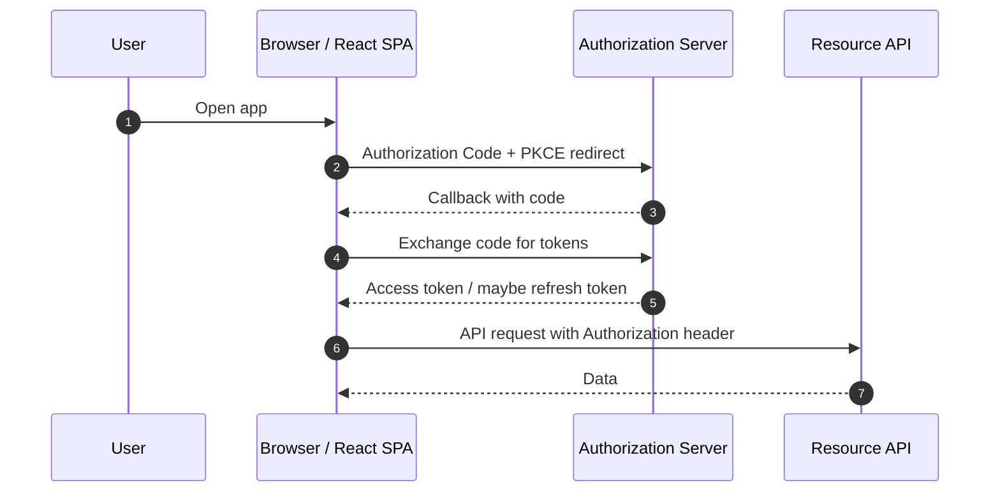
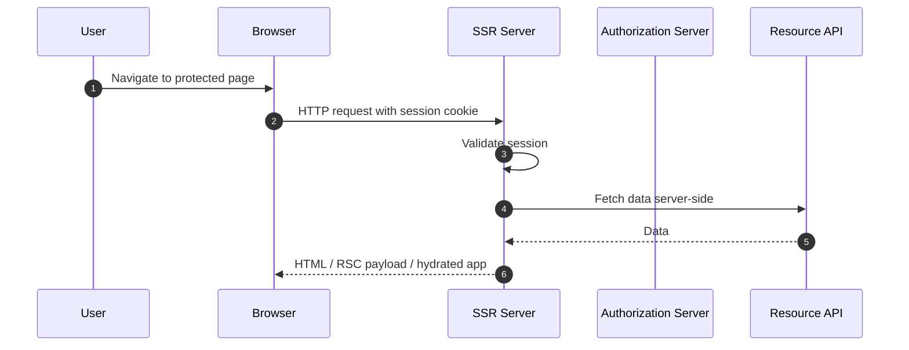
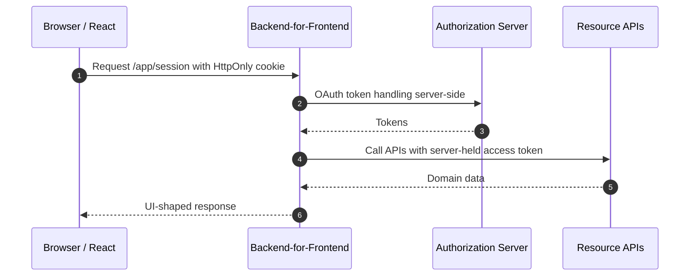
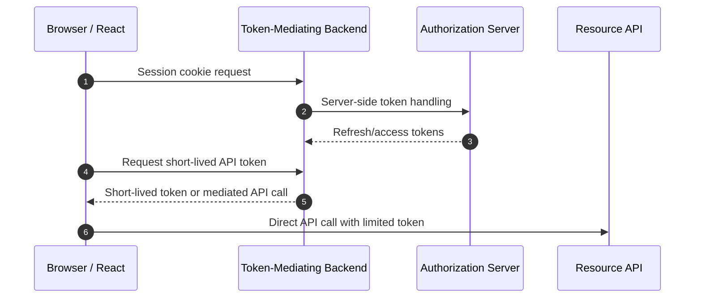
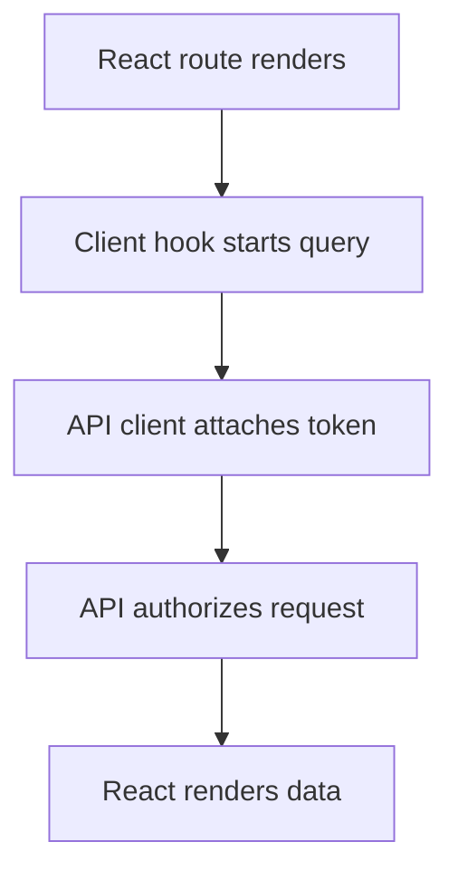
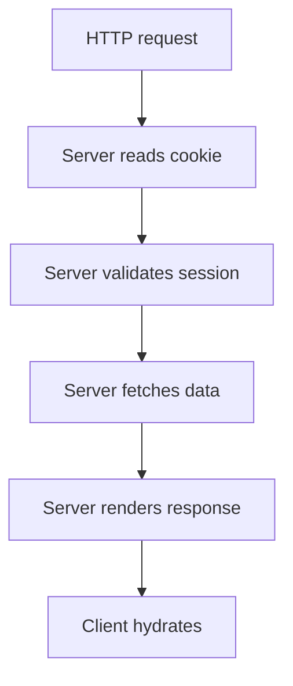
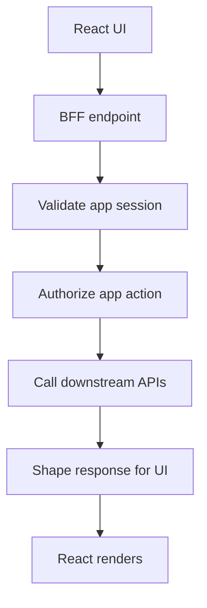
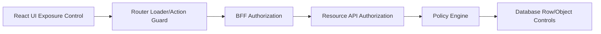
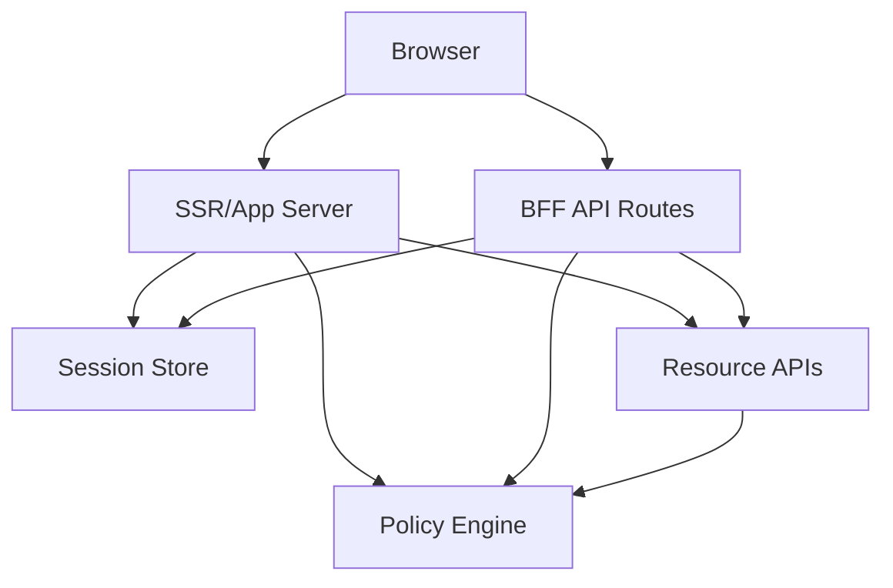

# Part 071 — SPA vs SSR vs BFF Auth

A React authentication architecture is not chosen by asking:

```txt
Where should I put the login button?
```

It is chosen by asking:

```txt
Where is the security boundary?
Where are tokens stored?
Who can call the resource server?
Where is authorization enforced?
Where does session state live?
What happens when the browser is compromised?
What happens when the user opens three tabs?
What happens when the IdP is down?
```

The answer determines whether your app behaves like:

```txt
1. Pure SPA
2. SSR application
3. Backend-for-Frontend application
4. Token-mediating backend
5. Hybrid architecture
```

This part builds the decision framework.

We are not choosing a fashionable stack. We are choosing a trust boundary.

---

## 1. The core problem

A React app runs in a hostile environment.

The browser can be affected by:

```txt
XSS
malicious extensions
supply-chain compromise
shared computers
back/forward cache
service workers
local persistence
third-party script compromise
user-driven copy/paste leakage
debug tooling
browser plugin inspection
```

If the browser holds long-lived credentials, then browser compromise becomes credential compromise.

So the architecture question becomes:

> How much credential authority do we allow JavaScript to possess?

That question divides the architectures.

---

## 2. The four common shapes

### 2.1 Pure SPA

```txt
Browser React app owns OAuth flow and calls APIs directly.
```



Characteristics:

```txt
JavaScript handles OAuth transaction.
JavaScript may hold access token.
API is called directly from browser.
CORS is part of the security surface.
Token refresh must be coordinated in browser.
XSS impact can be high if token is available to JS.
```

Pure SPA can be valid for lower-risk systems, internal tools, or architectures that use short-lived in-memory access tokens and no browser-exposed refresh token.

But the failure mode is clear:

```txt
If JS is compromised, token-bearing API access may be compromised.
```

---

### 2.2 SSR app

```txt
Server participates in rendering and can read cookies/request headers before React renders.
```



Characteristics:

```txt
Server can gate route before render.
Server can fetch sensitive data without exposing API tokens to JS.
Cookies become natural session transport.
Hydration mismatch must be handled.
Cached SSR output must be carefully controlled.
Client-side navigation still needs auth-aware behavior.
```

SSR is not automatically secure.

SSR can still leak data if:

```txt
server-rendered HTML is cached incorrectly
RSC payload includes sensitive data in wrong boundary
client bundle includes secrets
server action lacks authorization
middleware only checks route, not resource action
```

---

### 2.3 Backend-for-Frontend

```txt
A backend specifically built for the frontend owns OAuth tokens and exposes app-shaped endpoints to the React app.
```



Characteristics:

```txt
Browser holds session cookie, not OAuth tokens.
BFF holds access/refresh tokens server-side.
BFF adapts APIs for frontend needs.
BFF can centralize CSRF, cache-control, audit, tenant context, and authorization checks.
CORS can be minimized by same-origin deployment.
```

BFF is often the strongest default for high-risk React apps.

Its cost:

```txt
more backend code
more deployment responsibility
more server capacity
more operational surface
potential backend bottleneck
careful CSRF design required
```

---

### 2.4 Token-mediating backend

```txt
Backend mediates token issuance/storage but browser may still call APIs directly or obtain limited tokens.
```

This is between pure SPA and full BFF.



This can reduce refresh token exposure while preserving some direct browser-to-API behavior.

But it is harder to reason about because authority is split.

Use it only when you have a clear reason.

---

## 3. The axis that matters

Do not compare these architectures as labels.

Compare them by axes.

| Axis | Pure SPA | SSR | BFF | Token-mediating backend |
|---|---|---|---|---|
| OAuth tokens visible to JS | Often yes | Usually no | No | Sometimes limited access token |
| Browser session transport | Memory/token/cookie | Cookie | Cookie | Cookie + limited token |
| API called from browser | Yes | Sometimes | Usually no | Sometimes |
| CORS complexity | High | Medium | Low if same-origin | Medium |
| CSRF risk | Depends on cookies | Yes if cookie-based | Yes if cookie-based | Yes if cookie-based |
| XSS token theft impact | Higher if token in JS | Lower for server-held tokens | Lower for server-held tokens | Medium |
| Server complexity | Lower | Medium | Higher | Higher |
| Data shaping | Client-side | Server/client | BFF-owned | Mixed |
| SSR compatibility | No | Yes | Yes/optional | Yes/optional |
| Authorization locality | API only or mixed | Server/API | BFF/API | Mixed |
| Operational visibility | Fragmented | Better | Stronger | Stronger but split |

The safest architecture is not always the simplest.

The simplest architecture is not always safe enough.

---

## 4. Threat model comparison

### 4.1 XSS

If an attacker executes JavaScript in your origin, they may be able to:

```txt
read localStorage/sessionStorage/IndexedDB
read in-memory JS variables indirectly through app behavior
make authenticated requests from the page
capture UI data
modify DOM
abuse API clients
exfiltrate non-HttpOnly data
trigger state-changing actions
```

Architecture changes the blast radius.

| Architecture | XSS can steal token? | XSS can perform actions? | Notes |
|---|---:|---:|---|
| Pure SPA with JS token | Often yes | Yes | Worst if refresh token is exposed. |
| Pure SPA with in-memory access token | Maybe during runtime | Yes | Less persistence, still runtime risk. |
| Cookie SSR/BFF | Usually no OAuth token theft | Yes | XSS can still send same-origin requests. |
| BFF + CSRF + action confirmation | No OAuth token theft | Some actions, constrained by server policy | Sensitive actions need step-up/re-auth. |

Important:

```txt
HttpOnly cookies reduce token theft.
They do not make XSS harmless.
```

XSS can still ride the user session unless server-side controls exist.

---

### 4.2 CSRF

CSRF matters when authentication is automatically attached by the browser.

```txt
Cookie-based auth => CSRF must be designed.
Bearer token in Authorization header => classic CSRF is less direct, but XSS/token theft becomes more central.
```

BFF/SSR cookie architectures must treat CSRF as first-class:

```txt
SameSite cookies
CSRF tokens for unsafe methods
Origin/Referer validation
content-type restrictions
anti-replay/idempotency keys
step-up for sensitive actions
```

The choice is not:

```txt
cookies are secure, tokens are insecure
```

The real choice is:

```txt
Which attack class are we optimizing against, and what controls do we have?
```

---

### 4.3 Token replay

Bearer tokens are usable by whoever possesses them.

Pure SPA direct API architecture must assume:

```txt
access token leak = API access until expiry/revocation
refresh token leak = long-lived compromise unless rotation/reuse detection works
```

BFF reduces this by keeping tokens server-side.

But BFF session cookies can still be abused if stolen or fixed, so server-side session management remains required:

```txt
session id entropy
rotation after login
server-side expiry
revocation
device/session inventory
suspicious reuse detection
secure cookie attributes
```

---

## 5. Session authority models

There are three common ways to represent user continuity.

### 5.1 Browser-held bearer authority

```txt
Browser holds token that API accepts.
```

```ts
await fetch('https://api.example.com/cases/123', {
  headers: {
    Authorization: `Bearer ${accessToken}`,
  },
});
```

Pros:

```txt
simple API integration
works with external APIs
scales without app server session lookup
natural for mobile/native parity
```

Cons:

```txt
credential accessible to JS unless carefully avoided
browser refresh coordination is hard
revocation often delayed
CORS complexity
API response shapes leak directly to frontend
```

---

### 5.2 Server-held session authority

```txt
Browser holds opaque session cookie.
Server maps session to identity/token state.
```

```txt
Cookie: __Host-app_session=sid_opaque_random_value
```

Pros:

```txt
OAuth tokens not visible to JS
server-side revocation is easier
same-origin deployment can avoid broad CORS
server can centralize cache-control and audit
```

Cons:

```txt
requires session storage
requires CSRF controls
server is in hot path
horizontal scaling/session replication concerns
```

---

### 5.3 Stateless signed session

```txt
Cookie contains signed/encrypted session claims.
```

Pros:

```txt
less server lookup
simple horizontal scaling
```

Cons:

```txt
revocation is harder
claim freshness problem
cookie size limits
rotation complexity
risk of treating stale claims as authority
```

For high-risk authorization, prefer server-side session reference or server-side permission checks.

A signed cookie may be acceptable for low-risk projection, but do not stuff dynamic permissions into it and call it done.

---

## 6. Data loading differences

### 6.1 Pure SPA data loading



Risk:

```txt
component may render shell before auth known
stale query cache can leak data
client-only guard can be bypassed by direct API call
```

Mitigation:

```txt
loader-level auth if using React Router Data/Framework mode
query key includes auth/tenant epoch
cache clear on logout
API validates every request
```

---

### 6.2 SSR data loading



Risk:

```txt
server response cached incorrectly
hydration mismatch after session changes
server/client auth logic drift
sensitive data serialized into client payload accidentally
```

Mitigation:

```txt
Cache-Control: no-store for sensitive pages/data
central auth helpers
server-only modules for token handling
typed session projection
hydration-safe auth state
```

---

### 6.3 BFF data loading



Risk:

```txt
BFF becomes accidental superuser
BFF endpoint lacks resource authorization
BFF over-fetches sensitive downstream data
BFF caches user data globally
```

Mitigation:

```txt
BFF calls APIs with least-privilege token/context
BFF checks subject/action/resource/context
BFF returns UI-shaped minimum data
BFF logs actor/session/tenant/resource decision
```

---

## 7. Authorization placement

A robust system can have multiple authorization layers.



But do not confuse layers.

| Layer | Purpose | Is it security enforcement? |
|---|---|---:|
| UI permission gate | Hide/disable/explain actions | No, exposure control only |
| Router loader/action guard | Prevent wrong navigation/data loading | Partial, only for app routes |
| BFF check | App boundary authorization | Yes, but not enough if downstream APIs callable elsewhere |
| API check | Resource/action enforcement | Yes |
| Policy engine | Decision authority | Yes, if integrated correctly |
| DB/RLS/object guard | Last-line isolation | Yes, for supported domains |

The API/resource server should remain authoritative for protected resources.

BFF can enforce app-specific decisions, but it should not be the only guard if the downstream API can be accessed by other clients.

---

## 8. Same-origin vs cross-origin

### 8.1 Same-origin BFF

```txt
https://app.example.com
  /app/*       -> React app
  /api/*       -> BFF endpoints
  /auth/*      -> login/callback/logout
```

Benefits:

```txt
cookie scoping is simpler
CORS can be avoided
CSRF can be standardized
frontend deployment and BFF share origin
security headers can be centralized
```

Trade-offs:

```txt
frontend/backend deployments coupled
edge/CDN routing must be precise
cache-control mistakes can affect both
```

---

### 8.2 Cross-origin SPA + API

```txt
https://app.example.com
https://api.example.com
```

Benefits:

```txt
independent deployment
API can serve multiple clients
clear service boundary
```

Trade-offs:

```txt
CORS preflight complexity
cookie domain/SameSite complexity if using cookies
more leakage surface in browser network layer
more client-side token handling
```

---

## 9. Architecture decision matrix

Use this as a first-pass decision tool.

| Requirement | Preferred direction |
|---|---|
| High-risk enterprise SaaS | BFF or SSR+BFF |
| Regulated case management | BFF + server-side policy + audit |
| Public content with light account features | SSR or hybrid |
| Offline-first app | SPA with careful token/session constraints |
| External API must be called directly from browser | Pure SPA or token-mediating backend |
| Avoid exposing refresh token to browser | BFF/token-mediating backend |
| Need strong server-rendered access checks | SSR/BFF |
| Need minimal backend footprint | Pure SPA |
| Need centralized audit/correlation | BFF/SSR |
| Need multi-tenant SSO with enterprise controls | BFF/SSR+BFF |
| Need multiple frontend clients sharing API | API-enforced auth + optional BFF per frontend |
| Need rich UI data shaping | BFF |

Decision rule:

```txt
The more valuable the data and the more complex the authorization,
the less authority should live in browser JavaScript.
```

---

## 10. High-risk domains should bias toward BFF

In systems like:

```txt
regulated case management
enforcement lifecycle platforms
financial approval workflows
healthcare admin systems
identity/admin portals
enterprise SaaS admin consoles
legal document platforms
high-value collaboration tools
```

BFF is often worth the cost.

Why?

Because these domains usually need:

```txt
object-level authorization
field-level permission
step-up for sensitive actions
strong audit trail
session revocation
multi-tenant SSO
impersonation controls
safe export/download
server-side data minimization
policy explanation
incident response capability
```

Those are easier to standardize at a BFF boundary than across hundreds of React components.

---

## 11. But BFF is not magic

A BFF can become insecure if it is treated as a trusted tunnel.

Bad BFF:

```txt
/browser asks BFF for /proxy?url=/admin/users/123
BFF forwards request with powerful service token
API trusts BFF blindly
BFF returns everything to browser
```

This creates a confused deputy.

Good BFF:

```txt
/browser asks BFF for /cases/123/summary
BFF validates session
BFF derives actor/tenant
BFF checks can(actor, 'case.read.summary', case:123)
BFF calls downstream with actor context or constrained token
BFF shapes minimum response
BFF records audit decision
```

The BFF should reduce browser authority, not concentrate unlimited backend authority.

---

## 12. SSR-specific risks

SSR and RSC-style architectures add a different set of auth bugs.

### 12.1 Cache leakage

If an authenticated server-rendered response is cached as public, user data can leak.

Bad:

```http
HTTP/1.1 200 OK
Cache-Control: public, max-age=3600
```

For sensitive authenticated responses:

```http
Cache-Control: no-store
Vary: Cookie
```

Use cache intentionally.

Never let framework defaults decide for protected data.

---

### 12.2 Server/client auth mismatch

Server sees session as valid.

Client hydrates later after logout in another tab.

Now the app has:

```txt
server-rendered protected data
client state says anonymous
```

Handle explicitly:

```txt
clear client caches
redirect or show logged-out overlay
avoid keeping sensitive UI interactive
broadcast logout across tabs
```

---

### 12.3 Secret leakage into client bundle

Server code and client code must be separated.

Bad:

```ts
// imported by a client component by accident
export const clientSecret = process.env.OAUTH_CLIENT_SECRET;
```

Good:

```txt
server-only token utilities
lint/import rules
framework server-only markers
build-time checks
no secret in public env variables
```

---

## 13. Pure SPA can still be disciplined

A pure SPA does not have to be reckless.

Minimum discipline:

```txt
Authorization Code with PKCE
no implicit flow
no long-lived refresh token in localStorage
prefer in-memory access token
short access token lifetime
refresh rotation if refresh exists
reuse detection server-side
strong CSP
no third-party script sprawl
API validates every request
query cache cleared on logout/tenant switch
multi-tab logout coordination
```

But the architecture still has a limit:

```txt
The browser remains the token-bearing client.
```

That may be acceptable.

It may not be acceptable.

Decide explicitly.

---

## 14. SSR + BFF hybrid

Many production React systems are not one shape.

A strong hybrid:

```txt
SSR for initial protected page/data
BFF for UI-shaped API endpoints
same-origin cookies
server-side token handling
React client for interactivity
resource APIs still enforce authorization
```



This can provide:

```txt
fast initial auth decision
reduced token exposure
central session management
clear API for client interactions
better audit trail
```

But it requires consistent shared auth primitives.

Do not implement separate auth logic in SSR loaders, server actions, API routes, and BFF handlers.

Extract one policy boundary.

---

## 15. Recommended architecture tiers

### Tier 1 — Simple product, low-risk data

```txt
Pure SPA + Authorization Code PKCE
short-lived in-memory access token
no localStorage refresh token
API validates every request
```

Use when:

```txt
low sensitivity
small team
simple permissions
no enterprise SSO complexity
```

---

### Tier 2 — Product SaaS, medium-risk data

```txt
SSR or BFF
HttpOnly cookie session
server-side token storage
resource API authorization
permission projection endpoint
```

Use when:

```txt
multi-tenant users
moderate object permissions
exports/downloads
customer admin UI
```

---

### Tier 3 — Regulated/high-risk workflow

```txt
SSR+BFF
server-side sessions
central policy engine
object/workflow/field authorization
audit events
step-up auth
impersonation controls
strict cache-control
incident runbooks
```

Use when:

```txt
case management
enforcement lifecycle
financial approval
sensitive documents
high-impact mutations
```

---

## 16. Architecture smell catalog

### Smell: role check in route component

```tsx
if (user.role === 'admin') return <AdminPage />;
```

Problem:

```txt
role is stale
resource/action/context ignored
API may still allow direct access
UI and server drift
```

Better:

```ts
await requirePermission(request, {
  action: 'admin.user.read',
  resource: { type: 'tenant', id: tenantId },
});
```

---

### Smell: JWT in localStorage because it is easy

Problem:

```txt
persistent JS-readable credential
high XSS blast radius
no server-side session inventory
hard forced logout
```

Better:

```txt
BFF session cookie
or in-memory access token with short lifetime
or token-mediating backend if direct API calls are unavoidable
```

---

### Smell: BFF proxy without authorization

```ts
app.all('/api/proxy/*', async (req, res) => {
  return forward(req, internalApi);
});
```

Problem:

```txt
BFF becomes confused deputy
frontend can access arbitrary backend routes
no app-level policy
```

Better:

```txt
explicit app endpoints
explicit actions
resource-level authorization
minimum response shape
```

---

### Smell: SSR protected data with public cache

Problem:

```txt
shared cache or CDN may leak user-specific response
back button may reveal sensitive page after logout
```

Better:

```http
Cache-Control: no-store
Vary: Cookie
```

for sensitive authenticated responses.

---

## 17. Decision checklist

Before choosing architecture, answer these.

### Identity and session

```txt
Who authenticates the user?
Where is the session stored?
Can the user revoke a session?
Can admins force logout?
How are multiple tabs coordinated?
How are refresh failures handled?
```

### Token exposure

```txt
Does browser JavaScript ever see access tokens?
Does browser JavaScript ever see refresh tokens?
Are tokens persisted?
Are tokens audience-restricted?
How are token leaks detected?
```

### Authorization

```txt
Where is object-level authorization enforced?
Where is workflow-state authorization enforced?
Where are field-level permissions enforced?
How does UI learn allowed actions?
How are permission changes invalidated?
```

### Browser security

```txt
What is the XSS blast radius?
What is the CSRF strategy?
What is the CSP strategy?
Are third-party scripts allowed on authenticated pages?
Can service workers cache protected responses?
```

### Operations

```txt
Can we audit login/logout/access denied/mutation?
Can we debug 401/403 mismatch?
Can we rotate secrets?
Can we revoke sessions?
Can we survive IdP downtime?
Can we run incident response after token leak?
```

---

## 18. A practical recommendation

For advanced React engineers, the default recommendation is:

```txt
Do not start from protected routes.
Start from token exposure and enforcement boundary.
```

Then:

```txt
If data is low-risk and backend capacity is limited:
  SPA + PKCE + short-lived tokens + strict API authorization.

If data is medium/high-risk:
  BFF or SSR+BFF with HttpOnly cookie session and server-held tokens.

If permissions are object/workflow/field-level:
  central policy engine or server-side permission service.

If the app is regulated:
  BFF + audit + step-up + cache-control + incident runbooks.
```

---

## 19. Minimal architecture templates

### Pure SPA template

```txt
React SPA
  Auth client: PKCE, in-memory access token
  Query client: auth/tenant scoped cache
  API client: Authorization header
  API: validates every request
  Permission API: returns allowed actions
  Security: CSP, no localStorage token, refresh rotation
```

### SSR template

```txt
React framework server
  Session cookie: HttpOnly Secure SameSite
  Server loader: validate session
  Server fetch: API call with server credentials or user token
  Cache: no-store for sensitive data
  Client hydration: projected session only
```

### BFF template

```txt
React app
  Browser holds app session cookie only
BFF
  owns OAuth callback
  stores tokens server-side
  exposes app-specific endpoints
  checks authorization
  calls downstream APIs
  audits decisions
Resource APIs
  still enforce resource authorization
```

---

## 20. Part conclusion

SPA, SSR, and BFF are not just rendering choices.

They are security boundary choices.

The core invariant:

> The more sensitive the system and the more complex the authorization, the less long-lived authority should live in browser JavaScript.

A top-tier engineer does not ask:

```txt
Can I make login work?
```

They ask:

```txt
What authority exists in each runtime?
How can it be abused?
Where is it validated?
How is it revoked?
How is it audited?
How does it fail?
```

That is the difference between a login implementation and an auth architecture.

---

## References

- Next.js Docs — Authentication Guide: authentication, session management, and authorization concepts.
- OAuth 2.0 for Browser-Based Applications — browser app architecture patterns including BFF/token-mediating backend.
- RFC 9700 — Best Current Practice for OAuth 2.0 Security.
- OWASP Session Management Cheat Sheet.
- OWASP Authorization Cheat Sheet.
- OWASP CSRF Prevention Cheat Sheet.
- OWASP Web Security Testing Guide — Testing for Browser Cache Weaknesses.
