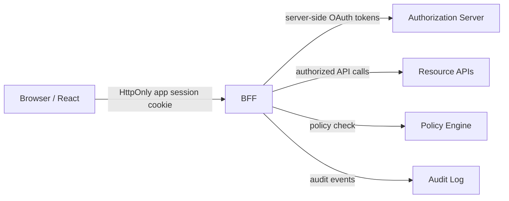
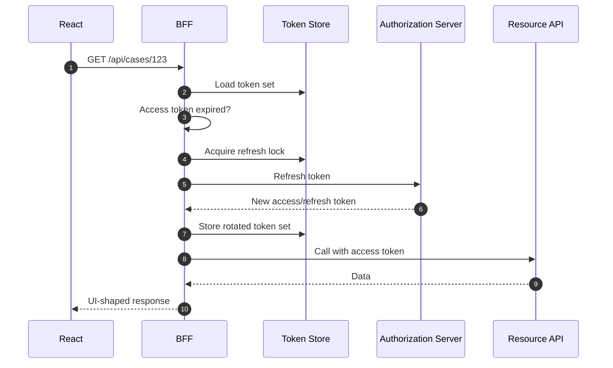
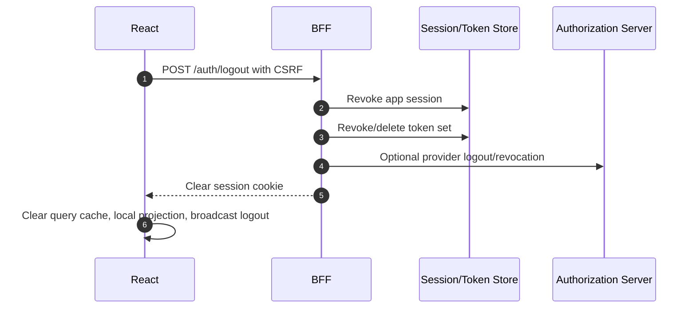

# Part 072 — Backend-for-Frontend Auth

A Backend-for-Frontend is not merely:

```txt
an API proxy for React
```

For auth, a BFF is a security boundary that changes what the browser is allowed to possess.

In a strong BFF architecture:

```txt
Browser JavaScript does not hold OAuth refresh tokens.
Browser JavaScript usually does not hold OAuth access tokens.
Browser holds an app session cookie.
BFF owns OAuth callback and token lifecycle.
BFF calls resource APIs server-side.
BFF returns UI-shaped, least-data responses.
BFF participates in authorization, auditing, and cache-control.
```

This is the pattern you reach for when the browser should be a user interface, not a credential container.

---

## 1. Mental model

A BFF splits the system into two sessions:

```txt
User-facing app session
  Browser <-> BFF
  Usually HttpOnly Secure SameSite cookie

OAuth/provider session/token state
  BFF <-> Authorization Server / Resource APIs
  Access/refresh tokens stored server-side
```



The browser gets a projection:

```json
{
  "user": {
    "id": "usr_123",
    "displayName": "Asha"
  },
  "tenant": {
    "id": "tenant_456",
    "name": "Acme"
  },
  "session": {
    "expiresAt": "2026-07-08T11:00:00Z",
    "assuranceLevel": "aal2"
  },
  "permissions": {
    "version": "perm_epoch_9001"
  }
}
```

It does not get:

```txt
refresh token
client secret
provider session internals
downstream service token
raw internal authorization trace
full group/role dump if not needed
```

---

## 2. What a BFF is responsible for

A production auth BFF owns these responsibilities.

| Responsibility | Why it exists |
|---|---|
| Login start | Generate transaction state, PKCE, nonce, return intent. |
| OAuth callback | Validate state/nonce, exchange code, create app session. |
| Session cookie | Issue HttpOnly/Secure/SameSite app session cookie. |
| Token storage | Store OAuth access/refresh tokens server-side. |
| Token refresh | Refresh tokens server-side, handle rotation/reuse detection. |
| Session projection | Return safe `/session` data to React. |
| CSRF defense | Protect cookie-authenticated unsafe methods. |
| API shaping | Expose frontend-specific endpoints, not raw internal APIs. |
| Authorization | Check app/resource actions before downstream calls. |
| Downstream context | Pass actor/tenant/context safely to APIs. |
| Cache-control | Prevent user-specific response leakage. |
| Audit | Record login/logout/denied/mutation decisions. |
| Logout | Revoke app session, tokens, and optionally provider session. |

A BFF is successful when the React app becomes simpler and safer:

```txt
React asks: what is my session projection?
React asks: what actions are allowed?
React calls: app-shaped endpoints.
React never manages refresh token lifecycle.
```

---

## 3. Non-goals

A BFF should not become these things.

### 3.1 Generic blind proxy

Bad:

```http
POST /bff/proxy
{
  "method": "DELETE",
  "url": "https://internal-api/admin/users/usr_123"
}
```

This creates a confused deputy.

The browser now instructs the BFF to use backend authority on arbitrary targets.

Better:

```http
DELETE /bff/tenants/tenant_1/users/usr_123
```

with explicit handler:

```txt
validate session
validate tenant membership
authorize user.delete
call user service with constrained context
audit decision
return safe result
```

---

### 3.2 Token vending machine

Bad:

```http
GET /bff/access-token
```

returns:

```json
{
  "accessToken": "eyJ..."
}
```

This reintroduces browser token authority.

Sometimes a token-mediating backend intentionally issues short-lived constrained tokens, but a BFF should not casually hand out the same tokens it was created to protect.

---

### 3.3 Authorization bypass layer

Bad:

```txt
Resource API trusts all requests from BFF.
BFF forwards request if session exists.
```

The BFF should reduce attack surface, not bypass resource authorization.

Good:

```txt
BFF checks app-level authorization.
Resource API still checks resource-level authorization.
Downstream request carries actor/tenant/context.
```

---

## 4. Canonical BFF login flow

```mermaid
sequenceDiagram
    autonumber
    participant U as User
    participant R as React App
    participant BFF as BFF
    participant AS as Authorization Server
    participant DB as Session/Token Store

    U->>R: Click login
    R->>BFF: GET /auth/login?returnTo=/cases/123
    BFF->>BFF: Create auth transaction state + PKCE + nonce
    BFF-->>R: 302 redirect to Authorization Server
    R->>AS: Authorization request
    AS-->>BFF: Redirect /auth/callback?code=...&state=...
    BFF->>BFF: Validate state, nonce, redirect URI transaction
    BFF->>AS: Exchange code using PKCE
    AS-->>BFF: Access token, refresh token, ID token
    BFF->>BFF: Validate ID token / map identity
    BFF->>DB: Store token set server-side
    BFF->>DB: Create app session
    BFF-->>R: Set-Cookie __Host-app_session=...; HttpOnly; Secure; SameSite=Lax
    BFF-->>R: 302 redirect to safe returnTo
```

The React app does not need to parse the authorization code.

The React app does not need to store the refresh token.

The React app only observes:

```txt
login started
browser redirected
session exists after callback
```

---

## 5. Cookie design

Prefer a host-only session cookie.

```http
Set-Cookie: __Host-app_session=sid_opaque_random_256_bits;
  Path=/;
  Secure;
  HttpOnly;
  SameSite=Lax;
  Max-Age=3600
```

Properties:

```txt
__Host- prefix requires Secure, Path=/, and no Domain attribute in supporting browsers.
HttpOnly prevents direct JavaScript read.
Secure sends only over HTTPS.
SameSite reduces cross-site request attachment in many contexts.
Opaque value avoids exposing claims to browser.
```

Do not put this in the cookie:

```txt
role list
permission list
refresh token
access token
PII blob
tenant membership dump
```

Use the cookie as an index to server-side session state.

---

## 6. Session store model

A robust BFF session record can look like this.

```ts
export type BffSessionRecord = {
  sessionIdHash: string;
  subjectId: string;
  activeTenantId?: string;
  identityProvider: 'auth0' | 'cognito' | 'workos' | 'custom';
  providerSubject: string;

  createdAt: string;
  lastSeenAt: string;
  expiresAt: string;
  absoluteExpiresAt: string;
  revokedAt?: string;
  revokeReason?: string;

  assuranceLevel: 'aal1' | 'aal2' | 'aal3';
  authTime: string;
  stepUpUntil?: string;

  tokenSetRef: string;
  permissionEpoch: string;
  sessionEpoch: number;

  ipFingerprint?: string;
  userAgentHash?: string;
};
```

Important design details:

```txt
Store a hash of the session id, not raw session id.
Store token material separately and encrypted.
Separate idle expiry from absolute expiry.
Track session epoch for cache invalidation.
Track permission epoch for UI/data invalidation.
Track assurance/auth time for step-up checks.
```

---

## 7. Token vault model

Do not scatter OAuth tokens across logs, app memory, and database columns without discipline.

Use a token vault abstraction.

```ts
export type TokenSetRecord = {
  tokenSetRef: string;
  subjectId: string;
  provider: string;
  encryptedAccessToken?: string;
  encryptedRefreshToken?: string;
  accessTokenExpiresAt?: string;
  refreshTokenFamilyId?: string;
  scopes: string[];
  audience: string;
  createdAt: string;
  updatedAt: string;
  revokedAt?: string;
};
```

Rules:

```txt
encrypt tokens at rest
never log tokens
never return tokens to React by default
rotate refresh tokens if provider supports it
track refresh token family if available
serialize refresh operations per token set
revoke on logout or compromise
```

A BFF without token hygiene is just moving the problem from browser to server.

That is still an improvement for XSS, but not enough for production.

---

## 8. Session projection endpoint

The React app needs to know whether the user is signed in.

Expose projection, not authority.

```http
GET /api/session
```

Response:

```json
{
  "status": "authenticated",
  "user": {
    "id": "usr_123",
    "displayName": "Asha",
    "avatarUrl": "/api/users/usr_123/avatar"
  },
  "tenant": {
    "id": "tenant_456",
    "name": "Acme Enforcement"
  },
  "session": {
    "expiresAt": "2026-07-08T11:00:00Z",
    "assuranceLevel": "aal2",
    "authTime": "2026-07-08T09:10:00Z",
    "sessionEpoch": 17
  },
  "permissions": {
    "epoch": "perm_2026_07_08_090000"
  }
}
```

Headers:

```http
Cache-Control: no-store
Vary: Cookie
```

The projection should not include:

```txt
OAuth access token
OAuth refresh token
raw ID token
full SAML assertion
internal provider groups unless needed
sensitive policy trace
```

---

## 9. CSRF strategy

A BFF usually uses cookies.

That means unsafe methods need CSRF defense.

Common controls:

```txt
SameSite=Lax or Strict where possible
CSRF token for unsafe methods
Origin/Referer validation
reject unsafe simple cross-site form posts where possible
content-type restrictions
idempotency keys for important mutations
step-up for sensitive operations
```

A common pattern:

```http
GET /api/csrf-token
```

returns:

```json
{
  "csrfToken": "csrf_random_bound_to_session"
}
```

React sends it on unsafe methods:

```ts
await fetch('/api/cases/123/approve', {
  method: 'POST',
  credentials: 'include',
  headers: {
    'Content-Type': 'application/json',
    'X-CSRF-Token': csrfToken,
    'Idempotency-Key': crypto.randomUUID(),
  },
  body: JSON.stringify({ comment: 'Approved' }),
});
```

Server checks:

```ts
function requireCsrf(req: Request, session: Session) {
  const method = req.method.toUpperCase();
  if (method === 'GET' || method === 'HEAD' || method === 'OPTIONS') return;

  assertTrustedOrigin(req);

  const token = req.headers.get('x-csrf-token');
  if (!token || !csrfStore.verify(session.id, token)) {
    throw problem(403, 'csrf_failed', 'Request could not be verified.');
  }
}
```

Do not rely on SameSite alone for high-risk mutations.

---

## 10. BFF endpoint design

BFF endpoints should be product actions, not database tables.

Bad endpoint design:

```txt
GET /api/proxy/case-service/cases/123/raw
POST /api/sql/query
GET /api/internal/users?includeEverything=true
```

Good endpoint design:

```txt
GET    /api/cases/:caseId/overview
GET    /api/cases/:caseId/timeline
POST   /api/cases/:caseId/assign
POST   /api/cases/:caseId/submit-for-review
POST   /api/cases/:caseId/approve
GET    /api/cases/:caseId/allowed-actions
POST   /api/access-requests
```

Why?

Because product-shaped endpoints can encode:

```txt
action semantics
resource type
field minimization
workflow transition
permission check
audit event
idempotency behavior
```

A BFF should translate UI intent into authorized domain operation.

---

## 11. Authorization inside BFF

Every unsafe endpoint should have explicit authorization.

```ts
async function approveCaseHandler(req: Request) {
  const session = await requireSession(req);
  await requireCsrf(req, session);

  const { caseId } = params(req);
  const body = await parseJson(req);

  const decision = await policy.check({
    subject: { type: 'user', id: session.subjectId },
    action: 'case.approve',
    resource: { type: 'case', id: caseId },
    context: {
      tenantId: session.activeTenantId,
      assuranceLevel: session.assuranceLevel,
      authTime: session.authTime,
      requestIp: req.ip,
    },
  });

  if (!decision.allowed) {
    audit.authzDenied({
      actorId: session.subjectId,
      action: 'case.approve',
      resourceId: caseId,
      reason: decision.reason,
      correlationId: req.correlationId,
    });

    throw problem(403, decision.reason, decision.publicMessage);
  }

  const result = await caseService.approve({
    caseId,
    comment: body.comment,
    actorId: session.subjectId,
    tenantId: session.activeTenantId,
    idempotencyKey: req.headers.get('idempotency-key'),
  });

  audit.mutationSucceeded({
    actorId: session.subjectId,
    action: 'case.approve',
    resourceId: caseId,
    correlationId: req.correlationId,
  });

  return json(result, {
    headers: {
      'Cache-Control': 'no-store',
    },
  });
}
```

Notice what this does not do:

```txt
it does not trust a frontend role
it does not trust a decoded token from React
it does not allow arbitrary proxying
it does not skip downstream authorization
```

---

## 12. Downstream API calls

The BFF needs to call resource APIs.

There are several patterns.

### 12.1 User-delegated access token

```txt
BFF stores user access token and calls API as user.
```

Pros:

```txt
resource API can enforce user-level scopes/claims
natural audit as user
least surprise for OAuth resource servers
```

Cons:

```txt
token refresh required
scope may be too coarse
provider claims may not match domain permission
```

---

### 12.2 Service token + actor context

```txt
BFF uses service credential and sends actor context.
```

Pros:

```txt
works for internal APIs
central service-to-service auth
BFF can use stable backend credentials
```

Cons:

```txt
resource API must not trust actor headers blindly
requires signed context or mTLS/service mesh controls
risk of BFF as superuser
```

If using actor headers:

```http
X-Actor-Id: usr_123
X-Tenant-Id: tenant_456
X-Correlation-Id: corr_abc
```

protect them:

```txt
only accepted from trusted BFF identity
validated by service auth
not accepted from public internet
logged and audited
```

---

### 12.3 Token exchange

```txt
BFF exchanges user/session token for downstream audience-specific token.
```

Pros:

```txt
least privilege per downstream API
audience restriction
short-lived scoped token
```

Cons:

```txt
more IdP/infrastructure complexity
latency/token cache concerns
```

For high-security environments, token exchange can be attractive.

But never use it as a substitute for domain authorization.

---

## 13. Token refresh in BFF

Refresh belongs server-side.



Refresh invariants:

```txt
only one refresh per token family at a time
old refresh token invalidated after rotation
reuse detection revokes token family/session
refresh failure maps to typed session error
never expose provider refresh errors directly to user
```

BFF removes the need for BroadcastChannel refresh locks in the browser.

But it introduces server-side concurrency requirements.

---

## 14. Logout flow

Logout must clean several layers.



Cookie clear:

```http
Set-Cookie: __Host-app_session=; Path=/; Max-Age=0; Secure; HttpOnly; SameSite=Lax
Cache-Control: no-store
Clear-Site-Data: "cache", "storage"
```

Be careful with `Clear-Site-Data: "cookies"` if the origin has other important cookies.

Logout is a distributed system problem even with BFF.

---

## 15. React app contract

A React app using BFF should have a small auth surface.

```ts
export type SessionProjection =
  | { status: 'anonymous' }
  | { status: 'authenticated'; user: UserProjection; tenant?: TenantProjection; session: SessionInfo }
  | { status: 'expired'; reason: 'idle_timeout' | 'absolute_timeout' | 'revoked' }
  | { status: 'degraded'; dependency: 'idp' | 'policy' | 'api' };
```

React calls:

```ts
async function loadSession(): Promise<SessionProjection> {
  const res = await fetch('/api/session', {
    credentials: 'include',
    headers: { Accept: 'application/json' },
  });

  if (res.status === 401) return { status: 'anonymous' };
  return res.json();
}
```

React does not need:

```txt
getAccessTokenSilently()
refreshToken()
decodeJwtForRole()
storeToken()
```

That is the point.

---

## 16. BFF with React Router

In React Router Data/Framework mode, loaders/actions call BFF endpoints.

```ts
export async function loader({ request, params }: Route.LoaderArgs) {
  const res = await fetchFromBff(request, `/api/cases/${params.caseId}/overview`);

  if (res.status === 401) {
    throw redirect(`/login?returnTo=${safeReturnTo(request.url)}`);
  }

  if (res.status === 403) {
    throw await asRouteProblem(res);
  }

  return res.json();
}
```

Action:

```ts
export async function action({ request, params }: Route.ActionArgs) {
  const formData = await request.formData();

  const res = await fetchFromBff(request, `/api/cases/${params.caseId}/approve`, {
    method: 'POST',
    headers: {
      'X-CSRF-Token': await getCsrfToken(request),
      'Idempotency-Key': crypto.randomUUID(),
    },
    body: JSON.stringify({ comment: formData.get('comment') }),
  });

  if (res.status === 401) throw redirect('/login');
  if (res.status === 403) throw await asRouteProblem(res);

  return res.json();
}
```

The loader/action does not authorize by itself.

It sends user intent to BFF, and BFF enforces.

---

## 17. BFF with Next.js-style architecture

A Next.js-style architecture can implement BFF at:

```txt
Route Handlers
Server Actions
Middleware for coarse route checks
Server Components for server data loading
```

Keep the boundary clear:

```txt
Middleware: coarse redirect/session presence only
Route Handler: API/BFF action boundary
Server Action: mutation boundary requiring authorization
Server Component: read boundary and data minimization
Client Component: interaction/projection only
```

Do not put provider secrets in Client Components.

Do not put resource authorization only in middleware.

Middleware usually lacks enough resource context for deep authorization.

---

## 18. Cache-control in BFF

For sensitive user-specific endpoints:

```http
Cache-Control: no-store
Vary: Cookie
```

For permission projection:

```http
Cache-Control: no-store
```

For public static assets:

```http
Cache-Control: public, max-age=31536000, immutable
```

Separate these aggressively.

Do not let `/api/session` or `/api/cases/:id` be cached by CDN as public content.

BFF endpoints should set cache headers intentionally, not accidentally.

---

## 19. Security headers

A BFF can centralize security headers.

Example baseline for authenticated app responses:

```http
Content-Security-Policy: default-src 'self'; object-src 'none'; base-uri 'self'; frame-ancestors 'none'
Referrer-Policy: no-referrer
X-Content-Type-Options: nosniff
Permissions-Policy: camera=(), microphone=(), geolocation=()
Cross-Origin-Opener-Policy: same-origin
Cache-Control: no-store
```

CSP must be adapted to your bundler, analytics, image CDN, and third-party needs.

But authenticated pages should not casually allow arbitrary third-party scripts.

A BFF cannot save you from reckless script execution.

---

## 20. Observability and audit

BFF is a powerful observability point.

Log safely:

```txt
correlation id
session id hash
actor id
tenant id
action
resource type/id
policy decision id
public denial reason
latency
downstream status
```

Do not log:

```txt
access token
refresh token
ID token
authorization code
session cookie value
raw SAML assertion
password/MFA secret
full PII payload unless required and protected
```

Audit events:

```ts
export type AuthAuditEvent =
  | { type: 'login_succeeded'; actorId: string; sessionIdHash: string; tenantId?: string }
  | { type: 'login_failed'; reason: string; provider?: string }
  | { type: 'session_refreshed'; actorId: string; sessionIdHash: string }
  | { type: 'logout_succeeded'; actorId: string; sessionIdHash: string }
  | { type: 'authorization_denied'; actorId: string; action: string; resource: string; reason: string }
  | { type: 'sensitive_action_succeeded'; actorId: string; action: string; resource: string };
```

BFF should make incidents diagnosable.

---

## 21. Failure taxonomy

| Failure | BFF response | React behavior |
|---|---|---|
| No session cookie | `401 anonymous` | Show login/redirect. |
| Session expired | `401 session_expired` | Clear cache, login with returnTo. |
| Session revoked | `401 session_revoked` | Clear cache, show signed-out message. |
| CSRF failed | `403 csrf_failed` | Refresh token, retry only if safe. |
| Permission denied | `403 permission_denied` | Show reason/request access. |
| Step-up required | `403 step_up_required` | Start step-up flow. |
| Token refresh failed | `401 provider_session_expired` | Re-login. |
| IdP unavailable | `503 identity_unavailable` | Degraded UI; no sensitive mutation. |
| Policy service unavailable | `503 policy_unavailable` | Fail closed. |
| Downstream API denied | `403 downstream_denied` | Show denial; investigate drift. |
| Downstream API timeout | `504 downstream_timeout` | Retry policy/backoff. |

Do not collapse all of this into:

```txt
Something went wrong
```

Typed failures create recoverable UX and debuggable operations.

---

## 22. Scaling BFF sessions

BFF adds server state.

Plan for:

```txt
shared session store
sticky session not required if possible
session id hashing
token encryption
refresh locks
revocation propagation
horizontal scaling
regional failover
short session lookup latency
```

Common stores:

```txt
Redis / Valkey for hot session state
SQL for durable audit/session inventory
KMS-backed encrypted token storage
short-lived in-memory cache with strict invalidation
```

Avoid:

```txt
only in-memory sessions in one pod
refresh token stored in plaintext
session cache without revocation check
opaque debugging with no correlation id
```

---

## 23. Multi-tenant BFF design

A BFF must not let tenant context become a UI-controlled string.

Bad:

```http
X-Tenant-Id: tenant_victim
```

from the browser.

Better:

```txt
session has allowed tenant memberships
active tenant is stored server-side or validated on every switch
BFF checks user belongs to tenant before setting active tenant
all permission and data calls include validated tenant context
cache keys include tenant id and session epoch
```

Tenant switch endpoint:

```ts
async function switchTenant(req: Request) {
  const session = await requireSession(req);
  await requireCsrf(req, session);

  const { tenantId } = await parseJson(req);

  const allowed = await membershipService.isMember(session.subjectId, tenantId);
  if (!allowed) throw problem(403, 'tenant_not_allowed');

  await sessionStore.update(session.id, {
    activeTenantId: tenantId,
    sessionEpoch: session.sessionEpoch + 1,
    permissionEpoch: await permissionService.currentEpoch(session.subjectId, tenantId),
  });

  return json({ ok: true }, { headers: { 'Cache-Control': 'no-store' } });
}
```

Tenant switch must invalidate frontend caches.

---

## 24. Step-up in BFF

Sensitive actions should require authentication freshness.

```ts
function requireFreshAuth(session: Session, maxAgeSeconds: number) {
  const authAge = Date.now() - Date.parse(session.authTime);
  if (authAge > maxAgeSeconds * 1000) {
    throw problem(403, 'step_up_required', 'Please confirm your identity to continue.', {
      stepUpUrl: `/auth/step-up?returnTo=${encodeURIComponent(currentPath())}`,
    });
  }
}
```

Sensitive examples:

```txt
approve enforcement decision
export sensitive data
grant admin access
change MFA settings
delete case document
impersonate user
rotate API key
```

BFF is a good place to enforce step-up because it owns session `authTime` and assurance state.

---

## 25. Testing BFF auth

Test as a security boundary.

### Login/callback tests

```txt
state mismatch rejected
nonce mismatch rejected
reused auth transaction rejected
invalid returnTo rejected
callback error maps to safe UI
session cookie has Secure/HttpOnly/SameSite
```

### Session tests

```txt
missing cookie returns anonymous
expired session returns typed 401
revoked session returns typed 401
session projection excludes tokens
Cache-Control no-store present
```

### CSRF tests

```txt
unsafe method without token rejected
wrong token rejected
wrong origin rejected
safe GET does not mutate
content-type policy enforced
```

### Authorization tests

```txt
action denied if permission missing
resource id tampering denied
tenant mismatch denied
field-level write denied
workflow state transition denied
stale permission epoch handled
```

### Token tests

```txt
access token refreshed server-side
refresh lock prevents double refresh
reuse detection revokes session
token not logged
token not returned to browser
```

### Cache tests

```txt
/api/session no-store
protected API no-store
CDN does not cache user-specific data
logout clears frontend cache
back button does not reveal sensitive screen where policy disallows
```

---

## 26. Implementation skeleton

A simplified BFF request pipeline:

```ts
type BffContext = {
  correlationId: string;
  session?: Session;
  csrfVerified: boolean;
};

type Handler = (req: Request, ctx: BffContext) => Promise<Response>;

function withCorrelation(handler: Handler): Handler {
  return async (req, ctx) => {
    return handler(req, { ...ctx, correlationId: crypto.randomUUID() });
  };
}

function withSession(handler: Handler): Handler {
  return async (req, ctx) => {
    const session = await loadSessionFromCookie(req);
    if (!session) throw problem(401, 'anonymous');
    if (session.revokedAt) throw problem(401, 'session_revoked');
    if (new Date(session.expiresAt) < new Date()) throw problem(401, 'session_expired');

    return handler(req, { ...ctx, session });
  };
}

function withCsrf(handler: Handler): Handler {
  return async (req, ctx) => {
    if (!ctx.session) throw problem(500, 'session_required_before_csrf');
    requireCsrf(req, ctx.session);
    return handler(req, { ...ctx, csrfVerified: true });
  };
}

function withNoStore(handler: Handler): Handler {
  return async (req, ctx) => {
    const res = await handler(req, ctx);
    res.headers.set('Cache-Control', 'no-store');
    res.headers.append('Vary', 'Cookie');
    return res;
  };
}
```

Usage:

```ts
export const approveCase = compose(
  withCorrelation,
  withNoStore,
  withSession,
  withCsrf,
)(async (req, ctx) => {
  const session = ctx.session!;
  const { caseId } = routeParams(req);

  await requirePermission(session, {
    action: 'case.approve',
    resource: { type: 'case', id: caseId },
  });

  return caseService.approve(caseId, session.subjectId);
});
```

Do not copy this as production code.

Copy the structure:

```txt
correlation
session
csrf
authorization
business action
cache-control
audit
```

---

## 27. BFF anti-pattern catalog

### Anti-pattern: BFF exists only for CORS

If your BFF only forwards requests to avoid CORS, it is not an auth architecture.

It is a proxy.

---

### Anti-pattern: returning tokens to React

If React immediately receives the access token, the BFF no longer protects token exposure.

---

### Anti-pattern: service token for everything

If BFF uses one powerful service token and resource APIs skip user authorization, one BFF bug becomes system-wide privilege escalation.

---

### Anti-pattern: user permissions in cookie

Permissions change.

Cookies persist.

Do not turn stale cookie claims into authority.

---

### Anti-pattern: middleware-only authorization

Middleware can check session presence.

It usually cannot check every resource/action/field/workflow state.

---

### Anti-pattern: no typed auth errors

Without typed errors, React cannot distinguish:

```txt
login required
permission denied
step-up required
session revoked
policy outage
```

---

## 28. Production readiness checklist

A BFF auth implementation is production-ready only if:

```txt
[ ] Browser never receives refresh token.
[ ] Browser does not receive access token unless intentionally token-mediating.
[ ] Session cookie is HttpOnly, Secure, SameSite, path-scoped, and opaque.
[ ] Session ids are high-entropy and stored hashed server-side.
[ ] Tokens are encrypted at rest and never logged.
[ ] CSRF protection exists for unsafe cookie-authenticated methods.
[ ] All protected endpoints require session.
[ ] All protected mutations require explicit authorization.
[ ] Resource APIs still enforce authorization where applicable.
[ ] Sensitive responses use Cache-Control: no-store.
[ ] Login callback validates state/nonce/PKCE transaction.
[ ] Return URL is allowlisted/internal-only.
[ ] Refresh token rotation/reuse failure is handled.
[ ] Logout revokes session and token state.
[ ] Multi-tab logout is propagated to React.
[ ] Tenant switch validates membership server-side.
[ ] Permission epoch/session epoch invalidates caches.
[ ] Step-up auth exists for sensitive operations.
[ ] Audit events exist for login/logout/denied/mutation.
[ ] Correlation id flows through BFF and downstream APIs.
[ ] Tests cover CSRF, IDOR/BOLA, stale permission, cache leakage, and token exposure.
```

---

## 29. Part conclusion

A BFF is not about adding a backend because frontend engineers are not trusted.

It is about moving long-lived authority out of the browser.

The central BFF invariant is:

> Browser JavaScript may express user intent, but the BFF must validate session, context, and authorization before using server-side authority.

A good BFF gives React a clean contract:

```txt
/session tells me who I am
/allowed-actions tells me what UI to expose
/product endpoints let me express intent
server-side policy decides what is allowed
```

A bad BFF gives React a bigger hammer:

```txt
/proxy lets me call anything
/token lets me become a bearer token holder
/service-token lets BFF bypass downstream policy
```

The difference is architectural discipline.

In high-risk React systems, BFF is often the difference between:

```txt
working login
```

and:

```txt
defensible authentication and authorization architecture
```

---

## References

- OAuth 2.0 for Browser-Based Applications — BFF and token-mediating backend patterns.
- RFC 9700 — Best Current Practice for OAuth 2.0 Security.
- OWASP Session Management Cheat Sheet.
- OWASP CSRF Prevention Cheat Sheet.
- OWASP Authorization Cheat Sheet.
- MDN Set-Cookie and cookie security attributes.
- OWASP Web Security Testing Guide — browser cache weakness testing.
