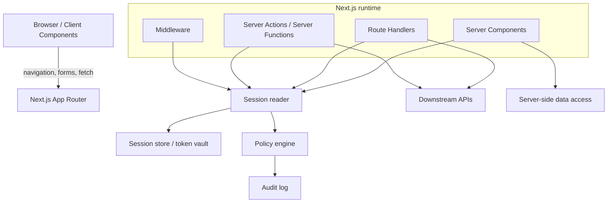

# Part 073 — Next.js App Router Auth

The App Router changes the auth conversation.

In a pure SPA, the browser often owns the auth flow, route guard, data fetch, token refresh, cache invalidation, and UI rendering. In App Router, the system is split across several execution surfaces:

```txt
Server Components
Client Components
Route Handlers
Server Actions / Server Functions
Middleware
Browser fetches
Downstream APIs
Auth provider / IdP
Session store
Policy engine
```

That split is powerful, but it also creates new failure modes.

The correct question is not:

```txt
How do I protect a page in Next.js?
```

The correct question is:

```txt
At which runtime should authentication, session loading, authorization, data fetching, mutation, cache-control, and UI projection happen?
```

A top-tier React engineer treats App Router auth as a set of explicit boundaries.

---

## 1. The App Router auth mental model

App Router gives you server-side rendering and React Server Components, but this does not automatically make the application secure.

It gives you places where security logic can be placed closer to the server.

That is different.



The shape of a secure App Router auth system:

```txt
Browser owns interaction.
Server owns session interpretation.
Server owns protected data loading.
Server owns mutation authorization.
Client Components receive safe projections.
Route Handlers and Server Actions enforce again.
```

The primary rule:

```txt
Do not confuse server rendering with server authorization.
```

A Server Component can render protected data safely only if the data source was authorized correctly.

---

## 2. Runtime surfaces and their security responsibilities

| Surface | Runs where? | Good for | Dangerous if used for |
|---|---|---|---|
| Server Component | Server | Reading session, loading authorized data, rendering safe projection | Passing sensitive objects into Client Components |
| Client Component | Browser | Interaction, local UI state, optimistic UX | Holding secrets, making final auth decisions |
| Route Handler | Server | API endpoint/BFF, cookie/session work, downstream calls | Returning over-broad data, missing per-request auth |
| Server Action / Server Function | Server | Form/mutation handling | Trusting hidden fields or client-submitted permission flags |
| Middleware | Edge/server before route | Coarse redirects, request decoration | Fine-grained authorization requiring fresh resource data |
| Layout | Server or client depending on boundary | Shared shell/session projection | Assuming shell visibility equals route authorization |
| Metadata/menu config | Build/runtime | Navigation exposure | Enforcement |

The invariant:

```txt
Every protected data read and every mutation needs a server-side authorization decision.
```

A layout that hides a menu item is useful. It is not enforcement.

---

## 3. Authentication, session management, and authorization are separate

In App Router, it is tempting to build a single function called `auth()` and let it do everything.

That usually becomes a vague god function.

Separate the concerns:

```ts
export type AuthenticatedSession = {
  kind: 'authenticated'
  sessionId: string
  userId: string
  tenantId: string
  authTime: string
  assuranceLevel: 'aal1' | 'aal2' | 'aal3'
  permissionEpoch: number
}

export type AnonymousSession = {
  kind: 'anonymous'
}

export type SessionProjection = AuthenticatedSession | AnonymousSession
```

Then layer the helpers:

```ts
export async function readSession(): Promise<SessionProjection> {
  // Parse cookie, read server-side session store, return minimal projection.
}

export async function requireUser(): Promise<AuthenticatedSession> {
  const session = await readSession()

  if (session.kind !== 'authenticated') {
    throw new UnauthorizedError('login_required')
  }

  return session
}

export async function requirePermission(input: {
  session: AuthenticatedSession
  action: string
  resource: { type: string; id?: string }
  context?: Record<string, unknown>
}) {
  const decision = await policyEngine.check(input)

  if (!decision.allowed) {
    throw new ForbiddenError(decision.reason.code)
  }

  return decision
}
```

This gives you composable primitives:

```txt
readSession       -> projection
requireUser       -> authentication gate
requirePermission -> authorization gate
```

That separation prevents many bugs:

```txt
Authenticated but forbidden
Authenticated but needs step-up
Authenticated but wrong tenant
Authenticated but stale permission epoch
Anonymous but route can still render public shell
```

---

## 4. Where to read cookies

A common App Router pattern:

```ts
import { cookies } from 'next/headers'

export async function readSessionCookie() {
  const cookieStore = await cookies()
  return cookieStore.get('__Host-app_session')?.value ?? null
}
```

But reading a cookie is not reading a session.

Cookie value is only a pointer or credential. The server still needs to:

```txt
1. Parse cookie.
2. Validate signature or lookup opaque session id.
3. Check server-side expiration.
4. Check revocation.
5. Check tenant and assurance context.
6. Return a minimal projection.
```

Recommended cookie design:

```txt
__Host-app_session=<opaque-session-id>
Secure
HttpOnly
SameSite=Lax or Strict depending on flow
Path=/
No Domain attribute
```

The React app should receive this:

```json
{
  "kind": "authenticated",
  "user": {
    "id": "usr_123",
    "displayName": "Asha"
  },
  "tenant": {
    "id": "tenant_456",
    "name": "Acme Risk"
  },
  "permissionEpoch": 91
}
```

Not this:

```json
{
  "accessToken": "eyJhbGciOi...",
  "refreshToken": "...",
  "rawIdToken": "...",
  "allProviderClaims": { }
}
```

In App Router, the whole point of server-side execution is to reduce what must be exposed to JavaScript.

---

## 5. Root layout is not always the right place for auth

A root layout is attractive because it wraps everything.

But making root layout require authentication has consequences:

```txt
Public pages become harder.
Marketing pages may depend on auth runtime.
Static optimization may be lost.
Logout/login loops can become global.
Every route inherits a heavy session dependency.
```

Better structure:

```txt
app/
  layout.tsx                    # public root shell
  page.tsx                      # public home
  login/page.tsx                # public login
  (authenticated)/
    layout.tsx                  # require session
    dashboard/page.tsx
    cases/[caseId]/page.tsx
  api/
    session/route.ts            # session projection endpoint if needed
```

Example authenticated layout:

```tsx
// app/(authenticated)/layout.tsx
import { requireUser } from '@/auth/server-session'
import { AuthenticatedShell } from '@/components/authenticated-shell'

export default async function AuthenticatedLayout({
  children,
}: {
  children: React.ReactNode
}) {
  const session = await requireUser()

  return (
    <AuthenticatedShell session={toSafeSessionProjection(session)}>
      {children}
    </AuthenticatedShell>
  )
}
```

This protects the shell. It does not automatically authorize every child resource.

The page must still check resource access:

```tsx
// app/(authenticated)/cases/[caseId]/page.tsx
import { requireUser, requirePermission } from '@/auth/server-session'
import { getCaseForUser } from '@/cases/data'

export default async function CasePage({
  params,
}: {
  params: Promise<{ caseId: string }>
}) {
  const { caseId } = await params
  const session = await requireUser()

  await requirePermission({
    session,
    action: 'case.view',
    resource: { type: 'case', id: caseId },
  })

  const record = await getCaseForUser({
    caseId,
    tenantId: session.tenantId,
    userId: session.userId,
  })

  return <CaseView caseRecord={toSafeCaseView(record)} />
}
```

The layout proves the user is authenticated.

The page proves the user may access that resource.

---

## 6. Route Handlers as BFF endpoints

Route Handlers are a natural place to implement BFF-style endpoints.

Example:

```ts
// app/api/cases/[caseId]/route.ts
import { NextResponse } from 'next/server'
import { requireUser, requirePermission } from '@/auth/server-session'
import { getCaseDetails } from '@/cases/service'

export async function GET(
  _request: Request,
  context: { params: Promise<{ caseId: string }> }
) {
  const { caseId } = await context.params
  const session = await requireUser()

  await requirePermission({
    session,
    action: 'case.view',
    resource: { type: 'case', id: caseId },
  })

  const data = await getCaseDetails({
    caseId,
    tenantId: session.tenantId,
  })

  return NextResponse.json(toCaseDetailsDto(data), {
    headers: {
      'Cache-Control': 'no-store',
    },
  })
}
```

The handler contract:

```txt
Do not trust path params.
Do not trust query params.
Do not trust request body.
Do not trust cookies without server validation.
Do not trust Client Component state.
Authorize inside the handler.
Return least-data DTOs.
Set cache-control intentionally.
```

For mutations:

```ts
export async function POST(
  request: Request,
  context: { params: Promise<{ caseId: string }> }
) {
  const { caseId } = await context.params
  const session = await requireUser()
  const body = await request.json()

  await assertCsrf(request, session)

  await requirePermission({
    session,
    action: 'case.escalate',
    resource: { type: 'case', id: caseId },
    context: {
      requestedTransition: body.transition,
    },
  })

  const result = await escalateCase({
    caseId,
    tenantId: session.tenantId,
    actorId: session.userId,
    transition: body.transition,
    reason: body.reason,
  })

  return NextResponse.json(toMutationResult(result), {
    status: 200,
    headers: {
      'Cache-Control': 'no-store',
    },
  })
}
```

Never let the client send this as authority:

```json
{
  "canEscalate": true,
  "role": "supervisor",
  "tenantId": "tenant_456"
}
```

The client can submit intent. The server decides.

---

## 7. Server Actions for protected mutations

Server Actions can be a good fit for forms, but they are not magic.

A Server Action still receives user-controlled input.

Bad:

```tsx
'use server'

export async function approveCase(formData: FormData) {
  const caseId = String(formData.get('caseId'))
  const approverRole = String(formData.get('role'))

  if (approverRole === 'supervisor') {
    await approve(caseId)
  }
}
```

The hidden field is not authority.

Better:

```tsx
'use server'

import { revalidatePath } from 'next/cache'
import { requireUser, requirePermission } from '@/auth/server-session'
import { approveCaseCommand } from '@/cases/commands'

export async function approveCaseAction(
  _previousState: unknown,
  formData: FormData
) {
  const session = await requireUser()
  const caseId = String(formData.get('caseId') ?? '')
  const reason = String(formData.get('reason') ?? '')

  await requirePermission({
    session,
    action: 'case.approve',
    resource: { type: 'case', id: caseId },
    context: {
      reasonProvided: reason.length > 0,
    },
  })

  const result = await approveCaseCommand({
    actorId: session.userId,
    tenantId: session.tenantId,
    caseId,
    reason,
  })

  revalidatePath(`/cases/${caseId}`)

  return {
    ok: true,
    caseVersion: result.version,
  }
}
```

Server Action rules:

```txt
Treat formData as hostile.
Load session inside the action.
Authorize inside the action.
Validate state transition server-side.
Emit audit event server-side.
Revalidate cache intentionally.
Return safe result only.
```

A Server Action is an execution location, not an authorization policy.

---

## 8. Server Components and safe data projection

Server Components allow direct server-side data loading. That can remove unnecessary client fetches.

But it also means the component tree may accidentally become a data exfiltration path.

Bad:

```tsx
export default async function AccountPage() {
  const account = await db.account.findUnique({
    include: {
      billingProfile: true,
      internalRiskFlags: true,
      authProviderLinks: true,
      supportNotes: true,
    },
  })

  return <AccountClient account={account} />
}
```

If `AccountClient` is a Client Component, the serialized props cross into the browser.

Better:

```tsx
export default async function AccountPage() {
  const session = await requireUser()

  await requirePermission({
    session,
    action: 'account.view',
    resource: { type: 'account', id: session.tenantId },
  })

  const account = await loadAccountForPage({
    tenantId: session.tenantId,
    actorId: session.userId,
  })

  return <AccountClient account={toAccountPageDto(account)} />
}
```

DTO projection is not ceremony. It is a safety barrier.

```ts
type AccountPageDto = {
  id: string
  displayName: string
  planName: string
  canManageBilling: boolean
}

function toAccountPageDto(account: AccountRecord): AccountPageDto {
  return {
    id: account.id,
    displayName: account.displayName,
    planName: account.plan.publicName,
    canManageBilling: account.allowedActions.includes('billing.manage'),
  }
}
```

The DTO should be shaped for UI, not copied from persistence.

---

## 9. `use client` is a serialization boundary

Once you pass data into a Client Component, assume it is visible to the browser.

```tsx
'use client'

export function BillingPanel(props: {
  account: AccountPageDto
}) {
  return <section>{props.account.planName}</section>
}
```

Safe enough if the DTO is safe.

Dangerous if props contain:

```txt
raw access tokens
refresh tokens
ID tokens
session ids
provider claims not meant for UI
internal policy traces
audit-only reasons
internal notes
hidden fraud/risk signals
full database records
```

Mental model:

```txt
Server Component -> may hold secrets temporarily
Client Component -> must not receive secrets
```

Do not rely on “not rendering it” in the Client Component.

If it is in props, it is already exposed.

---

## 10. Auth boundary with route groups

A scalable App Router project often uses route groups as auth domains.

```txt
app/
  (public)/
    login/page.tsx
    forgot-password/page.tsx
  (authenticated)/
    layout.tsx
    dashboard/page.tsx
    cases/[caseId]/page.tsx
  (admin)/
    layout.tsx
    users/page.tsx
    policies/page.tsx
```

But route groups are organizational. They are not security by themselves.

Use them to colocate auth boundaries:

```tsx
// app/(admin)/layout.tsx
import { requireUser, requirePermission } from '@/auth/server-session'

export default async function AdminLayout({ children }: { children: React.ReactNode }) {
  const session = await requireUser()

  await requirePermission({
    session,
    action: 'admin.console.access',
    resource: { type: 'tenant', id: session.tenantId },
  })

  return <>{children}</>
}
```

Then still authorize individual admin actions:

```txt
admin.console.access       -> can enter admin shell
user.invite                -> can invite users
role.assign                -> can assign roles
policy.publish             -> can publish policy changes
impersonation.start        -> can impersonate under constraints
```

A route group gives structure.

Permission vocabulary gives precision.

---

## 11. Middleware: coarse gate, not fine-grained policy engine

Middleware can redirect anonymous users before expensive rendering.

Example:

```ts
// middleware.ts
import { NextResponse } from 'next/server'
import type { NextRequest } from 'next/server'

export function middleware(request: NextRequest) {
  const sessionCookie = request.cookies.get('__Host-app_session')
  const pathname = request.nextUrl.pathname

  const requiresAuth = pathname.startsWith('/dashboard') || pathname.startsWith('/cases')

  if (requiresAuth && !sessionCookie) {
    const loginUrl = new URL('/login', request.url)
    loginUrl.searchParams.set('returnTo', pathname)
    return NextResponse.redirect(loginUrl)
  }

  return NextResponse.next()
}
```

This is only a coarse optimization.

Do not use Middleware as the only authorization layer for:

```txt
object ownership
case state transitions
field-level permission
tenant membership freshness
high-risk action step-up
role hierarchy
policy explanation
workflow constraints
```

Why?

Because Middleware often lacks the full resource context and may run in a different runtime with different data access constraints.

Use Middleware to:

```txt
redirect obviously anonymous traffic
apply coarse request headers
block obviously invalid tenants
normalize URLs
set correlation metadata
```

Use server functions/services/route handlers to:

```txt
perform exact authorization decisions
load resource state
write audit events
validate workflow invariants
```

---

## 12. Cache-control is part of auth

App Router has multiple caching layers.

Do not treat cache as a performance-only feature.

For authenticated data, ask:

```txt
Who is this cached for?
Can another user receive it?
Can it survive logout?
Can it survive permission revocation?
Can it survive tenant switch?
Can it leak through back/forward cache?
Can it leak through CDN/shared cache?
```

For sensitive Route Handler responses:

```ts
return NextResponse.json(payload, {
  headers: {
    'Cache-Control': 'no-store',
    'Vary': 'Cookie',
  },
})
```

For server-side data loading, avoid broad shared caching unless the data is public or explicitly tenant-safe.

For session projection:

```txt
no-store
Vary: Cookie
minimal payload
no raw provider claims
no tokens
```

For authorization-sensitive pages:

```txt
Prefer per-request session reads.
Tie query/cache keys to tenant/user/permission epoch.
Invalidate/revalidate after mutations.
Clear client caches on logout and tenant switch.
```

A fast leaked page is still a leaked page.

---

## 13. Session projection endpoint

Even with Server Components, Client Components often need a minimal auth projection.

Example:

```ts
// app/api/session/route.ts
import { NextResponse } from 'next/server'
import { readSession } from '@/auth/server-session'

export async function GET() {
  const session = await readSession()

  if (session.kind === 'anonymous') {
    return NextResponse.json(
      { kind: 'anonymous' },
      {
        headers: {
          'Cache-Control': 'no-store',
          'Vary': 'Cookie',
        },
      }
    )
  }

  return NextResponse.json(
    {
      kind: 'authenticated',
      user: {
        id: session.userId,
        displayName: session.displayName,
      },
      tenant: {
        id: session.tenantId,
        name: session.tenantName,
      },
      assuranceLevel: session.assuranceLevel,
      permissionEpoch: session.permissionEpoch,
    },
    {
      headers: {
        'Cache-Control': 'no-store',
        'Vary': 'Cookie',
      },
    }
  )
}
```

A good session endpoint answers:

```txt
Who is the current projected user?
Which tenant/org is active?
What is the auth/session state?
What is the permission version/epoch?
What is the minimum data the UI needs?
```

It should not answer:

```txt
What are all provider claims?
What is the access token?
What is the refresh token?
What are all internal policy traces?
What are all entitlements for all tenants?
```

---

## 14. Next.js auth with downstream APIs

There are two common patterns.

### Pattern A — Server-side data access

```txt
Server Component / Route Handler / Server Action
  -> internal service
  -> database or downstream API
```

The browser never sees API tokens.

### Pattern B — Browser calls BFF Route Handler

```txt
Client Component
  -> /api/cases/:id
  -> BFF Route Handler
  -> downstream API
```

The browser holds only an app session cookie.

Both patterns can be good.

Avoid Pattern C unless risk is low and the trade-off is explicit:

```txt
Client Component
  -> downstream API directly with browser-held access token
```

This pushes credential handling into the browser and reintroduces many SPA auth risks.

Decision matrix:

| Requirement | Prefer |
|---|---|
| High-risk regulated data | Server-side/BFF |
| Needs third-party API token | Server-side token vault |
| Needs fast public data | Public cache/CDN |
| Needs interactive mutation | Server Action or BFF Route Handler |
| Needs realtime channel | Server-issued short-lived channel ticket |
| Needs offline-first app | Explicit offline auth design |

---

## 15. Server Action vs Route Handler

Use Server Actions when:

```txt
mutation is tied to a form/action in the React tree
result is UI-state-shaped
progressive enhancement matters
same app owns the action
```

Use Route Handlers when:

```txt
endpoint is called by multiple clients
response must follow explicit HTTP contract
you need webhooks/callbacks
you need file upload/download flows
you need SSE/WebSocket alternatives
you need API-like testability
```

For authorization, both must do the same core work:

```txt
read session
validate CSRF if cookie-based mutation
validate input
authorize subject/action/resource/context
execute command
write audit event
return safe response
invalidate/revalidate cache
```

Do not let implementation surface change security semantics.

---

## 16. CSRF in App Router cookie auth

If you use cookies for session and accept state-changing requests, CSRF matters.

Mitigation layers:

```txt
SameSite cookie
Origin/Referer validation
CSRF token tied to session
content-type restrictions when useful
step-up for sensitive actions
idempotency keys for retry-sensitive mutations
```

Example CSRF assertion:

```ts
export async function assertCsrf(request: Request, session: AuthenticatedSession) {
  const origin = request.headers.get('origin')

  if (!isAllowedOrigin(origin)) {
    throw new ForbiddenError('invalid_origin')
  }

  const submitted = request.headers.get('x-csrf-token')
  const expected = await csrfStore.getForSession(session.sessionId)

  if (!submitted || submitted !== expected) {
    throw new ForbiddenError('invalid_csrf_token')
  }
}
```

Server Actions also need CSRF thinking. They are server-side functions, but the request that invokes them still originates from the browser.

The rule is simple:

```txt
Cookie-authenticated mutation needs CSRF defense.
```

---

## 17. Step-up authentication in App Router

Sensitive actions should not depend only on an old session.

Example sensitive actions:

```txt
change email
change password
invite admin
assign role
approve regulated case
export sensitive data
start impersonation
publish policy
```

Model the decision explicitly:

```ts
type AuthDecision =
  | { allowed: true }
  | { allowed: false; reason: 'forbidden' }
  | { allowed: false; reason: 'step_up_required'; maxAgeSeconds: number }
```

Server Action:

```ts
const decision = await policyEngine.check({
  subject: session.userId,
  action: 'role.assign',
  resource: { type: 'tenant', id: session.tenantId },
  context: {
    authTime: session.authTime,
    assuranceLevel: session.assuranceLevel,
  },
})

if (!decision.allowed && decision.reason === 'step_up_required') {
  return {
    ok: false,
    type: 'step_up_required',
    redirectTo: buildSafeStepUpUrl({ returnTo: '/admin/users' }),
  }
}
```

The UI receives a recovery path, not a bypass.

---

## 18. Tenant-aware App Router auth

Multi-tenant App Router auth needs one active tenant context.

Bad:

```txt
User is authenticated globally.
All tenant data queries trust tenantId from URL.
```

Better:

```txt
Session has activeTenantId.
URL tenant slug is resolved server-side.
Membership is checked server-side.
Resource queries are scoped by tenant.
Permission cache key includes tenant.
Client receives tenant projection only.
```

Example:

```ts
export async function requireTenantAccess(input: {
  session: AuthenticatedSession
  tenantSlug: string
}) {
  const tenant = await tenantRepository.findBySlug(input.tenantSlug)

  if (!tenant) {
    throw new NotFoundError('tenant_not_found')
  }

  const membership = await membershipRepository.find({
    tenantId: tenant.id,
    userId: input.session.userId,
  })

  if (!membership || membership.status !== 'active') {
    throw new NotFoundError('tenant_not_found')
  }

  return {
    tenantId: tenant.id,
    membershipId: membership.id,
  }
}
```

Returning `404` for unauthorized tenant can reduce enumeration. Internally, still log the denied attempt with enough metadata for investigation.

---

## 19. App Router auth error taxonomy

Use typed errors.

```ts
class UnauthorizedError extends Error {
  code = 'login_required' as const
}

class ForbiddenError extends Error {
  constructor(public reason: string) {
    super(reason)
  }
}

class StepUpRequiredError extends Error {
  code = 'step_up_required' as const
}

class TenantMismatchError extends Error {
  code = 'tenant_mismatch' as const
}
```

Map them deliberately:

| Error | HTTP/Page result | User meaning |
|---|---:|---|
| anonymous | `401` or redirect login | Sign in required |
| expired session | `401` or refresh/relogin | Session expired |
| forbidden | `403` | You do not have access |
| tenant mismatch | `404` or `403` | Resource not available |
| step-up required | `403` with typed reason or redirect | Re-authenticate required |
| stale permission | `403` with refresh hint | Access changed |

Do not collapse all auth failures into login redirect.

That creates loops and hides real permission bugs.

---

## 20. Error boundaries for App Router auth

Use route-level error boundaries to avoid leaking data and to provide useful recovery.

```tsx
'use client'

export default function Error({
  error,
  reset,
}: {
  error: Error & { digest?: string }
  reset: () => void
}) {
  return (
    <main>
      <h1>Something went wrong</h1>
      <p>We could not load this secure view.</p>
      <button onClick={() => reset()}>Try again</button>
    </main>
  )
}
```

But be careful: error boundary props are client-visible.

Do not pass:

```txt
raw policy trace
internal ACL graph
SQL query
provider response body
session id
access token
```

Prefer a public error DTO:

```ts
type PublicAuthError = {
  type: 'login_required' | 'forbidden' | 'step_up_required' | 'not_found'
  message: string
  correlationId: string
}
```

---

## 21. Middleware redirect loops

Common bad loop:

```txt
middleware sees no cookie -> redirect /login
/login layout reads session -> redirects /dashboard
/dashboard middleware sees stale cookie missing in edge context -> redirect /login
```

Loop prevention checklist:

```txt
Exclude /login, /callback, /logout, /api/auth/* from auth redirect middleware.
Use exact path matching.
Validate returnTo as internal path.
Represent session states explicitly.
Clear invalid cookies deliberately.
Avoid redirecting 403 to login.
Cap redirect attempts with a transaction id.
Log loop metrics.
```

Example matcher design:

```ts
export const config = {
  matcher: [
    '/dashboard/:path*',
    '/cases/:path*',
    '/admin/:path*',
  ],
}
```

Do not match everything and then try to patch exceptions forever.

---

## 22. Safe return URL policy

Login flows often need to return the user to the intended page.

Never trust raw URL input.

```ts
export function parseSafeReturnTo(value: string | null): string {
  if (!value) return '/dashboard'

  try {
    if (!value.startsWith('/')) return '/dashboard'
    if (value.startsWith('//')) return '/dashboard'

    const url = new URL(value, 'https://app.example.com')

    if (url.origin !== 'https://app.example.com') {
      return '/dashboard'
    }

    if (url.pathname.startsWith('/api/')) {
      return '/dashboard'
    }

    return `${url.pathname}${url.search}${url.hash}`
  } catch {
    return '/dashboard'
  }
}
```

The App Router return URL policy should handle:

```txt
login
logout
step-up auth
SSO callback
tenant discovery
invitation acceptance
password reset
MFA enrollment
```

Every one of those can become an open redirect if the return path is not constrained.

---

## 23. Auth provider callback in App Router

A callback Route Handler should be protocol code.

```ts
// app/api/auth/callback/route.ts
import { NextResponse } from 'next/server'
import { exchangeCodeForSession } from '@/auth/oauth'
import { parseSafeReturnTo } from '@/auth/return-to'

export async function GET(request: Request) {
  const url = new URL(request.url)
  const code = url.searchParams.get('code')
  const state = url.searchParams.get('state')

  if (!code || !state) {
    return NextResponse.redirect(new URL('/login?error=callback_failed', url.origin))
  }

  const result = await exchangeCodeForSession({ code, state })
  const returnTo = parseSafeReturnTo(result.returnTo)

  const response = NextResponse.redirect(new URL(returnTo, url.origin))

  response.cookies.set('__Host-app_session', result.sessionId, {
    httpOnly: true,
    secure: true,
    sameSite: 'lax',
    path: '/',
  })

  return response
}
```

Callback invariants:

```txt
state is required
PKCE verifier is bound to transaction
transaction is single-use
returnTo is internal-only
session cookie is HttpOnly/Secure
no tokens in redirect URL
no provider response in client-visible error
```

---

## 24. Authorization in Server Components vs services

You can authorize directly in a Server Component:

```tsx
await requirePermission({
  session,
  action: 'case.view',
  resource: { type: 'case', id: caseId },
})
```

But for serious systems, prefer a service boundary:

```ts
export async function loadCasePage(input: {
  session: AuthenticatedSession
  caseId: string
}) {
  await requirePermission({
    session: input.session,
    action: 'case.view',
    resource: { type: 'case', id: input.caseId },
  })

  const record = await caseRepository.findForTenant({
    tenantId: input.session.tenantId,
    caseId: input.caseId,
  })

  return toCasePageDto(record)
}
```

Then the Server Component stays thin:

```tsx
export default async function CasePage({ params }: Props) {
  const { caseId } = await params
  const session = await requireUser()
  const dto = await loadCasePage({ session, caseId })

  return <CasePageView caseRecord={dto} />
}
```

Why this is better:

```txt
Reusable from Route Handlers and Server Actions.
Easier to test.
Reduces missed authorization checks.
Centralizes audit.
Keeps component tree from becoming business layer.
```

---

## 25. App Router auth folder structure

One possible structure:

```txt
src/
  auth/
    server-session.ts
    cookies.ts
    csrf.ts
    return-to.ts
    errors.ts
    projection.ts
    provider/
      oauth-client.ts
      callback.ts
  policy/
    check.ts
    decision.ts
    actions.ts
  app/
    (public)/
      login/page.tsx
    (authenticated)/
      layout.tsx
      dashboard/page.tsx
      cases/[caseId]/page.tsx
    api/
      session/route.ts
      cases/[caseId]/route.ts
```

Boundary rule:

```txt
auth/server-* modules must not be imported by Client Components.
```

Enforce via lint/import conventions:

```txt
server-only modules stay server-only
client-safe projections stay in shared DTO modules
policy action vocabulary can be shared
policy evaluation stays server-side unless explicitly projection-only
```

---

## 26. Production checklist

Before shipping App Router auth, verify:

```txt
[ ] Session cookie is HttpOnly, Secure, scoped, and intentionally SameSite.
[ ] Session validation happens server-side.
[ ] Raw tokens are not passed to Client Components.
[ ] Server Components use safe DTO projections.
[ ] Route Handlers authorize per request.
[ ] Server Actions authorize per mutation.
[ ] Middleware is only coarse gate, not final authz.
[ ] Return URLs are internal-only.
[ ] OAuth callback validates state and PKCE.
[ ] Authenticated responses use correct cache-control.
[ ] Tenant membership is checked server-side.
[ ] Step-up auth exists for sensitive actions.
[ ] 401 and 403 are not collapsed into one behavior.
[ ] Logout clears server session, cookies, and client caches.
[ ] Error boundaries do not leak internal policy data.
[ ] Tests cover anonymous, expired, forbidden, stale permission, wrong tenant, and step-up required.
```

---

## 27. Common anti-patterns

### Anti-pattern 1 — Auth only in layout

```txt
Authenticated layout exists.
Individual resources are not authorized.
```

Fix:

```txt
Layout checks session.
Page/service checks resource permission.
Mutation checks action permission.
```

### Anti-pattern 2 — Passing full database row to Client Component

Fix:

```txt
Use DTO projection.
Expose only what UI needs.
```

### Anti-pattern 3 — Middleware as policy engine

Fix:

```txt
Use Middleware for coarse routing.
Use server/service policy checks for exact decisions.
```

### Anti-pattern 4 — Server Action trusts hidden field

Fix:

```txt
Treat formData as hostile.
Authorize from server-loaded session and server-loaded resource state.
```

### Anti-pattern 5 — Caching authenticated data as if public

Fix:

```txt
no-store for sensitive responses.
Vary on Cookie when appropriate.
Invalidate on permission/session/tenant changes.
```

---

## 28. Final mental model

A strong App Router auth design says:

```txt
React Server Components reduce browser exposure.
They do not remove the need for authorization.

Route Handlers provide BFF/API boundaries.
They do not authorize automatically.

Server Actions run on the server.
They still receive hostile input.

Middleware can redirect early.
It rarely has enough context for fine-grained authorization.

Client Components make the UI interactive.
They must receive safe projections only.
```

The top 1% mental model:

```txt
Every App Router surface is an execution boundary.
Every execution boundary needs a security responsibility.
Every responsibility needs an invariant.
Every invariant needs a test.
```

---

## References

- Next.js Docs — Authentication: https://nextjs.org/docs/app/guides/authentication
- Next.js Docs — Route Handlers: https://nextjs.org/docs/app/getting-started/route-handlers
- Next.js Docs — Server Actions / Mutating Data: https://nextjs.org/docs/app/getting-started/mutating-data
- Next.js Docs — Cookies: https://nextjs.org/docs/app/api-reference/functions/cookies
- OWASP Authorization Cheat Sheet: https://cheatsheetseries.owasp.org/cheatsheets/Authorization_Cheat_Sheet.html
- OWASP Session Management Cheat Sheet: https://cheatsheetseries.owasp.org/cheatsheets/Session_Management_Cheat_Sheet.html
- OWASP CSRF Prevention Cheat Sheet: https://cheatsheetseries.owasp.org/cheatsheets/Cross-Site_Request_Forgery_Prevention_Cheat_Sheet.html
- RFC 9700 — OAuth 2.0 Security Best Current Practice: https://www.rfc-editor.org/rfc/rfc9700.html
