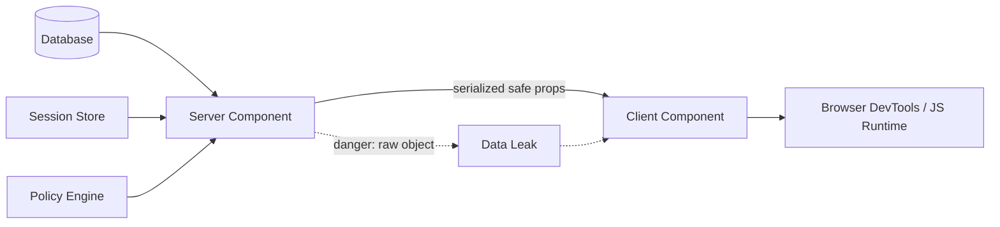

# Part 074 — React Server Components Auth Risks

React Server Components are not insecure.

But they change where leaks happen.

In a traditional SPA, sensitive data usually leaks through:

```txt
browser storage
network responses
client-side caches
logs
analytics
DOM
```

With Server Components, sensitive data can also leak through:

```txt
serialized props to Client Components
accidental DTO overexposure
RSC payloads
shared caches
server function return values
error boundaries
server logs
misplaced client boundaries
```

The dangerous illusion is:

```txt
It ran on the server, therefore it is safe.
```

The better model is:

```txt
Server execution is a privilege.
Serialization is a boundary.
Client Components are exposure points.
```

---

## 1. RSC auth mental model

A Server Component can access server-side resources.

That can include:

```txt
cookies
headers
database rows
server-side session state
policy engine
internal APIs
secrets indirectly through service calls
```

A Client Component runs in the browser.

Anything passed to it is browser-visible.



The RSC rule:

```txt
The security boundary is not the component name.
The security boundary is what crosses from server to client.
```

A value can be safe on the server and unsafe once serialized.

---

## 2. The most important invariant

```txt
A Server Component may read sensitive data.
A Client Component must not receive sensitive data.
```

This means all server-to-client data needs a projection step.

Bad:

```tsx
export default async function UserPage() {
  const user = await db.user.findUnique({
    include: {
      authProviderLinks: true,
      recoveryCodes: true,
      internalRiskScore: true,
      securityNotes: true,
      sessions: true,
    },
  })

  return <UserEditor user={user} />
}
```

Better:

```tsx
export default async function UserPage() {
  const session = await requireUser()
  const user = await loadUserForAdminPage({
    actor: session,
    userId: 'usr_123',
  })

  return <UserEditor user={toUserEditorDto(user)} />
}
```

Where DTO projection is explicit:

```ts
type UserEditorDto = {
  id: string
  displayName: string
  email: string
  status: 'active' | 'suspended' | 'invited'
  allowedActions: Array<'user.suspend' | 'user.reactivate' | 'user.reset_mfa'>
}

function toUserEditorDto(record: UserAdminRecord): UserEditorDto {
  return {
    id: record.id,
    displayName: record.displayName,
    email: record.email,
    status: record.status,
    allowedActions: record.allowedActions,
  }
}
```

Never pass persistence objects directly into Client Components.

---

## 3. RSC does not make frontend-only authorization valid

Bad RSC auth model:

```txt
Server Component loads everything.
Client Component hides actions based on role.
Server Action trusts submitted role/action.
```

Correct model:

```txt
Server Component loads only authorized data.
Client Component displays a safe projection.
Server Action reauthorizes mutation.
Server-side service enforces business invariant.
```

RSC helps with least-data rendering, but it does not replace policy enforcement.

Authorization still belongs at:

```txt
data read boundary
mutation boundary
resource service boundary
workflow transition boundary
downstream API boundary
```

The UI can ask:

```txt
Should this button be visible?
```

The server must answer:

```txt
Is this action allowed now, for this subject, on this resource, in this context?
```

---

## 4. Serialization leak taxonomy

React applications leak sensitive auth data through serialization when a server-only value is passed to a client-visible place.

Common leak paths:

| Leak path | Example | Why dangerous |
|---|---|---|
| Client props | `<Client data={rawRecord} />` | Props are available to browser runtime |
| Error boundary | Throwing raw provider/API error | Error may contain tokens, claims, internal IDs |
| Server action return | Returning full updated entity | Mutation result crosses to client |
| RSC payload | Rendering sensitive object in tree | Payload may contain serialized data |
| `data-*` attributes | Embedding IDs/claims in DOM | Visible to scripts, extensions, user |
| Analytics/logging | Sending auth state to analytics | Third-party exposure |
| Cache hydration | Dehydrated query cache contains protected data | Persisted or reused across users |
| URL/search params | Putting token/return state in URL | Browser history/referrer leakage |

The test:

```txt
Would I be comfortable if this value appeared in browser DevTools?
```

If not, do not cross the boundary.

---

## 5. Server Component data loading risk

A Server Component often starts like this:

```tsx
export default async function Dashboard() {
  const data = await loadDashboard()
  return <DashboardClient data={data} />
}
```

The risk is hidden in `loadDashboard()`.

Weak loader:

```ts
export async function loadDashboard() {
  return db.dashboard.findMany()
}
```

Better loader:

```ts
export async function loadDashboard(input: {
  session: AuthenticatedSession
}) {
  const widgets = await widgetRepository.findForTenant({
    tenantId: input.session.tenantId,
  })

  const authorized = await filterAuthorizedWidgets({
    actorId: input.session.userId,
    tenantId: input.session.tenantId,
    widgets,
  })

  return authorized.map(toWidgetDto)
}
```

Best loader shape:

```txt
session in
resource context in
policy check inside
tenant scope inside
DTO out
```

Bad loader shape:

```txt
no session in
raw database rows out
caller expected to remember filtering
```

---

## 6. Server Function / Server Action risk

Server Functions run on the server, but their inputs can come from the browser.

That means the server function boundary is an RPC boundary.

Bad:

```tsx
'use server'

export async function updateRole(input: {
  userId: string
  role: string
  actorRole: string
}) {
  if (input.actorRole === 'admin') {
    await db.user.update({
      where: { id: input.userId },
      data: { role: input.role },
    })
  }
}
```

Correct:

```tsx
'use server'

export async function updateRole(input: {
  userId: string
  role: string
}) {
  const session = await requireUser()

  await requirePermission({
    session,
    action: 'role.assign',
    resource: { type: 'user', id: input.userId },
    context: {
      targetRole: input.role,
    },
  })

  return assignRoleCommand({
    actorId: session.userId,
    tenantId: session.tenantId,
    targetUserId: input.userId,
    role: input.role,
  })
}
```

Server Function invariant:

```txt
Inputs are hostile.
Session is loaded server-side.
Authorization is checked server-side.
Resource state is loaded server-side.
Result is projected before returning.
```

---

## 7. Sensitive data should be server-only by construction

Use module boundaries.

Example folder pattern:

```txt
src/
  server/
    auth/
      session.ts
      token-vault.ts
    data/
      user-repository.ts
      case-repository.ts
    policy/
      check.ts
  dto/
    user.ts
    case.ts
  components/
    client/
      user-editor.tsx
    server/
      user-page.tsx
```

The important part is not the folder name.

The important part is import discipline:

```txt
Client Components may import DTO types and client-safe utilities.
Client Components must not import server session/token/policy internals.
Server modules may import secrets and database clients.
DTO conversion happens before data crosses to client.
```

A practical rule:

```txt
Anything that touches cookies, headers, database, token vault, or policy engine is server-only.
```

---

## 8. Tainting and defensive markers

React and frameworks may provide experimental taint APIs that help prevent sensitive values from being passed to client code.

Think of tainting as a guardrail, not a complete authorization system.

Conceptually:

```ts
import { experimental_taintObjectReference } from 'react'

export function markServerOnly<T extends object>(value: T, label: string): T {
  experimental_taintObjectReference(label, value)
  return value
}
```

Use taint-like patterns for:

```txt
session records
token vault records
raw provider claims
internal policy traces
full database entities
security notes
recovery secrets
```

But still do not rely only on it.

You need:

```txt
DTO projection
import boundaries
code review checklist
tests
lint rules
runtime cache policy
```

Guardrails reduce mistakes. They do not replace architecture.

---

## 9. Auth data classification for RSC

Classify data before deciding what can cross.

| Class | Examples | May reach Client Component? |
|---|---|---|
| Secret credential | access token, refresh token, session id | Never |
| Auth protocol internal | `state`, nonce, PKCE verifier | Never |
| Provider raw claims | raw ID token claims, groups claim blob | Usually no |
| Internal security data | risk score, fraud flags, policy trace | No unless specifically public-safe |
| User profile projection | display name, avatar URL | Yes if needed |
| Permission projection | allowed actions, field modes | Yes if minimal and current |
| Audit metadata | public correlation ID | Yes if safe |
| Resource data | case title/status/summary | Yes only if authorized and projected |

The default should be no.

Data crosses only when there is a UI reason and a safe projection.

---

## 10. DTO projection pattern

A safe RSC project tends to have a lot of small projection functions.

Example:

```ts
type CaseRecord = {
  id: string
  title: string
  status: 'draft' | 'open' | 'escalated' | 'closed'
  complainantEmail: string
  internalFraudScore: number
  assignedInvestigatorId: string
  confidentialNotes: string
  allowedActions: string[]
}

type CasePageDto = {
  id: string
  title: string
  status: string
  complainantEmailMasked: string
  allowedActions: Array<'case.comment' | 'case.escalate' | 'case.close'>
}

export function toCasePageDto(record: CaseRecord): CasePageDto {
  return {
    id: record.id,
    title: record.title,
    status: record.status,
    complainantEmailMasked: maskEmail(record.complainantEmail),
    allowedActions: record.allowedActions.filter(isClientSafeCaseAction),
  }
}
```

The projection function is the border checkpoint.

It answers:

```txt
What does this screen need?
What is the user authorized to see?
What must be masked?
What must never leave the server?
What actions may the UI expose?
```

---

## 11. RSC payload is not a hiding place

Do not assume users cannot inspect network payloads.

If sensitive data is part of the rendered payload or serialized props, it should be treated as exposed.

Bad reasoning:

```txt
The sensitive value is not visible on screen.
```

Correct reasoning:

```txt
The sensitive value was sent to the browser.
```

Examples of values that should not be sent:

```txt
raw policy graph
all tenant memberships
all group IDs from IdP
session metadata beyond what UI needs
internal escalation thresholds
case risk scoring details
hidden workflow flags
unmasked PII not needed for view
```

This matters especially in regulated workflows where the UI may show a summary but the raw server entity contains defensibility-sensitive or privacy-sensitive data.

---

## 12. Cache risks in RSC

Server rendering creates cache questions:

```txt
Is this data cached per user?
Per tenant?
Per route?
Per deployment?
At CDN?
Inside React/Next data cache?
In a browser cache?
In client query cache after hydration?
```

Auth-sensitive cache keys must include the right scope:

```txt
user id
tenant id
resource id
permission epoch
policy version
assurance level when relevant
impersonation context when relevant
```

Bad cache key:

```ts
const key = ['case', caseId]
```

Better:

```ts
const key = [
  'case',
  {
    tenantId: session.tenantId,
    userId: session.userId,
    caseId,
    permissionEpoch: session.permissionEpoch,
  },
]
```

For server-side sensitive responses, prefer no-store unless you have proven cache isolation.

Performance is not a reason to leak cross-user data.

---

## 13. The `children` trap

Layouts can accidentally wrap sensitive content with Client Components.

Example:

```tsx
'use client'

export function AppShell({ children }: { children: React.ReactNode }) {
  return <div>{children}</div>
}
```

This is not automatically wrong, but it may push more of the tree into client territory than intended depending on composition and imports.

Be deliberate:

```txt
Keep interactive shell pieces client-side.
Keep server data loading server-side.
Do not import server-only modules into client shell.
Pass only safe session projection into shell.
```

Safer layout:

```tsx
// Server Component
export default async function AuthenticatedLayout({ children }: { children: React.ReactNode }) {
  const session = await requireUser()
  const shell = toShellSessionDto(session)

  return (
    <>
      <ClientNav session={shell} />
      <main>{children}</main>
    </>
  )
}
```

The client nav receives only safe shell data.

The page content remains free to be server-rendered with its own authorization checks.

---

## 14. Client Component import mistakes

A common mistake:

```tsx
'use client'

import { requireUser } from '@/auth/server-session'

export function ProfileMenu() {
  // This should never happen.
}
```

The fix is not merely “do not do that”.

Create clean boundaries:

```ts
// auth/client-projection.ts
export type ShellSessionDto = {
  user: {
    id: string
    displayName: string
    avatarUrl?: string
  }
  tenant: {
    id: string
    name: string
  }
}
```

```tsx
'use client'

import type { ShellSessionDto } from '@/auth/client-projection'

export function ProfileMenu({ session }: { session: ShellSessionDto }) {
  return <span>{session.user.displayName}</span>
}
```

A Client Component should not know how session is validated.

It should know only the safe shape it receives.

---

## 15. Server-side authorization placement

There are three good places to enforce authorization.

### 15.1 Service-level

```ts
export async function getCasePage(input: {
  session: AuthenticatedSession
  caseId: string
}) {
  await requirePermission(...)
  return toCasePageDto(await loadCase(...))
}
```

Best default for maintainability.

### 15.2 Route/page-level

```tsx
export default async function Page({ params }: Props) {
  const session = await requireUser()
  await requirePermission(...)
  return <View />
}
```

Good for simple views but can duplicate logic.

### 15.3 Repository/data-layer filtering

```ts
await db.case.findFirst({
  where: {
    id: caseId,
    tenantId: session.tenantId,
  },
})
```

Useful for tenant scoping and object ownership, but not enough for business policy by itself.

Recommended layering:

```txt
Repository enforces tenant/ownership query constraints.
Service enforces business authorization.
Page/Route Handler calls service.
Client receives DTO only.
```

---

## 16. Avoid “authorize after load” leaks

Bad:

```ts
const record = await db.case.findUnique({ where: { id: caseId } })

if (!canView(session, record)) {
  throw new ForbiddenError()
}

return toDto(record)
```

This can be acceptable inside the server if no data leaves, but it creates risk:

```txt
logs might record record details before denial
metrics might emit sensitive labels
error handling might include record fields
side effects might occur before authorization
```

Better:

```ts
const record = await db.case.findFirst({
  where: {
    id: caseId,
    tenantId: session.tenantId,
  },
})

if (!record) {
  throw new NotFoundError()
}

await requirePermission({
  session,
  action: 'case.view',
  resource: { type: 'case', id: record.id },
  context: {
    caseStatus: record.status,
    assignedInvestigatorId: record.assignedInvestigatorId,
  },
})
```

Strongest pattern:

```txt
Constrain query as much as possible.
Then authorize exact business rule.
Then project DTO.
Then render.
```

---

## 17. RSC and policy explanation leaks

Policy engines often produce rich traces:

```json
{
  "allowed": false,
  "matchedRules": ["case_requires_supervisor_for_escalation"],
  "resourceAttributes": {
    "riskScore": 92,
    "internalQueue": "fraud-specialist"
  },
  "subjectAttributes": {
    "groups": ["idp-group-773", "privileged-reviewers"]
  }
}
```

This is useful internally.

It is not a client DTO.

Client-safe denial:

```json
{
  "allowed": false,
  "reason": {
    "code": "requires_supervisor_permission",
    "message": "You need supervisor access to escalate this case."
  },
  "correlationId": "corr_123"
}
```

Internal trace goes to secure logs/audit, not browser props.

---

## 18. Error handling risks

Throwing raw errors from server-side auth code can leak details.

Bad:

```ts
throw new Error(`Policy denied for ${JSON.stringify(policyTrace)}`)
```

Better:

```ts
logger.warn('authorization_denied', {
  correlationId,
  actorId: session.userId,
  tenantId: session.tenantId,
  action,
  resourceType,
  resourceId,
  reasonCode: decision.reason.code,
})

throw new PublicForbiddenError({
  reasonCode: decision.reason.publicCode,
  correlationId,
})
```

Error boundary sees public data.

Logs see internal diagnostic data.

---

## 19. Server Component tests for leaks

Test projection functions directly.

```ts
import { describe, expect, it } from 'vitest'
import { toCasePageDto } from './case-dto'

it('does not expose internal risk data', () => {
  const dto = toCasePageDto({
    id: 'case_1',
    title: 'Payment dispute',
    status: 'open',
    complainantEmail: 'person@example.com',
    internalFraudScore: 98,
    confidentialNotes: 'Escalate quietly',
    allowedActions: ['case.comment'],
  } as any)

  expect(JSON.stringify(dto)).not.toContain('internalFraudScore')
  expect(JSON.stringify(dto)).not.toContain('confidentialNotes')
  expect(JSON.stringify(dto)).not.toContain('person@example.com')
})
```

Also test Server Action return values:

```ts
it('server action returns safe result only', async () => {
  const result = await approveCaseAction(previousState, formData)

  expect(result).toEqual({
    ok: true,
    caseVersion: expect.any(Number),
  })

  expect(JSON.stringify(result)).not.toContain('policyTrace')
  expect(JSON.stringify(result)).not.toContain('accessToken')
})
```

---

## 20. Static review checklist

During PR review, ask:

```txt
[ ] Does this Server Component load auth-sensitive data?
[ ] Is data authorized before projection?
[ ] Is tenant scoping enforced in query/service?
[ ] Is a raw database object passed to a Client Component?
[ ] Is a server-only module imported by a Client Component?
[ ] Does the DTO expose only fields needed by UI?
[ ] Are denial reasons client-safe?
[ ] Do Server Actions re-load session server-side?
[ ] Do Server Actions authorize before mutation?
[ ] Does any error include raw provider/policy/session data?
[ ] Are cache keys scoped by user/tenant/permission epoch?
[ ] Are sensitive responses no-store?
[ ] Are tokens/session ids ever present in serialized output?
```

If this checklist feels heavy, that is the point.

RSC makes it easier to accidentally move server data near the client boundary.

---

## 21. Runtime leak tests

Add tests that render or serialize page DTOs and scan for forbidden fields.

Example forbidden dictionary:

```ts
const forbiddenKeys = [
  'accessToken',
  'refreshToken',
  'idToken',
  'sessionId',
  'recoveryCodes',
  'pkceVerifier',
  'nonce',
  'policyTrace',
  'internalRiskScore',
  'confidentialNotes',
]

export function expectNoForbiddenKeys(value: unknown) {
  const json = JSON.stringify(value)

  for (const key of forbiddenKeys) {
    expect(json).not.toContain(key)
  }
}
```

This does not prove safety, but it catches many careless mistakes.

For high-risk systems, combine:

```txt
DTO tests
import-boundary lint rules
server-only module markers
integration tests
security review
manual RSC payload inspection
```

---

## 22. Auth with Client Component state

Client Components may still need auth-related state:

```txt
current user display name
active tenant name
allowed UI actions
permission reason
step-up modal state
logout in progress
session refresh indicator
```

But do not let client state become authority.

Bad:

```ts
const canApprove = session.user.role === 'supervisor'
await approveCase({ caseId, canApprove })
```

Better:

```ts
const canApprove = permissions.has('case.approve')
await approveCaseAction({ caseId })
```

Server Action reloads session and reauthorizes.

Client state is projection and UX.

Server state is authority.

---

## 23. RSC with external auth providers

Provider SDKs often expose several layers:

```txt
server helpers
client hooks
middleware helpers
JWT/session helpers
organization helpers
permission helpers
```

Do not mix them blindly.

Boundary rules:

```txt
Server helper reads/verifies session.
Client hook reads safe projection.
Provider role/group is mapped to app permission server-side.
Raw provider claims are not passed to Client Components by default.
Organization/tenant is verified in app domain.
Provider token is not used as product authorization decision by itself.
```

Provider identity answers:

```txt
Who authenticated?
```

Your app still answers:

```txt
What can this user do in this tenant, to this resource, right now?
```

---

## 24. RSC and impersonation

Impersonation is especially dangerous with RSC because server-rendered pages may load broad data.

Session projection should distinguish:

```ts
type SessionActor = {
  actorUserId: string
  subjectUserId: string
  tenantId: string
  impersonation?: {
    id: string
    startedAt: string
    expiresAt: string
    reason: string
    mode: 'view_only' | 'support_limited'
  }
}
```

Client-safe shell projection:

```ts
type ShellSessionDto = {
  user: { id: string; displayName: string }
  tenant: { id: string; name: string }
  impersonationBanner?: {
    mode: string
    expiresAt: string
  }
}
```

Do not expose:

```txt
full impersonation policy trace
support operator internal privileges
all available impersonation targets
internal investigation notes
```

Every server-side service should receive actor and subject explicitly.

```txt
actor = who is operating
subject = whose view/context is being simulated
```

Audit both.

---

## 25. RSC and regulated workflow authorization

For complex case management, authorization often depends on state:

```txt
case.status
case.queue
case.owner
case.riskBand
case.deadline
case.lockVersion
user.role
user.certification
tenant.policyVersion
current assurance level
separation-of-duties constraints
```

Do not ship the entire workflow state to the client just so the UI can decide.

Server computes a projection:

```json
{
  "caseId": "case_123",
  "status": "open",
  "allowedActions": [
    {
      "action": "case.comment"
    },
    {
      "action": "case.escalate",
      "requiresReason": true
    }
  ],
  "fieldModes": {
    "summary": "editable",
    "riskAssessment": "readonly",
    "internalFraudScore": "hidden"
  }
}
```

The server still reauthorizes every mutation.

This gives UX flexibility without leaking the policy internals.

---

## 26. RSC threat model by attacker capability

| Attacker capability | RSC-specific risk | Defense |
|---|---|---|
| Normal user with DevTools | Inspect serialized data | Safe DTO projection |
| User with stale permission | Cached payload still visible | Permission epoch, no-store, revalidation |
| User switching tenants | Cross-tenant cache leak | Tenant-scoped data and cache keys |
| XSS in Client Component | Reads client-visible props/cache | Do not send secrets to client |
| Malicious form submit | Calls Server Action with altered data | Server-side session + authz + validation |
| Curious support admin | Impersonation overreach | Actor/subject split, audit, view-only constraints |
| Misconfigured CDN | Shared protected payload | no-store/private/Vary Cookie |
| Developer mistake | Raw object crosses boundary | DTO tests, taint, lint, review |

The best defense is not one feature.

It is layered boundary discipline.

---

## 27. Secure RSC review pattern

For each Server Component, draw this tiny map:

```txt
Inputs:
  params, searchParams, cookies, headers

Session:
  anonymous/authenticated/tenant/assurance/impersonation

Data read:
  repositories/services/downstream APIs

Authorization:
  action/resource/context checked where?

Projection:
  DTO shape and forbidden fields

Client boundary:
  which Client Components receive which props?

Cache:
  no-store/private/shared? key includes what?

Mutation:
  which Server Actions/Route Handlers can change this data?
```

If you cannot fill in this map, the component is not ready for production.

---

## 28. Example: secure case page with RSC

```tsx
// app/(authenticated)/cases/[caseId]/page.tsx
import { requireUser } from '@/auth/server-session'
import { loadCasePage } from '@/cases/case-page-service'
import { CasePageClient } from './case-page-client'

export default async function CasePage({
  params,
}: {
  params: Promise<{ caseId: string }>
}) {
  const { caseId } = await params
  const session = await requireUser()
  const dto = await loadCasePage({ session, caseId })

  return <CasePageClient caseRecord={dto} />
}
```

```ts
// cases/case-page-service.ts
export async function loadCasePage(input: {
  session: AuthenticatedSession
  caseId: string
}): Promise<CasePageDto> {
  const record = await caseRepository.findForTenant({
    tenantId: input.session.tenantId,
    caseId: input.caseId,
  })

  if (!record) {
    throw new NotFoundError('case_not_found')
  }

  const decision = await policy.check({
    subject: input.session.userId,
    action: 'case.view',
    resource: { type: 'case', id: record.id },
    context: {
      tenantId: input.session.tenantId,
      status: record.status,
      assignedTo: record.assignedTo,
      assuranceLevel: input.session.assuranceLevel,
    },
  })

  if (!decision.allowed) {
    throw new ForbiddenError(decision.reason.publicCode)
  }

  return toCasePageDto(record, decision)
}
```

```tsx
'use client'

import type { CasePageDto } from '@/cases/case-dto'

export function CasePageClient({ caseRecord }: { caseRecord: CasePageDto }) {
  return (
    <section>
      <h1>{caseRecord.title}</h1>
      {caseRecord.allowedActions.includes('case.escalate') ? (
        <button>Escalate</button>
      ) : null}
    </section>
  )
}
```

This is not secure because the button is hidden.

It is secure because:

```txt
server session is loaded
resource is tenant-scoped
authorization happens server-side
DTO is projected
Client Component receives safe fields only
mutations reauthorize separately
```

---

## 29. Final checklist

Before treating an RSC page as production-grade auth code:

```txt
[ ] Does the Server Component load session server-side?
[ ] Does it enforce tenant context?
[ ] Does it authorize the exact resource/action?
[ ] Does it call a service that centralizes policy checks?
[ ] Does it pass DTOs, not raw records?
[ ] Are Client Component props safe to inspect in DevTools?
[ ] Are tokens/session ids/provider raw claims absent from serialized output?
[ ] Are error messages sanitized?
[ ] Are cache semantics explicit?
[ ] Are Server Actions reauthorizing mutations?
[ ] Are permission reasons public-safe?
[ ] Are policy traces kept server-side?
[ ] Are leak tests present for DTOs/action results?
[ ] Is impersonation represented explicitly if applicable?
[ ] Is logout/tenant switch cache cleanup covered?
```

---

## 30. Final mental model

React Server Components move more work to the server.

That is good.

But they also create a sharper boundary:

```txt
server values -> serialized UI values
```

Auth safety depends on controlling that boundary.

The elite-level habit is simple:

```txt
Load on server.
Authorize on server.
Project on server.
Serialize only safe DTOs.
Reauthorize every mutation.
Cache with scope.
Test for leaks.
```

If you remember only one line from this part, remember this:

```txt
RSC reduces credential exposure, but increases the importance of DTO discipline.
```

---

## References

- React Docs — Server Components: https://react.dev/reference/rsc/server-components
- React Docs — Server Functions / `use server`: https://react.dev/reference/rsc/use-server
- React Docs — Server Functions: https://react.dev/reference/rsc/server-functions
- Next.js Docs — Authentication: https://nextjs.org/docs/app/guides/authentication
- Next.js Docs — `taint` configuration: https://nextjs.org/docs/app/api-reference/config/next-config-js/taint
- Next.js Docs — Cookies: https://nextjs.org/docs/app/api-reference/functions/cookies
- OWASP Authorization Cheat Sheet: https://cheatsheetseries.owasp.org/cheatsheets/Authorization_Cheat_Sheet.html
- OWASP Session Management Cheat Sheet: https://cheatsheetseries.owasp.org/cheatsheets/Session_Management_Cheat_Sheet.html
