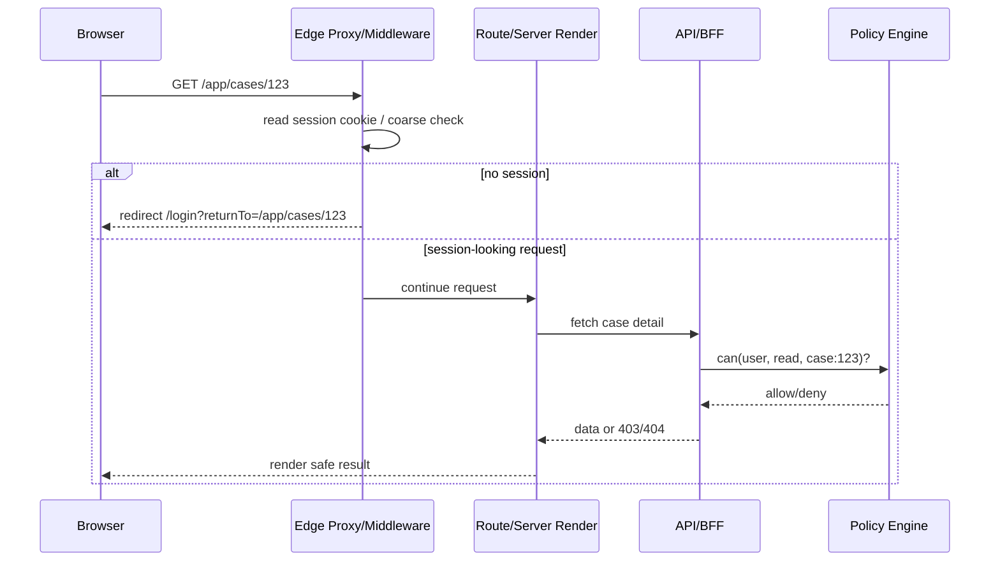
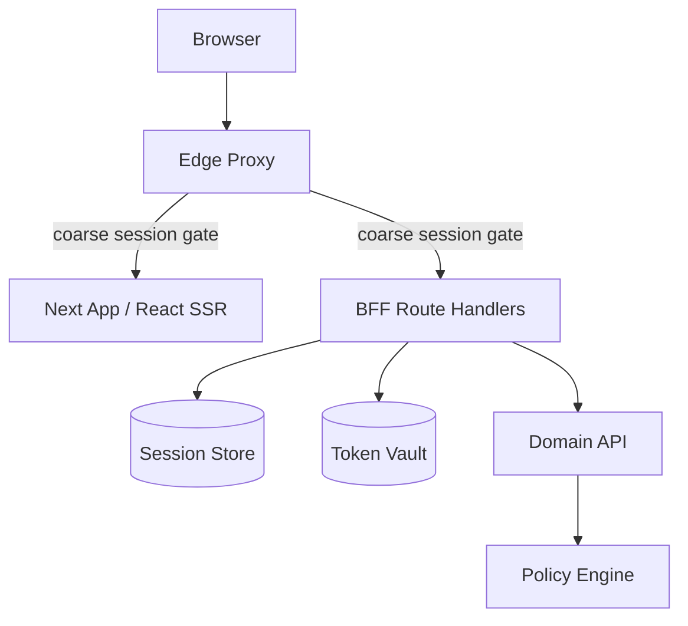

# Part 075 — Edge Middleware Auth

Edge middleware is attractive because it runs before the route is rendered.

That makes it useful for:

```txt
redirecting anonymous users away from authenticated areas
blocking obvious unauthenticated requests early
attaching request context headers
normalizing tenant routing
performing coarse route segmentation
preventing protected layout flash
```

But edge middleware is not a magical security boundary.

The dangerous belief is:

```txt
If middleware protects the route, the route is secure.
```

The correct model is:

```txt
Edge middleware can be a coarse authentication gate.
Server loaders, route handlers, server actions, and APIs still enforce authorization.
```

In Next.js terminology, the modern file convention is `proxy.ts`/`proxy.js` for code that executes before routes are rendered. Older materials often call this `middleware.ts`. The conceptual pattern is the same: a pre-route interception layer that can redirect, rewrite, or shape requests.

---

## 1. Why edge auth exists

React applications have a timing problem.

A pure client-side guard runs after:

```txt
HTML loaded
JS downloaded
React booted
component tree rendered enough to decide auth
```

That is late.

For authenticated layouts, late auth causes:

```txt
protected shell flash
wrong navigation menu flash
loading skeleton for a user who should be redirected
unnecessary data requests
confusing back-button behavior
SEO/indexing mistakes for protected routes
```

Edge middleware moves the first decision earlier:



Notice the two-level design:

```txt
Edge middleware checks whether the request is plausibly authenticated.
The data/API/resource layer checks whether the user may access the resource.
```

---

## 2. What edge middleware is good at

Use edge auth for **coarse decisions**.

Good use cases:

```txt
anonymous vs authenticated route groups
public vs app shell separation
login page redirect if already signed in
organization slug normalization
locale/region/tenant routing
basic bot/rate-limit hints
correlation ID injection
cache-control safety headers for protected route groups
redirect loop prevention
```

Example route groups:

```txt
/                  public marketing
/login             anonymous-only auth route
/app               authenticated shell
/app/:tenant       authenticated tenant shell
/app/:tenant/admin authenticated + admin navigation shell
/api/bff/*         authenticated BFF endpoints
```

Edge middleware can make these routes behave consistently.

---

## 3. What edge middleware is bad at

Do not use edge middleware as your only authorization layer.

Bad use cases:

```txt
object-level authorization
field-level authorization
workflow transition authorization
separation-of-duties checks
permission checks that require fresh database state
large policy evaluation
complex organization graph traversal
billing entitlement calculation
row-level filtering
file/object access enforcement
mutation authorization
```

Why?

Because edge middleware is usually far away from the full domain context.

It often has limited access to:

```txt
fresh resource state
transactional data
database joins
policy trace
permission graph consistency
backend secrets
Node-only libraries
large dependency bundles
```

Even if it can technically call a policy service, that does not always mean it should.

A bad edge middleware becomes a high-latency, high-blast-radius global dependency.

---

## 4. The core invariant

```txt
Middleware can decide where the request should go.
Middleware must not be the only place that decides what the user can do.
```

A secure app keeps these boundaries separate:

| Layer | Responsibility | Security authority? |
|---|---|---|
| Edge middleware/proxy | Coarse gate, redirect, request shaping | Partial |
| Server Component / loader | Session projection, safe data preparation | Partial |
| Route Handler / BFF | API boundary, CSRF, mutation endpoint | Yes for its endpoint |
| Domain service | Resource authorization and business invariant | Yes |
| Policy engine | Decision evaluation | Yes |
| React component | Exposure control and UX | No |

Frontend engineers often want middleware to solve everything because it is central.

But central is not the same as authoritative.

---

## 5. Minimal edge auth shape

The minimum useful middleware does three things:

```txt
1. classify route
2. inspect session signal
3. redirect or continue
```

Pseudo-code:

```ts
// proxy.ts or middleware.ts depending on framework version/convention
import { NextRequest, NextResponse } from "next/server";

const AUTH_COOKIE = "__Host-app_session";

const PUBLIC_PATHS = ["/", "/pricing", "/docs"];
const AUTH_PATHS = ["/login", "/signup", "/callback"];
const APP_PREFIX = "/app";

function isPublicPath(pathname: string) {
  return PUBLIC_PATHS.some((p) => pathname === p || pathname.startsWith(`${p}/`));
}

function isAuthPath(pathname: string) {
  return AUTH_PATHS.some((p) => pathname === p || pathname.startsWith(`${p}/`));
}

function safeInternalReturnTo(req: NextRequest) {
  return req.nextUrl.pathname + req.nextUrl.search;
}

export function proxy(req: NextRequest) {
  const { pathname } = req.nextUrl;
  const session = req.cookies.get(AUTH_COOKIE)?.value;

  if (isPublicPath(pathname)) {
    return NextResponse.next();
  }

  if (isAuthPath(pathname)) {
    if (session) {
      return NextResponse.redirect(new URL("/app", req.url));
    }
    return NextResponse.next();
  }

  if (pathname.startsWith(APP_PREFIX) && !session) {
    const login = new URL("/login", req.url);
    login.searchParams.set("returnTo", safeInternalReturnTo(req));
    return NextResponse.redirect(login);
  }

  return NextResponse.next();
}
```

This does not prove the session is valid.

It only proves that the request contains a session-looking signal.

That may be enough to prevent anonymous layout rendering, but it is not enough to authorize data.

---

## 6. Should middleware verify the session?

There are three common levels.

### Level 1 — Cookie presence check

```txt
Check that a session cookie exists.
Do not verify it.
Redirect anonymous users.
```

Pros:

```txt
fast
cheap
minimal edge dependencies
works with opaque server sessions
```

Cons:

```txt
stale/revoked cookies may pass
corrupt cookies may pass
authenticated shell may render before server rejects
```

Best for:

```txt
coarse route redirect only
```

### Level 2 — Stateless verification

```txt
Verify signed/encrypted session token or JWT at edge.
```

Pros:

```txt
stronger coarse gate
can reject expired/tampered tokens early
less load on origin
```

Cons:

```txt
revocation is hard
claims may be stale
key rotation must work at edge
JWT size may hurt every request
complex crypto/dependency constraints
```

Best for:

```txt
short-lived signed session envelopes
low-risk route gating
systems with reliable key distribution
```

### Level 3 — Remote introspection/session lookup

```txt
Call session service or policy service from edge.
```

Pros:

```txt
fresh revocation
centralized session truth
can support device/session invalidation
```

Cons:

```txt
latency on every protected request
edge-to-origin coupling
outage amplification
harder caching semantics
risk of redirect storm during partial outage
```

Best for:

```txt
high-security environments with explicit SLOs
small set of protected entry points
risk-adaptive checks
```

A practical default:

```txt
Use middleware for route classification + lightweight session signal.
Use server/BFF/domain services for fresh authorization.
```

---

## 7. Edge runtime limitations matter

Edge runtimes are not equivalent to Node.js runtimes.

Design as if edge has constraints around:

```txt
available APIs
crypto libraries
TCP/database drivers
filesystem access
large packages
cold starts
regional consistency
secret access patterns
request body handling
```

This affects auth design.

For example:

```txt
Do not put a heavy ORM in edge middleware.
Do not require database joins in edge middleware.
Do not import a full admin SDK if only cookie presence is needed.
Do not make every navigation depend on a slow policy endpoint.
```

The edge layer should stay small.

A healthy middleware file often looks boring.

Boring is good.

---

## 8. Route matching strategy

A common production bug is middleware running on too many paths.

You usually do not want auth middleware on:

```txt
static assets
images
favicon
robots.txt
public health checks
public OAuth callback assets
internal framework chunks
```

Example matcher idea:

```ts
export const config = {
  matcher: [
    "/((?!_next/static|_next/image|favicon.ico|robots.txt|sitemap.xml).*)",
  ],
};
```

But route matching must be reviewed against your actual framework/version.

The stronger design is explicit classification:

```ts
type RouteClass =
  | "public"
  | "anonymous_only"
  | "authenticated"
  | "tenant_authenticated"
  | "admin_shell"
  | "api_bff"
  | "asset";
```

Then every branch is intentional.

```ts
function classify(pathname: string): RouteClass {
  if (pathname.startsWith("/_next/")) return "asset";
  if (pathname === "/login") return "anonymous_only";
  if (pathname.startsWith("/app/admin")) return "admin_shell";
  if (pathname.startsWith("/app")) return "authenticated";
  if (pathname.startsWith("/api/bff")) return "api_bff";
  return "public";
}
```

This makes route security review easier.

---

## 9. Redirect loop prevention

Middleware redirect loops are easy to create.

Classic loop:

```txt
/app -> middleware sees no valid session -> /login
/login -> middleware sees no valid session -> /login
```

Another loop:

```txt
/login -> session cookie exists but expired -> /app
/app -> origin rejects session -> /login
/login -> cookie still exists -> /app
```

The mitigation is not one trick.

Use layered loop defense:

```txt
separate anonymous-only routes from authenticated routes
ignore callback routes in normal auth guard
validate returnTo as internal path
clear bad session cookies when server detects invalid session
include loop counters only as diagnostic fallback
make /logout and /session-expired safe terminal states
```

Example:

```ts
function redirectToLogin(req: NextRequest, reason: string) {
  const login = new URL("/login", req.url);
  login.searchParams.set("returnTo", req.nextUrl.pathname + req.nextUrl.search);
  login.searchParams.set("reason", reason);
  return NextResponse.redirect(login);
}
```

Do not put raw error details into the redirect URL.

Keep reason values typed and public-safe:

```txt
missing_session
expired_session
step_up_required
tenant_required
```

---

## 10. Return URL safety

Never allow arbitrary absolute return URLs.

Bad:

```ts
const login = new URL("/login", req.url);
login.searchParams.set("returnTo", req.nextUrl.href); // may preserve attacker-controlled form
```

Better:

```ts
function buildReturnTo(req: NextRequest) {
  return req.nextUrl.pathname + req.nextUrl.search;
}
```

Then validate again on login completion:

```ts
export function normalizeReturnTo(input: string | null): string {
  if (!input) return "/app";

  try {
    // Force relative-only paths.
    if (!input.startsWith("/")) return "/app";
    if (input.startsWith("//")) return "/app";

    const url = new URL(input, "https://app.example.test");

    if (url.origin !== "https://app.example.test") return "/app";
    if (url.pathname.startsWith("/login")) return "/app";
    if (url.pathname.startsWith("/callback")) return "/app";

    return url.pathname + url.search;
  } catch {
    return "/app";
  }
}
```

Return URL handling belongs to the same threat model as OAuth callback hardening.

A redirect is an authority transfer.

Treat it like one.

---

## 11. Middleware and authorization claims

You may be tempted to put roles in a cookie/JWT and check them at edge.

Example:

```ts
if (pathname.startsWith("/admin") && session.role !== "admin") {
  return NextResponse.redirect(new URL("/app", req.url));
}
```

This can be acceptable only as an **admin shell exposure gate**.

It cannot be the final admin authorization check.

Why?

```txt
role claim may be stale
user may have been deprovisioned
admin permission may be resource-scoped
role may be tenant-specific
separation-of-duties may depend on the action
server mutation endpoint can be called directly
```

Safer wording:

```txt
Middleware may prevent non-admin-looking users from seeing the admin shell.
Admin APIs must still enforce admin authorization.
```

---

## 12. Tenant-aware middleware

Multi-tenant apps often encode tenant in path:

```txt
/app/acme/cases/123
```

Middleware can normalize tenant context.

It can check:

```txt
is tenant slug syntactically valid?
does request have a tenant selection cookie?
does URL tenant match selected tenant?
should user be sent to tenant picker?
```

But be careful.

Middleware usually should not be the only tenant membership check.

Bad:

```txt
Edge middleware says tenant slug is valid, therefore user can access tenant.
```

Correct:

```txt
Edge middleware selects/normalizes tenant context.
Server loader/API verifies tenant membership and resource access.
```

Example shape:

```ts
function extractTenant(pathname: string) {
  const match = pathname.match(/^\/app\/([^/]+)/);
  return match?.[1] ?? null;
}

export function proxy(req: NextRequest) {
  const tenantSlug = extractTenant(req.nextUrl.pathname);
  const res = NextResponse.next();

  if (tenantSlug) {
    // Request context hint only. Server must verify.
    res.headers.set("x-request-tenant", tenantSlug);
  }

  return res;
}
```

Do not trust client-controlled headers like `x-request-tenant` from the browser.

If you use internal request headers, overwrite them at the trusted edge/server boundary.

---

## 13. Request context headers

Middleware is useful for attaching context.

Examples:

```txt
x-request-id
x-route-class
x-auth-signal
x-tenant-slug
x-auth-redirect-reason
```

But headers are dangerous if misused.

Rules:

```txt
never trust incoming client-provided internal headers
strip/overwrite internal headers before forwarding
never put raw token values in diagnostic headers
never put full user profile in headers
never put permission matrix in headers
```

Example:

```ts
export function proxy(req: NextRequest) {
  const requestHeaders = new Headers(req.headers);

  requestHeaders.delete("x-user-id");
  requestHeaders.delete("x-tenant-id");
  requestHeaders.delete("x-permission-debug");

  requestHeaders.set("x-request-id", crypto.randomUUID());
  requestHeaders.set("x-route-class", classify(req.nextUrl.pathname));

  return NextResponse.next({
    request: {
      headers: requestHeaders,
    },
  });
}
```

Only downstream trusted server code should consume these.

---

## 14. Cache safety at edge

Auth and edge caching are a dangerous combination.

Protected responses should avoid being cached as public/shared responses.

For authenticated route groups, middleware can add defensive headers:

```ts
const res = NextResponse.next();
res.headers.set("Cache-Control", "no-store");
res.headers.set("Vary", "Cookie, Authorization");
return res;
```

But understand the limit:

```txt
Middleware-set headers may not cover every downstream response in every architecture.
Route handlers and BFF endpoints should set their own cache-control.
```

Do not rely on one global edge header to protect all sensitive responses.

Sensitive data endpoints should own their own cache policy.

---

## 15. Middleware with BFF architecture

In a BFF design, edge middleware can protect the app shell and BFF endpoints.



A good BFF auth split:

| Concern | Edge | BFF/Server |
|---|---:|---:|
| Is route public or protected? | Yes | Maybe |
| Does session cookie exist? | Yes | Yes |
| Is session valid/revoked? | Optional | Yes |
| Should access token refresh? | No | Yes |
| Can user read case `123`? | No | Yes |
| Can user approve transition? | No | Yes |
| Should response be audited? | Minimal | Yes |

Edge should not become the token vault.

Token refresh is usually a server/BFF concern.

---

## 16. Middleware for anonymous-only routes

Login pages have their own edge logic.

If the user already has a valid or plausible session, sending them to login creates bad UX.

```ts
if (isAuthPath(pathname) && session) {
  const returnTo = req.nextUrl.searchParams.get("returnTo");
  const safe = normalizeReturnTo(returnTo);
  return NextResponse.redirect(new URL(safe, req.url));
}
```

But be careful with stale cookies.

If the session-looking cookie is invalid, this can cause loop:

```txt
/login -> /app -> server rejects -> /login -> /app
```

The server rejection path should clear invalid session cookies.

For example:

```txt
GET /app
server detects invalid session
response clears __Host-app_session
redirects /login?reason=expired_session
```

Middleware alone cannot cleanly solve stale session loops unless it can validate the session.

---

## 17. Middleware and OAuth callback routes

OAuth/OIDC callback routes need special treatment.

Do not apply normal authenticated route guard to callback.

Callback may arrive before the app session exists.

```txt
/callback?code=...&state=...  -> no app session yet
```

If middleware redirects callback to `/login` because no session exists, you break the flow.

Route classification should include:

```txt
public_auth_callback
```

But callback is not “public page” in a product sense.

It is a protocol endpoint.

It must still perform:

```txt
state validation
nonce validation
PKCE verifier lookup
authorization code exchange
session creation
safe returnTo normalization
URL cleanup
```

---

## 18. Middleware and CSRF

Middleware can help with CSRF, but it should not be the only CSRF layer.

Possible middleware checks:

```txt
block unsafe methods without Origin/Referer on same-origin sensitive routes
attach CSRF expectation headers
reject cross-site requests to BFF endpoints
```

But CSRF validation is usually better placed at the mutation endpoint.

Why?

```txt
endpoint knows whether operation is sensitive
endpoint can validate CSRF token against session
endpoint can return typed error
endpoint participates in audit
```

For cookie-based BFF endpoints:

```txt
POST /api/bff/cases/123/approve
must validate session
must validate CSRF/origin policy
must authorize action
must validate business transition
must audit
```

Middleware can be a coarse pre-filter.

It cannot replace mutation-level checks.

---

## 19. Error semantics

Middleware has fewer response options than full application routes.

Common middleware responses:

```txt
redirect /login
redirect /session-expired
redirect /select-tenant
rewrite /forbidden
return 401/403 for API-like paths
continue
```

Use path-aware semantics.

For browser page navigation:

```txt
missing session -> redirect /login
expired session -> redirect /session-expired or /login?reason=expired_session
forbidden shell -> redirect /app or render forbidden page
```

For API/BFF endpoints:

```txt
missing session -> 401 JSON/problem response
expired session -> 401 JSON/problem response
forbidden -> 403 JSON/problem response
```

Do not redirect API clients to HTML login pages.

That creates impossible client parsing failures.

---

## 20. A typed middleware policy

A stronger middleware does not scatter path checks.

It uses a small policy table.

```ts
type RoutePolicy = {
  pattern: RegExp;
  className: "public" | "anonymous" | "authenticated" | "api";
  cache: "public" | "private" | "no-store";
};

const policies: RoutePolicy[] = [
  { pattern: /^\/$/, className: "public", cache: "public" },
  { pattern: /^\/login$/, className: "anonymous", cache: "no-store" },
  { pattern: /^\/callback$/, className: "public", cache: "no-store" },
  { pattern: /^\/app(\/.*)?$/, className: "authenticated", cache: "no-store" },
  { pattern: /^\/api\/bff(\/.*)?$/, className: "api", cache: "no-store" },
];

function resolvePolicy(pathname: string): RoutePolicy {
  return policies.find((p) => p.pattern.test(pathname)) ?? {
    pattern: /.*/,
    className: "public",
    cache: "public",
  };
}
```

Then behavior becomes reviewable:

```ts
export function proxy(req: NextRequest) {
  const policy = resolvePolicy(req.nextUrl.pathname);
  const hasSession = Boolean(req.cookies.get("__Host-app_session")?.value);

  if (policy.className === "authenticated" && !hasSession) {
    return redirectToLogin(req, "missing_session");
  }

  if (policy.className === "api" && !hasSession) {
    return NextResponse.json(
      { type: "auth.missing_session", title: "Authentication required" },
      { status: 401, headers: { "Cache-Control": "no-store" } },
    );
  }

  const res = NextResponse.next();
  if (policy.cache === "no-store") {
    res.headers.set("Cache-Control", "no-store");
  }
  return res;
}
```

This is easier to test than ad-hoc `if` statements.

---

## 21. Testing edge auth

Test middleware like a routing/security component, not like a React component.

Minimum test matrix:

| Case | Expected result |
|---|---|
| anonymous user visits `/app` | redirect to `/login?returnTo=/app` |
| anonymous user visits `/login` | continue |
| session-looking user visits `/login` | redirect to `/app` or safe returnTo |
| anonymous user visits `/callback` | continue |
| anonymous API request to `/api/bff/me` | `401` JSON/problem, not HTML redirect |
| static asset request | continue without auth redirect |
| malicious `returnTo=https://evil.example` | normalized to safe internal path |
| protected path with stale cookie | origin clears cookie and redirects safely |
| tenant path mismatch | route to tenant picker or continue for server verification |

Also test matchers.

A broken matcher can silently remove auth from a route group.

---

## 22. Observability

Log middleware decisions carefully.

Useful fields:

```txt
request_id
route_class
decision: continue | redirect_login | reject_401 | rewrite_forbidden
reason: missing_session | anonymous_only | invalid_return_to
pathname_template, not raw sensitive URL
has_session_signal: true/false
tenant_slug_present: true/false
```

Avoid logging:

```txt
raw cookie values
authorization headers
full query strings with auth callback code
PII-rich URLs
policy trace with sensitive resource metadata
```

Metrics:

```txt
middleware.redirect.login.count
middleware.reject.unauthenticated.count
middleware.redirect.loop.detected.count
middleware.route_class.unknown.count
middleware.latency.p95
middleware.session_signal.present.rate
```

If middleware is globally deployed, noisy failures become global incidents.

Make it observable.

---

## 23. Failure modes

| Failure | Cause | Mitigation |
|---|---|---|
| Redirect loop | stale cookie + anonymous-only redirect | clear invalid cookies server-side; safe terminal routes |
| Protected shell flash | client-only guard | middleware coarse gate + server data guard |
| Admin API bypass | admin shell only protected at middleware | enforce server/API authorization |
| Static asset breakage | matcher catches assets | explicit matcher exclusions |
| OAuth callback broken | callback guarded as authenticated route | classify callback as protocol route |
| Edge latency spike | remote introspection every request | avoid or cache carefully; move fresh check to origin |
| Stale role at edge | role claim in cookie/JWT | edge as exposure gate only; server validates fresh permission |
| Cache leak | protected response cached publicly | `no-store`, `Vary`, route-owned cache policy |
| Header spoofing | trusting client `x-user-id` | strip/overwrite internal headers |

---

## 24. Production checklist

Before using edge middleware for auth, answer these:

```txt
Which routes are public, anonymous-only, authenticated, API, callback, or asset?
Can a protected route be reached without middleware because of matcher gaps?
Does middleware redirect pages and return JSON for API paths?
Are return URLs internal-only and normalized?
Are OAuth callback routes excluded from normal auth redirect?
Does server-side code still validate session and authorization?
Are internal headers stripped/overwritten?
Are protected responses no-store?
Can stale session cookies be cleared by server rejection paths?
Are route decisions logged without leaking secrets?
Can the app survive edge/session service partial outage?
```

The goal is not to make middleware clever.

The goal is to make auth failure early, predictable, and boring.

---

## 25. Final mental model

```txt
Edge middleware is a doorperson.
It can say: this entrance is public, login-only, or app-only.

It is not the judge.
It does not know every object, workflow, approval rule, or policy exception.

The resource boundary remains the authority.
```

If you remember one thing:

```txt
Use edge middleware to reduce wrong navigation.
Use server/domain authorization to prevent wrong access.
```

---

## References

- Next.js Documentation — `proxy.js` file convention and pre-route execution model.
- Next.js Documentation — Authentication guide for App Router concepts.
- Next.js Documentation — `cookies()` API for reading request cookies and writing outgoing cookies in supported server contexts.
- MDN — HTTP cookies and secure cookie attributes.
- OWASP Authorization Cheat Sheet.
- OWASP CSRF Prevention Cheat Sheet.
