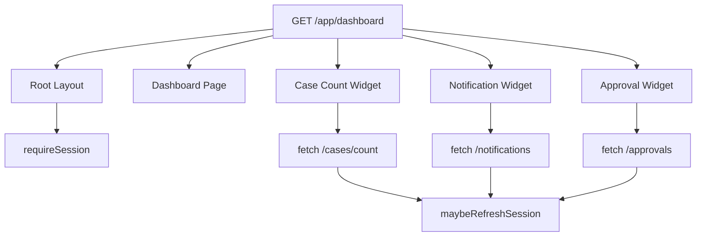
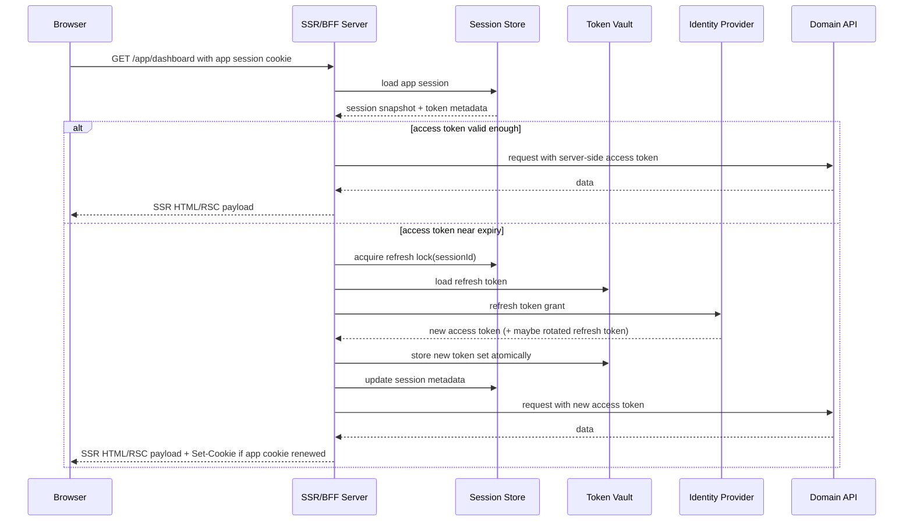
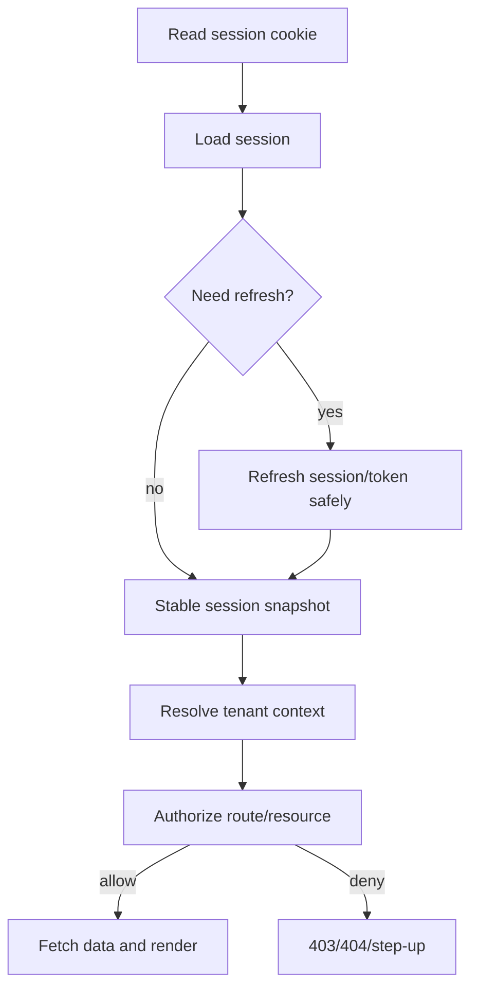

# Part 076 — SSR Session Refresh

SSR makes auth feel simpler because the server can read cookies before rendering.

But session refresh becomes harder.

In a client-only SPA, refresh usually happens in an API client interceptor.

In SSR, refresh can happen while rendering:

```txt
layout
page
server component
route handler
server action
BFF endpoint
middleware/proxy
```

If multiple server components fetch data at the same time, you can accidentally trigger multiple refresh attempts for the same session.

That creates:

```txt
refresh token rotation races
stale cookie writes
hydration mismatch
partial render failures
redirect loops
cache contamination
```

The core idea:

```txt
Refresh is not a helper function.
Refresh is a session state transition.
```

Treat it with the same discipline as a distributed lock and a security boundary.

---

## 1. The problem SSR introduces

In SSR/RSC, rendering is no longer a single linear call stack.

A request can cause parallel data dependencies:



If each widget independently calls `maybeRefreshSession()`, one page render may attempt refresh three times.

That is dangerous when refresh tokens are rotated.

Only one refresh attempt should win.

---

## 2. Refresh-before-render vs refresh-during-fetch

There are two broad strategies.

### Strategy A — Refresh before render

```txt
At the request boundary, load session, decide whether refresh is needed, refresh once, then render everything with a stable session snapshot.
```

Pros:

```txt
single refresh decision
fewer partial render failures
stable session projection
simpler cache keys
less hydration mismatch
```

Cons:

```txt
adds request-boundary work even if page data is public-ish
requires a central request/auth boundary
harder if framework does not expose one cleanly
```

### Strategy B — Refresh during fetch

```txt
Each server-side API fetch handles 401/expired token and triggers refresh if needed.
```

Pros:

```txt
localized handling
works when token expiry is discovered by downstream API
can avoid unnecessary refresh
```

Cons:

```txt
race-prone
waterfall-prone
harder cookie mutation
more repeated logic
may render inconsistent session state
```

A robust architecture often combines both:

```txt
Refresh proactively once near the request boundary when expiry is near.
Still handle reactive 401 from downstream APIs safely.
```

---

## 3. The SSR session snapshot

Every server render should work from a stable session snapshot.

```ts
type SessionSnapshot = {
  sessionId: string;
  userId: string;
  tenantId: string | null;
  expiresAt: string;
  refreshedAt: string | null;
  authTime: string;
  assuranceLevel: "aal1" | "aal2" | "aal3";
  permissionEpoch: number;
};
```

This snapshot is not the full token set.

It should not include:

```txt
refresh token
access token
provider token
session secret
raw JWT unless needed server-side only
policy trace
sensitive claims not required by UI
```

React receives only a safe projection.

```ts
type ClientSessionProjection = {
  kind: "authenticated";
  user: {
    id: string;
    displayName: string;
  };
  tenant: {
    id: string;
    slug: string;
    displayName: string;
  } | null;
  expiresAt: string;
  assuranceLevel: "aal1" | "aal2" | "aal3";
  permissionEpoch: number;
};
```

The render should use one snapshot.

If the session changes during the same request, you need a clear rule.

---

## 4. Cookie mutation boundary

A major SSR trap:

```txt
Not every server-side place that can read cookies can write cookies.
```

In modern Next.js App Router, cookie reading is available in Server Components via `cookies()`, while writing outgoing cookies belongs to supported mutation contexts such as Server Actions or Route Handlers.

This matters for refresh.

If a Server Component detects that refresh is needed but cannot set the new cookie, you get a broken state:

```txt
server rendered with new token internally
browser still holds old cookie
next request repeats refresh or fails
```

Therefore, design a single refresh-capable boundary:

```txt
Route Handler / BFF endpoint
Server Action when invoked as mutation
explicit session refresh endpoint
request bootstrap endpoint
```

Do not hide cookie writes deep inside random server components.

---

## 5. Recommended BFF refresh flow

In a BFF session model:

```txt
browser holds HttpOnly app session cookie
server holds refresh token / provider token in token vault
server refreshes provider tokens when needed
browser never sees provider refresh token
```

Flow:



Key point:

```txt
Only the server sees provider tokens.
```

The browser sees only the app session cookie and safe session projection.

---

## 6. Refresh threshold

Do not refresh only when `expiresAt <= now`.

By then, concurrent requests may already be failing.

Use a threshold:

```ts
const REFRESH_WINDOW_SECONDS = 120;

function shouldRefresh(expiresAtMs: number, nowMs: number) {
  return expiresAtMs - nowMs <= REFRESH_WINDOW_SECONDS * 1000;
}
```

But do not use a huge window either.

A huge window causes excessive refresh.

A practical model:

```txt
access token lifetime: short
refresh threshold: small buffer for network/render time
clock skew leeway: explicit and bounded
refresh lock TTL: short
server session idle/absolute expiry: independent
```

Expiry should be modeled explicitly:

```ts
type TokenTiming = {
  accessTokenExpiresAt: number;
  refreshTokenExpiresAt: number;
  appSessionExpiresAt: number;
  idleExpiresAt: number;
  absoluteExpiresAt: number;
};
```

---

## 7. Single-flight refresh on the server

Single-flight means:

```txt
For one session/token family, only one refresh operation runs at a time.
Other callers wait for the result or reuse the updated token state.
```

In one Node process, you might use an in-memory map.

```ts
const inFlightRefresh = new Map<string, Promise<RefreshResult>>();

export async function refreshSingleFlight(sessionId: string) {
  const existing = inFlightRefresh.get(sessionId);
  if (existing) return existing;

  const promise = actuallyRefresh(sessionId).finally(() => {
    inFlightRefresh.delete(sessionId);
  });

  inFlightRefresh.set(sessionId, promise);
  return promise;
}
```

But this is not enough for distributed SSR.

Your app may run on:

```txt
multiple server instances
multiple regions
serverless concurrent invocations
edge + origin split
```

So the real lock usually belongs in shared storage:

```txt
session store row lock
distributed lock
compare-and-swap token version
refresh token family version
```

---

## 8. Atomic refresh with token version

Refresh token rotation requires atomicity.

Bad sequence:

```txt
1. read refresh token A
2. call IdP with A
3. receive refresh token B
4. write B
```

If two requests do this concurrently, one may reuse A after A has been invalidated.

Better model:

```ts
type TokenRecord = {
  sessionId: string;
  refreshTokenHash: string;
  encryptedRefreshToken: string;
  accessTokenExpiresAt: number;
  version: number;
};
```

Refresh transaction:

```txt
1. load token record with version N
2. acquire lock or compare-and-swap intent
3. call IdP with current refresh token
4. receive new token set
5. update only if version still N
6. write version N+1
7. release lock
```

Pseudo-code:

```ts
async function refreshTokenFamily(sessionId: string) {
  return await tokenStore.withSessionLock(sessionId, async () => {
    const current = await tokenStore.get(sessionId);

    if (!shouldRefresh(current.accessTokenExpiresAt, Date.now())) {
      return current;
    }

    const next = await idp.refresh(decrypt(current.encryptedRefreshToken));

    await tokenStore.updateIfVersion(sessionId, current.version, {
      encryptedAccessToken: encrypt(next.accessToken),
      encryptedRefreshToken: encrypt(next.refreshToken ?? current.refreshToken),
      accessTokenExpiresAt: next.accessTokenExpiresAt,
      version: current.version + 1,
    });

    return await tokenStore.get(sessionId);
  });
}
```

If `updateIfVersion` fails, reload the token record instead of retrying blindly.

---

## 9. Reactive refresh after downstream 401

Even with proactive refresh, downstream APIs can return `401`.

Reasons:

```txt
access token revoked
clock skew
key rotation
scope/audience mismatch
token family revoked
IdP incident
API auth cache stale
```

Handle it carefully:

```txt
Only retry once.
Only retry idempotent requests automatically.
For mutations, use idempotency keys or do not auto-replay.
If refresh fails, clear session and return typed auth error.
```

Server-side fetch wrapper:

```ts
type FetchAuthMode = "idempotent" | "mutation";

async function fetchWithServerAuth(input: RequestInfo, init: RequestInit & { authMode: FetchAuthMode }) {
  const token = await getValidAccessTokenForRequest();

  let res = await fetch(input, {
    ...init,
    headers: {
      ...init.headers,
      Authorization: `Bearer ${token.value}`,
    },
  });

  if (res.status !== 401) return res;

  if (init.authMode === "mutation") {
    // Do not blindly replay non-idempotent mutations.
    return res;
  }

  await refreshSingleFlight(token.sessionId);
  const next = await getValidAccessTokenForRequest();

  res = await fetch(input, {
    ...init,
    headers: {
      ...init.headers,
      Authorization: `Bearer ${next.value}`,
    },
  });

  return res;
}
```

For mutation endpoints, prefer:

```txt
idempotency key
server-side transaction identity
explicit retry contract
```

---

## 10. Refresh and RSC caching

SSR/RSC data fetching can accidentally cache authenticated data.

Auth-sensitive fetches should usually be:

```ts
await fetch(url, {
  cache: "no-store",
});
```

or framework-equivalent dynamic behavior.

A dangerous pattern:

```ts
const me = await fetch("https://api.example.com/me").then(r => r.json());
```

If the framework caches this incorrectly, one user's projection can leak or be reused.

Safer wrapper:

```ts
export async function authFetch(input: string, init: RequestInit = {}) {
  const session = await requireServerSession();
  const token = await getValidAccessTokenForRequest(session);

  return fetch(input, {
    ...init,
    cache: "no-store",
    headers: {
      ...init.headers,
      Authorization: `Bearer ${token.value}`,
      "X-Request-Session": session.sessionId,
    },
  });
}
```

Also avoid module-level session variables.

Bad:

```ts
let currentSession: SessionSnapshot | null = null;
```

In a server runtime, module-level state can cross requests.

---

## 11. Hydration mismatch

Hydration mismatch happens when server and client disagree.

For auth, common cases:

```txt
server rendered authenticated page
client bootstraps as anonymous
server used refreshed session but browser cookie was not updated
client cache still has old permission epoch
user logs out in another tab between SSR and hydration
tenant switched in another tab
```

Mitigation:

```txt
embed safe session projection from server
include auth epoch / session version
clear client caches when epoch changes
never expose tokens in projection
prefer no-store for authenticated SSR
handle client-side session reconciliation after hydration
```

Example projection:

```tsx
<AuthProvider
  initialSession={{
    kind: "authenticated",
    user: { id: user.id, displayName: user.displayName },
    tenant: tenantProjection,
    expiresAt: session.expiresAt,
    permissionEpoch: session.permissionEpoch,
    sessionVersion: session.version,
  }}
>
  {children}
</AuthProvider>
```

Client bootstrap should compare:

```txt
initial session version
current /session endpoint version
cross-tab auth epoch
```

If they differ, revalidate.

---

## 12. Where to refresh in Next.js-style App Router

A practical split:

| Location | Read session? | Write refreshed cookie? | Good for refresh? |
|---|---:|---:|---:|
| Proxy/middleware | Yes, limited | Limited/use carefully | Usually no |
| Server Component | Yes | Not generally for outgoing mutation | Usually no direct cookie write |
| Route Handler | Yes | Yes | Yes |
| Server Action | Yes | Yes in mutation context | Sometimes |
| BFF endpoint | Yes | Yes | Yes |
| API/domain service | Yes | Not browser cookie | Token/session backend refresh yes |

A robust pattern:

```txt
Server Component calls session bootstrap/read helper.
If refresh is required, delegate to Route Handler/BFF/session service or ensure refresh occurred before render.
Mutations perform their own fresh auth check and refresh if needed.
```

Do not scatter cookie mutation across random render helpers.

---

## 13. Request-scoped session loader

Build a request-scoped helper.

It should:

```txt
read session cookie
load session record
refresh if allowed and needed
return stable snapshot
memoize within request
never expose raw tokens to Client Components
```

In React/Next-like environments, request-scoped memoization may use framework-provided caching primitives carefully.

Conceptual pseudo-code:

```ts
type RequireSessionOptions = {
  allowRefresh: boolean;
  requiredAssurance?: "aal1" | "aal2" | "aal3";
};

export async function requireSessionForRequest(options: RequireSessionOptions) {
  const cookie = await readSessionCookie();
  if (!cookie) throw new AuthError("missing_session");

  const session = await sessionStore.load(cookie.sessionId);
  if (!session) throw new AuthError("invalid_session");

  if (isExpired(session)) throw new AuthError("expired_session");

  if (options.allowRefresh && shouldRenewAppSession(session)) {
    return await renewAppSessionSingleFlight(session.id);
  }

  if (options.requiredAssurance && !meetsAssurance(session, options.requiredAssurance)) {
    throw new AuthError("step_up_required");
  }

  return toSessionSnapshot(session);
}
```

Then data loaders use the snapshot:

```ts
export async function DashboardPage() {
  const session = await requireSessionForRequest({ allowRefresh: true });
  const data = await getDashboardData(session);
  return <Dashboard initialData={data} />;
}
```

---

## 14. App session renewal vs provider token refresh

Do not confuse these two.

### App session renewal

```txt
Your application extends or rotates its own session cookie/session record.
```

Example:

```txt
idle timeout extended from 14:00 to 14:30
session cookie renewed
session version incremented
```

### Provider token refresh

```txt
Your server refreshes OAuth access token using provider refresh token.
```

Example:

```txt
access token for downstream API expires in 60 seconds
server uses refresh token grant
new access token stored in token vault
```

They may happen together, but they are different state transitions.

Keep separate fields:

```ts
type SessionRecord = {
  id: string;
  idleExpiresAt: number;
  absoluteExpiresAt: number;
  cookieExpiresAt: number;
  permissionEpoch: number;
};

type ProviderTokenRecord = {
  sessionId: string;
  provider: "auth0" | "cognito" | "workos" | "custom";
  accessTokenExpiresAt: number;
  refreshTokenExpiresAt: number | null;
  tokenFamilyVersion: number;
};
```

---

## 15. Sliding sessions and absolute expiry

Sliding sessions improve UX.

But they can also create never-ending sessions if not bounded.

Use both:

```txt
idle timeout: extended by activity
absolute timeout: hard maximum lifetime
```

Example:

```ts
function canRenewSession(session: SessionRecord, now: number) {
  if (now >= session.absoluteExpiresAt) return false;
  if (now >= session.idleExpiresAt) return false;
  return true;
}
```

On every SSR request, do not renew blindly.

Use renewal threshold:

```txt
renew only when idle expiry is near
renew only for meaningful app activity
avoid renewing on asset requests/prefetches/health checks
avoid renewing on aggressive polling unless intentional
```

Otherwise a background tab can keep a session alive forever.

---

## 16. Prefetch and refresh

Modern routers/frameworks may prefetch routes.

If prefetch triggers refresh, you get strange behavior:

```txt
hovering a link renews session
background prefetch rotates token
prefetch races with active navigation
prefetch keeps session alive unintentionally
```

Treat prefetch as low-authority activity.

Policy:

```txt
prefetch may read cache-safe public data
prefetch should not renew idle session by default
prefetch should not perform provider token refresh unless required and explicit
prefetch must not perform mutations
```

If your framework exposes prefetch indicators, use them.

If not, be conservative about automatic renewal.

---

## 17. Concurrent SSR requests

A user may trigger multiple SSR requests:

```txt
open multiple tabs
hard refresh page
navigation + data request
parallel route segments
browser retry
CDN/origin retry
```

Concurrency-safe refresh needs:

```txt
session lock or token version CAS
refresh token family version
idempotent session renewal
clear failure semantics
bounded retry
metrics
```

Failure path:

```txt
if refresh token reuse is detected -> revoke session family -> force logout all tabs
if refresh lock times out -> return 503/degraded or retry once
if provider unavailable -> keep current valid token if still valid, otherwise degrade/reauth
```

Do not spin.

A refresh storm during IdP outage can take down your app.

---

## 18. SSR refresh and authorization

Refreshing session does not grant permission.

Common bug:

```txt
Session refreshed successfully, therefore page may render.
```

Correct:

```txt
Session refreshed successfully, therefore identity continuity is valid.
Now check authorization for the route/resource/action.
```

Sequence:



Refresh is AuthN/session continuity.

Authorization is still a separate decision.

---

## 19. Step-up and refresh

Step-up authentication has its own freshness rules.

A session can be valid but not fresh enough.

Example:

```txt
user logged in 8 hours ago
session is still valid
access token refreshed 2 minutes ago
user wants to approve high-risk payment
```

Refreshing access token does not increase authentication assurance.

The app should require step-up based on:

```txt
auth_time
acr/amr
assurance level
risk signal
sensitive action policy
```

Server response:

```json
{
  "type": "auth.step_up_required",
  "requiredAssurance": "aal2",
  "returnTo": "/app/payments/123/approve"
}
```

React then redirects to step-up flow.

Do not silently refresh and proceed.

---

## 20. Logout and refresh race

Logout racing with SSR refresh is common.

Timeline:

```txt
Tab A: user clicks logout
Tab B: hidden tab refreshes /app/dashboard
Server: refreshes session for Tab B
Tab A: logout clears cookie
Tab B: receives renewed cookie or rendered app
```

Mitigation:

```txt
session store has revokedAt/sessionVersion
logout revokes session server-side first
refresh checks revokedAt inside lock
Set-Cookie from stale refresh is rejected by version check
client auth epoch propagates logout across tabs
```

Server invariant:

```txt
A revoked session must not be renewed.
```

Do not rely only on browser cookie clearing.

---

## 21. Cookie write ordering

When SSR refresh writes cookies, response ordering matters.

Potential issue:

```txt
parallel route handlers write different Set-Cookie values
older response arrives after newer response
browser stores stale cookie
```

Mitigations:

```txt
centralize cookie write per request
include session version in cookie/session record
reject stale session versions server-side
avoid multiple refresh-capable endpoints firing concurrently
make refresh endpoint single-flight
```

If you use rotating encrypted session cookies, include a version or issued-at claim.

But remember:

```txt
browser cookie version is not authority
server session store is authority
```

---

## 22. SSR refresh and CDN

Authenticated SSR should usually avoid public CDN caching.

Dangerous:

```txt
SSR response varies by Cookie but cache does not vary correctly
```

Safer:

```txt
Cache-Control: no-store
Vary: Cookie, Authorization
private caching only when explicitly understood
```

For pages with mixed public/private content, split boundaries:

```txt
public shell/static marketing content can cache
private user/session data fetched from no-store endpoint
```

Do not let refresh behavior accidentally mark responses cacheable.

---

## 23. Testing SSR refresh

Minimum test matrix:

| Case | Expected result |
|---|---|
| valid session, token far from expiry | render without refresh |
| token near expiry | exactly one refresh for request |
| three parallel data fetches | single-flight refresh only |
| refresh token rotation race | one winner; others reuse new state |
| refresh fails due to invalid grant | session revoked; redirect/login typed error |
| provider outage but token still valid | render if policy allows; emit degraded metric |
| provider outage and token expired | fail closed; typed auth error |
| logout racing refresh | revoked session not renewed |
| SSR refreshed but cookie not writable | no hidden partial refresh; explicit failure/retry path |
| permission revoked during refresh | refresh may succeed, authorization must deny |
| tenant switched in another tab | cache/session projection invalidated |
| prefetch request near expiry | does not renew unless explicitly intended |

Test with concurrency.

Auth that works only in serial tests is not production auth.

---

## 24. Observability

Track refresh as a first-class operation.

Metrics:

```txt
session.refresh.attempt.count
session.refresh.success.count
session.refresh.failure.count
session.refresh.singleflight.wait.count
session.refresh.lock.timeout.count
session.refresh.rotation_reuse_detected.count
session.refresh.provider_latency.p95
session.refresh.per_request.count
session.render.auth_snapshot_mismatch.count
```

Logs should include:

```txt
request_id
session_id_hash
user_id_hash
tenant_id_hash
token_family_version
refresh_reason: proactive | reactive_401 | idle_renewal
result: success | invalid_grant | provider_unavailable | lock_timeout
```

Do not log:

```txt
access token
refresh token
raw cookie value
full JWT
authorization header
```

---

## 25. Anti-patterns

Avoid these:

```txt
refreshing token inside every server component
using module-level current user/session
retrying every 401 mutation automatically
refreshing session on every request, including assets/prefetch
storing provider refresh token in browser
assuming refreshed token means permission allowed
caching authenticated SSR without Vary/no-store discipline
writing cookies from multiple uncoordinated places
using edge middleware as refresh token vault
ignoring logout/refresh race
```

These usually work in demos.

They fail under real traffic.

---

## 26. Production checklist

Before shipping SSR session refresh, verify:

```txt
Is there one request-scoped session snapshot?
Is refresh single-flight per session/token family?
Is provider token refresh separate from app session renewal?
Are refresh token rotations atomic?
Can revoked sessions never be renewed?
Are non-idempotent mutations protected from blind retry?
Can cookie writes happen only in valid server contexts?
Are authenticated SSR responses no-store unless explicitly safe?
Does hydration compare session/auth epoch?
Does logout win against refresh?
Are provider outage paths fail-closed or intentionally degraded?
Are refresh metrics and lock timeouts observable?
```

---

## 27. Final mental model

SSR auth is not simpler.

It is earlier.

Earlier execution gives you better security and UX only if you handle session refresh deliberately.

The final invariant:

```txt
One request should render from one stable session snapshot.
One session should have at most one refresh transition at a time.
One successful refresh should not bypass one authorization check.
```

That is the architecture you want.

---

## References

- Next.js Documentation — Authentication guide for App Router.
- Next.js Documentation — `cookies()` API and server-side cookie read/write contexts.
- Next.js Documentation — Route Handlers, Server Actions, and App Router server architecture.
- RFC 9700 — OAuth 2.0 Security Best Current Practice.
- OWASP Session Management Cheat Sheet.
- OWASP Authorization Cheat Sheet.
- MDN — HTTP cookies and `Set-Cookie`.
