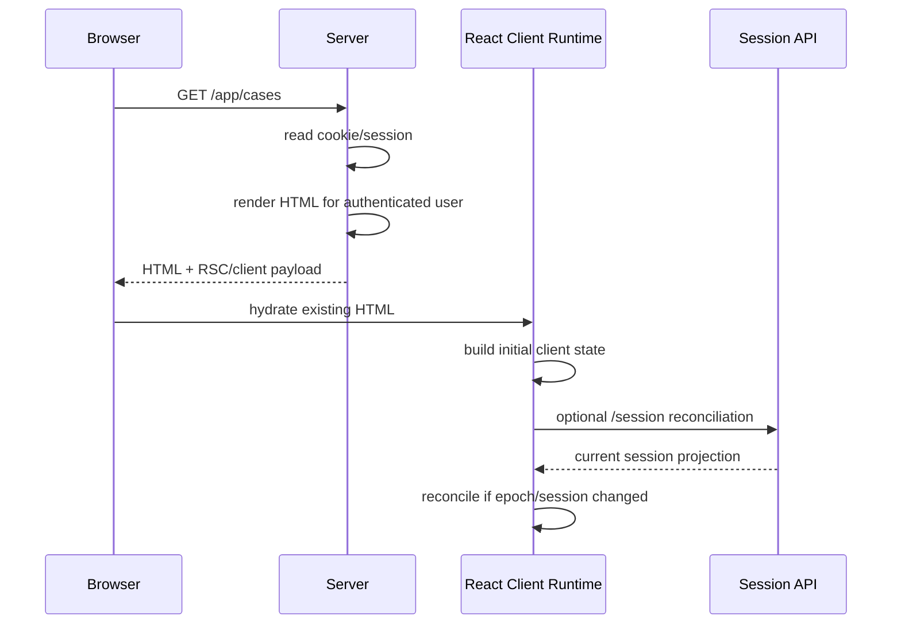
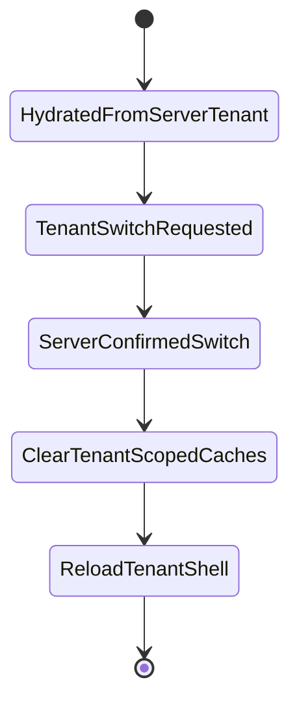

# Part 077 — Hydration and Auth Mismatch

SSR gives you an authenticated first paint.

Hydration gives that HTML back to React on the client.

Auth mismatch happens when the server and client disagree about the auth state that produced the first UI.

```txt
server: authenticated as alice, tenant A, permissionEpoch 17
client: expired session, tenant B, permissionEpoch 14
```

Or the reverse:

```txt
server: anonymous
client: localStorage token says authenticated
```

That mismatch is not just a React warning.

In auth-sensitive UI, it can cause:

```txt
protected UI flash
wrong tenant shell
stale admin navigation
form enabled for revoked permission
hydration warning hiding real security drift
cached RSC payload replayed after logout
client store overriding server truth
```

The core rule:

```txt
The first client render must agree with the server snapshot.
Any later difference must be handled as an explicit auth transition.
```

Hydration is not the place to discover identity.

Hydration is where React attaches behavior to HTML that already exists.

---

## 1. What hydration means for auth

On the server, React/Next.js renders HTML and an RSC/client payload.

The browser receives markup.

Then the client React runtime attaches event handlers and rebuilds the component tree state.



If initial client state is computed differently from server state, hydration mismatch appears.

React can recover from some mismatches.

Security cannot rely on that recovery.

---

## 2. Hydration mismatch is an auth state bug

React mismatch examples often show timestamps or random values.

Auth mismatch is more dangerous because the differing value controls exposure.

Bad example:

```tsx
function AdminMenu() {
  const token = localStorage.getItem("access_token");
  const isAdmin = token ? decodeRole(token) === "admin" : false;

  return isAdmin ? <AdminLinks /> : null;
}
```

During SSR:

```txt
localStorage does not exist
isAdmin = false
```

During client hydration:

```txt
localStorage exists
decoded role = admin
isAdmin = true
```

Now the first client render does not match server markup.

Worse, the browser just became the source of truth.

A safer model:

```txt
server session projection -> initial auth snapshot -> client hydrates same snapshot -> client reconciles with server
```

---

## 3. Server truth vs client hint

For SSR/BFF architectures, the server session is the initial authority.

The client can hold hints:

```txt
cached user profile
cached tenant selection
cached nav preference
cached permission projection
last known auth epoch
```

But hints do not override the server snapshot.

```ts
type AuthAuthority = "server_snapshot" | "server_reconciled";

type ClientHint = {
  preferredTenantId?: string;
  lastSeenPermissionEpoch?: number;
  lastSeenSessionVersion?: number;
};
```

The initial render should use:

```txt
server_snapshot
```

Not:

```txt
localStorage token
IndexedDB profile
previous TanStack Query cache
BroadcastChannel memory
service worker cached response
```

Client hints can help UX.

They cannot prove current authentication or authorization.

---

## 4. Common mismatch scenarios

### Scenario A — server authenticated, client expired

```txt
server read valid cookie and rendered /app/dashboard
client session store says expired because clock skew or stale local timer
```

Correct handling:

```txt
hydrate using server snapshot
then reconcile with /session
if server says expired, transition to expired/logout
```

Incorrect handling:

```txt
client immediately clears UI during hydration
```

That causes flicker and mismatch.

### Scenario B — server anonymous, client token exists

```txt
server cannot see localStorage token
client sees token and renders app shell
```

Correct handling:

```txt
server anonymous wins
client must not promote to authenticated from local token without server verification
```

In BFF/cookie SSR, this is usually a sign of old SPA token auth leftover.

### Scenario C — tenant mismatch

```txt
server rendered tenant A from cookie/session
client has tenant B in localStorage
```

Correct handling:

```txt
do not switch silently during hydration
show tenant switch transition after server-confirmed switch
```

### Scenario D — permission epoch mismatch

```txt
server rendered nav for permissionEpoch 22
client query cache has permissionEpoch 19
```

Correct handling:

```txt
client cache is stale
invalidate auth-scoped queries
reconcile with server projection
```

### Scenario E — logout in another tab

```txt
tab A logs out
tab B has SSR-rendered page in memory
browser restores tab B from bfcache or router cache
```

Correct handling:

```txt
listen for logout event
revalidate session on visibility/pageshow
clear sensitive cache
```

---

## 5. The auth snapshot contract

Create a small server-auth projection that is safe to serialize.

Do not serialize raw tokens.

```ts
export type AuthSnapshot = {
  status: "anonymous" | "authenticated";
  sessionVersion: number;
  authEpoch: number;
  user: null | {
    id: string;
    displayName: string;
    emailMasked: string;
  };
  tenant: null | {
    id: string;
    slug: string;
    displayName: string;
  };
  assurance: {
    level: "aal1" | "aal2" | "aal3";
    authTime: string | null;
  };
  permission: {
    epoch: number;
    summary: string[];
  };
};
```

This is not the entire session.

It is the minimal client bootstrap state.

Never include:

```txt
access_token
refresh_token
raw session cookie
full JWT
provider identity token
internal policy trace
all user claims
all group memberships
all tenant memberships
```

---

## 6. Auth epoch

Auth epoch is a monotonic version for auth-sensitive state.

It changes when something important changes:

```txt
login
logout
session refresh that changes sessionVersion
role change
permission policy version change
tenant switch
impersonation start/stop
step-up authentication
session revocation
```

```ts
type AuthEpochSnapshot = {
  sessionVersion: number;
  permissionEpoch: number;
  tenantEpoch: number;
  impersonationEpoch: number;
};

function authEpochKey(x: AuthEpochSnapshot) {
  return [
    x.sessionVersion,
    x.permissionEpoch,
    x.tenantEpoch,
    x.impersonationEpoch,
  ].join(":");
}
```

Use it in cache keys:

```ts
const casesQueryKey = [
  "cases",
  {
    tenantId: auth.tenant?.id,
    authEpoch: auth.authEpoch,
  },
];
```

This makes stale authenticated data harder to reuse accidentally.

---

## 7. Initial client render invariant

The `AuthProvider` must not compute a different first state on the client.

Bad:

```tsx
function AuthProvider({ children }: { children: React.ReactNode }) {
  const initial = readAuthFromLocalStorage();
  return <AuthContext.Provider value={initial}>{children}</AuthContext.Provider>;
}
```

Better:

```tsx
function AuthProvider({
  initialSnapshot,
  children,
}: {
  initialSnapshot: AuthSnapshot;
  children: React.ReactNode;
}) {
  const [snapshot, setSnapshot] = React.useState(initialSnapshot);

  React.useEffect(() => {
    let cancelled = false;

    reconcileSession(initialSnapshot).then((next) => {
      if (!cancelled) setSnapshot(next);
    });

    return () => {
      cancelled = true;
    };
  }, [initialSnapshot.authEpoch]);

  return (
    <AuthContext.Provider value={snapshot}>
      {children}
    </AuthContext.Provider>
  );
}
```

The first client render equals the server snapshot.

Reconciliation happens after hydration.

---

## 8. Reconciliation is a state transition

Do not treat reconciliation as a hidden correction.

Make it explicit.

```ts
type ReconcileResult =
  | { type: "same"; snapshot: AuthSnapshot }
  | { type: "logged_out"; reason: "revoked" | "expired" | "not_found" }
  | { type: "session_changed"; snapshot: AuthSnapshot }
  | { type: "permission_changed"; snapshot: AuthSnapshot }
  | { type: "tenant_changed"; snapshot: AuthSnapshot }
  | { type: "degraded"; snapshot: AuthSnapshot; reason: string };
```

Then handle each result deliberately:

```ts
async function reconcileSession(previous: AuthSnapshot) {
  const response = await fetch("/api/session", {
    credentials: "include",
    headers: {
      "X-Previous-Auth-Epoch": String(previous.authEpoch),
    },
    cache: "no-store",
  });

  if (response.status === 401) {
    return { type: "logged_out", reason: "expired" } as const;
  }

  if (!response.ok) {
    return {
      type: "degraded",
      snapshot: previous,
      reason: "session_reconcile_failed",
    } as const;
  }

  const next = (await response.json()) as AuthSnapshot;

  if (next.authEpoch === previous.authEpoch) {
    return { type: "same", snapshot: next } as const;
  }

  if (next.permission.epoch !== previous.permission.epoch) {
    return { type: "permission_changed", snapshot: next } as const;
  }

  return { type: "session_changed", snapshot: next } as const;
}
```

Auth drift is normal.

Silent drift is the bug.

---

## 9. `/session` endpoint for hydration reconciliation

Your session endpoint should be boring.

```http
GET /api/session
Cache-Control: no-store
```

Response:

```json
{
  "status": "authenticated",
  "sessionVersion": 42,
  "authEpoch": 3301,
  "user": {
    "id": "usr_123",
    "displayName": "Alya",
    "emailMasked": "a***@company.com"
  },
  "tenant": {
    "id": "ten_456",
    "slug": "acme",
    "displayName": "Acme"
  },
  "assurance": {
    "level": "aal2",
    "authTime": "2026-07-08T04:10:00Z"
  },
  "permission": {
    "epoch": 17,
    "summary": ["case.read", "case.comment"]
  }
}
```

It should not return:

```txt
raw token
all grants
all groups
all tenant memberships
policy trace
internal auth provider profile
```

The endpoint answers:

```txt
What should this client believe right now?
```

Not:

```txt
What does the whole identity system know?
```

---

## 10. Client local storage cannot promote auth

A common migration bug:

```txt
old SPA stored token in localStorage
new SSR app uses cookie/BFF
client still reads old token and sets authenticated=true
```

Fix the migration explicitly:

```ts
function ignoreLegacyLocalTokenDuringSSRMigration() {
  localStorage.removeItem("access_token");
  localStorage.removeItem("refresh_token");
}
```

Better, use a migration flag:

```ts
const LEGACY_AUTH_KEYS = ["access_token", "refresh_token", "id_token"];

export function cleanupLegacyAuthStorage() {
  for (const key of LEGACY_AUTH_KEYS) {
    try {
      localStorage.removeItem(key);
      sessionStorage.removeItem(key);
    } catch {
      // Storage may be unavailable. Ignore safely.
    }
  }
}
```

The rule:

```txt
Client storage may remember preferences.
Client storage must not establish authenticated identity in SSR/BFF apps.
```

---

## 11. Permission mismatch during hydration

Permission mismatch is subtle.

Example:

```txt
server renders Create Case button
client permission cache says create_case=false
```

Or:

```txt
server hides Delete button
client cache says delete_case=true
```

Both are problems.

A permission-aware client store needs snapshot versioning.

```ts
type PermissionSnapshot = {
  epoch: number;
  decisions: Record<string, "allow" | "deny" | "unknown">;
};

function shouldUseCachedPermission(
  serverEpoch: number,
  cached: PermissionSnapshot | null,
) {
  return cached != null && cached.epoch === serverEpoch;
}
```

If epochs differ, cached decisions become unknown.

```txt
unknown => deny-by-default render
```

Do not mix server permission epoch 17 with client permission decision from epoch 13.

---

## 12. Tenant mismatch during hydration

Tenant mismatch can cause cross-entity leakage.

A bad flow:

```txt
server renders tenant A case list
client localStorage preferredTenant = tenant B
client updates tenant context before clearing query cache
case list from tenant A appears under tenant B shell
```

A safer transition:



Tenant switch is not a local UI preference.

It is an authorization context transition.

---

## 13. Hydration-safe auth provider design

A robust provider has three layers.

```txt
1. immutable initial server snapshot
2. mutable reconciled client snapshot
3. transition events for logout/tenant/permission changes
```

```ts
type AuthStoreState = {
  initial: AuthSnapshot;
  current: AuthSnapshot;
  hydration: "server_snapshot" | "reconciling" | "reconciled" | "degraded";
};
```

```tsx
export function AuthProvider({
  initialSnapshot,
  children,
}: {
  initialSnapshot: AuthSnapshot;
  children: React.ReactNode;
}) {
  const [state, setState] = React.useState<AuthStoreState>({
    initial: initialSnapshot,
    current: initialSnapshot,
    hydration: "server_snapshot",
  });

  React.useEffect(() => {
    let active = true;

    setState((s) => ({ ...s, hydration: "reconciling" }));

    reconcileSession(initialSnapshot)
      .then((result) => {
        if (!active) return;

        if (result.type === "logged_out") {
          setState((s) => ({
            ...s,
            current: anonymousSnapshot(),
            hydration: "reconciled",
          }));
          clearSensitiveClientState();
          redirectToLogin({ reason: result.reason });
          return;
        }

        if (result.type === "degraded") {
          setState((s) => ({ ...s, hydration: "degraded" }));
          return;
        }

        setState({
          initial: initialSnapshot,
          current: result.snapshot,
          hydration: "reconciled",
        });
      })
      .catch(() => {
        if (!active) return;
        setState((s) => ({ ...s, hydration: "degraded" }));
      });

    return () => {
      active = false;
    };
  }, [initialSnapshot.authEpoch]);

  return <AuthContext.Provider value={state}>{children}</AuthContext.Provider>;
}
```

This structure prevents the client from inventing a different initial identity.

---

## 14. Never hide mismatch with `suppressHydrationWarning`

React supports ways to silence hydration warnings for unavoidable differences.

Do not use that for auth UI.

Bad:

```tsx
<span suppressHydrationWarning>{user?.name}</span>
```

This hides the symptom.

It does not fix the state model.

Acceptable use cases are narrow:

```txt
timestamp
random non-sensitive cosmetic ID
client-only animation state
```

Auth is not cosmetic.

If user, tenant, permission, or assurance level mismatch, the system needs reconciliation.

---

## 15. Avoid time-based auth rendering during hydration

Do not render login/logout state based on client clock during initial render.

Bad:

```tsx
const expired = Date.now() > new Date(session.expiresAt).getTime();
return expired ? <Login /> : <App />;
```

Server time and client time can differ.

Better:

```ts
type SessionFreshness =
  | { status: "fresh" }
  | { status: "near_expiry" }
  | { status: "server_expired" };
```

Server computes initial freshness.

Client schedules refresh after hydration using server-provided time offset.

```ts
const serverNow = new Date(snapshot.serverNow).getTime();
const clientNow = Date.now();
const clockOffsetMs = serverNow - clientNow;
```

Then refresh logic uses adjusted time.

Do not let a skewed laptop clock rewrite the first render.

---

## 16. RSC/router cache and auth mismatch

Authenticated RSC payloads and client-side route caches create a different mismatch class:

```txt
session changed
but client still holds previous route payload
```

This can happen after:

```txt
logout
login as different user
tenant switch
permission update
impersonation stop
step-up downgrade
```

On these events, clear or invalidate auth-scoped client cache.

```ts
function onAuthEpochChanged() {
  queryClient.clear();
  router.refresh();
  clearPermissionStore();
}
```

Do not assume navigation will naturally refetch every auth-sensitive payload.

Make auth epoch part of invalidation.

---

## 17. Auth-aware router refresh

After auth-sensitive transitions, call the framework-level refresh primitive if available.

In a Next.js App Router client component:

```tsx
"use client";

import { useRouter } from "next/navigation";

export function LogoutButton() {
  const router = useRouter();

  async function logout() {
    await fetch("/api/logout", { method: "POST", credentials: "include" });
    clearSensitiveClientState();
    router.refresh();
    router.replace("/login");
  }

  return <button onClick={logout}>Logout</button>;
}
```

`router.refresh()` is not authorization.

It is cache reconciliation.

The server must still revoke the session and enforce authorization.

---

## 18. Auth mismatch with bfcache

Browser back/forward cache can restore a page without a full reload.

That is great for performance.

It is dangerous if the user logged out elsewhere.

Handle `pageshow`:

```ts
window.addEventListener("pageshow", (event) => {
  if (event.persisted) {
    revalidateSessionAfterRestore();
  }
});
```

Also revalidate on visibility change:

```ts
document.addEventListener("visibilitychange", () => {
  if (document.visibilityState === "visible") {
    revalidateSessionAfterForeground();
  }
});
```

But avoid panic-clearing on every visibility event.

Use throttling and auth epoch comparison.

---

## 19. Anonymous-only pages can mismatch too

Login/register pages also need auth rules.

Example:

```txt
server thinks anonymous and renders /login
client says already authenticated and redirects /app
```

This should be a server decision when possible.

For anonymous-only routes:

```txt
if authenticated -> redirect away before render
if anonymous -> render login
if unknown -> render neutral skeleton
```

Avoid rendering login form with sensitive return URL state derived from untrusted client input.

---

## 20. Step-up auth mismatch

Step-up state can differ after hydration.

```txt
server rendered transfer form because AAL2 fresh
client believes auth_time too old
```

Handle this as an assurance transition.

```ts
type AssuranceDecision =
  | { type: "sufficient" }
  | { type: "requires_step_up"; reason: "auth_time_too_old" }
  | { type: "unknown" };
```

Sensitive forms should re-check server-side before mutation anyway.

If client reconciliation says step-up required, disable sensitive actions and show a step-up prompt.

Do not trust the client to decide that step-up is no longer required.

---

## 21. Impersonation mismatch

Impersonation creates two identities:

```txt
actor: support/admin user
subject: impersonated user
```

Hydration must preserve both.

```ts
type ImpersonationSnapshot = {
  active: boolean;
  actorUserIdHash?: string;
  subjectUserId: string;
  startedAt?: string;
  expiresAt?: string;
};
```

If server says impersonation active, the client must render the banner from the first paint.

Do not wait for client reconciliation to show it.

An impersonation banner is not decoration.

It is a safety control.

---

## 22. SSR fallback states

A secure fallback state should reveal little.

Good:

```tsx
function AuthShellFallback() {
  return (
    <main aria-busy="true">
      <div className="skeleton skeleton-nav" />
      <div className="skeleton skeleton-content" />
    </main>
  );
}
```

Bad:

```tsx
function Loading() {
  return <AdminSidebarSkeleton items={["Users", "Billing", "Audit"]} />;
}
```

Skeletons can leak.

A loading state for protected data should not expose:

```txt
admin-only routes
resource names
case titles
tenant names
counts
policy reasons
workflow state labels
```

---

## 23. Cache headers for hydration-sensitive routes

Authenticated SSR routes should normally be conservative.

```http
Cache-Control: no-store
Vary: Cookie
```

Some pages can be cached if they do not include user-specific data.

But do not cache personalized auth shell by accident.

A safe default:

```txt
public marketing pages: cacheable
authenticated app shell: no-store unless proven safe
session endpoint: no-store
permission endpoint: no-store or short private TTL with epoch
sensitive resource detail: no-store
```

The mistake is not caching.

The mistake is caching without an auth model.

---

## 24. Hydration mismatch test matrix

Test these cases:

```txt
server authenticated, client old anonymous cache
server anonymous, client old token storage
server tenant A, client tenant B preference
server permission epoch 10, client permission epoch 9
server impersonation active, client no impersonation cache
server step-up required, client stale AAL2
logout in tab A, restore tab B from bfcache
role revoked while page is open
session expired between SSR and hydration
server refresh changes sessionVersion before payload reaches client
```

Assertions:

```txt
no protected UI flash
no admin nav from stale client state
no tenant A data under tenant B shell
no raw token serialized
no policy trace serialized
no hydration warning ignored for auth content
query cache cleared on auth epoch change
session endpoint no-store
```

---

## 25. Observability

Track mismatch as a production signal.

Metrics:

```txt
auth.hydration.reconcile.count
auth.hydration.reconcile.changed.count
auth.hydration.reconcile.logged_out.count
auth.hydration.permission_epoch_mismatch.count
auth.hydration.tenant_mismatch.count
auth.hydration.degraded.count
auth.cache.auth_epoch_invalidation.count
auth.bfcache.session_revalidate.count
```

Logs:

```txt
request_id
session_id_hash
user_id_hash
tenant_id_hash
server_auth_epoch
client_auth_epoch
server_permission_epoch
client_permission_epoch
result
```

Never log:

```txt
raw cookie
raw token
full JWT
full email
policy trace
unmasked PII
```

---

## 26. Anti-patterns

Avoid:

```txt
reading localStorage during initial render to decide auth
using decoded JWT as hydration auth source
using suppressHydrationWarning on user/permission/tenant UI
serializing raw tokens to client to avoid mismatch
rendering admin skeleton before permission resolves
using client cache from previous tenant/user without epoch check
assuming bfcache will reload after logout
letting client promote anonymous server snapshot to authenticated
using timestamps/client clock to change first auth render
mixing stale permission cache with fresh session snapshot
```

These bugs feel like frontend quirks.

They are security architecture bugs.

---

## 27. Production checklist

Before shipping SSR/RSC auth, verify:

```txt
Is there a minimal AuthSnapshot serialized to the client?
Does initial client render use exactly the server snapshot?
Can client storage never promote authentication during hydration?
Are permission/tenant/session epochs included in cache keys?
Does /api/session use no-store?
Does logout clear query cache, permission cache, and route cache?
Does tenant switch clear tenant-scoped data before rendering new shell?
Is impersonation banner present on first paint?
Are auth hydration warnings treated as defects?
Is bfcache restore followed by session revalidation?
Are sensitive skeletons non-revealing?
```

---

## 28. Final mental model

Hydration is not authentication.

Hydration is continuity between server-rendered UI and client interactivity.

For auth-sensitive React apps, the invariant is simple:

```txt
Server snapshot creates the first UI.
Client hydrates the same snapshot.
Reconciliation changes auth only through explicit state transitions.
```

When that invariant holds, SSR auth becomes predictable.

When it fails, the UI becomes a race between stale caches, browser storage, server cookies, and user permissions.

That is not architecture.

That is accidental auth.

---

## References

- React Documentation — `hydrateRoot` and hydration behavior.
- Next.js Documentation — React hydration error guidance.
- Next.js Documentation — App Router caching, layouts, and data rendering behavior.
- Next.js Documentation — Authentication guide for App Router.
- OWASP Session Management Cheat Sheet.
- OWASP Authorization Cheat Sheet.
- MDN — Page Lifecycle and browser cache-related behavior.
