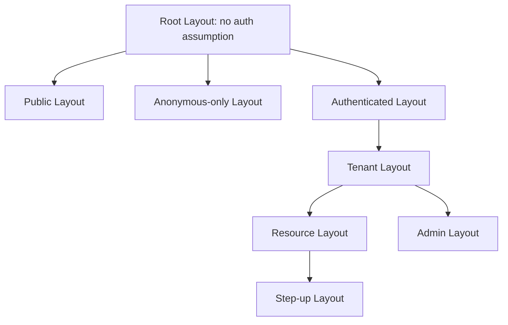
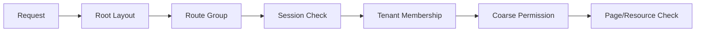
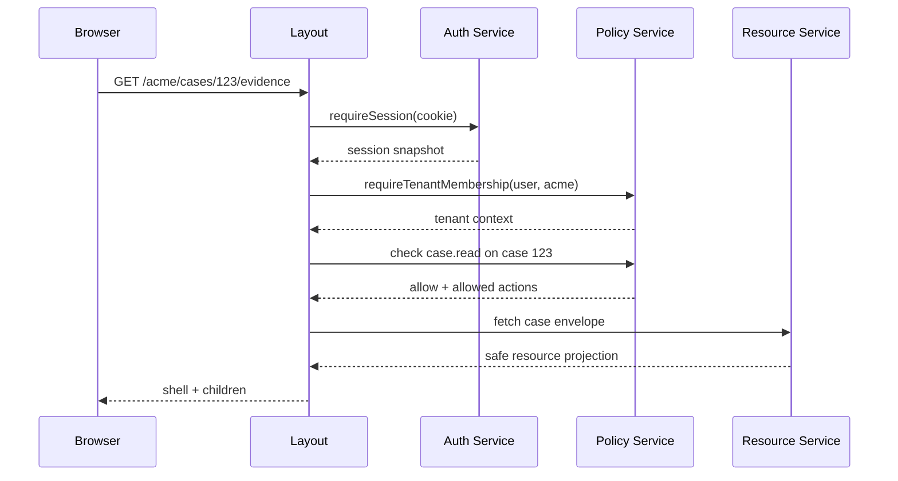

# Part 078 — Secure Layout Composition in SSR

Layouts are powerful because they are shared.

In SSR/RSC apps, layouts often contain:

```txt
app shell
sidebar
navigation
tenant switcher
user menu
breadcrumbs
tabs
notification badges
admin banners
impersonation banner
```

That makes layouts dangerous.

A layout can leak protected information before the page is even reached.

A secure layout is not just reusable UI.

It is an auth-aware projection boundary.

The core idea:

```txt
Every layout should know what level of auth context it is allowed to assume.
```

Root layout should not behave like tenant layout.

Tenant layout should not behave like resource layout.

Admin layout should not behave like authenticated-user layout.

---

## 1. Layouts form auth boundaries

Think of nested layouts as increasingly specific authorization contexts.



Each boundary answers a different question:

```txt
Root: Can anything be rendered for any visitor?
Authenticated: Is there a valid session?
Tenant: Is the session a member of this tenant?
Resource: Can the subject access this object?
Admin: Does the subject have privileged capability?
Step-up: Is the authentication assurance fresh enough?
```

Do not collapse all of these into one `isLoggedIn` check.

---

## 2. The layout security smell

A layout becomes unsafe when it renders data from a stronger context than it has proven.

Example smell:

```tsx
// app/(app)/layout.tsx
export default async function AppLayout({ children }: { children: React.ReactNode }) {
  const session = await getMaybeSession();
  const nav = await getAllNavItemsForUser(session?.userId);

  return (
    <Shell nav={nav}>
      {children}
    </Shell>
  );
}
```

Questions:

```txt
What if session is null?
What if user was revoked?
What if tenant has not been selected?
What if nav includes admin-only items?
What if layout is cached?
What if permission epoch changed after nav was rendered?
```

A secure layout should not fetch or render stronger data before proving the context.

---

## 3. Layout hierarchy design

A safer structure:

```txt
app/layout.tsx                         root, public-safe
app/(public)/layout.tsx                public marketing/docs
app/(anonymous)/layout.tsx             login/register/forgot-password
app/(authenticated)/layout.tsx         requires valid session
app/(authenticated)/(tenant)/layout.tsx requires tenant membership
app/(authenticated)/(tenant)/cases/[id]/layout.tsx resource envelope
app/(authenticated)/(tenant)/admin/layout.tsx admin capability
```

This mirrors authorization escalation.



The deeper the layout, the more specific its assumptions.

---

## 4. Root layout must stay boring

Root layout should not know product permissions.

Good root layout:

```tsx
export default function RootLayout({ children }: { children: React.ReactNode }) {
  return (
    <html lang="en">
      <body>{children}</body>
    </html>
  );
}
```

Avoid in root layout:

```txt
current user fetching
tenant fetching
admin nav fetching
case count fetching
permission decision fetching
impersonation decision hidden in client effect
```

Root layout is the wrong place for high-context auth data.

If it leaks, every route inherits the leak.

---

## 5. Authenticated layout

The authenticated layout proves session.

```tsx
export default async function AuthenticatedLayout({
  children,
}: {
  children: React.ReactNode;
}) {
  const session = await requireSession();

  const shell = await getAuthenticatedShellProjection({
    userId: session.userId,
    sessionVersion: session.version,
  });

  return (
    <AuthShell initialSession={shell.session}>
      {children}
    </AuthShell>
  );
}
```

This layout may render:

```txt
user menu with safe profile projection
logout button
non-tenant global account settings
impersonation banner if active
session-expiring soon banner
```

It should not render:

```txt
tenant-specific nav
resource-specific breadcrumbs
admin links unless admin context is proven
case titles
workflow counts
unfiltered notification content
```

Session is not tenant membership.

Session is not admin permission.

---

## 6. Tenant layout

The tenant layout proves membership in the selected tenant.

```tsx
export default async function TenantLayout({
  params,
  children,
}: {
  params: Promise<{ tenantSlug: string }>;
  children: React.ReactNode;
}) {
  const { tenantSlug } = await params;
  const session = await requireSession();
  const tenant = await requireTenantMembership(session.userId, tenantSlug);

  const nav = await getTenantNavigationProjection({
    subjectId: session.userId,
    tenantId: tenant.id,
    permissionEpoch: tenant.permissionEpoch,
  });

  return (
    <TenantShell tenant={tenant.safeProjection} nav={nav}>
      {children}
    </TenantShell>
  );
}
```

Tenant layout may render:

```txt
tenant display name
tenant-scoped nav allowed for this user
safe tenant switcher
tenant-scoped notification count if filtered
```

It should not render:

```txt
admin nav without admin capability
resource name before object access check
cross-tenant counts
permission trace
all tenant memberships if not needed
```

The tenant shell is a scoped projection.

It is not the entire tenant object.

---

## 7. Resource layout

Resource layout proves object-level access.

Example route:

```txt
/:tenantSlug/cases/:caseId
```

The resource layout should load a resource envelope only after authorization.

```ts
type CaseEnvelope = {
  id: string;
  title: string;
  workflowState: string;
  allowedActions: string[];
  redaction: {
    piiMasked: boolean;
  };
};
```

```tsx
export default async function CaseLayout({
  params,
  children,
}: {
  params: Promise<{ tenantSlug: string; caseId: string }>;
  children: React.ReactNode;
}) {
  const { tenantSlug, caseId } = await params;
  const ctx = await requireTenantContext(tenantSlug);

  const envelope = await requireCaseAccess({
    subjectId: ctx.userId,
    tenantId: ctx.tenantId,
    caseId,
    action: "case.read",
  });

  return (
    <CaseShell envelope={envelope}>
      {children}
    </CaseShell>
  );
}
```

This layout may render:

```txt
case title if read allowed
case workflow state if read allowed
case tabs based on allowedActions
safe breadcrumb
```

It must not render:

```txt
case title before object authorization
hidden admin-only tabs in client-side data
PII fields outside redaction rules
resource existence details to unauthorized users
```

---

## 8. Admin layout

Admin layout proves privileged capability.

```tsx
export default async function AdminLayout({ children }: { children: React.ReactNode }) {
  const session = await requireSession();
  const tenant = await requireSelectedTenant(session.userId);

  await requirePermission({
    subjectId: session.userId,
    tenantId: tenant.id,
    action: "admin.console.view",
    resource: { type: "tenant", id: tenant.id },
  });

  return <AdminShell>{children}</AdminShell>;
}
```

Admin layout should include:

```txt
privilege banner
scope indicator
support/impersonation indicator if relevant
audit-friendly page metadata
```

Admin layout should avoid:

```txt
fetching all admin data in shell
showing admin navigation before capability check
client-only hiding of admin pages
using role string as only gate
```

Admin access should be action/resource scoped.

Not just:

```ts
user.role === "admin"
```

---

## 9. Step-up layout

Some routes need stronger authentication freshness.

Examples:

```txt
change password
export sensitive records
approve enforcement escalation
change payout account
start impersonation
modify roles
```

Model it as a layout boundary:

```tsx
export default async function SensitiveActionLayout({
  children,
}: {
  children: React.ReactNode;
}) {
  const session = await requireSession();

  const assurance = await requireFreshAssurance({
    session,
    minLevel: "aal2",
    maxAgeSeconds: 300,
  });

  if (assurance.type === "requires_step_up") {
    redirect(`/step-up?returnTo=${encodeURIComponent(currentSafePath())}`);
  }

  return <SensitiveActionShell>{children}</SensitiveActionShell>;
}
```

Do not rely only on page buttons.

Direct URL access must hit the same requirement.

---

## 10. Layout data minimization

Layouts should fetch the smallest safe projection.

Bad nav projection:

```json
{
  "items": [
    { "label": "Admin", "hidden": true, "requiredPermission": "admin.console.view" },
    { "label": "Billing", "hidden": true, "requiredPermission": "billing.manage" }
  ]
}
```

Even hidden items leak product surface and policy structure.

Better:

```json
{
  "items": [
    { "label": "Cases", "href": "/acme/cases" },
    { "label": "Reports", "href": "/acme/reports" }
  ]
}
```

Frontend should not receive menu items it must never show.

For disabled-but-explainable items, return explicit public-safe denial reason.

```json
{
  "label": "Export",
  "href": null,
  "state": "disabled",
  "reason": "Requires export permission"
}
```

---

## 11. Breadcrumbs can leak

Breadcrumbs often reveal resource names.

```txt
Cases > Investigation #INV-2026-991 > Enforcement Actions
```

If object access is not proven, this leaks existence.

Safer pattern:

```txt
Cases > Case Detail
```

Then after resource authorization:

```txt
Cases > Investigation #INV-2026-991
```

Breadcrumb projection belongs near the resource authorization boundary.

Not in a generic parent layout.

---

## 12. Tabs and nested routes

Tabs are usually routes.

```txt
/cases/:id/overview
/cases/:id/evidence
/cases/:id/audit
/cases/:id/permissions
```

Do not only hide unauthorized tabs.

Each tab route must enforce access.

```tsx
const tabs = [
  can("case.overview.read") && { label: "Overview", href: "overview" },
  can("case.evidence.read") && { label: "Evidence", href: "evidence" },
  can("case.audit.read") && { label: "Audit", href: "audit" },
  can("case.permission.manage") && { label: "Permissions", href: "permissions" },
].filter(Boolean);
```

But the route itself still needs enforcement.

```txt
hidden tab prevents accidental discovery
route guard prevents direct URL bypass
API authorization prevents request bypass
```

All three are needed.

---

## 13. Loading states and skeleton leaks

SSR layouts often use loading UI.

Loading UI must be least-revealing.

Bad:

```tsx
function LoadingAdminShell() {
  return <SidebarSkeleton items={["Users", "Roles", "Audit", "Billing"]} />;
}
```

Good:

```tsx
function LoadingShell() {
  return (
    <main aria-busy="true">
      <div className="skeleton skeleton-header" />
      <div className="skeleton skeleton-body" />
    </main>
  );
}
```

Skeleton can leak:

```txt
whether admin module exists
how many tabs/actions exist
whether resource has evidence/comments/violations
whether tenant has billing enabled
whether case has sensitive workflow state
```

A skeleton is still UI.

Treat it as exposure.

---

## 14. Error boundaries in layout composition

Error boundaries should not reveal more than the user is allowed to know.

For unauthorized resource:

```txt
Forbidden
```

Or sometimes:

```txt
Not found
```

Depending on existence-leak policy.

Do not render:

```txt
You do not have permission to view Investigation #INV-2026-991 owned by Enforcement Team A
```

Unless the user is authorized to know those facts.

Use typed auth errors:

```ts
type AuthLayoutError =
  | { type: "unauthenticated" }
  | { type: "forbidden"; publicReason?: string }
  | { type: "tenant_not_found_or_no_access" }
  | { type: "step_up_required" }
  | { type: "session_degraded" };
```

Public reason should be safe.

Internal reason belongs in logs.

---

## 15. Layout cache risks

Layouts can preserve state across navigations.

That is good for UX.

It creates auth risks:

```txt
stale sidebar after role change
old tenant nav after tenant switch
impersonation banner missing after server state changes
admin shell preserved after permission revocation
notification count from previous tenant
```

Auth-sensitive layouts need invalidation hooks.

```ts
function onAuthContextChanged(event: AuthContextChangedEvent) {
  clearPermissionStore();
  clearTenantScopedQueryCache(event.previousTenantId);
  router.refresh();
}
```

Layout preservation is not permission preservation.

When auth context changes, layout data must be recomputed.

---

## 16. Server-first navigation projection

Navigation should be generated from server-side policy decisions.

```ts
type NavItem = {
  id: string;
  label: string;
  href: string;
  icon?: string;
};

type NavProjection = {
  tenantId: string;
  permissionEpoch: number;
  items: NavItem[];
};
```

Server:

```ts
export async function getTenantNavigationProjection(input: {
  subjectId: string;
  tenantId: string;
  permissionEpoch: number;
}): Promise<NavProjection> {
  const candidates = await getRegisteredTenantNavItems();

  const allowed = [];

  for (const item of candidates) {
    const decision = await can({
      subjectId: input.subjectId,
      action: item.requiredAction,
      resource: { type: "tenant", id: input.tenantId },
    });

    if (decision.allowed) {
      allowed.push({ id: item.id, label: item.label, href: item.href });
    }
  }

  return {
    tenantId: input.tenantId,
    permissionEpoch: input.permissionEpoch,
    items: allowed,
  };
}
```

Client:

```tsx
function Sidebar({ nav }: { nav: NavProjection }) {
  return (
    <nav>
      {nav.items.map((item) => (
        <a key={item.id} href={item.href}>{item.label}</a>
      ))}
    </nav>
  );
}
```

The client renders the projection.

It does not reconstruct the policy.

---

## 17. Command palette and global search

Command palettes are hidden navigation systems.

They often bypass sidebar filtering.

```txt
Cmd+K -> type "admin" -> Admin Console appears
```

Treat command registry as permission-aware.

```ts
type Command = {
  id: string;
  title: string;
  execute: () => void;
};
```

Do not ship forbidden commands and hide them client-side.

Generate commands from the same permission projection as nav.

```tsx
<CommandPalette commands={allowedCommands} />
```

Global search should also filter results server-side.

Do not rely on frontend filtering for search results.

---

## 18. Notification badges and counts

Counts can leak.

Examples:

```txt
3 pending escalations
12 suspicious transactions
1 disciplinary action
5 failed compliance checks
```

If a layout shows badges, each count must be authorized.

Bad:

```ts
const counts = await getAllCountsForTenant(tenantId);
```

Better:

```ts
const counts = await getAuthorizedCounts({
  subjectId,
  tenantId,
  allowedModules: nav.items.map((x) => x.id),
});
```

Or avoid counts in global layout.

Load counts inside the module where authorization is already proven.

---

## 19. Authenticated layout with Client Components

A Client Component can render the shell.

But the data should still be server-projected.

```tsx
// Server Component layout
export default async function Layout({ children }: { children: React.ReactNode }) {
  const projection = await getShellProjection();

  return (
    <ShellClient initialProjection={projection}>
      {children}
    </ShellClient>
  );
}
```

```tsx
"use client";

export function ShellClient({
  initialProjection,
  children,
}: {
  initialProjection: ShellProjection;
  children: React.ReactNode;
}) {
  return (
    <AuthShellProvider initialProjection={initialProjection}>
      <Sidebar nav={initialProjection.nav} />
      <main>{children}</main>
    </AuthShellProvider>
  );
}
```

Do not move auth decision into `useEffect`.

Client interactivity is fine.

Client authority is not.

---

## 20. Do not overfetch in layouts

Layouts are tempting places to fetch everything.

```txt
user
permissions
nav
notifications
billing
case counts
admin summaries
feature flags
recent objects
```

This creates:

```txt
slow first render
large serialized payloads
more leak surface
cache complexity
permission drift
expensive invalidation
```

A better rule:

```txt
Layout fetches identity/context projection.
Pages fetch resource data.
Components fetch interactive module data after boundary is proven.
```

Keep layout data stable and minimal.

---

## 21. Secure layout sequence

A good SSR secure layout flow:



Notice the order:

```txt
session -> tenant -> permission -> resource projection -> render
```

Not:

```txt
resource fetch -> render shell -> client hides forbidden parts
```

---

## 22. Layout and data ownership

Define ownership rules.

```txt
Root layout owns document frame only.
Authenticated layout owns session projection.
Tenant layout owns tenant projection and tenant nav.
Resource layout owns resource envelope.
Page owns module-specific data.
Component owns interaction state.
```

This prevents a common leak:

```txt
Parent layout fetches child resource data for convenience.
```

Convenience is not a good security boundary.

---

## 23. Route groups and separation

Use route groups to separate auth assumptions.

```txt
(public)
(anonymous)
(authenticated)
(admin)
```

A useful policy:

```txt
A page cannot weaken the layout above it.
```

If a route is under `(authenticated)`, it must not assume anonymous access.

If a route is under `(admin)`, every child must inherit admin context or perform a stronger check.

If a public page needs authenticated personalization, make that personalization optional and separately fetched.

---

## 24. Public pages with optional auth

Some pages are public but can personalize.

Example:

```txt
public docs page
marketing page with “Go to dashboard” if logged in
pricing page with current plan if logged in
```

Do not convert the whole public route into a sensitive authenticated render unless needed.

Pattern:

```tsx
export default function PublicPricingPage() {
  return (
    <>
      <PublicPricingContent />
      <OptionalAccountBanner />
    </>
  );
}
```

The optional banner can fetch a safe session projection.

It should not block or contaminate public cache for the entire page if architecture allows separation.

But never leak personalized data through shared public cache.

---

## 25. Layout cache-control policy

Define a policy per layout type.

```txt
Root/public static layout: cacheable if no personalization
Anonymous login layout: no-store if returnTo/error/session state present
Authenticated layout: no-store unless proven safe
Tenant layout: no-store or private user/tenant-scoped cache
Resource layout: no-store for sensitive resources
Admin layout: no-store
Step-up layout: no-store
```

For APIs used by layouts:

```http
Cache-Control: no-store
Vary: Cookie
```

For safe static nav definitions:

```txt
cache static registry
not user projection
```

Cache templates.

Do not cache user-specific decisions globally.

---

## 26. Layout invalidation events

Invalidate layout projection when:

```txt
login/logout
session refresh changes sessionVersion
tenant switch
role/grant change
permission policy version change
resource state changes tabs/actions
impersonation start/stop
step-up success/expiry
feature entitlement change
```

Implementation sketch:

```ts
type AuthLayoutInvalidation = {
  type:
    | "logout"
    | "tenant_changed"
    | "permission_epoch_changed"
    | "impersonation_changed"
    | "assurance_changed";
  authEpoch: number;
};
```

React/Next client response:

```ts
function handleLayoutInvalidation(event: AuthLayoutInvalidation) {
  clearAuthScopedCaches();
  clearPermissionStore();
  router.refresh();
}
```

Server response:

```txt
new layout projection on next render
```

---

## 27. Multi-tenant layout failure modes

Multi-tenant layouts fail in specific ways.

```txt
tenant switcher shows tenants user no longer belongs to
sidebar still shows previous tenant modules
counts from tenant A appear in tenant B shell
resource route accepts tenantSlug A but resource belongs to tenant B
admin layout checks global admin instead of tenant admin
```

Use tenant-scoped keys everywhere:

```ts
type TenantScopedKey = {
  tenantId: string;
  userId: string;
  permissionEpoch: number;
};
```

Do not use only:

```txt
userId
```

Tenant is part of the authorization context.

---

## 28. Regulated workflow layout

For regulated case management, layout composition must respect workflow state.

Example:

```txt
Draft -> Review -> Escalated -> Enforcement -> Closed
```

A case layout might expose tabs/actions depending on state:

```txt
Draft: edit, submit
Review: comment, request changes
Escalated: assign investigator, approve action
Closed: view only
```

Do not compute this entirely in React.

Server should project:

```ts
type WorkflowLayoutProjection = {
  state: "draft" | "review" | "escalated" | "enforcement" | "closed";
  tabs: Array<{ label: string; href: string }>;
  actions: Array<{ id: string; label: string }>;
  banners: Array<{ type: string; message: string }>;
};
```

React renders the projection.

Server enforces every action.

---

## 29. Testing secure layouts

Test layout security as its own layer.

Cases:

```txt
anonymous user hits authenticated route
authenticated user hits tenant route without membership
tenant member hits admin route without admin capability
user hits resource route without object access
user direct-navigates to hidden tab
permission revoked while layout is mounted
tenant switched while queries are in flight
impersonation starts and stops
step-up expires while sensitive layout is open
bfcache restores privileged layout after logout
```

Assertions:

```txt
no protected shell flash
no admin sidebar before admin check
no resource breadcrumb before resource access
no stale tenant counts after switch
no hidden commands in command palette
no sensitive skeleton leak
no global cache of user-specific nav
layout refreshes after auth epoch change
```

---

## 30. Observability

Track layout auth behavior.

Metrics:

```txt
layout.auth.require_session.denied.count
layout.tenant.membership.denied.count
layout.resource.forbidden.count
layout.admin.forbidden.count
layout.stepup.required.count
layout.nav.projection.item_count
layout.projection.permission_epoch_mismatch.count
layout.refresh.after_auth_epoch_change.count
```

Logs:

```txt
request_id
route_id
layout_id
user_id_hash
tenant_id_hash
resource_type
resource_id_hash
action
permission_epoch
result
```

Do not log:

```txt
raw policy expression
raw token
full resource data
PII in breadcrumbs
hidden forbidden nav registry
```

---

## 31. Anti-patterns

Avoid:

```txt
fetching current user in root layout for every route
rendering tenant/admin nav before membership/permission check
client-only hiding of admin layouts
serializing all nav items with hidden=true
using skeletons that reveal privileged modules
caching user-specific nav as static layout data
using global role string for admin layout
loading resource title before object authorization
keeping old layout after tenant switch without refresh
ignoring command palette/search as navigation surfaces
```

These are not cosmetic issues.

They are layout-level access-control drift.

---

## 32. Production checklist

Before shipping SSR layout auth, verify:

```txt
Is root layout public-safe and data-minimal?
Is authenticated layout separate from tenant layout?
Is tenant membership proven before tenant shell renders?
Is object authorization proven before resource breadcrumb/title renders?
Is admin layout capability-based rather than role-string-only?
Are skeletons non-revealing?
Are nav/command/search projections server-filtered?
Are user-specific layout APIs no-store/private and Vary-aware?
Is layout cache invalidated on auth epoch change?
Are tenant-scoped caches cleared on tenant switch?
Are direct URLs protected even when tabs/sidebar hide links?
Is impersonation banner rendered on first paint?
```

---

## 33. Final mental model

Secure layout composition is about placing the right UI at the right authorization depth.

```txt
Root knows nothing.
Authenticated layout knows session.
Tenant layout knows membership.
Resource layout knows object access.
Admin layout knows privileged capability.
Step-up layout knows authentication freshness.
```

When that hierarchy is clear, layouts become safe composition.

When it is blurry, layouts become accidental data leaks.

The best SSR auth systems do not ask:

```txt
Can this component hide itself?
```

They ask:

```txt
What context has been proven before this layout renders?
```

That is the difference between UI reuse and secure architecture.

---

## References

- Next.js Documentation — App Router layouts and pages.
- Next.js Documentation — App Router authentication guide.
- Next.js Documentation — Server Components, Client Components, Route Handlers, and caching behavior.
- React Documentation — Server Components and hydration model.
- OWASP Authorization Cheat Sheet.
- OWASP Session Management Cheat Sheet.
- OWASP Error Handling Cheat Sheet.
