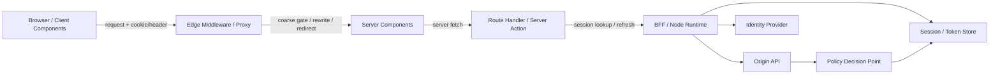
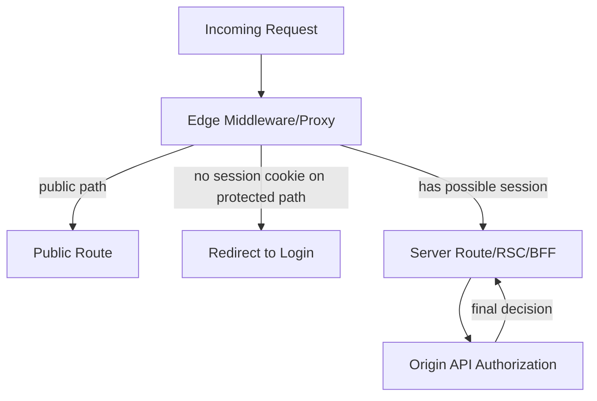
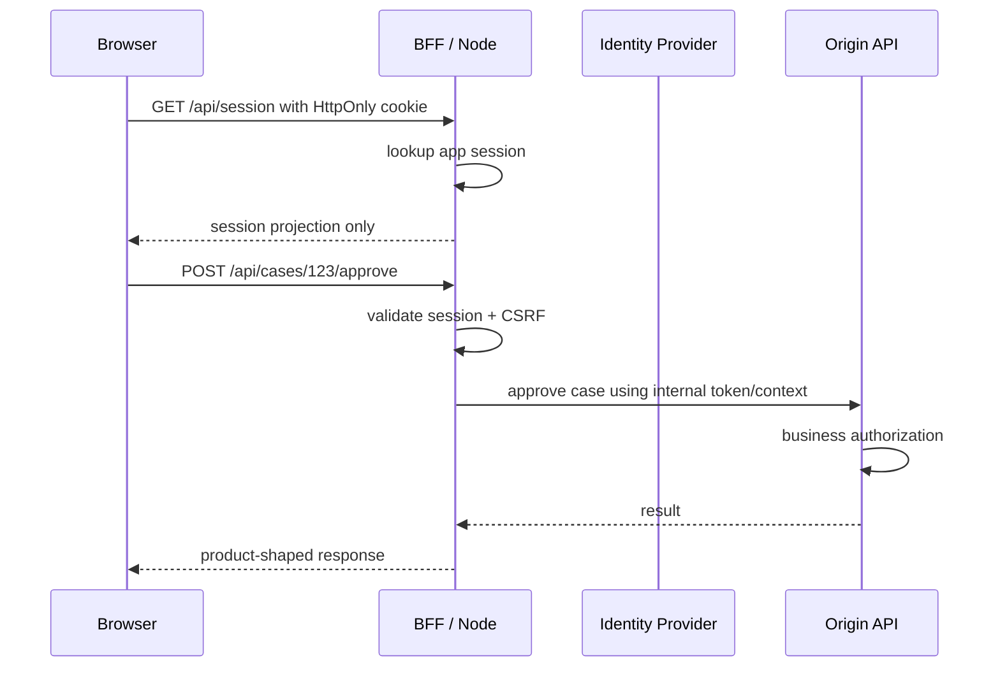

# Part 079 — Multi-runtime Auth: Node, Edge, Browser

Modern React auth does not live in one runtime.

A production app can execute auth-related code in:

```txt
browser
React Client Components
React Server Components
Next.js Route Handlers
Next.js Middleware/Proxy
Edge runtime
Node.js runtime
BFF service
API gateway
origin API service
worker/service worker
```

The dangerous mistake is treating all of them as equivalent JavaScript.

They are not equivalent.

They differ in:

```txt
secrets
cookies
headers
crypto APIs
network locality
caching behavior
execution time
library compatibility
observability
failure recovery
trust boundary
```

Auth architecture fails when code crosses runtime boundaries without carrying the correct security model.

The core rule:

```txt
Do not design React auth around functions.
Design it around runtime authority.
```

A function named `getSession()` means different things in the browser, edge, and Node.

In the browser, it can only ask.

At the edge, it can make coarse decisions.

In Node/BFF, it can verify, refresh, revoke, audit, and call internal systems.

---

## 1. Runtime authority map

Start with a map.



The authority increases as you move server-side.

```txt
browser: projection, interaction, intent
edge: cheap pre-route classification
server component: request-time rendering and data projection
route handler/server action: mutation boundary and cookie mutation
BFF/node: session authority, token vault, internal calls
origin API: business authorization enforcement
policy engine: final decision logic
```

This is why a shared auth utility can be dangerous.

```tsx
// Smell: same name, different authority.
const session = await getSession();
```

Ask instead:

```txt
Which runtime is this executing in?
What evidence is it allowed to read?
What secrets can it access?
Can it mutate cookies?
Can it refresh a token?
Can it audit?
Can it enforce authorization?
```

---

## 2. Capability matrix

Use a runtime capability matrix before writing abstractions.

| Capability | Browser | Edge runtime | Node/BFF runtime | Origin API |
|---|---:|---:|---:|---:|
| Read HttpOnly cookie value | No | Yes, from request metadata | Yes, from request metadata | Usually yes if proxied |
| Write response cookie | No | Sometimes, depending framework boundary | Yes | Yes |
| Access browser memory | Yes | No | No | No |
| Access long-lived secrets | No | Prefer no/minimal | Yes | Yes |
| Refresh OAuth token | No for BFF model | Avoid unless intentionally designed | Yes | Sometimes |
| Verify JWT locally | Not authoritative | Possible if Web Crypto compatible | Yes | Yes |
| Introspect opaque token | No | Possible but latency-sensitive | Yes | Yes |
| Call internal services | No | Avoid or narrow | Yes | Yes |
| Make final business authorization decision | No | No, except coarse deny/redirect | Sometimes for BFF-owned operations | Yes |
| Emit durable audit event | No | Limited | Yes | Yes |
| Use Node-only libraries | No | No | Yes | Yes |
| Use Web Crypto | Yes in secure contexts | Yes in many edge runtimes | Yes in modern Node, plus Node crypto | Depends runtime |
| Cache response safely | Dangerous for auth data | Dangerous without explicit policy | Possible with controls | Possible with controls |

A strong design chooses the simplest runtime with enough authority.

Do not run high-authority logic in a low-authority runtime.

Do not run low-value checks in an expensive runtime if edge can reject safely.

---

## 3. Browser runtime: projection, not authority

The browser can render auth-aware UI.

It cannot prove auth.

It can hold:

```txt
session projection
current user display name
tenant selection
permission projection
access token in memory for pure SPA mode
CSRF token if cookie auth uses synchronizer/double-submit pattern
```

It must not hold:

```txt
client secret
refresh token in persistent storage
policy-engine secret
service account credential
database credential
trustworthy authorization decision
raw policy trace that reveals sensitive graph structure
```

The browser answers UX questions:

```txt
Should the Save button be shown?
Should the user be redirected to login?
Should the app show an expired session banner?
Should the UI request step-up authentication?
```

The server answers security questions:

```txt
Is this session valid?
Is this token active?
Can this subject perform this action on this resource now?
Is this tenant context valid?
Should this mutation be committed?
```

### Browser-side auth code shape

```ts
export type AuthProjection =
  | { status: "unknown" }
  | { status: "anonymous" }
  | {
      status: "authenticated";
      user: {
        id: string;
        displayName: string;
      };
      tenant?: {
        id: string;
        name: string;
      };
      permissionEpoch: string;
      sessionEpoch: string;
    }
  | {
      status: "degraded";
      reason: "SESSION_CHECK_FAILED" | "PERMISSION_CHECK_FAILED";
    };
```

Notice what is absent:

```txt
refresh token
client secret
raw provider token
privileged claim set
server-only policy trace
```

A projection is not a credential vault.

---

## 4. Edge runtime: fast classification, not deep authorization

Edge runtime is attractive because it runs before route rendering and close to users.

That makes it good for:

```txt
redirecting anonymous users away from authenticated route groups
blocking obviously invalid route access
normalizing tenant route shape
adding safe request headers to internal routes
rejecting malformed return URLs
setting cache-control guardrails
```

It is usually bad for:

```txt
refresh token rotation
expensive policy graph traversal
opaque token introspection on every request
complex audit writes
database-heavy authorization
high-cardinality logging
using Node-only auth libraries
calling too many internal services
```

The edge is a pre-route gate.

It is not your full PDP.



### Good edge decision

```txt
No session cookie + /app/** route = redirect to login.
```

### Bad edge decision

```txt
JWT claim role=admin + /admin/** route = grant admin authority.
```

The first is a coarse precondition.

The second is final authorization based on a possibly stale claim.

---

## 5. Node/BFF runtime: session authority

Node/BFF is usually the best place for high-authority web auth logic.

It can:

```txt
read and write HttpOnly cookies
store OAuth tokens server-side
rotate refresh tokens
hash session IDs
call IdP/token endpoint
call token introspection endpoint
call policy engine
call origin APIs
emit durable audit logs
share a database transaction with auth-relevant writes
perform server-side encryption
use mature Node libraries
```

In BFF architecture, browser never sees provider tokens.



The browser sends intent.

The BFF attaches authority.

The API enforces business rules.

---

## 6. Runtime-specific cookie semantics

Cookies are request/response metadata.

That means cookie logic depends heavily on runtime boundary.

Browser JavaScript cannot read HttpOnly cookies.

Server-side code can read incoming cookies if the framework exposes request headers.

Server-side code can only set cookies when it controls the response boundary.

This matters in SSR/RSC.

```txt
Read cookie during server render: often possible.
Set cookie during server render: framework-dependent and often not allowed directly.
Set cookie in route handler/server action: usually correct.
Set cookie in middleware/proxy: possible but should be simple and careful.
```

### Cookie mutation rule

```txt
Only mutate security-sensitive cookies at explicit response boundaries.
```

Good places:

```txt
POST /logout
GET /auth/callback
POST /session/refresh
server action with explicit mutation semantics
route handler that returns response
```

Risky places:

```txt
arbitrary shared helper during render
layout render path
client component
background utility imported by both client and server
```

### Cookie design checklist

For app session cookies:

```txt
HttpOnly
Secure
SameSite=Lax or Strict unless cross-site requirements justify None
Path scoped intentionally
Domain avoided unless needed
__Host- prefix when possible
short idle timeout
absolute timeout
server-side revocation
rotation on privilege change
```

Do not use cookie presence as proof of session validity.

Cookie presence only means:

```txt
The request contains something that might identify a session.
```

The session store decides whether it is valid.

---

## 7. Headers across runtimes

Headers are often used to pass auth context internally.

Examples:

```txt
x-user-id
x-tenant-id
x-session-id
x-auth-epoch
x-request-id
x-impersonator-id
x-permission-epoch
```

This is dangerous unless you control the boundary.

A browser can send arbitrary headers allowed by CORS.

Therefore:

```txt
Never trust user-controlled auth headers at the public edge.
```

Use public headers as inputs only after verification.

Use internal headers only after stripping client-provided values.

```ts
const INTERNAL_AUTH_HEADERS = [
  "x-user-id",
  "x-tenant-id",
  "x-session-id",
  "x-auth-epoch",
  "x-impersonator-id",
];

export function stripSpoofableAuthHeaders(headers: Headers): Headers {
  const next = new Headers(headers);

  for (const name of INTERNAL_AUTH_HEADERS) {
    next.delete(name);
  }

  return next;
}
```

Then the gateway/BFF can add trusted headers for downstream internal services.

```ts
export function attachVerifiedAuthContext(
  headers: Headers,
  context: {
    userId: string;
    tenantId: string;
    sessionId: string;
    authEpoch: string;
  },
): Headers {
  const next = stripSpoofableAuthHeaders(headers);

  next.set("x-user-id", context.userId);
  next.set("x-tenant-id", context.tenantId);
  next.set("x-session-id", context.sessionId);
  next.set("x-auth-epoch", context.authEpoch);

  return next;
}
```

Internal headers require network boundary enforcement too.

```txt
private network
mTLS or service identity
gateway strips external values
origin rejects requests without trusted gateway identity
logs include request id/session id safely
```

---

## 8. Crypto across browser, edge, and Node

Crypto API availability differs.

The browser and many edge runtimes expose Web Crypto.

Node exposes Web Crypto in modern versions and also Node's `crypto` module.

But library compatibility is not just about API names.

Check:

```txt
Does the library use Node Buffer?
Does it use filesystem access?
Does it use crypto.createSign?
Does it depend on process.env at runtime?
Does it use dynamic require?
Does it support Web Crypto subtle APIs?
Does it support the key algorithms your IdP uses?
```

### Runtime-safe JWT verification boundary

For server-side verification, centralize the runtime dependency.

```ts
export interface JwtVerifier {
  verifyAccessToken(token: string): Promise<VerifiedAccessToken>;
}

export type VerifiedAccessToken = {
  subject: string;
  issuer: string;
  audience: string;
  expiresAt: number;
  scopes: string[];
  claims: Record<string, unknown>;
};
```

Then provide runtime-specific implementations.

```txt
node-jwt-verifier.ts
edge-jwt-verifier.ts
browser-token-parser.ts
```

Important distinction:

```txt
Browser parser: decode for display/debug hints only.
Server verifier: validate cryptographic signature, issuer, audience, expiry, and policy preconditions.
```

Do not accidentally export the verifier into a client bundle.

### A practical module boundary

```txt
src/auth/
  shared/
    types.ts
    errors.ts
    permission-contract.ts
  browser/
    auth-store.ts
    use-session.ts
    token-preview.ts
  server/
    require-session.ts
    verify-session.ts
    csrf.ts
  edge/
    classify-route.ts
    redirect-policy.ts
  node/
    token-vault.ts
    refresh-session.ts
    audit.ts
```

No server secret should be importable from `browser/`.

---

## 9. Environment variables and secrets

Environment variables are runtime-specific.

The important distinction is not syntax.

It is exposure.

```txt
browser-exposed env: public configuration only
edge env: minimal secrets, short dependency chain
node env: confidential credentials, token endpoint credentials, encryption keys
API env: service credentials and policy/backend secrets
```

### Public config example

Safe to expose:

```txt
issuer URL
client ID for public OAuth client
public app URL
Sentry DSN if designed as public
feature flag client key if designed as public
```

Not safe to expose:

```txt
client secret
private signing key
session encryption key
database URL
token introspection credential
policy service admin key
webhook signing secret
```

### Naming discipline

Use naming to prevent mistakes.

```txt
PUBLIC_AUTH_ISSUER_URL
PUBLIC_AUTH_CLIENT_ID
SERVER_SESSION_SECRET
SERVER_TOKEN_ENCRYPTION_KEY
SERVER_IDP_CLIENT_SECRET
EDGE_ROUTE_AUTH_SALT
```

Do not rely on naming alone.

Add build checks.

```ts
const forbiddenClientEnvPatterns = [
  /SECRET/i,
  /PRIVATE/i,
  /TOKEN_ENCRYPTION/i,
  /DATABASE/i,
  /WEBHOOK/i,
];
```

For regulated systems, treat accidental secret exposure as an incident.

---

## 10. Caching differs by runtime

Auth bugs often look like cache bugs.

Examples:

```txt
Edge caches redirect after logout.
RSC caches user-specific navigation.
Browser bfcache restores protected page after logout.
Service worker serves stale authenticated API response.
CDN caches `/api/session` without Vary/Cookie controls.
React Query shows previous tenant's data after switch.
```

Runtime-specific rule:

```txt
Any user-specific auth response must opt out of shared caching unless it is explicitly partitioned by session/tenant and safe to cache.
```

### Safe defaults

For session/user/permission projection responses:

```http
Cache-Control: no-store
Vary: Cookie, Authorization
```

For SSR pages with user-specific data:

```txt
no shared CDN cache
explicit dynamic rendering mode where framework requires it
no static generation for session-specific shells
no persisted cache across user/tenant without auth scope key
```

For browser data caches:

```txt
query key includes user/session/tenant/permission epoch
cache cleared on logout
cache cleared on tenant switch
permission projection invalidated on role/grant/policy change
```

---

## 11. Runtime drift

Runtime drift happens when auth logic behaves differently depending on where it runs.

Common drift cases:

```txt
Edge accepts token that Node rejects.
Browser thinks user has role admin; API denies.
RSC renders tenant nav from old session; client has new tenant.
Route Handler refreshes session; layout still used old snapshot.
Middleware redirects based on cookie presence; session store says revoked.
Node library validates `aud`; edge library forgets `aud`.
Browser decodes expired JWT and shows authenticated UI.
```

The fix is not to force identical code everywhere.

The fix is to define identical contracts.

```txt
Session projection contract
Permission decision contract
Auth error contract
Route classification contract
Token verification contract
Audit event contract
```

Contracts can have different implementations per runtime.

Behavior must remain consistent.

---

## 12. Route classification at edge, enforcement at origin

A route classification table is useful.

```ts
export type RouteAuthClass =
  | "public"
  | "anonymous_only"
  | "authenticated"
  | "tenant_member"
  | "admin_candidate"
  | "step_up_candidate";

export function classifyPath(pathname: string): RouteAuthClass {
  if (pathname === "/" || pathname.startsWith("/docs")) return "public";
  if (pathname.startsWith("/login")) return "anonymous_only";
  if (pathname.startsWith("/app/admin")) return "admin_candidate";
  if (pathname.startsWith("/app/t/")) return "tenant_member";
  if (pathname.startsWith("/app")) return "authenticated";
  return "public";
}
```

Edge can use this to decide obvious redirects.

```ts
export function shouldRedirectToLogin(input: {
  routeClass: RouteAuthClass;
  hasSessionCookie: boolean;
}): boolean {
  return (
    !input.hasSessionCookie &&
    ["authenticated", "tenant_member", "admin_candidate", "step_up_candidate"].includes(
      input.routeClass,
    )
  );
}
```

But this is not enough for final authorization.

```txt
admin_candidate means: route needs admin-like evaluation later.
It does not mean: edge grants admin access.
```

The origin still checks:

```txt
valid session
tenant membership
resource access
permission action
workflow state
step-up freshness
```

---

## 13. Token verification placement

Where should JWT verification happen?

It depends.

### Verify at edge when

```txt
token is small
JWKS can be cached safely
only coarse authentication is needed
failure result is redirect/deny
algorithm is supported by edge runtime
latency budget allows it
revocation requirements are weak or handled separately
```

### Verify in Node/BFF when

```txt
opaque session cookie maps to server session
refresh may be needed
revocation must be strongly checked
policy engine is involved
logging/audit is required
library requires Node APIs
claims need enrichment from DB
```

### Verify in origin API when

```txt
API is independently reachable
zero-trust internal model
multiple clients call API
BFF is not the only caller
business authorization is API-owned
```

A common strong pattern:

```txt
edge: route classification and cookie presence
BFF: session validation and token refresh
API: business authorization enforcement
```

---

## 14. Multi-runtime request model

Create one request model that survives runtime boundaries.

```ts
export type AuthenticatedRequestContext = {
  requestId: string;
  actor: {
    subjectId: string;
    sessionId: string;
    authTime?: string;
    assuranceLevel?: string;
  };
  tenant?: {
    id: string;
    membershipId: string;
  };
  impersonation?: {
    impersonatorId: string;
    reason: string;
  };
  epochs: {
    session: string;
    permission: string;
    policy: string;
  };
};
```

The browser may receive a reduced projection.

```ts
export type ClientSessionProjection = Pick<
  AuthenticatedRequestContext,
  "tenant" | "epochs"
> & {
  user: {
    id: string;
    displayName: string;
  };
};
```

The API receives a verified internal context.

```txt
Do not let the browser construct `AuthenticatedRequestContext`.
```

---

## 15. Runtime-aware error taxonomy

Different runtimes should produce compatible errors.

```ts
export type AuthBoundaryError =
  | { type: "NO_SESSION"; recovery: "LOGIN" }
  | { type: "INVALID_SESSION"; recovery: "LOGIN" }
  | { type: "EXPIRED_SESSION"; recovery: "REFRESH_OR_LOGIN" }
  | { type: "TENANT_REQUIRED"; recovery: "SELECT_TENANT" }
  | { type: "TENANT_FORBIDDEN"; recovery: "SWITCH_TENANT_OR_REQUEST_ACCESS" }
  | { type: "PERMISSION_DENIED"; recovery: "REQUEST_ACCESS" }
  | { type: "STEP_UP_REQUIRED"; recovery: "REAUTHENTICATE" }
  | { type: "AUTH_SERVICE_DEGRADED"; recovery: "RETRY_OR_READ_ONLY" };
```

Edge might turn `NO_SESSION` into redirect.

Server render might turn `TENANT_REQUIRED` into tenant picker.

API might turn `PERMISSION_DENIED` into `403` with safe reason code.

Client might turn `STEP_UP_REQUIRED` into modal/redirect.

Different UI.

Same semantic contract.

---

## 16. Runtime-specific anti-patterns

### Anti-pattern: one universal `auth.ts`

```txt
shared auth.ts imports cookies, localStorage, crypto, database, and React hooks.
```

This creates accidental bundling and runtime bugs.

Split by runtime.

### Anti-pattern: edge does database authorization

Edge should not become a high-latency distributed PDP unless deliberately engineered.

### Anti-pattern: browser imports server verifier

This can leak implementation details or accidentally bundle server-only code.

### Anti-pattern: cookie mutation during render helper

Cookie mutation should happen at explicit response boundaries.

### Anti-pattern: trusted headers from browser

Public requests can spoof headers unless stripped and reattached by trusted infrastructure.

### Anti-pattern: using JWT decode as cross-runtime truth

Decoding is parsing.

Verification is validation.

Authorization is policy.

They are not the same.

---

## 17. Deployment topology decision matrix

| System type | Recommended runtime placement |
|---|---|
| Simple marketing + dashboard | Edge coarse redirect, Node/BFF session, API enforcement |
| Pure SPA with third-party API | Browser access token in memory, API validates JWT, no refresh token in persistent storage |
| Enterprise SaaS | BFF token vault, HttpOnly session, server-side tenant resolution, API policy enforcement |
| Regulated workflow/case management | BFF + origin API + centralized policy/audit, no browser-held authority, strict cache controls |
| Collaboration platform | Server-side relationship permission projection, object-level API enforcement, cross-tab invalidation |
| Multi-region high scale app | Edge route classification, regional session store strategy, origin PDP consistency model |

The more sensitive the system, the more you move authority server-side.

---

## 18. Testing multi-runtime auth

You need tests at each boundary.

### Browser tests

```txt
unknown state renders safe fallback
logout clears query/cache/store state
tenant switch clears tenant-scoped cache
403 mutation rollback works
permission projection stale state fails closed
```

### Edge tests

```txt
public routes pass without session cookie
protected routes redirect without session cookie
login route avoids redirect loop
return URL is normalized and internal-only
client-spoofed internal headers are stripped
```

### Server/BFF tests

```txt
invalid session cookie rejected
revoked session rejected
refresh rotation handles concurrency
CSRF required for cookie-auth mutation
session projection excludes secrets
logout revokes server state and clears cookie
```

### API tests

```txt
object-level authorization enforced
tenant mismatch denied
workflow transition permission enforced
internal headers require trusted source
permission decision emits audit event
```

### Runtime compatibility tests

```txt
JWT verifier supports configured algorithm in target runtime
bundle analysis proves server code not shipped to browser
edge function does not import Node-only modules
cookie set/delete behavior works in deployed framework
cache headers are present on auth responses
```

---

## 19. Observability per runtime

Do not log secrets.

Do log safe correlation fields.

```txt
request_id
session_hash, not raw session id
user_id if allowed by privacy policy
tenant_id
auth_epoch
permission_epoch
route_auth_class
runtime=edge|node|browser|api
error_type
recovery_type
```

Runtime-specific useful metrics:

```txt
edge redirect rate
edge route classification mismatch
BFF session lookup latency
refresh token rotation conflict rate
API 401/403 rate by endpoint
permission cache invalidation lag
client auth reconciliation failure
RSC hydration auth mismatch
```

A multi-runtime auth incident is hard to debug without shared correlation IDs.

---

## 20. Engineering checklist

Before shipping multi-runtime auth, answer:

```txt
Which runtime can read session evidence?
Which runtime can mutate session cookies?
Which runtime can refresh tokens?
Which runtime can call the policy engine?
Which runtime owns final authorization?
Which runtime owns audit events?
Which data is projected to the browser?
Which headers are trusted, stripped, and reattached?
Which caches are allowed to store auth-sensitive responses?
Which code is guaranteed not to enter the client bundle?
```

Then verify through tests, not belief.

---

## 21. Final mental model

Multi-runtime auth is not about where JavaScript can run.

It is about where authority belongs.

```txt
Browser: intent + projection
Edge: route classification + cheap rejection
Server render: safe request-time projection
Route handler/server action: response mutation boundary
BFF/Node: session authority + token vault
Origin API: business authorization enforcement
Policy engine: decision authority
Audit pipeline: evidence authority
```

A top-tier React engineer does not ask:

```txt
Can I call getSession here?
```

They ask:

```txt
What authority does this runtime have, and what is the safest contract it can return?
```

That question prevents an entire class of auth bugs.

---

## References

- Next.js Docs — Edge Runtime: https://nextjs.org/docs/app/api-reference/edge
- Next.js Docs — Route Segment Config Runtime: https://nextjs.org/docs/app/api-reference/file-conventions/route-segment-config/runtime
- Next.js Docs — Cookies API: https://nextjs.org/docs/app/api-reference/functions/cookies
- React Docs — Server Components: https://react.dev/reference/rsc/server-components
- MDN — SubtleCrypto: https://developer.mozilla.org/en-US/docs/Web/API/SubtleCrypto
- OWASP Authorization Cheat Sheet: https://cheatsheetseries.owasp.org/cheatsheets/Authorization_Cheat_Sheet.html
- OWASP Session Management Cheat Sheet: https://cheatsheetseries.owasp.org/cheatsheets/Session_Management_Cheat_Sheet.html
- RFC 9700 — OAuth 2.0 Security Best Current Practice: https://www.rfc-editor.org/rfc/rfc9700.html
