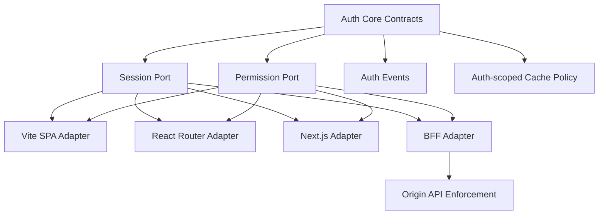
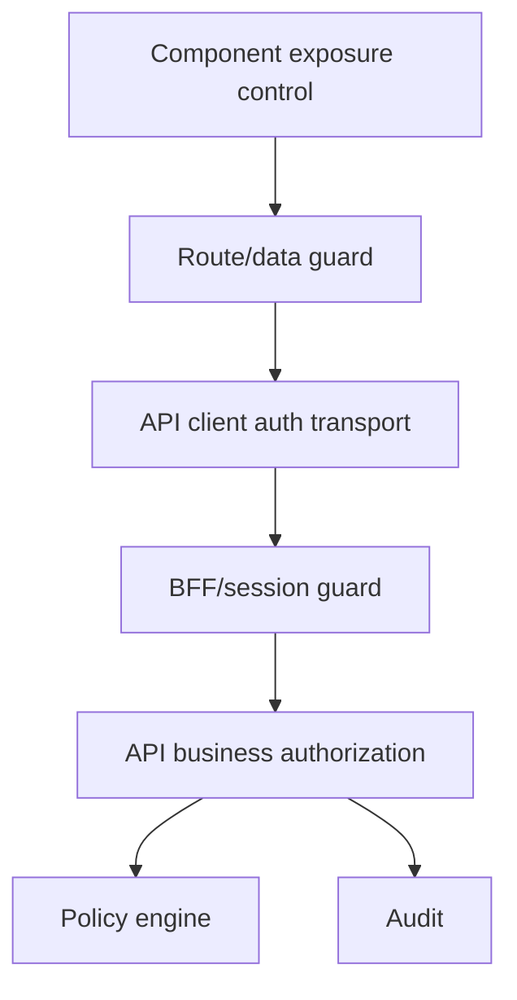
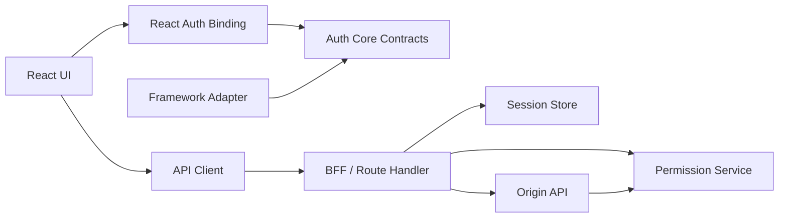

# Part 080 — Framework-agnostic React Auth Boundary

Frameworks change.

Auth invariants should not.

A React app may start as:

```txt
Vite SPA
```

Then move to:

```txt
React Router Data Mode
```

Then adopt:

```txt
React Router Framework Mode
```

Then migrate some surfaces to:

```txt
Next.js App Router + RSC + BFF
```

If auth is hardwired to one framework's component lifecycle, the migration becomes risky.

A strong auth architecture defines a portable boundary:

```txt
session contract
permission contract
auth state machine
runtime adapters
route/data integration adapters
API client boundary
server enforcement boundary
```

The core idea:

```txt
React auth should be framework-integrated, not framework-owned.
```

The framework can provide loaders, actions, server components, route handlers, middleware, and rendering modes.

But the auth model should remain stable.

---

## 1. The boundary you want

Design auth as ports and adapters.



The auth core defines semantics.

Adapters bind those semantics to framework APIs.

This prevents every route, component, and API client from inventing its own auth language.

---

## 2. Framework-specific code should be thin

Bad design:

```txt
Every route/component directly knows about provider SDK, cookies, router redirects, token refresh, role parsing, and permission rules.
```

Good design:

```txt
Routes ask for session/permission through a small framework adapter.
Components consume a stable projection.
Server actions call server auth functions.
APIs enforce business authorization directly.
```

The key split:

```txt
Auth core: what auth means.
Framework adapter: how this framework runs auth.
Provider adapter: how this IdP exposes identity/session.
Policy adapter: how permission decisions are fetched/evaluated.
```

---

## 3. Stable domain contracts

Start with the domain.

```ts
export type AuthStatus =
  | "unknown"
  | "anonymous"
  | "authenticated"
  | "expired"
  | "forbidden"
  | "degraded";

export type SessionProjection = {
  status: AuthStatus;
  user?: {
    id: string;
    displayName: string;
    email?: string;
  };
  tenant?: {
    id: string;
    name: string;
    membershipId: string;
  };
  assurance?: {
    level: "low" | "medium" | "high";
    authTime?: string;
  };
  epochs?: {
    session: string;
    permission: string;
    policy: string;
  };
};
```

This projection is safe for React.

It is not a raw provider profile.

It is not a JWT payload dump.

It is not a database user row.

---

## 4. Permission contract

A stable permission contract looks like this:

```ts
export type PermissionDecision =
  | {
      allowed: true;
      reason?: string;
      obligations?: PermissionObligation[];
    }
  | {
      allowed: false;
      reason:
        | "NO_SESSION"
        | "TENANT_REQUIRED"
        | "TENANT_FORBIDDEN"
        | "PERMISSION_DENIED"
        | "STEP_UP_REQUIRED"
        | "RESOURCE_NOT_FOUND"
        | "POLICY_UNAVAILABLE";
      recoverable: boolean;
      safeMessage: string;
      obligations?: PermissionObligation[];
    };

export type PermissionObligation =
  | { type: "MASK_FIELD"; field: string }
  | { type: "READ_ONLY"; field?: string }
  | { type: "REQUIRE_STEP_UP"; maxAgeSeconds: number }
  | { type: "AUDIT_REASON_REQUIRED" };
```

The UI can use this consistently.

```tsx
const decision = useCan({
  action: "case.approve",
  resource: { type: "case", id: caseId },
});
```

But the server still enforces.

```txt
`useCan()` controls exposure.
The API controls authorization.
```

---

## 5. The core auth client interface

Define a minimal interface that does not mention React Router, Next.js, Auth0, Clerk, Cognito, cookies, or localStorage.

```ts
export interface AuthClient {
  getSnapshot(): SessionProjection;
  subscribe(listener: () => void): () => void;
  bootstrap(): Promise<SessionProjection>;
  login(options?: LoginOptions): Promise<void>;
  logout(options?: LogoutOptions): Promise<void>;
  refresh?(): Promise<SessionProjection>;
}

export type LoginOptions = {
  returnTo?: string;
  tenantHint?: string;
  stepUp?: boolean;
};

export type LogoutOptions = {
  reason?: "USER" | "SESSION_EXPIRED" | "REVOKED" | "TENANT_SWITCH";
  returnTo?: string;
};
```

React integration becomes simple.

```ts
export function createAuthStore(authClient: AuthClient) {
  return {
    getSnapshot: () => authClient.getSnapshot(),
    subscribe: (listener: () => void) => authClient.subscribe(listener),
    bootstrap: () => authClient.bootstrap(),
    login: (options?: LoginOptions) => authClient.login(options),
    logout: (options?: LogoutOptions) => authClient.logout(options),
  };
}
```

Framework adapters decide when to call these methods.

---

## 6. React binding

The React binding should be small and boring.

```tsx
import { createContext, useContext, useSyncExternalStore } from "react";

const AuthContext = createContext<AuthClient | null>(null);

export function AuthProvider({
  client,
  children,
}: {
  client: AuthClient;
  children: React.ReactNode;
}) {
  return <AuthContext.Provider value={client}>{children}</AuthContext.Provider>;
}

export function useSessionProjection(): SessionProjection {
  const client = useContext(AuthContext);

  if (!client) {
    throw new Error("AuthProvider is missing");
  }

  return useSyncExternalStore(
    client.subscribe,
    client.getSnapshot,
    client.getSnapshot,
  );
}
```

This React code does not know where session comes from.

Could be:

```txt
/session endpoint
provider SDK
React Router loader hydration
Next.js server projection
BFF cookie session
memory-only SPA token manager
```

That is the point.

---

## 7. Adapter for Vite SPA

In a pure SPA, bootstrap likely calls an endpoint or provider SDK.

```ts
export function createSpaAuthClient(input: {
  fetchSession: () => Promise<SessionProjection>;
  startLogin: (options?: LoginOptions) => Promise<void>;
  startLogout: (options?: LogoutOptions) => Promise<void>;
}): AuthClient {
  let snapshot: SessionProjection = { status: "unknown" };
  const listeners = new Set<() => void>();

  function emit(next: SessionProjection) {
    snapshot = next;
    listeners.forEach((listener) => listener());
  }

  return {
    getSnapshot: () => snapshot,
    subscribe(listener) {
      listeners.add(listener);
      return () => listeners.delete(listener);
    },
    async bootstrap() {
      try {
        const next = await input.fetchSession();
        emit(next);
        return next;
      } catch {
        const degraded: SessionProjection = { status: "degraded" };
        emit(degraded);
        return degraded;
      }
    },
    login: input.startLogin,
    logout: input.startLogout,
  };
}
```

Important SPA constraints:

```txt
Do not persist refresh tokens in localStorage.
Use memory token if pure SPA bearer token model is required.
Prefer BFF/session cookie for higher-risk apps.
Clear app cache on logout and tenant switch.
Do not trust decoded token as authorization.
```

---

## 8. Adapter for React Router Data Mode

React Router Data Mode gives `loader` and `action` boundaries.

Use them.

```ts
export async function requireSessionLoader({ request }: { request: Request }) {
  const session = await fetchSessionProjection(request);

  if (session.status === "anonymous" || session.status === "expired") {
    const returnTo = new URL(request.url).pathname;
    throw redirect(`/login?returnTo=${encodeURIComponent(returnTo)}`);
  }

  return session;
}
```

Then hydrate client store from loader data.

```tsx
export function RootAuthHydrator() {
  const session = useLoaderData() as SessionProjection;
  const authClient = useAuthClient();

  useEffect(() => {
    authClient.replaceSnapshot(session);
  }, [authClient, session]);

  return <Outlet />;
}
```

For actions:

```ts
export async function approveCaseAction({ request, params }: ActionArgs) {
  const session = await requireServerSession(request);

  await enforcePermission({
    subject: session.subject,
    action: "case.approve",
    resource: { type: "case", id: params.caseId! },
    context: { tenantId: session.tenantId },
  });

  return approveCase(params.caseId!, await request.formData());
}
```

React Router adapter rule:

```txt
Use route loaders/actions for data/mutation auth.
Use React hooks/components for exposure control.
Never rely on component guards alone.
```

---

## 9. Adapter for Next.js App Router

In Next.js App Router, you need separate adapters for:

```txt
Server Components
Client Components
Route Handlers
Server Actions
Middleware/Proxy
```

Do not use one helper everywhere.

### Server Component adapter

```ts
export async function getServerSessionProjection(): Promise<SessionProjection> {
  const session = await requireOrReadSessionFromCookies();

  if (!session) {
    return { status: "anonymous" };
  }

  return projectSessionForClient(session);
}
```

### Client Component adapter

```tsx
export function ClientAuthProvider({
  initialSession,
  children,
}: {
  initialSession: SessionProjection;
  children: React.ReactNode;
}) {
  const client = useMemo(() => createHydratedAuthClient(initialSession), [initialSession]);

  return <AuthProvider client={client}>{children}</AuthProvider>;
}
```

### Route Handler adapter

```ts
export async function GET() {
  const session = await getServerSessionProjection();

  return Response.json(session, {
    headers: {
      "Cache-Control": "no-store",
    },
  });
}
```

### Server Action adapter

```ts
"use server";

export async function approveCase(input: { caseId: string }) {
  const session = await requireServerSession();

  await enforcePermission({
    subject: session.subject,
    action: "case.approve",
    resource: { type: "case", id: input.caseId },
    context: { tenantId: session.tenantId },
  });

  return approveCaseInDomain(input.caseId, session);
}
```

Next.js adapter rule:

```txt
Server Components project safe data.
Route Handlers mutate cookies and expose BFF endpoints.
Server Actions enforce mutation authorization.
Client Components consume projection only.
Middleware/Proxy performs coarse route classification only.
```

---

## 10. Provider adapter

Auth providers differ.

Your app should not let provider-specific concepts leak everywhere.

Provider concepts:

```txt
Auth0 organization
Clerk organization
Cognito user pool/group
WorkOS organization/connection
OIDC acr/amr/auth_time
SAML attributes/groups
```

App concepts:

```txt
user
account
tenant
membership
role
permission
assurance
session
impersonation
```

Create a provider mapper.

```ts
export interface IdentityProviderAdapter {
  getLoginUrl(options: LoginOptions): Promise<string>;
  exchangeCallback(request: Request): Promise<ProviderSession>;
  logout(session: ProviderSession): Promise<void>;
  refresh?(session: ProviderSession): Promise<ProviderSession>;
}

export type ProviderSession = {
  providerUserId: string;
  issuer: string;
  subject: string;
  email?: string;
  name?: string;
  rawClaims: Record<string, unknown>;
  tokens?: {
    accessToken?: string;
    idToken?: string;
    refreshToken?: string;
    expiresAt?: number;
  };
};
```

Then map into app identity.

```ts
export async function mapProviderToAppIdentity(
  providerSession: ProviderSession,
): Promise<AppIdentity> {
  const user = await findOrCreateUserByProviderSubject({
    issuer: providerSession.issuer,
    subject: providerSession.subject,
    email: providerSession.email,
  });

  return {
    userId: user.id,
    displayName: user.displayName,
    linkedProvider: {
      issuer: providerSession.issuer,
      subject: providerSession.subject,
    },
  };
}
```

This protects you from provider migration.

---

## 11. Policy adapter

Policy engines also differ.

Examples:

```txt
hardcoded service policy
SQL permission tables
OPA/Rego
Cedar/Amazon Verified Permissions
OpenFGA/Zanzibar-style ReBAC
custom workflow policy engine
```

Define a stable app-level policy port.

```ts
export interface PermissionService {
  check(input: PermissionCheckInput): Promise<PermissionDecision>;
  batchCheck(inputs: PermissionCheckInput[]): Promise<PermissionDecision[]>;
  listAllowedActions(input: ListAllowedActionsInput): Promise<AllowedAction[]>;
}

export type PermissionCheckInput = {
  subject: {
    userId: string;
    tenantId?: string;
    sessionId?: string;
  };
  action: string;
  resource: {
    type: string;
    id?: string;
    attributes?: Record<string, unknown>;
  };
  context?: {
    tenantId?: string;
    assuranceLevel?: string;
    authTime?: string;
    requestId?: string;
  };
};
```

React never needs to know whether the policy came from RBAC, ABAC, ACL, or ReBAC.

React needs a decision projection.

The API needs the real enforcement.

---

## 12. API client boundary

Framework-agnostic auth requires a stable API client boundary.

```ts
export interface ApiClient {
  get<T>(path: string, options?: ApiOptions): Promise<T>;
  post<T>(path: string, body: unknown, options?: ApiOptions): Promise<T>;
  put<T>(path: string, body: unknown, options?: ApiOptions): Promise<T>;
  delete<T>(path: string, options?: ApiOptions): Promise<T>;
}

export type ApiOptions = {
  tenantId?: string;
  idempotencyKey?: string;
  signal?: AbortSignal;
  authMode?: "required" | "optional" | "none";
};
```

Auth transport is adapter-specific.

```txt
BFF/cookie: browser sends same-origin cookie; API client adds CSRF for unsafe methods.
Pure SPA/bearer: API client injects in-memory access token.
SSR/server: server API client attaches verified internal context.
Next Server Action: no browser API client involved; server calls domain directly.
```

Do not leak transport details into components.

Bad:

```tsx
fetch("/api/cases", {
  headers: {
    Authorization: `Bearer ${localStorage.getItem("token")}`,
  },
});
```

Good:

```tsx
const cases = await apiClient.get<CaseList>("/cases", {
  authMode: "required",
  tenantId,
});
```

---

## 13. Auth event bus

Auth state changes must coordinate caches, tabs, routes, and UI.

Define events once.

```ts
export type AuthEvent =
  | { type: "SESSION_BOOTSTRAPPED"; session: SessionProjection }
  | { type: "SESSION_EXPIRED"; reason: string }
  | { type: "SESSION_REFRESHED"; session: SessionProjection }
  | { type: "LOGOUT_STARTED"; reason: string }
  | { type: "LOGOUT_COMPLETED" }
  | { type: "TENANT_CHANGED"; tenantId: string }
  | { type: "PERMISSION_EPOCH_CHANGED"; epoch: string }
  | { type: "STEP_UP_COMPLETED"; assuranceLevel: string };
```

Adapters can listen differently.

```txt
React Query adapter clears/invalidate caches.
React Router adapter revalidates routes.
Next client adapter refreshes router state.
BroadcastChannel adapter notifies other tabs.
Analytics adapter emits safe event metadata.
```

One event language prevents drift.

---

## 14. Cache adapter

Auth-scoped caching must be explicit.

```ts
export interface AuthCacheCoordinator {
  onLogout(): Promise<void> | void;
  onTenantChanged(tenantId: string): Promise<void> | void;
  onPermissionEpochChanged(epoch: string): Promise<void> | void;
  onSessionExpired(): Promise<void> | void;
}
```

Implementations:

```txt
TanStack Query: queryClient.clear/remove/invalidate
React Router: revalidator.revalidate / route reload
Apollo: resetStore / clearStore
SWR: mutate keys
Browser storage: remove tenant/user scoped entries
Service worker: delete auth-sensitive caches
Next.js client: router.refresh where appropriate
```

Never leave cache cleanup as a comment in logout code.

Make it part of auth architecture.

---

## 15. Authorization boundary layering

A framework-agnostic app should have layered checks.



Each layer has a purpose:

| Layer | Purpose | Can it enforce? |
|---|---|---:|
| Component | UX exposure and affordance | No |
| Route loader/layout | Prevent wrong data/render path | Partially, only route/data boundary |
| API client | Attach credentials/CSRF, normalize errors | No final authorization |
| BFF/session guard | Validate web session and protect token vault | Yes for session and BFF-owned ops |
| Origin API | Enforce business authorization | Yes |
| Policy engine | Decide allowed/denied | Yes, decision authority |
| Audit | Produce evidence | Not enforcement, but critical |

A missing component guard is a UX bug.

A missing API authorization check is a security bug.

---

## 16. Migration-friendly folder structure

A portable structure:

```txt
src/
  auth/
    core/
      session-contract.ts
      permission-contract.ts
      auth-events.ts
      errors.ts
      state-machine.ts
    react/
      AuthProvider.tsx
      useSessionProjection.ts
      useCan.ts
      Can.tsx
    browser/
      spa-auth-client.ts
      broadcast-auth-events.ts
      browser-cache-coordinator.ts
    router/
      react-router-loaders.ts
      react-router-actions.ts
      route-permission-metadata.ts
    next/
      server-session.ts
      route-handlers.ts
      server-actions.ts
      middleware-classifier.ts
      ClientAuthProvider.tsx
    server/
      require-session.ts
      csrf.ts
      session-store.ts
      permission-service.ts
      audit.ts
    providers/
      oidc-provider-adapter.ts
      auth0-adapter.ts
      clerk-adapter.ts
      cognito-adapter.ts
    testing/
      auth-fixtures.ts
      permission-matrix.ts
      mock-auth-client.ts
```

Rules:

```txt
core imports nothing from framework.
react imports core only.
router imports core/server/react as needed.
next imports core/server/react as needed.
browser never imports server.
server never imports React UI.
providers never leak raw claims into components.
```

---

## 17. Build-time guardrails

Do not rely only on discipline.

Add guardrails.

### Import boundaries

```txt
browser code cannot import src/auth/server
client components cannot import token vault
shared code cannot import framework runtime APIs
edge code cannot import node-only modules
```

Tools can enforce this:

```txt
ESLint no-restricted-imports
package export maps
separate tsconfig paths
bundle analyzer
unit tests for import graph
```

Example ESLint rule idea:

```json
{
  "rules": {
    "no-restricted-imports": [
      "error",
      {
        "patterns": [
          {
            "group": ["src/auth/server/*", "src/auth/node/*"],
            "message": "Server auth modules must not be imported into browser code."
          }
        ]
      }
    ]
  }
}
```

### Type-level separation

```ts
declare const serverOnlyBrand: unique symbol;

export type ServerOnly<T> = T & {
  readonly [serverOnlyBrand]: "server-only";
};

export type RawProviderTokens = ServerOnly<{
  accessToken: string;
  refreshToken?: string;
  idToken?: string;
}>;
```

Types are not security boundaries.

But they reduce accidental misuse.

---

## 18. Framework migration examples

### Vite SPA to React Router Data Mode

Stable contracts remain:

```txt
SessionProjection
PermissionDecision
AuthClient
PermissionService
ApiClient
AuthEvent
```

Change:

```txt
bootstrap moves from component effect to root loader
redirect moves from component guard to loader redirect
mutation auth moves from component submit handler to route action/server API
```

### React Router to Next.js App Router

Stable contracts remain.

Change:

```txt
root loader becomes server layout/session projection
route action becomes server action or route handler
React Router redirect becomes Next redirect/navigation
BFF route handlers become app/api route handlers
router revalidation becomes router.refresh/cache invalidation
```

### Provider migration

Stable contracts remain.

Change:

```txt
IdentityProviderAdapter implementation
callback exchange handling
claim mapping
organization/tenant discovery mapping
webhook sync implementation
```

If auth was designed behind ports, migration is controlled.

If every component knows provider claims, migration is a rewrite.

---

## 19. Framework-agnostic testing strategy

Test the core once.

Test adapters separately.

### Core tests

```txt
auth state transitions
permission decision normalization
deny-by-default behavior
error taxonomy mapping
auth event sequencing
cache coordinator triggers
```

### React binding tests

```txt
AuthProvider exposes snapshot
useCan fails closed during unknown state
Can component hides/disables/explains correctly
session update rerenders subscribers
```

### Framework adapter tests

```txt
React Router loader redirects anonymous user
React Router action enforces mutation permission
Next Route Handler returns no-store session projection
Next Server Action enforces permission before mutation
Middleware/Proxy only performs coarse classification
SPA adapter bootstraps and handles degraded state
```

### Integration tests

```txt
logout clears cache and redirects safely
permission epoch change invalidates UI
tenant switch clears previous tenant data
step-up required triggers recovery flow
server 403 rolls back optimistic UI
```

### Security regression tests

```txt
client bundle does not contain server secret module
client cannot spoof internal auth headers
component hidden button direct API call still denied
route direct URL access still checked by loader/server
stale permission cache fails closed
```

---

## 20. What should remain framework-specific

Some things should remain framework-specific.

Do not over-abstract them.

| Concern | Keep framework-specific? | Why |
|---|---:|---|
| Redirect primitive | Yes | Different frameworks throw/return/navigate differently |
| Cookie mutation | Yes | Depends on response boundary |
| Route metadata | Yes | Router-specific APIs differ |
| Server Components | Yes | Next/RSC-specific semantics |
| Loader/action execution | Yes | Router/framework-specific lifecycle |
| Auth state machine | No | Domain invariant |
| Session projection | No | App contract |
| Permission decision | No | App contract |
| Provider mapping | Mostly no | App identity should be stable |
| API enforcement | No | Security invariant |

Abstraction should reduce drift, not hide important lifecycle differences.

---

## 21. Reference architecture

A practical portable architecture:



Flow:

```txt
1. Framework adapter bootstraps session projection.
2. React AuthProvider exposes safe projection to UI.
3. Permission UI uses `useCan()` with decision projection.
4. API client sends intent through BFF/API.
5. Server validates session, CSRF, tenant, and permission.
6. Origin API enforces business authorization.
7. Audit records decision-relevant evidence.
8. Auth events invalidate caches and revalidate routes.
```

This architecture works for SPA, React Router, and Next.js.

The integration points change.

The security model does not.

---

## 22. Production checklist

Before calling your auth boundary framework-agnostic, verify:

```txt
Core contracts do not import framework modules.
Browser code cannot import server modules.
Provider claims are mapped to app identity.
Permission contract does not expose raw policy internals.
Component checks fail closed.
Route/data checks exist where framework supports them.
Server mutation checks exist regardless of UI checks.
API authorization is tested independently from UI.
Logout clears framework caches and browser caches.
Tenant switch invalidates tenant-scoped state.
Step-up auth is represented in the same decision contract.
Auth errors have stable reason codes.
Audit events use app identity, not provider-only identity.
```

---

## 23. Phase 8 closeout

Phase 8 moved auth from SPA-only thinking into server/runtime architecture.

You should now be able to reason about:

```txt
SPA vs SSR vs BFF trade-offs
BFF token hiding
Next.js App Router auth boundaries
React Server Component leakage risks
Edge middleware/proxy as coarse gate
SSR session refresh and cookie mutation boundaries
hydration/auth mismatch
secure layout composition
multi-runtime auth authority
framework-agnostic auth contracts
```

The deep lesson:

```txt
Auth code should follow authority boundaries, not component boundaries.
```

React components are where users experience auth.

They are not where auth becomes true.

---

## 24. Final mental model

A framework-agnostic React auth boundary has three layers.

```txt
Domain layer:
  session projection
  permission decision
  auth event
  error taxonomy

Runtime layer:
  browser adapter
  router adapter
  server adapter
  edge adapter
  provider adapter
  policy adapter

Enforcement layer:
  BFF/session guard
  API authorization
  policy engine
  audit trail
```

Keep these layers separate.

Then your auth system can evolve with React frameworks without losing its security invariants.

---

## References

- React Docs — Hooks and external stores: https://react.dev/reference/react/hooks
- React Docs — Server Components: https://react.dev/reference/rsc/server-components
- React Router Docs — Picking a Mode: https://reactrouter.com/start/modes
- React Router Docs — Data Loading: https://reactrouter.com/start/framework/data-loading
- React Router Docs — Middleware: https://reactrouter.com/how-to/middleware
- Next.js Docs — Authentication: https://nextjs.org/docs/app/guides/authentication
- Next.js Docs — Server and Client Components: https://nextjs.org/docs/app/getting-started/server-and-client-components
- OWASP Authorization Cheat Sheet: https://cheatsheetseries.owasp.org/cheatsheets/Authorization_Cheat_Sheet.html
- RFC 9700 — OAuth 2.0 Security Best Current Practice: https://www.rfc-editor.org/rfc/rfc9700.html
