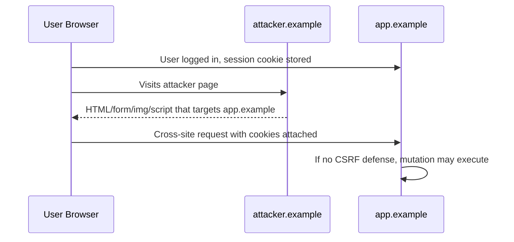
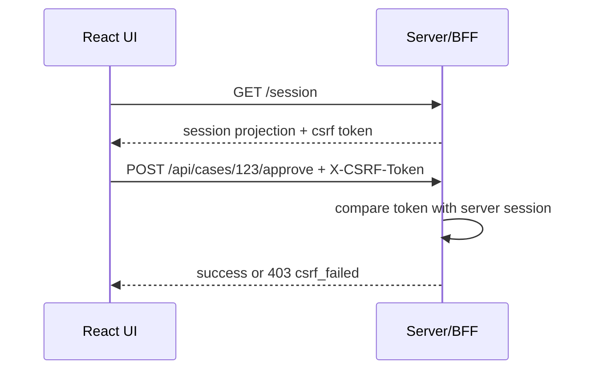
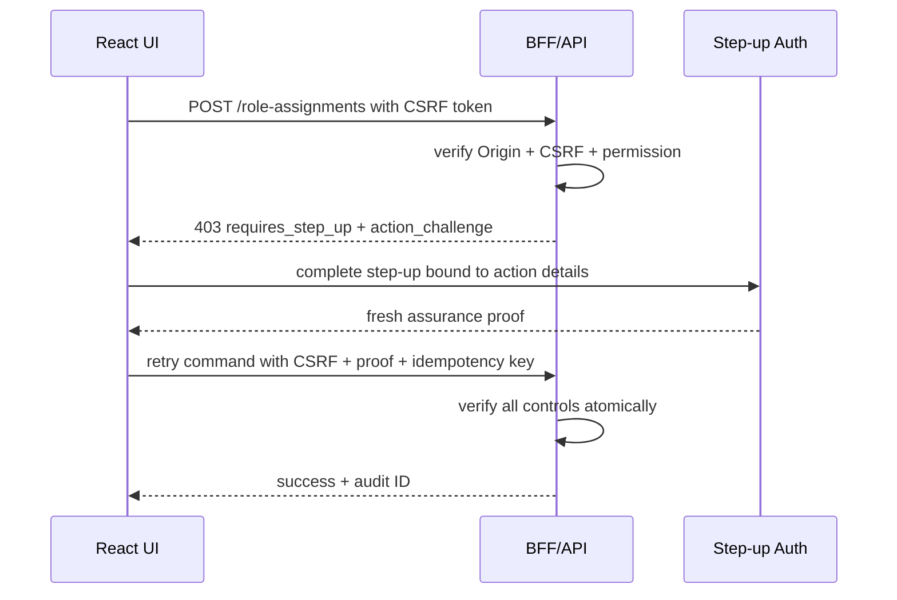

# Part 082 — CSRF Impact on Cookie Auth

Cookie authentication has a beautiful property:

```txt
JavaScript does not need to hold the credential.
```

With `HttpOnly` cookies, React components cannot read the session cookie.

That reduces token theft from XSS.

But cookie authentication has a different default behavior:

```txt
The browser may attach cookies automatically to requests.
```

That automatic attachment is what makes CSRF possible.

The wrong mental model is:

```txt
We use HttpOnly cookies, so the frontend is secure.
```

The better mental model is:

```txt
HttpOnly protects cookie confidentiality from JavaScript.
CSRF protection controls which cross-site requests are allowed to use that cookie authority.
```

Cookie auth needs CSRF design.

---

## 1. What CSRF means

Cross-site request forgery happens when an attacker causes the user's browser to send an authenticated request to your app from another site.

The attacker does not need to read the response.

They only need the browser to perform an action.



CSRF targets side effects.

Examples:

```txt
change email
create invite
approve case
delete record
change password
change notification endpoint
generate export
link external account
modify workflow state
assign role
```

CSRF is less about stealing data directly.

It is about forcing state change.

---

## 2. Why React apps still care

A React SPA often calls APIs with `fetch`.

That makes developers think CSRF is an old server-rendered form problem.

It is not.

If your API accepts cookie-authenticated unsafe methods, CSRF is relevant.

Cookie-authenticated APIs include:

```txt
traditional server session
BFF session
Next.js Route Handler session
same-origin API session
subdomain-shared session
admin console session
```

If the browser automatically attaches credential authority, you need CSRF controls.

---

## 3. CSRF vs XSS

CSRF and XSS are different.

| Threat | Attacker code runs inside app origin? | Attacker can read response? | Main risk |
|---|---:|---:|---|
| CSRF | No | Usually no | Force authenticated state change |
| XSS | Yes | Yes | Execute as in-origin actor |

Important implication:

```txt
CSRF defenses are not XSS defenses.
```

If attacker JavaScript already runs in your origin, it may read CSRF tokens, call APIs, and bypass many CSRF mitigations.

So the control stack is layered:

```txt
XSS prevention protects the origin.
CSRF prevention protects cookie authority from cross-site request initiation.
Server-side authorization protects resource/action access.
Step-up protects sensitive actions from stale/low-assurance sessions.
```

---

## 4. When CSRF matters

CSRF risk depends on credential transport and endpoint behavior.

| Auth transport | CSRF risk | Why |
|---|---:|---|
| `HttpOnly` same-site cookie session | Yes | Browser attaches cookie. |
| `HttpOnly` cross-site cookie session | High if `SameSite=None` | Cookie sent in third-party contexts. |
| Bearer token in `Authorization` header | Usually lower | Cross-site HTML cannot set custom authorization header without CORS/preflight. |
| BFF cookie session | Yes | BFF endpoints are cookie-authenticated. |
| OAuth redirect callback | Different class | Needs `state`/PKCE/nonce, not normal CSRF token. |
| Public unauthenticated endpoint | No auth CSRF | Still may need abuse protection. |

CSRF protection is required for state-changing requests authenticated by ambient credentials.

Ambient credential means:

```txt
credential is attached by browser/runtime automatically, not explicitly by app code
```

Cookies are ambient.

Bearer headers are explicit.

---

## 5. Unsafe methods and unsafe endpoints

HTTP method matters, but method alone is not a security boundary.

Common rule:

```txt
GET/HEAD/OPTIONS should be safe and not mutate state.
POST/PUT/PATCH/DELETE require CSRF protection if cookie-authenticated.
```

Bad:

```http
GET /api/cases/123/approve
```

This is CSRF-prone and cache-prone.

Better:

```http
POST /api/cases/123/approve
Content-Type: application/json
X-CSRF-Token: <token>
```

But even POST is not safe by itself.

A simple HTML form can submit POST cross-site.

So unsafe methods need explicit CSRF defenses.

---

## 6. SameSite cookies

`SameSite` controls when cookies are sent on cross-site requests.

Typical values:

```txt
Strict
Lax
None
```

### 6.1 `SameSite=Strict`

Strongest default CSRF reduction.

Cookies are not sent on cross-site navigations.

Trade-off:

```txt
May break flows where user follows external link into app and expects logged-in state.
```

Good for:

```txt
admin console
regulated internal app
high-risk operations
separate auth/session model
```

### 6.2 `SameSite=Lax`

Usually a reasonable baseline for many apps.

Cookies are sent on some top-level navigations, but not most cross-site subresource/form-like contexts.

Trade-off:

```txt
Better usability than Strict, less restrictive than Strict.
```

Do not treat Lax as the only CSRF defense for high-risk operations.

### 6.3 `SameSite=None; Secure`

Needed for some cross-site embedding/federation/third-party use cases.

Highest CSRF concern.

If you need `SameSite=None`, you need stronger CSRF and origin controls.

Examples:

```txt
app embedded in another site
cross-site SSO integration detail
third-party widget
multi-domain architecture
```

For most first-party React apps, prefer avoiding `SameSite=None` for the primary app session.

---

## 7. Cookie attributes for auth sessions

A typical app session cookie:

```http
Set-Cookie: __Host-app_session=<opaque>; Path=/; Secure; HttpOnly; SameSite=Lax
```

Why:

```txt
__Host- prefix: prevents Domain attribute and requires Path=/ and Secure in supporting browsers
Secure: HTTPS only
HttpOnly: not readable by JavaScript
SameSite: reduces cross-site attachment
Path=/: explicit app scope
opaque value: no sensitive claims in cookie itself
```

Do not store readable auth claims in cookies.

Bad:

```http
Set-Cookie: role=admin; Path=/
```

Readable or client-controlled cookies are not authorization authority.

---

## 8. CSRF token patterns

### 8.1 Synchronizer token pattern

Server stores a CSRF token associated with the session.

Client sends it on unsafe requests.



Properties:

```txt
strong when token is session-bound
works well with BFF/session store
requires token exposure to legitimate JS
XSS can still read/use token
```

### 8.2 Double-submit cookie pattern

Server sets CSRF token in a cookie readable by JavaScript.

Client copies it into a header.

Server checks header matches cookie.

Naive double-submit is weaker if attacker can set cookies for parent domain/subdomain.

Signed double-submit is stronger:

```txt
csrf_token = HMAC(server_secret, session_id_or_session_binding + nonce)
```

Server verifies signature and binding.

Important:

```txt
Do not bind only to user ID.
Bind to session-specific data.
```

### 8.3 Custom request header

React can send a custom header:

```ts
await fetch('/api/cases/123/approve', {
  method: 'POST',
  credentials: 'include',
  headers: {
    'content-type': 'application/json',
    'x-csrf-token': csrfToken,
  },
  body: JSON.stringify(command),
});
```

Cross-site forms cannot set arbitrary custom headers.

But be careful with CORS.

If your server allows credentialed CORS from untrusted origins, the protection weakens.

---

## 9. Origin and Referer validation

For unsafe cookie-authenticated requests, validate source headers.

Use:

```txt
Origin
Referer fallback when Origin missing
```

Server logic should compare against trusted origin(s):

```ts
type CsrfOriginDecision =
  | { ok: true }
  | { ok: false; reason: 'missing_origin' | 'untrusted_origin' | 'malformed_origin' };

const TRUSTED_ORIGINS = new Set([
  'https://app.example.com',
  'https://admin.example.com',
]);

export function verifyOrigin(headers: Headers): CsrfOriginDecision {
  const origin = headers.get('origin');

  if (origin) {
    return TRUSTED_ORIGINS.has(origin)
      ? { ok: true }
      : { ok: false, reason: 'untrusted_origin' };
  }

  const referer = headers.get('referer');

  if (!referer) {
    return { ok: false, reason: 'missing_origin' };
  }

  try {
    const refererOrigin = new URL(referer).origin;
    return TRUSTED_ORIGINS.has(refererOrigin)
      ? { ok: true }
      : { ok: false, reason: 'untrusted_origin' };
  } catch {
    return { ok: false, reason: 'malformed_origin' };
  }
}
```

In high-security systems, fail closed on missing headers for unsafe requests unless you have a documented compatibility exception.

---

## 10. CORS and CSRF interaction

CORS is not CSRF protection.

CORS controls whether browsers allow frontend JavaScript to read/send certain cross-origin requests.

CSRF can happen through request mechanisms that do not require reading the response.

Dangerous CORS config:

```http
Access-Control-Allow-Origin: https://attacker.example
Access-Control-Allow-Credentials: true
```

Very dangerous dynamic reflection:

```txt
Origin: https://evil.example
Access-Control-Allow-Origin: https://evil.example
Access-Control-Allow-Credentials: true
```

For credentialed APIs:

```txt
No wildcard origins.
No blind origin reflection.
Explicit allowlist.
Vary: Origin if dynamic.
No credentialed CORS for public/untrusted origins.
Preflight should be validated, not treated as auth.
```

Same-origin BFF is often simpler:

```txt
React app and BFF share origin.
Browser calls /api/* same-origin.
BFF calls downstream APIs server-side.
No browser credentialed CORS to resource servers.
```

---

## 11. React integration pattern

The React app should not make every component know CSRF details.

Centralize in the API client.

```ts
type SessionProjection = {
  status: 'anonymous' | 'authenticated';
  csrfToken?: string;
  csrfTokenVersion?: string;
};

class CsrfStore {
  private token: string | null = null;

  set(token: string | null) {
    this.token = token;
  }

  getRequired(): string {
    if (!this.token) {
      throw new Error('CSRF token is not available');
    }
    return this.token;
  }
}

export const csrfStore = new CsrfStore();
```

API client:

```ts
const UNSAFE_METHODS = new Set(['POST', 'PUT', 'PATCH', 'DELETE']);

export async function appFetch(input: RequestInfo | URL, init: RequestInit = {}) {
  const method = (init.method ?? 'GET').toUpperCase();
  const headers = new Headers(init.headers);

  if (UNSAFE_METHODS.has(method)) {
    headers.set('x-csrf-token', csrfStore.getRequired());
  }

  return fetch(input, {
    ...init,
    credentials: 'include',
    headers,
  });
}
```

Rules:

```txt
All unsafe app mutations go through appFetch.
Raw fetch for authenticated mutation is banned by lint/review.
CSRF token is updated on session bootstrap/refresh.
Token is cleared on logout.
403 csrf_failed triggers session reconciliation.
```

---

## 12. Session bootstrap and CSRF

A common BFF session bootstrap:

```http
GET /session
```

Response:

```json
{
  "status": "authenticated",
  "user": {
    "id": "usr_123",
    "displayName": "Ari"
  },
  "tenant": {
    "id": "tenant_abc",
    "name": "Regulated Ops"
  },
  "csrfToken": "csrf_...",
  "authEpoch": "ae_123",
  "permissionEpoch": "pe_456"
}
```

Make sure:

```txt
/session response is no-store
CSRF token is not logged
CSRF token is session-bound
CSRF token rotates on login/session renewal if appropriate
CSRF token is cleared from memory on logout
```

For high-risk apps, avoid persisting CSRF token to localStorage.

Keep it in memory and re-bootstrap after reload.

---

## 13. Handling CSRF failure

Do not return generic confusing failures.

Use typed denial.

```http
HTTP/1.1 403 Forbidden
Content-Type: application/problem+json
Cache-Control: no-store
```

```json
{
  "type": "https://errors.example.com/security/csrf-failed",
  "title": "Request could not be verified",
  "status": 403,
  "code": "csrf_failed",
  "correlationId": "corr_123"
}
```

React handling:

```ts
if (problem.code === 'csrf_failed') {
  authEvents.emit('session_reconcile_required', {
    reason: 'csrf_failed',
    correlationId: problem.correlationId,
  });
}
```

Do not automatically retry unsafe mutation with a new CSRF token unless the command is idempotent and the server guarantees the first attempt did not execute.

Safer UX:

```txt
refresh session projection
ask user to resubmit
preserve form draft if safe
show non-sensitive error message
log correlation ID
```

---

## 14. CSRF and content types

Many APIs require JSON:

```http
Content-Type: application/json
```

This can help because simple HTML forms do not submit JSON with custom headers.

But do not rely on content type alone.

Reasons:

```txt
misconfigured server may accept text/plain
method override may exist
old endpoints may accept form-urlencoded
CORS misconfiguration may allow custom headers
some endpoints may mutate on GET
```

Server should reject unexpected content types for unsafe JSON endpoints.

```ts
function requireJson(headers: Headers) {
  const contentType = headers.get('content-type') ?? '';

  if (!contentType.toLowerCase().includes('application/json')) {
    throw forbidden('unsupported_content_type_for_mutation');
  }
}
```

But this is supporting control, not the main control.

---

## 15. CSRF and GraphQL

GraphQL often uses a single endpoint:

```http
POST /graphql
```

If cookie-authenticated, mutation operations need CSRF protection.

Problems:

```txt
POST endpoint handles both query and mutation
GET queries may exist
persisted query endpoint may mutate if incorrectly configured
content-type handling may be too permissive
```

Recommended:

```txt
CSRF check for all cookie-authenticated POST /graphql requests
Reject mutations over GET
Require custom header for GraphQL unsafe operations
Enforce operation-level authorization in resolvers/business layer
No reliance on frontend route permission only
```

---

## 16. CSRF and file upload

File upload endpoints are high-risk.

CSRF can force upload or trigger import workflows if endpoint is cookie-authenticated.

Controls:

```txt
CSRF token on upload intent endpoint
CSRF token on finalize endpoint
size/type validation
server-side authorization
malware scanning/quarantine
no state change on GET download URL creation
short-lived signed URLs
```

Do not let a cross-site form post create a privileged file/import action.

---

## 17. CSRF and logout

Logout can be CSRF-sensitive.

Logout CSRF does not usually grant attacker access, but it can cause disruption or session confusion.

Options:

```txt
POST logout with CSRF token
SameSite cookie
Origin validation
idempotent logout behavior
clear local client state after server confirmation or confirmed session loss
```

For OIDC/logout flows, separate:

```txt
app logout
IdP logout
post-logout redirect validation
```

Do not use arbitrary post-logout return URLs.

---

## 18. Sensitive operation protection

CSRF controls are baseline.

Some actions need more.

Examples:

```txt
assign admin role
approve regulated decision
delete tenant
export PII
change MFA device
change password/email
create API key
start irreversible workflow
```

Add:

```txt
step-up authentication
fresh session requirement
WebAuthn user verification for critical actions
transaction confirmation details
server-side challenge binding
rate limits
audit and alerting
```

Do not rely on:

```txt
modal confirmation only
hidden form fields
frontend permission check only
button disabled state only
```

A CSRF-resistant sensitive action flow:



---

## 19. Implementation skeleton: BFF CSRF middleware

Example Express-style middleware:

```ts
type CsrfConfig = {
  trustedOrigins: Set<string>;
  unsafeMethods: Set<string>;
};

export function csrfMiddleware(config: CsrfConfig) {
  return async function csrf(req: RequestLike, res: ResponseLike, next: Next) {
    const method = req.method.toUpperCase();

    if (!config.unsafeMethods.has(method)) {
      return next();
    }

    const originDecision = verifyOriginHeader(req.headers, config.trustedOrigins);
    if (!originDecision.ok) {
      return res.status(403).json(problem('csrf_origin_failed'));
    }

    const session = req.auth?.session;
    if (!session) {
      return res.status(401).json(problem('unauthenticated'));
    }

    const supplied = req.headers['x-csrf-token'];
    if (!supplied || typeof supplied !== 'string') {
      return res.status(403).json(problem('csrf_missing'));
    }

    const ok = await csrfStore.verify({
      sessionId: session.id,
      suppliedToken: supplied,
    });

    if (!ok) {
      return res.status(403).json(problem('csrf_failed'));
    }

    return next();
  };
}
```

Important placement:

```txt
authenticate session first
then CSRF validate unsafe request
then route handler validates authorization/resource state
```

Do not skip authorization because CSRF passed.

---

## 20. Implementation skeleton: Next.js Route Handler

Conceptual shape:

```ts
import { NextRequest, NextResponse } from 'next/server';

const TRUSTED_ORIGINS = new Set(['https://app.example.com']);

export async function POST(request: NextRequest) {
  const session = await requireSession(request);

  const originDecision = verifyOrigin(request.headers, TRUSTED_ORIGINS);
  if (!originDecision.ok) {
    return problem(403, 'csrf_origin_failed');
  }

  const csrfToken = request.headers.get('x-csrf-token');
  if (!csrfToken) {
    return problem(403, 'csrf_missing');
  }

  const csrfOk = await verifyCsrfToken({
    sessionId: session.id,
    token: csrfToken,
  });

  if (!csrfOk) {
    return problem(403, 'csrf_failed');
  }

  const command = await request.json();

  const decision = await authorize({
    subject: session.subject,
    action: 'case.approve',
    resource: { type: 'case', id: command.caseId },
    context: { tenantId: session.tenantId },
  });

  if (!decision.allowed) {
    return problem(403, decision.reasonCode);
  }

  const result = await approveCase(command, session);
  return NextResponse.json(result, {
    headers: {
      'Cache-Control': 'no-store',
    },
  });
}
```

This shows the stack:

```txt
session authentication
CSRF verification
authorization
business invariant
mutation
```

Each layer solves a different problem.

---

## 21. Testing CSRF defenses

### 21.1 Cross-site form test

Create an attacker page:

```html
<form action="https://app.example.com/api/cases/123/approve" method="POST">
  <input name="reason" value="csrf attempt" />
</form>
<script>document.forms[0].submit()</script>
```

Expected:

```txt
403 csrf_missing or csrf_origin_failed
no mutation committed
security event logged
```

### 21.2 Missing token test

```ts
await fetch('/api/cases/123/approve', {
  method: 'POST',
  credentials: 'include',
  headers: { 'content-type': 'application/json' },
  body: JSON.stringify({ reason: 'missing csrf' }),
});
```

Expected:

```txt
403 csrf_missing
```

### 21.3 Wrong origin test

Send request with untrusted `Origin`.

Expected:

```txt
403 csrf_origin_failed
```

### 21.4 Valid token but unauthorized resource

Expected:

```txt
403 authorization_denied
```

This confirms CSRF success does not bypass authorization.

### 21.5 Stale token after logout/login

Expected:

```txt
old CSRF token fails against new session
```

### 21.6 CORS misconfiguration test

Verify:

```txt
credentialed CORS is not allowed for arbitrary origins
Access-Control-Allow-Origin is not blindly reflected
Access-Control-Allow-Credentials is only used with trusted origins
```

---

## 22. Observability

Record security events:

```txt
csrf_missing
csrf_invalid
csrf_origin_failed
csrf_referer_failed
csrf_token_session_mismatch
credentialed_cors_rejected
unsafe_get_mutation_rejected
```

Include:

```txt
correlation ID
session hash
tenant hash
route/action
method
origin classification
referer origin classification
user agent hash
IP/risk metadata if allowed
```

Avoid logging:

```txt
CSRF token value
cookie header
authorization header
full referer path if it may contain sensitive data
request body with PII
```

Metrics:

```txt
csrf failure rate by endpoint
missing Origin rate
trusted origin mismatch count
credentialed CORS rejection count
unsafe method without token count
```

High spikes may indicate attack, broken frontend deploy, stale session bootstrap, or proxy/header changes.

---

## 23. Common anti-patterns

### Anti-pattern: SameSite only

```txt
SameSite=Lax exists, therefore no CSRF token needed.
```

Better:

```txt
SameSite is a strong baseline, not the complete policy for high-risk mutations.
```

### Anti-pattern: CORS as CSRF defense

```txt
Our CORS blocks attacker, so CSRF is solved.
```

Better:

```txt
CORS and CSRF are different. CSRF may not need response read access.
```

### Anti-pattern: GET mutation

```http
GET /api/delete?id=123
```

Better:

```txt
Safe methods do not mutate.
Unsafe methods require CSRF + authorization.
```

### Anti-pattern: Non-session-bound double-submit

```txt
Header equals cookie, therefore valid.
```

Better:

```txt
Use session-bound signed token or synchronizer token.
```

### Anti-pattern: Accepting text/plain JSON

Attackers can submit `text/plain` via form tricks.

Better:

```txt
Strict content type validation plus CSRF token.
```

### Anti-pattern: CSRF token in localStorage

This creates unnecessary persistence and exposure.

Better:

```txt
memory token from /session bootstrap, reloaded as needed
```

### Anti-pattern: No CSRF on BFF because BFF is same-origin

Same-origin BFF simplifies CORS.

It does not remove CSRF risk for cookie-authenticated unsafe endpoints.

---

## 24. Production checklist

```txt
[ ] All state-changing endpoints use unsafe methods, never GET.
[ ] Cookie session uses Secure, HttpOnly, SameSite, and appropriate prefix/scope.
[ ] Unsafe cookie-authenticated requests require CSRF token.
[ ] CSRF token is session-bound.
[ ] Origin/Referer validation is enabled for unsafe requests.
[ ] Credentialed CORS uses explicit allowlist only.
[ ] No wildcard or blind reflected Access-Control-Allow-Origin with credentials.
[ ] JSON endpoints reject unexpected content types.
[ ] CSRF failure returns typed 403 with no-store.
[ ] Frontend API client attaches CSRF centrally.
[ ] CSRF token is cleared on logout/session change.
[ ] Old token fails after new login/session rotation.
[ ] GraphQL mutation endpoint is protected.
[ ] File upload intent/finalize endpoints are protected.
[ ] Sensitive operations require step-up/fresh auth when needed.
[ ] CSRF tests run in CI for representative endpoints.
[ ] Logs record reason codes but never token/cookie values.
```

---

## 25. Core takeaway

Cookie auth shifts the frontend threat model.

It reduces token exposure to JavaScript when using `HttpOnly` cookies.

But it introduces ambient authority:

```txt
browser automatically attaches cookies
```

CSRF controls ensure that unsafe state-changing requests are intentional requests from your app origin, not forged requests from another site.

The practical rule:

```txt
For cookie-authenticated React/BFF apps:
SameSite is baseline.
CSRF token is request proof.
Origin validation is source proof.
Server-side authorization is access proof.
Step-up is assurance proof.
```

Do not let any one layer pretend to be all layers.

---

## References

- OWASP Cross-Site Request Forgery Prevention Cheat Sheet — https://cheatsheetseries.owasp.org/cheatsheets/Cross-Site_Request_Forgery_Prevention_Cheat_Sheet.html
- OWASP Session Management Cheat Sheet — https://cheatsheetseries.owasp.org/cheatsheets/Session_Management_Cheat_Sheet.html
- OWASP Authorization Cheat Sheet — https://cheatsheetseries.owasp.org/cheatsheets/Authorization_Cheat_Sheet.html
- MDN Set-Cookie Header — https://developer.mozilla.org/en-US/docs/Web/HTTP/Reference/Headers/Set-Cookie
- MDN Using HTTP Cookies — https://developer.mozilla.org/en-US/docs/Web/HTTP/Guides/Cookies
- MDN CORS — https://developer.mozilla.org/en-US/docs/Web/HTTP/CORS
- Next.js Route Handlers — https://nextjs.org/docs/app/getting-started/route-handlers
