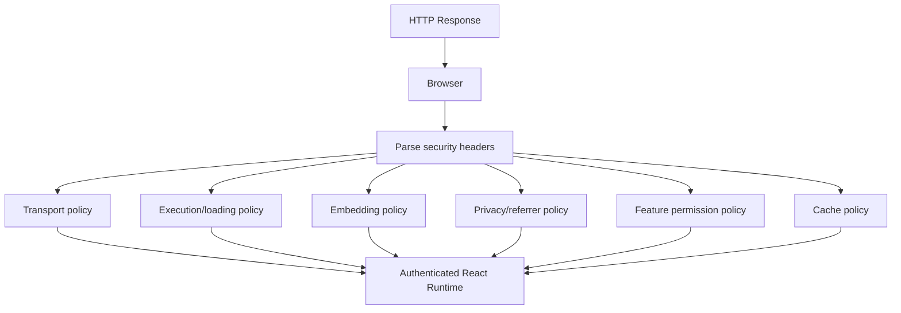

# Part 084 — Security Headers for React Apps

## 1. Ide inti

Security headers adalah cara server memberi instruksi keamanan ke browser.

Tetapi untuk React auth, security headers sering salah dipahami.

Security headers **bukan**:

- pengganti authorization,
- pengganti CSRF token,
- pengganti session revocation,
- bukti bahwa app aman,
- checklist scanner semata.

Security headers adalah **browser policy layer**.

Mereka membantu browser menjawab pertanyaan seperti:

- apakah halaman ini boleh di-frame?
- apakah browser boleh downgrade ke HTTP?
- apakah response boleh di-cache?
- apakah browser boleh menebak MIME type?
- apakah referrer path/query boleh dikirim ke origin lain?
- apakah camera/mic/geolocation/payment API boleh dipakai?
- apakah cross-origin resource boleh dibaca/di-embed?
- apakah semua resource harus HTTPS?

Dalam authenticated React app, header yang salah bisa menyebabkan:

- session leakage melalui referrer,
- sensitive page muncul via back button/cache,
- clickjacking pada approval/admin screen,
- MIME sniffing script execution,
- cross-origin isolation failure,
- CSRF defense melemah karena CORS/cookie config salah,
- token/cookie exposure akibat downgrade/mixed content,
- third-party iframe/script memperoleh privilege yang tidak perlu.

---

## 2. Header sebagai policy boundary



Security headers bekerja sebelum atau selama React runtime berjalan.

Karena itu, header harus dipasang di level:

- CDN/reverse proxy,
- BFF/SSR server,
- static hosting response config,
- API gateway,
- file service,
- OAuth callback endpoint,
- embed/document preview endpoint.

Jangan menunggu React component mount untuk memperbaiki behavior browser.

---

## 3. Header matrix untuk React auth

Tidak semua response butuh header yang sama.

| Response type | Header utama |
|---|---|
| Authenticated app shell HTML | CSP, HSTS, frame protection, referrer policy, permissions policy, no-store/private depending architecture. |
| Public marketing HTML | CSP, HSTS, referrer policy, permissions policy; cache can be public if no user data. |
| OAuth callback HTML | Strict CSP, no-store, frame-ancestors none, referrer no-referrer, no third-party. |
| JSON API sensitive | no-store, nosniff, CORS if cross-origin, request id. |
| Static JS/CSS asset | long-lived immutable cache, nosniff, CORP if needed. |
| File download | content-disposition, content-type, nosniff, cache policy, authorization server-side. |
| Embedded page | frame-ancestors allowlist, sandbox strategy, strict CSP. |
| Admin/impersonation page | strictest CSP, no-store, no third-party script, frame-ancestors none. |

One-size-fits-all security headers usually become either too weak for sensitive routes or too strict for public/static assets.

---

## 4. Recommended baseline for authenticated app shell

A strong baseline for authenticated React HTML response:

```http id="obkztu"
Strict-Transport-Security: max-age=31536000; includeSubDomains; preload
Content-Security-Policy: default-src 'none'; base-uri 'self'; object-src 'none'; frame-ancestors 'none'; form-action 'self'; script-src 'self' 'nonce-{NONCE}' 'strict-dynamic'; style-src 'self' 'nonce-{NONCE}'; img-src 'self' data: blob:; font-src 'self'; connect-src 'self' https://api.example.com; worker-src 'self' blob:; manifest-src 'self'; upgrade-insecure-requests
X-Content-Type-Options: nosniff
Referrer-Policy: strict-origin-when-cross-origin
Permissions-Policy: camera=(), microphone=(), geolocation=(), payment=(), usb=(), serial=(), clipboard-read=(), clipboard-write=(self)
Cache-Control: no-store
Cross-Origin-Opener-Policy: same-origin
Cross-Origin-Resource-Policy: same-origin
```

This is not universal. Treat it as a starting point.

Adjust for:

- public vs authenticated route,
- embedded use case,
- IdP iframe/popup behavior,
- file preview requirement,
- analytics/monitoring governance,
- cross-origin API architecture,
- static asset cache strategy,
- tenant custom domains,
- mobile WebView support.

---

## 5. Strict-Transport-Security / HSTS

Header:

```http id="wra4sf"
Strict-Transport-Security: max-age=31536000; includeSubDomains; preload
```

HSTS tells browser to access the host only over HTTPS for a time window.

Auth relevance:

- reduces HTTP downgrade exposure,
- protects session cookie transport after first secure visit,
- makes accidental `http://` links less dangerous,
- supports cookie `Secure` posture,
- helps prevent mixed deployment mistakes.

### 5.1 HSTS directives

| Directive | Meaning |
|---|---|
| `max-age=31536000` | Browser remembers HTTPS-only rule for one year. |
| `includeSubDomains` | Applies to subdomains too. |
| `preload` | Indicates intent for browser preload list. |

### 5.2 HSTS rollout

Do not enable `includeSubDomains; preload` blindly.

Checklist:

- [ ] Every subdomain supports HTTPS.
- [ ] No legacy HTTP-only subdomain remains.
- [ ] Staging/dev domains are separated.
- [ ] CDN and origin both serve HTTPS correctly.
- [ ] Certificate automation is reliable.
- [ ] Disaster recovery plan covers certificate failure.
- [ ] You understand preload removal can be slow.

A safer rollout:

```http id="v1kg59"
Strict-Transport-Security: max-age=300
```

Then increase:

```http id="w83emo"
Strict-Transport-Security: max-age=86400
```

Then:

```http id="v8f2lu"
Strict-Transport-Security: max-age=31536000; includeSubDomains
```

Then consider `preload` after full audit.

### 5.3 HSTS pitfalls

| Pitfall | Consequence |
|---|---|
| Preload too early | Broken subdomain access for users. |
| Missing `Secure` on cookies | HSTS helps navigation but cookie config is still wrong. |
| CDN serves HTTP redirect before HSTS known | First-visit downgrade window remains without preload. |
| Local/dev shares parent domain | Dev becomes hard to access over HTTP. |

---

## 6. Content-Security-Policy

CSP was covered deeply in Part 083. Here it appears as one security header among others.

Minimum useful directives for authenticated React app:

```http id="b2y045"
Content-Security-Policy:
  default-src 'none';
  object-src 'none';
  base-uri 'self';
  frame-ancestors 'none';
  form-action 'self';
  script-src 'self' 'nonce-{NONCE}' 'strict-dynamic';
  connect-src 'self' https://api.example.com;
```

Important distinction:

- `frame-ancestors` controls who may embed your page.
- `frame-src` controls what your page may embed.

For auth pages, missing this distinction creates bugs.

```http id="wyyc0o"
frame-ancestors 'none'; frame-src https://idp.example.com
```

Meaning:

- nobody can embed your app,
- your app may embed the IdP if necessary.

---

## 7. X-Frame-Options and `frame-ancestors`

Legacy header:

```http id="r0645k"
X-Frame-Options: DENY
```

Modern CSP equivalent:

```http id="r5gq7r"
Content-Security-Policy: frame-ancestors 'none'
```

Use `frame-ancestors` as the primary control. Keep `X-Frame-Options: DENY` as additional backward-compatible defense if it does not conflict with your embedding needs.

### 7.1 Clickjacking and auth

Clickjacking is especially dangerous for:

- approval screens,
- payment/transfer screens,
- admin role assignment,
- invite user flow,
- delete/archive actions,
- impersonation start/stop,
- consent/authorization screen,
- access request approval,
- regulated case transition.

For ordinary authenticated app:

```http id="d65oex"
Content-Security-Policy: frame-ancestors 'none'
X-Frame-Options: DENY
```

For approved embedding:

```http id="cdnnf7"
Content-Security-Policy: frame-ancestors https://portal.example.com
```

Avoid `ALLOW-FROM`; browser support is not reliable and CSP is the modern mechanism.

---

## 8. X-Content-Type-Options

Header:

```http id="r2e3ew"
X-Content-Type-Options: nosniff
```

Auth relevance:

- prevents browsers from MIME-sniffing response as script/style when content type says otherwise,
- reduces risk of uploaded file being interpreted as executable content,
- protects JSON/API/file responses from content confusion,
- supports safe static asset delivery.

Always use on:

- HTML,
- JS/CSS,
- JSON API,
- file download/preview,
- uploaded content domain.

But do not rely only on `nosniff` for file upload safety. You still need:

- content-type validation,
- file extension validation,
- storage isolation,
- content disposition,
- scanning,
- authorization on access.

---

## 9. Referrer-Policy

Header:

```http id="w4cgmg"
Referrer-Policy: strict-origin-when-cross-origin
```

Referrer can leak sensitive URLs.

Examples of sensitive URLs:

```txt id="c17d7k"
/app/cases/CASE-123?tenant=gov-agency-a
/reset-password?token=...
/invite?invitation=...
/oauth/callback?code=...
/files/preview?objectId=...
```

If a page navigates to a third-party site and sends full referrer, sensitive path/query data can leak.

### 9.1 Policy choices

| Policy | Behavior | Use case |
|---|---|---|
| `no-referrer` | Sends no referrer. | Highest privacy for callback/admin/sensitive pages. |
| `same-origin` | Sends referrer only to same origin. | Good for sensitive authenticated apps. |
| `strict-origin` | Sends only origin cross-origin, no downgrade. | Good privacy + analytics balance. |
| `strict-origin-when-cross-origin` | Full URL same-origin, origin only cross-origin. | Practical default for many apps. |
| `unsafe-url` | Sends full URL broadly. | Avoid for auth apps. |

For OAuth callback:

```http id="fvpjbc"
Referrer-Policy: no-referrer
```

For authenticated app shell:

```http id="o1fjbp"
Referrer-Policy: strict-origin-when-cross-origin
```

For admin/regulated pages, consider:

```http id="gagzke"
Referrer-Policy: same-origin
```

---

## 10. Permissions-Policy

Header:

```http id="rm3yg0"
Permissions-Policy: camera=(), microphone=(), geolocation=(), payment=(), usb=(), serial=(), clipboard-read=(), clipboard-write=(self)
```

Permissions Policy lets server control which browser features may be used by document and iframes.

Auth relevance:

- reduce impact of XSS/third-party widgets,
- prevent unexpected camera/mic/geolocation use,
- constrain iframe capabilities,
- document privacy posture,
- enforce least privilege at browser feature level.

### 10.1 Policy by feature

| Feature | Default recommendation for auth app |
|---|---|
| `camera` | `()` unless app needs capture. |
| `microphone` | `()` unless app needs recording/call. |
| `geolocation` | `()` unless domain-approved. |
| `payment` | `()` unless checkout/payment flow. |
| `usb`, `serial`, `hid` | `()` for most business apps. |
| `clipboard-read` | `()` or tightly scoped. |
| `clipboard-write` | `(self)` if copy buttons needed. |
| `fullscreen` | `(self)` only if needed. |
| `screen-wake-lock` | `()` unless operational app needs it. |

### 10.2 Permission-aware UX

If a feature is denied by Permissions Policy, React UI should not pretend it is available.

Example:

```ts id="6hppkl"
type BrowserCapability = {
  cameraAvailable: boolean;
  geolocationAvailable: boolean;
  clipboardWriteAvailable: boolean;
};

export function capabilityForRoute(route: string): BrowserCapability {
  return {
    cameraAvailable: route.startsWith("/kyc"),
    geolocationAvailable: false,
    clipboardWriteAvailable: true,
  };
}
```

Browser feature permission is not the same as app authorization.

```txt id="vc94b0"
User may be authorized to upload evidence.
Browser may still deny camera.
Both must pass before UI enables capture.
```

---

## 11. Cache-Control for authenticated responses

Header for sensitive authenticated HTML/API:

```http id="u2llyu"
Cache-Control: no-store
Pragma: no-cache
```

Auth relevance:

- prevent sensitive page/data stored in browser cache,
- reduce back-button leakage after logout,
- avoid shared proxy/CDN caching user-specific responses,
- avoid stale permission projection after role change,
- reduce service worker/browser storage confusion.

### 11.1 Response-specific cache policy

| Response | Recommended cache policy |
|---|---|
| Authenticated HTML shell | `Cache-Control: no-store` unless strongly justified. |
| `/session`, `/me`, `/permissions` | `no-store`. |
| Sensitive API data | `no-store` or `private, no-store`. |
| Public static assets | `public, max-age=31536000, immutable`. |
| Public marketing HTML | `public`/short cache depending needs. |
| User file download | `private, no-store` or short private cache. |
| Signed URL object | short TTL + object store policy. |
| Error responses with sensitive context | `no-store`. |

### 11.2 Static assets are different

Do not use `no-store` for hashed JS/CSS bundles unnecessarily.

```http id="umdj4b"
Cache-Control: public, max-age=31536000, immutable
```

But ensure bundles do not contain user-specific data.

---

## 12. Set-Cookie attributes

`Set-Cookie` is not usually grouped with “security headers” in scanners, but for React auth it is one of the most important response headers.

Example:

```http id="xamfcx"
Set-Cookie: __Host-app_session=opaque-session-id; Path=/; Secure; HttpOnly; SameSite=Lax; Max-Age=3600
```

Important attributes:

| Attribute | Why it matters |
|---|---|
| `Secure` | Cookie sent only over HTTPS. |
| `HttpOnly` | JavaScript cannot read cookie. |
| `SameSite=Lax/Strict/None` | Controls cross-site sending behavior. |
| `Path=/` | Scope cookie path intentionally. |
| No `Domain` with `__Host-` | Host-only cookie, reduces subdomain abuse. |
| `Max-Age`/`Expires` | Session lifetime clarity. |
| `Partitioned` | CHIPS/partitioned third-party cookie use cases. |

### 12.1 Cookie posture by architecture

| Architecture | Cookie usage |
|---|---|
| Same-origin BFF | `HttpOnly; Secure; SameSite=Lax/Strict`; CSRF defense for mutations. |
| Cross-site frontend/API | Usually needs `SameSite=None; Secure`; CORS/CSRF become more delicate. |
| Embedded app | May require partitioned/third-party cookie strategy; high review needed. |
| Static SPA with bearer token | Cookie may only store non-sensitive preferences; avoid auth token in JS-readable cookie. |

Do not store raw JWT in non-HttpOnly cookie for React to read.

---

## 13. CORS headers are not authorization

CORS is often confused with auth.

CORS controls whether browser JavaScript from another origin may read a response. It does not stop non-browser clients. It does not replace server-side authorization.

Bad:

```http id="p28f86"
Access-Control-Allow-Origin: *
Access-Control-Allow-Credentials: true
```

Browsers reject this combination, but the intent itself is dangerous.

Better for specific trusted frontend:

```http id="znn0pj"
Access-Control-Allow-Origin: https://app.example.com
Access-Control-Allow-Credentials: true
Vary: Origin
```

Rules:

- reflect origin only from allowlist,
- include `Vary: Origin` when dynamic,
- never treat CORS failure as authorization failure,
- do not open CORS for admin APIs casually,
- do not use wildcard with credentials,
- preflight success does not mean user is authorized,
- CSRF still matters for cookie-auth mutations.

---

## 14. Cross-origin isolation headers: COOP, COEP, CORP

These headers matter when app needs stronger isolation, SharedArrayBuffer, advanced performance APIs, or protection from cross-origin interaction risks.

### 14.1 COOP

```http id="j6nmnc"
Cross-Origin-Opener-Policy: same-origin
```

COOP controls browsing context group isolation. It can reduce cross-origin window interaction risks.

### 14.2 COEP

```http id="0jr3wo"
Cross-Origin-Embedder-Policy: require-corp
```

COEP requires cross-origin resources to explicitly permit embedding/loading. This can break third-party resources if not prepared.

### 14.3 CORP

```http id="b7c2dr"
Cross-Origin-Resource-Policy: same-origin
```

CORP tells browsers whether no-cors cross-origin/cross-site requests may load a resource.

### 14.4 Practical guidance

For many business React apps:

```http id="glm5gl"
Cross-Origin-Opener-Policy: same-origin
Cross-Origin-Resource-Policy: same-origin
```

May be reasonable.

But `COEP: require-corp` can be breaking and should be rolled out carefully.

Use cross-origin isolation when:

- you need SharedArrayBuffer,
- you need strong isolation from popup/window references,
- third-party resource supply is controlled,
- you can audit all embedded resources.

---

## 15. Clear-Site-Data

Header:

```http id="qgnki5"
Clear-Site-Data: "cache", "cookies", "storage"
```

Auth use cases:

- logout cleanup,
- forced logout after incident,
- token/session compromise response,
- tenant data cleanup on environment switch,
- stale service worker/cache cleanup.

Caution:

- it can be disruptive,
- browser support/behavior should be tested,
- clearing cookies may affect all app cookies on origin,
- clearing storage can wipe user preferences/drafts,
- it does not replace server-side session revocation.

Safer logout pattern:

```http id="erzf68"
HTTP/1.1 204 No Content
Set-Cookie: __Host-app_session=; Path=/; Max-Age=0; Secure; HttpOnly; SameSite=Lax
Clear-Site-Data: "cache", "storage"
Cache-Control: no-store
```

Use `"cookies"` only if you are sure the origin cookie blast radius is acceptable.

---

## 16. Content-Disposition for downloads

For file download endpoints:

```http id="ng10nt"
Content-Type: application/pdf
Content-Disposition: attachment; filename="case-evidence.pdf"
X-Content-Type-Options: nosniff
Cache-Control: private, no-store
```

For inline preview:

```http id="p2oav7"
Content-Type: application/pdf
Content-Disposition: inline; filename="case-evidence.pdf"
X-Content-Type-Options: nosniff
Cache-Control: private, no-store
Content-Security-Policy: frame-ancestors 'self'
```

Never rely on filename extension for security.

For user-uploaded HTML/SVG:

- do not serve from same authenticated app origin if executable,
- use separate origin/domain,
- force download or sanitize,
- use `nosniff`,
- apply CSP/sandbox where preview is needed,
- authorize every access.

---

## 17. Header profile by route

### 17.1 Authenticated app shell

```http id="yxjbkh"
Strict-Transport-Security: max-age=31536000; includeSubDomains; preload
Content-Security-Policy: default-src 'none'; base-uri 'self'; object-src 'none'; frame-ancestors 'none'; form-action 'self'; script-src 'self' 'nonce-{NONCE}' 'strict-dynamic'; style-src 'self' 'nonce-{NONCE}'; img-src 'self' data: blob:; font-src 'self'; connect-src 'self' https://api.example.com; worker-src 'self' blob:; manifest-src 'self'; upgrade-insecure-requests
X-Content-Type-Options: nosniff
Referrer-Policy: strict-origin-when-cross-origin
Permissions-Policy: camera=(), microphone=(), geolocation=(), payment=(), usb=(), serial=(), clipboard-read=(), clipboard-write=(self)
Cache-Control: no-store
```

### 17.2 OAuth callback page

```http id="ji1llq"
Content-Security-Policy: default-src 'none'; base-uri 'none'; object-src 'none'; frame-ancestors 'none'; form-action 'self'; script-src 'self' 'nonce-{NONCE}' 'strict-dynamic'; connect-src 'self'
X-Content-Type-Options: nosniff
Referrer-Policy: no-referrer
Cache-Control: no-store
```

No analytics. No chat. No tag manager.

### 17.3 JSON API response

```http id="m1z8p6"
Content-Type: application/json; charset=utf-8
X-Content-Type-Options: nosniff
Cache-Control: no-store
Referrer-Policy: no-referrer
```

If cross-origin browser access is needed:

```http id="ohtst2"
Access-Control-Allow-Origin: https://app.example.com
Access-Control-Allow-Credentials: true
Vary: Origin
```

### 17.4 Static assets

```http id="ggnsiw"
Content-Type: application/javascript; charset=utf-8
X-Content-Type-Options: nosniff
Cache-Control: public, max-age=31536000, immutable
Cross-Origin-Resource-Policy: same-origin
```

### 17.5 Embedded app page

```http id="n8kdn4"
Content-Security-Policy: frame-ancestors https://portal.example.com; default-src 'none'; script-src 'self' 'nonce-{NONCE}' 'strict-dynamic'; connect-src 'self' https://api.example.com; object-src 'none'; base-uri 'self'; form-action 'self'
X-Content-Type-Options: nosniff
Referrer-Policy: strict-origin
Cache-Control: no-store
```

---

## 18. Implementation: Express/BFF middleware

```ts id="bp2vq5"
import crypto from "node:crypto";
import type { Request, Response, NextFunction } from "express";

function securityHeaders(req: Request, res: Response, next: NextFunction) {
  const nonce = crypto.randomBytes(16).toString("base64");
  res.locals.cspNonce = nonce;

  res.setHeader("Strict-Transport-Security", "max-age=31536000; includeSubDomains; preload");
  res.setHeader("X-Content-Type-Options", "nosniff");
  res.setHeader("Referrer-Policy", "strict-origin-when-cross-origin");
  res.setHeader(
    "Permissions-Policy",
    "camera=(), microphone=(), geolocation=(), payment=(), usb=(), serial=(), clipboard-read=(), clipboard-write=(self)"
  );

  res.setHeader(
    "Content-Security-Policy",
    [
      "default-src 'none'",
      "base-uri 'self'",
      "object-src 'none'",
      "frame-ancestors 'none'",
      "form-action 'self'",
      `script-src 'self' 'nonce-${nonce}' 'strict-dynamic'`,
      `style-src 'self' 'nonce-${nonce}'`,
      "img-src 'self' data: blob:",
      "font-src 'self'",
      "connect-src 'self' https://api.example.com wss://realtime.example.com",
      "worker-src 'self' blob:",
      "manifest-src 'self'",
      "upgrade-insecure-requests",
    ].join("; ")
  );

  if (req.path.startsWith("/app") || req.path.startsWith("/admin")) {
    res.setHeader("Cache-Control", "no-store");
  }

  next();
}
```

---

## 19. Implementation: NGINX static React hosting

For static SPA without nonce:

```nginx id="yu6tfi"
server {
  listen 443 ssl http2;
  server_name app.example.com;

  root /usr/share/nginx/html;

  add_header Strict-Transport-Security "max-age=31536000; includeSubDomains; preload" always;
  add_header X-Content-Type-Options "nosniff" always;
  add_header Referrer-Policy "strict-origin-when-cross-origin" always;
  add_header Permissions-Policy "camera=(), microphone=(), geolocation=(), payment=(), usb=(), serial=(), clipboard-read=(), clipboard-write=(self)" always;
  add_header Content-Security-Policy "default-src 'none'; base-uri 'self'; object-src 'none'; frame-ancestors 'none'; form-action 'self'; script-src 'self'; style-src 'self'; img-src 'self' data: blob:; font-src 'self'; connect-src 'self' https://api.example.com wss://realtime.example.com; worker-src 'self' blob:; manifest-src 'self'; upgrade-insecure-requests" always;

  location /assets/ {
    add_header Cache-Control "public, max-age=31536000, immutable" always;
    add_header X-Content-Type-Options "nosniff" always;
    try_files $uri =404;
  }

  location / {
    add_header Cache-Control "no-store" always;
    try_files $uri /index.html;
  }
}
```

Caution: `add_header` inheritance in NGINX can surprise teams. Test actual response headers per route.

---

## 20. Implementation: Next.js headers

For static-ish headers in Next.js config:

```ts id="x41cbi"
import type { NextConfig } from "next";

const nextConfig: NextConfig = {
  async headers() {
    return [
      {
        source: "/(.*)",
        headers: [
          {
            key: "Strict-Transport-Security",
            value: "max-age=31536000; includeSubDomains; preload",
          },
          {
            key: "X-Content-Type-Options",
            value: "nosniff",
          },
          {
            key: "Referrer-Policy",
            value: "strict-origin-when-cross-origin",
          },
          {
            key: "Permissions-Policy",
            value:
              "camera=(), microphone=(), geolocation=(), payment=(), usb=(), serial=(), clipboard-read=(), clipboard-write=(self)",
          },
        ],
      },
    ];
  },
};

export default nextConfig;
```

For nonce-based CSP, static config is usually insufficient because nonce is per response. Use server/proxy/route-specific logic that can generate nonce and ensure rendered script tags use it.

---

## 21. Implementation: API gateway profile

API gateway/security header policy should not blindly copy HTML CSP.

For JSON API:

```http id="epfw5z"
X-Content-Type-Options: nosniff
Cache-Control: no-store
Referrer-Policy: no-referrer
```

For CORS:

```ts id="3bdcl1"
const allowedOrigins = new Set([
  "https://app.example.com",
  "https://admin.example.com",
]);

export function corsHeaders(origin: string | undefined) {
  if (!origin || !allowedOrigins.has(origin)) {
    return {};
  }

  return {
    "Access-Control-Allow-Origin": origin,
    "Access-Control-Allow-Credentials": "true",
    "Access-Control-Allow-Headers": "content-type, x-csrf-token, x-request-id",
    "Access-Control-Allow-Methods": "GET, POST, PUT, PATCH, DELETE, OPTIONS",
    "Vary": "Origin",
  };
}
```

Still do authorization after CORS.

---

## 22. Security headers and OAuth/OIDC

### 22.1 Login page

Login page may need IdP script/frame/connect depending integration.

But if using hosted IdP redirect, your login page can remain simple.

Do not add unnecessary SDKs to login page.

### 22.2 Callback page

Callback page must be strict.

Requirements:

- `Cache-Control: no-store`,
- `Referrer-Policy: no-referrer`,
- strict CSP,
- no third-party analytics,
- no support widget,
- no tag manager,
- no public caching,
- no detailed error leak.

### 22.3 Logout callback

Logout callback can clear state and redirect. It should also be strict and no-store.

### 22.4 IdP custom domain

If IdP uses custom domain like `login.example.com`, ensure HSTS/subdomain policy does not break it, and cookie domain scoping does not accidentally expose app cookies to login domain.

Prefer `__Host-` cookies for app session where possible.

---

## 23. Header governance

Security headers should be owned like API contracts.

Create a header registry:

```ts id="y8tctz"
type HeaderProfile = {
  name: string;
  routePattern: string;
  cspProfile: "public" | "callback" | "app" | "admin" | "embed";
  cachePolicy: "public-static" | "public-html" | "private" | "no-store";
  referrerPolicy: "no-referrer" | "same-origin" | "strict-origin" | "strict-origin-when-cross-origin";
  framePolicy: "deny" | "allowlist";
  allowedFrameAncestors?: string[];
  owner: string;
  riskNotes: string;
};
```

Every route group should have a profile.

PR review questions:

1. Does this route show user-specific data?
2. Can this route be embedded?
3. Does it load third-party script?
4. Does it need camera/mic/geolocation?
5. Does it contain OAuth code/token/reset/invite in URL?
6. Can it be cached publicly?
7. Does it serve user-uploaded content?
8. Does it need cross-origin API access?
9. Does it use WebSocket/SSE?
10. Is there a stricter policy for admin/callback routes?

---

## 24. Security scanner traps

Security scanners often say “missing header” without context.

### 24.1 Adding header blindly

Bad response to scanner:

```txt id="kpjkyl"
Scanner says CSP missing. Add default-src *.
```

This satisfies some scanner checks but weakens real security.

### 24.2 Duplicate/conflicting headers

CDN, ingress, app server, and framework may each set headers.

Result:

```http id="j3kr3i"
Content-Security-Policy: default-src 'self'
Content-Security-Policy: default-src * 'unsafe-inline'
```

Browser behavior with multiple policies can be stricter or surprising. Inventory actual response headers.

### 24.3 Static asset gets HTML no-store

If everything gets `Cache-Control: no-store`, performance suffers.

Hashed static assets should usually be cacheable.

### 24.4 API gets wrong CSP but no CORS review

Adding CSP to JSON API does not fix overly broad CORS.

---

## 25. Test actual headers, not config files

Configuration is not truth. Browser response is truth.

Playwright header test:

```ts id="jt96fz"
import { test, expect } from "@playwright/test";

test("admin page has strict security headers", async ({ page }) => {
  const response = await page.goto("/admin/users");
  const headers = response!.headers();

  expect(headers["strict-transport-security"]).toContain("max-age=");
  expect(headers["x-content-type-options"]).toBe("nosniff");
  expect(headers["referrer-policy"]).toMatch(/same-origin|strict-origin|strict-origin-when-cross-origin|no-referrer/);
  expect(headers["cache-control"]).toContain("no-store");

  const csp = headers["content-security-policy"] ?? "";
  expect(csp).toContain("frame-ancestors 'none'");
  expect(csp).toContain("object-src 'none'");
  expect(csp).not.toContain("default-src *");
});
```

API test:

```ts id="jwkh3o"
test("session API is not cacheable", async ({ request }) => {
  const response = await request.get("/api/session");
  expect(response.headers()["cache-control"]).toContain("no-store");
  expect(response.headers()["x-content-type-options"]).toBe("nosniff");
});
```

Static asset test:

```ts id="drfsx1"
test("hashed assets are immutable", async ({ request }) => {
  const response = await request.get("/assets/app.abc123.js");
  expect(response.headers()["cache-control"]).toContain("immutable");
  expect(response.headers()["x-content-type-options"]).toBe("nosniff");
});
```

---

## 26. Observability

Header changes can break auth flows. Observe them.

Metrics:

- CSP violations by directive,
- callback route errors after header rollout,
- OAuth login success rate,
- CORS preflight failure rate,
- `403`/`401` rate change,
- static asset load failure,
- WebSocket/SSE connect failure,
- file preview failure,
- browser family-specific errors,
- report-only vs enforce violation volume.

Log dimensions:

```ts id="zkw0m2"
type SecurityHeaderTelemetry = {
  routeProfile: string;
  buildId: string;
  headerProfileVersion: string;
  userAgentFamily: string;
  tenantTier?: "public" | "enterprise" | "regulated";
  cspDisposition?: "report" | "enforce";
  requestId?: string;
};
```

Do not log raw token/code/query strings.

---

## 27. Incident response use cases

Security headers help during incidents.

### 27.1 Suspected XSS

Actions:

- tighten CSP,
- disable third-party scripts,
- block unknown `connect-src`,
- rotate session/token if needed,
- deploy `Clear-Site-Data` carefully,
- invalidate service worker/cache,
- inspect CSP reports.

### 27.2 Token leaked in URL

Actions:

- revoke token/session,
- set `Referrer-Policy: no-referrer` for affected route,
- remove token from URL design,
- scrub logs/analytics,
- add callback no-store/no-third-party enforcement.

### 27.3 Clickjacking risk found

Actions:

- add `frame-ancestors 'none'`,
- add `X-Frame-Options: DENY` if compatible,
- inventory embedded pages,
- create explicit embed profile where needed.

### 27.4 Shared CDN cache leak

Actions:

- purge CDN,
- set `Cache-Control: no-store/private`,
- add `Vary` headers where applicable,
- inspect route cache keys,
- revoke exposed sessions/data if needed.

---

## 28. Header checklist for production readiness

### Transport

- [ ] HTTPS everywhere.
- [ ] HSTS enabled with staged rollout.
- [ ] `Secure` cookies.
- [ ] No mixed content.

### Execution/loading

- [ ] CSP exists.
- [ ] `object-src 'none'`.
- [ ] `base-uri` configured.
- [ ] `script-src` is not wildcard.
- [ ] `connect-src` is explicit.
- [ ] report-only rollout completed before enforce.

### Embedding

- [ ] `frame-ancestors` configured.
- [ ] `X-Frame-Options` used where compatible.
- [ ] Embed use cases have explicit allowlist.

### Privacy

- [ ] Referrer policy set.
- [ ] Callback/reset/invite pages use stricter referrer policy.
- [ ] Analytics does not receive sensitive URLs.

### Browser features

- [ ] Permissions-Policy set.
- [ ] Feature access limited to routes that need it.
- [ ] Third-party iframes reviewed.

### Cache

- [ ] Authenticated HTML/API no-store/private.
- [ ] Static assets immutable.
- [ ] CDN respects auth cache boundaries.
- [ ] Logout clears client caches as needed.

### Cookies/CORS

- [ ] Cookies use `Secure`, `HttpOnly`, appropriate `SameSite`.
- [ ] CORS allowlist explicit.
- [ ] `Vary: Origin` set when reflecting origin.
- [ ] CSRF defense present for cookie-auth mutations.

---

## 29. The top 1% mental model

Security headers are not magic. They are **browser-level constraints**.

A shallow implementation asks:

```txt id="l6b1pa"
Which headers make the scanner pass?
```

A strong implementation asks:

```txt id="p0psd2"
For each response type, what browser behaviors should be impossible?
What can be cached?
Who can embed this page?
Which origins can receive data?
Which browser features are allowed?
What happens on callback/logout/admin/impersonation routes?
How do we verify actual deployed headers?
```

For auth, the key is not “more headers”. The key is **correct header profile per trust boundary**.

---

## 30. Summary

For authenticated React apps, security headers should provide:

- HTTPS transport hardening via HSTS,
- XSS blast-radius reduction via CSP,
- clickjacking defense via `frame-ancestors`/`X-Frame-Options`,
- MIME confusion reduction via `nosniff`,
- privacy control via `Referrer-Policy`,
- browser feature minimization via `Permissions-Policy`,
- cache leakage reduction via `Cache-Control`,
- session safety via cookie attributes,
- cross-origin discipline via CORS/COOP/COEP/CORP where appropriate,
- incident cleanup support via `Clear-Site-Data`.

Production-grade header posture is route-specific, tested against actual responses, and observable during rollout.

---

## References

- OWASP HTTP Headers Cheat Sheet — https://cheatsheetseries.owasp.org/cheatsheets/HTTP_Headers_Cheat_Sheet.html
- OWASP Secure Headers Project — https://owasp.org/www-project-secure-headers/
- MDN Strict-Transport-Security — https://developer.mozilla.org/en-US/docs/Web/HTTP/Reference/Headers/Strict-Transport-Security
- MDN Referrer-Policy — https://developer.mozilla.org/en-US/docs/Web/HTTP/Reference/Headers/Referrer-Policy
- MDN Permissions-Policy — https://developer.mozilla.org/en-US/docs/Web/HTTP/Reference/Headers/Permissions-Policy
- MDN Content-Security-Policy — https://developer.mozilla.org/en-US/docs/Web/HTTP/Reference/Headers/Content-Security-Policy
- MDN Cross-Origin-Resource-Policy — https://developer.mozilla.org/en-US/docs/Web/HTTP/Reference/Headers/Cross-Origin-Resource-Policy
- MDN Clear-Site-Data — https://developer.mozilla.org/en-US/docs/Web/HTTP/Reference/Headers/Clear-Site-Data
- MDN CORS Guide — https://developer.mozilla.org/en-US/docs/Web/HTTP/Guides/CORS
