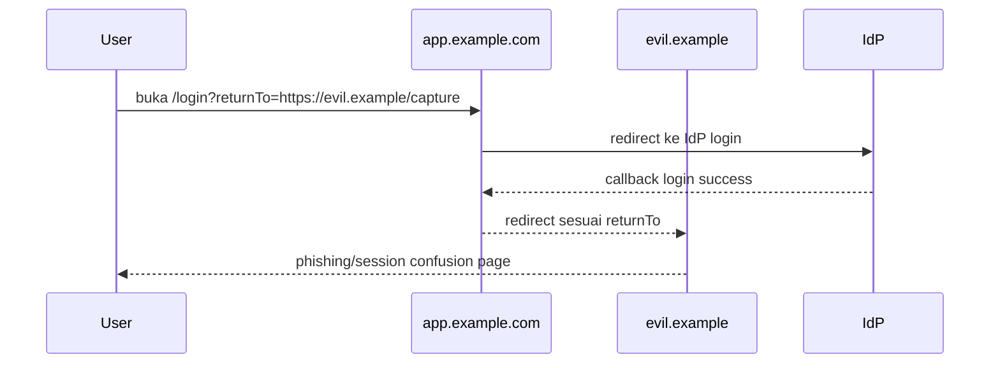
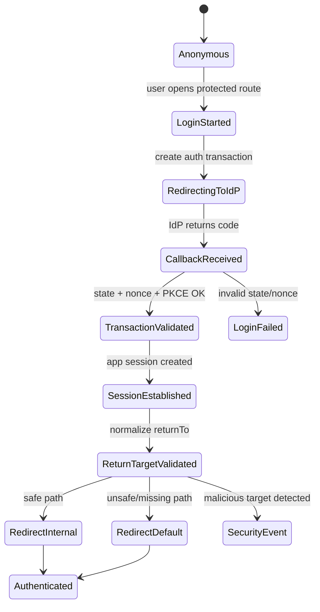

# Part 085 — Open Redirect and Return URL Attacks

Open redirect terlihat seperti bug kecil: user login, aplikasi membaca `returnTo`, lalu redirect ke sana.

Di sistem auth, bug kecil ini bisa menjadi **protocol exploit primitive**. Ia bisa dipakai untuk phishing, bypass allowlist domain, OAuth redirect chain abuse, step-up bypass confusion, tenant routing abuse, dan credential-flow manipulation.

Mental model yang benar:

> `returnTo` bukan URL biasa. Ia adalah untrusted navigation intent yang masuk ke security-sensitive flow.

Kalau aplikasi React menerima URL dari query string, local storage, referrer, callback state, atau router location tanpa validasi ketat, aplikasi sedang membiarkan attacker ikut menentukan arah control flow auth.

OWASP menyebut unvalidated redirect terjadi saat aplikasi menerima input tidak tepercaya yang dapat menyebabkan redirect ke URL dari input tersebut. Dalam auth flow, risiko ini meningkat karena redirect terjadi di sekitar login, logout, OAuth callback, invitation, tenant switch, dan step-up authentication.

---

## 1. Problem statement

Contoh sederhana:

```tsx
function LoginPage() {
  const params = new URLSearchParams(window.location.search);
  const returnTo = params.get('returnTo') ?? '/';

  async function onLoginSuccess() {
    window.location.assign(returnTo);
  }

  return <LoginForm onSuccess={onLoginSuccess} />;
}
```

Terlihat normal. Masalahnya:

```txt
/login?returnTo=https://evil.example/phishing
```

User melihat domain aplikasi asli:

```txt
https://app.example.com/login?returnTo=https://evil.example/phishing
```

Setelah login, aplikasi resmi mengirim user ke domain attacker.

Yang membuat ini berbahaya bukan hanya redirect keluar. Yang lebih berbahaya adalah attacker bisa memakai domain aplikasi asli sebagai **trusted stepping stone**.

---

## 2. Open redirect sebagai exploit chain

Open redirect jarang berdiri sendiri. Ia menjadi komponen dalam chain.



Dalam sistem auth modern, redirect sering muncul di:

- login return path
- OAuth/OIDC callback
- SSO organization discovery
- tenant switch
- invitation accept flow
- email verification
- password reset
- logout return URL
- step-up MFA return path
- magic link
- deep link mobile/web handoff
- expired session recovery

Setiap titik itu adalah boundary.

---

## 3. Invariant utama

Gunakan invariant ini:

```txt
Aplikasi tidak pernah melakukan redirect ke target yang berasal dari input user kecuali target itu telah dinormalisasi, divalidasi, dan dibuktikan sebagai internal/safe destination.
```

Lebih spesifik:

```txt
returnTo is an intent, not a URL authority.
```

Artinya, React app boleh menyimpan “user ingin kembali ke halaman kasus 123”, tetapi tidak boleh langsung mempercayai string URL mentah sebagai destination final.

---

## 4. Threat model return URL

Input redirect bisa datang dari banyak tempat:

| Source | Contoh | Risiko |
|---|---|---|
| Query string | `/login?returnTo=...` | attacker-controlled link |
| Hash fragment | `/login#returnTo=...` | tidak terlihat server, diproses client |
| Local storage | saved intent | polluted by XSS/old flow |
| Session storage | OAuth transaction state | collision/stale transaction |
| Cookie | redirect preference | CSRF/session fixation risk |
| Referer | previous page | spoof/absence/cross-origin leakage |
| Route state | router location state | client-only, not authority |
| OAuth state | encoded app state | tampering/replay if unsigned |
| Invitation link | redirect after accept | open redirect + privilege flow |
| Logout URL | post_logout_redirect_uri | phishing after logout |

Rule:

> Semua redirect destination yang berasal dari luar trusted server-side policy harus dianggap hostile.

---

## 5. Bentuk payload yang sering lolos validasi naïve

Validasi seperti ini tidak cukup:

```ts
if (returnTo.startsWith('/')) {
  redirect(returnTo);
}
```

Kenapa? Karena URL punya banyak representasi.

Contoh payload yang harus diuji:

```txt
https://evil.example
//evil.example
/\evil.example
/%5Cevil.example
/%2F%2Fevil.example
/%09/evil.example
/%0d%0aLocation:%20https://evil.example
/..%2f..%2fadmin
/login?returnTo=https://evil.example
/%2e%2e/%2e%2e/admin
https://app.example.com.evil.example
https://evil.example@app.example.com
https://app.example.com@evil.example
```

Beberapa payload menyerang parser mismatch: browser, server, framework router, reverse proxy, dan URL constructor bisa menafsirkan string berbeda.

---

## 6. Jangan validasi dengan string contains

Anti-pattern:

```ts
function isSafeRedirect(url: string) {
  return url.includes('app.example.com');
}
```

Payload:

```txt
https://app.example.com.evil.example
https://evil.example/?next=https://app.example.com
https://evil.example@app.example.com
https://app.example.com@evil.example
```

Anti-pattern:

```ts
return url.startsWith('https://app.example.com');
```

Payload:

```txt
https://app.example.com.evil.example
https://app.example.com%2eevil.example
```

Anti-pattern:

```ts
return url.startsWith('/');
```

Payload:

```txt
//evil.example
/\evil.example
```

Prinsip:

> Validasi redirect harus menggunakan parser URL, canonicalization, dan policy berbasis origin/path, bukan substring matching.

---

## 7. Policy: internal path only by default

Untuk aplikasi React authenticated, default terbaik:

```txt
returnTo hanya boleh berupa internal path relatif.
```

Bukan full URL.

Allowed:

```txt
/cases/CASE-123
/dashboard?tab=open
/org/acme/settings
```

Rejected:

```txt
https://app.example.com/cases/CASE-123
https://evil.example
//evil.example/path
javascript:alert(1)
data:text/html,...
```

Kenapa full URL ke domain sendiri pun sebaiknya ditolak? Karena full URL membuka ruang parsing mismatch, subdomain confusion, environment mismatch, scheme downgrade, dan allowlist drift.

Jika harus mendukung cross-origin redirect, gunakan allowlist ketat yang dikelola server-side, bukan client-side.

---

## 8. Implementasi safe internal redirect parser

Bangun helper tunggal. Jangan validasi redirect tersebar di component.

```ts
const DEFAULT_RETURN_TO = '/';

const ALLOWED_RETURN_PREFIXES = [
  '/',
  '/dashboard',
  '/cases',
  '/org',
  '/settings',
] as const;

function normalizeInternalReturnTo(input: unknown): string {
  if (typeof input !== 'string') return DEFAULT_RETURN_TO;

  const raw = input.trim();
  if (!raw) return DEFAULT_RETURN_TO;

  // Reject obvious non-path values.
  if (raw.startsWith('//')) return DEFAULT_RETURN_TO;
  if (raw.startsWith('\\')) return DEFAULT_RETURN_TO;
  if (raw.includes('\u0000')) return DEFAULT_RETURN_TO;

  let url: URL;

  try {
    // Use fixed base to parse relative path consistently.
    url = new URL(raw, 'https://app.example.local');
  } catch {
    return DEFAULT_RETURN_TO;
  }

  // Reject absolute external origin.
  if (url.origin !== 'https://app.example.local') {
    return DEFAULT_RETURN_TO;
  }

  // Ensure original input was path-relative, not full URL.
  // This keeps policy strict and removes origin confusion.
  if (!raw.startsWith('/')) {
    return DEFAULT_RETURN_TO;
  }

  // Reject protocol-relative after parsing/canonicalization.
  if (url.pathname.startsWith('//')) {
    return DEFAULT_RETURN_TO;
  }

  const candidate = `${url.pathname}${url.search}${url.hash}`;

  const allowed = ALLOWED_RETURN_PREFIXES.some((prefix) => {
    return candidate === prefix || candidate.startsWith(`${prefix}/`) || candidate.startsWith(`${prefix}?`);
  });

  if (!allowed) return DEFAULT_RETURN_TO;

  return candidate;
}
```

Catatan penting:

- `new URL(raw, base)` dipakai untuk canonicalization.
- origin palsu dipakai hanya untuk parsing path relatif.
- full URL tetap ditolak walaupun origin cocok.
- prefix allowlist harus hati-hati agar `/admin2` tidak lolos sebagai `/admin`.
- default fallback harus aman.

---

## 9. Prefix matching yang benar

Bug umum:

```ts
candidate.startsWith('/admin')
```

Ini meloloskan:

```txt
/admin-danger
/admin2
/administrator
```

Pakai boundary-aware matching:

```ts
function matchesPathPrefix(path: string, prefix: string): boolean {
  return path === prefix || path.startsWith(`${prefix}/`) || path.startsWith(`${prefix}?`);
}
```

Tapi untuk route yang sangat sensitif, lebih baik gunakan route registry:

```ts
type ReturnTarget =
  | { type: 'dashboard' }
  | { type: 'case-detail'; caseId: string }
  | { type: 'case-list'; status?: 'open' | 'closed' }
  | { type: 'settings'; section?: 'profile' | 'security' };

function toPath(target: ReturnTarget): string {
  switch (target.type) {
    case 'dashboard':
      return '/dashboard';
    case 'case-detail':
      return `/cases/${encodeURIComponent(target.caseId)}`;
    case 'case-list':
      return target.status ? `/cases?status=${target.status}` : '/cases';
    case 'settings':
      return target.section ? `/settings/${target.section}` : '/settings';
  }
}
```

Ini lebih aman karena state yang disimpan bukan URL arbitrary, melainkan typed intent.

---

## 10. Typed navigation intent lebih baik dari raw URL

Daripada menyimpan:

```json
{
  "returnTo": "/cases/CASE-123?tab=history"
}
```

Simpan:

```json
{
  "intent": "case-detail",
  "caseId": "CASE-123",
  "tab": "history"
}
```

Lalu generate path dari registry internal.

```ts
type LoginIntent =
  | { kind: 'home' }
  | { kind: 'case-detail'; caseId: string; tab?: 'summary' | 'history' | 'documents' }
  | { kind: 'org-settings'; orgSlug: string; section?: 'members' | 'security' };

function loginIntentToReturnTo(intent: LoginIntent): string {
  switch (intent.kind) {
    case 'home':
      return '/';
    case 'case-detail': {
      const base = `/cases/${encodeURIComponent(intent.caseId)}`;
      return intent.tab ? `${base}?tab=${intent.tab}` : base;
    }
    case 'org-settings': {
      const base = `/org/${encodeURIComponent(intent.orgSlug)}/settings`;
      return intent.section ? `${base}/${intent.section}` : base;
    }
  }
}
```

Keuntungan:

- lebih mudah dites
- tidak ada arbitrary URL
- bisa enforce route/tenant policy
- bisa reject intent yang tidak lagi valid
- bisa attach metadata seperti required assurance level

---

## 11. Login redirect state machine

Redirect login bukan satu langkah. Ia state machine.



`returnTo` baru boleh dipakai setelah:

1. OAuth/OIDC transaction valid.
2. Session berhasil dibuat.
3. Redirect target dinormalisasi.
4. Target lulus internal allowlist.
5. Target cocok dengan tenant/session context.

---

## 12. OAuth callback: jangan campur `redirect_uri` dengan `returnTo`

Dua konsep ini sering tertukar.

| Konsep | Arti | Siapa yang validasi |
|---|---|---|
| `redirect_uri` | callback URL OAuth/OIDC ke aplikasi | Authorization Server |
| `returnTo` | path internal setelah app session dibuat | Aplikasi |

`redirect_uri` harus exact-match di provider. `returnTo` harus internal-only di aplikasi.

Jangan pernah melakukan ini:

```ts
const redirectUri = searchParams.get('returnTo');
startOAuthLogin({ redirectUri });
```

Atau ini:

```ts
const returnTo = searchParams.get('redirect_uri');
navigate(returnTo);
```

Pisahkan model:

```ts
type OAuthTransaction = {
  state: string;
  nonce: string;
  codeVerifier: string;
  appReturnIntent: LoginIntent;
  createdAt: number;
};
```

Callback harus selalu fixed:

```txt
https://app.example.com/auth/callback
```

Return path adalah app state internal, bukan OAuth redirect URI.

---

## 13. `state` parameter bukan tempat menaruh arbitrary URL mentah

OIDC/OAuth `state` sering dipakai untuk app state. Itu boleh, tapi harus aman.

Anti-pattern:

```ts
const state = btoa(JSON.stringify({ returnTo: window.location.href }));
```

Masalah:

- bisa menyimpan full URL external
- bisa bocor lewat logs/provider telemetry
- bisa membesar terlalu banyak
- bisa dipakai untuk replay jika tidak single-use
- bisa menjadi input redirect tanpa validasi

Lebih baik:

```ts
type StoredAuthTransaction = {
  transactionId: string;
  nonce: string;
  codeVerifier: string;
  returnIntent: LoginIntent;
  expiresAt: number;
};
```

`state` cukup random opaque ID:

```ts
const state = crypto.randomUUID();
sessionStorage.setItem(`auth_tx:${state}`, JSON.stringify(transaction));
```

Callback:

```ts
const transaction = readAndDeleteTransaction(state);
const returnTo = loginIntentToReturnTo(transaction.returnIntent);
navigate(returnTo);
```

Jika butuh server-side transaction, simpan di server session/transaction store dan kirim opaque state.

---

## 14. Step-up return path

Step-up MFA sering punya flow:

```txt
/cases/123/approve -> /mfa -> balik ke /cases/123/approve
```

Ini rentan jika `returnTo` tidak divalidasi.

Threat:

```txt
/mfa?returnTo=https://evil.example/post-mfa
```

Setelah user melakukan MFA, attacker mendapat redirect ke domainnya. User mungkin percaya karena baru melewati MFA dari aplikasi asli.

Policy step-up:

```ts
type StepUpIntent = {
  action: 'case.approve' | 'payment.release' | 'user.invite';
  resourceId: string;
  returnIntent: LoginIntent;
  requiredAcr: 'mfa';
  expiresAt: number;
};
```

Step-up return harus:

- internal-only
- single-use
- bound ke action/resource
- expires quickly
- invalidated setelah success/failure
- re-check authorization setelah MFA

MFA sukses bukan permission sukses.

```txt
MFA verifies assurance.
Authorization still decides access.
```

---

## 15. Logout redirect

Logout redirect sering dianggap harmless karena user sudah keluar. Salah.

Open redirect setelah logout bisa dipakai untuk:

- phishing: “session expired, login again”
- domain reputation abuse
- confuse user setelah SSO logout
- redirect chain untuk bypass allowlist pihak ketiga

Policy:

```txt
postLogoutReturnTo hanya boleh internal safe public path atau IdP-registered post logout URI.
```

Untuk app:

```ts
const PUBLIC_LOGOUT_TARGETS = ['/', '/login', '/logged-out'] as const;
```

Jangan izinkan:

```txt
/logout?returnTo=/admin
/logout?returnTo=https://evil.example
/logout?returnTo=/cases/123
```

Setelah logout, hindari redirect ke page yang butuh auth. Arahkan ke public neutral page.

---

## 16. Tenant-aware redirect

Di SaaS multi-tenant, internal path saja belum cukup.

Contoh:

```txt
/org/acme/cases/123
/org/beta/cases/999
```

User login via tenant `acme`, tetapi `returnTo` mengarah ke tenant `beta`.

Validasi harus mencakup tenant context:

```ts
function validateTenantReturnTo(path: string, activeTenantSlug: string): string {
  const match = path.match(/^\/org\/([^/]+)(\/.*)?$/);

  if (!match) return '/';

  const tenantSlug = decodeURIComponent(match[1]);

  if (tenantSlug !== activeTenantSlug) {
    return `/org/${encodeURIComponent(activeTenantSlug)}`;
  }

  return path;
}
```

Tapi jangan hanya percaya slug. Server tetap harus memastikan membership/authorization.

---

## 17. Invitation dan magic link flow

Invitation link sering membawa redirect:

```txt
/invite/accept?token=...&returnTo=/org/acme/projects/123
```

Security properties yang diperlukan:

- invite token single-use
- invite token bound ke email/subject atau invitation record
- return target generated from invitation context
- reject arbitrary returnTo dari URL
- authorization/membership created sebelum redirect
- tenant context explicit

Lebih aman:

```txt
/invite/accept?token=opaque_invite_token
```

Server mengembalikan:

```json
{
  "status": "accepted",
  "returnIntent": {
    "kind": "org-home",
    "orgSlug": "acme"
  }
}
```

React generate path dari typed intent.

---

## 18. Password reset dan email verification

Password reset link biasanya public. Jangan biarkan link membawa external return.

Bad:

```txt
/reset-password?token=...&returnTo=https://evil.example/login-again
```

Better:

```txt
/reset-password?token=...
```

Setelah success:

```txt
/login?reason=password_reset_success
```

Email verification:

```txt
/verify-email?token=...
```

Setelah success:

```txt
/dashboard atau /onboarding berdasarkan server-side account state
```

Return path harus derived dari trusted server state, bukan query string attacker.

---

## 19. React Router integration

Dengan React Router Data/Framework Mode, redirect logic sebaiknya berada di loader/action, bukan component render.

```ts
import { redirect } from 'react-router';

export async function protectedLoader({ request }: { request: Request }) {
  const session = await requireSession(request);
  const url = new URL(request.url);

  if (!session) {
    const intent = toLoginIntent(url.pathname, url.search);
    const loginUrl = new URL('/login', url.origin);
    loginUrl.searchParams.set('intent', encodeLoginIntent(intent));
    throw redirect(loginUrl.pathname + loginUrl.search);
  }

  return { session };
}
```

Login action:

```ts
export async function loginAction({ request }: { request: Request }) {
  const form = await request.formData();
  const result = await authenticate(form);

  if (!result.ok) {
    return { error: 'Invalid credentials' };
  }

  const url = new URL(request.url);
  const rawIntent = url.searchParams.get('intent');
  const intent = decodeAndValidateLoginIntent(rawIntent);
  const returnTo = loginIntentToReturnTo(intent ?? { kind: 'home' });

  throw redirect(returnTo, {
    headers: await commitSession(result.session),
  });
}
```

Hal penting:

- loader/action bisa redirect sebelum component render
- redirect target tetap divalidasi
- jangan pakai `redirect(userInput)` tanpa normalisasi
- redirect exception harus pakai safe path

---

## 20. Next.js integration

Di Next.js App Router, lakukan normalisasi di server boundary jika redirect terjadi di server.

```ts
import { redirect } from 'next/navigation';

export async function completeLogin(rawReturnTo: string | null) {
  const session = await createSession();
  const returnTo = normalizeInternalReturnTo(rawReturnTo);

  await saveSession(session);
  redirect(returnTo);
}
```

Untuk Route Handler:

```ts
import { NextRequest, NextResponse } from 'next/server';

export async function GET(request: NextRequest) {
  const raw = request.nextUrl.searchParams.get('returnTo');
  const returnTo = normalizeInternalReturnTo(raw);

  return NextResponse.redirect(new URL(returnTo, request.url));
}
```

Jangan membangun redirect dengan origin dari query.

---

## 21. OAuth provider allowlist bypass

Open redirect di aplikasi bisa merusak allowlist OAuth pihak lain.

Misal pihak ketiga mengizinkan redirect ke:

```txt
https://app.example.com/redirect
```

Jika endpoint itu open redirect:

```txt
https://app.example.com/redirect?to=https://evil.example
```

Attacker dapat memakai domain trusted sebagai trampoline.

Maka endpoint redirect internal harus:

- tidak mengizinkan arbitrary external URL
- jika perlu external, gunakan registered destination ID, bukan URL
- log semua rejected external target
- rate-limit suspicious redirect attempts

Contoh safe external redirect by destination ID:

```ts
const REGISTERED_EXTERNAL_DESTINATIONS = {
  docs: 'https://docs.example.com',
  support: 'https://support.example.com',
} as const;

type DestinationId = keyof typeof REGISTERED_EXTERNAL_DESTINATIONS;

function resolveExternalDestination(id: string): string | null {
  if (id in REGISTERED_EXTERNAL_DESTINATIONS) {
    return REGISTERED_EXTERNAL_DESTINATIONS[id as DestinationId];
  }
  return null;
}
```

URL bukan input user; user hanya memilih ID yang sudah registered.

---

## 22. Referrer leakage

Return URL sering mengandung resource ID, tenant slug, case ID, invitation token, atau reset token. Jika halaman memuat asset pihak ketiga, browser bisa mengirim `Referer`.

Mitigasi:

```http
Referrer-Policy: strict-origin-when-cross-origin
```

Untuk halaman sangat sensitif:

```http
Referrer-Policy: no-referrer
```

Jangan letakkan token rahasia di URL jika bisa dihindari. Untuk OAuth, authorization code memang lewat URL callback, tetapi callback harus segera menukar code dan membersihkan URL.

```ts
history.replaceState(null, '', '/auth/callback/complete');
```

---

## 23. Jangan simpan full URL intent di analytics

Auth redirect event sering dilog:

```ts
analytics.track('login_redirect', {
  returnTo: window.location.href,
});
```

Masalah:

- token reset bisa bocor
- invitation token bisa bocor
- case ID / tenant path bisa bocor
- external malicious payload bisa masuk log
- URL panjang bisa merusak dashboard

Lebih aman:

```ts
analytics.track('login_redirect', {
  intentKind: intent.kind,
  routeGroup: 'case-detail',
  hasQuery: Boolean(url.search),
});
```

Security event boleh mencatat normalized reason, bukan raw malicious URL lengkap.

---

## 24. Open redirect test matrix

Minimum test cases:

```ts
const cases = [
  ['/dashboard', '/dashboard'],
  ['/cases/123?tab=history', '/cases/123?tab=history'],
  ['', '/'],
  [null, '/'],
  ['https://evil.example', '/'],
  ['//evil.example', '/'],
  ['\\\\evil.example', '/'],
  ['/\\evil.example', '/'],
  ['/%2F%2Fevil.example', '/'],
  ['javascript:alert(1)', '/'],
  ['data:text/html,hello', '/'],
  ['https://app.example.local/dashboard', '/'],
  ['/admin2', '/'],
  ['/administrator', '/'],
];
```

Test helper:

```ts
describe('normalizeInternalReturnTo', () => {
  it.each(cases)('normalizes %p to %p', (input, expected) => {
    expect(normalizeInternalReturnTo(input)).toBe(expected);
  });
});
```

Tambahkan fuzz test untuk encoded slash/backslash jika helper dipakai di security-sensitive boundary.

---

## 25. Security logging

Log event ketika redirect ditolak.

```ts
type RedirectRejectedEvent = {
  type: 'auth.redirect.rejected';
  reason:
    | 'external_origin'
    | 'protocol_relative'
    | 'invalid_url'
    | 'disallowed_path'
    | 'tenant_mismatch';
  route: string;
  userId?: string;
  tenantId?: string;
  requestId: string;
};
```

Jangan log raw URL penuh jika mengandung token/PII. Simpan hash atau redacted sample.

```ts
function redactRedirectInput(input: string): string {
  try {
    const url = new URL(input, 'https://app.example.local');
    return `${url.pathname}?<redacted>`;
  } catch {
    return '<invalid-url>';
  }
}
```

---

## 26. Production checklist

Sebelum release, jawab:

- Apakah semua redirect target masuk helper tunggal?
- Apakah default policy internal path only?
- Apakah full URL ke domain sendiri ditolak kecuali benar-benar perlu?
- Apakah OAuth `redirect_uri` dipisahkan dari app `returnTo`?
- Apakah `state` single-use dan tidak menyimpan arbitrary raw URL?
- Apakah callback membersihkan URL setelah code exchange?
- Apakah logout redirect hanya ke public safe path?
- Apakah step-up return path bound ke action/resource?
- Apakah tenant context divalidasi sebelum redirect?
- Apakah rejected redirect dilog tanpa membocorkan token/PII?
- Apakah test mencakup protocol-relative, encoded slash, backslash, userinfo, subdomain trick, dan parser mismatch?

---

## 27. Anti-pattern catalog

```ts
// BAD: direct user input
window.location.href = searchParams.get('returnTo')!;
```

```ts
// BAD: substring allowlist
if (url.includes('app.example.com')) redirect(url);
```

```ts
// BAD: startsWith full domain
if (url.startsWith('https://app.example.com')) redirect(url);
```

```ts
// BAD: full URL saved in OAuth state
state = btoa(JSON.stringify({ returnTo: window.location.href }));
```

```ts
// BAD: MFA success means redirect anywhere
navigate(searchParams.get('returnTo') ?? '/');
```

```ts
// GOOD: typed intent + safe path generator
const returnTo = loginIntentToReturnTo(validatedIntent);
redirect(returnTo);
```

---

## 28. Final mental model

Open redirect bukan masalah routing kecil. Dalam auth architecture, redirect adalah control-flow boundary.

React engineer top-tier tidak bertanya:

```txt
Bagaimana setelah login user balik ke halaman sebelumnya?
```

Ia bertanya:

```txt
Dari mana intent itu berasal?
Siapa yang boleh menentukan destination?
Apakah destination internal?
Apakah tenant cocok?
Apakah flow single-use?
Apakah redirect terjadi setelah session/step-up/authz yang benar?
Apakah rejected redirect observable tanpa bocor data?
```

Rule terakhir:

> Jangan redirect ke URL. Redirect ke intent yang sudah divalidasi dan digenerate ulang oleh aplikasi.

---

## References

- OWASP Cheat Sheet Series — Unvalidated Redirects and Forwards Cheat Sheet: https://cheatsheetseries.owasp.org/cheatsheets/Unvalidated_Redirects_and_Forwards_Cheat_Sheet.html
- OWASP Community — Open Redirect: https://owasp.org/www-community/attacks/open_redirect
- OAuth 2.0 Security Best Current Practice, RFC 9700: https://www.rfc-editor.org/rfc/rfc9700.html
- OpenID Connect Core 1.0: https://openid.net/specs/openid-connect-core-1_0.html
- MDN — URL API: https://developer.mozilla.org/en-US/docs/Web/API/URL
- MDN — Referrer-Policy: https://developer.mozilla.org/en-US/docs/Web/HTTP/Headers/Referrer-Policy
- React Router — redirect: https://reactrouter.com/api/utils/redirect
- Next.js — redirect: https://nextjs.org/docs/app/api-reference/functions/redirect
