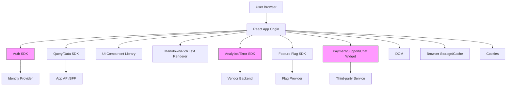
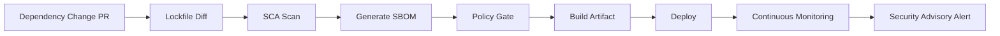
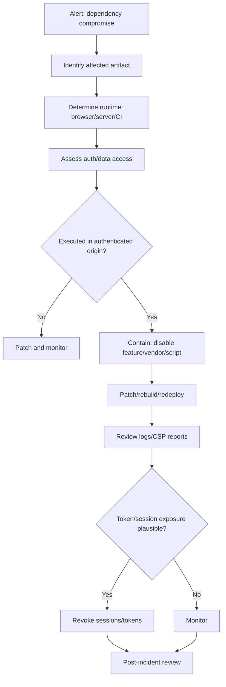

# Part 087 — Dependency and SDK Security

React auth sering dianggap selesai setelah kita memilih provider dan memasang SDK:

```txt
npm install @auth/provider-react
```

Itu terlalu dangkal.

Dalam authenticated React app, dependency dan SDK bukan sekadar library. Mereka menjadi bagian dari **trusted computing base** aplikasi. Auth SDK bisa melihat redirect callback, session state, token response, user profile, organization context, feature entitlement, dan kadang melakukan silent refresh. UI component library bisa menjalankan JavaScript di halaman authenticated. Analytics SDK bisa menerima route, user id, email, organization, dan error payload. Markdown renderer bisa mengubah content user menjadi DOM.

Mental model utama:

```txt
Every dependency that executes in the browser is code running inside your user's authenticated origin.
```

Jika dependency itu compromised, buggy, over-permissive, atau salah dikonfigurasi, risiko bukan hanya UI crash. Risikonya bisa berupa session theft, token exfiltration, policy bypass, open redirect, data exposure, clickjacking helper, telemetry leak, dan persistence di browser cache.

---

## 1. Dependency security di React auth berbeda dari backend dependency security

Backend dependency biasanya hidup di server boundary. Ia bisa mengakses secrets server, database, token vault, dan internal network. Frontend dependency hidup di browser boundary. Ia tidak punya server secret, tetapi punya sesuatu yang sangat sensitif:

- authenticated DOM
- cookies yang otomatis ikut request
- in-memory access token jika app memakai bearer token
- route state
- user profile projection
- permission projection
- query cache
- local/session storage
- IndexedDB
- service worker cache
- analytics context
- clipboard interactions
- file input/output
- WebSocket/SSE connection

Jadi pertanyaannya bukan hanya:

```txt
Is this package vulnerable?
```

Tetapi:

```txt
What can this package observe, mutate, intercept, persist, or exfiltrate inside our authenticated origin?
```

---

## 2. Trust boundary map



Pink nodes are not automatically bad. They are high-trust nodes. They need explicit review.

A dependency becomes auth-sensitive when it can do at least one of these:

| Capability | Example | Auth risk |
|---|---|---|
| Read route/URL | Analytics SDK | PII/return URL/token leakage |
| Read DOM | Support replay widget | Sensitive data capture |
| Execute script | Third-party widget | XSS-equivalent control |
| Intercept network | API client, service worker helper | Token/request leakage |
| Persist state | Cache/persistence library | Data remains after logout |
| Render untrusted input | Markdown/rich text | DOM XSS |
| Control redirect | Auth SDK/router helper | Open redirect/session confusion |
| Control feature access | Flag SDK | Feature flag mistaken as permission |
| Decode/parse token | JWT helper | Confused validation/authorization |
| Manage session | Auth provider SDK | Refresh/logout/callback bugs |

---

## 3. Dependency classes in authenticated React apps

Not every dependency needs the same review. Classify dependencies by security impact.

### 3.1 Auth-critical dependencies

Examples:

- Auth SDK
- OIDC/OAuth client
- JWT/JWK helper
- WebAuthn/passkey helper
- cookie/session helper
- CSRF helper
- BFF client

Failure impact:

- broken login/callback
- token stored in unsafe location
- missing PKCE/state/nonce
- wrong token audience
- incorrect refresh rotation behavior
- logout not clearing session
- open redirect
- tenant/account linking bug

Review level: **highest**.

### 3.2 Data-boundary dependencies

Examples:

- TanStack Query
- Apollo Client/urql/Relay
- Axios/fetch wrapper
- persisted cache library
- WebSocket/SSE helper
- file upload SDK

Failure impact:

- stale authenticated data after logout
- request replay after refresh failure
- cache crossing tenant/user boundary
- sensitive data persistence
- optimistic UI masking authorization denial

Review level: **high**.

### 3.3 DOM/rendering dependencies

Examples:

- markdown renderer
- rich text editor
- syntax highlighter
- charting library
- HTML sanitizer
- design system components

Failure impact:

- XSS
- hidden data leak
- unsafe link target
- SVG/script injection
- CSS/data URL abuse

Review level: **high when rendering user-controlled or admin-configurable content**.

### 3.4 Third-party runtime dependencies

Examples:

- analytics
- error monitoring
- support chat
- session replay
- A/B testing
- feature flag client
- fraud/bot detection
- payment widget

Failure impact:

- PII exfiltration
- session replay capture
- sensitive route/URL capture
- DOM observation
- supply-chain script compromise
- user identification outside policy

Review level: **high + privacy review**.

### 3.5 Build-time dependencies

Examples:

- Vite/Webpack/Rspack plugin
- Babel/SWC plugin
- ESLint plugin
- codegen tool
- MDX plugin
- test runner plugin

Failure impact:

- malicious build artifact
- credential exfiltration from CI
- source tampering
- hidden injected code
- supply-chain persistence

Review level: **high in CI/CD threat model**.

---

## 4. Auth SDK is an integration boundary, not your architecture

A common mistake:

```tsx
<AuthProvider>
  <App />
</AuthProvider>
```

Then the whole auth architecture becomes whatever the SDK exposes.

Top-tier architecture instead builds a thin adapter:

```txt
Auth Provider SDK
        ↓
Provider Adapter
        ↓
Internal Auth Client Contract
        ↓
React Auth Boundary / Router / API Client / Permission UI
```

Why?

Because your application needs stable internal semantics:

- `anonymous`
- `authenticated`
- `refreshing`
- `expired`
- `revoked`
- `forbidden`
- `requires_step_up`
- `tenant_mismatch`
- `degraded`

A provider SDK may use different naming, different cache behavior, and different lifecycle assumptions. Do not let that leak everywhere.

### 4.1 Bad pattern: SDK everywhere

```tsx
import { useAuth0 } from '@auth0/auth0-react';
import { useUser } from '@clerk/clerk-react';
import { useAuthenticator } from '@aws-amplify/ui-react';

function DeleteCaseButton({ caseId }: { caseId: string }) {
  const { user } = useAuth0();

  if (user?.role !== 'admin') return null;

  return <button>Delete</button>;
}
```

Problems:

- component knows provider-specific API
- role check is app-level authorization leakage
- migration becomes expensive
- test fixtures need provider mocks
- token/session semantics are hidden
- no consistent decision reason
- no tenant-aware permission contract

### 4.2 Better pattern: internal contract

```ts
export type AuthStatus =
  | 'unknown'
  | 'anonymous'
  | 'authenticating'
  | 'authenticated'
  | 'refreshing'
  | 'expired'
  | 'revoked'
  | 'degraded';

export type SessionProjection = {
  status: AuthStatus;
  subject?: {
    id: string;
    displayName: string;
    email?: string;
  };
  tenant?: {
    id: string;
    slug: string;
  };
  assurance?: {
    level: 'low' | 'medium' | 'high';
    authenticatedAt?: string;
    methods?: string[];
  };
  authEpoch: number;
  permissionEpoch?: number;
};

export interface AuthClient {
  getSession(): Promise<SessionProjection>;
  subscribe(listener: (session: SessionProjection) => void): () => void;
  login(options?: { returnTo?: string; tenantHint?: string }): Promise<void>;
  logout(options?: { everywhere?: boolean }): Promise<void>;
  refresh(reason: 'startup' | 'expiry' | 'focus' | 'manual'): Promise<SessionProjection>;
}
```

React app imports `AuthClient`, not SDK-specific internals.

---

## 5. SDK review checklist

Before adopting an auth SDK, answer these questions.

### 5.1 Protocol correctness

- Does it support Authorization Code with PKCE?
- Does it avoid Implicit Flow for browser apps?
- Does it bind `state` to the login transaction?
- Does it support OIDC `nonce` when ID Token is involved?
- Does it validate token audience/issuer where appropriate?
- Does it clearly distinguish ID Token, Access Token, and Refresh Token?
- Does it support refresh token rotation semantics safely?
- Does it support logout and session revocation semantics?
- Does it prevent open redirect via `returnTo`/callback configuration?

### 5.2 Storage behavior

Find exactly where the SDK stores data.

```txt
Do not accept “secure storage” as an answer.
```

Ask:

- Does it store tokens in memory?
- Does it store tokens in `localStorage`?
- Does it store transaction state in `sessionStorage`?
- Does it use cookies?
- Are cookies `Secure`, `HttpOnly`, `SameSite`, and scoped correctly?
- Does it persist user profile or claims?
- Does it clear state on logout?
- Does it support multi-tab logout propagation?
- Can storage mode be configured?

### 5.3 Runtime behavior

- Does it refresh tokens automatically?
- Does it coordinate refresh across tabs?
- What happens when refresh fails?
- Does it retry failed requests?
- Does it create hidden iframes?
- Does it depend on third-party cookies?
- Does it write to URL/history during callback?
- Does it expose tokens to application code?
- Does it emit typed lifecycle events?

### 5.4 Operational behavior

- Is there a changelog?
- Are security advisories published?
- Is the package actively maintained?
- Are releases signed/provenanced?
- Does it have a clear support policy?
- Does it document breaking changes?
- Does it support your SSR/BFF/runtime model?
- Does it support your browser support matrix?

---

## 6. Dependency pinning and update strategy

Security maturity is not “always update everything immediately”. That can break auth in production.

Security maturity is:

```txt
reproducible builds + monitored vulnerabilities + controlled rollout + fast emergency patch path
```

### 6.1 Lockfiles are mandatory

For npm/pnpm/yarn apps:

- commit lockfile
- enforce frozen install in CI
- do not run floating install in release builds
- avoid unreviewed lockfile churn
- diff transitive dependency changes

Example CI guard:

```bash
pnpm install --frozen-lockfile
pnpm audit --prod
pnpm test
pnpm build
```

### 6.2 Pin high-risk dependencies more strictly

High-risk dependencies:

- auth SDK
- router
- query/data library
- markdown/rich text renderer
- sanitizer
- analytics/session replay SDK
- build plugins

For these, prefer controlled update PRs:

```json
{
  "dependencies": {
    "@auth/provider-react": "1.14.3",
    "dompurify": "3.2.4",
    "@tanstack/react-query": "5.90.1"
  }
}
```

Do not blindly use loose ranges for auth-critical packages:

```json
{
  "dependencies": {
    "@auth/provider-react": "^1.0.0"
  }
}
```

The lockfile may freeze today, but broad ranges still increase accidental drift when lockfile is regenerated.

### 6.3 Use update lanes

A useful policy:

| Lane | Scope | Cadence | Required checks |
|---|---|---:|---|
| Emergency security patch | Critical/high CVE, exploited issue | immediate | focused tests + staged rollout |
| Auth-critical update | Auth SDK, sanitizer, router, query client | weekly/monthly | full auth regression suite |
| Routine dependency update | normal libraries | weekly/monthly | standard CI |
| Major version update | breaking changes | planned | ADR + migration tests |
| Vendor SDK replacement | architecture boundary | project | design review + incident plan |

---

## 7. Software Composition Analysis and SBOM

For serious systems, `npm audit` is not enough. It is useful, but incomplete.

You need a pipeline that can answer:

```txt
Which deployed artifact contains vulnerable package X?
Which user-facing auth surface does it affect?
Which environment is affected?
Can we disable the risky feature while patching?
```

### 7.1 Minimum SCA pipeline



### 7.2 SBOM fields that matter

For each frontend artifact, track:

- package name
- version
- package manager
- direct/transitive dependency
- license
- package URL/purl
- source repository
- integrity/hash
- vulnerability mapping
- artifact/build id
- deployment environment
- affected route/app/module if possible

### 7.3 Vulnerability triage questions

When a vulnerability alert appears:

1. Is the vulnerable code included in the shipped browser bundle?
2. Is the vulnerable function reachable?
3. Is the route authenticated or public?
4. Does the route process user-controlled input?
5. Does the dependency run in browser, server, edge, or CI?
6. Can CSP or feature kill switch reduce exposure?
7. Is there a patched version?
8. Does the patch change auth/session behavior?
9. What regression suite must run before release?
10. Do we need user/session revocation after patch?

---

## 8. Third-party JavaScript in authenticated pages

Third-party JavaScript deserves special treatment because it executes with your origin privileges when embedded as normal script.

Examples:

```html
<script src="https://analytics.vendor.example/sdk.js"></script>
<script src="https://chat.vendor.example/widget.js"></script>
<script src="https://flags.vendor.example/client.js"></script>
```

If a vendor script is compromised, it can often:

- read the DOM
- observe route and URL
- register event listeners
- capture form inputs
- exfiltrate data through network calls
- mutate UI
- trigger authenticated actions if CSRF/XSS defenses allow it
- inspect non-HttpOnly storage

### 8.1 Preferred mitigations

| Risk | Mitigation |
|---|---|
| Script compromise | avoid loading on sensitive routes |
| DOM observation | reduce rendered data; mask sensitive fields |
| Network exfiltration | strict `connect-src` CSP |
| Script injection | strict CSP nonce/hash |
| Unexpected script change | SRI where feasible for static scripts |
| Vendor overcollection | explicit data allowlist |
| Session replay leak | privacy masking and route exclusions |
| Auth callback exposure | never load third-party scripts on callback/logout/error routes |

### 8.2 Route-specific vendor policy

Do not use one global rule.

```ts
type VendorPolicy = {
  analytics: boolean;
  sessionReplay: boolean;
  supportChat: boolean;
  featureFlagClient: boolean;
};

export function vendorPolicyForRoute(routeId: string): VendorPolicy {
  if (routeId.startsWith('auth.callback')) {
    return {
      analytics: false,
      sessionReplay: false,
      supportChat: false,
      featureFlagClient: false,
    };
  }

  if (routeId.startsWith('admin.audit') || routeId.startsWith('case.evidence')) {
    return {
      analytics: true,
      sessionReplay: false,
      supportChat: false,
      featureFlagClient: true,
    };
  }

  return {
    analytics: true,
    sessionReplay: false,
    supportChat: true,
    featureFlagClient: true,
  };
}
```

### 8.3 Never load third-party scripts on auth callback route

Auth callback routes may contain:

- authorization code
- state
- error details
- tenant hint
- return path
- correlation id

Even if the authorization code is short-lived and one-time-use, it does not belong in analytics/session replay/referrer logs.

---

## 9. Subresource Integrity is useful but limited

SRI lets the browser verify that a fetched script/stylesheet matches an expected hash.

Example:

```html
<script
  src="https://cdn.example.com/sdk/v1.2.3/sdk.min.js"
  integrity="sha384-..."
  crossorigin="anonymous"
></script>
```

SRI helps when:

- script URL is static
- content hash is known at build/deploy time
- vendor does not change the file under the same URL

SRI does not solve:

- malicious dependency installed into your bundle
- compromised npm package included at build time
- dynamic script loader that fetches more scripts
- allowed script that is intentionally overprivileged
- auth SDK logic bugs
- unsafe configuration

Use SRI where it fits. Do not treat it as supply-chain security by itself.

---

## 10. CSP as dependency blast-radius limiter

CSP is not a dependency scanner. It is a runtime blast-radius limiter.

A dependency-aware CSP asks:

```txt
Which scripts can execute?
Which origins can receive data?
Which frames can be embedded?
Which images/fonts/styles are allowed?
Which routes need stricter policy?
```

Example baseline for authenticated shell:

```http
Content-Security-Policy:
  default-src 'self';
  script-src 'self' 'nonce-{requestNonce}' 'strict-dynamic';
  object-src 'none';
  base-uri 'none';
  frame-ancestors 'none';
  connect-src 'self' https://api.example.com https://telemetry.example.com;
  img-src 'self' data: https://cdn.example.com;
  style-src 'self' 'nonce-{requestNonce}';
  report-to csp-endpoint;
```

For auth callback:

```http
Content-Security-Policy:
  default-src 'self';
  script-src 'self' 'nonce-{requestNonce}';
  object-src 'none';
  base-uri 'none';
  frame-ancestors 'none';
  connect-src 'self';
  form-action 'self';
  report-to csp-endpoint;
```

The callback route should not need analytics, support chat, session replay, or arbitrary vendor connections.

---

## 11. Auth SDK token exposure review

Some SDKs expose token getters:

```ts
const token = await authClient.getAccessTokenSilently();
```

That is not inherently wrong. But once the app can get a bearer token in JavaScript, any XSS or compromised dependency in the same origin may be able to get it too.

Ask:

- Do we need raw access token in React?
- Can BFF hide token from browser?
- Can the token be audience-limited?
- Can the token be short-lived?
- Can refresh token stay server-side?
- Does SDK support memory-only token cache?
- Does SDK ever write token to local storage?
- Does the app log token accidentally?
- Does error monitoring scrub Authorization headers?

Safe wrapper:

```ts
export interface ApiCredentialProvider {
  applyAuth(input: RequestInit): Promise<RequestInit>;
}

export class BrowserBearerCredentialProvider implements ApiCredentialProvider {
  constructor(private readonly auth: AuthTokenSource) {}

  async applyAuth(input: RequestInit): Promise<RequestInit> {
    const token = await this.auth.getAccessToken({ audience: 'app-api' });

    return {
      ...input,
      headers: {
        ...input.headers,
        Authorization: `Bearer ${token}`,
      },
    };
  }
}
```

Do not pass token around arbitrary components.

Bad:

```tsx
<UserProfile accessToken={token} />
<AnalyticsContext token={token} />
```

Better:

```tsx
<UserProfile />
```

The profile component should call an API boundary that attaches credentials internally.

---

## 12. Dependency import boundary

Prevent high-risk APIs from being imported everywhere.

### 12.1 Folder boundary

```txt
src/
  auth/
    provider-adapter/
      auth0-adapter.ts
      clerk-adapter.ts
    auth-client.ts
    auth-context.tsx
  api/
    api-client.ts
  permissions/
    can.ts
  features/
    cases/
      components/
```

Feature components should import:

```ts
import { useSession } from '@/auth/auth-context';
import { useCan } from '@/permissions/use-can';
import { api } from '@/api/api-client';
```

They should not import:

```ts
import { useAuth0 } from '@auth0/auth0-react';
import { ClerkProvider, useUser } from '@clerk/clerk-react';
import jwtDecode from 'jwt-decode';
```

### 12.2 ESLint guardrail

```js
// eslint.config.js
export default [
  {
    rules: {
      'no-restricted-imports': [
        'error',
        {
          paths: [
            {
              name: '@auth0/auth0-react',
              message: 'Use internal auth adapter from src/auth instead.',
            },
            {
              name: '@clerk/clerk-react',
              message: 'Use internal auth adapter from src/auth instead.',
            },
            {
              name: 'jwt-decode',
              message: 'Token decoding belongs in auth boundary only.',
            },
          ],
        },
      ],
    },
  },
];
```

### 12.3 Build-time import test

```ts
import { describe, expect, it } from 'vitest';
import { globby } from 'globby';
import fs from 'node:fs/promises';

const forbidden = [
  '@auth0/auth0-react',
  '@clerk/clerk-react',
  'jwt-decode',
];

describe('auth SDK imports', () => {
  it('are restricted to auth adapter boundary', async () => {
    const files = await globby(['src/**/*.ts', 'src/**/*.tsx']);

    const violations: string[] = [];

    for (const file of files) {
      if (file.includes('/src/auth/provider-adapter/')) continue;
      const content = await fs.readFile(file, 'utf8');

      for (const dep of forbidden) {
        if (content.includes(`from '${dep}'`) || content.includes(`from "${dep}"`)) {
          violations.push(`${file} imports ${dep}`);
        }
      }
    }

    expect(violations).toEqual([]);
  });
});
```

---

## 13. Analytics and error SDK hardening

Analytics/error SDK often becomes the silent data exfiltration layer.

### 13.1 Redaction policy

Define a redaction function before data leaves the browser.

```ts
const SENSITIVE_KEYS = [
  'authorization',
  'access_token',
  'refresh_token',
  'id_token',
  'password',
  'secret',
  'csrf',
  'session',
  'cookie',
  'ssn',
  'nationalId',
  'email',
];

export function redactTelemetry(value: unknown): unknown {
  if (Array.isArray(value)) return value.map(redactTelemetry);

  if (value && typeof value === 'object') {
    const result: Record<string, unknown> = {};

    for (const [key, child] of Object.entries(value)) {
      if (SENSITIVE_KEYS.some((k) => key.toLowerCase().includes(k))) {
        result[key] = '[REDACTED]';
      } else {
        result[key] = redactTelemetry(child);
      }
    }

    return result;
  }

  if (typeof value === 'string') {
    return value
      .replace(/Bearer\s+[A-Za-z0-9._~+/-]+=*/g, 'Bearer [REDACTED]')
      .replace(/(code|state|token)=([^&]+)/g, '$1=[REDACTED]');
  }

  return value;
}
```

### 13.2 Route exclusion

Exclude:

- `/auth/callback`
- `/logout`
- `/mfa/*`
- `/admin/impersonation/*`
- `/case/:id/evidence/*`
- `/exports/*`
- any page with highly sensitive fields

### 13.3 Do not attach raw user object

Bad:

```ts
telemetry.identify(user.id, user);
```

Better:

```ts
telemetry.identify(user.id, {
  tenantId: session.tenant.id,
  roleCategory: session.subject.roleCategory,
  plan: session.entitlements.plan,
});
```

Even then, verify privacy policy and data residency.

---

## 14. Rich text, markdown, and sanitizer dependencies

A markdown renderer can become the route from stored content to XSS.

Bad pattern:

```tsx
<div dangerouslySetInnerHTML={{ __html: markdownToHtml(caseNote.body) }} />
```

Better pattern:

```tsx
const safeHtml = sanitizeHtml(markdownToHtml(caseNote.body), {
  allowedTags: ['p', 'strong', 'em', 'ul', 'ol', 'li', 'a', 'code', 'pre', 'blockquote'],
  allowedAttributes: {
    a: ['href', 'title', 'rel', 'target'],
  },
  allowedSchemes: ['http', 'https', 'mailto'],
});

return <div dangerouslySetInnerHTML={{ __html: safeHtml }} />;
```

But sanitizer choice and configuration are security-critical.

Review:

- Does sanitizer handle SVG/MathML?
- Are `javascript:` URLs blocked?
- Are data URLs allowed?
- Are event handlers removed?
- Are dangerous CSS properties removed?
- Does output run under Trusted Types policy?
- Are links normalized and `rel="noopener noreferrer"` enforced?
- Are sanitizer updates tracked like auth SDK updates?

---

## 15. Feature flag SDK is not permission SDK

A feature flag SDK may evaluate:

```ts
if (flags.enableCaseDeletion) {
  return <DeleteCaseButton />;
}
```

That is release control, not authorization.

Correct composition:

```tsx
const deleteFlag = useFlag('case-delete-ui');
const decision = useCan({ action: 'case.delete', resource: { type: 'case', id: caseId } });

if (!deleteFlag.enabled) return null;

return (
  <AuthorizedButton
    decision={decision}
    onClick={deleteCase}
  >
    Delete case
  </AuthorizedButton>
);
```

Server still validates `case.delete`.

---

## 16. Package manager guardrails

### 16.1 Disallow install scripts where possible

Install scripts can execute code during dependency installation.

Policy:

- disable scripts by default in CI if feasible
- allowlist packages that require install scripts
- review native build packages carefully
- run install in isolated CI environment
- do not expose production secrets to dependency install step

### 16.2 Enforce registry and provenance

Use:

- internal registry/proxy
- package provenance where supported
- lockfile integrity checks
- two-person review for dependency additions
- automated dependency diff summary

### 16.3 Review package metadata

Before adding a dependency:

- maintainer count
- release history
- repository activity
- open security issues
- package size
- transitive dependencies
- install scripts
- permissions
- typosquatting risk
- license
- funding/ownership changes

---

## 17. Dependency change review template

```md
# Dependency Change Review

## Package
- Name:
- Version change:
- Direct or transitive:
- Runtime: browser / server / edge / CI
- Auth-sensitive: yes / no

## Why
- What capability is needed?
- Why not use existing dependency?
- Can this run server-side instead of browser-side?

## Browser access
- Can it read DOM?
- Can it read URL?
- Can it make network calls?
- Can it persist data?
- Can it render untrusted content?
- Can it access tokens/session/user profile/permissions?

## Security controls
- CSP change needed:
- SRI possible:
- Telemetry redaction needed:
- Route exclusions:
- Import boundary:
- Test coverage:

## Operational controls
- Changelog reviewed:
- Vulnerability status:
- License reviewed:
- Rollback plan:
- Kill switch:
```

---

## 18. Incident response: compromised dependency or auth SDK

When a dependency is compromised, do not only patch and redeploy.

### 18.1 First questions

- Was the vulnerable version deployed?
- Which environments?
- Which users/routes were exposed?
- Did it execute in authenticated pages?
- Could it access token/session/user data?
- Could it make network calls to attacker-controlled domains?
- Did CSP block exfiltration?
- Did telemetry show anomalous behavior?
- Should sessions/tokens be revoked?
- Should users be notified?

### 18.2 Response flow



### 18.3 Session revocation decision

Revoke sessions if:

- dependency could read bearer tokens
- dependency could read non-HttpOnly refresh token
- dependency could trigger authenticated privileged actions
- CSP/network controls were weak
- compromise happened on sensitive authenticated routes
- evidence is incomplete and impact is high

Session revocation is disruptive, but silent compromise is worse.

---

## 19. Production checklist

Before release:

- [ ] Auth SDK isolated behind internal adapter.
- [ ] Feature components do not import provider SDK directly.
- [ ] Token getters are not passed through props/context unnecessarily.
- [ ] Dependency lockfile is committed and frozen in CI.
- [ ] SCA scan runs on dependency changes and release builds.
- [ ] SBOM is generated for deployed artifacts.
- [ ] Third-party scripts are route-scoped.
- [ ] Auth callback/logout/MFA routes load no unnecessary third-party scripts.
- [ ] CSP limits script and connect destinations.
- [ ] Telemetry redaction covers tokens, cookies, auth codes, state, PII.
- [ ] Session replay is disabled or masked on sensitive routes.
- [ ] Markdown/rich-text sanitizer is reviewed and tested.
- [ ] Feature flags are not used as authorization boundary.
- [ ] Import restrictions prevent dependency sprawl.
- [ ] Dependency update lanes exist.
- [ ] Incident response runbook covers compromised frontend dependency.

---

## 20. Key takeaways

Dependency security in React auth is not a checklist afterthought. It is part of auth architecture.

A dependency is dangerous not because it is third-party, but because it may execute inside your authenticated origin with access to user context, route state, DOM, caches, telemetry, and sometimes tokens.

The practical target is not zero dependencies. The target is controlled trust:

```txt
minimize browser authority
isolate auth SDKs
constrain third-party scripts
pin and monitor dependencies
redact telemetry
test auth-sensitive update paths
prepare incident response
```

Top-tier React auth systems treat SDKs as replaceable adapters, not foundations. They treat dependencies as runtime actors with capabilities, not as passive code.

---

## References

- OWASP Software Supply Chain Security Cheat Sheet
- OWASP Third Party JavaScript Management Cheat Sheet
- OWASP Dependency-Track
- OWASP Session Management Cheat Sheet
- OWASP Authorization Cheat Sheet
- OWASP Content Security Policy Cheat Sheet
- RFC 9700 — Best Current Practice for OAuth 2.0 Security
- MDN — Subresource Integrity
- MDN — Content Security Policy
