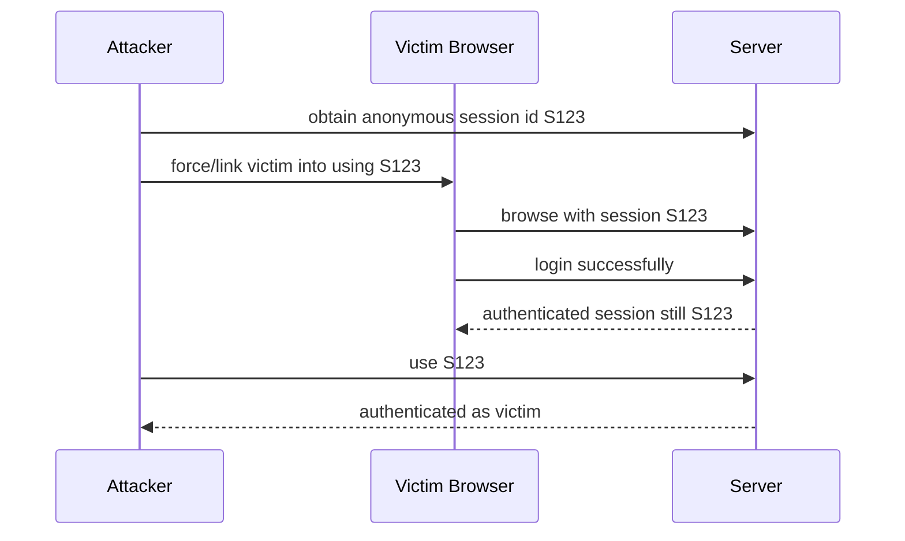
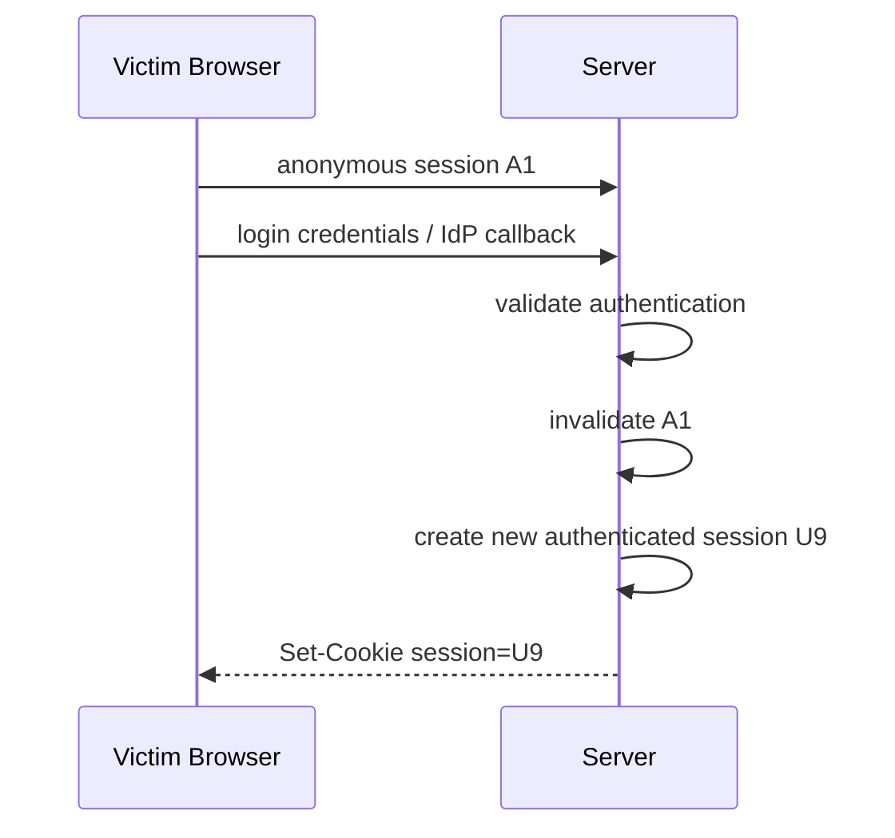
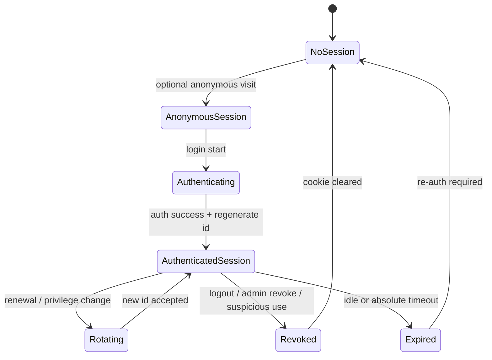
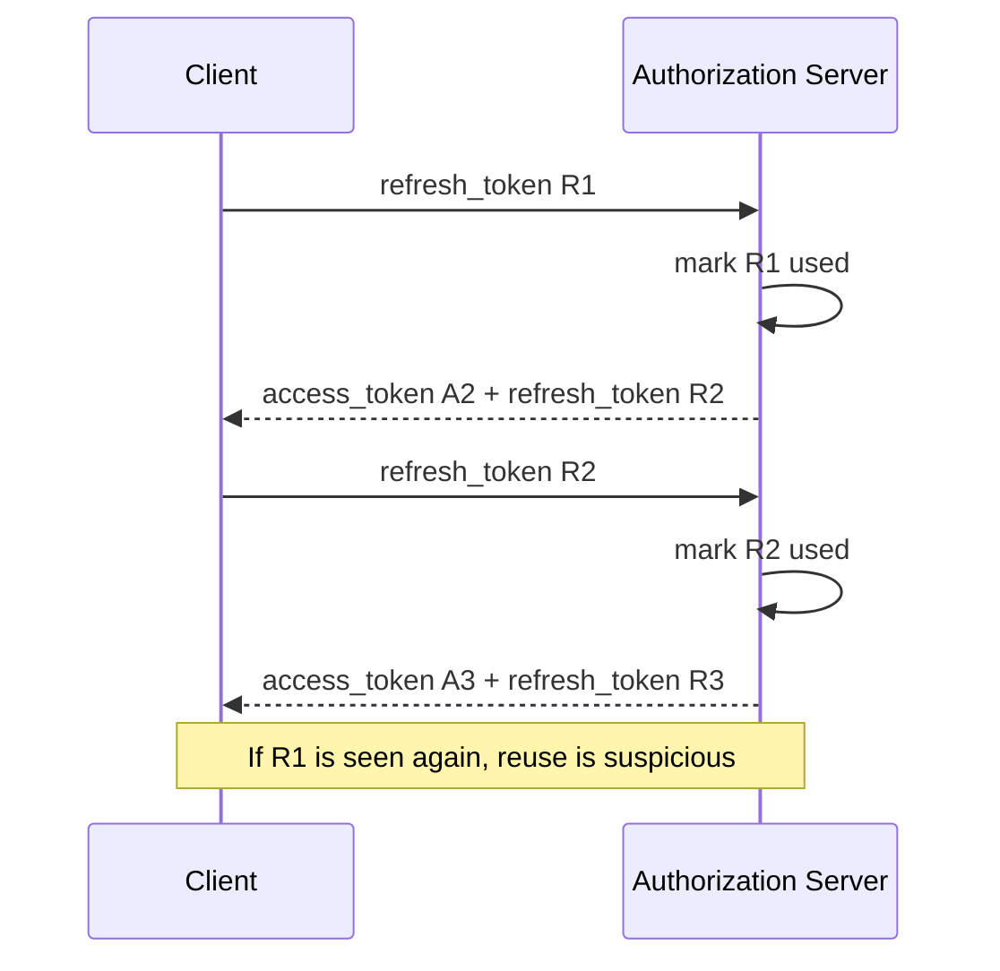
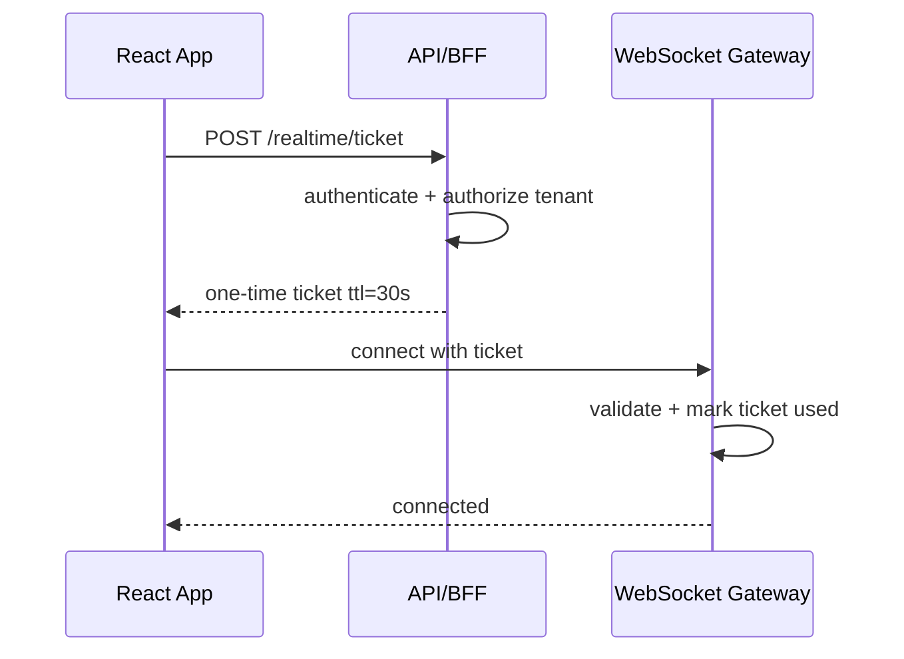

# Part 088 — Session Fixation and Replay

Session security tidak hanya tentang “apakah user sudah login?”. Pertanyaan yang lebih penting:

```txt
Which authenticated continuity proof is accepted by the server, where did it come from, and can it be reused by someone else?
```

Dua kelas attack yang sering merusak asumsi ini:

1. **Session fixation** — attacker membuat atau memaksa session identifier tertentu dipakai korban, lalu korban login dengan identifier itu.
2. **Replay** — attacker menggunakan ulang credential, token, request, authorization code, refresh token, signed URL, or mutation payload yang pernah valid.

Dalam React app, risiko ini muncul di beberapa lapis:

- cookie session
- bearer access token
- refresh token
- OAuth authorization code
- OIDC callback transaction
- CSRF token
- WebAuthn challenge
- signed URL
- action/mutation request
- WebSocket subscription ticket
- invite/magic link
- device/session management UI

Mental model:

```txt
A credential is safe only when the server can prove freshness, origin, audience, scope, and lifecycle validity at the moment it is used.
```

---

## 1. Session fixation: what actually goes wrong

Session fixation happens when an application accepts a session identifier before authentication and keeps using the same identifier after authentication.

Bad lifecycle:



Correct lifecycle:



Core invariant:

```txt
Authentication boundary must regenerate session identifier.
```

Not “maybe”. Mandatory.

---

## 2. React's role in fixation prevention

React does not generate secure server sessions. React cannot fix server-side fixation by itself.

But React can make fixation worse if it:

- stores session ids in URL
- persists pre-login transaction incorrectly
- accepts `returnTo` that carries attacker-controlled session context
- stores login transaction in localStorage across users
- reuses anonymous cart/session state as authenticated identity state
- logs auth callback URL
- fails to clear stale auth projection after login/logout

Frontend responsibility:

```txt
Do not persist or propagate identity continuity values that the server must rotate or bind.
```

---

## 3. Session lifecycle for cookie-based apps



Important transitions:

| Transition | Required server behavior | React behavior |
|---|---|---|
| anonymous → authenticated | regenerate session id | refetch `/session`, clear anonymous projection |
| authenticated → elevated | regenerate or bind stronger auth state | update assurance/epoch |
| role/tenant switch | update session scope/version | clear tenant-scoped cache |
| logout | revoke server session | clear app/query/cache state |
| suspicious reuse | revoke session family | force reauth and show safe message |

---

## 4. Session id regeneration

Server-side login should do this:

```ts
async function completeLogin(req: Request, res: Response) {
  const anonymousSessionId = readSessionCookie(req);
  const authResult = await verifyLoginOrOidcCallback(req);

  if (!authResult.ok) {
    return unauthorized(res);
  }

  if (anonymousSessionId) {
    await sessionStore.invalidate(anonymousSessionId, {
      reason: 'auth_boundary_crossed',
    });
  }

  const session = await sessionStore.create({
    subjectId: authResult.subjectId,
    tenantId: authResult.tenantId,
    assuranceLevel: authResult.assuranceLevel,
    createdAt: now(),
    authEpoch: 1,
  });

  setSessionCookie(res, session.id, {
    httpOnly: true,
    secure: true,
    sameSite: 'Lax',
    path: '/',
  });

  return redirect(res, safeReturnTo(req));
}
```

Do not merely attach user id to an existing anonymous session id.

Bad:

```ts
anonymousSession.userId = user.id;
await sessionStore.save(anonymousSession);
```

That keeps the attacker-known identifier alive.

---

## 5. Privilege elevation should also rotate or version session state

Login is not the only boundary.

Rotate or strongly version session state when:

- user completes MFA/step-up
- user enters admin mode
- support staff starts impersonation
- user switches tenant/org
- user role changes materially
- user changes password/security settings
- suspicious activity is detected

At minimum, increment an `authEpoch` or `permissionEpoch` and make old projections stale.

```ts
type SessionRecord = {
  id: string;
  subjectId: string;
  tenantId: string;
  assuranceLevel: 'low' | 'medium' | 'high';
  authEpoch: number;
  permissionEpoch: number;
  createdAt: string;
  lastSeenAt: string;
  expiresAt: string;
  revokedAt?: string;
};
```

React can use epoch values to clear stale cache:

```ts
function useAuthEpochCacheGuard(session: SessionProjection) {
  const queryClient = useQueryClient();

  useEffect(() => {
    queryClient.invalidateQueries({
      predicate: (query) => query.queryKey.includes('auth-scoped'),
    });
  }, [session.authEpoch, session.permissionEpoch, session.tenant?.id]);
}
```

---

## 6. Replay: credential reuse outside intended moment

Replay means something valid is captured and used again.

Examples:

| Artifact | Replay risk |
|---|---|
| Access token | attacker uses stolen bearer token |
| Refresh token | attacker obtains new access tokens |
| OAuth authorization code | attacker exchanges code before legitimate client |
| CSRF token | token reused if not session-bound/time-bound |
| WebAuthn challenge | assertion reused if challenge not single-use |
| Signed URL | file download reused beyond intended audience |
| Mutation request | duplicate transfer/approval/delete |
| WebSocket ticket | attacker joins channel |
| Magic link | link reused after login |
| Invite link | token reused after membership changes |

Replay prevention is not one technique. It is a family of lifecycle controls.

---

## 7. Bearer tokens are replayable by design

A bearer token means:

```txt
Whoever bears this token can use it until it expires or is rejected.
```

Therefore, for browser-based apps:

- keep access tokens short-lived
- audience-scope tokens narrowly
- do not store bearer tokens in localStorage
- avoid exposing tokens to arbitrary React components
- prefer BFF/session cookie for high-risk apps
- revoke on suspicious use where possible
- use refresh token rotation if refresh tokens exist
- consider sender-constrained tokens where supported by architecture

React-side safe posture:

```txt
Never treat access token as application state. Treat it as a low-level API credential managed by the auth boundary.
```

Bad:

```tsx
<AuthContext.Provider value={{ accessToken, user }}>
```

Better:

```tsx
<AuthContext.Provider value={{ sessionProjection }}>
```

The API client attaches credential internally.

---

## 8. Refresh token rotation and reuse detection

Refresh token rotation reduces replay risk by making refresh tokens single-use or family-versioned.

Concept:



Server model:

```ts
type RefreshTokenRecord = {
  tokenHash: string;
  familyId: string;
  subjectId: string;
  clientId: string;
  tenantId?: string;
  issuedAt: string;
  expiresAt: string;
  usedAt?: string;
  revokedAt?: string;
  replacedByHash?: string;
};
```

Atomic refresh:

```ts
async function rotateRefreshToken(rawRefreshToken: string) {
  const hash = hashToken(rawRefreshToken);

  return db.transaction(async (tx) => {
    const record = await tx.refreshTokens.findByHashForUpdate(hash);

    if (!record || record.revokedAt || record.expiresAt < now()) {
      throw new AuthError('invalid_refresh_token');
    }

    if (record.usedAt) {
      await tx.refreshTokens.revokeFamily(record.familyId, {
        reason: 'refresh_token_reuse_detected',
      });
      throw new AuthError('refresh_reuse_detected');
    }

    const next = await tx.refreshTokens.create({
      familyId: record.familyId,
      subjectId: record.subjectId,
      clientId: record.clientId,
      tenantId: record.tenantId,
      issuedAt: now(),
      expiresAt: addDays(now(), 30),
    });

    await tx.refreshTokens.markUsed(record.tokenHash, {
      usedAt: now(),
      replacedByHash: next.tokenHash,
    });

    return {
      accessToken: issueAccessToken(record.subjectId),
      refreshToken: next.rawToken,
    };
  });
}
```

Frontend implication:

- use single-flight refresh
- coordinate across tabs
- handle reuse detection as forced logout
- do not retry refresh blindly
- do not run multiple concurrent refresh calls with same token

---

## 9. Single-flight refresh in React API client

Bad behavior:

```txt
10 API requests fail with 401
↓
10 refresh requests use same refresh token
↓
server sees reuse/race
↓
session family revoked
```

Better:

```ts
let refreshPromise: Promise<void> | null = null;

async function ensureFreshSession() {
  if (!refreshPromise) {
    refreshPromise = authClient.refresh('expiry').finally(() => {
      refreshPromise = null;
    });
  }

  return refreshPromise;
}

export async function authFetch(input: RequestInfo, init: RequestInit = {}) {
  let response = await fetch(input, withAuth(init));

  if (response.status !== 401) return response;

  const problem = await parseProblem(response);

  if (problem.type !== 'access_token_expired') {
    throw problem;
  }

  await ensureFreshSession();

  if (!isReplaySafe(init)) {
    throw new Error('Non-idempotent request requires explicit retry');
  }

  response = await fetch(input, withAuth(init));
  return response;
}
```

Important:

```txt
Only replay safe requests automatically.
```

For mutation, require idempotency key or user confirmation.

---

## 10. Idempotency for mutation replay

Replay is not only attacker replay. Browser/network retry can duplicate a valid mutation.

Examples:

- approve case twice
- submit payment twice
- create duplicate enforcement action
- send notification twice
- upload finalize twice
- revoke access twice

Use idempotency keys for mutation APIs.

```ts
export async function approveCase(caseId: string, decision: ApprovalDecision) {
  const idempotencyKey = crypto.randomUUID();

  return api.post(`/cases/${caseId}/approve`, {
    body: decision,
    headers: {
      'Idempotency-Key': idempotencyKey,
    },
  });
}
```

Server behavior:

```ts
type IdempotencyRecord = {
  key: string;
  subjectId: string;
  tenantId: string;
  route: string;
  requestHash: string;
  responseStatus: number;
  responseBody: unknown;
  expiresAt: string;
};
```

Rules:

- idempotency key must be scoped to subject/tenant/route
- same key + different request body is conflict
- store final response for retry
- expire records after reasonable window
- audit duplicate attempts

---

## 11. OAuth authorization code replay

Authorization code must be:

- short-lived
- one-time-use
- bound to client
- bound to redirect URI
- protected with PKCE for public clients
- associated with state transaction

React callback must not exchange the same code multiple times.

Bad:

```tsx
useEffect(() => {
  exchangeCode(window.location.search);
}, []);
```

React Strict Mode/development, hot reload, navigation retry, or double mount can call this twice.

Better callback guard:

```ts
const processedCallbacks = new Set<string>();

export async function handleOidcCallback(url: URL) {
  const code = url.searchParams.get('code');
  const state = url.searchParams.get('state');

  if (!code || !state) throw new Error('Invalid callback');

  const callbackKey = `${state}:${code}`;

  if (processedCallbacks.has(callbackKey)) {
    return { status: 'already_processed' as const };
  }

  processedCallbacks.add(callbackKey);

  try {
    return await authClient.completeCallback({ code, state });
  } finally {
    window.history.replaceState(null, '', '/auth/callback/complete');
  }
}
```

Server should still enforce one-time code use. Client guard only prevents accidental duplicate exchange.

---

## 12. WebAuthn challenge replay

WebAuthn/passkey ceremonies use server-generated challenges. The challenge must be:

- unpredictable
- bound to session/transaction
- scoped to relying party/origin
- short-lived
- single-use
- invalidated after success/failure threshold

React role:

```txt
Request challenge → call navigator.credentials → send assertion → let server verify.
```

Do not cache WebAuthn challenges in long-lived browser storage.

Bad:

```ts
localStorage.setItem('webauthn_challenge', challenge);
```

Better:

```ts
const challenge = await api.post('/auth/webauthn/challenge', {
  body: { purpose: 'step_up:case.delete' },
});

const credential = await navigator.credentials.get({
  publicKey: toPublicKeyRequestOptions(challenge),
});

await api.post('/auth/webauthn/verify', {
  body: serializeCredential(credential),
});
```

Server verifies freshness and marks challenge used.

---

## 13. CSRF token replay

CSRF token should not be a global permanent magic string.

Good CSRF token properties:

- bound to session
- unpredictable
- validated on unsafe methods
- not stored in cookie alone unless signed double-submit pattern is used correctly
- rotated or scoped for sensitive workflows where appropriate
- not logged
- not sent to third-party origins

React behavior:

```ts
export async function unsafeRequest(input: RequestInfo, init: RequestInit = {}) {
  const csrf = await csrfProvider.getToken();

  return fetch(input, {
    ...init,
    method: init.method ?? 'POST',
    credentials: 'include',
    headers: {
      ...init.headers,
      'X-CSRF-Token': csrf,
    },
  });
}
```

Do not retry unsafe request automatically after CSRF failure. Fetch a new token and require controlled resubmit.

---

## 14. Signed URL replay

Signed URLs are bearer credentials.

If a file download URL leaks, anyone with the URL may be able to use it until expiry unless additional checks exist.

Design rules:

- short TTL
- least privilege operation
- content disposition carefully set
- avoid placing signed URL in long-lived logs/state
- never store signed URL in persisted query cache
- generate only after authorization check
- scope to object/version/action
- revoke or rotate object if leak is suspected

React anti-pattern:

```ts
queryClient.setQueryData(['file-download-url', fileId], signedUrl);
```

Better:

```ts
async function downloadFile(fileId: string) {
  const { url } = await api.post(`/files/${fileId}/download-intent`);
  window.location.assign(url);
}
```

Do not keep signed URLs around longer than necessary.

---

## 15. WebSocket/SSE replay

Long-lived connections need connection-level and channel-level freshness.

Patterns:

### 15.1 Connection ticket



Rules:

- ticket is short-lived
- ticket is single-use
- ticket is channel/tenant scoped
- ticket is not stored in localStorage
- reconnection requests a new ticket
- logout revokes connection/session

### 15.2 Channel authorization

Do not authorize only once at connection time if channels differ in sensitivity.

```ts
socket.send(JSON.stringify({
  type: 'subscribe',
  channel: 'case:case_123:audit-events',
}));
```

Server must check `case.read_audit` or equivalent for that case.

---

## 16. Device/session binding and suspicious reuse

Not all systems need strong device binding. But serious systems need at least session/device observability.

Track session metadata:

```ts
type SessionDevice = {
  sessionId: string;
  subjectId: string;
  tenantId: string;
  createdAt: string;
  lastSeenAt: string;
  ipHash?: string;
  userAgentHash?: string;
  deviceName?: string;
  assuranceLevel: 'low' | 'medium' | 'high';
  riskFlags: string[];
};
```

Suspicious events:

- same session id seen from impossible geography
- user agent changes abruptly
- refresh token reuse detected
- token used after logout
- high-risk action after new device login
- many failed refresh attempts
- session seen after password reset

React session management UI should show:

- current session
- recent sessions/devices
- last active time
- rough location if allowed
- revoke button
- warning for suspicious device

But avoid overclaiming precision. IP/geolocation is noisy.

---

## 17. Replay-safe auth event model

Audit events should distinguish:

| Event | Meaning |
|---|---|
| `session.created` | authenticated session created |
| `session.regenerated` | session id rotated at boundary |
| `session.revoked` | explicit/server/admin revocation |
| `refresh.succeeded` | refresh token rotated successfully |
| `refresh.reuse_detected` | used refresh token seen again |
| `access_token.rejected` | access token invalid/expired/revoked |
| `csrf.failed` | unsafe request missing/invalid CSRF proof |
| `oauth.code_reuse` | authorization code reuse attempt |
| `webauthn.challenge_reuse` | challenge already used/expired |
| `signed_url.used` | signed file URL used |
| `idempotency.replayed` | duplicate mutation request handled |

Include:

- actor subject id
- tenant id
- session id hash
- correlation id
- route/action/resource
- decision
- reason
- timestamp
- client app version

Never log raw tokens, raw session ids, raw authorization codes, raw CSRF tokens, or raw signed URLs.

---

## 18. React recovery UX for fixation/replay events

A replay/fixation defense often manifests as forced logout or blocked request. The UX should be calm and safe.

Typed problem response:

```json
{
  "type": "https://example.com/problems/session-revoked",
  "title": "Session ended",
  "status": 401,
  "code": "SESSION_REVOKED",
  "reason": "suspicious_reuse_detected",
  "correlationId": "req_01J..."
}
```

React handler:

```ts
function handleAuthProblem(problem: AuthProblem) {
  switch (problem.code) {
    case 'SESSION_REVOKED':
    case 'REFRESH_REUSE_DETECTED':
      authStore.setState({ status: 'revoked', reason: problem.reason });
      queryClient.clear();
      broadcastAuthEvent({ type: 'logout', reason: problem.reason });
      router.navigate('/login?reason=session-ended');
      return;

    case 'STEP_UP_REQUIRED':
      router.navigate(`/step-up?returnTo=${encodeReturnTo(location)}`);
      return;

    case 'CSRF_FAILED':
      csrfProvider.invalidate();
      showRecoverableFormError('Security check expired. Please try again.');
      return;
  }
}
```

User-facing copy:

```txt
Your session ended to protect your account. Please sign in again.
```

Avoid:

```txt
Refresh token reuse detected from suspicious IP.
```

That is useful internally, not necessarily safe or helpful for all users.

---

## 19. Testing fixation and replay

### 19.1 Session fixation test

```ts
it('regenerates session id after login', async () => {
  const anonymous = await browser.request.get('/session');
  const before = anonymous.headers['set-cookie'];

  await browser.loginAs('user@example.com');

  const after = await browser.request.get('/session');
  const afterCookie = after.headers['set-cookie'];

  expect(sessionId(afterCookie)).not.toEqual(sessionId(before));
});
```

### 19.2 Old session rejected after login

```ts
it('rejects pre-auth session id after authentication', async () => {
  const oldCookie = await createAnonymousSessionCookie();

  const authenticatedCookie = await loginWithCookie(oldCookie);

  expect(authenticatedCookie).not.toEqual(oldCookie);

  const response = await request('/api/me', {
    headers: { Cookie: oldCookie },
  });

  expect(response.status).toBe(401);
});
```

### 19.3 Refresh token reuse detection

```ts
it('revokes token family when old refresh token is reused', async () => {
  const { refreshToken: r1 } = await login();
  const { refreshToken: r2 } = await refresh(r1);

  const reuse = await refresh(r1);
  expect(reuse.status).toBe(401);
  expect(reuse.body.code).toBe('REFRESH_REUSE_DETECTED');

  const next = await refresh(r2);
  expect(next.status).toBe(401);
});
```

### 19.4 Idempotency replay test

```ts
it('does not duplicate mutation when same idempotency key is replayed', async () => {
  const key = crypto.randomUUID();

  const first = await approveCase({ caseId: 'case_1', key });
  const second = await approveCase({ caseId: 'case_1', key });

  expect(second.status).toBe(first.status);
  expect(await countApprovals('case_1')).toBe(1);
});
```

### 19.5 OAuth callback duplicate exchange test

```ts
it('does not exchange same callback twice from client handler', async () => {
  const exchange = vi.fn().mockResolvedValue({ ok: true });

  await handleOidcCallback(callbackUrl, { exchange });
  await handleOidcCallback(callbackUrl, { exchange });

  expect(exchange).toHaveBeenCalledTimes(1);
});
```

Server must still reject duplicate code.

---

## 20. Production checklist

- [ ] Session id is regenerated after login.
- [ ] Anonymous session id is invalidated after authentication.
- [ ] Session state is rotated/versioned after MFA/admin/impersonation/tenant switch.
- [ ] Session cookies use `Secure`, `HttpOnly`, `SameSite`, and correct scope.
- [ ] Access tokens are short-lived and audience-scoped.
- [ ] Refresh tokens use rotation or equivalent replay defense.
- [ ] Refresh rotation is atomic server-side.
- [ ] React API client uses single-flight refresh.
- [ ] Multi-tab refresh is coordinated.
- [ ] Non-idempotent mutations are not auto-replayed blindly.
- [ ] Idempotency keys protect critical mutations.
- [ ] OAuth authorization codes are one-time-use and PKCE protected.
- [ ] React callback handler avoids duplicate code exchange.
- [ ] WebAuthn challenges are short-lived and single-use.
- [ ] Signed URLs are short-lived and not persisted in client cache.
- [ ] WebSocket/SSE tickets are short-lived/single-use/channel-scoped.
- [ ] Suspicious reuse detection produces typed auth problem responses.
- [ ] Query/router/cache state is cleared on revocation/logout.
- [ ] Audit logs store hashes/correlation ids, not raw credentials.
- [ ] Forced logout UX is safe and non-leaky.
- [ ] Tests cover fixation, refresh reuse, duplicate mutation, and callback replay.

---

## 21. Key takeaways

Session fixation and replay are lifecycle failures.

They happen when systems accept continuity proof without asking:

```txt
Was this proof freshly issued?
Was it bound to the right client/session/action/resource?
Has it been used before?
Has the privilege context changed since it was issued?
Should this request be replayed at all?
```

React's job is not to be the cryptographic enforcement boundary. React's job is to avoid making lifecycle bugs worse: do not propagate stale session state, do not retry unsafe mutations blindly, do not store replayable credentials broadly, coordinate refresh/logout across tabs, and handle server revocation decisively.

The server must enforce freshness. The client must respect it.

---

## References

- OWASP Session Management Cheat Sheet
- OWASP Session Fixation
- OWASP Cross-Site Request Forgery Prevention Cheat Sheet
- OWASP Authorization Cheat Sheet
- RFC 9700 — Best Current Practice for OAuth 2.0 Security
- RFC 7636 — Proof Key for Code Exchange by OAuth Public Clients
- W3C WebAuthn Level 3
- MDN — AbortController
