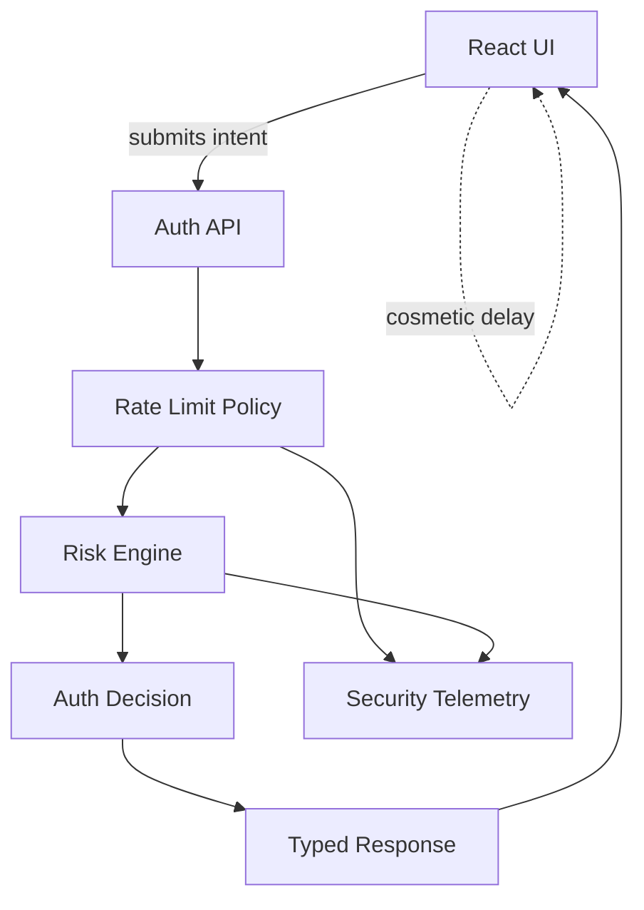
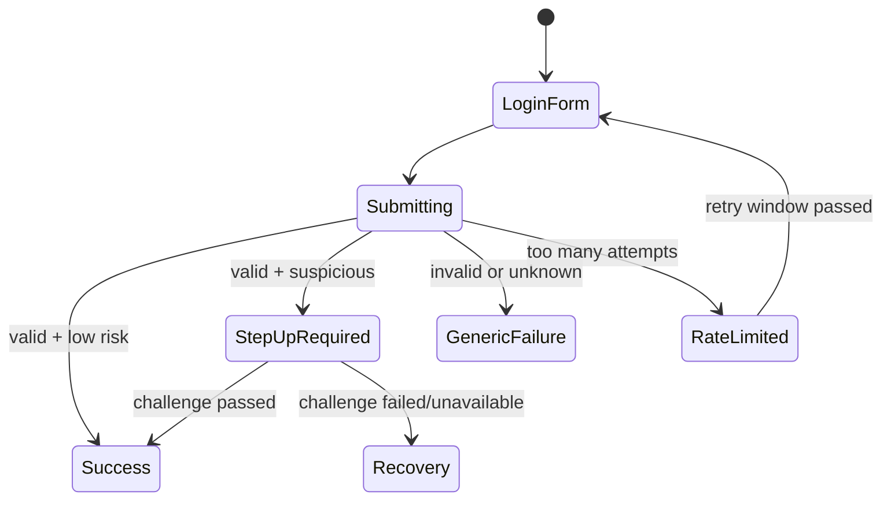
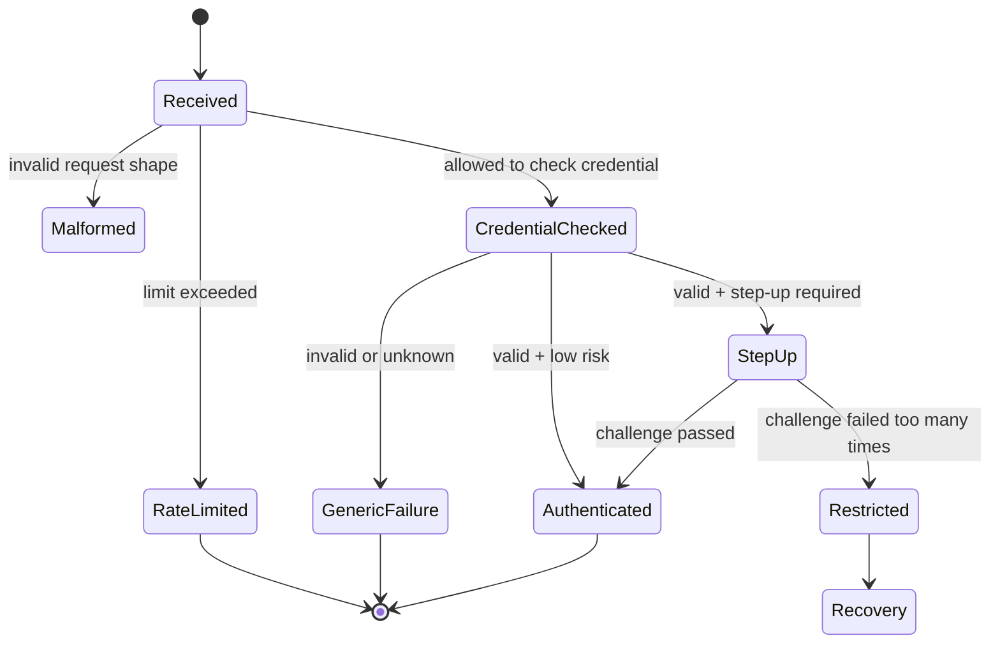

# Part 089 — Rate Limiting and Abuse-aware UI

Rate limiting di auth flow bukan sekadar “batasi request per IP”. Untuk React app, rate limiting adalah bagian dari **abuse control loop**:

```txt
observe abuse -> slow down attacker -> avoid account enumeration -> preserve legitimate recovery -> keep UI understandable -> feed telemetry back to backend policy
```

Pada sistem auth, attacker tidak selalu mencari bug teknis. Mereka sering menyalahgunakan fungsi valid:

- login
- password reset
- email verification
- MFA challenge
- OTP resend
- magic link
- account creation
- invite acceptance
- token refresh
- access request
- export/download generation

Kalau UI hanya menampilkan “Something went wrong” untuk semua kasus, user legitimate akan frustrasi. Kalau UI terlalu spesifik, attacker mendapat oracle. Kalau lockout terlalu agresif, attacker bisa melakukan denial-of-service terhadap akun korban.

Mental model utama:

```txt
Auth abuse defense must be friction-aware, enumeration-resistant, recoverable, observable, and enforced server-side.
```

React tidak menegakkan rate limit. React menampilkan state, mengurangi retry storm, menghormati `Retry-After`, mencegah UX menjadi amplification channel, dan menyediakan recovery path yang aman.

---

## 1. What rate limiting is actually protecting

Rate limiting auth flow melindungi beberapa hal berbeda. Jangan gabungkan semua menjadi satu counter.

| Threat | Target | Typical endpoint | Risk kalau salah desain |
|---|---|---|---|
| Brute force | Password guessing | `/login` | Account takeover |
| Credential stuffing | Reused leaked credentials | `/login` | Mass takeover |
| Password spraying | One/few passwords across many users | `/login` | Bypass account-specific lockout |
| OTP bombing | MFA fatigue | `/mfa/challenge`, `/otp/resend` | User coerced into approval |
| Email enumeration | Account discovery | `/forgot-password`, `/register` | Privacy leak, targeted phishing |
| Account creation abuse | Fake accounts | `/register` | Spam, fraud, resource abuse |
| Token refresh abuse | Session continuity | `/session/refresh` | Backend load, replay signal lost |
| Access request spam | Permission workflow | `/access-requests` | Approver fatigue, audit noise |
| Export abuse | Data extraction | `/exports` | Data exfiltration or cost spike |

Rate limiting bukan satu fitur. Ia adalah kumpulan policy per endpoint, per actor, per resource, per tenant, per device, dan per risk context.

---

## 2. Server is the enforcement point

Frontend rate limiting seperti disable button selama 30 detik berguna untuk UX, tapi tidak punya nilai security boundary.

Attacker bisa:

- memanggil API langsung via script
- menghapus JavaScript delay
- menjalankan banyak browser/session
- memakai proxy/IP rotation
- memakai GraphQL batching
- replay request dari network tab
- melewati UI dan memakai mobile/API client lain

Boundary yang benar:



React hanya melakukan:

- disable submit saat request in-flight
- honor `Retry-After`
- show safe error message
- avoid duplicate request
- prevent accidental resend
- expose support/recovery path
- send correlation id or client request id
- avoid leaking whether account exists

---

## 3. Enumeration-resistant UX

Auth UI sering menjadi oracle.

Bad messages:

```txt
No account found with that email.
Password is wrong for this existing account.
This account uses SSO.
This tenant does not allow password login.
This email is registered but not verified.
```

Pesan seperti itu membantu user, tapi juga membantu attacker membuat daftar akun valid.

Better public messages:

```txt
If the details are correct, you will receive the next step.
```

```txt
We could not complete sign-in. Check your details or use another sign-in method.
```

```txt
If an account exists, we sent recovery instructions.
```

Namun jangan terlalu naif. Enterprise SaaS sering punya legitimate org discovery. Misalnya user memasukkan domain perusahaan untuk diarahkan ke SSO. Di sini enumeration risk harus dinilai terhadap product requirement.

Decision matrix:

| Flow | Public response | Internal log |
|---|---|---|
| Forgot password unknown email | Same as known email | `password_reset_unknown_subject` |
| Login wrong password | Generic failure | `login_password_mismatch` |
| Login unknown account | Generic failure | `login_unknown_subject` |
| SSO required | Usually can disclose after org discovery | `login_password_blocked_sso_required` |
| MFA required | Safe after primary auth success | `mfa_required` |
| Account locked | Usually disclose to authenticated/recovery flow only | `account_temporarily_restricted` |

Rule:

```txt
Public message should help legitimate recovery without becoming an account-existence oracle.
```

---

## 4. Rate limit dimensions

A mature auth system uses multiple dimensions at once.

```txt
limit key = endpoint + tenant + normalized subject + device/session + IP/network + risk bucket + time window
```

Examples:

| Dimension | Why it matters | Failure mode |
|---|---|---|
| IP/network | Stops simple brute force | Weak against botnets; can hurt NAT users |
| Account/email | Stops attack on one account | Can enable victim lockout DoS |
| Tenant/org | Protects enterprise boundary | One attacker can degrade whole tenant if too strict |
| Device/session | Differentiates legitimate device | Can be spoofed/rotated |
| Credential hash bucket | Detects common password spraying | Requires careful privacy design |
| ASN/geo/risk score | Adaptive risk | Can cause false positives |
| Endpoint/action | Per-flow policy | Missing endpoint becomes bypass |
| GraphQL operation | Prevents batching bypass | Request-level limits alone fail |

React should not compute these limits. But React needs to understand the **result contract**.

---

## 5. Typed abuse response contract

Avoid forcing frontend to parse strings.

Use typed errors:

```json
{
  "type": "https://example.com/problems/auth/rate-limited",
  "title": "Too many attempts",
  "status": 429,
  "code": "AUTH_RATE_LIMITED",
  "retryAfterSeconds": 60,
  "publicMessage": "Too many attempts. Try again shortly.",
  "correlationId": "req_01J...",
  "recovery": {
    "kind": "password_reset",
    "href": "/forgot-password"
  }
}
```

Suggested auth abuse error codes:

```ts
export type AuthAbuseCode =
  | 'AUTH_RATE_LIMITED'
  | 'AUTH_TEMPORARILY_RESTRICTED'
  | 'AUTH_LOCKED_RECOVERY_REQUIRED'
  | 'AUTH_MFA_RATE_LIMITED'
  | 'AUTH_OTP_RESEND_RATE_LIMITED'
  | 'AUTH_SUSPICIOUS_ACTIVITY'
  | 'AUTH_REGISTRATION_RATE_LIMITED'
  | 'AUTH_ACCESS_REQUEST_RATE_LIMITED'
  | 'AUTH_EXPORT_RATE_LIMITED';
```

Frontend state:

```ts
type AbuseUiState =
  | { kind: 'idle' }
  | { kind: 'submitting' }
  | { kind: 'rate_limited'; retryAt: number; message: string }
  | { kind: 'restricted'; recoveryHref?: string; message: string }
  | { kind: 'failed'; message: string; correlationId?: string };
```

Invariant:

```txt
The server decides limit state. The client may display countdown and prevent accidental resubmit, but it must not be trusted to enforce the limit.
```

---

## 6. Handling `429 Too Many Requests`

For auth endpoints, `429` should usually include either:

- `Retry-After` header
- typed body field like `retryAfterSeconds`
- stable public message
- correlation id

React handler:

```ts
export async function submitLogin(input: LoginInput): Promise<LoginResult> {
  const response = await fetch('/api/auth/login', {
    method: 'POST',
    headers: {
      'Content-Type': 'application/json',
      'X-Client-Request-Id': crypto.randomUUID(),
    },
    credentials: 'include',
    body: JSON.stringify(input),
  });

  if (response.status === 429) {
    const retryAfter = parseRetryAfter(response.headers.get('Retry-After'));
    const problem = await safeProblem(response);

    return {
      kind: 'rate_limited',
      retryAt: Date.now() + retryAfter * 1000,
      message: problem.publicMessage ?? 'Too many attempts. Try again shortly.',
      correlationId: problem.correlationId,
    };
  }

  if (!response.ok) {
    const problem = await safeProblem(response);
    return {
      kind: 'failed',
      message: problem.publicMessage ?? 'We could not complete sign-in.',
      correlationId: problem.correlationId,
    };
  }

  return { kind: 'success', session: await response.json() };
}

function parseRetryAfter(value: string | null): number {
  if (!value) return 30;

  const seconds = Number(value);
  if (Number.isFinite(seconds)) return Math.max(1, Math.min(seconds, 3600));

  const date = Date.parse(value);
  if (Number.isFinite(date)) {
    return Math.max(1, Math.min(Math.ceil((date - Date.now()) / 1000), 3600));
  }

  return 30;
}
```

UI countdown must be cosmetic:

```tsx
function RateLimitedNotice({ retryAt }: { retryAt: number }) {
  const remaining = useCountdownSeconds(retryAt);

  return (
    <div role="status">
      Too many attempts. Try again in {remaining} seconds.
    </div>
  );
}
```

Do not rely on countdown to enforce anything.

---

## 7. Login throttling vs account lockout

These are different controls.

### Login throttling

Slows attempts.

Examples:

- per IP: max 20 login attempts/minute
- per account: max 5 failed attempts/15 minutes
- per device: exponential delay after failed attempts
- per tenant: detect distributed spray

### Account lockout

Restricts account use after too many suspicious attempts.

Danger:

```txt
If an attacker can trigger lockout for a victim, lockout becomes denial-of-service.
```

Better model:

```txt
risk-based restriction + recovery path + no total account dead-end
```

Examples:

- allow password reset even when password login restricted
- require step-up verification instead of permanent lock
- send notification for suspicious attempts
- use progressive delay before lockout
- avoid revealing lockout state to unauthenticated attackers

React UI should say:

```txt
We could not complete sign-in. Use account recovery or try again later.
```

Not:

```txt
This exact email is locked because someone tried 7 wrong passwords.
```

---

## 8. Credential stuffing UX

Credential stuffing uses known username/password pairs from other breaches. It is not simple brute force.

Signals:

- high volume of valid-looking credential pairs
- many usernames, few attempts each
- distributed IPs
- device anomalies
- automation timing patterns
- breached password fingerprints
- sudden login failures across tenant

Frontend consequences:

- do not expose precise reason
- avoid CAPTCHA as first reflex for everyone
- support risk-based step-up
- allow legitimate user recovery
- support suspicious activity notifications
- avoid retry storms from SDK/client

Possible server response:

```json
{
  "code": "AUTH_SUSPICIOUS_ACTIVITY",
  "status": 403,
  "publicMessage": "For your protection, complete an additional verification step.",
  "challenge": {
    "kind": "step_up",
    "href": "/verify"
  }
}
```

React flow:



---

## 9. MFA rate limiting and fatigue defense

MFA endpoint abuse has different failure modes from password login.

Risks:

- OTP resend spam
- push notification fatigue
- user confusion
- SMS/email cost abuse
- recovery code brute force
- backup factor enumeration
- helpdesk bypass pressure

Rules:

```txt
MFA challenge is a high-value endpoint. Treat it like a transaction, not like a button click.
```

UI patterns:

- disable resend while request is in-flight
- show server-provided resend cooldown
- do not show exact factor inventory to unauthenticated user
- label push challenge with device/time/location if safe
- include “This wasn’t me” recovery path
- cap number of visible retry attempts
- avoid auto-resend loops

Example:

```tsx
function OtpResendButton({ retryAt, onResend }: Props) {
  const remaining = useCountdownSeconds(retryAt);
  const disabled = remaining > 0;

  return (
    <button type="button" disabled={disabled} onClick={onResend}>
      {disabled ? `Resend code in ${remaining}s` : 'Resend code'}
    </button>
  );
}
```

But server must enforce resend limit.

---

## 10. Password reset and magic link abuse

Password reset is often overlooked.

Threats:

- email enumeration
- reset email flood
- token brute force
- reset token replay
- user inbox fatigue
- phishing amplification
- tenant/user confusion

Safe public response:

```txt
If an account exists, recovery instructions have been sent.
```

Backend should rate limit by:

- normalized email
- tenant/org
- IP/network
- device fingerprint/risk signal
- global email provider/domain spikes

React must:

- not reveal whether email exists
- not auto-resend recovery email on page reload
- not put reset token in analytics/logs
- clean URL after token handoff
- handle expired/used token generically
- avoid prefetching sensitive reset links

---

## 11. Registration abuse-aware UI

Account creation abuse can harm product operations even when auth is technically correct.

Controls:

- email verification
- domain policy
- invite-only mode
- rate limit by IP/domain/device
- disposable email detection
- CAPTCHA or proof-of-work after risk threshold
- delayed activation
- tenant approval
- abuse review queue

React UI states:

```txt
idle -> submitting -> verification_required -> pending_review -> active
                     -> rate_limited
                     -> domain_not_allowed
                     -> generic_failure
```

Be careful with domain errors. In B2B SaaS, telling user “your domain is managed by Acme Corp SSO” may be acceptable after org discovery, but not on arbitrary unauthenticated probes.

---

## 12. Access request abuse

Access request workflow can become spam against approvers.

Abuse patterns:

- repeatedly requesting high privilege
- requesting access to many resources
- requesting access after denial
- social pressure through comments
- mass-notifying approvers
- abusing “urgent” flag

React should support:

- one active request per subject-action-resource
- cooldown after denial
- clear status of pending request
- access scope preview
- required justification
- approver visibility rules
- no repeated notification spam

Server must enforce:

- request deduplication
- approver authorization
- separation of duties
- request TTL
- audit trail
- policy validation before grant

---

## 13. Export and report generation throttling

Exports are auth-adjacent because they turn authorized access into bulk data movement.

Risks:

- data exfiltration
- expensive queries
- tenant-level resource exhaustion
- repeated report generation
- stale permission after queued job
- signed URL leakage

React UX:

- show export quota/cooldown if server exposes it
- show queued/pending state
- allow cancellation when possible
- warn when export includes sensitive fields
- revalidate permission at download time
- avoid auto-downloading after session changes

Server-side policy:

```txt
authorize_create_export(subject, filters, fields, tenant)
authorize_process_export(job_owner, job_scope)
authorize_download_export(subject, job, current_permissions)
```

Never assume permission at job creation is enough for download unless product policy explicitly says snapshot access is allowed.

---

## 14. Avoiding client-induced retry storms

Auth clients often create their own abuse.

Bad pattern:

```txt
401 -> refresh -> failed -> retry -> 401 -> refresh -> retry -> repeat in every tab
```

For auth abuse-aware client:

- one refresh in-flight per tab/process
- cross-tab refresh coordination if using browser tokens
- cap retries per request
- do not retry `403`
- do not retry `429` until retry window
- cancel polling on logout
- stop background jobs after session invalidation
- respect server `Retry-After`
- centralize auth error handling

Example policy:

```ts
export function shouldRetryAuthRequest(error: ApiError, attempt: number): boolean {
  if (attempt >= 1) return false;
  if (error.status === 401 && error.code === 'SESSION_EXPIRED') return true;
  if (error.status === 429) return false;
  if (error.status === 403) return false;
  return false;
}
```

For TanStack Query:

```ts
const queryClient = new QueryClient({
  defaultOptions: {
    queries: {
      retry(failureCount, error) {
        const e = normalizeApiError(error);
        if (e.status === 401 || e.status === 403 || e.status === 429) return false;
        return failureCount < 2;
      },
    },
    mutations: {
      retry(failureCount, error) {
        const e = normalizeApiError(error);
        if (e.status === 401 || e.status === 403 || e.status === 429) return false;
        return failureCount < 1;
      },
    },
  },
});
```

---

## 15. CAPTCHA and friction design

CAPTCHA is not a default answer. It is friction.

Problems:

- accessibility impact
- false positives
- user frustration
- bypass by human-solver farms
- third-party script risk
- privacy implications
- degraded conversion

Use CAPTCHA or challenge only when risk warrants it.

Better staged model:

```txt
normal -> soft throttling -> step-up/challenge -> restricted -> recovery/support
```

React UI should make friction explicit:

```txt
We need to verify this request because of unusual activity.
```

Not:

```txt
You look suspicious.
```

---

## 16. Abuse-aware UX copy library

Reusable public messages:

| Condition | Safe copy |
|---|---|
| Wrong credential/unknown account | “We could not complete sign-in. Check your details or use another sign-in method.” |
| Forgot password | “If an account exists, recovery instructions have been sent.” |
| Rate limited | “Too many attempts. Try again shortly.” |
| Temporary restriction | “For your protection, this action is temporarily unavailable.” |
| MFA resend cooldown | “You can request another code shortly.” |
| Suspicious activity | “Complete an additional verification step to continue.” |
| Support escalation | “Contact support and include this reference code.” |
| Access request cooldown | “A request is already pending or was recently reviewed.” |

Internal logs can be precise. Public UI should be safe.

---

## 17. Observability for auth abuse

Metrics:

```txt
login_attempts_total{tenant, outcome, method}
login_rate_limited_total{tenant, dimension}
password_reset_requested_total{tenant, outcome}
mfa_challenge_created_total{factor, outcome}
mfa_resend_rate_limited_total{tenant}
credential_stuffing_signal_total{tenant, severity}
account_lockout_total{tenant, reason}
account_recovery_started_total{tenant}
access_request_rate_limited_total{tenant, resource_type}
export_rate_limited_total{tenant}
```

Logs should include:

- correlation id
- user/subject if known
- normalized account identifier hash, not raw email in every log
- tenant id
- endpoint/action
- limit dimension triggered
- retry-after
- IP/risk metadata, subject to privacy policy
- user agent/device id if allowed
- result code

Avoid logging:

- raw password
- OTP
- reset token
- magic link token
- refresh token
- full Authorization header
- sensitive claims

---

## 18. Abuse policy as state machine

A login attempt can be modeled as a state machine, not as an if/else block.



Benefit:

- easier telemetry
- easier testing
- safer public messages
- clearer recovery
- less accidental bypass

---

## 19. React implementation skeleton

A minimal abuse-aware login hook:

```tsx
export function useLoginForm() {
  const [state, setState] = useState<AbuseUiState>({ kind: 'idle' });

  async function submit(input: LoginInput) {
    if (state.kind === 'submitting') return;
    if (state.kind === 'rate_limited' && Date.now() < state.retryAt) return;

    setState({ kind: 'submitting' });

    const result = await submitLogin(input);

    switch (result.kind) {
      case 'success':
        authEvents.emit({ type: 'LOGIN_SUCCEEDED', session: result.session });
        return;
      case 'rate_limited':
        setState({
          kind: 'rate_limited',
          retryAt: result.retryAt,
          message: result.message,
        });
        return;
      case 'failed':
        setState({
          kind: 'failed',
          message: result.message,
          correlationId: result.correlationId,
        });
        return;
    }
  }

  return { state, submit };
}
```

Key points:

- prevents accidental double-submit
- respects server retry window
- does not reveal precise account state
- centralizes auth event
- avoids automatic infinite retry

---

## 20. Testing matrix

| Scenario | Expected |
|---|---|
| Repeated wrong login | UI shows generic failure until server returns typed rate limit |
| Unknown account forgot password | Same public message as known account |
| Known account forgot password | Same public message as unknown account |
| `429` with `Retry-After` seconds | UI disables resubmit until countdown ends |
| `429` with HTTP date | UI parses date safely |
| Missing `Retry-After` | UI uses conservative fallback |
| Browser reload during cooldown | Server still enforces limit |
| User edits local JS state | Server still enforces limit |
| MFA resend spam | UI respects server cooldown |
| Multiple tabs login retry | No client retry storm |
| GraphQL batched login attempts | Server counts each operation or blocks batching |
| Account lockout attempt against victim | Recovery path remains available |
| Access request spam | Duplicate/pending state is shown |
| Export spam | Server returns typed quota response |

---

## 21. Common anti-patterns

### Anti-pattern 1: frontend-only rate limit

```ts
if (attempts > 5) disableButton();
```

This is UX only. It can be bypassed instantly.

### Anti-pattern 2: precise login errors

```txt
User exists but password is wrong.
```

This leaks account existence.

### Anti-pattern 3: account lockout as first line of defense

This creates DoS risk.

### Anti-pattern 4: retry all failed auth requests

This causes retry storms and hides abuse signals.

### Anti-pattern 5: CAPTCHA for every user

This punishes legitimate users and often does not stop real automation.

### Anti-pattern 6: rate limit only `/login`

Attackers move to password reset, OTP resend, registration, magic link, GraphQL batching, or token refresh.

---

## 22. Engineering checklist

Use this checklist during review:

```txt
[ ] Every auth-sensitive endpoint has server-side abuse policy.
[ ] Login errors are enumeration-resistant.
[ ] Forgot-password response is account-existence neutral.
[ ] 429 responses include safe typed problem details.
[ ] UI respects Retry-After but server remains authority.
[ ] Account lockout cannot be trivially abused for DoS.
[ ] Recovery path exists for legitimate users.
[ ] MFA resend/challenge has independent limits.
[ ] Password reset/magic link has independent limits.
[ ] Registration has abuse controls.
[ ] Export/access request flows have throttling where needed.
[ ] Client avoids infinite auth retry loops.
[ ] GraphQL batching cannot bypass limits.
[ ] Logs do not include secrets or raw tokens.
[ ] Metrics distinguish rate limit, lockout, restriction, and suspicious activity.
[ ] Support UI has correlation id but no sensitive internals.
```

---

## 23. Final mental model

Rate limiting in auth is not a spinner, not a disabled button, and not a single Redis counter.

It is a control system:

```txt
Server observes behavior.
Server enforces friction.
Server preserves recovery.
Server avoids enumeration.
React displays safe state.
React avoids accidental amplification.
React gives legitimate users a path forward.
```

A top-tier React engineer does not ask only:

```txt
How do I disable the login button after too many attempts?
```

They ask:

```txt
Which actor is being slowed, what abuse is being detected, how do we avoid becoming an oracle, how do legitimate users recover, and how do we know it works in production?
```

---

## References

- OWASP Authentication Cheat Sheet — login throttling, lockout caveats, authentication controls.
- OWASP API Security Top 10 2023 API2 Broken Authentication — examples of rate limiting bypass through GraphQL batching.
- OWASP Automated Threats to Web Applications — credential stuffing, account creation, and automated abuse taxonomy.
- OWASP Denial of Service Cheat Sheet — lockout as potential DoS vector.
- MDN HTTP `Retry-After` and `429 Too Many Requests` semantics.
