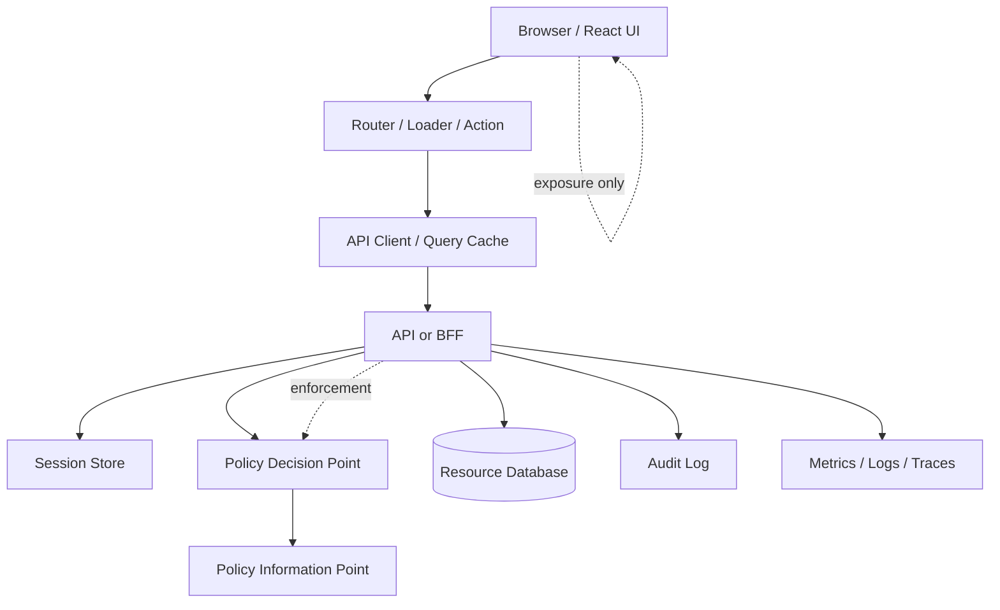

# Part 090 — Security Review Checklist

Part ini adalah penutup **Phase 9 — Security Hardening**. Tujuannya bukan menambah teori baru, tetapi mengubah seluruh materi hardening menjadi checklist review yang bisa dipakai saat:

- design review
- pull request review
- pre-release security review
- incident postmortem
- vendor/auth provider migration
- React Router/Next.js architecture review
- audit preparation untuk regulated system

Checklist ini sengaja tajam dan operational. Ia tidak menggantikan security engineer, penetration test, threat modelling session, atau formal audit. Tapi ia membantu software engineer menangkap kesalahan umum sebelum production.

Mental model:

```txt
A React auth feature is production-ready only when identity, session, authorization, data exposure, failure handling, observability, and recovery are reviewed together.
```

---

## 1. Review scope definition

Sebelum review, definisikan scope. Tanpa scope, checklist berubah menjadi ritual kosong.

```txt
What changed?
Who can access it?
What data is exposed?
What action can be performed?
What session/token/cookie assumptions changed?
What happens when auth state changes mid-flow?
How do we prove server enforcement exists?
```

Review object examples:

| Change type | Review focus |
|---|---|
| New protected route | loader/auth guard, direct URL, layout exposure, backend API enforcement |
| New mutation/action | server authorization, CSRF, idempotency, audit, optimistic rollback |
| New role/permission | permission contract, cache invalidation, route/component/table/form coverage |
| New auth provider | OAuth/OIDC flow, token storage, callback hardening, logout, session mapping |
| New file export | object authorization, signed URL, cache-control, audit, rate limit |
| New WebSocket/SSE channel | handshake auth, channel auth, event filtering, revocation |
| New admin console | impersonation, separation of duties, audit, blast radius |
| New SSR/RSC data path | server/client boundary, serialization, cache, hydration mismatch |

---

## 2. Architecture review map

Every review should locate the feature on the auth architecture map.



Review questions:

```txt
[ ] Where is authentication checked?
[ ] Where is authorization enforced?
[ ] Where is permission projected to UI?
[ ] Where is session refreshed or revoked?
[ ] Where are audit events emitted?
[ ] Where can sensitive data be cached?
[ ] Where can stale permission survive?
```

If the answer to “where is authorization enforced?” is “in React component”, the design is wrong.

---

## 3. Authentication checklist

```txt
[ ] Login flow uses a modern protocol/pattern appropriate for app type.
[ ] OAuth/OIDC browser flow uses Authorization Code with PKCE, not Implicit Flow.
[ ] Callback route validates transaction state.
[ ] Callback route validates nonce where ID Token is involved.
[ ] Redirect URI is exact/allowlisted.
[ ] Return URL is internal-only and normalized.
[ ] Login failure messages are enumeration-resistant.
[ ] Password reset response does not reveal account existence.
[ ] MFA/step-up flow is modelled as auth state, not ad-hoc modal state.
[ ] Auth provider identity is mapped to internal subject id.
[ ] Provider roles/groups are not blindly trusted as app permissions.
[ ] Enterprise SSO/org discovery has explicit enumeration risk decision.
[ ] Account linking is explicit and auditable.
[ ] Deprovisioning and membership removal are handled.
```

Common red flags:

```txt
- ID Token used as API credential.
- Access Token decoded in browser to decide authorization.
- Callback route accepts arbitrary return URL.
- Login form tells attacker whether email exists.
- Provider group claims directly drive UI/admin permissions without app mapping.
```

---

## 4. Session and token checklist

```txt
[ ] Session strategy is explicit: cookie session, bearer token, BFF, or hybrid.
[ ] Token/cookie storage threat model is documented.
[ ] Sensitive tokens are not stored in localStorage unless risk is accepted and mitigated.
[ ] HttpOnly cookies use Secure and appropriate SameSite.
[ ] Cookie domain/path scope is minimal.
[ ] Session id rotates after privilege boundary where applicable.
[ ] Refresh token rotation/reuse detection exists if refresh tokens are used.
[ ] Token expiry and clock skew are handled deliberately.
[ ] Refresh has single-flight behavior to avoid retry storm.
[ ] Logout revokes server-side session/token state.
[ ] Logout clears client caches and propagates across tabs.
[ ] Session bootstrap does not leak sensitive claims.
[ ] Session projection is minimal and product-shaped.
[ ] Server enforces session expiry; client countdown is not authority.
```

For BFF:

```txt
[ ] Browser never receives downstream OAuth tokens.
[ ] BFF stores token/session server-side or in protected vault.
[ ] BFF endpoints enforce product authorization, not just token presence.
[ ] BFF session projection endpoint has no-store cache-control.
```

For SPA bearer token:

```txt
[ ] Access token is held in memory where possible.
[ ] Refresh strategy is explicit.
[ ] Cross-tab refresh/logout coordination exists.
[ ] API client does not retry indefinitely.
```

---

## 5. Authorization checklist

```txt
[ ] Authorization model is explicit: RBAC, ABAC, ACL, ReBAC, or hybrid.
[ ] Decision vocabulary uses subject/action/resource/context.
[ ] Deny-by-default is implemented server-side.
[ ] Permission is validated on every protected request.
[ ] Route access is checked before data is loaded.
[ ] Mutating actions check permission before write.
[ ] Object-level authorization is enforced for every object id/route param/body id.
[ ] Tenant id is server-derived or server-validated, never trusted from UI alone.
[ ] Field-level write permission is enforced server-side.
[ ] Bulk action eligibility is computed server-side.
[ ] Policy changes invalidate stale permission projections.
[ ] Permission response has version/epoch where needed.
[ ] 403 response is typed and safe.
[ ] Authorization failures are auditable.
```

Red flags:

```txt
- user.role === 'admin' scattered across components.
- Menu hiding treated as access control.
- Backend endpoint trusts resource id because UI generated it.
- List endpoint filters correctly but detail endpoint does not.
- Bulk endpoint authorizes only the first object.
- Tenant id from localStorage is trusted.
```

---

## 6. Route, loader, action checklist

For React Router/Data Mode/Framework Mode:

```txt
[ ] Protected data routes enforce auth in loader, not only component render.
[ ] Mutating routes enforce authz in action.
[ ] Loader/action return typed 401/403/step-up/tenant-mismatch errors.
[ ] Error boundaries do not leak sensitive details.
[ ] Return URL is internal-only.
[ ] Redirect loop is impossible or detected.
[ ] Pending UI does not show protected data before auth resolves.
[ ] Revalidation occurs after login/logout/tenant switch/permission change.
[ ] Route metadata does not become the only authorization source.
[ ] Direct URL access has same protection as navigation menu path.
```

For Next.js/App Router/RSC:

```txt
[ ] Server Component data fetches enforce auth before fetching sensitive data.
[ ] Client Component props do not include sensitive server-only data.
[ ] Server Actions revalidate identity/permission from server context.
[ ] Middleware/Proxy is used only for coarse gating unless full context is available.
[ ] Cookie mutation happens only at valid server boundary.
[ ] RSC/SSR cache does not share authenticated data across users/tenants.
[ ] Layouts that persist across navigation handle auth/tenant changes.
```

---

## 7. UI exposure checklist

```txt
[ ] UI is deny-by-default while permission is unknown.
[ ] Sensitive buttons/menu/items are hidden/disabled/explained according to policy.
[ ] Disabled controls do not submit unauthorized data.
[ ] Hidden fields are not used as security.
[ ] Table row actions are based on row-specific allowed actions.
[ ] Bulk actions handle mixed eligibility.
[ ] Command palette/search does not expose forbidden actions/resources.
[ ] Breadcrumbs/tabs/sidebar do not reveal sensitive resource names.
[ ] Permission denial reason is safe for user display.
[ ] Access request CTA does not leak existence of hidden resource.
[ ] Impersonation mode is visibly persistent and auditable.
[ ] Support/admin UI differentiates actor from subject.
```

Review exact UI state matrix:

```txt
unknown -> skeleton/none
allowed -> show action
forbidden_hidden -> hide action
forbidden_explainable -> disabled + safe reason
requires_step_up -> show verify action
stale -> refresh/retry state
```

---

## 8. XSS checklist

```txt
[ ] No unsafe HTML rendering without sanitizer and review.
[ ] `dangerouslySetInnerHTML` usage is rare, isolated, and justified.
[ ] Markdown/rich text rendering uses allowlist sanitizer.
[ ] URL rendering validates protocol and destination.
[ ] Third-party scripts are inventoried and justified.
[ ] CSP is configured and monitored.
[ ] Trusted Types are considered for high-risk apps.
[ ] Auth tokens are not exposed to arbitrary JS where avoidable.
[ ] Sensitive data is not stored unnecessarily in DOM, props, logs, or analytics.
[ ] Error boundaries sanitize display and reporting.
[ ] Source maps are handled according to policy.
```

Red flags:

```txt
- Rendering user-controlled HTML inside authenticated admin UI.
- Passing entire user/session object to every component.
- Analytics event includes email, token, case id, or full URL with token.
- Third-party widget loaded inside authenticated high-privilege page without CSP review.
```

---

## 9. CSRF checklist

For cookie-based auth:

```txt
[ ] Cookie SameSite policy is explicit.
[ ] State-changing endpoints require CSRF defense.
[ ] CSRF token is session-bound and unpredictable.
[ ] Origin/Referer validation is considered for sensitive endpoints.
[ ] CORS is not treated as CSRF protection.
[ ] GET endpoints do not perform state-changing actions.
[ ] GraphQL mutations have CSRF strategy.
[ ] File upload endpoints have CSRF strategy.
[ ] Logout CSRF behavior is explicitly decided.
[ ] Sensitive operations may require user interaction or step-up.
```

Red flags:

```txt
- SameSite=None cookie without clear CSRF design.
- State-changing GET links.
- CSRF token stored but never validated.
- CORS allowlist confused with CSRF mitigation.
```

---

## 10. Cache and data exposure checklist

```txt
[ ] `/session`, `/me`, `/permissions`, and sensitive API responses use no-store where appropriate.
[ ] CDN/shared cache cannot cache user-specific data without correct Vary/private controls.
[ ] Query cache key includes auth/tenant/permission scope where needed.
[ ] Persisted query cache excludes sensitive data or encrypts/clears it according to policy.
[ ] Logout clears query cache, router cache, app stores, and storage as needed.
[ ] Service worker does not cache authenticated sensitive responses blindly.
[ ] Browser back button/bfcache behavior after logout is tested.
[ ] Signed URLs have short TTL and are scoped.
[ ] Export/download responses have proper cache-control.
[ ] Error logs and analytics do not capture sensitive payloads.
```

Red flags:

```txt
- User A sees User B data after tenant switch/logout/login.
- Protected API response cached by CDN.
- Session endpoint cached by browser.
- Sensitive file preview URL stored permanently in app state/localStorage.
```

---

## 11. Security headers checklist

```txt
[ ] Content-Security-Policy is defined for authenticated routes.
[ ] CSP report-only rollout is used before enforcement where needed.
[ ] `frame-ancestors` or equivalent clickjacking protection exists.
[ ] HSTS is enabled for HTTPS production domains.
[ ] `X-Content-Type-Options: nosniff` is set.
[ ] Referrer-Policy prevents sensitive URL leakage.
[ ] Permissions-Policy disables unnecessary browser capabilities.
[ ] Cache-Control is route/data-type appropriate.
[ ] Cookies use Secure/HttpOnly/SameSite/Path/Domain correctly.
[ ] Clear-Site-Data usage is evaluated for logout/incident response.
```

Header review is environment-specific. Do not copy a single universal header set into every route without considering OAuth callback, embedded pages, CDN, static assets, and third-party integrations.

---

## 12. Abuse and rate limiting checklist

```txt
[ ] Login endpoint has server-side rate limiting.
[ ] Password reset has independent abuse controls.
[ ] MFA challenge/resend has independent limits.
[ ] Registration/invite/magic-link endpoints have abuse controls.
[ ] GraphQL batching cannot bypass auth rate limits.
[ ] Client respects 429/Retry-After without infinite retry.
[ ] Account lockout cannot be trivially abused for victim DoS.
[ ] Public error messages are enumeration-resistant.
[ ] Support/recovery path exists for legitimate users.
[ ] Auth abuse metrics and alerts exist.
```

---

## 13. Dependency and SDK checklist

```txt
[ ] Auth SDK is pinned/managed and reviewed as part of trust boundary.
[ ] Dependency scanning runs in CI.
[ ] Lockfile changes are reviewed.
[ ] Third-party scripts are minimized.
[ ] SDK token storage behavior is understood.
[ ] SDK refresh behavior is understood.
[ ] SDK telemetry behavior is understood.
[ ] Provider SDK failure modes are tested.
[ ] Package provenance/signature/SBOM requirements are considered.
[ ] Emergency patch/removal path exists for compromised dependency.
```

Red flag:

```txt
We installed the auth SDK and trust whatever it puts in localStorage because the quickstart did it.
```

---

## 14. Observability and audit checklist

```txt
[ ] Login/logout/session refresh events are observable.
[ ] Authorization denied events are logged with safe context.
[ ] Permission changes are audited.
[ ] Impersonation start/end/action events are audited.
[ ] Access request approvals/denials are audited.
[ ] Sensitive exports/downloads are audited.
[ ] Correlation id flows from frontend to backend where appropriate.
[ ] Logs do not include tokens, secrets, OTPs, passwords, reset links, or raw sensitive payloads.
[ ] Metrics distinguish 401, 403, 429, expired session, revoked session, and policy denial.
[ ] Alerts exist for unusual 401/403/429 spikes, refresh storms, token reuse, and permission anomalies.
```

A useful audit event shape:

```json
{
  "eventType": "authorization.denied",
  "actorId": "user_123",
  "subjectId": "user_123",
  "tenantId": "tenant_456",
  "action": "case.approve",
  "resourceType": "case",
  "resourceId": "case_789",
  "decision": "deny",
  "reasonCode": "WORKFLOW_STATE_FORBIDS_ACTION",
  "policyVersion": "2026-07-08.3",
  "correlationId": "req_abc"
}
```

---

## 15. Testing checklist

```txt
[ ] Unit tests cover permission matrix.
[ ] Route loader tests cover anonymous/authenticated/forbidden/stale states.
[ ] Action tests cover forbidden mutation and field-level denial.
[ ] E2E tests include direct URL access, not only menu click path.
[ ] E2E tests include logout and back button behavior.
[ ] Tests include tenant switch and stale cache invalidation.
[ ] Tests include session expiry during form submission.
[ ] Tests include permission revocation during active session.
[ ] Tests include optimistic UI rollback after 403.
[ ] Tests include CSRF rejection for cookie-auth mutation.
[ ] Tests include open redirect malicious return URL cases.
[ ] Tests include XSS fixture for rendered rich text if applicable.
[ ] Tests include authorization regression for changed policy/config.
```

Permission matrix example:

```ts
type CasePermissionScenario = {
  role: 'viewer' | 'investigator' | 'supervisor';
  state: 'draft' | 'submitted' | 'under_review' | 'closed';
  ownsCase: boolean;
  action: 'case.view' | 'case.edit' | 'case.approve' | 'case.close';
  expected: 'allow' | 'deny';
};
```

---

## 16. Pull request review template

Use this template in PRs that touch auth/session/permission/data exposure.

```md
## Auth/Security Review

### What changed?
- [ ] Route/UI exposure
- [ ] Data fetching
- [ ] Mutation/action
- [ ] Session/token/cookie
- [ ] Permission model
- [ ] Auth provider integration
- [ ] File/export/realtime/cache

### Enforcement
- [ ] Server-side authentication exists
- [ ] Server-side authorization exists
- [ ] Object/tenant-level checks exist
- [ ] Frontend UI is projection only

### Failure handling
- [ ] 401 handled
- [ ] 403 handled
- [ ] 429 handled
- [ ] Session expiry handled
- [ ] Permission stale/revoked handled
- [ ] Redirect loop impossible

### Data exposure
- [ ] No sensitive data in DOM unnecessarily
- [ ] No sensitive data in logs/analytics
- [ ] Cache-control reviewed
- [ ] Query/router/service-worker cache reviewed

### Tests
- [ ] Unit permission tests
- [ ] Route/action tests
- [ ] E2E direct URL tests
- [ ] Negative authorization tests
- [ ] Regression tests updated

### Observability
- [ ] Audit event added/updated
- [ ] Metrics/logging safe and useful
- [ ] Correlation id available where needed
```

---

## 17. Release gate checklist

Before production release:

```txt
[ ] Threat model reviewed for new auth-sensitive flows.
[ ] Security-critical tests pass in CI.
[ ] Dependency/security scan reviewed.
[ ] Auth provider config reviewed in target environment.
[ ] OAuth redirect URI list reviewed.
[ ] Cookie domain/path/SameSite/Secure reviewed in target environment.
[ ] CSP/security headers reviewed in target environment.
[ ] Feature flags cannot accidentally bypass permission checks.
[ ] Rollback plan exists.
[ ] Audit/metrics dashboards are ready.
[ ] Support team knows user-facing failure/recovery copy.
[ ] Incident owner/escalation path is clear.
```

---

## 18. Incident readiness checklist

Auth incidents require fast containment.

Prepare answers before incident:

```txt
[ ] Can we revoke all sessions for one user?
[ ] Can we revoke all sessions for one tenant?
[ ] Can we revoke all sessions globally?
[ ] Can we invalidate refresh token families?
[ ] Can we rotate signing keys or cookie secrets?
[ ] Can we disable an auth provider or login method?
[ ] Can we force step-up for a tenant/user cohort?
[ ] Can we disable a dangerous permission/action quickly?
[ ] Can we identify who accessed a resource?
[ ] Can we identify who changed permission policy?
[ ] Can we clear client-side caches on next load/logout?
[ ] Can we communicate safe recovery instructions?
```

Incident response is not separate from React architecture. If the frontend cannot handle forced logout, permission invalidation, or degraded auth state, incident containment becomes messy.

---

## 19. Regulated workflow checklist

For case management, enforcement lifecycle, compliance, finance, healthcare, or legal systems, add:

```txt
[ ] Workflow state is part of authorization decision.
[ ] Separation of duties is enforced server-side.
[ ] Escalation permission is time-bound and audited.
[ ] Override/break-glass requires reason and step-up.
[ ] Decision reason is recorded for defensibility.
[ ] Permission model supports review and attestation.
[ ] Impersonation cannot perform regulated actions unless explicitly allowed.
[ ] Field-level access is reviewed for sensitive attributes.
[ ] Export/download has purpose and audit trail.
[ ] UI denial reason does not reveal sensitive case details.
```

Example regulated authorization check:

```txt
subject = investigator:123
action = case.approve
resource = case:789
context = {
  tenant: regulator-id,
  workflowState: under_review,
  caseRisk: high,
  actorIsAssignedReviewer: true,
  actorCreatedCase: false,
  assuranceLevel: aal2,
  policyVersion: 2026-07-08.3
}
```

---

## 20. Phase 9 final hardening matrix

| Area | Primary question | Failure if ignored |
|---|---|---|
| XSS | Can injected script steal or misuse auth context? | Account/session compromise |
| CSRF | Can another site trigger authenticated mutation? | Unauthorized action |
| CSP | Can unexpected script execute? | XSS blast radius increases |
| Headers | Does browser receive safe security/cache policy? | Clickjacking, MIME sniffing, leakage |
| Redirect | Can user be redirected to attacker-controlled destination? | Phishing/token flow abuse |
| UI exposure | Does UI expose sensitive data unnecessarily? | Privacy/data leak |
| Dependency | Can SDK/package compromise auth surface? | Supply-chain compromise |
| Session replay | Can stale credential/request be reused? | Account takeover/unauthorized mutation |
| Rate limiting | Can auth endpoints be abused at scale? | Takeover/DoS/fraud |
| Review process | Can regressions ship unnoticed? | Repeated preventable incidents |

---

## 21. Final review heuristic

For every React auth change, ask these seven questions:

```txt
1. What identity is being used?
2. What session proof carries that identity?
3. What action/resource is being requested?
4. Where is authorization enforced server-side?
5. What does React show before the decision is known?
6. What happens when the decision changes during the flow?
7. How would we detect, audit, and recover from failure?
```

If the design cannot answer all seven, it is not ready.

---

## 22. Phase 9 closeout

Phase 9 covered:

- XSS impact on React auth
- CSRF impact on cookie auth
- CSP
- security headers
- open redirect and return URL attacks
- sensitive data exposure
- dependency/Auth SDK security
- session fixation and replay
- rate limiting and abuse-aware UI
- security review checklist

The main invariant:

```txt
Auth hardening is not one control. It is the alignment of browser behavior, session lifecycle, authorization enforcement, UI projection, data caching, observability, and incident recovery.
```

A top-tier React engineer does not stop at:

```txt
The protected route works.
```

They verify:

```txt
The route, data, action, session, cache, layout, token, redirect, error, audit, and recovery path remain correct under attack, stale state, partial failure, and operational change.
```

Phase 10 will shift from hardening to **Testing Auth and Authorization**: state machine testing, permission matrix testing, component testing, router/auth testing, E2E auth testing, authorization regression, security test cases, contract testing, mocking auth without lying, and CI security gates.

---

## References

- OWASP Authentication Cheat Sheet.
- OWASP Authorization Cheat Sheet.
- OWASP Session Management Cheat Sheet.
- OWASP CSRF Prevention Cheat Sheet.
- OWASP XSS Prevention Cheat Sheet.
- OWASP HTTP Headers Cheat Sheet.
- OWASP Web Security Testing Guide.
- OWASP Application Security Verification Standard.
- OWASP API Security Top 10 2023.
- React, React Router, Next.js, MDN, and TanStack Query documentation relevant to routing, hydration, caching, headers, browser APIs, and data fetching.
