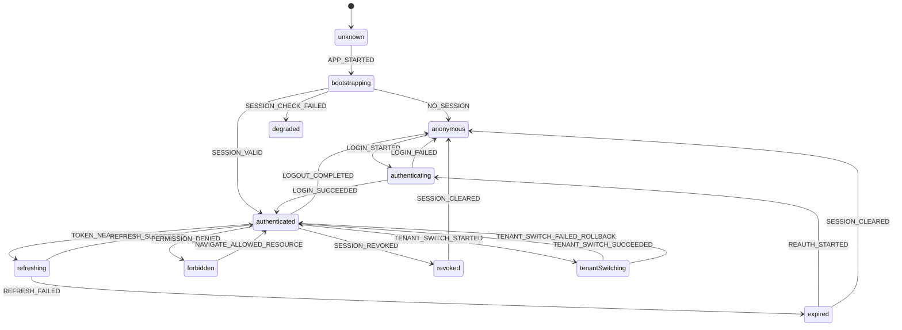
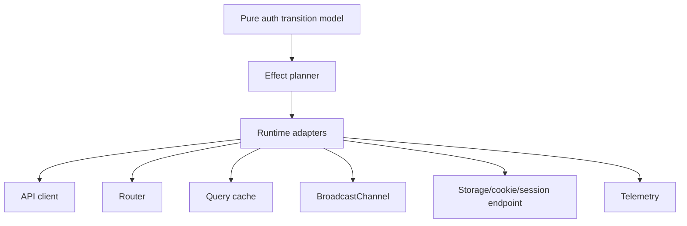

# Part 091 — Testing Auth State Machine

Auth testing yang buruk biasanya mengetes **screen login**, bukan mengetes **sistem autentikasi**.

Itu masalah besar.

Screen login hanya satu pintu masuk. Auth system punya banyak keadaan:

- user belum diketahui
- session sedang dibootstrap
- user anonymous
- user authenticated
- token/session hampir expired
- refresh sedang berjalan
- refresh gagal
- session dicabut server
- user logout dari tab lain
- tenant berubah
- permission berubah
- route loader menerima `401`
- action menerima `403`
- UI sedang optimistic update saat session menjadi invalid

Kalau semua itu hanya dites lewat “klik tombol login lalu expect dashboard muncul”, maka test suite tidak menjaga invariant auth. Test suite hanya menjaga happy path.

Part ini membahas cara mengetes auth sebagai **state machine**, bukan sebagai kumpulan component conditionals.

---

## 1. Core idea

Auth state machine adalah model eksplisit tentang:

1. state apa saja yang mungkin ada,
2. event apa saja yang boleh terjadi,
3. transisi mana yang valid,
4. side effect apa yang harus terjadi,
5. invariant apa yang tidak boleh rusak.

Dalam React app, auth state machine biasanya tersebar di:

- auth provider,
- API client,
- router loader/action,
- query cache,
- cross-tab coordinator,
- session refresh scheduler,
- logout handler,
- permission store,
- UI fallback.

Testing auth state machine berarti kita menarik semua ini menjadi model yang bisa diuji secara deterministik.



The test target is not “does the dashboard render?”. The target is:

> Given state `S` and event `E`, the system moves to state `S2`, emits side effects `F`, and preserves invariant `I`.

---

## 2. Why auth state machine testing matters

Auth bugs are usually **transition bugs**.

Examples:

| Bug | Root cause |
|---|---|
| User logs out, then old request repopulates profile | stale async response not suppressed |
| Two tabs refresh token at the same time and one invalidates the token family | missing refresh single-flight or cross-tab lock |
| User sees previous tenant sidebar after switching org | tenant-scoped cache not cleared |
| User gets infinite redirect to `/login` | auth bootstrap and route guard disagree |
| User sees forbidden page after successful reauth | stale permission snapshot |
| Token refresh fails but app keeps retrying forever | no terminal state for expired/revoked session |
| Loader throws `401`, component still renders old cached data | data cache not scoped to auth epoch |
| Logout clears React state but service worker cache still serves data | cache cleanup not part of logout transition |

These are not component bugs. They are system bugs.

---

## 3. Testing principle: separate reducer, effects, adapters

A testable auth system has three layers.



### Layer 1 — transition model

Pure function. No browser. No network. No timers.

```ts
export type AuthState =
  | { tag: "unknown" }
  | { tag: "bootstrapping" }
  | { tag: "anonymous" }
  | { tag: "authenticating"; returnTo?: string }
  | { tag: "authenticated"; session: SessionSnapshot }
  | { tag: "refreshing"; session: SessionSnapshot }
  | { tag: "expired"; reason: "refresh_failed" | "idle_timeout" | "absolute_timeout" }
  | { tag: "revoked"; reason: "server_revoked" | "reuse_detected" }
  | { tag: "degraded"; reason: "session_endpoint_unavailable" };

export type AuthEvent =
  | { type: "APP_STARTED" }
  | { type: "BOOTSTRAP_SUCCEEDED"; session: SessionSnapshot | null }
  | { type: "BOOTSTRAP_FAILED" }
  | { type: "LOGIN_STARTED"; returnTo?: string }
  | { type: "LOGIN_SUCCEEDED"; session: SessionSnapshot }
  | { type: "LOGIN_FAILED" }
  | { type: "TOKEN_NEAR_EXPIRY" }
  | { type: "REFRESH_SUCCEEDED"; session: SessionSnapshot }
  | { type: "REFRESH_FAILED" }
  | { type: "SESSION_REVOKED" }
  | { type: "LOGOUT_REQUESTED" }
  | { type: "LOGOUT_COMPLETED" };
```

### Layer 2 — effect planner

Maps transition to intended effects.

```ts
export type AuthEffect =
  | { type: "CALL_BOOTSTRAP" }
  | { type: "START_LOGIN_REDIRECT"; returnTo?: string }
  | { type: "CALL_REFRESH" }
  | { type: "CALL_LOGOUT" }
  | { type: "CLEAR_AUTH_CACHE" }
  | { type: "ABORT_IN_FLIGHT_REQUESTS" }
  | { type: "BROADCAST_LOGOUT" }
  | { type: "NAVIGATE"; to: string }
  | { type: "TRACK_AUTH_EVENT"; name: string; attrs?: Record<string, unknown> };
```

### Layer 3 — runtime adapters

The only place that talks to actual APIs.

```ts
export interface AuthRuntime {
  bootstrap(): Promise<SessionSnapshot | null>;
  refresh(): Promise<SessionSnapshot>;
  logout(): Promise<void>;
  clearCaches(): void;
  abortInFlightRequests(): void;
  broadcast(event: CrossTabAuthEvent): void;
  navigate(to: string): void;
  track(name: string, attrs?: Record<string, unknown>): void;
}
```

The more auth logic lives in Layer 1 and Layer 2, the easier it becomes to test hard transitions without launching a browser.

---

## 4. Minimal auth transition reducer

```ts
export function transition(state: AuthState, event: AuthEvent): AuthState {
  switch (state.tag) {
    case "unknown": {
      if (event.type === "APP_STARTED") return { tag: "bootstrapping" };
      return state;
    }

    case "bootstrapping": {
      if (event.type === "BOOTSTRAP_SUCCEEDED") {
        return event.session
          ? { tag: "authenticated", session: event.session }
          : { tag: "anonymous" };
      }
      if (event.type === "BOOTSTRAP_FAILED") {
        return { tag: "degraded", reason: "session_endpoint_unavailable" };
      }
      return state;
    }

    case "anonymous": {
      if (event.type === "LOGIN_STARTED") {
        return { tag: "authenticating", returnTo: event.returnTo };
      }
      return state;
    }

    case "authenticating": {
      if (event.type === "LOGIN_SUCCEEDED") {
        return { tag: "authenticated", session: event.session };
      }
      if (event.type === "LOGIN_FAILED") return { tag: "anonymous" };
      return state;
    }

    case "authenticated": {
      if (event.type === "TOKEN_NEAR_EXPIRY") {
        return { tag: "refreshing", session: state.session };
      }
      if (event.type === "SESSION_REVOKED") {
        return { tag: "revoked", reason: "server_revoked" };
      }
      if (event.type === "LOGOUT_REQUESTED") {
        return { tag: "anonymous" };
      }
      return state;
    }

    case "refreshing": {
      if (event.type === "REFRESH_SUCCEEDED") {
        return { tag: "authenticated", session: event.session };
      }
      if (event.type === "REFRESH_FAILED") {
        return { tag: "expired", reason: "refresh_failed" };
      }
      if (event.type === "LOGOUT_REQUESTED") {
        return { tag: "anonymous" };
      }
      return state;
    }

    case "expired":
    case "revoked":
    case "degraded": {
      if (event.type === "LOGOUT_COMPLETED") return { tag: "anonymous" };
      if (event.type === "LOGIN_STARTED") {
        return { tag: "authenticating", returnTo: event.returnTo };
      }
      return state;
    }
  }
}
```

This reducer is intentionally simple. Production systems may have more states, but the testing shape remains the same.

---

## 5. Test the reducer first

Reducer tests should be boring. Boring is good.

```ts
import { describe, expect, it } from "vitest";
import { transition } from "./auth-machine";

const session = {
  userId: "user_123",
  tenantId: "tenant_a",
  authEpoch: 7,
  permissionEpoch: 12,
  expiresAt: "2026-07-08T09:30:00.000Z",
};

describe("auth state machine", () => {
  it("moves from unknown to bootstrapping on app start", () => {
    expect(transition({ tag: "unknown" }, { type: "APP_STARTED" })).toEqual({
      tag: "bootstrapping",
    });
  });

  it("moves from bootstrapping to anonymous when no session exists", () => {
    expect(
      transition(
        { tag: "bootstrapping" },
        { type: "BOOTSTRAP_SUCCEEDED", session: null },
      ),
    ).toEqual({ tag: "anonymous" });
  });

  it("moves from bootstrapping to authenticated when session exists", () => {
    expect(
      transition(
        { tag: "bootstrapping" },
        { type: "BOOTSTRAP_SUCCEEDED", session },
      ),
    ).toEqual({ tag: "authenticated", session });
  });

  it("moves authenticated session to refreshing when token is near expiry", () => {
    expect(
      transition(
        { tag: "authenticated", session },
        { type: "TOKEN_NEAR_EXPIRY" },
      ),
    ).toEqual({ tag: "refreshing", session });
  });

  it("moves refresh failure to expired", () => {
    expect(
      transition(
        { tag: "refreshing", session },
        { type: "REFRESH_FAILED" },
      ),
    ).toEqual({ tag: "expired", reason: "refresh_failed" });
  });
});
```

This is where most teams stop too early.

Reducer tests prove local transition correctness. They do not prove that side effects are correct.

---

## 6. Test transition + planned effects

A state machine without effects is a diagram. In a real app, transition must trigger consequences.

Example:

- app starts → call bootstrap
- logout requested → abort requests, clear cache, broadcast logout, call logout endpoint, navigate login
- refresh failed → clear sensitive cache, mark expired, navigate reauth

```ts
export function planEffects(
  previous: AuthState,
  event: AuthEvent,
  next: AuthState,
): AuthEffect[] {
  if (previous.tag === "unknown" && event.type === "APP_STARTED") {
    return [{ type: "CALL_BOOTSTRAP" }];
  }

  if (event.type === "LOGOUT_REQUESTED") {
    return [
      { type: "ABORT_IN_FLIGHT_REQUESTS" },
      { type: "CLEAR_AUTH_CACHE" },
      { type: "BROADCAST_LOGOUT" },
      { type: "CALL_LOGOUT" },
      { type: "NAVIGATE", to: "/login" },
      { type: "TRACK_AUTH_EVENT", name: "auth.logout.requested" },
    ];
  }

  if (previous.tag === "refreshing" && next.tag === "expired") {
    return [
      { type: "CLEAR_AUTH_CACHE" },
      { type: "NAVIGATE", to: "/login?reason=session_expired" },
      { type: "TRACK_AUTH_EVENT", name: "auth.refresh.failed" },
    ];
  }

  return [];
}
```

Test it explicitly.

```ts
import { describe, expect, it } from "vitest";
import { planEffects } from "./auth-machine";

describe("auth effect planner", () => {
  it("plans bootstrap effect after app start", () => {
    expect(
      planEffects(
        { tag: "unknown" },
        { type: "APP_STARTED" },
        { tag: "bootstrapping" },
      ),
    ).toEqual([{ type: "CALL_BOOTSTRAP" }]);
  });

  it("plans full cleanup on logout", () => {
    expect(
      planEffects(
        { tag: "authenticated", session },
        { type: "LOGOUT_REQUESTED" },
        { tag: "anonymous" },
      ),
    ).toEqual([
      { type: "ABORT_IN_FLIGHT_REQUESTS" },
      { type: "CLEAR_AUTH_CACHE" },
      { type: "BROADCAST_LOGOUT" },
      { type: "CALL_LOGOUT" },
      { type: "NAVIGATE", to: "/login" },
      { type: "TRACK_AUTH_EVENT", name: "auth.logout.requested" },
    ]);
  });
});
```

A good auth test suite asserts not only state, but also cleanup.

---

## 7. Test invariants, not just examples

Examples are useful. Invariants are stronger.

Important auth invariants:

1. Unknown auth state must not expose protected content.
2. Anonymous state must not contain session snapshot.
3. Expired/revoked state must not retain sensitive cached data.
4. Logout must always clear auth-scoped cache.
5. Permission checks must fail closed when permission snapshot is missing.
6. Tenant switch must change tenant-scoped cache key.
7. Stale async response must not overwrite newer auth epoch.
8. Refresh failure must not leave the app in authenticated state.
9. `401` recovery must not retry forever.
10. `403` must not trigger login redirect loop.

Write invariant helpers.

```ts
function assertNoSessionInAnonymousState(state: AuthState) {
  if (state.tag === "anonymous") {
    expect("session" in state).toBe(false);
  }
}

function assertTerminalStatesAreNotAuthenticated(state: AuthState) {
  if (state.tag === "expired" || state.tag === "revoked") {
    expect(state.tag).not.toBe("authenticated");
  }
}
```

Then run them across scenario tables.

```ts
const cases: Array<{ name: string; state: AuthState; event: AuthEvent }> = [
  {
    name: "refresh failure",
    state: { tag: "refreshing", session },
    event: { type: "REFRESH_FAILED" },
  },
  {
    name: "logout during refresh",
    state: { tag: "refreshing", session },
    event: { type: "LOGOUT_REQUESTED" },
  },
  {
    name: "revocation while authenticated",
    state: { tag: "authenticated", session },
    event: { type: "SESSION_REVOKED" },
  },
];

it.each(cases)("preserves core invariants: $name", ({ state, event }) => {
  const next = transition(state, event);
  assertNoSessionInAnonymousState(next);
  assertTerminalStatesAreNotAuthenticated(next);
});
```

The test name is less important than the invariant.

---

## 8. Test expiry with fake time

Expiry logic must be deterministic. Never test expiry by actually waiting.

Vitest supports mocking system time with `vi.setSystemTime`. Use it for token/session expiry tests.

```ts
import { afterEach, describe, expect, it, vi } from "vitest";
import { shouldRefreshSession } from "./session-expiry";

afterEach(() => {
  vi.useRealTimers();
});

describe("session expiry", () => {
  it("refreshes before expiry threshold", () => {
    vi.useFakeTimers();
    vi.setSystemTime(new Date("2026-07-08T10:00:00.000Z"));

    const snapshot = {
      expiresAt: "2026-07-08T10:04:30.000Z",
    };

    expect(
      shouldRefreshSession(snapshot, {
        refreshThresholdMs: 5 * 60 * 1000,
      }),
    ).toBe(true);
  });

  it("does not refresh when expiry is far away", () => {
    vi.useFakeTimers();
    vi.setSystemTime(new Date("2026-07-08T10:00:00.000Z"));

    const snapshot = {
      expiresAt: "2026-07-08T10:30:00.000Z",
    };

    expect(
      shouldRefreshSession(snapshot, {
        refreshThresholdMs: 5 * 60 * 1000,
      }),
    ).toBe(false);
  });
});
```

Important: always reset fake timers. Time leaks between tests cause false failures that look like auth bugs.

---

## 9. Test refresh single-flight

Refresh bugs often come from concurrency.

Desired invariant:

> If five API requests receive `401` at the same time, the app performs one refresh attempt, then replays safe requests consistently.

A minimal single-flight refresh coordinator:

```ts
export class RefreshCoordinator {
  private inFlight: Promise<SessionSnapshot> | null = null;

  constructor(private readonly refreshFn: () => Promise<SessionSnapshot>) {}

  refresh(): Promise<SessionSnapshot> {
    if (!this.inFlight) {
      this.inFlight = this.refreshFn().finally(() => {
        this.inFlight = null;
      });
    }

    return this.inFlight;
  }
}
```

Test it.

```ts
import { describe, expect, it, vi } from "vitest";
import { RefreshCoordinator } from "./refresh-coordinator";

describe("RefreshCoordinator", () => {
  it("deduplicates concurrent refresh calls", async () => {
    const refreshFn = vi.fn(async () => session);
    const coordinator = new RefreshCoordinator(refreshFn);

    const results = await Promise.all([
      coordinator.refresh(),
      coordinator.refresh(),
      coordinator.refresh(),
      coordinator.refresh(),
    ]);

    expect(refreshFn).toHaveBeenCalledTimes(1);
    expect(results).toEqual([session, session, session, session]);
  });

  it("allows a new refresh after previous one settles", async () => {
    const refreshFn = vi.fn(async () => session);
    const coordinator = new RefreshCoordinator(refreshFn);

    await coordinator.refresh();
    await coordinator.refresh();

    expect(refreshFn).toHaveBeenCalledTimes(2);
  });
});
```

This does not yet test replay policy. That belongs in API client tests.

---

## 10. Test logout against stale async responses

A classic bug:

1. user is authenticated,
2. `/me` request starts,
3. user clicks logout,
4. app clears state,
5. old `/me` response returns,
6. app sets user back to authenticated.

The fix is usually an auth epoch or request generation.

```ts
export class AuthEpochStore {
  private current = 0;

  get epoch() {
    return this.current;
  }

  bump() {
    this.current += 1;
    return this.current;
  }

  isCurrent(epoch: number) {
    return epoch === this.current;
  }
}
```

Test stale response suppression.

```ts
import { describe, expect, it } from "vitest";
import { AuthEpochStore } from "./auth-epoch";

describe("auth epoch", () => {
  it("suppresses stale async response after logout", async () => {
    const epochs = new AuthEpochStore();

    const requestEpoch = epochs.epoch;
    epochs.bump(); // logout

    const shouldApplyResponse = epochs.isCurrent(requestEpoch);

    expect(shouldApplyResponse).toBe(false);
  });
});
```

In integration tests, assert the visible behavior:

```ts
it("does not repopulate user after logout when old session request resolves", async () => {
  const deferred = createDeferred<SessionSnapshot>();

  const runtime = createFakeAuthRuntime({
    bootstrap: () => deferred.promise,
  });

  render(<App runtime={runtime} />);

  await user.click(screen.getByRole("button", { name: /log out/i }));
  deferred.resolve(session);

  expect(await screen.findByText(/signed out/i)).toBeInTheDocument();
  expect(screen.queryByText(/dashboard/i)).not.toBeInTheDocument();
});
```

---

## 11. Test cross-tab logout

Cross-tab coordination is auth state machine behavior. It should be testable without a real browser BroadcastChannel.

Create an interface.

```ts
export interface AuthBus {
  publish(event: CrossTabAuthEvent): void;
  subscribe(listener: (event: CrossTabAuthEvent) => void): () => void;
}

export type CrossTabAuthEvent =
  | { type: "LOGOUT"; reason: "user" | "revoked"; authEpoch: number }
  | { type: "SESSION_REFRESHED"; authEpoch: number }
  | { type: "PERMISSIONS_INVALIDATED"; permissionEpoch: number };
```

Fake implementation.

```ts
export function createMemoryAuthBus(): AuthBus {
  const listeners = new Set<(event: CrossTabAuthEvent) => void>();

  return {
    publish(event) {
      for (const listener of listeners) listener(event);
    },
    subscribe(listener) {
      listeners.add(listener);
      return () => listeners.delete(listener);
    },
  };
}
```

Test behavior.

```ts
it("clears auth state when logout is received from another tab", () => {
  const bus = createMemoryAuthBus();
  const auth = createAuthStore({ bus, initialState: { tag: "authenticated", session } });

  bus.publish({ type: "LOGOUT", reason: "user", authEpoch: 8 });

  expect(auth.getState()).toEqual({ tag: "anonymous" });
});
```

The real BroadcastChannel adapter should be thin enough to test separately with a small contract test.

---

## 12. Test route behavior, not just components

For React Router apps, auth can live in loaders/actions. That means tests must cover route behavior.

Example loader:

```ts
import { redirect } from "react-router";

export async function dashboardLoader({ request, context }: LoaderArgs) {
  const session = await context.auth.requireSession(request);

  if (!session) {
    const url = new URL(request.url);
    throw redirect(`/login?returnTo=${encodeURIComponent(url.pathname)}`);
  }

  return { session };
}
```

Route tests should assert redirect, not component fallback.

```ts
it("redirects anonymous user before rendering dashboard", async () => {
  const context = {
    auth: {
      requireSession: async () => null,
    },
  };

  await expect(
    dashboardLoader({
      request: new Request("https://app.example.test/dashboard"),
      context,
      params: {},
    }),
  ).rejects.toMatchObject({
    status: 302,
  });
});
```

For component-level route tests, React Router provides testing utilities for routes with loaders/actions. The key is to test auth at the route boundary, not only after the protected component has rendered.

---

## 13. Test `401` and `403` as different transitions

A common mistake is treating every auth failure as “go to login”.

That creates bad behavior:

- `403` becomes login loop,
- valid user gets asked to re-login for permission issue,
- support cannot distinguish expired session from insufficient permission,
- access request workflow is never shown.

Build explicit mapping.

```ts
export type ApiAuthFailure =
  | { type: "unauthenticated"; status: 401; reason: "missing" | "expired" | "revoked" }
  | { type: "forbidden"; status: 403; reason: "missing_permission" | "tenant_mismatch" }
  | { type: "step_up_required"; status: 403; reason: "fresh_auth_required" };

export function authEventFromApiFailure(failure: ApiAuthFailure): AuthEvent | null {
  if (failure.type === "unauthenticated") return { type: "SESSION_REVOKED" };
  return null;
}
```

Test mapping.

```ts
it("maps 401 revoked to session revoked event", () => {
  expect(
    authEventFromApiFailure({
      type: "unauthenticated",
      status: 401,
      reason: "revoked",
    }),
  ).toEqual({ type: "SESSION_REVOKED" });
});

it("does not map 403 missing permission to login event", () => {
  expect(
    authEventFromApiFailure({
      type: "forbidden",
      status: 403,
      reason: "missing_permission",
    }),
  ).toBeNull();
});
```

`401` is a session/authentication problem. `403` is usually an authorization problem. A robust app treats them differently.

---

## 14. Test cache cleanup as a first-class effect

Logout without cache cleanup is not logout.

At minimum, test these cleanup targets:

- in-memory auth store,
- query cache,
- persisted query cache,
- route data cache,
- object URL cache,
- upload progress state,
- cross-tab auth state,
- service worker/session cache when applicable,
- sensitive form draft cache.

```ts
it("clears query cache on logout", () => {
  const queryClient = new QueryClient();

  queryClient.setQueryData(["tenant", "tenant_a", "cases"], [{ id: "case_1" }]);

  executeEffects(
    [{ type: "CLEAR_AUTH_CACHE" }],
    createRuntime({ queryClient }),
  );

  expect(queryClient.getQueryData(["tenant", "tenant_a", "cases"])).toBeUndefined();
});
```

If the auth state machine says logout is complete while sensitive cache remains accessible, the test should fail.

---

## 15. Test degraded state

Production systems have partial outages.

Auth bootstrap can fail because:

- session endpoint is down,
- network is flaky,
- IdP is down,
- policy service is down,
- tenant membership service is down,
- permission projection timed out.

A mature system distinguishes:

| Condition | UI state |
|---|---|
| No session | anonymous |
| Session expired | expired/reauth |
| Permission denied | forbidden |
| Session endpoint unavailable | degraded |
| Policy service unavailable | authenticated but permission unknown/deny |

Test degraded behavior.

```ts
it("moves bootstrap failure to degraded state", () => {
  expect(
    transition({ tag: "bootstrapping" }, { type: "BOOTSTRAP_FAILED" }),
  ).toEqual({ tag: "degraded", reason: "session_endpoint_unavailable" });
});
```

Then test UI:

```ts
it("does not show protected content in degraded auth bootstrap", async () => {
  render(<App initialAuthState={{ tag: "degraded", reason: "session_endpoint_unavailable" }} />);

  expect(screen.queryByText(/case list/i)).not.toBeInTheDocument();
  expect(screen.getByText(/we cannot verify your session/i)).toBeInTheDocument();
});
```

Degraded is not authenticated. Degraded is “we cannot safely know”.

---

## 16. Test with scenario tables

Auth state machines benefit from scenario-table tests.

```ts
const authScenarios = [
  {
    name: "anonymous user starts login",
    initial: { tag: "anonymous" } satisfies AuthState,
    events: [{ type: "LOGIN_STARTED", returnTo: "/cases" } satisfies AuthEvent],
    expected: { tag: "authenticating", returnTo: "/cases" } satisfies AuthState,
  },
  {
    name: "refresh failure expires session",
    initial: { tag: "refreshing", session } satisfies AuthState,
    events: [{ type: "REFRESH_FAILED" } satisfies AuthEvent],
    expected: { tag: "expired", reason: "refresh_failed" } satisfies AuthState,
  },
  {
    name: "server revocation terminalizes session",
    initial: { tag: "authenticated", session } satisfies AuthState,
    events: [{ type: "SESSION_REVOKED" } satisfies AuthEvent],
    expected: { tag: "revoked", reason: "server_revoked" } satisfies AuthState,
  },
];

it.each(authScenarios)("$name", ({ initial, events, expected }) => {
  const finalState = events.reduce(transition, initial);
  expect(finalState).toEqual(expected);
});
```

Scenario tables are readable, diffable, and easy to extend during incident follow-up.

---

## 17. Test auth under user interaction

React Testing Library and `user-event` are useful for integration-level behavior because they encourage testing through visible UI and realistic interactions.

Example:

```tsx
it("shows reauth prompt when session expires during submit", async () => {
  const user = userEvent.setup();

  render(<CaseEditPage api={apiThatReturns401OnSave} />);

  await user.type(screen.getByLabelText(/title/i), "Updated title");
  await user.click(screen.getByRole("button", { name: /save/i }));

  expect(await screen.findByText(/your session expired/i)).toBeInTheDocument();
  expect(screen.queryByText(/saved/i)).not.toBeInTheDocument();
});
```

The goal is not to test every reducer branch through the UI. The goal is to test high-risk user journeys where reducer, side effects, router, API client, and UI meet.

---

## 18. Test matrix for auth state machine

Use this as a baseline.

| Scenario | Unit | Integration | E2E |
|---|---:|---:|---:|
| bootstrap no session | yes | yes | optional |
| bootstrap valid session | yes | yes | yes |
| bootstrap degraded | yes | yes | optional |
| login start preserves safe return URL | yes | yes | yes |
| callback success | yes | yes | yes |
| callback state mismatch | yes | yes | yes |
| proactive refresh | yes | yes | optional |
| concurrent refresh single-flight | yes | yes | optional |
| refresh failure | yes | yes | yes |
| server revocation | yes | yes | optional |
| logout cleanup | yes | yes | yes |
| cross-tab logout | yes | yes | optional |
| tenant switch cleanup | yes | yes | yes |
| permission epoch change | yes | yes | optional |
| 401 vs 403 mapping | yes | yes | yes |
| degraded policy service | yes | yes | optional |
| stale response suppression | yes | yes | optional |

E2E is expensive. Use it for journeys. Use unit/integration tests for state-space coverage.

---

## 19. What not to test

Avoid low-value tests:

```ts
expect(authState.tag).toBe("authenticated");
```

immediately after setting the mock state manually. That tests the mock.

Avoid testing implementation details:

```ts
expect(setAuthState).toHaveBeenCalledTimes(1);
```

unless the exact call count is an invariant.

Avoid tests that know too much about internal storage:

```ts
expect(localStorage.getItem("token")).toBe("...");
```

unless storage policy itself is the behavior under test.

Prefer:

- user cannot see protected data,
- refresh is deduplicated,
- logout clears cache,
- stale responses are ignored,
- `403` does not redirect to login,
- `401` recovery is bounded,
- tenant switch isolates data,
- unknown permission fails closed.

---

## 20. Incident-driven auth tests

Every auth incident should produce at least one regression test.

Example incident:

> Users who were removed from an organization still saw old project list for up to five minutes after permission revocation.

Regression test:

```ts
it("clears tenant project cache when permission epoch changes", () => {
  const queryClient = new QueryClient();

  queryClient.setQueryData(["tenant", "tenant_a", "projects", "permissionEpoch", 1], [
    { id: "project_1" },
  ]);

  authStore.applyEvent({
    type: "PERMISSIONS_INVALIDATED",
    tenantId: "tenant_a",
    permissionEpoch: 2,
  });

  expect(
    queryClient.getQueryData(["tenant", "tenant_a", "projects", "permissionEpoch", 1]),
  ).toBeUndefined();
});
```

Test name should preserve the failure story.

---

## 21. Production checklist

Before shipping an auth state machine change, verify:

- [ ] All states are explicit and typed.
- [ ] Unknown/degraded state does not show protected content.
- [ ] Logout clears every auth-scoped cache.
- [ ] Logout aborts in-flight requests.
- [ ] Stale async responses are suppressed.
- [ ] Refresh is single-flight per runtime and coordinated across tabs if needed.
- [ ] `401` and `403` are handled differently.
- [ ] Refresh failure leads to terminal expired state.
- [ ] Revoked session leads to terminal revoked/anonymous state.
- [ ] Tenant switch bumps tenant/auth/cache epoch.
- [ ] Permission invalidation bumps permission epoch.
- [ ] Route loaders/actions are tested, not only components.
- [ ] Time-based logic uses fake time in tests.
- [ ] Incident regression tests exist for past auth bugs.

---

## 22. References

- OWASP Authorization Cheat Sheet — Validate permissions on every request and deny by default: https://cheatsheetseries.owasp.org/cheatsheets/Authorization_Cheat_Sheet.html
- React Router Testing — `createRoutesStub` for loaders/actions/components: https://reactrouter.com/start/framework/testing
- React Router Data Loading — loader/clientLoader model: https://reactrouter.com/start/framework/data-loading
- Testing Library `user-event` — realistic user interactions: https://testing-library.com/docs/user-event/intro/
- Testing Library async utilities — `findBy`, `waitFor`, disappearance: https://testing-library.com/docs/dom-testing-library/api-async/
- Vitest mocking and fake time: https://vitest.dev/guide/mocking
- Vitest `vi.setSystemTime`: https://vitest.dev/api/vi

