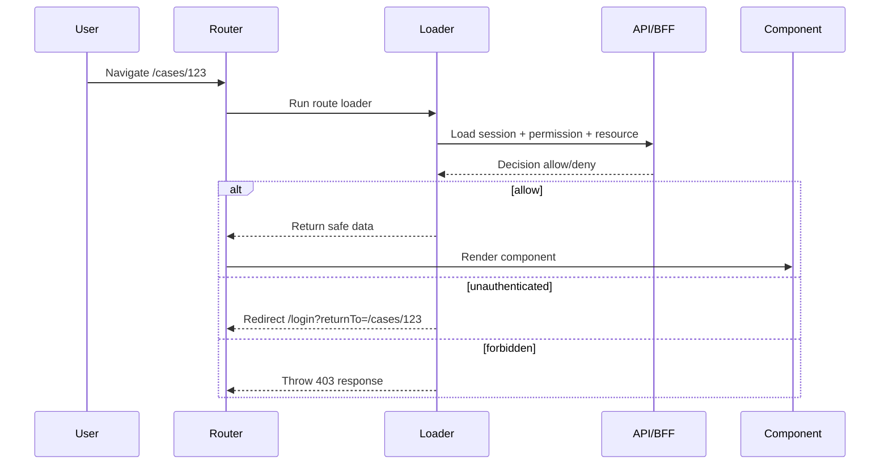
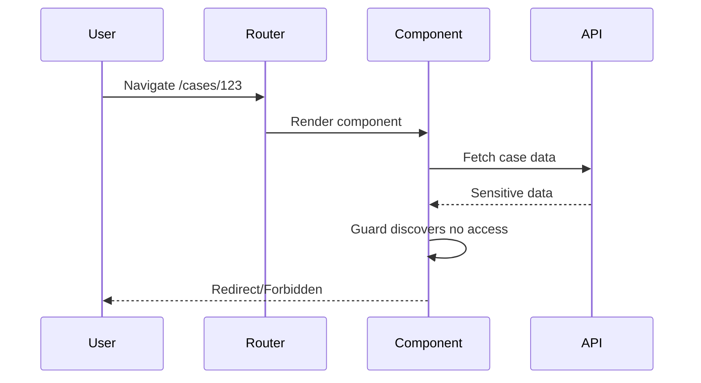

# Part 094 — Router Auth Testing

A React route can look protected and still be broken.

The sidebar hides the page, but direct URL access works. The component guard redirects after data already loaded. The loader redirects to `/login?returnTo=https://evil.example`. The action lets a forbidden mutation reach the backend. The error boundary treats `401` and `403` the same. The step-up flow submits the sensitive action before the user verifies.

Router auth testing exists to catch those failures.

Component tests prove that isolated UI components project permission correctly. Router auth tests prove that navigation, data loading, mutation, error boundaries, redirect behavior, and nested route composition behave correctly.

The target is this:

```txt
navigation or mutation request
  + session state
  + permission state
  + route metadata
  + tenant/resource context
  => correct route-level result
```

A route-level result can be:

- render page,
- redirect to login,
- redirect to safe return path,
- throw/render 401 boundary,
- throw/render 403 boundary,
- show step-up challenge,
- deny mutation,
- revalidate session,
- clear stale data.

---

## 1. Router auth is not component auth

A component guard runs during render.

A loader/action guard runs before route data or mutation result reaches the component.

That difference matters.



The dangerous alternative:



The component guard is too late. Router auth tests should enforce the first shape, not the second.

---

## 2. What to test at router level

Router auth tests should cover five boundaries.

| Boundary | Test example |
|---|---|
| Loader authentication | Anonymous user redirects before data render |
| Loader authorization | Authenticated user without permission receives forbidden boundary |
| Action authorization | Forbidden mutation does not call protected write |
| Redirect safety | `returnTo` cannot become open redirect |
| Error semantics | `401`, `403`, step-up, tenant mismatch render distinct recovery UI |

Do not stop at "does the page render".

Test navigation result, data access, mutation behavior, and denial semantics.

---

## 3. Build route test fixtures

A router auth test needs realistic route-level dependencies.

```ts
export interface TestRouteAuthContext {
  session: TestSession | null;
  permissions: TestPermissionSnapshot;
  resources: Record<string, unknown>;
  csrfToken?: string;
  tenantId?: string;
}

export interface TestSession {
  userId: string;
  tenantId: string;
  assuranceLevel?: "aal1" | "aal2" | "aal3";
  authEpoch: number;
}
```

Create a context factory.

```ts
export function createRouteTestContext(
  overrides: Partial<TestRouteAuthContext> = {},
): TestRouteAuthContext {
  return {
    session: null,
    permissions: {
      status: "ready",
      version: 1,
      decisions: {},
    },
    resources: {},
    ...overrides,
  };
}
```

Then routes can receive fake dependencies.

```ts
export function makeCaseRoute(ctx: TestRouteAuthContext) {
  return {
    path: "/cases/:caseId",
    loader: async ({ params, request }: LoaderFunctionArgs) => {
      return caseLoader({ params, request, ctx });
    },
    action: async ({ params, request }: ActionFunctionArgs) => {
      return caseAction({ params, request, ctx });
    },
    Component: CasePage,
    ErrorBoundary: CaseErrorBoundary,
  };
}
```

This is dependency injection for route modules.

Avoid global mutable auth mocks when possible. Route tests become hard to reason about when session state is hidden in module-level mocks.

---

## 4. Test with `createRoutesStub`

React Router provides `createRoutesStub` for testing route modules with loaders, actions, and components.

Minimal pattern:

```tsx
import { createRoutesStub } from "react-router";
import { render, screen } from "@testing-library/react";

it("renders case page when loader allows", async () => {
  const ctx = createRouteTestContext({
    session: {
      userId: "user_1",
      tenantId: "tenant_a",
      authEpoch: 1,
    },
    permissions: allow("case:case_123:read"),
    resources: {
      case_123: { id: "case_123", title: "Case Alpha", tenantId: "tenant_a" },
    },
  });

  const Stub = createRoutesStub([makeCaseRoute(ctx)]);

  render(<Stub initialEntries={["/cases/case_123"]} />);

  expect(await screen.findByRole("heading", { name: /case alpha/i })).toBeInTheDocument();
});
```

This test is better than rendering `<CasePage />` directly because it executes the loader contract.

---

## 5. Test anonymous redirect before data render

Anonymous access should redirect to login before the protected page renders.

Example loader:

```ts
export async function caseLoader({ params, request, ctx }: CaseLoaderInput) {
  const session = await requireSession(ctx);

  if (!session) {
    throw redirect(`/login?returnTo=${encodeURIComponent(safeReturnPath(request.url))}`);
  }

  const decision = await checkPermission(ctx, {
    subject: session.userId,
    action: "read",
    resource: { type: "case", id: params.caseId },
  });

  if (decision.effect !== "allow") {
    throw data({ reason: decision.reason }, { status: 403 });
  }

  return loadCaseProjection(ctx, params.caseId!);
}
```

Test redirect landing behavior with a login route.

```tsx
it("redirects anonymous user to login with safe return path", async () => {
  const ctx = createRouteTestContext({ session: null });

  const Stub = createRoutesStub([
    makeCaseRoute(ctx),
    {
      path: "/login",
      Component() {
        const location = useLocation();
        return <p>Login page: {location.search}</p>;
      },
    },
  ]);

  render(<Stub initialEntries={["/cases/case_123"]} />);

  expect(await screen.findByText(/login page/i)).toHaveTextContent(
    "returnTo=%2Fcases%2Fcase_123",
  );
  expect(screen.queryByText(/case alpha/i)).not.toBeInTheDocument();
});
```

The assertion should prove two things:

1. the route redirected,
2. protected content did not render.

---

## 6. Test return URL safety

Return URL bugs are route bugs.

Test the canonical function directly.

```ts
describe("safeReturnPath", () => {
  it.each([
    ["https://evil.example", "/"],
    ["//evil.example/path", "/"],
    ["/\\\\evil.example", "/"],
    ["/cases/123", "/cases/123"],
    ["/cases/123?tab=history", "/cases/123?tab=history"],
  ])("normalizes %s to %s", (input, expected) => {
    expect(safeReturnPath(input)).toBe(expected);
  });
});
```

Then test route behavior.

```tsx
it("does not preserve external returnTo when redirecting to login", async () => {
  const ctx = createRouteTestContext({ session: null });
  const Stub = createRoutesStub([
    makeCaseRoute(ctx),
    {
      path: "/login",
      Component() {
        return <span>{new URLSearchParams(useLocation().search).get("returnTo")}</span>;
      },
    },
  ]);

  render(<Stub initialEntries={["/cases/case_123?returnTo=https://evil.example"]} />);

  expect(await screen.findByText("/cases/case_123?returnTo=https://evil.example")).toBeInTheDocument();
  expect(screen.queryByText("https://evil.example")).not.toBeInTheDocument();
});
```

The preserved value is the current internal path, not a nested user-controlled return target.

---

## 7. Test authorized render path

The happy path still matters. It proves the loader returns a safe projection and the page consumes it.

```tsx
it("renders only loader-projected case data", async () => {
  const ctx = createRouteTestContext({
    session: session("user_1", "tenant_a"),
    permissions: allow("case:case_123:read"),
    resources: {
      case_123: {
        id: "case_123",
        tenantId: "tenant_a",
        title: "Case Alpha",
        internalRiskScore: 99,
      },
    },
  });

  const Stub = createRoutesStub([makeCaseRoute(ctx)]);

  render(<Stub initialEntries={["/cases/case_123"]} />);

  expect(await screen.findByText("Case Alpha")).toBeInTheDocument();
  expect(document.body).not.toHaveTextContent("99");
});
```

The route test should not only prove access. It should prove data projection.

---

## 8. Test loader-level forbidden response

Authenticated but unauthorized users should not be redirected to login. They should receive forbidden semantics.

```tsx
it("renders forbidden boundary for authenticated user without read permission", async () => {
  const ctx = createRouteTestContext({
    session: session("user_1", "tenant_a"),
    permissions: deny("case:case_123:read", "missing_permission"),
  });

  const Stub = createRoutesStub([makeCaseRoute(ctx)]);

  render(<Stub initialEntries={["/cases/case_123"]} />);

  expect(await screen.findByRole("heading", { name: /access denied/i })).toBeInTheDocument();
  expect(screen.getByText(/do not have access/i)).toBeInTheDocument();
});
```

Do not collapse `403` into login redirect.

That creates a bad UX and hides policy problems.

---

## 9. Test `401` vs `403` semantics

A strong router test suite distinguishes these states.

| State | Status/result | Recovery |
|---|---|---|
| No session | Redirect/login or 401 boundary | Sign in |
| Expired session | Redirect/login with return path | Sign in again |
| Authenticated but not allowed | 403 boundary | Request access or go back |
| Authenticated but stronger auth required | Challenge/step-up | Verify identity |
| Tenant mismatch | 403 or 404 depending disclosure policy | Switch tenant or request access |

Example boundary test:

```tsx
it("shows request access for 403 but sign-in for 401", async () => {
  const forbiddenCtx = createRouteTestContext({
    session: session("user_1", "tenant_a"),
    permissions: deny("case:case_123:read", "missing_permission"),
  });

  const Stub = createRoutesStub([makeCaseRoute(forbiddenCtx)]);

  render(<Stub initialEntries={["/cases/case_123"]} />);

  expect(await screen.findByRole("button", { name: /request access/i })).toBeInTheDocument();
  expect(screen.queryByRole("link", { name: /sign in/i })).not.toBeInTheDocument();
});
```

Authorization bugs often start as sloppy error semantics.

---

## 10. Test step-up route flow

A route may be accessible for read but require step-up for sensitive tab or action.

Example loader decision:

```ts
if (decision.effect === "challenge") {
  throw data(
    {
      type: "step_up_required",
      requiredAcr: decision.requiredAcr,
      returnTo: safeReturnPath(request.url),
    },
    { status: 403 },
  );
}
```

Test boundary.

```tsx
it("shows step-up prompt for sensitive route", async () => {
  const ctx = createRouteTestContext({
    session: { ...session("user_1", "tenant_a"), assuranceLevel: "aal1" },
    permissions: challenge("case:case_123:close", "aal2"),
  });

  const Stub = createRoutesStub([makeCloseCaseRoute(ctx)]);

  render(<Stub initialEntries={["/cases/case_123/close"]} />);

  expect(await screen.findByRole("heading", { name: /verify to continue/i })).toBeInTheDocument();
  expect(screen.getByRole("button", { name: /verify identity/i })).toBeInTheDocument();
});
```

Test that the sensitive component does not render below the challenge.

```tsx
expect(screen.queryByRole("button", { name: /confirm close/i })).not.toBeInTheDocument();
```

---

## 11. Test action-level authorization

Route actions are mutation boundaries. Test them like mutation boundaries.

Example action:

```ts
export async function closeCaseAction({ params, request, ctx }: CaseActionInput) {
  const session = await requireSession(ctx);
  if (!session) throw data({ type: "unauthenticated" }, { status: 401 });

  await requireCsrf(ctx, request);

  const decision = await checkPermission(ctx, {
    subject: session.userId,
    action: "close",
    resource: { type: "case", id: params.caseId },
    context: { method: request.method },
  });

  if (decision.effect === "challenge") {
    throw data({ type: "step_up_required" }, { status: 403 });
  }

  if (decision.effect !== "allow") {
    throw data({ type: "forbidden", reason: decision.reason }, { status: 403 });
  }

  await ctx.caseRepository.close(params.caseId!, session.userId);
  return redirect(`/cases/${params.caseId}`);
}
```

Test denied mutation does not call repository.

```tsx
it("does not close case when action authorization denies", async () => {
  const user = userEvent.setup();
  const close = vi.fn();

  const ctx = createRouteTestContext({
    session: session("user_1", "tenant_a"),
    csrfToken: "csrf_test",
    permissions: deny("case:case_123:close", "missing_permission"),
    caseRepository: { close },
  } as any);

  const Stub = createRoutesStub([makeCloseCaseRoute(ctx)]);

  render(<Stub initialEntries={["/cases/case_123/close"]} />);

  await user.click(await screen.findByRole("button", { name: /confirm close/i }));

  expect(close).not.toHaveBeenCalled();
  expect(await screen.findByText(/you cannot close this case/i)).toBeInTheDocument();
});
```

A route action test should prove that protected writes are not called when authorization denies.

---

## 12. Test CSRF handling in actions

For cookie-based auth, action tests should include CSRF behavior.

```tsx
it("rejects mutation when CSRF token is missing", async () => {
  const user = userEvent.setup();
  const close = vi.fn();

  const ctx = createRouteTestContext({
    session: session("user_1", "tenant_a"),
    csrfToken: undefined,
    permissions: allow("case:case_123:close"),
    caseRepository: { close },
  } as any);

  const Stub = createRoutesStub([makeCloseCaseRoute(ctx)]);

  render(<Stub initialEntries={["/cases/case_123/close"]} />);

  await user.click(await screen.findByRole("button", { name: /confirm close/i }));

  expect(close).not.toHaveBeenCalled();
  expect(await screen.findByText(/request could not be verified/i)).toBeInTheDocument();
});
```

CSRF failure is not a permission denial. Treat it as request integrity failure.

---

## 13. Test form validation order carefully

A route action often performs:

1. authentication,
2. CSRF/request integrity,
3. input validation,
4. authorization,
5. mutation.

The exact order depends on the system, but avoid leaking sensitive resource details before auth.

Test unauthenticated mutation.

```tsx
it("does not reveal validation details to anonymous mutation", async () => {
  const ctx = createRouteTestContext({ session: null });
  const Stub = createRoutesStub([makeCloseCaseRoute(ctx)]);

  render(<Stub initialEntries={["/cases/case_123/close"]} />);

  await userEvent.click(await screen.findByRole("button", { name: /confirm close/i }));

  expect(await screen.findByText(/sign in/i)).toBeInTheDocument();
  expect(screen.queryByText(/case is already closed/i)).not.toBeInTheDocument();
});
```

Do not give anonymous users business validation hints about resources.

---

## 14. Test route metadata permissions

If your app uses route metadata such as `handle.requiredPermission`, test it.

```ts
export const caseRoute = {
  path: "/cases/:caseId",
  handle: {
    auth: {
      required: true,
      permission: {
        action: "read",
        resourceType: "case",
        resourceParam: "caseId",
      },
    },
  },
  loader: authLoader(caseLoader),
  Component: CasePage,
};
```

Test metadata extraction.

```ts
it("derives permission request from route metadata", () => {
  expect(deriveRoutePermission(caseRoute.handle.auth.permission, { caseId: "case_123" })).toEqual({
    action: "read",
    resource: { type: "case", id: "case_123" },
  });
});
```

Test loader uses metadata.

```tsx
it("denies route when metadata-derived permission denies", async () => {
  const ctx = createRouteTestContext({
    session: session("user_1", "tenant_a"),
    permissions: deny("case:case_123:read", "missing_permission"),
  });

  const Stub = createRoutesStub([makeCaseRoute(ctx)]);
  render(<Stub initialEntries={["/cases/case_123"]} />);

  expect(await screen.findByRole("heading", { name: /access denied/i })).toBeInTheDocument();
});
```

Metadata tests prevent drift between navigation, loaders, and components.

---

## 15. Test nested route auth

Nested routes create inherited boundaries.

Example:

```txt
/cases/:caseId                requires case:read
/cases/:caseId/history        requires case:history:read
/cases/:caseId/admin          requires case:admin
```

Test that child route cannot bypass parent route.

```tsx
it("child route does not render when parent resource read is denied", async () => {
  const ctx = createRouteTestContext({
    session: session("user_1", "tenant_a"),
    permissions: {
      ...deny("case:case_123:read", "missing_permission"),
      ...allow("case:case_123:history:read"),
    },
  });

  const Stub = createRoutesStub([makeCaseNestedRoutes(ctx)]);

  render(<Stub initialEntries={["/cases/case_123/history"]} />);

  expect(await screen.findByRole("heading", { name: /access denied/i })).toBeInTheDocument();
  expect(screen.queryByText(/case history/i)).not.toBeInTheDocument();
});
```

Child permission does not imply parent resource access.

---

## 16. Test tenant mismatch

Tenant mismatch can be more serious than missing permission.

```tsx
it("denies tenant mismatch before rendering resource", async () => {
  const ctx = createRouteTestContext({
    session: session("user_1", "tenant_b"),
    permissions: deny("case:case_123:read", "tenant_mismatch"),
    resources: {
      case_123: {
        id: "case_123",
        tenantId: "tenant_a",
        title: "Tenant A Case",
      },
    },
  });

  const Stub = createRoutesStub([makeCaseRoute(ctx)]);

  render(<Stub initialEntries={["/cases/case_123"]} />);

  expect(await screen.findByRole("heading", { name: /not found|access denied/i })).toBeInTheDocument();
  expect(document.body).not.toHaveTextContent("Tenant A Case");
});
```

Whether tenant mismatch returns `403` or `404` depends on disclosure policy. The invariant is the same: no protected resource data should render.

---

## 17. Test redirect loop prevention

Login flows can create loops.

Common causes:

- login route itself requires auth,
- callback route requires auth before processing callback,
- expired session redirects repeatedly,
- step-up route redirects back to itself without state change,
- return path points to forbidden route.

Test loop guard as a pure function.

```ts
it("does not redirect login route to itself", () => {
  expect(shouldRedirectToLogin({ pathname: "/login", authenticated: false })).toBe(false);
});

it("does not redirect callback route before callback handling", () => {
  expect(shouldRedirectToLogin({ pathname: "/auth/callback", authenticated: false })).toBe(false);
});
```

Test router behavior.

```tsx
it("renders login page instead of redirecting login route again", async () => {
  const ctx = createRouteTestContext({ session: null });
  const Stub = createRoutesStub(makeAppRoutes(ctx));

  render(<Stub initialEntries={["/login"]} />);

  expect(await screen.findByRole("heading", { name: /sign in/i })).toBeInTheDocument();
});
```

Redirect loops are product outages disguised as auth bugs.

---

## 18. Test auth callback exclusion

OAuth/OIDC callback routes should be handled by callback logic, not generic protected-route middleware.

```tsx
it("allows auth callback route to run callback handler before session exists", async () => {
  const exchangeCode = vi.fn().mockResolvedValue({ sessionId: "session_1" });

  const ctx = createRouteTestContext({
    session: null,
    exchangeCode,
  } as any);

  const Stub = createRoutesStub(makeAuthCallbackRoutes(ctx));

  render(<Stub initialEntries={["/auth/callback?code=abc&state=state_1"]} />);

  expect(await screen.findByText(/signed in/i)).toBeInTheDocument();
  expect(exchangeCode).toHaveBeenCalled();
});
```

If your generic auth middleware redirects `/auth/callback` to `/login`, login will never complete.

---

## 19. Test error boundaries with route errors

React Router route error boundaries catch errors from loaders, actions, components, and other route module APIs.

Test the boundary, not only the thrown response.

```tsx
it("renders case-specific forbidden boundary", async () => {
  const ctx = createRouteTestContext({
    session: session("user_1", "tenant_a"),
    permissions: deny("case:case_123:read", "missing_permission"),
  });

  const Stub = createRoutesStub([makeCaseRoute(ctx)]);

  render(<Stub initialEntries={["/cases/case_123"]} />);

  expect(await screen.findByRole("heading", { name: /access denied/i })).toBeInTheDocument();
  expect(screen.getByRole("link", { name: /back to cases/i })).toBeInTheDocument();
});
```

Test generic unexpected error separately.

```tsx
it("does not reveal stack trace for unexpected loader error", async () => {
  const ctx = createRouteTestContext({
    session: session("user_1", "tenant_a"),
    permissions: allow("case:case_123:read"),
    resources: {},
  });

  vi.spyOn(ctx as any, "loadCase").mockRejectedValue(new Error("db password secret"));

  const Stub = createRoutesStub([makeCaseRoute(ctx)]);
  render(<Stub initialEntries={["/cases/case_123"]} />);

  expect(await screen.findByText(/something went wrong/i)).toBeInTheDocument();
  expect(document.body).not.toHaveTextContent("db password secret");
});
```

Route auth error boundaries should be helpful without leaking internals.

---

## 20. Test revalidation after action

React Router actions can cause loader data to revalidate. Auth-sensitive routes must not keep stale permission state after mutation.

Example: after approving a case, the case state changes and close action becomes unavailable.

```tsx
it("revalidates allowed actions after mutation", async () => {
  const user = userEvent.setup();
  const ctx = createMutableCaseContext({
    initialCase: { id: "case_123", state: "pending" },
    initialPermissions: allowMany([
      "case:case_123:approve",
      "case:case_123:close",
    ]),
  });

  const Stub = createRoutesStub([makeCaseRoute(ctx)]);

  render(<Stub initialEntries={["/cases/case_123"]} />);

  expect(await screen.findByRole("button", { name: /approve/i })).toBeInTheDocument();
  expect(screen.getByRole("button", { name: /close/i })).toBeInTheDocument();

  await user.click(screen.getByRole("button", { name: /approve/i }));

  await waitFor(() => {
    expect(screen.queryByRole("button", { name: /approve/i })).not.toBeInTheDocument();
  });
});
```

Do not let action success keep old allowed actions on screen.

---

## 21. Test logout navigation cleanup

Logout should clear protected routes and redirect safely.

```tsx
it("clears protected route after logout action", async () => {
  const user = userEvent.setup();
  const ctx = createRouteTestContext({
    session: session("user_1", "tenant_a"),
    permissions: allow("case:case_123:read"),
    resources: {
      case_123: { id: "case_123", title: "Sensitive Case", tenantId: "tenant_a" },
    },
  });

  const Stub = createRoutesStub(makeAppRoutes(ctx));

  render(<Stub initialEntries={["/cases/case_123"]} />);

  expect(await screen.findByText("Sensitive Case")).toBeInTheDocument();

  await user.click(screen.getByRole("button", { name: /logout/i }));

  expect(await screen.findByRole("heading", { name: /signed out/i })).toBeInTheDocument();
  expect(screen.queryByText("Sensitive Case")).not.toBeInTheDocument();
});
```

This catches layout/router caches that keep protected data after logout.

---

## 22. Test pending UI does not flash protected route

A navigation pending state should not display the next page's protected content before loader authorization completes.

```tsx
it("shows neutral pending state during protected navigation", async () => {
  const permission = createDeferred<PermissionDecision>();

  const ctx = createRouteTestContext({
    session: session("user_1", "tenant_a"),
    checkPermission: vi.fn(() => permission.promise),
  } as any);

  const Stub = createRoutesStub(makeAppRoutes(ctx));

  render(<Stub initialEntries={["/dashboard"]} />);

  await userEvent.click(await screen.findByRole("link", { name: /case 123/i }));

  expect(screen.getByText(/loading/i)).toBeInTheDocument();
  expect(screen.queryByText(/sensitive case title/i)).not.toBeInTheDocument();

  permission.resolve({ effect: "deny", reason: "missing_permission" });

  expect(await screen.findByRole("heading", { name: /access denied/i })).toBeInTheDocument();
});
```

Pending UI must be product-safe and security-safe.

---

## 23. Test auth epoch and stale response suppression

When auth changes during navigation, old loader responses must not resurrect old UI.

```tsx
it("ignores stale loader result after logout", async () => {
  const caseData = createDeferred<any>();
  const ctx = createRouteTestContext({
    session: session("user_1", "tenant_a", { authEpoch: 1 }),
    permissions: allow("case:case_123:read"),
    loadCase: vi.fn(() => caseData.promise),
  } as any);

  const Stub = createRoutesStub(makeAppRoutes(ctx));

  render(<Stub initialEntries={["/cases/case_123"]} />);

  act(() => {
    ctx.session = null;
    ctx.authEpoch = 2;
  });

  caseData.resolve({ id: "case_123", title: "Stale Case" });

  await waitFor(() => {
    expect(screen.queryByText("Stale Case")).not.toBeInTheDocument();
  });
});
```

The implementation shape differs by router/data layer, but the invariant is stable: stale authenticated results must not render after logout or tenant switch.

---

## 24. Test not-found vs forbidden disclosure policy

Some systems return `404` for inaccessible resources to avoid confirming existence. Others return `403` with request-access flow. Either can be valid, but it must be deliberate.

Test the policy.

```tsx
it("uses not found boundary for inaccessible case under concealment policy", async () => {
  const ctx = createRouteTestContext({
    session: session("user_1", "tenant_a"),
    permissions: deny("case:case_999:read", "missing_permission"),
    disclosurePolicy: "conceal_existence",
  } as any);

  const Stub = createRoutesStub([makeCaseRoute(ctx)]);

  render(<Stub initialEntries={["/cases/case_999"]} />);

  expect(await screen.findByRole("heading", { name: /not found/i })).toBeInTheDocument();
  expect(screen.queryByRole("button", { name: /request access/i })).not.toBeInTheDocument();
});
```

The wrong test is no test. The second wrong test is assuming `403` is always better than `404`.

---

## 25. Route auth test matrix

Use this matrix for important routes.

| Scenario | Expected result |
|---|---|
| Anonymous visits protected route | Redirect/login or 401 boundary |
| Anonymous visits login route | Login renders; no redirect loop |
| Anonymous visits auth callback | Callback handler runs; no generic auth redirect |
| Authenticated allowed user | Route renders safe loader projection |
| Authenticated denied user | 403/request-access or disclosure-policy 404 |
| Tenant mismatch | No resource data rendered; correct boundary |
| Step-up required | Step-up boundary; sensitive component hidden |
| Expired session | Reauth path with safe return URL |
| External returnTo input | Normalized/rejected |
| Action allowed | Mutation called once; redirect/revalidate |
| Action denied | Mutation not called; denial shown |
| Missing CSRF | Mutation not called; request integrity error |
| Parent route denied | Child route does not render |
| Metadata mismatch | Test fails if route metadata and loader policy drift |
| Logout during navigation | Stale loader response suppressed |
| Action changes permission/resource state | Loaders revalidate; old actions removed |
| Unexpected loader error | Safe generic error; no stack/secrets leaked |

---

## 26. Anti-pattern catalog

### Anti-pattern 1: testing only components, not loaders

```tsx
render(<ProtectedCasePage />);
```

This can pass while direct URL access is broken.

### Anti-pattern 2: component guard as route security

```tsx
<Route element={<RequireAuth><CasePage /></RequireAuth>} />
```

Useful for UI, insufficient for data loading security.

### Anti-pattern 3: redirecting all auth errors to login

```ts
if (error.status === 401 || error.status === 403) redirect("/login");
```

This hides forbidden errors and breaks access request flows.

### Anti-pattern 4: no malicious return URL tests

```ts
returnTo = new URLSearchParams(location.search).get("returnTo")
```

Without tests, this becomes open redirect risk.

### Anti-pattern 5: action test asserts error but not side effect

```ts
expect(await screen.findByText(/forbidden/i)).toBeInTheDocument();
```

Also assert the repository/API mutation was not called.

### Anti-pattern 6: route metadata not tested

Sidebar says route requires `case:read`; loader checks `case:update`. That drift is avoidable.

---

## 27. Review checklist

Before approving router auth tests, check:

- [ ] Protected route anonymous access is tested.
- [ ] Login/callback routes are excluded from generic auth redirect.
- [ ] Authorized loader path returns safe data projection.
- [ ] Forbidden loader path renders correct boundary.
- [ ] `401`, `403`, step-up, tenant mismatch, and unexpected error are distinct.
- [ ] Return URL normalization has malicious test cases.
- [ ] Route action denial proves mutation was not called.
- [ ] CSRF/request integrity failure is tested for cookie-auth mutations.
- [ ] Nested route parent/child permission interaction is tested.
- [ ] Route metadata and loader/action policy cannot drift silently.
- [ ] Logout/tenant switch clears protected route UI.
- [ ] Stale loader responses are suppressed after auth epoch change.
- [ ] Revalidation after mutation updates allowed actions.
- [ ] Error boundaries do not leak stack traces, secrets, or internal policy traces.
- [ ] Tests include more denial/edge cases than happy paths.

---

## 28. Closing mental model

Router auth tests are not about whether React Router works.

They are about whether your app uses the router as an auth boundary correctly.

The question is:

```txt
Before a route renders or mutates, has the app made the correct auth decision using the correct context?
```

If the answer is not executable in tests, the system is relying on hope.

For production-grade React auth, hope is not an architecture.

---

## 29. References

- React Router Testing — `createRoutesStub` for route modules with loaders/actions/components: https://reactrouter.com/start/framework/testing
- React Router `createRoutesStub` API: https://reactrouter.com/api/utils/createRoutesStub
- React Router Data Loading guide: https://reactrouter.com/start/framework/data-loading
- React Router Actions guide: https://reactrouter.com/start/framework/actions
- React Router Error Boundaries guide: https://reactrouter.com/how-to/error-boundary
- React Router Route Module guide: https://reactrouter.com/start/framework/route-module
- Testing Library Queries: https://testing-library.com/docs/queries/about/
- Testing Library `user-event`: https://testing-library.com/docs/user-event/intro/
- OWASP Authorization Cheat Sheet: https://cheatsheetseries.owasp.org/cheatsheets/Authorization_Cheat_Sheet.html
- OWASP Unvalidated Redirects and Forwards Cheat Sheet: https://cheatsheetseries.owasp.org/cheatsheets/Unvalidated_Redirects_and_Forwards_Cheat_Sheet.html
- OWASP CSRF Prevention Cheat Sheet: https://cheatsheetseries.owasp.org/cheatsheets/Cross-Site_Request_Forgery_Prevention_Cheat_Sheet.html
