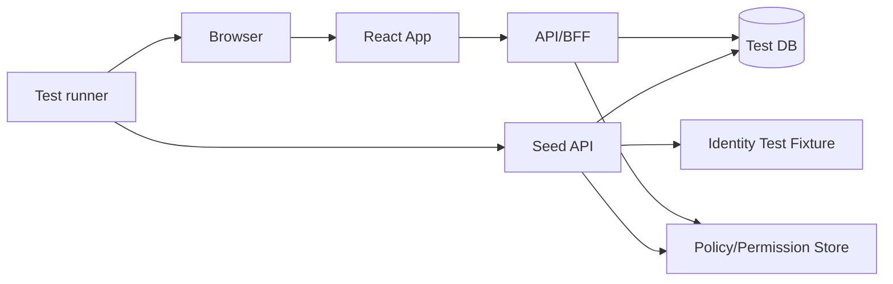
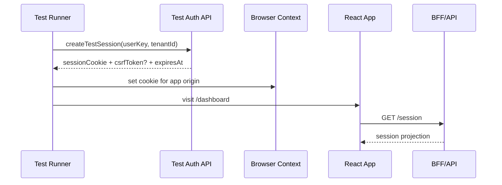
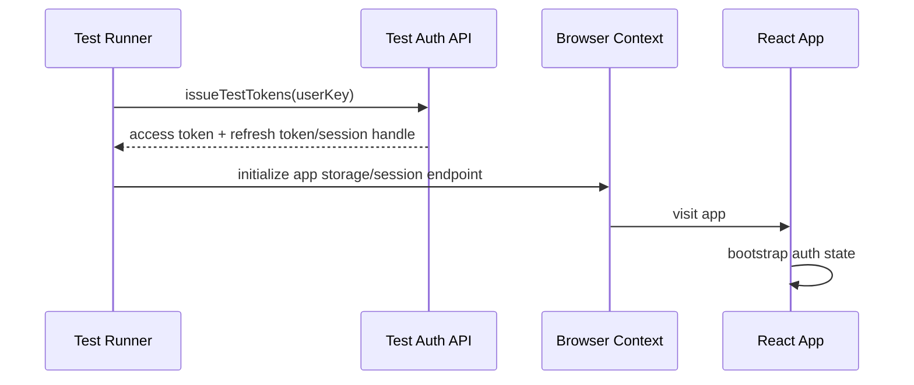

# Part 095 — E2E Auth Testing

E2E auth testing is not “test that login works”.

That is only one scenario.

A serious React auth test suite proves that the whole system behaves correctly when a real browser, router, storage, cookies, redirects, API calls, cache, permissions, tenant context, and session lifecycle interact.

The dangerous bugs usually appear between layers:

```txt
browser storage + router loader + API cache + expired session + tenant switch
```

or:

```txt
valid login + stale permission cache + optimistic mutation + server-side 403
```

Unit tests and component tests give you local confidence. Router tests give you transition confidence. E2E tests give you **integrated behavioral confidence**.

But E2E auth tests can become slow, flaky, and misleading if you force every scenario through the full login UI. The goal is not to imitate a human as much as possible. The goal is to verify the important security and product invariants at the correct system boundary.

---

## 1. What E2E auth tests should prove

An auth E2E suite should prove these invariants:

1. An unauthenticated user cannot access authenticated routes or data.
2. An authenticated user can access only the routes, actions, fields, tenants, and objects they are allowed to access.
3. A session can be restored safely after browser reload.
4. A session can expire, refresh, revoke, and logout without stale UI or leaked data.
5. Permission changes are reflected without relying on stale frontend state.
6. Tenant switch clears tenant-scoped data and permissions.
7. Sensitive operations require fresh or stronger authentication when needed.
8. Unauthorized API responses are handled safely and understandably.
9. Browser caches, app caches, and query caches do not keep protected data after logout.
10. Redirects do not create open redirect, redirect loop, or intent-loss bugs.

A weak suite checks this:

```txt
user can login
user can click dashboard
```

A strong suite checks this:

```txt
for each seeded identity + tenant + permission snapshot:
  route access is correct
  visible actions are correct
  forbidden direct URL is denied
  forbidden API mutation is denied
  logout clears observable sensitive state
  session expiry recovers or denies safely
```

---

## 2. E2E auth testing layers

Do not push every auth behavior into the same type of E2E test.

```mermaid
flowchart TD
  A[Unit tests] --> B[Component tests]
  B --> C[Router tests]
  C --> D[E2E smoke tests]
  D --> E[E2E scenario tests]
  E --> F[Security abuse tests]

  A -.-> A1[can() matrix]
  B -.-> B1[button/menu/form projection]
  C -.-> C1[loader/action redirect/deny]
  D -.-> D1[happy path auth lifecycle]
  E -.-> E1[tenant/session/cache/expiry]
  F -.-> F1[direct URL/API/open redirect/IDOR]
```

Use E2E for what only E2E can prove:

- cookie/browser storage behavior,
- redirect/callback lifecycle,
- cross-page route behavior,
- real network integration,
- query cache cleanup,
- multi-tab logout,
- actual browser back/forward cache behavior,
- visual exposure of sensitive UI,
- realistic API `401/403/409/429` handling,
- auth provider integration boundary.

Do not use E2E to exhaustively test every `can()` combination. That belongs in unit and contract tests.

---

## 3. The core test strategy

For a serious React app, use three login strategies:

| Strategy | Purpose | Use for |
|---|---|---|
| UI login | Prove login UI and provider integration still work | One or few smoke tests |
| Programmatic login | Fast setup for authenticated scenarios | Most E2E tests |
| Storage/session reuse | Avoid repeated login and reduce flake | Stable non-mutating scenarios |

The trap is thinking the most realistic strategy is always the best.

Full UI login through an IdP can fail because of CAPTCHA, MFA, rate limiting, provider slowness, network flake, third-party cookie rules, or temporary IdP outages. If every test depends on that path, the suite becomes a test of your test environment rather than your application.

A good split:

```txt
5% full login smoke
75% programmatic auth setup
15% session lifecycle scenarios
5% abuse/security scenarios
```

The exact ratio depends on risk, but the principle stays the same: **test the login protocol once, then test app authorization many times**.

---

## 4. Seed users, do not improvise users

Do not create random users during every test unless the product really requires it.

Instead, create a deterministic test identity matrix.

```ts
export type TestUserKey =
  | 'anonymous'
  | 'basicUser'
  | 'caseViewer'
  | 'caseEditor'
  | 'caseApprover'
  | 'tenantAdmin'
  | 'supportImpersonator'
  | 'suspendedUser'
  | 'mfaRequiredUser'
  | 'expiredMembershipUser';

export const testUsers = {
  basicUser: {
    email: 'basic.user.e2e@example.test',
    tenantId: 'tenant-alpha',
    permissions: ['dashboard.read'],
  },
  caseApprover: {
    email: 'case.approver.e2e@example.test',
    tenantId: 'tenant-alpha',
    permissions: [
      'case.read',
      'case.comment',
      'case.approve',
    ],
  },
} as const;
```

The user matrix should be explicit.

Do not hide test identity setup in a black-box fixture where nobody can see why a user can perform an action.

A good E2E identity fixture answers:

- Which tenant is the user in?
- Which roles does the user have?
- Which resource-specific grants does the user have?
- Which memberships are expired/suspended/pending?
- Does the user require MFA/step-up?
- Does the user have object-level ownership?
- Is the identity intended for read-only tests or mutation tests?

---

## 5. Data seeding model

Auth E2E tests need deterministic data.

Do not depend on production-like random data unless you are doing exploratory testing.

Recommended model:



A seed API is not a product API. It is a test-only control plane.

It should be:

- available only in test environments,
- authenticated with CI/test runner credentials,
- deterministic,
- idempotent,
- able to reset state by namespace/test run id,
- able to create users, tenants, memberships, permissions, resources, and workflow states,
- able to create realistic denial cases, not only happy-path data.

Example seed contract:

```ts
type SeedAuthScenarioRequest = {
  scenarioId: string;
  users: Array<{
    key: string;
    tenantId: string;
    status: 'active' | 'suspended' | 'pending_mfa' | 'expired_membership';
    roles?: string[];
    grants?: Array<{
      resourceType: 'case' | 'document' | 'task';
      resourceId: string;
      actions: string[];
    }>;
  }>;
  resources: Array<{
    type: 'case' | 'document' | 'task';
    id: string;
    tenantId: string;
    ownerKey?: string;
    workflowState?: string;
  }>;
};
```

For regulated or workflow-heavy products, seed resource state explicitly:

```ts
await seedScenario({
  scenarioId: test.info().title,
  users: [
    {
      key: 'caseApprover',
      tenantId: 'tenant-alpha',
      roles: ['case_approver'],
    },
  ],
  resources: [
    {
      type: 'case',
      id: 'case-awaiting-approval',
      tenantId: 'tenant-alpha',
      workflowState: 'AWAITING_APPROVAL',
      ownerKey: 'caseEditor',
    },
  ],
});
```

The test then reads like product behavior, not database trivia.

---

## 6. Programmatic login

A programmatic login should produce the same app-visible session shape as real login.

For cookie/BFF session:



For bearer-token SPA:



Do not fabricate frontend state in a way the real app could never create.

Bad:

```ts
await page.evaluate(() => {
  window.localStorage.setItem('user', JSON.stringify({ role: 'admin' }));
});
```

Better:

```ts
const session = await testAuth.createSession({
  userKey: 'tenantAdmin',
  tenantId: 'tenant-alpha',
});

await context.addCookies([
  {
    name: '__Host-app_session',
    value: session.cookieValue,
    domain: 'localhost',
    path: '/',
    httpOnly: true,
    secure: true,
    sameSite: 'Lax',
  },
]);
```

Best for BFF architecture:

```ts
await loginAs(page, 'tenantAdmin', {
  tenantId: 'tenant-alpha',
  via: 'test-session-api',
});

await page.goto('/dashboard');
await expect(page.getByRole('heading', { name: 'Dashboard' })).toBeVisible();
```

The helper name should describe the user intent, while its implementation uses a safe test-only session boundary.

---

## 7. Playwright auth fixture pattern

Playwright supports saving and reusing authenticated browser state. That is useful, but should be applied carefully.

A common pattern:

```ts
// tests/auth.setup.ts
import { test as setup, expect } from '@playwright/test';
import path from 'node:path';

const authFile = path.join(__dirname, '../.auth/case-approver.json');

setup('authenticate as case approver', async ({ page, request }) => {
  await request.post('/test-api/seed/auth-scenario', {
    data: { scenarioId: 'case-approver-state' },
  });

  const session = await request.post('/test-api/auth/session', {
    data: {
      userKey: 'caseApprover',
      tenantId: 'tenant-alpha',
    },
  });

  const { cookie } = await session.json();

  await page.context().addCookies([cookie]);
  await page.goto('/cases');
  await expect(page.getByRole('heading', { name: 'Cases' })).toBeVisible();

  await page.context().storageState({ path: authFile });
});
```

Then:

```ts
// playwright.config.ts
export default defineConfig({
  projects: [
    {
      name: 'setup',
      testMatch: /.*\.setup\.ts/,
    },
    {
      name: 'chromium-authenticated',
      use: {
        storageState: '.auth/case-approver.json',
      },
      dependencies: ['setup'],
    },
  ],
});
```

Important constraints:

- Do not reuse one account for tests that mutate shared server-side state.
- Do not reuse storage state across tenants unless the test explicitly models tenant switch.
- Do not commit storage state files; they contain cookies/session material.
- Refresh/revoke/expiry tests should not use a static storage state unless they reset it per test.
- Use separate accounts or isolated scenarios for parallel tests.

Storage-state reuse is a performance optimization, not an authorization model.

---

## 8. Cypress session pattern

Cypress provides `cy.session()` to cache and restore cookies, localStorage, and sessionStorage.

A safe pattern:

```ts
Cypress.Commands.add('loginAs', (userKey: string, tenantId: string) => {
  cy.session([userKey, tenantId], () => {
    cy.request('POST', '/test-api/auth/session', {
      userKey,
      tenantId,
    }).then(({ body }) => {
      cy.setCookie('__Host-app_session', body.cookieValue, {
        httpOnly: true,
        secure: true,
        sameSite: 'lax',
      });
    });

    cy.visit('/session-check');
    cy.findByText(/signed in/i).should('exist');
  }, {
    validate() {
      cy.request('/api/session').its('status').should('eq', 200);
    },
  });
});
```

Use a validation hook.

Without validation, the test can reuse stale or invalid session state and produce confusing failures later.

Bad:

```ts
cy.session('admin', () => {
  cy.visit('/login');
  cy.get('input[name=email]').type('admin@example.test');
  cy.get('input[name=password]').type('password');
  cy.get('button[type=submit]').click();
});
```

This couples every scenario to UI login and makes auth setup slow and fragile.

Better:

```ts
cy.loginAs('caseApprover', 'tenant-alpha');
cy.visit('/cases/case-awaiting-approval');
cy.findByRole('button', { name: /approve/i }).should('be.enabled');
```

The product behavior is still tested through the browser, while setup uses a deterministic control plane.

---

## 9. Test only a few full login flows

Full login UI is still important.

But it should be isolated.

Example full login smoke cases:

1. Password login succeeds for active user.
2. Invalid password does not reveal whether account exists.
3. MFA-required user is routed to MFA step.
4. Suspended user receives safe denial.
5. Login return path restores safe internal route.
6. OAuth/OIDC callback handles provider error safely.
7. Logout removes app session and returns to public state.

Do not run all authorization scenarios through full login.

Authorization scenarios should start from deterministic session setup.

---

## 10. Route access E2E matrix

A useful route access matrix looks like this:

```ts
type RouteCase = {
  user: TestUserKey;
  path: string;
  expected: 'render' | 'login' | 'forbidden' | 'step_up' | 'not_found';
  visibleText?: string | RegExp;
};

const routeCases: RouteCase[] = [
  {
    user: 'anonymous',
    path: '/cases',
    expected: 'login',
  },
  {
    user: 'caseViewer',
    path: '/cases/case-1',
    expected: 'render',
    visibleText: /case details/i,
  },
  {
    user: 'basicUser',
    path: '/cases/case-1',
    expected: 'forbidden',
  },
  {
    user: 'caseApprover',
    path: '/cases/case-awaiting-approval/approve',
    expected: 'step_up',
  },
];
```

Execution:

```ts
for (const c of routeCases) {
  test(`${c.user} -> ${c.path} = ${c.expected}`, async ({ page }) => {
    if (c.user !== 'anonymous') {
      await loginAs(page, c.user, { tenantId: 'tenant-alpha' });
    }

    await page.goto(c.path);

    switch (c.expected) {
      case 'render':
        await expect(page.getByText(c.visibleText!)).toBeVisible();
        break;
      case 'login':
        await expect(page).toHaveURL(/\/login/);
        break;
      case 'forbidden':
        await expect(page.getByRole('heading', { name: /access denied/i })).toBeVisible();
        break;
      case 'step_up':
        await expect(page.getByRole('heading', { name: /verify your identity/i })).toBeVisible();
        break;
      case 'not_found':
        await expect(page.getByRole('heading', { name: /not found/i })).toBeVisible();
        break;
    }
  });
}
```

This matrix should not replace unit permission tests. It verifies that route composition, session setup, loaders, UI, and error boundaries agree.

---

## 11. Action authorization E2E tests

A route can block direct navigation and still allow forbidden mutation.

Test both.

Example:

```ts
test('viewer can see case but cannot approve it', async ({ page }) => {
  await loginAs(page, 'caseViewer', { tenantId: 'tenant-alpha' });

  await page.goto('/cases/case-awaiting-approval');

  await expect(page.getByRole('heading', { name: /case details/i })).toBeVisible();
  await expect(page.getByRole('button', { name: /approve/i })).not.toBeVisible();

  const response = await page.request.post('/api/cases/case-awaiting-approval/approve', {
    data: { comment: 'Attempt direct mutation' },
  });

  expect(response.status()).toBe(403);
});
```

This is important.

UI hidden action tests prove exposure control. Direct API tests prove server-side enforcement.

The combination catches the classic mistake:

```txt
button hidden, endpoint open
```

---

## 12. Session expiry tests

Session expiry must be tested as an end-to-end behavior.

Important scenarios:

| Scenario | Expected behavior |
|---|---|
| Access token expired, refresh succeeds | User continues without data loss |
| Access token expired, refresh fails | User is routed to login/session expired UI |
| Refresh token reused/revoked | Session ends across tabs |
| Session expires during form edit | User can recover intent safely or must re-submit after reauth |
| Session expires during mutation | Mutation is not silently duplicated |
| Session expires while route loader runs | No protected data flash |

Example test:

```ts
test('expired session redirects to login without showing protected case data', async ({ page }) => {
  await loginAs(page, 'caseViewer', {
    tenantId: 'tenant-alpha',
    sessionTtlSeconds: 1,
  });

  await page.goto('/cases/case-1');
  await expect(page.getByText(/case details/i)).toBeVisible();

  await page.waitForTimeout(1500);
  await page.goto('/cases/case-2');

  await expect(page).toHaveURL(/\/login/);
  await expect(page.getByText(/case details/i)).not.toBeVisible();
});
```

Do not depend on real long TTLs.

Use test-only session controls:

```ts
await testAuth.expireSession({ userKey: 'caseViewer' });
```

Then trigger navigation or fetch.

---

## 13. Refresh-token race tests

The most common refresh bug appears when many requests fail with `401` at once.

Expected behavior:

```txt
many failed requests -> one refresh attempt -> replay safe requests -> no retry storm
```

Test it:

```ts
test('parallel 401 responses trigger a single refresh', async ({ page }) => {
  await loginAs(page, 'caseViewer', { tenantId: 'tenant-alpha' });
  await testAuth.expireAccessTokenOnly('caseViewer');

  let refreshCount = 0;

  await page.route('**/api/session/refresh', async route => {
    refreshCount += 1;
    await route.continue();
  });

  await page.goto('/dashboard-heavy');

  await expect(page.getByRole('heading', { name: /dashboard/i })).toBeVisible();
  expect(refreshCount).toBe(1);
});
```

Also test refresh failure:

```ts
test('refresh failure clears authenticated UI', async ({ page }) => {
  await loginAs(page, 'caseViewer', { tenantId: 'tenant-alpha' });
  await testAuth.revokeRefreshToken('caseViewer');

  await page.goto('/dashboard-heavy');

  await expect(page).toHaveURL(/\/login|\/session-expired/);
  await expect(page.getByText(/confidential dashboard/i)).not.toBeVisible();
});
```

A good E2E suite catches retry storms before production users do.

---

## 14. Logout tests

Logout is a distributed cleanup problem.

Test at least:

1. UI returns to anonymous state.
2. Protected route redirects after logout.
3. Query cache is cleared.
4. Back button does not reveal protected data.
5. Another tab receives logout event.
6. In-flight requests are ignored or cancelled.
7. Session cookie/token is invalid server-side.
8. Service worker/persisted cache does not serve old data.

Example:

```ts
test('logout clears protected data and prevents back-button exposure', async ({ page }) => {
  await loginAs(page, 'caseViewer', { tenantId: 'tenant-alpha' });

  await page.goto('/cases/case-1');
  await expect(page.getByText(/confidential case summary/i)).toBeVisible();

  await page.getByRole('button', { name: /logout/i }).click();
  await expect(page).toHaveURL(/\/login|\/$/);

  await page.goBack();

  await expect(page.getByText(/confidential case summary/i)).not.toBeVisible();
  await expect(page).toHaveURL(/\/login/);
});
```

For multi-tab logout:

```ts
test('logout propagates across tabs', async ({ browser }) => {
  const context = await browser.newContext();
  const pageA = await context.newPage();
  const pageB = await context.newPage();

  await loginAs(pageA, 'caseViewer', { tenantId: 'tenant-alpha' });

  await pageA.goto('/cases');
  await pageB.goto('/cases/case-1');

  await expect(pageB.getByText(/case details/i)).toBeVisible();

  await pageA.getByRole('button', { name: /logout/i }).click();

  await expect(pageB.getByRole('heading', { name: /signed out|login/i })).toBeVisible();
});
```

---

## 15. Tenant switch tests

Multi-tenant bugs are authorization bugs.

When a user switches tenant:

- session projection changes,
- permission projection changes,
- query keys change,
- cached resource data must be cleared or scoped,
- navigation changes,
- open forms may need reset,
- realtime channels must resubscribe,
- pending requests from old tenant must not update UI.

Test:

```ts
test('tenant switch clears old tenant data and permissions', async ({ page }) => {
  await loginAs(page, 'multiTenantUser', { tenantId: 'tenant-alpha' });

  await page.goto('/cases');
  await expect(page.getByText(/alpha case/i)).toBeVisible();
  await expect(page.getByText(/beta case/i)).not.toBeVisible();

  await page.getByRole('button', { name: /switch tenant/i }).click();
  await page.getByRole('option', { name: /tenant beta/i }).click();

  await expect(page.getByText(/beta case/i)).toBeVisible();
  await expect(page.getByText(/alpha case/i)).not.toBeVisible();
  await expect(page.getByRole('button', { name: /approve/i })).not.toBeVisible();
});
```

Also test direct old-tenant URL:

```ts
const response = await page.request.get('/api/tenants/tenant-alpha/cases/case-1');
expect(response.status()).toBe(403);
```

If the UI hides old data but the API still returns it, the E2E test should fail.

---

## 16. Permission change tests

E2E should include real permission drift.

Scenario:

1. User opens case page with edit permission.
2. Admin/test API revokes edit permission.
3. User tries to edit.
4. Server denies.
5. UI invalidates permission cache and disables/removes edit action.
6. User receives safe explanation.

```ts
test('permission revocation is reflected after server-side denial', async ({ page, request }) => {
  await loginAs(page, 'caseEditor', { tenantId: 'tenant-alpha' });

  await page.goto('/cases/case-1');
  await expect(page.getByRole('button', { name: /edit/i })).toBeVisible();

  await request.post('/test-api/permissions/revoke', {
    data: {
      userKey: 'caseEditor',
      resourceId: 'case-1',
      action: 'case.update',
    },
  });

  await page.getByRole('button', { name: /edit/i }).click();
  await page.getByLabel(/summary/i).fill('Updated summary');
  await page.getByRole('button', { name: /save/i }).click();

  await expect(page.getByText(/you no longer have permission/i)).toBeVisible();
  await expect(page.getByRole('button', { name: /edit/i })).not.toBeVisible();
});
```

This is more valuable than only checking initial render.

Real systems fail when permissions change during a session.

---

## 17. Step-up authentication E2E tests

Sensitive actions often require stronger or fresher authentication.

Test:

- step-up required before action,
- action not performed before challenge completes,
- challenge return path is safe,
- action resumes or asks user to retry explicitly,
- denial is safe if challenge fails,
- step-up freshness expires.

Example:

```ts
test('approve case requires step-up and does not submit early', async ({ page }) => {
  await loginAs(page, 'caseApprover', {
    tenantId: 'tenant-alpha',
    authAgeSeconds: 7200,
  });

  await page.goto('/cases/case-awaiting-approval');
  await page.getByRole('button', { name: /approve/i }).click();

  await expect(page.getByRole('heading', { name: /verify your identity/i })).toBeVisible();

  const statusBefore = await page.request.get('/api/cases/case-awaiting-approval');
  expect((await statusBefore.json()).workflowState).toBe('AWAITING_APPROVAL');

  await completeStepUp(page);

  await page.getByRole('button', { name: /confirm approval/i }).click();
  await expect(page.getByText(/case approved/i)).toBeVisible();
});
```

Do not assume the button click is harmless because the step-up UI appears.

Verify the mutation did not happen before step-up completion.

---

## 18. Open redirect E2E tests

Return URL validation is security-critical.

Test malicious return paths:

```ts
const maliciousReturnTargets = [
  'https://evil.example/phish',
  '//evil.example/phish',
  '/\\evil.example',
  '/login?returnTo=https://evil.example',
  '/%2f%2fevil.example',
  '/dashboard\nLocation:%20https://evil.example',
];

for (const target of maliciousReturnTargets) {
  test(`login rejects unsafe returnTo: ${target}`, async ({ page }) => {
    await page.goto(`/login?returnTo=${encodeURIComponent(target)}`);
    await loginViaUi(page, 'basicUser');

    await expect(page).not.toHaveURL(/evil\.example/);
    await expect(page).toHaveURL(/\/dashboard|\/$/);
  });
}
```

Also test safe internal paths:

```ts
test('login preserves safe internal return path', async ({ page }) => {
  await page.goto('/login?returnTo=%2Fcases%2Fcase-1');
  await loginViaUi(page, 'caseViewer');
  await expect(page).toHaveURL(/\/cases\/case-1$/);
});
```

Open redirect tests should be fast and deterministic. They catch a class of bugs that often survive manual QA.

---

## 19. IDOR/BOLA E2E tests

For object-level authorization, test direct object access.

```ts
test('user cannot access another tenant case by changing URL id', async ({ page }) => {
  await loginAs(page, 'caseViewer', { tenantId: 'tenant-alpha' });

  await page.goto('/cases/beta-only-case');

  await expect(page.getByRole('heading', { name: /not found|access denied/i })).toBeVisible();
  await expect(page.getByText(/beta confidential/i)).not.toBeVisible();

  const response = await page.request.get('/api/cases/beta-only-case');
  expect([403, 404]).toContain(response.status());
});
```

For list endpoints:

```ts
test('case list does not contain inaccessible objects', async ({ page }) => {
  await loginAs(page, 'caseViewer', { tenantId: 'tenant-alpha' });

  await page.goto('/cases');

  await expect(page.getByText(/alpha case/i)).toBeVisible();
  await expect(page.getByText(/beta only case/i)).not.toBeVisible();
});
```

For search:

```ts
test('global search respects object-level permission', async ({ page }) => {
  await loginAs(page, 'caseViewer', { tenantId: 'tenant-alpha' });

  await page.getByRole('searchbox', { name: /global search/i }).fill('beta confidential');
  await expect(page.getByText(/no results/i)).toBeVisible();
  await expect(page.getByText(/beta confidential/i)).not.toBeVisible();
});
```

Do not only test route access. Test list, detail, search, export, and mutation.

---

## 20. Cache cleanup tests

After logout or tenant switch, sensitive data must disappear from observable UI.

Observable places:

- DOM,
- route content,
- previous page via back button,
- query cache re-render,
- persisted local/session storage,
- IndexedDB,
- service worker cache,
- download/export links,
- browser autofill values,
- error boundary details.

Example local/session storage check:

```ts
test('logout removes app-owned browser storage', async ({ page }) => {
  await loginAs(page, 'caseViewer', { tenantId: 'tenant-alpha' });
  await page.goto('/cases/case-1');

  await page.getByRole('button', { name: /logout/i }).click();

  const storageSnapshot = await page.evaluate(() => ({
    localStorage: { ...window.localStorage },
    sessionStorage: { ...window.sessionStorage },
  }));

  expect(JSON.stringify(storageSnapshot)).not.toContain('case-1');
  expect(JSON.stringify(storageSnapshot)).not.toContain('confidential');
});
```

Do not assert that storage is completely empty if unrelated app features use storage. Assert that auth-sensitive keys and protected data are gone.

---

## 21. Multi-browser and mobile matrix

Auth behavior can differ across browsers because of:

- cookie policies,
- SameSite behavior,
- third-party cookie restrictions,
- storage behavior,
- bfcache,
- popup/redirect handling,
- WebAuthn/passkey support,
- service worker caching.

Use a minimal but meaningful matrix:

| Test class | Browsers |
|---|---|
| Full login smoke | Chromium + WebKit + Firefox |
| Core app auth scenarios | Chromium primary, selected WebKit/Firefox |
| Cookie/SameSite/redirect tests | All supported browsers |
| WebAuthn/passkeys | Browser/platform support matrix |
| Mobile layout auth exposure | Mobile viewport/device profile |

Do not run every permission matrix in every browser unless risk justifies it.

---

## 22. Flake control

Auth E2E tests are flaky when they depend on timing instead of state.

Bad:

```ts
await page.waitForTimeout(3000);
await expect(page.getByText('Dashboard')).toBeVisible();
```

Better:

```ts
await expect(page.getByRole('heading', { name: /dashboard/i })).toBeVisible();
await expect(page.getByTestId('session-status')).toHaveAttribute('data-state', 'authenticated');
```

Better still: observe product-visible stable state.

```ts
await expect(page.getByRole('navigation', { name: /main/i })).toContainText('Cases');
await expect(page.getByRole('button', { name: /new case/i })).toBeVisible();
```

Rules:

- Prefer role/name locators over CSS selectors.
- Avoid arbitrary sleep.
- Wait for UI state, not network timing, unless network timing is the behavior being tested.
- Isolate users/data per parallel test.
- Reset test state explicitly.
- Disable or control animations when they cause flake.
- Use test IDs only for non-semantic elements.
- Never share mutation-prone accounts between parallel tests.

---

## 23. Test selectors for permission UI

Prefer accessible queries:

```ts
await expect(page.getByRole('button', { name: /approve/i })).toBeVisible();
```

For hidden/absent authorization UI:

```ts
await expect(page.getByRole('button', { name: /approve/i })).not.toBeVisible();
```

For disabled but explanatory UI:

```ts
const approve = page.getByRole('button', { name: /approve/i });
await expect(approve).toBeDisabled();
await approve.hover();
await expect(page.getByText(/requires approver role/i)).toBeVisible();
```

For design-system components, expose stable attributes for permission diagnostics only in non-production or test mode:

```tsx
<AuthorizedButton
  action="case.approve"
  resource={caseSummary}
  data-auth-action="case.approve"
  data-auth-decision={decision.allowed ? 'allow' : 'deny'}
>
  Approve
</AuthorizedButton>
```

Be careful. Do not expose sensitive policy internals in production DOM.

---

## 24. E2E tests for auth observability

Some behavior is best verified through test logs or fake telemetry sinks.

Example:

```ts
test('forbidden mutation emits safe audit event', async ({ page, request }) => {
  await loginAs(page, 'caseViewer', { tenantId: 'tenant-alpha' });

  const response = await page.request.post('/api/cases/case-1/approve', {
    data: { comment: 'should fail' },
  });

  expect(response.status()).toBe(403);

  const audit = await request.get('/test-api/audit/events', {
    params: {
      actorKey: 'caseViewer',
      action: 'case.approve',
      resourceId: 'case-1',
    },
  });

  expect(await audit.json()).toMatchObject({
    decision: 'deny',
    reasonCode: expect.any(String),
  });
});
```

Do not assert exact internal policy traces unless this is a policy engine contract test. E2E should verify user-observable and operationally important outcomes.

---

## 25. Handling external IdPs in E2E

External identity providers make E2E harder.

Recommended patterns:

| Environment | Strategy |
|---|---|
| Local/dev | Test auth server or mocked IdP |
| CI integration | Programmatic session API + limited real callback tests |
| Staging | Real IdP smoke tests with dedicated test tenant |
| Production synthetic monitoring | Carefully scoped non-mutating login/session checks |

Avoid this:

```txt
every CI test logs into real third-party IdP using real user password
```

Problems:

- rate limiting,
- CAPTCHA,
- MFA,
- lockout,
- provider UI changes,
- secret leakage,
- test account compromise,
- slow suite.

Use real IdP only where the integration boundary is the thing being tested.

For app authorization, use a trusted test session boundary.

---

## 26. Secrets in E2E tests

E2E auth tests often need credentials or test session APIs.

Rules:

- Use dedicated test accounts only.
- Store secrets in CI secret manager.
- Do not print tokens/cookies in logs.
- Do not save Playwright storage state as artifact unless redacted or intentionally debug-only.
- Never commit `.auth/*.json` files.
- Scope test tokens to test environment only.
- Rotate test credentials periodically.
- Prefer one-time test session issuance to long-lived passwords.

In repo:

```gitignore
# E2E auth artifacts
.auth/
playwright/.auth/
cypress/downloads/
cypress/videos/
cypress/screenshots/
```

Even screenshots can leak protected data. Treat failed E2E artifacts as sensitive.

---

## 27. Test environment design

A serious auth test environment needs these capabilities:

```txt
/test-api/seed/scenario
/test-api/auth/session
/test-api/auth/expire-session
/test-api/auth/revoke-session
/test-api/auth/expire-access-token
/test-api/permissions/grant
/test-api/permissions/revoke
/test-api/audit/events
/test-api/reset?namespace=<run-id>
```

Every endpoint must be disabled outside test environments.

Implement an environment guard:

```ts
function requireTestEnvironment(req: Request) {
  if (process.env.APP_ENV !== 'test' && process.env.APP_ENV !== 'ci') {
    throw new Response('Not found', { status: 404 });
  }

  const key = req.headers.get('x-test-control-key');
  if (!key || key !== process.env.TEST_CONTROL_KEY) {
    throw new Response('Not found', { status: 404 });
  }
}
```

Return `404`, not detailed authorization errors, if someone calls test endpoints outside the test boundary.

---

## 28. E2E scenario catalog

Minimum scenarios for a production-grade React auth system:

### Authentication

- login success,
- login invalid credentials,
- login suspended account,
- login pending MFA,
- login safe return path,
- login unsafe return path rejection,
- session restore after reload,
- session expired,
- refresh succeeds,
- refresh fails,
- logout,
- multi-tab logout.

### Authorization

- route allow,
- route deny,
- direct URL deny,
- API mutation deny,
- object-level deny,
- tenant mismatch deny,
- field-level read masking,
- field-level write denial,
- bulk action mixed eligibility,
- permission revocation during session,
- workflow state transition denial.

### Browser/security behavior

- cache cleanup after logout,
- back button after logout,
- service worker cache does not serve protected data,
- CSRF token missing request rejected,
- open redirect blocked,
- signed URL expiry respected,
- upload finalize enforces authorization,
- WebSocket/SSE disconnect after logout.

### Recovery/UX

- stale permission produces safe explanation,
- step-up required and resumes safely,
- rate limit UI shows safe retry message,
- IdP unavailable shows degraded login state,
- BFF/API outage does not leak protected UI.

---

## 29. What not to test in E2E

Do not test all of this through E2E:

- every RBAC role combination,
- every ABAC attribute combination,
- every ReBAC tuple expansion,
- every policy rule branch,
- every component-level hide/disable variant,
- every token parser edge case,
- every reducer transition,
- every error boundary copy variant.

Those belong in unit, contract, component, or router tests.

E2E should sample critical user journeys and abuse paths where integration matters.

---

## 30. Example Playwright test structure

```txt
tests/
  auth.setup.ts
  fixtures/
    auth-fixture.ts
    seed-fixture.ts
  auth/
    login.spec.ts
    logout.spec.ts
    session-expiry.spec.ts
    redirect-safety.spec.ts
  authorization/
    route-access.spec.ts
    action-denial.spec.ts
    tenant-isolation.spec.ts
    object-level-access.spec.ts
    permission-revocation.spec.ts
  browser-security/
    cache-cleanup.spec.ts
    csrf.spec.ts
    signed-url.spec.ts
```

Auth fixture:

```ts
import { test as base } from '@playwright/test';

export const test = base.extend<{
  loginAs: (userKey: TestUserKey, options?: LoginOptions) => Promise<void>;
  seedAuthScenario: (scenario: SeedAuthScenarioRequest) => Promise<void>;
}>({
  loginAs: async ({ page, request }, use) => {
    await use(async (userKey, options = {}) => {
      const response = await request.post('/test-api/auth/session', {
        headers: { 'x-test-control-key': process.env.TEST_CONTROL_KEY! },
        data: {
          userKey,
          tenantId: options.tenantId ?? 'tenant-alpha',
          sessionTtlSeconds: options.sessionTtlSeconds,
          authAgeSeconds: options.authAgeSeconds,
        },
      });

      if (!response.ok()) {
        throw new Error(`Failed to create test session: ${response.status()}`);
      }

      const { cookies } = await response.json();
      await page.context().addCookies(cookies);
    });
  },

  seedAuthScenario: async ({ request }, use) => {
    await use(async scenario => {
      const response = await request.post('/test-api/seed/auth-scenario', {
        headers: { 'x-test-control-key': process.env.TEST_CONTROL_KEY! },
        data: scenario,
      });

      if (!response.ok()) {
        throw new Error(`Failed to seed auth scenario: ${response.status()}`);
      }
    });
  },
});
```

---

## 31. CI execution strategy

Run E2E auth tests in tiers.

| Tier | When | Scope |
|---|---|---|
| PR fast | Every PR | core login smoke, route/action deny, cache cleanup smoke |
| PR full auth | Auth/security changes | all auth E2E tests |
| Nightly | Daily | multi-browser, provider callback, long expiry/refresh tests |
| Pre-release | Release candidate | full auth/security suite, staging IdP tests |

Do not block every PR on a huge, flaky E2E suite.

But do block auth-sensitive changes on auth E2E.

Auth-sensitive changes include:

- router configuration,
- API client/interceptor,
- session/token logic,
- cookie settings,
- BFF proxy,
- permission contract,
- design system authorization components,
- query cache changes,
- service worker changes,
- login/logout/callback/step-up flows,
- tenant switch,
- authorization policy changes.

---

## 32. Failure diagnosis

When an auth E2E test fails, capture:

- user key,
- tenant id,
- route path,
- session id hash/correlation id,
- auth epoch,
- permission epoch,
- policy version,
- HTTP status sequence,
- redirect chain,
- sanitized console errors,
- sanitized network trace,
- screenshot/video if safe,
- audit event lookup id.

Do not log raw tokens, cookies, PII, or sensitive policy traces.

A useful failure message:

```txt
Expected caseViewer to be denied case.approve on case-1.
Observed: UI action visible and API returned 200.
Context: tenant=tenant-alpha, permissionEpoch=42, policyVersion=2026-07-08.3, correlationId=req_abc123
```

A bad failure message:

```txt
Timeout waiting for button.
```

---

## 33. E2E auth checklist

Use this as a review checklist:

- [ ] Test users are deterministic and documented.
- [ ] Test data is seeded explicitly.
- [ ] Programmatic login creates real app-visible session shape.
- [ ] Full UI login is tested, but not used for every scenario.
- [ ] Session state files are not committed.
- [ ] Auth-sensitive artifacts are treated as sensitive.
- [ ] Route allow/deny matrix exists.
- [ ] Direct API mutation denial is tested.
- [ ] Object-level/tenant-level denial is tested.
- [ ] Session expiry and refresh failure are tested.
- [ ] Logout cleanup is tested, including back button.
- [ ] Permission revocation during session is tested.
- [ ] Tenant switch cache cleanup is tested.
- [ ] Step-up auth is tested before sensitive action.
- [ ] Open redirect cases are tested.
- [ ] CSRF missing/invalid token is tested for cookie auth.
- [ ] E2E does not attempt to exhaustively test policy logic.
- [ ] CI runs auth tests in meaningful tiers.
- [ ] Failure diagnostics are useful and sanitized.

---

## 34. Mental model

E2E auth testing is not a replacement for authorization design.

It is the final integration proof that the design survives a real browser.

The hierarchy is:

```txt
unit tests prove policy logic
component tests prove UI projection
router tests prove transition boundaries
contract tests prove API shape
E2E tests prove integrated auth behavior
```

The strongest E2E auth suites are not the largest. They are the suites that target the failure modes that can actually hurt users:

- unauthorized data exposure,
- unauthorized mutation,
- stale privilege,
- tenant leakage,
- broken logout,
- unsafe redirect,
- broken recovery after expiry,
- hidden button mistaken as security.

When in doubt, test the invariant, not the implementation detail.

---

## References

- Playwright — Authentication: https://playwright.dev/docs/auth
- Cypress — `cy.session()`: https://docs.cypress.io/api/commands/session
- Cypress — Testing Your App: https://docs.cypress.io/app/end-to-end-testing/testing-your-app
- React Router — Testing: https://reactrouter.com/start/framework/testing
- Testing Library — Queries: https://testing-library.com/docs/queries/about/
- OWASP Authorization Cheat Sheet: https://cheatsheetseries.owasp.org/cheatsheets/Authorization_Cheat_Sheet.html
- OWASP Session Management Cheat Sheet: https://cheatsheetseries.owasp.org/cheatsheets/Session_Management_Cheat_Sheet.html
- OWASP CSRF Prevention Cheat Sheet: https://cheatsheetseries.owasp.org/cheatsheets/Cross-Site_Request_Forgery_Prevention_Cheat_Sheet.html
