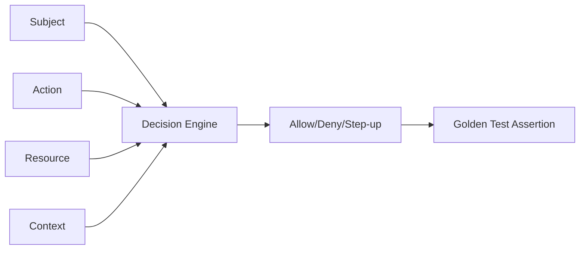
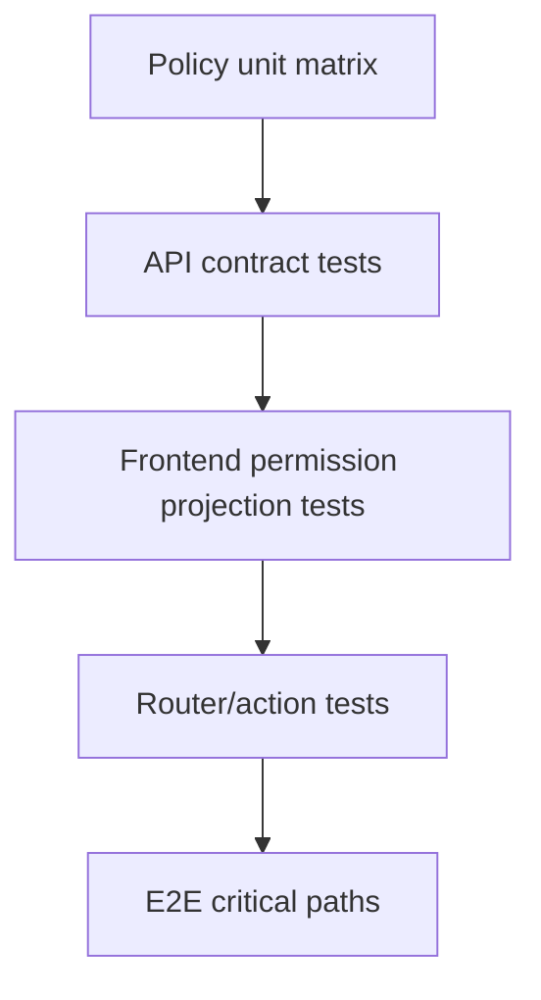

# Part 096 — Authorization Regression Testing

Authorization bugs rarely look dramatic in code review.

They look like this:

```diff
- if (can(user, 'case.approve', case)) {
+ if (user.role === 'admin' || user.role === 'approver') {
```

or this:

```diff
- queryKey: ['case', tenantId, caseId, permissionEpoch]
+ queryKey: ['case', caseId]
```

or this:

```diff
- action: 'case.comment.create'
+ action: 'case.update'
```

or this:

```diff
- WHERE tenant_id = :tenantId AND id = :caseId
+ WHERE id = :caseId
```

A regression test suite exists because authorization behavior is too important to rely on memory, convention, or manual QA.

The goal is not merely to test that allowed users can act.

The goal is to prove that **forbidden users remain forbidden** as the system evolves.

---

## 1. What makes authorization regression different

Normal regression testing asks:

```txt
did the feature still work?
```

Authorization regression testing asks:

```txt
did every previously forbidden access path remain forbidden?
```

That is a different mindset.

A product test often proves:

```txt
approver can approve case
```

An authorization regression test must also prove:

```txt
viewer cannot approve case
editor cannot approve case
approver cannot approve already-closed case
approver cannot approve own case if SoD applies
approver cannot approve case in another tenant
suspended approver cannot approve case
approver without fresh auth cannot approve sensitive case
frontend hidden action and backend denial agree
```

The denial cases are usually more important than the allow case.

---

## 2. The authorization regression target

Model every authorization decision as:

```txt
subject + action + resource + context => decision
```

Then regression testing becomes matrix verification.



A regression test does not need to know every internal policy rule.

It needs to know the expected externally meaningful decision.

Example:

```ts
type AuthorizationCase = {
  name: string;
  subject: string;
  action: string;
  resource: {
    type: string;
    id: string;
    tenantId: string;
    state?: string;
    owner?: string;
  };
  context?: {
    tenantId?: string;
    authAgeSeconds?: number;
    impersonating?: boolean;
    now?: string;
  };
  expected: 'allow' | 'deny' | 'step_up';
  reason?: string;
};
```

This becomes the core artifact of the suite.

---

## 3. Golden permission matrix

A golden matrix is a stable, reviewable set of expected authorization decisions.

It should live in version control.

Example:

```ts
export const caseAuthorizationMatrix: AuthorizationCase[] = [
  {
    name: 'viewer can read open case in own tenant',
    subject: 'user:caseViewer',
    action: 'case.read',
    resource: {
      type: 'case',
      id: 'case-open-alpha',
      tenantId: 'tenant-alpha',
      state: 'OPEN',
    },
    context: { tenantId: 'tenant-alpha' },
    expected: 'allow',
  },
  {
    name: 'viewer cannot approve case',
    subject: 'user:caseViewer',
    action: 'case.approve',
    resource: {
      type: 'case',
      id: 'case-awaiting-approval-alpha',
      tenantId: 'tenant-alpha',
      state: 'AWAITING_APPROVAL',
    },
    context: { tenantId: 'tenant-alpha' },
    expected: 'deny',
    reason: 'missing_permission',
  },
  {
    name: 'approver cannot approve own case when separation of duties applies',
    subject: 'user:caseApprover',
    action: 'case.approve',
    resource: {
      type: 'case',
      id: 'case-owned-by-approver',
      tenantId: 'tenant-alpha',
      state: 'AWAITING_APPROVAL',
      owner: 'user:caseApprover',
    },
    context: { tenantId: 'tenant-alpha' },
    expected: 'deny',
    reason: 'separation_of_duties',
  },
  {
    name: 'approver requires step-up for high-risk approval',
    subject: 'user:caseApprover',
    action: 'case.approve',
    resource: {
      type: 'case',
      id: 'case-high-risk',
      tenantId: 'tenant-alpha',
      state: 'AWAITING_APPROVAL',
    },
    context: { tenantId: 'tenant-alpha', authAgeSeconds: 7200 },
    expected: 'step_up',
    reason: 'auth_too_old',
  },
  {
    name: 'tenant admin cannot read another tenant case',
    subject: 'user:tenantAdminAlpha',
    action: 'case.read',
    resource: {
      type: 'case',
      id: 'case-open-beta',
      tenantId: 'tenant-beta',
      state: 'OPEN',
    },
    context: { tenantId: 'tenant-alpha' },
    expected: 'deny',
    reason: 'tenant_mismatch',
  },
];
```

The matrix is not only test data. It is executable documentation.

A reviewer can see the policy expectation without reading the whole authorization engine.

---

## 4. Golden matrices should be boring

Do not make the golden matrix clever.

Bad:

```ts
expected: user.roles.includes('admin') ? 'allow' : 'deny'
```

This repeats the implementation inside the test.

Better:

```ts
expected: 'deny'
```

Golden cases should be explicit.

If a policy changes, the diff should be obvious:

```diff
- expected: 'deny', reason: 'missing_permission'
+ expected: 'allow'
```

That diff should trigger a serious review.

---

## 5. Regression test levels

Authorization regression should run at multiple levels.



| Level | Proves | Speed |
|---|---|---|
| Policy unit matrix | Decision engine behavior | Fast |
| API contract tests | Server enforcement per endpoint | Fast/medium |
| Frontend projection tests | React uses permission contract correctly | Fast |
| Router/action tests | Navigation/mutation boundary | Medium |
| E2E critical paths | Integrated browser behavior | Slow |

Do not use E2E as the only regression layer.

The permission matrix should mostly run in fast tests.

---

## 6. Policy unit regression

A policy unit test evaluates the decision function directly.

```ts
import { describe, expect, it } from 'vitest';
import { can } from '../authorization/can';
import { caseAuthorizationMatrix } from './golden/case-matrix';

for (const c of caseAuthorizationMatrix) {
  it(c.name, () => {
    const decision = can({
      subject: fixtureSubject(c.subject),
      action: c.action,
      resource: fixtureResource(c.resource),
      context: fixtureContext(c.context),
    });

    expect(decision.effect).toBe(c.expected);

    if (c.reason) {
      expect(decision.reason).toBe(c.reason);
    }
  });
}
```

This test should not call HTTP, render React, or require a browser.

It should be fast enough to run on every PR.

---

## 7. API authorization regression

Policy unit tests are not enough.

You must also prove every endpoint calls the policy correctly.

Example endpoint matrix:

```ts
type EndpointAuthorizationCase = {
  name: string;
  user: TestUserKey;
  method: 'GET' | 'POST' | 'PATCH' | 'DELETE';
  path: string;
  body?: unknown;
  expectedStatus: 200 | 201 | 204 | 400 | 401 | 403 | 404 | 409 | 428;
};
```

Test:

```ts
const endpointCases: EndpointAuthorizationCase[] = [
  {
    name: 'viewer can read case',
    user: 'caseViewer',
    method: 'GET',
    path: '/api/cases/case-open-alpha',
    expectedStatus: 200,
  },
  {
    name: 'viewer cannot approve case',
    user: 'caseViewer',
    method: 'POST',
    path: '/api/cases/case-awaiting-approval-alpha/approve',
    body: { comment: 'approve' },
    expectedStatus: 403,
  },
  {
    name: 'tenant admin cannot read another tenant case',
    user: 'tenantAdminAlpha',
    method: 'GET',
    path: '/api/cases/case-open-beta',
    expectedStatus: 404,
  },
];
```

Runner:

```ts
for (const c of endpointCases) {
  test(c.name, async ({ request }) => {
    const session = await createTestSession(c.user);

    const response = await request.fetch(c.path, {
      method: c.method,
      data: c.body,
      headers: {
        cookie: session.cookieHeader,
        'x-csrf-token': session.csrfToken,
      },
    });

    expect(response.status()).toBe(c.expectedStatus);
  });
}
```

API tests catch the common gap:

```txt
policy says deny, endpoint forgot to check
```

---

## 8. Frontend/backend contract regression

React should not invent authorization.

It should consume a permission contract from the server/BFF.

Example contract:

```ts
type ResourcePermissionProjection = {
  resource: {
    type: 'case';
    id: string;
    tenantId: string;
    state: string;
  };
  allowedActions: string[];
  deniedActions?: Array<{
    action: string;
    reasonCode: string;
    display: 'hide' | 'disable' | 'explain';
  }>;
  permissionVersion: string;
  evaluatedAt: string;
};
```

Contract regression test:

```ts
test('case permission projection matches policy matrix', async ({ request }) => {
  const session = await createTestSession('caseViewer');

  const response = await request.get('/api/cases/case-awaiting-approval-alpha/permissions', {
    headers: { cookie: session.cookieHeader },
  });

  expect(response.status()).toBe(200);

  const body = await response.json() as ResourcePermissionProjection;

  expect(body.allowedActions).toContain('case.read');
  expect(body.allowedActions).not.toContain('case.approve');
  expect(body.deniedActions).toEqual(
    expect.arrayContaining([
      expect.objectContaining({
        action: 'case.approve',
        reasonCode: 'missing_permission',
      }),
    ]),
  );
});
```

Then component tests verify the UI projection:

```ts
render(
  <CaseActions
    case={caseFixture}
    permissions={{
      allowedActions: ['case.read'],
      deniedActions: [
        {
          action: 'case.approve',
          reasonCode: 'missing_permission',
          display: 'hide',
        },
      ],
      permissionVersion: 'v1',
      evaluatedAt: '2026-07-08T00:00:00Z',
    }}
  />,
);

expect(screen.queryByRole('button', { name: /approve/i })).not.toBeInTheDocument();
```

This catches frontend drift:

```txt
server projection denies action, component shows action anyway
```

---

## 9. Deny cases must dominate

In authorization regression, denial cases should outnumber allow cases.

Useful ratio:

```txt
1 allow case : 3-8 deny cases
```

For one sensitive action, test:

| Case | Expected |
|---|---|
| authorized subject | allow |
| unauthenticated subject | deny/login |
| wrong role | deny |
| wrong tenant | deny |
| wrong resource state | deny |
| owner conflict / SoD | deny |
| expired membership | deny |
| suspended user | deny |
| stale auth / step-up required | step-up |
| impersonating support user | deny or constrained |
| revoked permission | deny |

This is why authorization regression is not a happy-path test suite.

It is a prevention system for privilege creep.

---

## 10. Mutation denial regression

Read authorization and write authorization must be tested separately.

A user may read a resource but not mutate it.

Example:

```ts
type MutationDenialCase = {
  user: TestUserKey;
  resourceId: string;
  mutation: string;
  body: unknown;
  expectedStatus: 403 | 409 | 428;
  expectedStateUnchanged: boolean;
};
```

Test:

```ts
for (const c of mutationDenialCases) {
  test(`${c.user} cannot ${c.mutation} ${c.resourceId}`, async ({ request }) => {
    const session = await createTestSession(c.user);
    const before = await getCase(c.resourceId);

    const response = await request.post(`/api/cases/${c.resourceId}/${c.mutation}`, {
      headers: {
        cookie: session.cookieHeader,
        'x-csrf-token': session.csrfToken,
      },
      data: c.body,
    });

    expect(response.status()).toBe(c.expectedStatus);

    if (c.expectedStateUnchanged) {
      const after = await getCase(c.resourceId);
      expect(after).toEqual(before);
    }
  });
}
```

For forbidden mutations, asserting only `403` is not enough.

Also assert state did not change.

This catches partial-write bugs:

```txt
endpoint denied late after side effect already occurred
```

---

## 11. Workflow-state authorization regression

In case management/regulatory systems, authorization depends on workflow state.

Example:

```ts
type CaseState =
  | 'DRAFT'
  | 'SUBMITTED'
  | 'UNDER_REVIEW'
  | 'AWAITING_APPROVAL'
  | 'APPROVED'
  | 'CLOSED'
  | 'ARCHIVED';
```

Matrix:

```ts
const approveStateMatrix = [
  ['DRAFT', 'deny'],
  ['SUBMITTED', 'deny'],
  ['UNDER_REVIEW', 'deny'],
  ['AWAITING_APPROVAL', 'allow'],
  ['APPROVED', 'deny'],
  ['CLOSED', 'deny'],
  ['ARCHIVED', 'deny'],
] as const;
```

Test:

```ts
for (const [state, expected] of approveStateMatrix) {
  test(`case.approve in ${state} => ${expected}`, async () => {
    const decision = can({
      subject: fixtureSubject('user:caseApprover'),
      action: 'case.approve',
      resource: fixtureCase({ state }),
      context: { tenantId: 'tenant-alpha' },
    });

    expect(decision.effect).toBe(expected);
  });
}
```

The same matrix should drive API mutation tests.

```ts
for (const [state, expected] of approveStateMatrix) {
  test(`POST approve in ${state}`, async ({ request }) => {
    const caseId = await seedCase({ state });
    const session = await createTestSession('caseApprover');

    const response = await request.post(`/api/cases/${caseId}/approve`, {
      headers: authHeaders(session),
      data: { comment: 'approval attempt' },
    });

    expect(response.status()).toBe(expected === 'allow' ? 200 : 403);
  });
}
```

State-machine authorization is where regressions hide. Test it explicitly.

---

## 12. Tenant isolation regression

Tenant isolation deserves its own matrix.

```ts
const tenantCases = [
  {
    name: 'member of alpha can read alpha case',
    user: 'alphaMember',
    tenantContext: 'tenant-alpha',
    resourceTenant: 'tenant-alpha',
    expected: 'allow',
  },
  {
    name: 'member of alpha cannot read beta case',
    user: 'alphaMember',
    tenantContext: 'tenant-alpha',
    resourceTenant: 'tenant-beta',
    expected: 'deny',
  },
  {
    name: 'platform support cannot mutate tenant case without scoped delegation',
    user: 'supportUser',
    tenantContext: 'tenant-alpha',
    resourceTenant: 'tenant-alpha',
    action: 'case.update',
    expected: 'deny',
  },
];
```

Tenant bugs are high-impact because they expose cross-customer data.

Regression tests should cover:

- list endpoints,
- detail endpoints,
- search endpoints,
- export endpoints,
- file download endpoints,
- realtime subscriptions,
- background jobs,
- admin screens,
- access request flows,
- audit log visibility.

A tenant isolation test suite should fail if a developer forgets a tenant predicate anywhere.

---

## 13. Field-level authorization regression

Field-level permissions often regress because teams test screen access but not data shape.

Example:

```ts
type FieldPermissionCase = {
  user: TestUserKey;
  resourceId: string;
  field: string;
  readMode: 'visible' | 'masked' | 'hidden';
  writeMode: 'editable' | 'readonly' | 'forbidden';
};
```

API projection test:

```ts
test('viewer cannot see protected enforcement notes', async ({ request }) => {
  const session = await createTestSession('externalViewer');

  const response = await request.get('/api/cases/case-1', {
    headers: authHeaders(session),
  });

  const body = await response.json();

  expect(body.enforcementNotes).toBeUndefined();
  expect(body.fields.enforcementNotes.mode).toBe('hidden');
});
```

Mutation test:

```ts
test('readonly field cannot be patched directly', async ({ request }) => {
  const session = await createTestSession('externalViewer');

  const response = await request.patch('/api/cases/case-1', {
    headers: authHeaders(session),
    data: {
      enforcementNotes: 'attempted write',
    },
  });

  expect(response.status()).toBe(403);
});
```

Component test:

```ts
expect(screen.queryByLabelText(/enforcement notes/i)).not.toBeInTheDocument();
```

Field-level authorization requires all three: projection, mutation denial, and UI behavior.

---

## 14. Bulk action regression

Bulk actions are common authorization bug sources.

Example failure:

```txt
user selects 10 rows
8 allowed, 2 forbidden
frontend sends all 10 ids
server updates all 10
```

Test cases:

| Selection | Expected |
|---|---|
| all allowed | action enabled, all processed |
| mixed allowed/forbidden | preview shows eligible count, server processes only allowed or rejects all according to policy |
| all forbidden | action disabled/denied |
| stale permission after selection | server denies stale rows |
| cross-tenant ids injected | server denies/rejects |

API regression:

```ts
test('bulk approve rejects forbidden case ids', async ({ request }) => {
  const session = await createTestSession('caseApprover');

  const response = await request.post('/api/cases/bulk-approve', {
    headers: authHeaders(session),
    data: {
      caseIds: [
        'case-awaiting-approval-alpha',
        'case-closed-alpha',
        'case-awaiting-approval-beta',
      ],
    },
  });

  expect([207, 403, 422]).toContain(response.status());

  const body = await response.json();
  expect(body.denied).toEqual(
    expect.arrayContaining([
      expect.objectContaining({ id: 'case-closed-alpha' }),
      expect.objectContaining({ id: 'case-awaiting-approval-beta' }),
    ]),
  );
});
```

The exact status code depends on product policy. The invariant is that forbidden rows are not modified silently.

---

## 15. Stale privilege regression

Stale privilege is one of the hardest bugs to catch manually.

Test revocation after UI has loaded.

```ts
test('revoked permission denies mutation even if UI was loaded before revocation', async ({ page, request }) => {
  await loginAs(page, 'caseEditor', { tenantId: 'tenant-alpha' });

  await page.goto('/cases/case-1');
  await expect(page.getByRole('button', { name: /edit/i })).toBeVisible();

  await request.post('/test-api/permissions/revoke', {
    data: {
      userKey: 'caseEditor',
      action: 'case.update',
      resourceId: 'case-1',
    },
  });

  await page.getByRole('button', { name: /edit/i }).click();
  await page.getByLabelText(/summary/i).fill('stale privilege attempt');
  await page.getByRole('button', { name: /save/i }).click();

  await expect(page.getByText(/permission changed|no longer have permission/i)).toBeVisible();

  const current = await request.get('/api/cases/case-1');
  expect(await current.text()).not.toContain('stale privilege attempt');
});
```

This regression test proves:

- frontend projection can be stale,
- backend enforcement still denies,
- UI recovers safely,
- state does not change.

---

## 16. Regression for “hidden button is security”

Always pair UI denial tests with API denial tests.

UI test:

```ts
test('viewer does not see approve button', async ({ page }) => {
  await loginAs(page, 'caseViewer', { tenantId: 'tenant-alpha' });

  await page.goto('/cases/case-awaiting-approval-alpha');

  await expect(page.getByRole('button', { name: /approve/i })).not.toBeVisible();
});
```

API test:

```ts
test('viewer cannot approve directly through API', async ({ request }) => {
  const session = await createTestSession('caseViewer');

  const response = await request.post('/api/cases/case-awaiting-approval-alpha/approve', {
    headers: authHeaders(session),
    data: { comment: 'direct attempt' },
  });

  expect(response.status()).toBe(403);
});
```

If you only test the first, you are testing exposure control.

If you test both, you are testing the product invariant.

---

## 17. Regression for policy vocabulary drift

Authorization systems fail when action names drift.

Example:

```txt
frontend checks case.approve
backend expects cases.approve
policy grants case.approval.approve
```

Create a typed action registry.

```ts
export const Actions = {
  CaseRead: 'case.read',
  CaseUpdate: 'case.update',
  CaseApprove: 'case.approve',
  CaseClose: 'case.close',
  CaseAssign: 'case.assign',
} as const;

export type Action = typeof Actions[keyof typeof Actions];
```

Test registry usage:

```ts
test('all route metadata actions exist in action registry', () => {
  const routeActions = collectRouteAuthActions(routes);

  for (const action of routeActions) {
    expect(Object.values(Actions)).toContain(action);
  }
});
```

Test policy coverage:

```ts
test('all registered actions are covered by policy test matrix', () => {
  const matrixActions = new Set(caseAuthorizationMatrix.map(c => c.action));

  for (const action of Object.values(Actions)) {
    expect(matrixActions.has(action)).toBe(true);
  }
});
```

This catches dead actions and accidental string drift.

---

## 18. Regression for route metadata drift

If routes declare permissions, test that metadata agrees with loaders/actions.

```ts
test('protected routes declare auth metadata', () => {
  const protectedRoutes = flattenRoutes(routes).filter(route => route.path?.startsWith('/cases'));

  for (const route of protectedRoutes) {
    expect(route.handle?.auth).toBeDefined();
  }
});
```

Test loader/action consistency:

```ts
test('route metadata actions map to server permission checks', () => {
  const routeMetadata = collectRouteAuthMetadata(routes);

  for (const meta of routeMetadata) {
    expect(serverPermissionRegistry).toContainEqual(
      expect.objectContaining({
        action: meta.action,
        resourceType: meta.resourceType,
      }),
    );
  }
});
```

This prevents a class of regressions where navigation says one thing, loader says another, and API says a third.

---

## 19. Snapshot testing policy results

Snapshot tests can help, but use them carefully.

Good snapshot target:

```ts
const results = caseAuthorizationMatrix.map(c => ({
  name: c.name,
  action: c.action,
  expected: c.expected,
  actual: can(toPolicyInput(c)).effect,
  reason: can(toPolicyInput(c)).reason,
}));

expect(results).toMatchInlineSnapshot();
```

Bad snapshot target:

```ts
expect(render(<WholeApp />)).toMatchSnapshot();
```

Authorization snapshots should be compact, semantic, and reviewable.

They should show decision changes, not giant UI trees.

---

## 20. Property-based authorization tests

Golden cases are explicit. Property tests search the space.

Example invariant:

```txt
no user can access a resource from a tenant they do not belong to
```

Property-style test:

```ts
import fc from 'fast-check';

it('denies cross-tenant resource access', () => {
  fc.assert(
    fc.property(userArbitrary, resourceArbitrary, actionArbitrary, (user, resource, action) => {
      fc.pre(user.tenantIds.length > 0);
      fc.pre(!user.tenantIds.includes(resource.tenantId));

      const decision = can({
        subject: user,
        action,
        resource,
        context: { tenantId: user.tenantIds[0] },
      });

      expect(decision.effect).not.toBe('allow');
    }),
  );
});
```

Property tests are good for invariants like:

- cross-tenant access is denied,
- suspended users cannot mutate,
- archived resources cannot be modified,
- users cannot approve their own case when SoD applies,
- unknown actions deny,
- unknown resource types deny,
- expired memberships deny,
- impersonation cannot perform sensitive actions unless explicitly delegated.

Do not use property tests as the only documentation. Keep golden cases too.

---

## 21. Mutation testing for authorization checks

Mutation testing asks:

```txt
if a developer accidentally removes this check, does a test fail?
```

For authorization, that is extremely useful.

Manual mutation examples:

- remove tenant predicate,
- skip `can()` call,
- convert deny-by-default to allow-by-default,
- ignore resource state,
- ignore owner conflict,
- ignore permission epoch,
- treat `step_up` as `allow`,
- allow unknown action,
- remove field-level deny,
- remove server-side mutation check because UI hides the button.

A healthy suite fails loudly for each mutation.

You do not need full mutation-testing tooling at first. Start with deliberate “break the check locally” drills during security review.

---

## 22. Release gate strategy

Authorization regression should be a release gate.

Suggested tiers:

| Gate | Runs | Blocks? |
|---|---|---|
| Policy unit matrix | Every PR | Yes |
| API authorization matrix | Every PR touching API/auth/policy | Yes |
| Frontend permission projection | Every PR touching UI/auth/design-system | Yes |
| Router auth tests | Every PR touching router/auth | Yes |
| E2E critical auth paths | Auth-sensitive PRs + nightly | Yes for auth-sensitive PRs |
| Full multi-browser E2E auth | Nightly/pre-release | Yes for release candidate |

Classify files as auth-sensitive.

Example path triggers:

```txt
src/auth/**
src/authorization/**
src/policy/**
src/routes/**
src/api/client/**
src/design-system/Authorized*
src/components/Can.tsx
src/session/**
src/tenant/**
server/routes/**
server/policy/**
server/middleware/auth*
```

A small route metadata change can be an auth change.

Treat it accordingly.

---

## 23. Regression test review checklist

When reviewing an authorization change, ask:

- Which subject-action-resource-context decisions changed?
- Are denial cases updated intentionally?
- Are cross-tenant cases still denied?
- Are object-level cases still denied?
- Are workflow-state cases still denied?
- Are owner/separation-of-duties rules still enforced?
- Are suspended/expired users denied?
- Are stale permission cases handled?
- Is step-up still required for sensitive actions?
- Are field-level read/write rules tested?
- Are bulk operations tested?
- Does frontend projection agree with backend enforcement?
- Are direct API calls denied even if UI hides actions?
- Are route metadata and loader/action checks aligned?
- Is audit behavior preserved?
- Did any snapshot change from deny to allow?
- Is the change reflected in the permission matrix?

If the answer is “we tested the happy path manually”, the change is not ready.

---

## 24. Common anti-patterns

### Anti-pattern: one admin user tests everything

```txt
admin can do all flows, therefore auth works
```

No. That proves almost nothing about denial.

### Anti-pattern: only testing UI visibility

```txt
approve button is hidden, therefore approve is secure
```

No. The API must deny direct mutation.

### Anti-pattern: duplicating policy logic inside tests

```ts
expected: computeExpectedFromSameRules(input)
```

This makes tests pass when the rule and test are wrong in the same way.

### Anti-pattern: no tenant-negative tests

Every multi-tenant system needs explicit cross-tenant denial tests.

### Anti-pattern: no stale-permission tests

Permissions change during sessions. Test it.

### Anti-pattern: snapshotting huge UI trees

Authorization snapshots should be semantic and reviewable.

### Anti-pattern: treating `403` as enough

For forbidden mutations, verify no side effect happened.

---

## 25. Example authorization regression folder

```txt
tests/
  authorization-regression/
    golden/
      actions.ts
      subjects.ts
      resources.ts
      case.matrix.ts
      document.matrix.ts
      tenant.matrix.ts
      workflow.matrix.ts
      field.matrix.ts
    policy/
      can.case.test.ts
      can.document.test.ts
      invariants.property.test.ts
    api/
      case-endpoints.authz.test.ts
      document-endpoints.authz.test.ts
      tenant-isolation.authz.test.ts
      bulk-actions.authz.test.ts
      field-write.authz.test.ts
    frontend/
      permission-projection.contract.test.ts
      route-metadata.authz.test.ts
      authorized-components.test.tsx
    e2e/
      stale-permission.spec.ts
      direct-api-denial.spec.ts
      tenant-isolation.spec.ts
```

The structure separates:

- policy truth,
- server enforcement,
- frontend projection,
- integrated behavior.

That separation is important. It keeps tests fast and diagnosable.

---

## 26. Minimal implementation blueprint

Start with this if the app has weak auth testing today.

### Step 1: Define action registry

```ts
export const Actions = {
  CaseRead: 'case.read',
  CaseUpdate: 'case.update',
  CaseApprove: 'case.approve',
  CaseClose: 'case.close',
} as const;
```

### Step 2: Define test subjects/resources

```ts
export const Subjects = {
  Viewer: 'user:viewer',
  Editor: 'user:editor',
  Approver: 'user:approver',
  SuspendedApprover: 'user:suspended-approver',
  TenantAdminAlpha: 'user:tenant-admin-alpha',
} as const;
```

### Step 3: Write golden matrix

```ts
export const CaseMatrix = [
  {
    name: 'viewer reads open case',
    subject: Subjects.Viewer,
    action: Actions.CaseRead,
    resource: 'case:open-alpha',
    expected: 'allow',
  },
  {
    name: 'viewer cannot approve case',
    subject: Subjects.Viewer,
    action: Actions.CaseApprove,
    resource: 'case:awaiting-approval-alpha',
    expected: 'deny',
  },
] as const;
```

### Step 4: Run policy test

```ts
for (const c of CaseMatrix) {
  test(c.name, () => {
    expect(can(resolveInput(c)).effect).toBe(c.expected);
  });
}
```

### Step 5: Run API test for sensitive endpoints

```ts
for (const c of sensitiveEndpointMatrix) {
  test(c.name, async ({ request }) => {
    const response = await callAs(request, c.user, c.request);
    expect(response.status()).toBe(c.expectedStatus);
  });
}
```

### Step 6: Add stale-permission E2E

```ts
// Load page with permission, revoke permission, attempt mutation, assert denial + no side effect.
```

This is enough to move from “hope-based auth” to regression-protected auth.

---

## 27. Mental model

Authorization regression testing is a privilege-drift alarm.

It protects the system from accidental widening of access.

The key idea:

```txt
authorization behavior must be explicit, executable, reviewable, and versioned
```

A mature test suite makes a permission change impossible to hide.

If a developer changes policy, endpoint enforcement, frontend projection, route metadata, or cache scoping, at least one test should ask:

```txt
which previously-denied access is now allowed?
```

That is the question that prevents broken access control from becoming a production incident.

---

## References

- OWASP Authorization Cheat Sheet: https://cheatsheetseries.owasp.org/cheatsheets/Authorization_Cheat_Sheet.html
- OWASP API Security 2023 — Broken Object Level Authorization: https://owasp.org/API-Security/editions/2023/en/0xa1-broken-object-level-authorization/
- NIST RBAC model: https://tsapps.nist.gov/publication/get_pdf.cfm?pub_id=916402
- NIST SP 800-162 — Attribute Based Access Control: https://csrc.nist.gov/pubs/sp/800/162/upd2/final
- Google Zanzibar paper: https://research.google/pubs/zanzibar-googles-consistent-global-authorization-system/
- OpenFGA — Modeling Concepts: https://openfga.dev/docs/concepts
- React Router — Testing: https://reactrouter.com/start/framework/testing
- Testing Library — Queries: https://testing-library.com/docs/queries/about/
