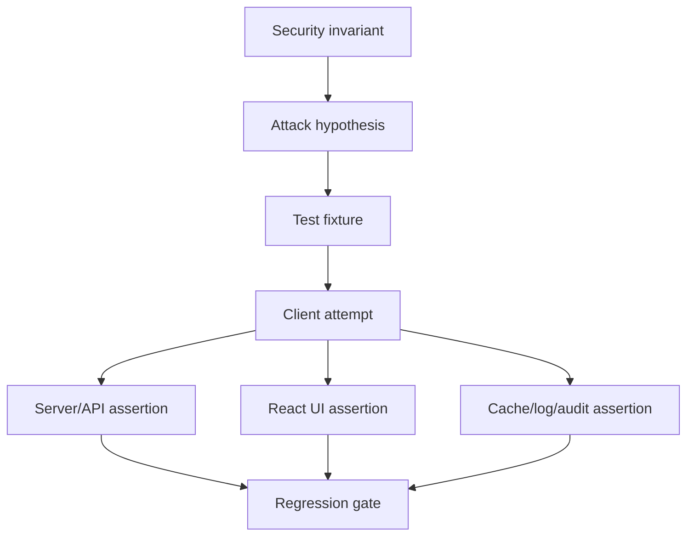

# Part 097 — Security Test Cases for React Auth

At this point in the series, we already tested state machines, permission logic, components, router flows, E2E login paths, and authorization regression matrices. That is still not enough.

Those tests prove that the system behaves correctly under expected product scenarios. Security tests ask a harsher question:

> What happens when the user is malicious, the browser is hostile, the session is stale, the cache lies, the route is called directly, the object id is changed, and the UI is bypassed entirely?

A React auth system is not secure because the sidebar hides a button. It is secure when the entire request path remains correct after every client-side assumption has been removed.

The goal of this part is to build a reusable security test catalog for React authentication and authorization. We will focus on cases that are close enough to normal engineering work that they can run in CI, not only in annual penetration tests.

## 1. The mental model

Security tests are not random payload lists. They are attempts to break invariants.

For React auth, the core invariants are:

1. Unauthenticated users cannot read or mutate protected resources.
2. Authenticated users cannot act outside their tenant, organization, role, relationship, workflow state, or object grant.
3. The frontend never becomes the source of authorization truth.
4. Session/token state cannot be trusted merely because it exists in memory, storage, query cache, or route state.
5. Redirects never turn attacker-controlled input into navigation to an attacker-controlled origin.
6. Sensitive data does not appear in DOM, URLs, logs, analytics, caches, source maps, error messages, or third-party scripts.
7. Revocation, logout, tenant switch, role change, and policy change eventually collapse all stale privileges.
8. Every denial path is safe, observable, testable, and non-leaky.

Security test design starts from these invariants and creates attack-shaped examples.



## 2. What belongs in automated security tests?

Not every security activity should be forced into a React test suite. Keep the boundary clear.

| Test type | Belongs in regular CI? | Example |
|---|---:|---|
| Deterministic auth invariant test | Yes | User B cannot read User A's case by changing URL id. |
| XSS regression for known rendering boundary | Yes | Rich text renderer sanitizes dangerous HTML. |
| CSRF behavior for state-changing endpoint | Yes | Cross-site form POST is rejected. |
| Open redirect validation | Yes | `returnTo=https://evil.example` is rejected. |
| Dependency vulnerability scan | Yes | Block known vulnerable auth SDK versions. |
| Full dynamic application scan | Sometimes | Nightly/weekly DAST against staging. |
| Manual exploit chain review | Not always | Human review of OAuth + redirect + CSP bypass chain. |
| Formal penetration test | Not per commit | External assessment before major launch/compliance milestone. |

The test suite should catch boring-but-dangerous regressions early. A penetration test should not be the first place you discover that `/api/cases/:id/approve` never checked object ownership.

## 3. Security test layers

Auth bugs rarely live in one layer. Test them at the narrowest useful layer first, then add integration coverage for the flow.

| Layer | What to test | Tools |
|---|---|---|
| Pure function | Permission decision, redirect normalization, CSRF token validator | Vitest/Jest |
| Component | Hidden/disabled/explained UI states, sanitized rendering | Testing Library |
| Router | Loader/action auth, return URL, error boundary | React Router testing utils |
| API client | Header/cookie behavior, retry, refresh, cancellation | MSW, unit tests |
| BFF/API integration | Real authorization enforcement | Supertest, Testcontainers, API tests |
| Browser E2E | Login/logout/cache/cross-tab/navigation | Playwright/Cypress |
| Static/security pipeline | dependency/SAST/secret scan | CI scanners |

The most important rule:

> If a test proves only that the button is hidden, it is not an authorization security test.

It is a UI exposure test. You still need a server/API denial test.

## 4. Test fixture design

A good auth security test suite needs adversarial fixtures, not just happy-path users.

Use a minimal but expressive identity/resource matrix.

```ts
export const actors = {
  anonymous: null,
  aliceOwner: {
    id: "usr_alice",
    tenantId: "tenant_a",
    roles: ["case_owner"],
  },
  bobPeer: {
    id: "usr_bob",
    tenantId: "tenant_a",
    roles: ["case_worker"],
  },
  malloryOtherTenant: {
    id: "usr_mallory",
    tenantId: "tenant_b",
    roles: ["case_worker"],
  },
  adminTenantA: {
    id: "usr_admin_a",
    tenantId: "tenant_a",
    roles: ["tenant_admin"],
  },
};

export const cases = {
  aliceCase: {
    id: "case_001",
    tenantId: "tenant_a",
    ownerId: "usr_alice",
    state: "draft",
  },
  bobCase: {
    id: "case_002",
    tenantId: "tenant_a",
    ownerId: "usr_bob",
    state: "submitted",
  },
  otherTenantCase: {
    id: "case_003",
    tenantId: "tenant_b",
    ownerId: "usr_mallory",
    state: "draft",
  },
};
```

Then create scenario names that encode the security property.

```ts
const scenarios = [
  {
    name: "anonymous cannot view protected case detail",
    actor: actors.anonymous,
    resource: cases.aliceCase,
    action: "case.read",
    expectedStatus: 401,
  },
  {
    name: "peer cannot approve another worker's submitted case without grant",
    actor: actors.aliceOwner,
    resource: cases.bobCase,
    action: "case.approve",
    expectedStatus: 403,
  },
  {
    name: "other-tenant user cannot read object even with known id",
    actor: actors.malloryOtherTenant,
    resource: cases.aliceCase,
    action: "case.read",
    expectedStatus: 404,
  },
];
```

Prefer names like `other-tenant-user-cannot-read-object-by-id` over `returns 403`. The status code is an implementation detail. The invariant is the important thing.

## 5. Authentication security test cases

Authentication tests prove that credentials, session state, and identity projection are not accepted too loosely.

### 5.1 Anonymous access

Every protected endpoint, loader, route action, file URL minting endpoint, export endpoint, and realtime subscription should have anonymous access tests.

| Case | Expected result |
|---|---|
| Anonymous navigates to protected route | Redirect to login or `401` boundary. |
| Anonymous calls protected API directly | `401`, no resource data. |
| Anonymous submits protected form action | `401`, no mutation. |
| Anonymous subscribes to protected channel | Reject handshake/subscription. |
| Anonymous requests signed download URL | `401`, no signed URL. |

Example API test:

```ts
it("rejects anonymous case detail access", async () => {
  const response = await request(app).get("/api/cases/case_001");

  expect(response.status).toBe(401);
  expect(response.body).toMatchObject({
    type: "https://errors.example.com/auth/unauthenticated",
    code: "UNAUTHENTICATED",
  });
  expect(response.text).not.toContain("case_001");
  expect(response.text).not.toContain("usr_alice");
});
```

### 5.2 Invalid, expired, revoked, malformed session

Do not test only “no token”. Test broken session states.

| Session condition | Expected result |
|---|---|
| Missing session | `401` |
| Expired session | `401` or refresh path, depending on endpoint |
| Revoked session | `401`, local cache cleanup on client |
| Malformed bearer token | `401`, no exception leak |
| JWT signed by wrong key | `401` |
| JWT wrong `aud` | `401` |
| JWT wrong `iss` | `401` |
| ID token sent as access token | `401` |
| Old session id after privilege elevation | rejected or rotated |

Test the “token confusion” class explicitly.

```ts
it("does not accept ID token where access token is required", async () => {
  const idToken = await testTokens.issueIdToken({
    sub: "usr_alice",
    aud: "react-client",
  });

  const response = await request(app)
    .get("/api/cases/case_001")
    .set("Authorization", `Bearer ${idToken}`);

  expect(response.status).toBe(401);
});
```

### 5.3 Session fixation regression

After login, privilege elevation, MFA, org switch, impersonation, or account recovery, session identifiers should rotate when your architecture uses server sessions.

```ts
it("rotates session id after login", async () => {
  const anonymous = await request.agent(app);

  await anonymous.get("/login");
  const before = readSessionCookie(anonymous);

  await anonymous
    .post("/login")
    .send({ email: "alice@example.com", password: "correct-password" });

  const after = readSessionCookie(anonymous);

  expect(after).toBeDefined();
  expect(after).not.toEqual(before);
});
```

This catches a common failure: the app upgrades an attacker-planted anonymous session into an authenticated session.

## 6. Authorization security test cases

Authorization tests should cover action, object, tenant, workflow state, field, and relationship.

### 6.1 Direct object access / BOLA / IDOR

BOLA/IDOR tests mutate object identifiers and assert the backend denies access. The frontend may also hide links, but that is not the security proof.

| Attack | Example |
|---|---|
| Path id replacement | `/api/cases/case_001` → `/api/cases/case_003` |
| Query id replacement | `?caseId=case_003` |
| Body id replacement | `{ caseId: "case_003" }` |
| Header id replacement | `X-Tenant-Id: tenant_b` |
| GraphQL global id replacement | `node(id: "base64:Case:case_003")` |
| Bulk list injection | `{ ids: [allowedId, forbiddenId] }` |
| File object key replacement | `s3://tenant-b/case_003.pdf` |

Example:

```ts
it("prevents cross-tenant case read even when object id is known", async () => {
  const response = await request(app)
    .get("/api/cases/case_003")
    .set(authHeaderFor(actors.aliceOwner));

  // Use 404 if product policy hides existence across tenant boundary.
  expect(response.status).toBe(404);
  expect(response.text).not.toContain("tenant_b");
  expect(response.text).not.toContain("usr_mallory");
});
```

The important assertion is not only the status. Assert that forbidden data is not present in the body.

### 6.2 Mutation authorization

Read authorization and write authorization are different. A user may view a case but not approve, assign, export, delete, or reopen it.

```ts
it("does not allow a viewer to approve a case", async () => {
  const response = await request(app)
    .post("/api/cases/case_002/approve")
    .set(authHeaderFor(actors.aliceOwner))
    .send({ decision: "approve" });

  expect(response.status).toBe(403);

  const caseAfter = await db.case.findById("case_002");
  expect(caseAfter.state).toBe("submitted");
});
```

Always assert that the mutation did not occur. A `403` response after a partial side effect is still a security bug.

### 6.3 Workflow-state authorization

Regulated and case-management systems often have state-dependent permissions.

| Resource state | Forbidden action example |
|---|---|
| `draft` | approve |
| `submitted` | edit applicant identity |
| `approved` | delete case |
| `closed` | mutate without reopen permission |
| `escalated` | handle by original investigator if separation-of-duties applies |

Test both user role and resource state.

```ts
it("denies approval when case is not submitted even for approver", async () => {
  const response = await request(app)
    .post("/api/cases/case_001/approve")
    .set(authHeaderFor(actors.adminTenantA));

  expect(response.status).toBe(409); // or 403 if model treats invalid state as authorization
  expect(response.body.code).toBe("INVALID_WORKFLOW_STATE");
});
```

A useful distinction:

- `403`: actor is not allowed.
- `409`: action cannot occur in current resource state.
- `422`: request shape/content is invalid.

Pick a contract and test it consistently.

### 6.4 Field-level authorization

A user may update one field but not another.

```ts
it("ignores or rejects forbidden field updates", async () => {
  const response = await request(app)
    .patch("/api/cases/case_001")
    .set(authHeaderFor(actors.aliceOwner))
    .send({
      publicNote: "Allowed note",
      riskScore: 999, // forbidden field
    });

  expect(response.status).toBe(403);
  expect(response.body.code).toBe("FIELD_FORBIDDEN");

  const after = await db.case.findById("case_001");
  expect(after.riskScore).not.toBe(999);
});
```

Do not rely on the React form hiding the field. Attackers can send any JSON body they want.

### 6.5 Bulk operation authorization

Bulk endpoints are a common authorization regression point.

```ts
it("does not process forbidden ids in bulk action", async () => {
  const response = await request(app)
    .post("/api/cases/bulk-close")
    .set(authHeaderFor(actors.aliceOwner))
    .send({ ids: ["case_001", "case_003"] });

  expect([207, 403]).toContain(response.status);

  const otherTenantCase = await db.case.findById("case_003");
  expect(otherTenantCase.state).toBe("draft");
});
```

Decide one of two models:

1. **All-or-nothing**: if any id is forbidden, no object mutates.
2. **Partial success**: allowed objects mutate, forbidden ones return per-item denial.

Do not accidentally implement “mutate allowed + silently ignore forbidden + return 200 without per-item result” unless the product explicitly accepts that ambiguity.

## 7. XSS regression tests

XSS testing in React is about dangerous boundaries, not every component.

Test these places aggressively:

- Rich text rendering.
- Markdown preview.
- Admin-configured banners.
- User display names rendered in layout/sidebar/header.
- Error messages coming from server.
- File names.
- Search highlights.
- Notification payloads.
- Third-party widget configuration.
- `dangerouslySetInnerHTML` usage.
- DOMPurify/sanitizer wrapper.

### 7.1 Component-level XSS regression

```tsx
it("does not execute script from rich text content", () => {
  const payload = `Hello`;

  render(<RichTextViewer html={payload} />);

  expect(screen.getByText("Hello")).toBeInTheDocument();
  expect((window as any).__xss).not.toBe(true);
  expect(document.querySelector("img[onerror]")).toBeNull();
});
```

This test is not perfect because jsdom does not execute many browser behaviors exactly. Pair it with a browser-level E2E test for critical rendering surfaces.

### 7.2 Browser-level XSS canary

```ts
test("stored profile display name cannot execute script", async ({ page }) => {
  await adminApi.setDisplayName(
    "usr_alice",
    `Alice`,
  );

  await loginAs(page, "usr_alice");
  await page.goto("/app/profile");

  await expect(page.getByText("Alice")).toBeVisible();
  await expect(page.evaluate(() => (window as any).__xss)).resolves.not.toBe(true);
});
```

### 7.3 XSS impact tests for auth storage

If your app stores bearer tokens in browser-accessible storage, include a test that fails loudly when token storage changes.

```ts
test("access token is not persisted in localStorage", async ({ page }) => {
  await loginAs(page, "usr_alice");

  const localStorageKeys = await page.evaluate(() => Object.keys(localStorage));

  expect(localStorageKeys).not.toContain("access_token");
  expect(localStorageKeys).not.toContain("refresh_token");
});
```

This is not a full XSS defense, but it prevents accidental migration back to a weaker storage model.

## 8. CSRF regression tests

If your architecture uses cookies for authenticated state, test CSRF at server/BFF level. SameSite helps, but it is not the whole model.

### 8.1 Missing CSRF token

```ts
it("rejects cookie-authenticated mutation without CSRF token", async () => {
  const agent = await loginCookieAgent("alice@example.com");

  const response = await agent
    .post("/api/cases/case_001/submit")
    .send({ comment: "submit" });

  expect(response.status).toBe(403);
  expect(response.body.code).toBe("CSRF_FAILED");
});
```

### 8.2 Invalid Origin

```ts
it("rejects state-changing request from untrusted origin", async () => {
  const agent = await loginCookieAgent("alice@example.com");

  const response = await agent
    .post("/api/cases/case_001/submit")
    .set("Origin", "https://evil.example")
    .set("X-CSRF-Token", await getCsrfToken(agent))
    .send({ comment: "submit" });

  expect(response.status).toBe(403);
});
```

### 8.3 Safe methods do not mutate

```ts
it("does not mutate state from GET endpoint", async () => {
  const agent = await loginCookieAgent("alice@example.com");

  await agent.get("/api/cases/case_001/submit");

  const after = await db.case.findById("case_001");
  expect(after.state).toBe("draft");
});
```

A surprising number of CSRF vulnerabilities start with unsafe semantics on `GET`.

## 9. Open redirect regression tests

Redirect tests should run at the pure function layer and route/integration layer.

```ts
describe("safe return URL", () => {
  const cases = [
    ["/app/cases/123", "/app/cases/123"],
    ["https://evil.example", "/app"],
    ["//evil.example", "/app"],
    ["/\\evil.example", "/app"],
    ["/%2f%2fevil.example", "/app"],
    ["/login?returnTo=/login?returnTo=/login", "/app"],
  ] as const;

  it.each(cases)("normalizes %s", (input, expected) => {
    expect(normalizeReturnTo(input)).toBe(expected);
  });
});
```

Then test the route:

```ts
test("login returnTo rejects external origin", async ({ page }) => {
  await page.goto("/login?returnTo=https://evil.example/phish");
  await loginThroughUi(page, "alice@example.com", "correct-password");

  await expect(page).toHaveURL(/\/app$/);
});
```

Include OAuth callback tests too. Never let generic `returnTo` logic consume OAuth `redirect_uri`, `state`, or callback parameters.

## 10. Stale privilege tests

Authorization bugs often appear after change, not at first login.

Test these events:

| Event | Expected behavior |
|---|---|
| Role removed | UI invalidates permission cache; API denies next mutation. |
| Object grant revoked | Detail/action no longer accessible. |
| Tenant switched | Old tenant query cache cleared. |
| Session revoked by admin | Client receives `401`, clears session projection. |
| Policy version changed | Permission projection refetches or server denies stale mutation. |
| Workflow state changed by another actor | Optimistic UI rolls back on `409/403`. |

Example E2E:

```ts
test("revoked permission collapses stale UI privilege", async ({ page }) => {
  await loginAs(page, "usr_alice");
  await page.goto("/app/cases/case_001");

  await expect(page.getByRole("button", { name: "Approve" })).toBeVisible();

  await adminApi.revokePermission("usr_alice", "case.approve", "case_001");
  await adminApi.bumpPermissionEpoch("usr_alice");

  await page.getByRole("button", { name: "Approve" }).click();

  await expect(page.getByText(/no longer have permission/i)).toBeVisible();
  await expect(page.getByRole("button", { name: "Approve" })).not.toBeVisible();
});
```

The test should prove both server denial and client recovery.

## 11. Cache leakage tests

Authenticated React apps have many caches:

- Browser HTTP cache.
- CDN/shared proxy cache.
- React Router loader cache/revalidation state.
- TanStack Query cache.
- Apollo/GraphQL cache.
- Service worker Cache API.
- Persisted query cache.
- `localStorage`/`sessionStorage`.
- Back-forward cache.
- Download cache.

### 11.1 Logout cleanup

```ts
test("logout removes authenticated query data", async ({ page }) => {
  await loginAs(page, "usr_alice");
  await page.goto("/app/cases/case_001");
  await expect(page.getByText("Sensitive Case Title")).toBeVisible();

  await page.getByRole("button", { name: "Logout" }).click();
  await page.goto("/app/cases/case_001");

  await expect(page.getByText("Sensitive Case Title")).not.toBeVisible();
  await expect(page).toHaveURL(/\/login/);
});
```

### 11.2 Back button after logout

```ts
test("back button after logout does not reveal protected data", async ({ page }) => {
  await loginAs(page, "usr_alice");
  await page.goto("/app/cases/case_001");
  await expect(page.getByText("Sensitive Case Title")).toBeVisible();

  await page.getByRole("button", { name: "Logout" }).click();
  await page.goBack();

  await expect(page.getByText("Sensitive Case Title")).not.toBeVisible();
});
```

For highly sensitive apps, also assert HTTP headers for sensitive responses:

```ts
it("marks session projection as no-store", async () => {
  const response = await request(app)
    .get("/api/session")
    .set(authHeaderFor(actors.aliceOwner));

  expect(response.headers["cache-control"]).toContain("no-store");
});
```

## 12. File authorization tests

File endpoints are often separated from normal JSON APIs and accidentally bypass resource authorization.

Test:

- User cannot mint signed URL for forbidden object.
- Signed URL TTL is short enough for risk class.
- Upload finalize revalidates permission and object state.
- Download URL cannot be reused after revocation if your design requires revocation sensitivity.
- Preview thumbnail follows same permission as original file.
- Export job result follows same permission as export action.
- Filename does not inject HTML/log content.

```ts
it("does not mint signed download URL for other tenant file", async () => {
  const response = await request(app)
    .post("/api/files/file_tenant_b/download-url")
    .set(authHeaderFor(actors.aliceOwner));

  expect(response.status).toBe(404);
  expect(response.text).not.toContain("https://storage.example");
});
```

## 13. Realtime authorization tests

Realtime auth needs tests beyond initial page load.

| Case | Expected behavior |
|---|---|
| Unauthorized channel subscribe | Reject subscription. |
| Permission revoked while connected | Stop events or disconnect. |
| Tenant switch while connected | Close old tenant channels. |
| Logout while connected | Close socket/SSE. |
| Event payload contains forbidden field | Field omitted/masked. |
| Reconnect after session expiry | Reauth required. |

```ts
it("does not deliver case updates after grant revocation", async () => {
  const socket = await connectAs(actors.aliceOwner);

  await socket.subscribe("case:case_001");
  await adminApi.revokeCaseGrant("usr_alice", "case_001");
  await adminApi.updateCase("case_001", { title: "New secret" });

  await expectNoEvent(socket, "case.updated", { timeoutMs: 1000 });
});
```

## 14. Error-message leakage tests

A denial response should not become an oracle for object existence, tenant membership, policy internals, stack traces, or user enumeration.

```ts
it("does not leak existence of cross-tenant object", async () => {
  const response = await request(app)
    .get("/api/cases/case_003")
    .set(authHeaderFor(actors.aliceOwner));

  expect(response.status).toBe(404);
  expect(response.body.detail).not.toMatch(/tenant_b|mallory|exists/i);
});
```

For login:

```ts
it("uses enumeration-resistant login failure message", async () => {
  const missingUser = await request(app)
    .post("/api/login")
    .send({ email: "missing@example.com", password: "x" });

  const wrongPassword = await request(app)
    .post("/api/login")
    .send({ email: "alice@example.com", password: "wrong" });

  expect(missingUser.status).toBe(wrongPassword.status);
  expect(missingUser.body.message).toBe(wrongPassword.body.message);
});
```

## 15. Security test catalog

Use this as a baseline backlog.

| Category | Test case | Primary assertion |
|---|---|---|
| Authentication | Missing session | `401`, no protected data |
| Authentication | Expired session | refresh or `401`, no stale data |
| Authentication | Revoked session | `401`, local cleanup |
| Authentication | Wrong token audience | rejected |
| Authentication | ID token as access token | rejected |
| Authorization | Cross-tenant read | `404/403`, no data |
| Authorization | Cross-tenant mutation | no side effect |
| Authorization | Viewer attempts write | no side effect |
| Authorization | Forbidden field update | field unchanged |
| Authorization | Bulk request includes forbidden id | no forbidden side effect |
| Authorization | Workflow-state violation | denied or conflict |
| Stale privilege | Role removed while page open | API denial + UI recovery |
| Stale privilege | Object grant revoked | action removed/refetched |
| CSRF | Missing CSRF token | rejected |
| CSRF | Untrusted Origin | rejected |
| XSS | Rich text payload | no script execution |
| XSS | Server error message injection | escaped/sanitized |
| Redirect | External `returnTo` | fallback route |
| Redirect | Protocol-relative URL | fallback route |
| Cache | Logout then back button | no protected data |
| Cache | Session projection headers | `no-store` |
| File | Forbidden signed URL | no URL minted |
| Realtime | Revocation while connected | disconnect or event stop |
| Logs | Denied request log | no token/PII leak |
| Analytics | Denial telemetry | no secret/resource body |

## 16. How to organize security tests in the repo

A practical layout:

```txt
src/
  auth/
    redirect.test.ts
    permission.test.ts
    session-state.test.ts
  components/
    Can.test.tsx
    RichTextViewer.security.test.tsx
  routes/
    auth-router.security.test.tsx
  api-client/
    csrf.security.test.ts
    refresh.security.test.ts
server/
  tests/
    authn.security.test.ts
    authz.security.test.ts
    csrf.security.test.ts
    files.security.test.ts
    realtime.security.test.ts
e2e/
  auth/
    logout-cache.spec.ts
    stale-permission.spec.ts
    open-redirect.spec.ts
```

Use `.security.test.ts` or `.security.spec.ts` intentionally. It makes the suite discoverable, reportable, and easy to run as a dedicated CI job.

## 17. CI strategy

Security tests should not all run at the same cadence.

| Tier | Runs when | Contents |
|---|---|---|
| Tier 1 | Every PR | Unit permission, redirect normalization, component XSS regression, API authz matrix subset |
| Tier 2 | Merge to main | Full API authz matrix, CSRF, cache headers, route action tests |
| Tier 3 | Nightly | E2E stale privilege, cross-tab/logout, realtime, browser XSS canaries |
| Tier 4 | Release gate | DAST, dependency scan, policy diff review, manual checklist |

Security tests fail often when they depend on wall-clock time, external IdPs, or shared global users. Make them deterministic with seeded tenants, fake clocks, local token issuers, and isolated databases.

## 18. Common anti-patterns

### Anti-pattern: Testing hidden button as authorization

```tsx
expect(screen.queryByRole("button", { name: "Delete" })).not.toBeInTheDocument();
```

This is useful, but incomplete. Add:

```ts
await expectDeleteApiToReturn403ForSameActor();
```

### Anti-pattern: Only testing `admin` and `anonymous`

Most real authorization bugs happen between two authenticated users.

Add peer, other tenant, viewer, editor, owner, approver, impersonated actor, stale-role actor, and workflow-state cases.

### Anti-pattern: Treating UUID as security

Changing sequential ids to UUIDs does not remove the need for object-level authorization.

### Anti-pattern: Reusing production auth provider in every test

Use real provider flows sparingly. Most tests should use deterministic test identity/session utilities so failures point to product logic, not external IdP flake.

### Anti-pattern: Snapshotting entire error responses

Snapshot the contract shape and safety properties. Do not make brittle snapshots of dynamic traces or correlation IDs.

## 19. Review checklist

Before considering security tests complete, ask:

- Do we test direct API access without using the UI?
- Do we test authenticated attacker scenarios, not only anonymous scenarios?
- Do we mutate path/query/body/header object ids?
- Do we assert “no side effect” after denied mutation?
- Do we test tenant isolation explicitly?
- Do we test stale privilege after role/grant/policy/session changes?
- Do we test field-level and bulk authorization?
- Do we test CSRF for cookie-authenticated mutations?
- Do we test redirect normalization with malicious URL forms?
- Do we test logout/cache/back-button behavior?
- Do we test that sensitive data is absent from denial responses?
- Do we have at least one browser-level XSS canary for dangerous rendering surfaces?
- Do CI reports identify security tests separately?

## 20. Key takeaways

Security test cases for React auth should not be a bag of payloads. They should be an executable expression of your auth invariants.

A strong suite proves that:

- Protected resources cannot be reached by unauthenticated users.
- Authenticated attackers cannot cross tenant, object, role, relationship, field, or workflow boundaries.
- UI exposure control and server enforcement remain aligned.
- XSS, CSRF, open redirect, stale privilege, and cache leakage have targeted regressions.
- Denials do not mutate data, leak data, or leave the client in a lying state.

The fastest way to become dangerous as a frontend engineer in auth is to stop asking “is the button hidden?” and start asking “what happens if the request is forged, replayed, stale, cross-tenant, and sent without the UI?”

## References

- OWASP Web Security Testing Guide: https://owasp.org/www-project-web-security-testing-guide/
- OWASP Authorization Cheat Sheet: https://cheatsheetseries.owasp.org/cheatsheets/Authorization_Cheat_Sheet.html
- OWASP Cross Site Scripting Prevention Cheat Sheet: https://cheatsheetseries.owasp.org/cheatsheets/Cross_Site_Scripting_Prevention_Cheat_Sheet.html
- OWASP CSRF Prevention Cheat Sheet: https://cheatsheetseries.owasp.org/cheatsheets/Cross-Site_Request_Forgery_Prevention_Cheat_Sheet.html
- OWASP API Security Top 10 2023 — API1 Broken Object Level Authorization: https://owasp.org/API-Security/editions/2023/en/0xa1-broken-object-level-authorization/
- OWASP Unvalidated Redirects and Forwards Cheat Sheet: https://cheatsheetseries.owasp.org/cheatsheets/Unvalidated_Redirects_and_Forwards_Cheat_Sheet.html
- React Testing Library Queries: https://testing-library.com/docs/queries/about/
- Playwright Authentication: https://playwright.dev/docs/auth
