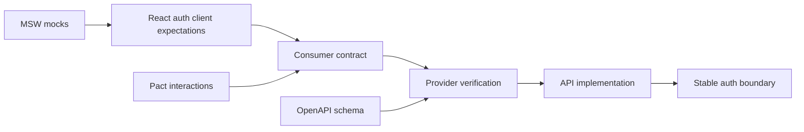
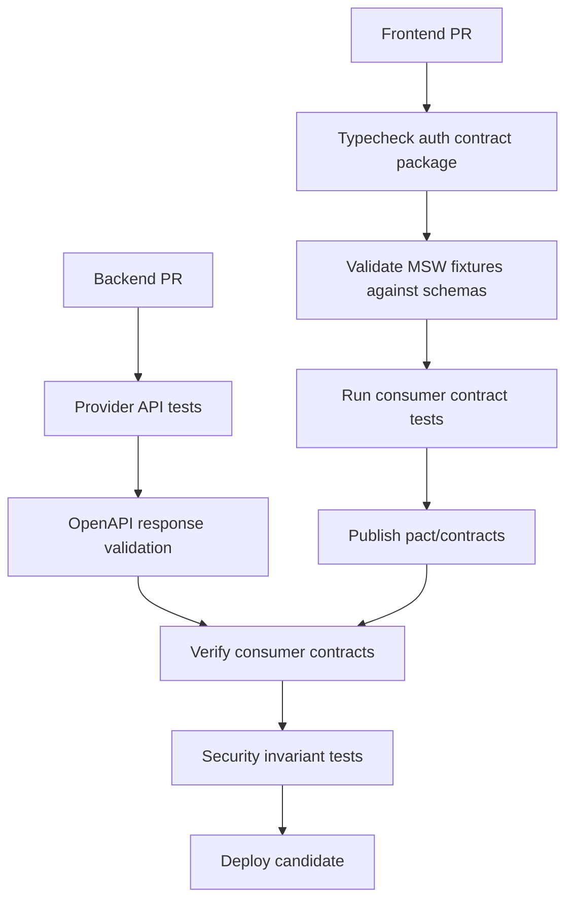

# Part 098 — Contract Testing Auth APIs

React auth becomes fragile when the frontend and backend disagree about the meaning of `/session`, `/me`, `/permissions`, `401`, `403`, tenant switch, role change, or step-up authentication.

A normal integration test proves the current implementation works together. A contract test proves that both sides keep their promises as they evolve independently.

This part builds a contract-testing model for auth APIs used by React applications. The goal is not to test every backend branch through the UI. The goal is to make the auth boundary explicit, versioned, stable, and hard to accidentally break.

## 1. What is an auth API contract?

An auth API contract is a precise agreement between frontend and server about:

- Request shape.
- Response shape.
- Status codes.
- Error/problem format.
- Headers.
- Cookie behavior.
- Cache behavior.
- Permission vocabulary.
- Session lifecycle semantics.
- Versioning and backward compatibility.

For React auth, the critical APIs usually include:

| Endpoint | Purpose |
|---|---|
| `GET /api/session` | Session bootstrap/projection. |
| `GET /api/me` | Identity/profile/account projection. |
| `GET /api/permissions` | Current actor permission projection. |
| `POST /api/auth/login` | Credential or first-party login. |
| `POST /api/auth/logout` | Logout/revocation boundary. |
| `POST /api/auth/refresh` | Token/session continuity. |
| `POST /api/auth/callback` | OAuth/OIDC callback for BFF/server apps. |
| `POST /api/auth/step-up/start` | Sensitive-action reauthentication. |
| `POST /api/auth/step-up/complete` | Complete elevated assurance. |
| `POST /api/tenant/switch` | Change active tenant/org context. |
| `GET /api/access/requests` | Access request status/projection. |

You may not have all of these. But every serious React auth app has some equivalent contract surface.

## 2. Why contract testing matters for auth

Auth APIs are deceptively small. A one-field change can break security or UX.

Examples:

| Backend change | Frontend breakage |
|---|---|
| `permissions` changes from array to object | `useCan()` fails open or hides everything. |
| `403` body drops `reason` | UI cannot explain denial or request access. |
| `/session` becomes cacheable | Data leaks between users or after logout. |
| `tenantId` removed from `/me` | Query keys lose tenant isolation. |
| `expiresAt` changes timezone format | refresh scheduler miscalculates. |
| `401` and `403` use same error code | client logs out users who merely lack permission. |
| `requiresStepUp` renamed | sensitive action flow silently breaks. |
| logout no longer returns `Clear-Site-Data`/cache behavior | stale data remains after logout. |

Contract tests turn these into build failures before they become production incidents.



## 3. Contract testing options

You can combine several approaches.

| Approach | Strength | Weakness |
|---|---|---|
| TypeScript shared types | Fast compile-time alignment | Can hide actual wire-format differences if generated incorrectly. |
| OpenAPI schema validation | Strong structural API contract | Often weak for semantic auth rules unless extended with examples/tests. |
| Consumer-driven contracts with Pact | Captures actual frontend expectations | Requires provider verification workflow. |
| MSW mocks from contract fixtures | Great frontend determinism | Mock can drift if not tied to provider/schema. |
| Integration tests against real API | High confidence | Slower, may be less focused on compatibility. |
| Snapshot tests | Easy to add | Often brittle or too broad. |

The best production setup is usually:

1. OpenAPI or schema for public shape.
2. Pact or consumer-driven contract for frontend-specific expectations.
3. MSW handlers generated or validated against the same fixtures.
4. Provider verification in CI.
5. Semantic tests for auth invariants.

## 4. Core principle: contract is not just JSON shape

A bad auth contract test only checks fields.

```ts
expect(response.body).toHaveProperty("user");
```

A good auth contract test checks semantics.

```ts
expect(response.status).toBe(200);
expect(response.headers["cache-control"]).toContain("no-store");
expect(response.body).toMatchObject({
  status: "authenticated",
  actor: {
    id: expect.any(String),
    tenantId: expect.any(String),
  },
  session: {
    expiresAt: expect.stringMatching(ISO_8601_UTC_REGEX),
    authEpoch: expect.any(Number),
  },
});
expect(response.body).not.toHaveProperty("accessToken");
expect(response.body).not.toHaveProperty("refreshToken");
```

Auth contract tests must include:

- Fields that must exist.
- Fields that must not exist.
- Header semantics.
- Status code semantics.
- Cache behavior.
- Error code taxonomy.
- Version compatibility.
- Security-sensitive non-leakage.

## 5. Contract for `/api/session`

`/api/session` should answer:

> Is there a valid app session, and what safe projection may the React app use to bootstrap itself?

It should not answer:

> Here are raw tokens and all backend identity claims.

### 5.1 Recommended response shape

```ts
export type SessionProjection =
  | {
      status: "anonymous";
      serverTime: string;
    }
  | {
      status: "authenticated";
      serverTime: string;
      actor: {
        id: string;
        displayName: string;
        tenantId: string;
        tenantSlug: string;
        authSubject: string;
      };
      session: {
        id: string;
        expiresAt: string;
        idleExpiresAt?: string;
        authEpoch: number;
        assuranceLevel: "aal1" | "aal2" | "aal3";
        impersonation?: {
          actorId: string;
          subjectId: string;
          expiresAt: string;
        };
      };
      permissionsVersion: number;
    };
```

### 5.2 Contract requirements

| Requirement | Reason |
|---|---|
| `Cache-Control: no-store` | Prevent session projection caching. |
| No raw access token | Avoid token exposure to React if BFF/cookie model. |
| No refresh token | Refresh token must never be projected to UI in BFF/cookie model. |
| `serverTime` included | Client can calculate skew. |
| `authEpoch` included | Client can invalidate stale auth projections. |
| `permissionsVersion` included | Query/permission cache invalidation. |
| Explicit anonymous state | Avoid treating transport/network failure as anonymous. |

### 5.3 Example provider contract test

```ts
it("returns authenticated session projection without raw tokens", async () => {
  const agent = await loginCookieAgent("alice@example.com");

  const response = await agent.get("/api/session");

  expect(response.status).toBe(200);
  expect(response.headers["cache-control"]).toContain("no-store");
  expect(response.body).toMatchObject({
    status: "authenticated",
    actor: {
      id: "usr_alice",
      tenantId: "tenant_a",
    },
    session: {
      expiresAt: expect.any(String),
      authEpoch: expect.any(Number),
    },
  });
  expect(response.body).not.toHaveProperty("accessToken");
  expect(response.body).not.toHaveProperty("refreshToken");
});
```

### 5.4 Anonymous session contract

```ts
it("returns explicit anonymous projection", async () => {
  const response = await request(app).get("/api/session");

  expect(response.status).toBe(200);
  expect(response.headers["cache-control"]).toContain("no-store");
  expect(response.body).toEqual({
    status: "anonymous",
    serverTime: expect.any(String),
  });
});
```

Why return `200` for anonymous `/session`? Because `/session` is a bootstrap projection endpoint. It can safely say “no session”. Protected resource endpoints should still return `401`.

## 6. Contract for `/api/me`

`/api/me` should return product-safe identity/account projection. It should not blindly forward raw IdP claims.

### 6.1 Recommended shape

```ts
export interface MeProjection {
  id: string;
  authSubject: string;
  primaryEmail?: string;
  displayName: string;
  avatarUrl?: string;
  locale?: string;
  timezone?: string;
  activeTenant: {
    id: string;
    slug: string;
    name: string;
  };
  memberships: Array<{
    tenantId: string;
    tenantSlug: string;
    displayName: string;
    membershipState: "active" | "suspended" | "pending";
  }>;
}
```

### 6.2 Contract requirements

| Requirement | Reason |
|---|---|
| No provider access token | UI does not need it. |
| No full IdP claim bag | Avoid accidental PII and unstable provider coupling. |
| Tenant membership state explicit | UI must not infer active access from historical membership. |
| Stable internal user id | Product logic should not depend on email as identity. |
| Cache scoped to auth+tenant | Prevent cross-user/tenant leakage. |

### 6.3 Negative contract

A negative contract asserts that certain data must never appear.

```ts
it("does not expose raw provider claims from /api/me", async () => {
  const response = await request(app)
    .get("/api/me")
    .set(authHeaderFor(actors.aliceOwner));

  expect(response.status).toBe(200);
  expect(response.body).not.toHaveProperty("id_token");
  expect(response.body).not.toHaveProperty("access_token");
  expect(response.body).not.toHaveProperty("refresh_token");
  expect(JSON.stringify(response.body)).not.toContain("groups_raw_from_idp");
});
```

## 7. Contract for `/api/permissions`

Permission contract is the most important React authorization API.

It should answer:

> What may the current actor do in this context, and what should the UI do with denial?

It should not answer:

> Here are raw roles; frontend, please reverse-engineer authorization.

### 7.1 Recommended shape

```ts
export interface PermissionProjection {
  actorId: string;
  tenantId: string;
  permissionsVersion: number;
  evaluatedAt: string;
  expiresAt?: string;
  actions: Record<string, PermissionDecision>;
}

export type PermissionDecision =
  | {
      allowed: true;
      constraints?: Record<string, unknown>;
      obligations?: Array<{
        type: "audit_reason_required" | "step_up_required";
        value?: unknown;
      }>;
    }
  | {
      allowed: false;
      reason:
        | "unauthenticated"
        | "forbidden"
        | "tenant_mismatch"
        | "resource_not_found"
        | "workflow_state"
        | "step_up_required"
        | "license_required"
        | "temporarily_unavailable";
      requestAccess?: {
        allowed: boolean;
        target: string;
      };
    };
```

### 7.2 Example permission response

```json
{
  "actorId": "usr_alice",
  "tenantId": "tenant_a",
  "permissionsVersion": 42,
  "evaluatedAt": "2026-07-08T03:00:00.000Z",
  "actions": {
    "case.read": { "allowed": true },
    "case.update": {
      "allowed": true,
      "constraints": {
        "editableFields": ["publicNote", "summary"]
      }
    },
    "case.approve": {
      "allowed": false,
      "reason": "step_up_required"
    },
    "case.delete": {
      "allowed": false,
      "reason": "forbidden",
      "requestAccess": {
        "allowed": true,
        "target": "case.delete:case_001"
      }
    }
  }
}
```

### 7.3 Contract tests

```ts
it("returns permission decisions keyed by action vocabulary", async () => {
  const response = await request(app)
    .get("/api/permissions?resourceType=case&resourceId=case_001")
    .set(authHeaderFor(actors.aliceOwner));

  expect(response.status).toBe(200);
  expect(response.body).toMatchObject({
    actorId: "usr_alice",
    tenantId: "tenant_a",
    permissionsVersion: expect.any(Number),
    actions: {
      "case.read": { allowed: true },
      "case.delete": {
        allowed: false,
        reason: expect.any(String),
      },
    },
  });
});
```

Test that unknown action names are not silently allowed.

```ts
it("does not allow unknown action names", async () => {
  const response = await request(app)
    .post("/api/permissions/check")
    .set(authHeaderFor(actors.aliceOwner))
    .send({ action: "case.flyToMars", resourceId: "case_001" });

  expect(response.status).toBe(400);
  expect(response.body.code).toBe("UNKNOWN_ACTION");
});
```

## 8. Contract for typed auth errors

React must distinguish:

- Not logged in.
- Logged in but forbidden.
- Session expired.
- Step-up required.
- Tenant mismatch.
- Resource hidden/not found.
- CSRF failure.
- Rate limited.
- Policy service unavailable.

Using only `message: "Error"` is not enough.

### 8.1 Recommended problem response

Use an RFC 7807-style problem format or a consistent equivalent.

```ts
export interface AuthProblem {
  type: string;
  title: string;
  status: number;
  code:
    | "UNAUTHENTICATED"
    | "SESSION_EXPIRED"
    | "FORBIDDEN"
    | "STEP_UP_REQUIRED"
    | "TENANT_MISMATCH"
    | "RESOURCE_NOT_FOUND"
    | "CSRF_FAILED"
    | "RATE_LIMITED"
    | "POLICY_UNAVAILABLE";
  detail?: string;
  correlationId: string;
  retryAfterSeconds?: number;
  stepUp?: {
    challengeUrl: string;
    returnTo: string;
  };
  requestAccess?: {
    target: string;
    allowed: boolean;
  };
}
```

### 8.2 Status semantics

| Situation | Status | Client behavior |
|---|---:|---|
| Missing/invalid session | `401` | Redirect/login boundary. |
| Expired session | `401` | Refresh or login recovery. |
| Authenticated but forbidden | `403` | Show denial; do not logout. |
| Step-up required | `403` or `401` by policy | Start step-up flow, preserve intent. |
| Cross-tenant hidden resource | `404` | Do not reveal existence. |
| Invalid workflow state | `409` | Refetch and explain current state. |
| Validation error | `422` | Form errors. |
| CSRF failure | `403` | Reload CSRF/session; log safely. |
| Rate limited | `429` | Respect `Retry-After`. |
| Policy service down | `503` | Degraded/deny-safe UI. |

### 8.3 Contract tests for errors

```ts
it("returns typed forbidden problem without logging out user", async () => {
  const response = await request(app)
    .post("/api/cases/case_002/approve")
    .set(authHeaderFor(actors.aliceOwner));

  expect(response.status).toBe(403);
  expect(response.body).toMatchObject({
    code: "FORBIDDEN",
    correlationId: expect.any(String),
  });
  expect(response.body.detail).not.toMatch(/policy trace|sql|stack/i);
});
```

```ts
it("returns typed step-up problem for sensitive action", async () => {
  const response = await request(app)
    .post("/api/cases/case_001/approve")
    .set(authHeaderFor(actors.adminTenantA));

  expect(response.status).toBe(403);
  expect(response.body).toMatchObject({
    code: "STEP_UP_REQUIRED",
    stepUp: {
      challengeUrl: expect.stringMatching(/^\/auth\/step-up/),
      returnTo: expect.stringMatching(/^\/app/),
    },
  });
});
```

## 9. Contract for cache headers

Auth API contracts must include headers, not only JSON.

### 9.1 Recommended header assertions

| Endpoint | Required header behavior |
|---|---|
| `/api/session` | `Cache-Control: no-store` |
| `/api/me` | `Cache-Control: private, no-store` or strict private policy |
| `/api/permissions` | no-store or very short private cache with versioning |
| protected resource details | private/no-store for sensitive data |
| static app shell | cacheable if no user data embedded |
| OAuth callback | no-store, no-referrer, strict redirect handling |
| logout response | no-store; may include cleanup headers depending architecture |

Example:

```ts
it.each([
  "/api/session",
  "/api/me",
  "/api/permissions",
])("sets no-store for auth projection endpoint %s", async (path) => {
  const response = await request(app)
    .get(path)
    .set(authHeaderFor(actors.aliceOwner));

  expect(response.headers["cache-control"]).toContain("no-store");
});
```

Do not let an API gateway/CDN silently override these headers.

## 10. Contract for cookies

If you use cookie-auth, contract-test the cookie attributes.

| Cookie attribute | Why it matters |
|---|---|
| `HttpOnly` | Prevent JavaScript reading the cookie. |
| `Secure` | HTTPS only. |
| `SameSite` | CSRF risk reduction. |
| `Path` | Scope cookie to expected path. |
| `Domain` omitted or constrained | Avoid unintended subdomain exposure. |
| `__Host-` prefix when possible | Strong host-only constraints. |
| `Max-Age`/`Expires` | Session lifetime semantics. |

```ts
it("sets session cookie with secure attributes", async () => {
  const response = await request(app)
    .post("/api/auth/login")
    .send({ email: "alice@example.com", password: "correct-password" });

  const setCookie = response.headers["set-cookie"].join(";");

  expect(setCookie).toContain("HttpOnly");
  expect(setCookie).toContain("Secure");
  expect(setCookie).toContain("SameSite=Lax");
  expect(setCookie).toContain("Path=/");
});
```

For BFF architectures, also assert tokens are not returned in JSON.

```ts
expect(response.body).not.toHaveProperty("accessToken");
expect(response.body).not.toHaveProperty("refreshToken");
```

## 11. Consumer-driven contract with Pact

Pact is useful when the React app and auth API are owned by different teams or deployed independently.

The React consumer defines the interaction it depends on. The provider verifies it can satisfy that interaction.

### 11.1 Consumer expectation

```ts
import { PactV3, MatchersV3 } from "@pact-foundation/pact";

const { like, regex, integer } = MatchersV3;

const provider = new PactV3({
  consumer: "case-management-react-app",
  provider: "auth-bff",
});

it("contracts authenticated session projection", async () => {
  await provider
    .given("Alice has an authenticated tenant_a session")
    .uponReceiving("a session bootstrap request")
    .withRequest({
      method: "GET",
      path: "/api/session",
      headers: {
        Accept: "application/json",
      },
    })
    .willRespondWith({
      status: 200,
      headers: {
        "Content-Type": regex("application/json.*", "application/json"),
        "Cache-Control": regex(".*no-store.*", "no-store"),
      },
      body: {
        status: "authenticated",
        serverTime: regex(ISO_8601_UTC_REGEX.source, "2026-07-08T03:00:00.000Z"),
        actor: {
          id: like("usr_alice"),
          displayName: like("Alice"),
          tenantId: like("tenant_a"),
          tenantSlug: like("acme"),
          authSubject: like("oidc|abc123"),
        },
        session: {
          id: like("sess_123"),
          expiresAt: regex(ISO_8601_UTC_REGEX.source, "2026-07-08T05:00:00.000Z"),
          authEpoch: integer(7),
          assuranceLevel: "aal1",
        },
        permissionsVersion: integer(42),
      },
    })
    .executeTest(async (mockServer) => {
      const client = new AuthApiClient({ baseUrl: mockServer.url });
      const session = await client.getSession();

      expect(session.status).toBe("authenticated");
      expect(session.actor.tenantId).toBe("tenant_a");
    });
});
```

Important: use flexible matchers for dynamic values. Do not contract exact session ids or timestamps.

### 11.2 Provider verification

Provider verification should run against the real BFF/API implementation with provider states.

Provider states are essential for auth:

- `Alice has an authenticated tenant_a session`.
- `Alice has no session`.
- `Alice session is expired`.
- `Alice lacks case.approve permission`.
- `Alice requires step-up for case.approve`.
- `Alice belongs to tenant_a but requests tenant_b object`.

Consumer contracts without provider states become too generic to catch auth bugs.

## 12. MSW as contract-backed frontend mock

MSW is excellent for frontend tests because it intercepts network calls without forcing every test to boot the backend.

But MSW handlers must not become an alternate fake universe.

Bad pattern:

```ts
http.get("/api/session", () => HttpResponse.json({ user: { role: "admin" } }));
```

This mock has no relationship to the real contract.

Better pattern:

```ts
export const sessionFixtures = {
  anonymous: {
    status: "anonymous",
    serverTime: "2026-07-08T03:00:00.000Z",
  },
  aliceAuthenticated: {
    status: "authenticated",
    serverTime: "2026-07-08T03:00:00.000Z",
    actor: {
      id: "usr_alice",
      displayName: "Alice",
      tenantId: "tenant_a",
      tenantSlug: "acme",
      authSubject: "oidc|alice",
    },
    session: {
      id: "sess_test_alice",
      expiresAt: "2026-07-08T05:00:00.000Z",
      authEpoch: 1,
      assuranceLevel: "aal1",
    },
    permissionsVersion: 42,
  },
} satisfies Record<string, SessionProjection>;
```

Then handlers reuse fixtures:

```ts
export const authHandlers = [
  http.get("/api/session", () => {
    return HttpResponse.json(sessionFixtures.aliceAuthenticated, {
      headers: {
        "Cache-Control": "no-store",
      },
    });
  }),
];
```

Add a schema validation test so fixtures cannot drift.

```ts
it("auth fixtures satisfy session schema", () => {
  for (const fixture of Object.values(sessionFixtures)) {
    expect(SessionProjectionSchema.parse(fixture)).toBeTruthy();
  }
});
```

## 13. OpenAPI and schema validation

OpenAPI is helpful for auth APIs, but be careful: many auth semantics are not captured by simple schemas.

Still, define at least:

- Response shapes.
- Required fields.
- Error schema.
- Status codes.
- Security scheme.
- Header requirements.
- Examples for `401`, `403`, `404`, `409`, `429`, `503`.

Example fragment:

```yaml
paths:
  /api/session:
    get:
      operationId: getSession
      summary: Get current session projection
      responses:
        "200":
          description: Current session projection
          headers:
            Cache-Control:
              schema:
                type: string
              example: no-store
          content:
            application/json:
              schema:
                oneOf:
                  - $ref: "#/components/schemas/AnonymousSession"
                  - $ref: "#/components/schemas/AuthenticatedSession"
```

Then validate real responses against the schema in provider tests.

```ts
it("/api/session matches OpenAPI schema", async () => {
  const response = await request(app)
    .get("/api/session")
    .set(authHeaderFor(actors.aliceOwner));

  await expectResponseToMatchOpenApi({
    method: "GET",
    path: "/api/session",
    status: response.status,
    body: response.body,
    headers: response.headers,
  });
});
```

## 14. Contract for permission vocabulary

Permission vocabulary drift is a major source of auth bugs.

Example drift:

- Backend emits `case.approve`.
- Frontend checks `cases.approve`.
- UI hides button or falls back incorrectly.
- Later someone “fixes” UI by checking role locally.

Create an action catalog.

```ts
export const actions = [
  "case.read",
  "case.update",
  "case.submit",
  "case.approve",
  "case.reject",
  "case.assign",
  "case.export",
  "case.delete",
] as const;

export type Action = (typeof actions)[number];
```

Contract-test the backend action vocabulary.

```ts
it("does not emit unknown permission action names", async () => {
  const response = await request(app)
    .get("/api/permissions?resourceType=case&resourceId=case_001")
    .set(authHeaderFor(actors.aliceOwner));

  const emitted = Object.keys(response.body.actions);

  for (const action of emitted) {
    expect(actions).toContain(action);
  }
});
```

Also test that frontend handles missing actions as denied.

```ts
it("treats missing permission action as denied", () => {
  const store = createPermissionStore({ actions: {} });

  expect(store.can("case.delete")).toMatchObject({
    allowed: false,
    reason: "unknown",
  });
});
```

## 15. Contract for tenant switching

Tenant switch is both UX and security boundary.

### 15.1 Recommended response

```ts
export interface TenantSwitchResponse {
  activeTenant: {
    id: string;
    slug: string;
    name: string;
  };
  authEpoch: number;
  permissionsVersion: number;
  cacheDirective: "clear_tenant_scoped_cache";
  redirectTo: string;
}
```

### 15.2 Contract tests

```ts
it("returns cache invalidation directive after tenant switch", async () => {
  const response = await request(app)
    .post("/api/tenant/switch")
    .set(authHeaderFor(actors.aliceOwner))
    .send({ tenantId: "tenant_a" });

  expect(response.status).toBe(200);
  expect(response.body).toMatchObject({
    activeTenant: { id: "tenant_a" },
    authEpoch: expect.any(Number),
    permissionsVersion: expect.any(Number),
    cacheDirective: "clear_tenant_scoped_cache",
    redirectTo: expect.stringMatching(/^\/app/),
  });
});
```

React uses this to clear query/router/permission cache. Backend still enforces tenant on every request.

## 16. Contract for step-up authentication

Sensitive actions should have an explicit contract when current assurance is insufficient.

### 16.1 Step-up required problem

```json
{
  "type": "https://errors.example.com/auth/step-up-required",
  "title": "Additional verification required",
  "status": 403,
  "code": "STEP_UP_REQUIRED",
  "correlationId": "req_123",
  "stepUp": {
    "challengeUrl": "/auth/step-up/start?challenge=ch_123",
    "returnTo": "/app/cases/case_001/approve",
    "requiredAssuranceLevel": "aal2"
  }
}
```

### 16.2 Contract tests

```ts
it("uses typed step-up contract for sensitive action", async () => {
  const response = await request(app)
    .post("/api/cases/case_001/approve")
    .set(authHeaderFor(actors.adminTenantA, { assuranceLevel: "aal1" }));

  expect(response.status).toBe(403);
  expect(response.body.code).toBe("STEP_UP_REQUIRED");
  expect(response.body.stepUp.challengeUrl).toMatch(/^\/auth\/step-up/);
  expect(response.body.stepUp.returnTo).toMatch(/^\/app\//);
});
```

The React app should not infer step-up from arbitrary message text.

## 17. Contract for logout

Logout contract depends on architecture, but it must be explicit.

### 17.1 Recommended behavior

| Concern | Contract |
|---|---|
| Server session | revoked/invalidated. |
| Cookie | cleared with matching path/domain. |
| Client cache | response instructs client to clear auth-scoped state. |
| IdP logout | optional, separate contract. |
| Response body | minimal, no user data. |
| Headers | no-store; optional Clear-Site-Data according to product decision. |

```ts
it("logout clears session cookie and returns cache clear directive", async () => {
  const agent = await loginCookieAgent("alice@example.com");

  const response = await agent.post("/api/auth/logout");

  expect(response.status).toBe(204);
  expect(response.headers["set-cookie"].join(";")).toMatch(/Max-Age=0|Expires=/);
  expect(response.headers["cache-control"]).toContain("no-store");
});
```

If the response is `204`, the cache clear directive may be implicit in client logout code. If you return JSON, make it explicit:

```json
{
  "status": "logged_out",
  "clientActions": ["clear_query_cache", "clear_permission_cache", "close_realtime_connections"]
}
```

## 18. Backward compatibility and schema evolution

Auth contracts need versioning because frontend/backend deployments may not be perfectly synchronized.

### 18.1 Rules

1. Adding optional fields is usually safe.
2. Removing fields is breaking.
3. Renaming fields is breaking.
4. Changing status semantics is breaking.
5. Changing error code names is breaking.
6. Changing permission action names is breaking.
7. Changing timestamp format is breaking.
8. Changing cache headers can be security-breaking even if JSON is unchanged.

### 18.2 Compatibility tests

Run frontend contract tests against:

- Current provider.
- Next provider candidate.
- Previous frontend expectations if rolling deployments exist.

For high-risk auth APIs, maintain old fixtures for at least one deployment window.

```ts
it("v1 frontend can parse v1.1 session projection", () => {
  const v11Response = {
    ...sessionFixtures.aliceAuthenticated,
    newOptionalField: "safe-to-ignore",
  };

  expect(() => parseSessionProjectionV1(v11Response)).not.toThrow();
});
```

## 19. Contract testing in monorepos vs distributed systems

### 19.1 Monorepo

A monorepo can share types, but do not stop there.

Use:

- Shared schema package.
- Provider response validation.
- Frontend fixture validation.
- API integration tests.
- Security invariant tests.

Shared types catch compile-time drift. They do not prove headers, cookies, status codes, or actual runtime serialization.

### 19.2 Distributed frontend/backend teams

Use:

- Consumer-driven contracts.
- Provider state setup.
- Pact broker or equivalent artifact exchange.
- Versioned OpenAPI specs.
- Compatibility gates before provider deploy.
- Synthetic smoke tests after deploy.

For auth APIs, provider verification should be treated as a release gate, not optional documentation.

## 20. Example CI pipeline



A good auth CI pipeline fails when:

- `/session` becomes cacheable.
- `/permissions` emits unknown actions.
- `403` loses its typed reason.
- logout fails to clear cookie.
- backend accidentally returns tokens in JSON.
- frontend mocks drift from real schema.
- provider changes break previous consumer expectations.

## 21. Contract test cases checklist

### `/api/session`

- Authenticated projection shape.
- Anonymous projection shape.
- Expired session behavior.
- Revoked session behavior.
- `Cache-Control: no-store`.
- No raw tokens.
- `serverTime` format.
- `authEpoch` present.
- `permissionsVersion` present.

### `/api/me`

- Stable internal user id.
- Active tenant projection.
- Membership list semantics.
- Suspended membership not treated as active.
- No raw IdP claim bag.
- No raw tokens.

### `/api/permissions`

- Known action vocabulary only.
- Missing action fails closed.
- Allowed decision shape.
- Denied decision shape.
- Constraint shape.
- Obligation shape.
- Request-access metadata.
- Permission version.
- Tenant id.

### Error responses

- `401` unauthenticated.
- `401` session expired.
- `403` forbidden.
- `403` step-up required.
- `404` hidden resource.
- `409` workflow conflict.
- `429` rate limited with retry info.
- `503` policy/auth dependency unavailable.
- Correlation id present.
- No stack trace/policy internals.

### Headers/cookies

- Auth projection no-store.
- Sensitive resource no-store/private.
- Cookie `HttpOnly`/`Secure`/`SameSite`.
- Logout clears cookie.
- OAuth callback no-store.
- CORS/credentials contract if cross-origin.

## 22. Common anti-patterns

### Anti-pattern: Sharing backend database model with frontend

React does not need the database `User` or `Role` model. It needs a safe projection.

### Anti-pattern: Contract only validates success responses

Most auth correctness lives in denial. Contract-test `401`, `403`, `404`, `409`, `429`, and `503`.

### Anti-pattern: Mocks are hand-written and never validated

MSW mocks must be generated from or validated against the same schemas/contracts used by provider tests.

### Anti-pattern: Status codes are treated as cosmetic

Changing `403` to `401` can make the frontend log out users incorrectly. Changing `404` to `403` can leak resource existence. Status semantics are part of the contract.

### Anti-pattern: Frontend decodes role from token instead of using permission contract

That creates tight coupling to token claims and risks stale or overbroad authorization decisions.

### Anti-pattern: Contract ignores headers

Auth contracts without headers miss cache, cookie, CORS, and security behavior.

## 23. Key takeaways

Contract testing auth APIs is not about making frontend and backend tests prettier. It is about making the trust boundary explicit.

A strong auth API contract defines:

- What React may know.
- What React must never receive.
- How the app distinguishes unauthenticated, forbidden, expired, step-up, tenant mismatch, stale state, and dependency outage.
- How cache, cookies, and headers behave.
- How permission vocabulary evolves safely.
- How mocks, schemas, consumer contracts, and provider verification stay aligned.

The best React auth code is boring because the contract is explicit. The dangerous code is clever because the frontend infers security semantics from roles, messages, token claims, or incidental response shapes.

## References

- Pact Documentation — Introduction: https://docs.pact.io/
- Pact JavaScript Consumer Tests: https://docs.pact.io/implementation_guides/javascript/docs/consumer
- Mock Service Worker Documentation: https://mswjs.io/docs/
- OpenAPI Specification: https://spec.openapis.org/oas/latest.html
- RFC 7807 — Problem Details for HTTP APIs: https://www.rfc-editor.org/rfc/rfc7807
- OWASP Authorization Cheat Sheet: https://cheatsheetseries.owasp.org/cheatsheets/Authorization_Cheat_Sheet.html
- OWASP Session Management Cheat Sheet: https://cheatsheetseries.owasp.org/cheatsheets/Session_Management_Cheat_Sheet.html
- MDN Set-Cookie: https://developer.mozilla.org/en-US/docs/Web/HTTP/Headers/Set-Cookie
