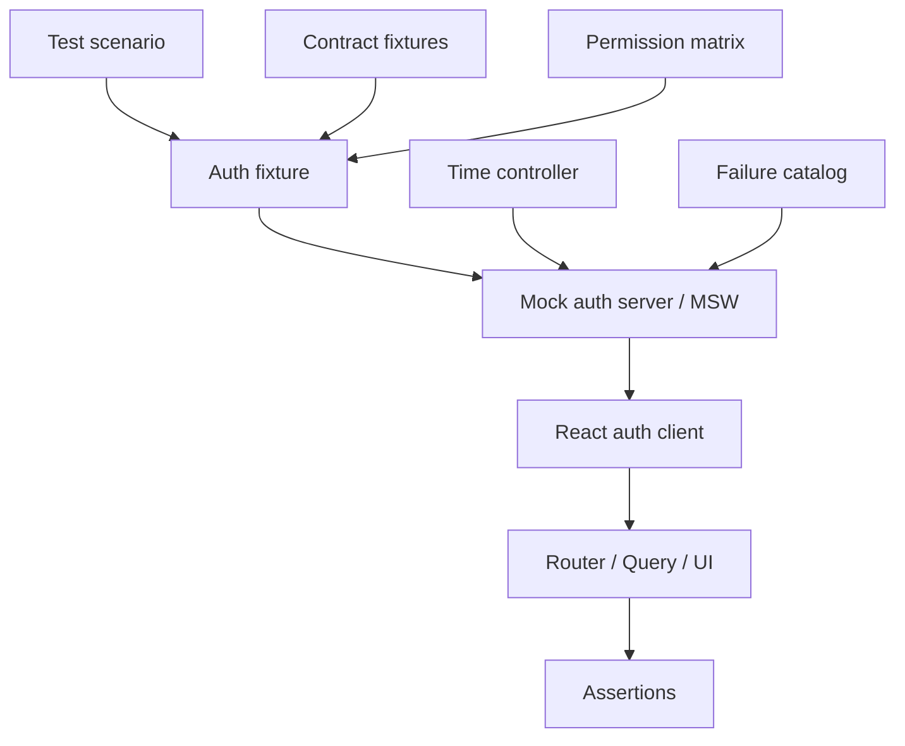
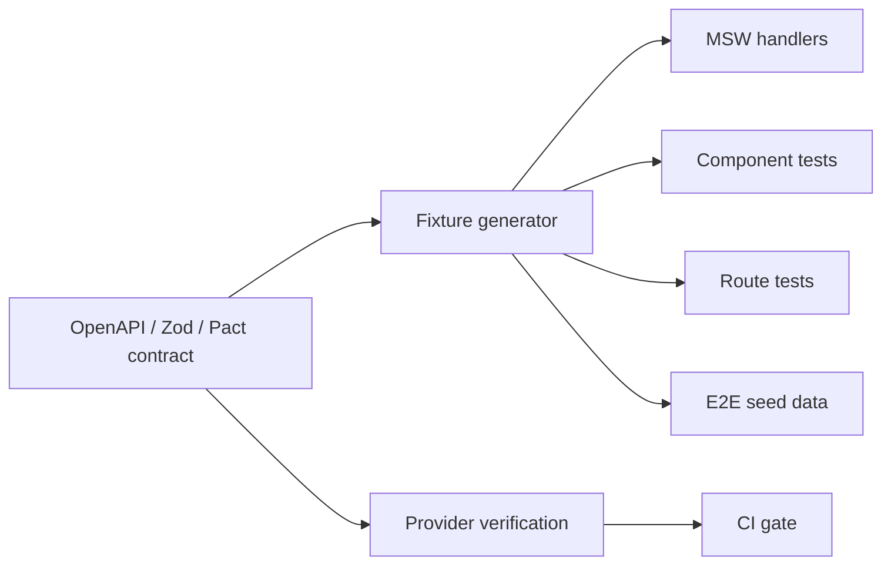

# Part 099 — Mocking Auth Without Lying

Mocking is dangerous when the mock makes the system look safer, simpler, or more deterministic than production.

For React auth, this is common. A test injects this object:

```ts
const user = { id: "u_1", role: "admin" };
```

Then the component passes.

The problem is not that the test used a mock. The problem is that the mock erased the real auth system:

- no session lifecycle,
- no tenant boundary,
- no expiry,
- no refresh,
- no `401`,
- no `403`,
- no permission version,
- no stale permission,
- no step-up state,
- no impersonation,
- no cache invalidation,
- no server-side enforcement.

A mock that erases the hard parts does not speed up engineering. It creates false confidence.

This part builds a disciplined model for mocking auth in React applications without lying about the production system.

## 1. The core rule

> Mock the transport and environment. Do not mock away the security model.

A good auth mock can simulate:

- current actor,
- active tenant,
- session status,
- permission projection,
- token expiry,
- refresh outcome,
- `401`,
- `403`,
- step-up requirement,
- logout,
- permission version change,
- network failure,
- IdP unavailable,
- policy service unavailable.

A bad auth mock says:

```ts
isAuthenticated: true,
isAdmin: true,
```

and stops there.

In a serious React app, auth mocks should be treated as small simulators.



## 2. What does “lying” mean?

An auth mock lies when it allows a state that production cannot produce, hides a state that production frequently produces, or gives the frontend information the real server would never send.

### 2.1 Common lying mocks

| Mock | Why it lies |
|---|---|
| `user.role = "admin"` | Ignores permission model, tenant scope, object scope, and role version. |
| `isAuthenticated = true` | Ignores bootstrapping, expiry, anonymous state, and degraded state. |
| Local hardcoded JWT claims | Encourages frontend authorization from decoded token claims. |
| Mock `/me` returns raw access token | Violates BFF/cookie session projection. |
| Every protected API returns `200` | Erases `401`, `403`, stale privilege, tenant mismatch, and step-up. |
| Component test bypasses auth provider entirely | Tests a component state that real app composition may never create. |
| Permission mock always sync | Hides async bootstrap, unknown state, stale cache, and invalidation. |
| Test fixtures ignore tenant | Allows cross-tenant leakage to pass unnoticed. |

### 2.2 A non-lying mock preserves invariants

A non-lying auth mock preserves these invariants:

- unknown auth state is not authenticated,
- anonymous is not an error,
- authenticated does not imply authorized,
- frontend permission is a projection, not authority,
- `401` and `403` are different,
- permission decisions are tenant-scoped,
- object-level decisions depend on resource identity,
- session expiry can occur mid-flow,
- logout clears sensitive cache,
- role/permission changes invalidate projections,
- raw refresh token is never exposed to React in BFF/cookie mode.

If a mock violates one of these, the test harness is training engineers to build insecure code.

## 3. Fidelity ladder

You do not need full production auth in every test. You need the right fidelity for the risk.

| Test level | Recommended auth mock fidelity |
|---|---|
| Pure permission unit test | Direct `can()` input matrix. |
| Component test | Real `AuthProvider` with fixture-backed store. |
| Route test | Real router loader/action with mocked server responses. |
| API client test | Mock transport with `401/403/refresh/logout` scenarios. |
| Contract test | Contract-backed fixtures verified against provider. |
| E2E happy path | Programmatic login or seeded session. |
| E2E security path | Real API/server enforcement with seeded users/resources. |
| Nightly/security suite | Real IdP/BFF/policy service or production-like environment. |

The mistake is not using low-fidelity tests. The mistake is using low-fidelity mocks for high-risk assertions.

## 4. Mock personas, not random users

A mature test suite uses stable personas.

A persona is not just a user. It is a combination of:

- identity,
- tenant membership,
- role assignments,
- object grants,
- feature entitlements,
- assurance level,
- impersonation state,
- account status,
- session lifetime,
- known resources.

### 4.1 Example persona catalog

```ts
export const personas = {
  anonymous: {
    session: { status: "anonymous" },
  },

  caseViewer: {
    actor: {
      id: "user_case_viewer",
      displayName: "Case Viewer",
      tenantId: "tenant_alpha",
    },
    session: {
      status: "authenticated",
      assuranceLevel: "aal1",
      authEpoch: 10,
      expiresAt: "2026-07-08T10:00:00Z",
    },
    permissions: {
      tenantId: "tenant_alpha",
      version: 17,
      actions: [
        "case.read",
        "case.comment.create",
      ],
    },
    resources: {
      readableCaseId: "case_100",
      forbiddenCaseId: "case_999",
    },
  },

  caseApprover: {
    actor: {
      id: "user_case_approver",
      displayName: "Case Approver",
      tenantId: "tenant_alpha",
    },
    session: {
      status: "authenticated",
      assuranceLevel: "aal2",
      authEpoch: 11,
      expiresAt: "2026-07-08T10:00:00Z",
    },
    permissions: {
      tenantId: "tenant_alpha",
      version: 21,
      actions: [
        "case.read",
        "case.approve",
        "case.reject",
        "case.audit.read",
      ],
    },
    constraints: {
      cannotApproveOwnCase: true,
    },
  },

  supportImpersonatingViewer: {
    actor: {
      id: "support_1",
      displayName: "Support Engineer",
      tenantId: "internal_support",
    },
    subject: {
      id: "user_case_viewer",
      tenantId: "tenant_alpha",
    },
    session: {
      status: "authenticated",
      assuranceLevel: "aal2",
      impersonation: {
        actorId: "support_1",
        subjectId: "user_case_viewer",
        expiresAt: "2026-07-08T09:00:00Z",
      },
    },
    permissions: {
      actions: [
        "case.read",
        "support.note.create",
      ],
      blockedActions: [
        "case.approve",
        "payment.refund",
      ],
    },
  },
} as const;
```

A persona catalog gives tests shared language:

- “viewer cannot approve case,”
- “approver requires AAL2,”
- “support impersonation cannot mutate sensitive resources,”
- “cross-tenant user cannot see tenant beta data.”

This is much better than each test inventing a user object.

## 5. Auth fixtures should have schemas

Fixtures become dangerous when they are just arbitrary JSON.

Use schema validation so mocks cannot drift from the real contract.

```ts
import { z } from "zod";

export const SessionProjectionSchema = z.discriminatedUnion("status", [
  z.object({
    status: z.literal("anonymous"),
    serverTime: z.string().datetime(),
  }),
  z.object({
    status: z.literal("authenticated"),
    serverTime: z.string().datetime(),
    actor: z.object({
      id: z.string(),
      displayName: z.string(),
      tenantId: z.string(),
      tenantSlug: z.string(),
    }),
    session: z.object({
      id: z.string(),
      expiresAt: z.string().datetime(),
      authEpoch: z.number().int().nonnegative(),
      assuranceLevel: z.enum(["aal1", "aal2", "aal3"]),
    }),
    permissionsVersion: z.number().int().nonnegative(),
  }),
]);

export function makeSessionFixture(input: unknown) {
  return SessionProjectionSchema.parse(input);
}
```

The key principle:

> Test fixtures are part of the contract surface. Validate them like production input.

## 6. Mock at the network boundary when possible

For React app tests, mocking the network boundary is often more honest than mocking hooks directly.

Bad:

```ts
vi.mock("../auth/useAuth", () => ({
  useAuth: () => ({ user: { role: "admin" } }),
}));
```

Better:

```ts
server.use(
  http.get("/api/session", () => {
    return HttpResponse.json(sessionFixtures.authenticatedViewer, {
      headers: { "Cache-Control": "no-store" },
    });
  }),
  http.get("/api/permissions", () => {
    return HttpResponse.json(permissionFixtures.viewer);
  }),
);
```

Why this is better:

- the real `AuthProvider` runs,
- the real fetch wrapper runs,
- the real cache keys run,
- the real loader/action code runs,
- `401/403` behavior can be tested,
- headers can be asserted,
- contract drift is easier to catch.

MSW is useful because it intercepts at the network level and can run in browser and Node-based tests.

## 7. Build an auth mock server, not scattered handlers

Scattered handlers become inconsistent. Instead, build a small configurable auth simulator.

```ts
import { http, HttpResponse } from "msw";

type AuthScenario =
  | { kind: "anonymous" }
  | { kind: "authenticated"; persona: keyof typeof personas }
  | { kind: "expired"; persona: keyof typeof personas }
  | { kind: "revoked"; persona: keyof typeof personas }
  | { kind: "forbidden"; persona: keyof typeof personas; reason: string }
  | { kind: "step_up_required"; persona: keyof typeof personas }
  | { kind: "policy_unavailable"; persona: keyof typeof personas };

export function authHandlers(scenario: AuthScenario) {
  return [
    http.get("/api/session", () => sessionResponse(scenario)),
    http.get("/api/permissions", () => permissionsResponse(scenario)),
    http.post("/api/auth/logout", () => logoutResponse()),
    http.post("/api/cases/:caseId/approve", ({ params }) => {
      return approveCaseResponse(scenario, String(params.caseId));
    }),
  ];
}

function sessionResponse(scenario: AuthScenario) {
  if (scenario.kind === "anonymous") {
    return HttpResponse.json(
      { status: "anonymous", serverTime: new Date().toISOString() },
      { headers: { "Cache-Control": "no-store" } },
    );
  }

  if (scenario.kind === "revoked") {
    return HttpResponse.json(
      {
        type: "https://example.com/problems/session-revoked",
        title: "Session revoked",
        status: 401,
        code: "SESSION_REVOKED",
      },
      { status: 401, headers: { "Cache-Control": "no-store" } },
    );
  }

  const persona = personas[scenario.persona];
  return HttpResponse.json(toSessionProjection(persona), {
    headers: { "Cache-Control": "no-store" },
  });
}
```

A reusable simulator makes auth scenarios explicit. Tests read like product/security cases rather than mock plumbing.

```ts
it("shows access request CTA when case approve is forbidden", async () => {
  server.use(...authHandlers({
    kind: "forbidden",
    persona: "caseViewer",
    reason: "MISSING_PERMISSION",
  }));

  renderRoute("/cases/case_100");

  await user.click(await screen.findByRole("button", { name: /approve/i }));

  expect(await screen.findByText(/you do not have approval permission/i)).toBeVisible();
  expect(screen.getByRole("button", { name: /request access/i })).toBeVisible();
});
```

## 8. Do not mock only success

Every auth mock server should have a failure catalog.

| Scenario | Status | UI expectation |
|---|---:|---|
| Anonymous session | `200` anonymous or `401` depending contract | Login prompt, no protected data. |
| Expired session | `401 SESSION_EXPIRED` | Refresh/relogin path. |
| Revoked session | `401 SESSION_REVOKED` | Forced logout, cache cleanup. |
| Missing permission | `403 MISSING_PERMISSION` | Forbidden/explanation/access request. |
| Tenant mismatch | `403 TENANT_MISMATCH` or `404` | Tenant-safe denial. |
| Step-up required | `403 STEP_UP_REQUIRED` | Reauthentication flow. |
| Policy unavailable | `503 POLICY_UNAVAILABLE` | Degraded UI, no fail-open. |
| Network timeout | transport error | Retry/degraded state. |
| Stale permission version | `409 PERMISSION_VERSION_STALE` or `403` | Invalidate/refetch permission. |

The failure cases are not edge cases. They are the contract.

## 9. Mock time, not expiry by hand

Auth bugs often live in time.

Do not hardcode “not expired” everywhere. Use fake timers or a time controller.

```ts
export class TestClock {
  private current = new Date("2026-07-08T08:00:00Z");

  now() {
    return this.current;
  }

  iso() {
    return this.current.toISOString();
  }

  advanceByMs(ms: number) {
    this.current = new Date(this.current.getTime() + ms);
  }
}
```

Use the same test clock for:

- session projection `serverTime`,
- `expiresAt`,
- refresh threshold,
- permission snapshot age,
- access request expiry,
- impersonation expiry,
- signed URL TTL,
- step-up freshness.

Example:

```ts
it("refreshes before the access token expires", async () => {
  const clock = new TestClock();

  server.use(...authHandlers({
    kind: "authenticated",
    persona: "caseViewer",
    clock,
  }));

  renderApp();

  await screen.findByText(/case viewer/i);

  clock.advanceByMs(55 * 60 * 1000);
  await act(async () => {
    await authClient.tick();
  });

  expect(refreshSpy).toHaveBeenCalledTimes(1);
});
```

Time should be an input to the auth simulator, not an uncontrolled environment.

## 10. Mock permission snapshots, not booleans

Avoid this:

```ts
render(<ApproveButton canApprove />);
```

Prefer this:

```ts
renderWithAuth(<ApproveButton caseId="case_100" />, {
  persona: "caseApprover",
  permissionSnapshot: {
    tenantId: "tenant_alpha",
    version: 21,
    decisions: {
      "case:case_100:approve": {
        allowed: true,
        reason: "ALLOWED_BY_ROLE",
        constraints: {
          requiresAssuranceLevel: "aal2",
        },
      },
    },
  },
});
```

Why?

Because real permission state has:

- resource scope,
- action vocabulary,
- tenant scope,
- decision reason,
- version,
- constraints,
- stale behavior,
- obligation/step-up requirement.

A boolean is useful only at the last rendering edge. It is too poor as a test fixture.

## 11. Keep mocks contract-backed

Mocks must be generated from or validated against the same contract used by the provider.



A practical structure:

```txt
src/
  auth/
    contract/
      session.schema.ts
      permission.schema.ts
      problem.schema.ts
    testing/
      personas.ts
      fixtures.ts
      auth-scenarios.ts
      msw-handlers.ts
      render-with-auth.tsx
      assert-auth-cleanup.ts
```

The mock should not be a separate fantasy system. It should be an executable view of the contract.

## 12. `renderWithAuth` should compose the real app boundary

A useful test helper should render the real providers as much as possible.

```tsx
import { QueryClient, QueryClientProvider } from "@tanstack/react-query";
import { AuthProvider } from "../AuthProvider";

export function renderWithAuth(
  ui: React.ReactElement,
  options: {
    scenario?: AuthScenario;
    route?: string;
  } = {},
) {
  const queryClient = new QueryClient({
    defaultOptions: {
      queries: { retry: false },
      mutations: { retry: false },
    },
  });

  server.use(...authHandlers(options.scenario ?? { kind: "anonymous" }));

  return render(
    <QueryClientProvider client={queryClient}>
      <AuthProvider>
        {ui}
      </AuthProvider>
    </QueryClientProvider>,
  );
}
```

This is better than replacing `AuthProvider` with fake context because it tests:

- bootstrap,
- query cache behavior,
- permission loading,
- unknown state,
- logout cleanup,
- error handling,
- event propagation.

There are cases where you can directly inject a permission store for a pure unit test. But route/component integration tests should go through the real boundary.

## 13. Mock router auth through loaders/actions

If production uses React Router loaders/actions for auth, tests should exercise that boundary.

Bad:

```ts
render(<ProtectedPage user={mockUser} />);
```

Better:

```ts
const Stub = createRoutesStub([
  {
    path: "/cases/:caseId",
    loader: caseLoader,
    Component: CaseRoute,
    ErrorBoundary: CaseErrorBoundary,
  },
]);

server.use(...authHandlers({ kind: "anonymous" }));

render(<Stub initialEntries={["/cases/case_100"]} />);

expect(await screen.findByRole("link", { name: /sign in/i })).toBeVisible();
```

If your production route does auth in loader/action, a component-only mock is incomplete.

## 14. Mock OAuth/OIDC carefully

Do not mock OAuth by saying:

```ts
localStorage.setItem("access_token", "fake");
```

That teaches the wrong boundary.

A better mock depends on architecture.

### 14.1 BFF/cookie session architecture

Mock:

- `/auth/login/start` returns redirect URL,
- `/auth/callback` establishes app session cookie,
- `/api/session` returns safe projection,
- no raw tokens exposed to React.

### 14.2 Pure SPA Authorization Code + PKCE architecture

Mock:

- authorization server redirect,
- `state` validation,
- `code_verifier` storage,
- token endpoint response,
- access token expiry,
- refresh behavior if applicable.

Even in tests, preserve:

- `state`,
- `nonce`,
- PKCE transaction,
- redirect URI restrictions,
- failure responses.

## 15. Model cookie mode and bearer mode separately

Cookie auth and bearer auth have different failure modes.

| Concern | Cookie session mock | Bearer token mock |
|---|---|---|
| Transport | Browser sends cookie automatically | Client adds `Authorization` header |
| Main browser-side risk | CSRF/session riding | token exposure/replay |
| Test needs | CSRF token/header/origin behavior | token injection/refresh queue |
| Logout | server revoke + cookie clear | token clear + revoke if possible |
| Cache | no-store session projection | auth-scoped query keys |

Do not use one mock for both. That creates hybrid behavior that production never has.

## 16. Mock `401` and `403` with typed problem documents

Do not return plain strings.

```ts
export function problem(
  status: 401 | 403 | 409 | 503,
  code: string,
  title: string,
  extra: Record<string, unknown> = {},
) {
  return HttpResponse.json(
    {
      type: `https://example.com/problems/${code.toLowerCase().replaceAll("_", "-")}`,
      title,
      status,
      code,
      correlationId: `test_${crypto.randomUUID()}`,
      ...extra,
    },
    {
      status,
      headers: {
        "Content-Type": "application/problem+json",
        "Cache-Control": "no-store",
      },
    },
  );
}
```

Then use it consistently:

```ts
http.post("/api/cases/:caseId/approve", () => {
  return problem(403, "MISSING_PERMISSION", "Missing permission", {
    requiredAction: "case.approve",
    accessRequest: { available: true },
  });
});
```

Your UI can then test real recovery behavior:

- show permission reason,
- offer access request,
- avoid logout for `403`,
- log correlation ID,
- invalidate permission cache if stale.

## 17. Mock stale privilege explicitly

Stale privilege is one of the most important auth bugs to test.

Scenario:

1. User loads page with `case.approve` permission.
2. Admin removes permission in another tab/system.
3. UI still shows approve button from old permission snapshot.
4. User clicks approve.
5. Server returns `403 PERMISSION_REVOKED` or `403 STALE_PERMISSION`.
6. Client invalidates permission cache and updates UI.

Test:

```ts
it("recovers when permission is revoked after render", async () => {
  const scenario = authScenario.authenticated("caseApprover");
  server.use(...authHandlers(scenario));

  renderRoute("/cases/case_100");

  await screen.findByRole("button", { name: /approve/i });

  scenario.revoke("case.approve");

  await user.click(screen.getByRole("button", { name: /approve/i }));

  expect(await screen.findByText(/your access changed/i)).toBeVisible();
  expect(screen.queryByRole("button", { name: /approve/i })).not.toBeInTheDocument();
});
```

A test suite that never models stale privilege will miss real production incidents.

## 18. Mock logout as a destructive transition

Bad logout mock:

```ts
isAuthenticated = false;
```

Real logout should cause:

- server revocation call,
- session projection changes,
- query cache cleanup,
- permission cache cleanup,
- router redirect,
- cross-tab broadcast,
- in-flight request cancellation,
- sensitive local state cleanup,
- service worker/cache cleanup if applicable.

Test helper:

```ts
export async function assertLoggedOut() {
  expect(authClient.snapshot().status).toBe("anonymous");
  expect(queryClient.getQueryCache().findAll()).toHaveLength(0);
  expect(permissionStore.snapshot().status).toBe("empty");
  expect(screen.queryByText(/confidential/i)).not.toBeInTheDocument();
}
```

## 19. Do not bypass server-side authorization in E2E

For E2E security assertions, do not mock backend enforcement.

Good E2E tests should prove:

- direct URL access is denied,
- direct API mutation is denied,
- hidden button is not the only defense,
- object ID manipulation fails,
- cross-tenant access fails,
- stale permission fails server-side,
- forbidden mutation has audit event.

Use mocks for speed in component/route tests. Use real enforcement for security E2E.

## 20. Seed data must match persona claims

If E2E tests use seeded users, keep the seed database and auth persona catalog aligned.

Example seed manifest:

```yaml
personas:
  case_viewer:
    userId: user_case_viewer
    tenantId: tenant_alpha
    roles:
      - case_viewer
    resources:
      readable:
        - case_100
      forbidden:
        - case_999

  case_approver:
    userId: user_case_approver
    tenantId: tenant_alpha
    roles:
      - case_approver
    constraints:
      cannotApproveOwnCase: true
```

The frontend fixture should not say the user can approve `case_100` if backend seed data denies it. That mismatch turns tests into noise.

## 21. Use fake auth only when the assertion is not about auth

Sometimes you can use a low-fidelity fake.

Example: testing a pure chart component that renders already-authorized data.

```tsx
render(<ComplianceTrendChart data={fixtureData} />);
```

That is fine because the assertion is not about auth.

But once the test asserts route access, menu visibility, data fetch, mutation, field visibility, or error recovery, use a realistic auth fixture.

## 22. Mocking matrix

| What you test | Mock level | Why |
|---|---|---|
| `can()` function | direct input matrix | Pure deterministic logic. |
| Button visibility | `AuthProvider` + permission fixture | Tests render behavior with real context. |
| Protected route | router loader + MSW `/session` | Tests pre-render auth boundary. |
| Form submit denial | action/API mock returns `403` | Tests recovery path. |
| Logout cleanup | real auth provider + mocked `/logout` | Tests destructive transition. |
| Token refresh queue | API client + fake clock | Tests concurrency/time. |
| BOLA/IDOR | real backend in E2E | Must prove server enforcement. |
| Contract stability | Pact/OpenAPI/provider verification | Prevents drift. |

## 23. Anti-pattern catalog

### 23.1 Mocking `useAuth()` everywhere

This makes tests fast but skips the real auth boundary.

Acceptable for pure leaf components. Dangerous for routes, layouts, data fetching, mutation, and permission cache behavior.

### 23.2 Using role strings in UI tests

```ts
renderWithUser({ role: "admin" });
```

This locks tests to implementation detail and ignores permission contracts.

Prefer:

```ts
renderWithPermissionSnapshot({
  actions: ["case.approve"],
  tenantId: "tenant_alpha",
  version: 3,
});
```

### 23.3 Using a fake JWT as authority

A fake JWT is fine as transport fixture in API client tests. It is not fine as the source of app authorization decisions.

### 23.4 Mocks that never expire

A session that never expires is not a session. It is a fantasy.

### 23.5 Mocks that cannot fail

An auth server that always returns `200` teaches the UI to have no recovery path.

### 23.6 Test-only permission bypass

```ts
if (process.env.NODE_ENV === "test") return true;
```

This is a serious design smell. It makes the test environment less secure than production and can hide regressions.

## 24. Reference test harness structure

```txt
src/testing/auth/
  auth-scenario.ts
  auth-server.ts
  auth-clock.ts
  personas.ts
  permission-fixtures.ts
  problem-fixtures.ts
  render-with-auth.tsx
  render-route-with-auth.tsx
  assert-logout-cleanup.ts
  assert-no-sensitive-dom.ts
  seed-manifest.yaml
```

### 24.1 Scenario builder

```ts
export function scenario(personaName: keyof typeof personas) {
  const persona = personas[personaName];

  return new AuthScenarioBuilder(persona)
    .withServerTime("2026-07-08T08:00:00Z")
    .withPermissionVersion(persona.permissions?.version ?? 1)
    .withSessionExpiry("2026-07-08T09:00:00Z");
}

export class AuthScenarioBuilder {
  constructor(private readonly persona: Persona) {}

  private state: AuthScenarioState = {
    revoked: false,
    policyAvailable: true,
    permissionOverrides: new Map(),
  };

  revokeSession() {
    this.state.revoked = true;
    return this;
  }

  deny(action: string, reason = "MISSING_PERMISSION") {
    this.state.permissionOverrides.set(action, { allowed: false, reason });
    return this;
  }

  requireStepUp(action: string) {
    this.state.permissionOverrides.set(action, {
      allowed: false,
      reason: "STEP_UP_REQUIRED",
      requiredAssuranceLevel: "aal2",
    });
    return this;
  }

  handlers() {
    return authHandlersFromState(this.persona, this.state);
  }
}
```

The scenario builder lets tests declare security reality in product terms.

## 25. Checklist: non-lying auth mocks

Use this checklist before trusting auth tests.

- [ ] Does the fixture include tenant context?
- [ ] Does it include permission version/epoch?
- [ ] Does it preserve unknown/anonymous/authenticated distinctions?
- [ ] Does it distinguish `401` from `403`?
- [ ] Does it include at least one stale privilege scenario?
- [ ] Does it include session expiry?
- [ ] Does it test logout cleanup?
- [ ] Does it avoid raw token projection when production uses BFF/cookies?
- [ ] Does it validate fixtures against schemas/contracts?
- [ ] Does it exercise real provider/router/query boundaries where relevant?
- [ ] Does at least one E2E suite hit real backend authorization enforcement?
- [ ] Are impossible states rejected by fixture builders?

## 26. Final mental model

Mocking auth is not about pretending auth does not exist.

It is about making auth scenarios cheap, deterministic, and explicit while preserving the real security invariants.

A good auth mock says:

> “In this test, the world behaves like this known auth scenario.”

A bad auth mock says:

> “Auth is annoying, so let us skip it.”

For top-tier engineering, the first one is acceptable. The second one is a production incident waiting to happen.

## 27. References

- Mock Service Worker documentation: https://mswjs.io/docs/
- Testing Library guiding principles: https://testing-library.com/docs/guiding-principles/
- Testing Library queries: https://testing-library.com/docs/queries/about/
- React Router testing: https://reactrouter.com/start/framework/testing
- Playwright authentication: https://playwright.dev/docs/auth
- Cypress `cy.session()`: https://docs.cypress.io/api/commands/session
- OWASP Authorization Cheat Sheet: https://cheatsheetseries.owasp.org/cheatsheets/Authorization_Cheat_Sheet.html
- OWASP Session Management Cheat Sheet: https://cheatsheetseries.owasp.org/cheatsheets/Session_Management_Cheat_Sheet.html
