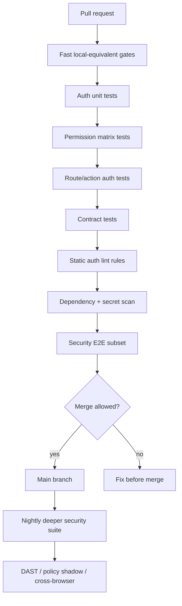

# Part 100 — CI Security Gates for Auth

A test suite catches bugs. A gate prevents known-bad changes from reaching production.

For authentication and authorization, this distinction matters. A failing permission regression test is useful. A CI gate that blocks the merge is better.

This part turns the previous testing work into a production-quality CI model for React auth.

The objective is not to add random security tools. The objective is to enforce the invariants of the auth architecture:

- deny-by-default,
- permission validated per request,
- no frontend-only authorization,
- no token leakage,
- no session cache leak,
- no open redirect,
- no stale privilege fail-open,
- no unsafe dependency or secret exposure,
- no unreviewed policy change,
- no unaudited sensitive-action behavior change.

## 1. Security gates are executable architecture decisions

An ADR says:

> We use BFF with HttpOnly session cookies. React must never receive refresh tokens.

A CI gate says:

```txt
Build failed: frontend code references "refreshToken" in src/app.
```

An ADR says:

> Authorization must be permission-based, not role-string checks in components.

A CI gate says:

```txt
Build failed: found direct role check user.role === "admin" outside policy adapter.
```

A CI gate is architecture governance with teeth.



## 2. Gate taxonomy

Not every gate should run at the same time.

| Gate type | Runs on | Purpose |
|---|---|---|
| Pre-commit/pre-push | Developer machine | Cheap formatting, lint, typecheck, targeted tests. |
| PR fast gate | Every PR | Must be deterministic and fast enough to block merge. |
| PR security gate | Every auth-sensitive PR or path filter | Auth matrix, contract, static checks. |
| Main branch gate | After merge | Full integration confidence. |
| Nightly gate | Scheduled | Slow E2E, DAST, dependency audit, browser matrix. |
| Release gate | Before deploy | Production readiness, migration check, policy version approval. |
| Emergency hotfix gate | Hotfix branch | Reduced but never zero auth/security gates. |

The correct question is not “can we run everything on every PR?”

The correct question is:

> Which failures are too dangerous to discover after merge?

## 3. Define auth-critical paths

CI should know which files are auth-critical.

```yaml
# .github/auth-critical-paths.yml
auth_critical:
  - src/auth/**
  - src/security/**
  - src/router/**
  - src/routes/**
  - src/api/**
  - src/permissions/**
  - src/policy/**
  - src/design-system/Authorized*.tsx
  - src/design-system/Permission*.tsx
  - src/features/**/permissions.ts
  - openapi/auth.yaml
  - contracts/auth/**
  - tests/auth/**
  - tests/security/**
```

Path awareness lets you scale gate cost without losing coverage.

But be careful: auth bugs often appear outside obvious auth files.

Examples:

- a table action added without `allowedActions`,
- a route added without auth metadata,
- a form submit added without action-level authorization,
- a new API client bypasses central auth wrapper,
- a page logs session projection to analytics.

So path filters optimize. They do not replace baseline gates.

## 4. Minimum PR gates for React auth

Every PR should run at least:

```txt
format/check
lint
typecheck
unit tests
component tests
route tests
contract fixture validation
auth static lint
secret scan
dependency vulnerability scan / lockfile integrity
```

Auth-sensitive PRs should additionally run:

```txt
permission matrix regression
security test cases subset
provider contract verification
E2E auth smoke
open redirect tests
cache/logout cleanup tests
```

Main/nightly should run:

```txt
full E2E auth matrix
cross-browser E2E
DAST against deployed preview
SAST / CodeQL / Semgrep custom rules
SBOM generation
container/image scan if applicable
policy shadow evaluation
access-control migration checks
```

## 5. Auth unit gate

Auth unit tests cover deterministic logic:

- auth state machine,
- permission `can()` function,
- redirect URL normalization,
- CSRF token validation helper,
- cookie/header utilities,
- tenant context derivation,
- cache key generation,
- field-level permission projection,
- decision reason mapping,
- error taxonomy mapping.

Gate rule:

> Any change to `src/auth`, `src/permissions`, `src/router`, `src/api`, or route metadata must run auth unit tests.

Example package scripts:

```json
{
  "scripts": {
    "test:auth:unit": "vitest run src/auth src/permissions src/security tests/auth/unit",
    "test:auth:watch": "vitest src/auth src/permissions src/security tests/auth/unit"
  }
}
```

## 6. Permission matrix gate

A permission matrix gate blocks accidental authorization drift.

Example matrix:

```yaml
cases:
  - name: viewer cannot approve case
    persona: case_viewer
    resource: case_100
    action: case.approve
    expected: denied
    reason: MISSING_PERMISSION

  - name: approver can approve assigned case
    persona: case_approver
    resource: case_100
    action: case.approve
    expected: allowed

  - name: approver cannot approve own case
    persona: case_approver
    resource: case_owned_by_approver
    action: case.approve
    expected: denied
    reason: SEPARATION_OF_DUTIES

  - name: cross tenant access denied
    persona: tenant_alpha_viewer
    resource: tenant_beta_case
    action: case.read
    expected: denied
    reason: TENANT_MISMATCH
```

Runner:

```ts
import matrix from "./permission-matrix.yaml";

for (const testCase of matrix.cases) {
  test(testCase.name, async () => {
    const decision = await policy.check({
      subject: persona(testCase.persona),
      action: testCase.action,
      resource: resource(testCase.resource),
      context: testContext(),
    });

    expect(decision.allowed).toBe(testCase.expected === "allowed");

    if (!decision.allowed) {
      expect(decision.reason).toBe(testCase.reason);
    }
  });
}
```

Gate rule:

> Permission matrix changes require review from an auth/policy owner.

Why? Because changing the matrix is effectively changing the product security model.

## 7. Route metadata gate

If the app uses route metadata for auth, CI should reject routes without explicit auth posture.

Allowed route postures:

```ts
export type RouteAuthPosture =
  | { kind: "public" }
  | { kind: "anonymous_only" }
  | { kind: "authenticated" }
  | { kind: "permission"; action: string; resource: string }
  | { kind: "step_up"; action: string; requiredAssuranceLevel: "aal2" | "aal3" };
```

Bad route:

```ts
export const handle = {
  title: "Admin Users",
};
```

Good route:

```ts
export const handle = {
  title: "Admin Users",
  auth: {
    kind: "permission",
    action: "user.manage",
    resource: "tenant",
  },
};
```

Static check:

```ts
for (const route of routeManifest) {
  if (!route.handle?.auth) {
    throw new Error(`Route ${route.path} has no explicit auth metadata`);
  }
}
```

Gate rule:

> Every route must declare whether it is public, anonymous-only, authenticated, permission-protected, or step-up protected.

This prevents accidental public routes.

## 8. Forbidden-pattern gate

Some patterns are risky enough to block automatically.

### 8.1 Token storage patterns

Block these unless explicitly allowlisted:

```txt
localStorage.setItem("access_token"
localStorage.setItem("refresh_token"
sessionStorage.setItem("refresh_token"
document.cookie = "access_token"
```

### 8.2 Frontend authorization anti-patterns

Block these outside policy adapter/tests:

```txt
user.role === "admin"
roles.includes("admin")
decodedJwt.permissions.includes(...)
JSON.parse(atob(token.split(".")[1]))
```

### 8.3 Unsafe rendering/logging

Block or review:

```txt
dangerouslySetInnerHTML
console.log(session)
analytics.track("login", session)
Sentry.captureException(error, { extra: { token } })
```

### 8.4 Open redirect patterns

Block direct redirect from query parameter:

```txt
window.location.href = searchParams.get("returnTo")
redirect(request.url.searchParams.get("returnTo"))
navigate(searchParams.get("next"))
```

The gate should allow safe wrappers:

```ts
safeRedirect(returnTo)
normalizeInternalReturnTo(returnTo)
```

## 9. Custom ESLint/Semgrep rules

General linters do not understand your auth architecture. Add custom rules.

Example Semgrep rule for direct role checks:

```yaml
rules:
  - id: no-direct-role-check-in-react
    message: "Use permission decision contract instead of direct role check."
    severity: ERROR
    languages: [typescript, tsx]
    patterns:
      - pattern-either:
          - pattern: $USER.role === "admin"
          - pattern: $USER.role == "admin"
          - pattern: $ROLES.includes("admin")
    paths:
      exclude:
        - src/permissions/**
        - tests/**
```

Example Semgrep rule for token local storage:

```yaml
rules:
  - id: no-auth-token-localstorage
    message: "Do not store auth tokens in localStorage/sessionStorage."
    severity: ERROR
    languages: [typescript, tsx, javascript, jsx]
    pattern-either:
      - pattern: localStorage.setItem($KEY, $VALUE)
      - pattern: sessionStorage.setItem($KEY, $VALUE)
    metavariable-regex:
      metavariable: $KEY
      regex: ".*(token|access|refresh|jwt).*"
```

Static gates are not perfect. They are tripwires.

## 10. Contract gate

Auth API contracts should be verified in CI.

Gate should check:

- `/api/session` shape,
- `/api/me` shape,
- `/api/permissions` shape,
- typed `401/403` problem documents,
- `Cache-Control: no-store`,
- no raw token projection,
- permission vocabulary compatibility,
- version compatibility,
- logout response behavior,
- step-up response behavior.

Example scripts:

```json
{
  "scripts": {
    "test:auth:contracts": "vitest run tests/contracts/auth",
    "test:auth:pact": "pact-broker can-i-deploy && vitest run tests/pact"
  }
}
```

For many teams, the most practical CI gate is:

1. validate fixtures against schema,
2. run frontend contract tests with MSW generated from schema,
3. verify backend/provider contract in integration environment,
4. publish contract artifact.

## 11. Security E2E gate

A minimal PR E2E auth gate should include:

- login works,
- logout clears UI/cache,
- anonymous direct route redirects/denies,
- viewer cannot perform admin action,
- direct API mutation without permission fails,
- cross-tenant object access fails,
- open redirect payload is rejected,
- session expiry recovers safely.

These tests should run against a deployed preview or local full-stack environment.

Example Playwright categories:

```ts
test.describe("auth security smoke", () => {
  test("anonymous user cannot open protected case route", async ({ page }) => {
    await page.goto("/cases/case_100");
    await expect(page.getByRole("link", { name: /sign in/i })).toBeVisible();
  });

  test("viewer cannot approve case by direct API call", async ({ request }) => {
    const viewer = await loginAs("case_viewer");

    const response = await request.post("/api/cases/case_100/approve", {
      headers: viewer.headers,
    });

    expect(response.status()).toBe(403);
  });

  test("returnTo rejects external URL", async ({ page }) => {
    await page.goto("/login?returnTo=https://evil.example/phish");
    await expect(page).not.toHaveURL(/evil\.example/);
  });
});
```

Do not rely only on UI visibility. Security E2E must test direct API denial.

## 12. Dependency and lockfile gate

Auth code is sensitive to dependency compromise.

Minimum gates:

- install with lockfile enforcement,
- fail on unexpected lockfile change in protected branches,
- dependency vulnerability scan,
- license policy if required,
- package provenance/signature check where available,
- review gate for auth SDK major/minor upgrade,
- SBOM artifact for release.

Example scripts:

```json
{
  "scripts": {
    "ci:install": "npm ci",
    "security:audit": "npm audit --audit-level=high",
    "security:sbom": "cyclonedx-npm --output-file sbom.json"
  }
}
```

For auth-sensitive dependencies, define ownership:

```yaml
auth_sensitive_dependencies:
  - "@auth0/auth0-react"
  - "@clerk/clerk-react"
  - "@azure/msal-browser"
  - "aws-amplify"
  - "jose"
  - "jsonwebtoken"
  - "dompurify"
  - "@tanstack/react-query"
```

Gate rule:

> Changes to auth-sensitive dependencies require security/architecture review.

## 13. Secret scanning gate

A React repo should not contain:

- client secrets,
- private keys,
- refresh tokens,
- access tokens,
- session cookies,
- IdP management tokens,
- `.env.production` secrets,
- signing keys,
- test credentials with production access.

CI should run secret scanning before build artifacts are published.

Also scan generated files:

- build output,
- source maps,
- test reports,
- Playwright traces,
- screenshots,
- logs,
- coverage artifacts.

Auth failures often leak secrets into traces.

## 14. Source map and artifact gate

Source maps are useful. They can also expose:

- internal route names,
- feature flags,
- authorization vocabulary,
- comments,
- build-time environment variables,
- stack traces,
- code paths for admin/internal tools.

Gate should check:

- public source maps are intentional,
- source maps are uploaded to private error monitoring if needed,
- source maps are not accidentally deployed publicly,
- Playwright traces are not publicly accessible,
- CI artifacts expire,
- screenshots/videos do not contain sensitive test data.

Example artifact policy:

```yaml
artifacts:
  retention_days: 7
  include_on_failure_only: true
  redact:
    - authorization
    - cookie
    - x-csrf-token
    - set-cookie
```

## 15. Cache-control gate

Authenticated endpoints must not become cacheable accidentally.

Gate checks:

```txt
GET /api/session -> Cache-Control contains no-store
GET /api/me -> Cache-Control contains no-store or private with explicit policy
GET /api/permissions -> Cache-Control contains no-store/private and version semantics
POST /api/auth/logout -> clears relevant cookies/cache
protected HTML SSR response -> no shared caching unless explicitly safe
```

Example test:

```ts
it("session projection is not cacheable", async () => {
  const response = await app.get("/api/session").set(authHeaders.viewer);

  expect(response.headers["cache-control"]).toMatch(/no-store/i);
  expect(JSON.stringify(response.body)).not.toMatch(/refreshToken|accessToken/i);
});
```

## 16. CSRF gate

For cookie/BFF auth, CI should test:

- unsafe methods require CSRF protection,
- missing CSRF token fails,
- invalid CSRF token fails,
- cross-site Origin fails,
- safe methods do not mutate state,
- GraphQL mutations require CSRF protection,
- file upload intent requires CSRF protection,
- logout behavior is intentionally defined.

Example:

```ts
it("rejects mutation without CSRF token", async () => {
  const response = await app
    .post("/api/cases/case_100/approve")
    .set(cookieSessionFor("case_approver"));

  expect(response.status).toBe(403);
  expect(response.body.code).toBe("CSRF_TOKEN_MISSING");
});
```

## 17. Open redirect gate

Run a fixed payload set against login, callback, step-up, invite, and logout routes.

Payloads:

```txt
https://evil.example
//evil.example
///evil.example
/%2f%2fevil.example
\evil.example
https:evil.example
https://app.example.evil.example
https://app.example@evil.example
%09https://evil.example
```

Expected result:

- never navigate to external attacker origin,
- fallback to safe internal default,
- preserve only valid internal relative paths,
- reject protocol-relative URLs,
- log suspicious redirect attempt.

## 18. BOLA/IDOR gate

BOLA tests must hit the backend, not just UI.

Gate cases:

- user reads object from another tenant,
- user mutates object from another tenant,
- user accesses object by guessed ID,
- user downloads file by object ID,
- user approves resource they can view but not approve,
- user performs bulk mutation containing mixed authorized/unauthorized IDs,
- user accesses soft-deleted/archived/restricted resource.

If your product has a case-management workflow, add state-specific authorization:

- draft cannot be escalated by viewer,
- assigned investigator cannot approve own recommendation,
- closed case cannot be modified,
- reopened case requires special permission,
- sensitive case requires step-up.

## 19. Policy change gate

Policy changes deserve their own governance.

Gate checks:

- policy syntax validates,
- policy unit tests pass,
- permission matrix passes,
- policy diff is generated,
- high-risk grants are highlighted,
- separation-of-duties rules still pass,
- shadow evaluation is available for risky migrations,
- policy owner approval exists.

Example policy diff report:

```txt
Policy diff: access-control-policy v42 -> v43

Newly allowed:
  - role:case_supervisor -> case.reopen
  - role:support_agent -> case.read.sensitive [requires masking=true]

Newly denied:
  - role:case_reviewer -> case.comment.delete

High-risk changes:
  - support_agent gained access to sensitive case read projection
  - requires security owner approval
```

A code diff shows syntax. A policy diff shows impact.

## 20. CI workflow example

```yaml
name: Auth Security Gates

on:
  pull_request:
    branches: [main]
  push:
    branches: [main]

jobs:
  auth-fast:
    runs-on: ubuntu-latest
    steps:
      - uses: actions/checkout@v4
      - uses: actions/setup-node@v4
        with:
          node-version: 22
          cache: npm
      - run: npm ci
      - run: npm run typecheck
      - run: npm run lint
      - run: npm run test:auth:unit
      - run: npm run test:auth:components
      - run: npm run test:auth:routes
      - run: npm run test:auth:contracts

  auth-static-security:
    runs-on: ubuntu-latest
    steps:
      - uses: actions/checkout@v4
      - run: npm ci
      - run: npm run security:semgrep:auth
      - run: npm run security:secrets
      - run: npm run security:audit
      - run: npm run security:route-metadata
      - run: npm run security:forbidden-patterns

  auth-e2e-smoke:
    runs-on: ubuntu-latest
    needs: [auth-fast, auth-static-security]
    steps:
      - uses: actions/checkout@v4
      - run: npm ci
      - run: npm run build
      - run: npm run test:e2e:auth-smoke
```

This is a skeleton. In production, add preview deployment, artifacts, caching, secret masking, and environment isolation.

## 21. Gate severity model

Not every finding should have the same severity.

| Severity | Example | Gate behavior |
|---|---|---|
| Critical | refresh token exposed to React bundle | hard fail, block merge. |
| Critical | permission matrix newly allows cross-tenant access | hard fail, security owner required. |
| High | route missing auth metadata | hard fail. |
| High | direct role check in UI | hard fail or require explicit waiver. |
| Medium | missing denial reason in UI | block auth-sensitive PR or require ticket. |
| Medium | CSP report-only violation increase | warn on PR, block release if trend persists. |
| Low | test fixture naming drift | warn/fix soon. |

A useful gate has clear severity and remediation. A noisy gate gets ignored.

## 22. Waivers must be explicit and expiring

Sometimes a gate needs a temporary exception.

A waiver should include:

- finding ID,
- affected path,
- reason,
- risk owner,
- expiry date,
- remediation issue,
- compensating control.

Example:

```yaml
waivers:
  - id: no-direct-role-check-in-react
    path: src/legacy/AdminPanel.tsx
    reason: Legacy admin migration; route is server-enforced and behind temporary admin console.
    owner: platform-security
    expires: 2026-08-01
    remediation: SEC-4219
```

Gate rule:

> Expired waivers fail the build.

Without expiry, waivers become undocumented architecture drift.

## 23. Observability gate

CI should verify that critical auth events are instrumented.

Examples:

- login success/failure,
- logout,
- session refresh failure,
- permission denied,
- step-up required/completed/failed,
- tenant switch,
- impersonation start/end,
- access request created/approved/denied,
- suspicious redirect attempt,
- CSRF failure,
- BOLA denial,
- policy unavailable.

Instrumentation test:

```ts
it("emits audit event when permission is denied", async () => {
  const response = await app
    .post("/api/cases/case_100/approve")
    .set(authHeaders.viewer);

  expect(response.status).toBe(403);
  expect(auditSink.events()).toContainEqual(
    expect.objectContaining({
      type: "authorization.denied",
      actorId: "user_case_viewer",
      action: "case.approve",
      resourceId: "case_100",
    }),
  );
});
```

If a denial is security-relevant, it should be observable.

## 24. Release readiness gate

Before release, check:

- auth migrations applied,
- session schema compatible,
- permission contract backward-compatible,
- policy version deployed in correct order,
- provider callback URLs correct,
- cookie domain/path/SameSite correct,
- CSP/header config correct,
- environment variables present and scoped,
- source maps handled safely,
- rollback plan exists,
- forced logout plan exists if session format changed,
- incident runbook updated.

Release gate should produce a signed artifact:

```json
{
  "release": "2026.07.08.1",
  "authChecks": {
    "permissionMatrix": "passed",
    "contractVerification": "passed",
    "securityE2E": "passed",
    "dependencyScan": "passed",
    "secretScan": "passed",
    "routeMetadata": "passed"
  },
  "policyVersion": 43,
  "sessionSchemaVersion": 7,
  "approvedBy": ["platform-security", "frontend-architecture"]
}
```

For regulated systems, this artifact becomes part of defensibility.

## 25. Metrics for gate health

Measure the gates themselves.

| Metric | Why it matters |
|---|---|
| gate duration | Slow gates get bypassed. |
| flake rate | Flaky gates destroy trust. |
| failure reason distribution | Shows where engineering needs support. |
| waiver count | Measures architecture debt. |
| expired waiver count | Governance failure. |
| auth regression escapes | Measures gate effectiveness. |
| mean time to fix gate failure | Measures usability. |
| false positive rate | Measures rule quality. |

Security gates must be engineered products, not punishment mechanisms.

## 26. Practical rollout plan

Do not introduce every gate at once.

### Step 1 — Visibility mode

Run checks without blocking:

- forbidden-pattern scan,
- route metadata report,
- permission matrix report,
- contract drift report.

### Step 2 — Block critical violations

Block only:

- token/secret leakage,
- missing route auth metadata for new routes,
- permission matrix failures,
- contract shape breakage,
- open redirect test failure.

### Step 3 — Expand to high-confidence static rules

Add:

- direct role check ban,
- unsafe localStorage token usage,
- missing `no-store` on session endpoints,
- auth SDK/dependency approval.

### Step 4 — Add release and nightly gates

Add:

- full auth E2E,
- DAST,
- cross-browser,
- policy shadow evaluation,
- SBOM/archive artifacts.

### Step 5 — Continuous tuning

Prune noisy rules. Improve fixtures. Add regression cases for real incidents.

## 27. Final Phase 10 checklist

By the end of Phase 10, a serious React auth codebase should have:

- [ ] auth state machine tests,
- [ ] permission logic unit tests,
- [ ] component auth UI tests,
- [ ] router loader/action auth tests,
- [ ] E2E auth smoke tests,
- [ ] authorization regression matrix,
- [ ] security test cases for XSS/CSRF/open redirect/BOLA/stale privilege,
- [ ] auth API contract tests,
- [ ] non-lying auth mocks,
- [ ] CI gates for auth-critical invariants,
- [ ] static rules for forbidden patterns,
- [ ] dependency/secret/source-map artifact controls,
- [ ] release readiness gate,
- [ ] waiver process with expiry.

Testing answers: “does it work?”

CI gates answer: “can this known-dangerous change reach production?”

For auth, you need both.

## 28. References

- OWASP Application Security Verification Standard: https://owasp.org/www-project-application-security-verification-standard/
- OWASP Web Security Testing Guide: https://owasp.org/www-project-web-security-testing-guide/
- OWASP Authorization Cheat Sheet: https://cheatsheetseries.owasp.org/cheatsheets/Authorization_Cheat_Sheet.html
- OWASP Session Management Cheat Sheet: https://cheatsheetseries.owasp.org/cheatsheets/Session_Management_Cheat_Sheet.html
- OWASP CSRF Prevention Cheat Sheet: https://cheatsheetseries.owasp.org/cheatsheets/Cross-Site_Request_Forgery_Prevention_Cheat_Sheet.html
- OWASP Dependency-Track: https://owasp.org/www-project-dependency-track/
- GitHub CodeQL documentation: https://codeql.github.com/docs/
- Semgrep documentation: https://semgrep.dev/docs/
- Playwright authentication documentation: https://playwright.dev/docs/auth
- Mock Service Worker documentation: https://mswjs.io/docs/
