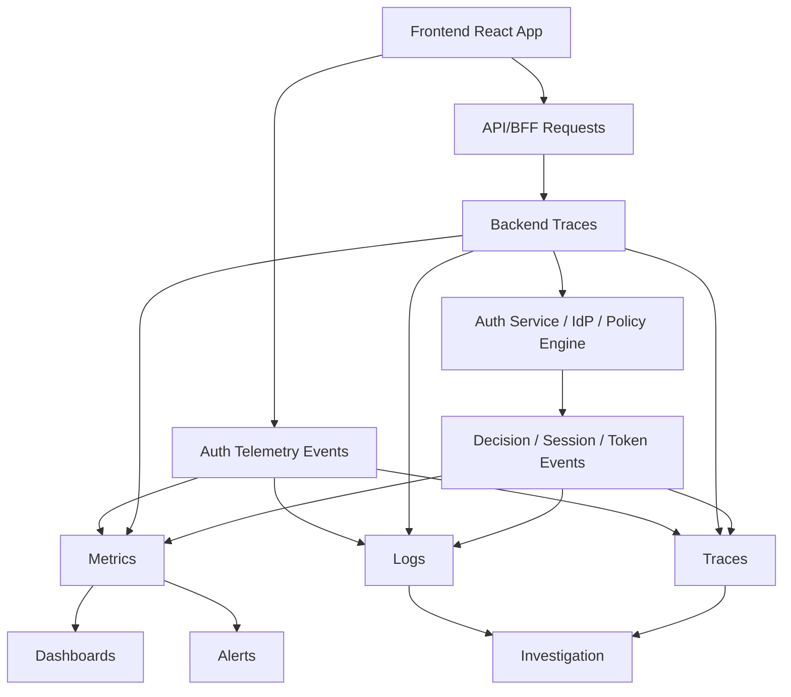
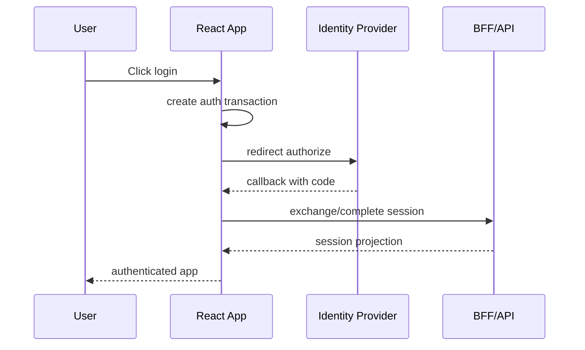
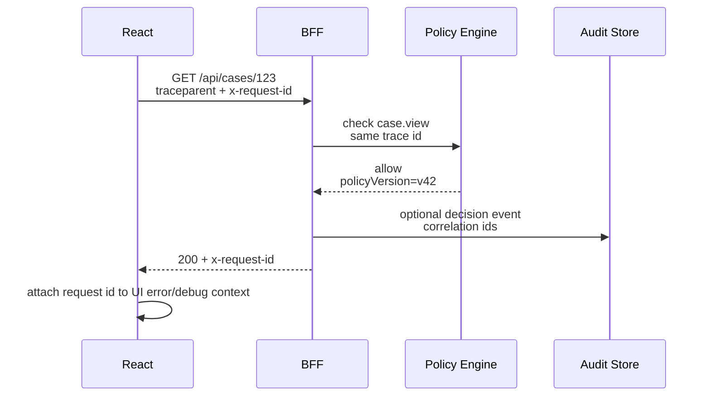

# Part 101 — Auth Observability

Auth observability is the ability to answer production questions about authentication and authorization without guessing, reproducing manually, or asking users to send screenshots.

A weak React auth system fails silently:

- login sometimes loops,
- a user is suddenly logged out,
- a permission appears for one tab but not another,
- a refresh storm overloads the API,
- a tenant switch shows stale data,
- users report “I cannot open the case,”
- the backend sees `403`, the frontend shows a spinner,
- support cannot explain whether the denial was correct.

A strong auth system treats every auth transition as an observable state change.

The goal is not “log everything.” The goal is to create enough safe telemetry to preserve the system invariants:

- every request is associated with an auth context,
- every denial has a machine-readable reason,
- every login and logout has a traceable lifecycle,
- every refresh failure is distinguishable from API downtime,
- every suspicious auth pattern is visible,
- every support/debugging path avoids leaking credentials or PII,
- every dashboard helps engineering answer a specific operational question.

OWASP Logging guidance says application logs should capture enough information for monitoring and analysis, including the classic `when`, `where`, `who`, and `what` dimensions. The important constraint for auth is that observability must not become a data leak. Never log access tokens, refresh tokens, ID tokens, session IDs, authorization codes, CSRF tokens, password reset tokens, magic links, or raw cookies.

Reference anchors:

- OWASP Logging Cheat Sheet: https://cheatsheetseries.owasp.org/cheatsheets/Logging_Cheat_Sheet.html
- OWASP Logging Vocabulary Cheat Sheet: https://cheatsheetseries.owasp.org/cheatsheets/Logging_Vocabulary_Cheat_Sheet.html
- OWASP Authentication Cheat Sheet: https://cheatsheetseries.owasp.org/cheatsheets/Authentication_Cheat_Sheet.html
- OWASP Authorization Cheat Sheet: https://cheatsheetseries.owasp.org/cheatsheets/Authorization_Cheat_Sheet.html
- OpenTelemetry HTTP Semantic Conventions: https://opentelemetry.io/docs/specs/semconv/http/

---

## 1. Observability Is Not Debug Logging

Debug logging answers: “What happened in this code path?”

Observability answers: “What is the system doing, and why?”

For React auth, the meaningful observability questions are:

1. **Authentication health** — Are users able to login?
2. **Session continuity** — Are sessions stable after login?
3. **Authorization correctness** — Are users denied for valid reasons?
4. **Privilege freshness** — Are permission changes reflected quickly?
5. **Tenant isolation** — Are tenant-scoped requests and caches aligned?
6. **Security posture** — Are suspicious patterns increasing?
7. **User impact** — Which flows, routes, tenants, browsers, and releases are affected?

A console log inside `AuthProvider` cannot answer those.

You need structured events, metrics, traces, correlation IDs, sampling rules, redaction, and dashboards.

---

## 2. The Auth Observability Model

Think in three layers.



Each layer has a different job.

| Layer | Main use | Example |
|---|---|---|
| Metrics | Trends and alerts | Login success rate dropped below 98%. |
| Logs | Investigation and evidence | User denied `case.approve` because `case.state=closed`. |
| Traces | Causal path | Route loader → BFF → policy engine → downstream API. |
| Audit events | Compliance/security history | Admin granted role `case_supervisor` to user. |

Do not merge all four into one concept.

A metric is aggregated. A log is investigative. A trace is causal. An audit event is evidence.

---

## 3. What React Should Emit

The frontend should not emit secrets or authoritative security decisions. It should emit user-observable auth transitions and request context.

Good frontend events:

```ts
export type FrontendAuthTelemetryEvent =
  | {
      type: 'auth.session.bootstrap.started';
      routeId: string;
      authEpoch?: string;
    }
  | {
      type: 'auth.session.bootstrap.completed';
      result: 'anonymous' | 'authenticated' | 'expired' | 'degraded';
      durationMs: number;
      routeId: string;
      authEpoch?: string;
      tenantIdHash?: string;
    }
  | {
      type: 'auth.login.redirect.started';
      provider: 'oidc' | 'saml' | 'password' | 'passkey' | 'unknown';
      reason: 'explicit_login' | 'session_required' | 'step_up_required';
      returnToKind: 'internal_path' | 'blocked_external' | 'none';
    }
  | {
      type: 'auth.logout.client.completed';
      reason: 'user_clicked' | 'session_revoked' | 'cross_tab' | 'forced' | 'tenant_switch';
      clearedQueryCache: boolean;
      clearedPermissionCache: boolean;
    }
  | {
      type: 'auth.permission.ui.denied';
      action: string;
      resourceType?: string;
      reasonCode: string;
      routeId?: string;
      decisionSource: 'projection' | 'server_error' | 'unknown';
    }
  | {
      type: 'auth.redirect.loop.prevented';
      routeId: string;
      attemptedCount: number;
    };
```

Bad frontend events:

```ts
telemetry.track('token', { accessToken });
telemetry.track('cookie', { documentCookie: document.cookie });
telemetry.track('user', { email, fullJwt, rawClaims });
telemetry.track('permissionTrace', { fullPolicyInput });
```

The frontend is the worst place to collect sensitive auth detail. Browser telemetry is exposed to SDKs, extensions, proxies, network tooling, and accidental vendor ingestion.

Use stable identifiers or hashes where possible. Prefer `userIdHash`, `tenantIdHash`, `sessionIdHash`, `authEpoch`, `correlationId`, and `routeId` over raw identity data.

---

## 4. Metrics That Matter

A production auth system needs a small set of strong metrics.

### 4.1 Login Funnel Metrics

Track the login lifecycle as a funnel.



Useful metrics:

| Metric | Type | Meaning |
|---|---|---|
| `auth_login_started_total` | counter | Login attempts started. |
| `auth_login_callback_total` | counter | Callback reached app/BFF. |
| `auth_login_completed_total` | counter | Session established. |
| `auth_login_failed_total` | counter | Login failed by reason. |
| `auth_login_duration_ms` | histogram | End-to-end login latency. |
| `auth_login_redirect_loop_total` | counter | Redirect loop prevention triggered. |

Labels should be controlled:

```txt
provider=oidc|saml|password|passkey
client=spa|bff|ssr
result=success|failed|cancelled
default_reason=invalid_state|provider_error|callback_error|session_create_failed|network_error|unknown
```

Avoid high-cardinality labels like raw URL, user email, organization name, JWT subject, or full error message.

### 4.2 Session Continuity Metrics

Session bugs are often invisible because users describe them as “it logged me out.”

Track:

| Metric | Meaning |
|---|---|
| `auth_session_bootstrap_total` | Number of app bootstrap auth checks. |
| `auth_session_bootstrap_duration_ms` | `/session` or `/me` latency. |
| `auth_session_expired_total` | Expired sessions observed. |
| `auth_session_revoked_total` | Revoked sessions observed. |
| `auth_refresh_started_total` | Refresh attempts. |
| `auth_refresh_completed_total` | Successful refresh. |
| `auth_refresh_failed_total` | Failed refresh by reason. |
| `auth_refresh_reuse_detected_total` | Refresh token reuse or family invalidation. |
| `auth_cross_tab_logout_total` | Logout propagated across tabs. |

For refresh, reason labels matter:

```txt
reason=expired_refresh_token
reason=network_error
reason=reuse_detected
reason=session_revoked
reason=idp_unavailable
reason=clock_skew
reason=concurrent_refresh_lost
```

Do not collapse these into `refresh_failed` only. They imply different actions.

### 4.3 Authorization Metrics

Authorization metrics answer: “Are denials normal, wrong, suspicious, or caused by a release?”

Track:

| Metric | Meaning |
|---|---|
| `authz_decision_total` | Count of allow/deny decisions. |
| `authz_denied_total` | Denials by action/resource/reason. |
| `authz_denied_ui_total` | UI-level denial projection. |
| `authz_denied_api_total` | Server/API denial. |
| `authz_stale_permission_total` | UI thought allow, server denied due to stale permission. |
| `authz_tenant_mismatch_total` | Tenant context mismatch detected. |
| `authz_step_up_required_total` | Denials recoverable through stronger auth. |

Useful labels:

```txt
action=case.approve|case.assign|document.download
resource_type=case|document|tenant|user
result=allow|deny
reason=missing_permission|wrong_tenant|workflow_state|requires_step_up|separation_of_duties|stale_permission
source=ui_projection|api|bff|policy_engine
```

High-cardinality warning: action and resource type are usually safe. Resource ID is not.

---

## 5. Auth SLOs

A dashboard without target behavior becomes decoration.

Define SLOs for important auth journeys.

Example:

| Journey | SLO | Error budget symptom |
|---|---|---|
| Login completion | 99.5% of started logins complete within 30s | IdP outage, callback bug, redirect loop. |
| Session bootstrap | p95 under 500ms | Slow `/session`, policy service dependency. |
| Token refresh | 99.9% success excluding intentional expiry | refresh race, clock skew, IdP/network issue. |
| Permission projection | p95 under 700ms | policy engine slow, permission endpoint degraded. |
| Auth API denial correctness | zero known fail-open | incident, rollback, forced review. |
| Logout cleanup | 99.9% clears local auth cache | stale data, bfcache, multi-tab issue. |

A mature team distinguishes **availability SLOs** from **security invariants**.

A login latency SLO can have an error budget. A fail-open authorization bug cannot.

---

## 6. Correlation ID Design

Correlation IDs connect frontend events, backend logs, traces, and support tickets.

You need at least three IDs:

| ID | Scope | Purpose |
|---|---|---|
| `requestId` | single HTTP request | Debug one request. |
| `traceId` | distributed call chain | Connect frontend/BFF/API/policy engine. |
| `authCorrelationId` | auth journey | Connect login/refresh/logout across redirects. |

Example flow:



For W3C trace context, prefer standard headers like `traceparent`. For user-visible support, expose a safe `requestId` or `supportCode`, not the full internal trace payload.

Do not put secrets into correlation headers.

---

## 7. Structured Logging Schema

A log line should be a structured event, not a sentence.

Bad:

```txt
User can't access case 123 maybe wrong role??? token=eyJhbGci...
```

Good:

```json
{
  "event": "authz.decision",
  "timestamp": "2026-07-08T10:31:42.120Z",
  "service": "case-bff",
  "environment": "prod",
  "request_id": "req_7k9",
  "trace_id": "0af7651916cd43dd8448eb211c80319c",
  "actor_id_hash": "usrh_2d9f",
  "tenant_id_hash": "tenh_a18c",
  "session_id_hash": "sesh_91d2",
  "action": "case.approve",
  "resource_type": "case",
  "resource_id_hash": "caseh_812a",
  "result": "deny",
  "reason_code": "WORKFLOW_STATE_NOT_APPROVABLE",
  "policy_version": "case-policy@42",
  "auth_epoch": "ae_184",
  "permission_epoch": "pe_991",
  "http_status": 403
}
```

The event has enough context to investigate, but avoids raw sensitive values.

### Recommended Base Fields

```ts
export type AuthLogBase = {
  event: string;
  timestamp: string;
  environment: 'dev' | 'staging' | 'prod';
  service: string;
  version: string;
  requestId?: string;
  traceId?: string;
  spanId?: string;
  routeId?: string;
  actorIdHash?: string;
  subjectIdHash?: string;
  tenantIdHash?: string;
  sessionIdHash?: string;
  authEpoch?: string;
  permissionEpoch?: string;
};
```

### Auth-specific Fields

```ts
export type AuthDecisionLog = AuthLogBase & {
  event: 'authz.decision';
  action: string;
  resourceType: string;
  resourceIdHash?: string;
  result: 'allow' | 'deny';
  reasonCode?: string;
  policyVersion?: string;
  decisionSource: 'bff' | 'api' | 'policy_engine';
  httpStatus?: 200 | 401 | 403 | 404 | 409;
};
```

Hashing is not magic anonymization. Treat hashed identifiers as sensitive metadata if they can be linked across systems.

---

## 8. Redaction Rules

Auth logs are high-risk because the most useful debugging artifacts are often the most dangerous.

Never log:

- access tokens,
- refresh tokens,
- ID tokens,
- raw JWT payload if it contains PII,
- authorization code,
- PKCE verifier,
- CSRF token,
- session cookie,
- password reset token,
- magic link,
- WebAuthn challenge response,
- raw `Cookie` header,
- raw `Authorization` header,
- full `Set-Cookie` header,
- raw SAML assertion,
- raw OAuth callback URL with `code` or token-like params.

Implement redaction as infrastructure, not developer memory.

```ts
const SECRET_HEADER_NAMES = new Set([
  'authorization',
  'cookie',
  'set-cookie',
  'x-csrf-token',
  'x-api-key',
]);

const SECRET_QUERY_PARAMS = new Set([
  'code',
  'access_token',
  'id_token',
  'refresh_token',
  'state',
  'nonce',
  'token',
]);

export function sanitizeUrlForLogs(input: string): string {
  const url = new URL(input, 'https://placeholder.invalid');

  for (const key of [...url.searchParams.keys()]) {
    if (SECRET_QUERY_PARAMS.has(key.toLowerCase())) {
      url.searchParams.set(key, '[REDACTED]');
    }
  }

  return url.pathname + (url.search ? url.search : '');
}

export function sanitizeHeadersForLogs(headers: Headers): Record<string, string> {
  const output: Record<string, string> = {};

  headers.forEach((value, key) => {
    output[key] = SECRET_HEADER_NAMES.has(key.toLowerCase()) ? '[REDACTED]' : value;
  });

  return output;
}
```

Test redaction as a security control.

---

## 9. Frontend Telemetry Without Leaking Secrets

A React telemetry adapter should be explicit.

```ts
type SafeTelemetryContext = {
  routeId?: string;
  requestId?: string;
  traceId?: string;
  release: string;
  authState: 'unknown' | 'anonymous' | 'authenticated' | 'expired' | 'forbidden' | 'degraded';
  authEpoch?: string;
  tenantIdHash?: string;
};

type SafeEventPayload = Record<string, string | number | boolean | null | undefined>;

export interface TelemetryClient {
  track(event: string, payload?: SafeEventPayload): void;
  increment(metric: string, labels?: Record<string, string>): void;
  timing(metric: string, durationMs: number, labels?: Record<string, string>): void;
}

export function trackAuthStateTransition(
  telemetry: TelemetryClient,
  from: SafeTelemetryContext['authState'],
  to: SafeTelemetryContext['authState'],
  ctx: SafeTelemetryContext,
) {
  telemetry.track('auth.state.transition', {
    from,
    to,
    routeId: ctx.routeId,
    release: ctx.release,
    authEpoch: ctx.authEpoch,
    tenantIdHash: ctx.tenantIdHash,
  });
}
```

Notice the absence of raw user identity.

Frontend telemetry should be useful enough to detect UI loops and client-side failures, but not so detailed that it becomes a shadow auth database.

---

## 10. Observing Login Redirect Loops

Redirect loops are among the most common production auth bugs.

Symptoms:

- page flashes login/app/login/app,
- URL changes repeatedly,
- users cannot return after SSO,
- callback route re-enters login,
- middleware protects callback route by mistake,
- session bootstrap returns unknown forever.

Track the loop directly.

```ts
const LOGIN_ATTEMPT_KEY = 'app.auth.loginAttemptWindow';

export function detectRedirectLoop(now = Date.now()) {
  const raw = sessionStorage.getItem(LOGIN_ATTEMPT_KEY);
  const window = raw ? JSON.parse(raw) as { startedAt: number; count: number } : null;

  const next = !window || now - window.startedAt > 30_000
    ? { startedAt: now, count: 1 }
    : { startedAt: window.startedAt, count: window.count + 1 };

  sessionStorage.setItem(LOGIN_ATTEMPT_KEY, JSON.stringify(next));

  if (next.count >= 3) {
    return { loop: true, count: next.count };
  }

  return { loop: false, count: next.count };
}
```

When loop prevention triggers, emit:

```json
{
  "event": "auth.redirect.loop.prevented",
  "count": 3,
  "route_id": "case.detail",
  "has_session_projection": false,
  "callback_route_recently_seen": true,
  "release": "2026.07.08-1"
}
```

Then show a recovery UI:

- clear local transient auth transaction,
- provide retry login,
- provide support code,
- avoid infinite automatic redirect.

---

## 11. Observing Refresh Storms

Refresh storms happen when many requests independently decide the token/session is expired and all trigger refresh.

Frontend symptoms:

- dozens of `/refresh` or `/session/renew` calls,
- browser freezes,
- API sees spike in auth traffic,
- users get logged out due to reuse detection,
- backend rate limit triggers.

Track these metrics:

```txt
auth_refresh_started_total{source="api_client"}
auth_refresh_joined_existing_total
auth_refresh_concurrent_suppressed_total
auth_refresh_failed_total{reason="reuse_detected"}
auth_request_replayed_after_refresh_total
auth_request_replay_failed_total
```

Single-flight refresh should emit both start and join events.

```ts
class RefreshCoordinator {
  private inFlight: Promise<void> | null = null;

  constructor(private telemetry: TelemetryClient) {}

  async refresh(refreshFn: () => Promise<void>) {
    if (this.inFlight) {
      this.telemetry.increment('auth_refresh_joined_existing_total');
      return this.inFlight;
    }

    this.telemetry.increment('auth_refresh_started_total');

    this.inFlight = refreshFn()
      .then(() => this.telemetry.increment('auth_refresh_completed_total'))
      .catch((error) => {
        this.telemetry.increment('auth_refresh_failed_total', {
          reason: classifyRefreshError(error),
        });
        throw error;
      })
      .finally(() => {
        this.inFlight = null;
      });

    return this.inFlight;
  }
}
```

If `joined_existing_total` is near zero but refresh calls spike, your API client probably bypasses the coordinator.

---

## 12. Observing 401 vs 403 Correctly

A mature auth dashboard never merges `401` and `403`.

| Status | Meaning | Likely user recovery |
|---|---|---|
| `401` | Not authenticated / invalid credential | Re-authenticate. |
| `403` | Authenticated but not allowed | Request access, change tenant, step-up, or stop. |
| `404` | Could be not found or concealed forbidden | Usually no detail. |
| `409` | Workflow/resource state conflict | Refresh resource state. |
| `429` | Rate limited | Wait/retry later. |

Track them separately:

```txt
http_client_error_total{status="401", route_id="case.detail"}
http_client_error_total{status="403", action="case.approve"}
authz_denied_total{reason="workflow_state"}
auth_session_expired_total{source="api_response"}
```

If `403` spikes after a deploy, possible causes:

- permission vocabulary changed,
- route metadata drifted,
- backend policy deployed before frontend projection,
- tenant context missing,
- new workflow state not recognized,
- role sync from IdP failed.

If `401` spikes:

- session cookie not sent,
- CORS credentials broken,
- `SameSite` cookie behavior changed,
- refresh failing,
- clock skew,
- IdP outage,
- token audience mismatch,
- service worker served stale app shell.

---

## 13. Dashboards

Create dashboards by question, not by tool.

### 13.1 Auth Executive Health

Purpose: quickly know if auth is healthy.

Panels:

- login success rate,
- login p95 duration,
- session bootstrap p95,
- refresh success rate,
- `401` rate,
- `403` rate,
- redirect loops,
- tenant mismatch,
- top auth errors by release,
- affected tenants/users count.

### 13.2 Login and SSO Dashboard

Panels:

- started vs callback vs completed,
- provider errors,
- invalid `state` count,
- invalid `nonce` count,
- callback latency,
- SAML/OIDC org discovery failures,
- IdP-specific failure distribution.

### 13.3 Session Continuity Dashboard

Panels:

- bootstrap result distribution,
- refresh attempts/success/failure,
- refresh race indicators,
- forced logout count,
- session revoked count,
- cross-tab logout propagation,
- bfcache stale restore detections,
- cache cleanup failures.

### 13.4 Authorization Dashboard

Panels:

- decision allow/deny ratio,
- top denied actions,
- top denial reasons,
- stale permission denials,
- tenant mismatch,
- step-up required,
- UI allow/server deny mismatch,
- policy version distribution.

### 13.5 Security Signals Dashboard

Panels:

- invalid callback transaction,
- open redirect blocked,
- CSRF validation failed,
- suspicious refresh reuse,
- account lockout/rate limit,
- token replay/reuse signals,
- impossible tenant switch,
- repeated forbidden attempts.

---

## 14. Alerting Rules

Alert on symptoms that require action.

Bad alert:

```txt
Alert when any auth error occurs.
```

This creates noise.

Better:

```txt
Alert when login completion rate < 98% for 10 minutes in prod.
Alert when refresh failure rate > 2% for 5 minutes.
Alert when redirect loops exceed baseline by 5x after a release.
Alert when invalid OAuth state spikes above baseline.
Alert when tenant mismatch is non-zero after deployment.
Alert when UI allow/server deny mismatch exceeds threshold.
Alert when refresh token reuse detection occurs.
```

Some security alerts should be low-volume but urgent:

- refresh token reuse detected,
- CSRF validation failures spike,
- open redirect blocked spike,
- admin impersonation without matching support ticket,
- permission grant outside approval workflow,
- break-glass access used,
- many users denied for a normally common action after deploy.

---

## 15. Release-aware Auth Observability

Every auth event should include release/version.

Why?

Auth bugs often appear after deployment:

- frontend route metadata changed,
- backend policy schema changed,
- cookie domain changed,
- CSP changed,
- SDK upgraded,
- service worker cache served mixed versions,
- policy engine changed denial reason codes.

Use release labels carefully. Version is low cardinality if controlled.

```json
{
  "event": "auth.session.bootstrap.completed",
  "release": "web@2026.07.08.3",
  "api_version": "case-api@8f12a",
  "policy_version": "authz@42",
  "result": "authenticated",
  "duration_ms": 184
}
```

Dashboards should allow filtering by release.

---

## 16. Observability for Tenant Context

Multi-tenant auth fails in subtle ways.

Track:

- active tenant in session projection,
- tenant in route/resource request,
- tenant in permission projection,
- tenant in query cache key,
- tenant in server decision,
- tenant switch event,
- tenant mismatch denial.

Do not log raw tenant name if it is customer-identifying. Use stable hash or internal non-sensitive tenant ID if allowed by your data policy.

Example tenant mismatch event:

```json
{
  "event": "auth.tenant.mismatch",
  "actor_id_hash": "usrh_234",
  "session_tenant_hash": "tenh_a",
  "route_tenant_hash": "tenh_b",
  "resource_tenant_hash": "tenh_b",
  "action": "case.view",
  "result": "deny",
  "reason_code": "TENANT_CONTEXT_MISMATCH",
  "request_id": "req_998"
}
```

This is one of the highest-value auth observability events in enterprise apps.

---

## 17. Observability for Permission Drift

Permission drift means the frontend projection and backend enforcement disagree.

Examples:

- UI shows Approve, API returns `403`.
- UI hides Assign, API would allow it.
- Sidebar shows route, loader redirects forbidden.
- Query cache has permissions from previous tenant.
- Token claims say role `admin`, policy engine says role revoked.

Track drift explicitly:

```ts
export function detectPermissionDrift(input: {
  uiDecision: 'allow' | 'deny' | 'unknown';
  serverStatus: number;
  action: string;
  resourceType: string;
  permissionEpoch?: string;
}) {
  if (input.uiDecision === 'allow' && input.serverStatus === 403) {
    return {
      type: 'authz.permission_drift.ui_allowed_server_denied',
      action: input.action,
      resourceType: input.resourceType,
      permissionEpoch: input.permissionEpoch,
    };
  }

  return null;
}
```

Do not auto-suppress drift as “expected.” Drift is a signal that your projection contract, cache invalidation, or release sequencing needs review.

---

## 18. Debugging Without Leaking

Support and engineering need enough detail to debug denied access. They do not need raw tokens.

Provide a safe debug bundle:

```ts
export type SafeAuthDebugSnapshot = {
  supportCode: string;
  routeId: string;
  authState: string;
  tenantIdHash?: string;
  authEpoch?: string;
  permissionEpoch?: string;
  release: string;
  lastRequestId?: string;
  lastAuthErrorCode?: string;
  lastAuthzReasonCode?: string;
  browserTimeIso: string;
};
```

User-facing copy:

> Access denied. Support code: `SUP-8K2LQ`. Your session is active, but this action is not currently allowed for this case.

Internal logs can map `SUP-8K2LQ` to request IDs and policy versions.

---

## 19. Privacy Boundaries

Auth observability can accidentally become surveillance.

Minimize:

- raw identity attributes,
- exact page titles containing case/person names,
- full URLs with search params,
- typed form values,
- uploaded file names,
- policy input with resource metadata,
- denial reasons that expose hidden resource existence.

Use a data classification table.

| Data | Telemetry handling |
|---|---|
| Access token | never collect |
| Refresh token | never collect |
| Session ID | hash only if necessary |
| User ID | hash or internal ID depending policy |
| Email | avoid; redact by default |
| Tenant ID/name | hash or internal non-sensitive ID |
| Resource ID | hash; often avoid in metrics |
| Action name | allowed, controlled vocabulary |
| Reason code | allowed, controlled vocabulary |
| Full URL | sanitize path/query |
| Stack trace | collect server-side with redaction |

---

## 20. Production Checklist

Use this checklist before calling auth observability production-ready.

```md
## Auth Observability Checklist

### Metrics
- [ ] Login funnel metrics exist.
- [ ] Session bootstrap metrics exist.
- [ ] Refresh success/failure metrics exist.
- [ ] 401 and 403 are separated.
- [ ] Authorization denials are labeled by action/resource type/reason.
- [ ] Tenant mismatch has a dedicated signal.
- [ ] Permission drift has a dedicated signal.
- [ ] Redirect loop prevention has a dedicated signal.

### Logs
- [ ] Logs are structured.
- [ ] Request ID and trace ID are present.
- [ ] Actor/session/tenant identifiers are safe.
- [ ] Tokens/cookies/secrets are redacted.
- [ ] Auth errors use machine-readable codes.
- [ ] Policy version is logged for authorization decisions.

### Traces
- [ ] Frontend request ID connects to BFF/API logs.
- [ ] BFF/API traces connect to policy engine calls.
- [ ] Downstream API calls preserve trace context.
- [ ] User-facing support code maps to internal request/trace IDs.

### Dashboards
- [ ] Login health dashboard exists.
- [ ] Session continuity dashboard exists.
- [ ] Authorization denial dashboard exists.
- [ ] Security signals dashboard exists.
- [ ] Dashboards support release filtering.

### Alerts
- [ ] Login completion drop alert exists.
- [ ] Refresh failure spike alert exists.
- [ ] Redirect loop spike alert exists.
- [ ] Tenant mismatch alert exists.
- [ ] Refresh reuse/security alert exists.
- [ ] Permission drift alert exists.

### Privacy
- [ ] No tokens are logged.
- [ ] No raw cookies are logged.
- [ ] URLs are sanitized.
- [ ] PII collection is minimized.
- [ ] Telemetry vendor configuration is reviewed.
```

---

## 21. Mental Model

Auth observability is the control plane for auth correctness in production.

Without it, you only know what users complain about.

With it, you can answer:

- Is login broken or only one provider?
- Is refresh failing or is the API unavailable?
- Is this `403` correct or a policy regression?
- Is the frontend permission cache stale?
- Did tenant switch clear all scoped caches?
- Did logout actually propagate across tabs?
- Did the new release increase redirect loops?
- Are we leaking sensitive data into telemetry?

A top-level React engineer does not merely build auth UI. They build an auth system that can be operated, debugged, audited, and trusted under failure.
