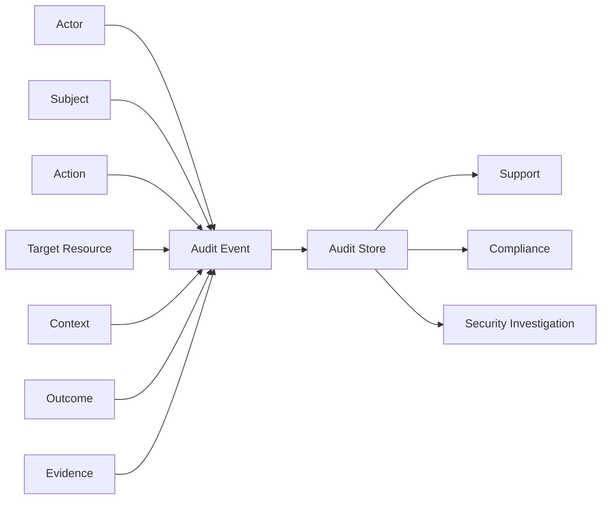
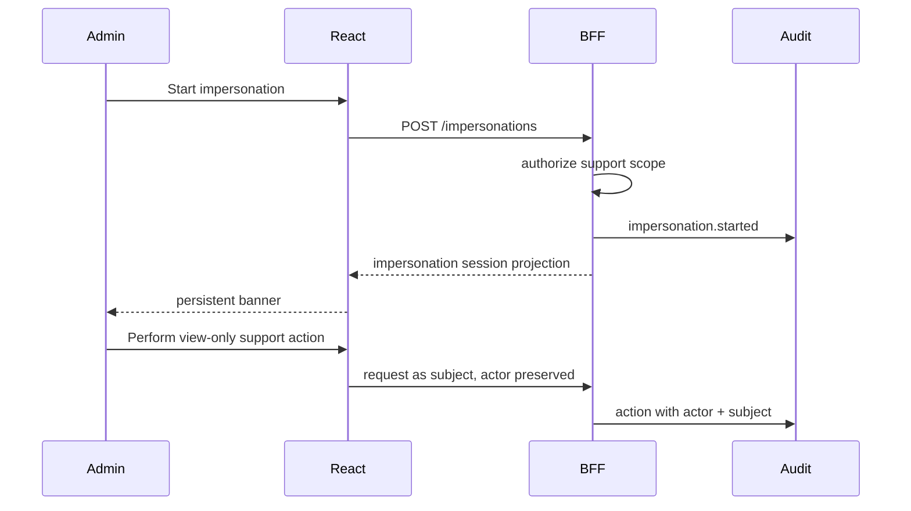
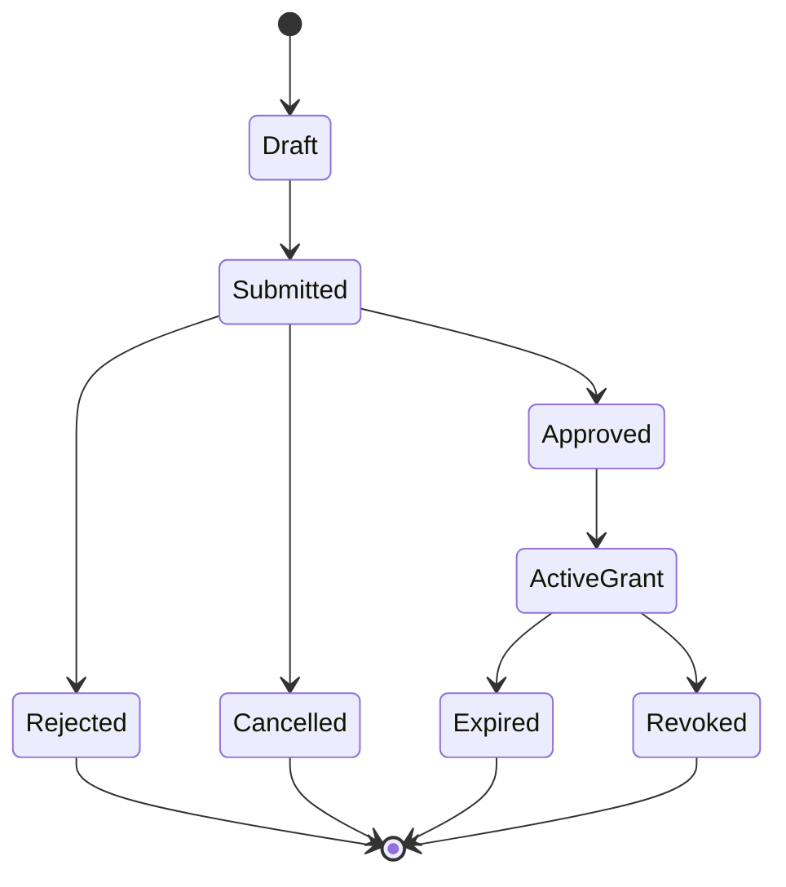
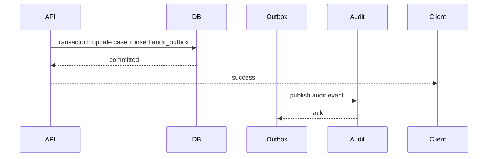

# Part 102 — Audit Events for React Auth Flows

Audit events are not ordinary logs.

A log helps engineers debug. An audit event records a security-relevant fact that may later be used for support, compliance, forensics, legal defensibility, or incident response.

For React auth, audit events answer questions like:

- Who logged in?
- Which tenant did they access?
- Who changed this user’s role?
- Why was this approval denied?
- Who impersonated this customer?
- Was this document downloaded before access was revoked?
- Did the user perform the action, or did an admin act on their behalf?
- Was access granted temporarily, and did it expire?
- Which policy version produced the authorization decision?

The React app does not own audit truth. The server owns audit truth.

But the React app shapes the user journey. It triggers login redirects, renders access request flows, submits mutations, initiates tenant switches, opens impersonation sessions, and displays denial reasons. Therefore, React engineers must understand audit event design well enough to avoid building flows that are impossible to defend later.

Reference anchors:

- OWASP Logging Cheat Sheet: https://cheatsheetseries.owasp.org/cheatsheets/Logging_Cheat_Sheet.html
- OWASP Logging Vocabulary Cheat Sheet: https://cheatsheetseries.owasp.org/cheatsheets/Logging_Vocabulary_Cheat_Sheet.html
- OWASP Authorization Cheat Sheet: https://cheatsheetseries.owasp.org/cheatsheets/Authorization_Cheat_Sheet.html
- OWASP Authentication Cheat Sheet: https://cheatsheetseries.owasp.org/cheatsheets/Authentication_Cheat_Sheet.html
- NIST SP 800-53 AC-6 Least Privilege: https://csrc.nist.gov/publications/detail/sp/800-53/rev-5/final

---

## 1. Log vs Metric vs Audit Event

Start with a strict distinction.

| Artifact | Purpose | Example |
|---|---|---|
| Metric | aggregate health | `auth_login_completed_total` increased by 1. |
| Log | operational investigation | `/api/cases/123/approve` returned `403`. |
| Trace | causal path | React route → BFF → policy engine → database. |
| Audit event | security/compliance evidence | User A attempted `case.approve` on Case X and was denied because state was `closed`. |

Audit events should be:

- structured,
- immutable or append-only,
- server-generated whenever possible,
- tied to actor/subject/tenant/resource/action,
- correlated to request/trace IDs,
- privacy-aware,
- queryable by support/compliance/security teams,
- retained according to policy,
- protected from tampering.

Do not rely on browser analytics as an audit trail.

Browser analytics are easy to block, spoof, duplicate, lose, or corrupt. They are useful signals, not authoritative evidence.

---

## 2. Audit Event Mental Model

Most auth audit events can be modeled as:

```txt
actor performed action on target in context, producing outcome, under policy/session/version evidence.
```



Key distinction:

| Concept | Meaning |
|---|---|
| Actor | The identity that initiated the action. |
| Subject | The identity on whose behalf the action was performed. |
| Target | Resource being accessed or changed. |
| Context | Tenant, session, IP, device, route, workflow state, assurance level. |
| Outcome | Success, failure, denied, cancelled, expired. |
| Evidence | Request ID, policy version, permission epoch, reason code, approval ID. |

Actor and subject are often the same. They are not always the same.

In impersonation, delegation, service-account, admin repair, and approval workflows, actor and subject must be separate.

---

## 3. Why React Engineers Need Audit Literacy

A frontend can destroy auditability by hiding important context.

Examples:

| Weak React flow | Audit problem |
|---|---|
| Generic “Save” button submits many changes without explicit intent. | Audit cannot explain what the user intended. |
| Disabled button without reason. | User cannot know whether denial was policy, state, or failure. |
| Admin impersonation has no visible banner. | Actor/subject confusion. |
| Access request form only asks “give me access.” | Approval cannot scope grant safely. |
| Tenant switch keeps cached actions visible. | Audit sees actions under wrong context. |
| Sensitive action uses same submit button as normal update. | No step-up or intent confirmation evidence. |

Auditability is not an afterthought. It changes UI design.

A defensible UI makes intent explicit.

---

## 4. Base Audit Event Schema

A good audit event schema is boring, stable, and explicit.

```ts
export type AuditOutcome =
  | 'success'
  | 'failure'
  | 'denied'
  | 'cancelled'
  | 'expired'
  | 'revoked'
  | 'superseded';

export type AuditEventBase = {
  eventId: string;
  eventType: string;
  eventVersion: number;
  occurredAt: string;
  recordedAt: string;

  environment: 'dev' | 'staging' | 'prod';
  service: string;
  release?: string;

  requestId?: string;
  traceId?: string;
  correlationId?: string;

  actor: AuditActor;
  subject?: AuditSubject;
  tenant?: AuditTenant;
  target?: AuditTarget;

  action: string;
  outcome: AuditOutcome;
  reasonCode?: string;

  session?: AuditSessionContext;
  auth?: AuditAuthContext;
  policy?: AuditPolicyContext;

  metadata?: Record<string, unknown>;
};

export type AuditActor = {
  actorId: string;
  actorType: 'user' | 'admin' | 'service_account' | 'system' | 'anonymous';
  displayIdHash?: string;
};

export type AuditSubject = {
  subjectId: string;
  subjectType: 'user' | 'customer' | 'service_account';
};

export type AuditTenant = {
  tenantId: string;
  tenantType?: 'organization' | 'workspace' | 'account';
};

export type AuditTarget = {
  resourceType: string;
  resourceId?: string;
  resourceVersion?: string;
};

export type AuditSessionContext = {
  sessionIdHash?: string;
  authEpoch?: string;
  assuranceLevel?: 'aal1' | 'aal2' | 'aal3' | 'unknown';
  authenticationMethod?: string[];
  ipHash?: string;
  userAgentHash?: string;
};

export type AuditAuthContext = {
  provider?: 'oidc' | 'saml' | 'password' | 'passkey' | 'api_key' | 'unknown';
  loginFlowId?: string;
  stepUpFlowId?: string;
  impersonationId?: string;
};

export type AuditPolicyContext = {
  policyVersion?: string;
  permissionEpoch?: string;
  decisionId?: string;
  decisionSource?: 'api' | 'bff' | 'policy_engine';
};
```

A few notes:

- `eventVersion` allows schema evolution.
- `occurredAt` and `recordedAt` differ because distributed systems delay events.
- `actor` is required.
- `subject` is optional because not every action is on behalf of another user.
- `target.resourceId` may be redacted, hashed, or internal depending data policy.
- `metadata` should be controlled, not a dumping ground.

---

## 5. Event Naming Convention

Use consistent event names.

Recommended shape:

```txt
<domain>.<object>.<verb>.<outcome?>
```

Examples:

```txt
auth.login.started
auth.login.succeeded
auth.login.failed
auth.logout.succeeded
auth.session.revoked
auth.session.expired
auth.step_up.required
auth.step_up.succeeded
authz.decision.allowed
authz.decision.denied
authz.permission.granted
authz.permission.revoked
authz.role.assigned
authz.role.removed
tenant.switched
impersonation.started
impersonation.ended
access_request.submitted
access_request.approved
access_request.rejected
access_request.expired
```

Avoid:

```txt
user did thing
login error
button clicked
forbidden maybe
admin stuff
```

Audit event names become operational vocabulary. Make them stable.

---

## 6. Authentication Audit Events

Authentication audit events should describe security-relevant authentication lifecycle changes.

### 6.1 Login Started

Usually the browser can emit telemetry, but authoritative audit should be server-side when a transaction is created or callback completes.

```json
{
  "eventType": "auth.login.started",
  "eventVersion": 1,
  "actor": { "actorType": "anonymous", "actorId": "anonymous" },
  "action": "auth.login.start",
  "outcome": "success",
  "auth": {
    "provider": "oidc",
    "loginFlowId": "login_9s2"
  },
  "metadata": {
    "clientType": "bff",
    "returnToKind": "internal_path"
  }
}
```

Do not store raw `state`, `nonce`, PKCE verifier, or callback URL.

### 6.2 Login Succeeded

```json
{
  "eventType": "auth.login.succeeded",
  "eventVersion": 1,
  "actor": { "actorType": "user", "actorId": "usr_123" },
  "tenant": { "tenantId": "ten_456" },
  "action": "auth.login.complete",
  "outcome": "success",
  "session": {
    "sessionIdHash": "sesh_9d1",
    "assuranceLevel": "aal2",
    "authenticationMethod": ["pwd", "otp"]
  },
  "auth": {
    "provider": "oidc",
    "loginFlowId": "login_9s2"
  }
}
```

Useful facts:

- provider,
- tenant/org resolved,
- assurance level,
- authentication methods,
- session hash,
- request/correlation ID.

Unsafe facts:

- raw token,
- password details,
- full ID token claims,
- raw SAML assertion,
- raw IP unless policy permits.

### 6.3 Login Failed

```json
{
  "eventType": "auth.login.failed",
  "actor": { "actorType": "anonymous", "actorId": "anonymous" },
  "action": "auth.login.complete",
  "outcome": "failure",
  "reasonCode": "OIDC_INVALID_STATE",
  "auth": {
    "provider": "oidc",
    "loginFlowId": "login_9s2"
  }
}
```

Reason codes should be machine-readable and safe:

```txt
OIDC_INVALID_STATE
OIDC_INVALID_NONCE
OIDC_CALLBACK_ERROR
PROVIDER_ACCESS_DENIED
ACCOUNT_DISABLED
MFA_REQUIRED
MFA_FAILED
PASSWORD_EXPIRED
ORG_NOT_ALLOWED
JIT_PROVISIONING_FAILED
SESSION_CREATION_FAILED
```

Do not reveal to users whether an email exists. The audit event can be more specific internally if data policy permits.

---

## 7. Session Audit Events

Session audit events record continuity, expiry, revocation, and termination.

### 7.1 Logout

```json
{
  "eventType": "auth.logout.succeeded",
  "actor": { "actorType": "user", "actorId": "usr_123" },
  "tenant": { "tenantId": "ten_456" },
  "action": "auth.logout",
  "outcome": "success",
  "reasonCode": "USER_INITIATED",
  "session": {
    "sessionIdHash": "sesh_9d1",
    "authEpoch": "ae_882"
  },
  "metadata": {
    "serverSessionRevoked": true,
    "clientCacheClearRequested": true
  }
}
```

Common reason codes:

```txt
USER_INITIATED
ADMIN_REVOKED
SESSION_EXPIRED
REFRESH_REUSE_DETECTED
PASSWORD_CHANGED
MFA_CHANGED
TENANT_MEMBERSHIP_REMOVED
GLOBAL_SIGN_OUT
SECURITY_INCIDENT
```

### 7.2 Session Revoked

```json
{
  "eventType": "auth.session.revoked",
  "actor": { "actorType": "admin", "actorId": "usr_admin_1" },
  "subject": { "subjectType": "user", "subjectId": "usr_123" },
  "action": "auth.session.revoke",
  "outcome": "revoked",
  "reasonCode": "ADMIN_REVOKED",
  "session": {
    "sessionIdHash": "sesh_9d1"
  }
}
```

Session revocation is usually a server-side event. The React app may observe it later as `401` or forced logout, but it should not be the source of truth.

---

## 8. Authorization Decision Audit Events

Not every authorization check must become a permanent audit record. High-volume read checks can become enormous.

Use a tiered policy.

| Decision type | Audit strategy |
|---|---|
| Sensitive mutation allow | audit. |
| Sensitive mutation deny | audit. |
| Admin action allow/deny | audit. |
| Access grant/revoke | audit. |
| Login/logout/session revoke | audit. |
| Ordinary read allow | sample or log only. |
| Ordinary read deny | log or audit based on risk. |
| Bulk/export/download | audit. |

Example denial event:

```json
{
  "eventType": "authz.decision.denied",
  "actor": { "actorType": "user", "actorId": "usr_123" },
  "tenant": { "tenantId": "ten_456" },
  "target": {
    "resourceType": "case",
    "resourceId": "case_789",
    "resourceVersion": "v14"
  },
  "action": "case.approve",
  "outcome": "denied",
  "reasonCode": "WORKFLOW_STATE_NOT_APPROVABLE",
  "policy": {
    "policyVersion": "case-policy@42",
    "permissionEpoch": "pe_991",
    "decisionId": "dec_abc",
    "decisionSource": "policy_engine"
  },
  "metadata": {
    "workflowState": "closed"
  }
}
```

Be careful with `metadata`. If `workflowState` is not sensitive, it is useful. If the target resource existence must be concealed, do not include details visible to broad audiences.

---

## 9. Role and Permission Change Events

Permission change events are high-value audit records.

They should always include:

- actor,
- subject,
- tenant,
- grant/removal target,
- approval/reference if required,
- effective time,
- expiry if temporary,
- before/after where safe,
- reason.

### 9.1 Role Assigned

```json
{
  "eventType": "authz.role.assigned",
  "actor": { "actorType": "admin", "actorId": "usr_admin_1" },
  "subject": { "subjectType": "user", "subjectId": "usr_123" },
  "tenant": { "tenantId": "ten_456" },
  "action": "role.assign",
  "outcome": "success",
  "target": {
    "resourceType": "role",
    "resourceId": "role_case_supervisor"
  },
  "reasonCode": "ACCESS_REQUEST_APPROVED",
  "metadata": {
    "approvalId": "apr_77",
    "effectiveAt": "2026-07-08T10:00:00Z",
    "expiresAt": "2026-07-15T10:00:00Z"
  }
}
```

### 9.2 Permission Revoked

```json
{
  "eventType": "authz.permission.revoked",
  "actor": { "actorType": "admin", "actorId": "usr_admin_1" },
  "subject": { "subjectType": "user", "subjectId": "usr_123" },
  "tenant": { "tenantId": "ten_456" },
  "action": "permission.revoke",
  "outcome": "success",
  "target": {
    "resourceType": "permission",
    "resourceId": "case.approve"
  },
  "reasonCode": "TENANT_MEMBERSHIP_REMOVED",
  "policy": {
    "permissionEpoch": "pe_992"
  }
}
```

React implication: after permission change, the app must invalidate permission projection, route menus, query cache, table row actions, and optimistic UI assumptions.

---

## 10. Tenant Switch Events

Tenant switch is security-relevant in enterprise apps.

```json
{
  "eventType": "tenant.switched",
  "actor": { "actorType": "user", "actorId": "usr_123" },
  "action": "tenant.switch",
  "outcome": "success",
  "tenant": { "tenantId": "ten_new" },
  "metadata": {
    "previousTenantId": "ten_old",
    "cacheInvalidationRequested": true,
    "permissionProjectionReloaded": true
  }
}
```

If previous tenant ID is sensitive in the audit viewer, restrict visibility.

Tenant switch should be auditable because it changes the interpretation of subsequent actions. A `case.view` event means little without tenant context.

---

## 11. Impersonation Events

Impersonation requires special care because actor and subject diverge.



Start event:

```json
{
  "eventType": "impersonation.started",
  "actor": { "actorType": "admin", "actorId": "usr_support_1" },
  "subject": { "subjectType": "user", "subjectId": "usr_customer_9" },
  "tenant": { "tenantId": "ten_456" },
  "action": "impersonation.start",
  "outcome": "success",
  "auth": {
    "impersonationId": "imp_123"
  },
  "metadata": {
    "mode": "view_only",
    "ticketId": "SUP-1234",
    "expiresAt": "2026-07-08T11:00:00Z"
  }
}
```

End event:

```json
{
  "eventType": "impersonation.ended",
  "actor": { "actorType": "admin", "actorId": "usr_support_1" },
  "subject": { "subjectType": "user", "subjectId": "usr_customer_9" },
  "tenant": { "tenantId": "ten_456" },
  "action": "impersonation.end",
  "outcome": "success",
  "reasonCode": "ADMIN_EXITED",
  "auth": {
    "impersonationId": "imp_123"
  }
}
```

React requirements:

- persistent banner,
- clear subject/actor language,
- restricted action set,
- explicit exit,
- no silent background impersonation,
- no cached data crossing impersonation boundary.

---

## 12. Access Request Workflow Events

Access request is a lifecycle, not a form.



Audit events:

```txt
access_request.submitted
access_request.cancelled
access_request.approved
access_request.rejected
access_request.expired
authz.permission.granted
authz.permission.revoked
```

Submission event:

```json
{
  "eventType": "access_request.submitted",
  "actor": { "actorType": "user", "actorId": "usr_123" },
  "tenant": { "tenantId": "ten_456" },
  "action": "access_request.submit",
  "outcome": "success",
  "target": {
    "resourceType": "case",
    "resourceId": "case_789"
  },
  "metadata": {
    "requestedAction": "case.approve",
    "justificationId": "just_88",
    "requestedDuration": "P7D"
  }
}
```

Approval event:

```json
{
  "eventType": "access_request.approved",
  "actor": { "actorType": "user", "actorId": "usr_manager_1" },
  "subject": { "subjectType": "user", "subjectId": "usr_123" },
  "tenant": { "tenantId": "ten_456" },
  "action": "access_request.approve",
  "outcome": "success",
  "reasonCode": "BUSINESS_JUSTIFICATION_ACCEPTED",
  "metadata": {
    "requestId": "ar_99",
    "grantId": "grant_123",
    "expiresAt": "2026-07-15T10:00:00Z"
  }
}
```

React implication: the request form must collect precise target, requested action, duration, and justification. Otherwise the audit trail cannot defend why access was granted.

---

## 13. Sensitive Action Events

Sensitive actions deserve explicit audit.

Examples:

- approve case,
- export data,
- download sensitive document,
- grant permission,
- revoke permission,
- change tenant settings,
- disable MFA,
- reset another user’s password,
- start impersonation,
- execute break-glass access,
- delete resource,
- close enforcement case.

A sensitive action event should include:

- actor,
- tenant,
- target,
- action,
- outcome,
- confirmation/step-up evidence,
- previous and new state where safe,
- reason code,
- request ID,
- policy version.

Example:

```json
{
  "eventType": "case.approval.succeeded",
  "actor": { "actorType": "user", "actorId": "usr_123" },
  "tenant": { "tenantId": "ten_456" },
  "target": {
    "resourceType": "case",
    "resourceId": "case_789",
    "resourceVersion": "v15"
  },
  "action": "case.approve",
  "outcome": "success",
  "session": {
    "assuranceLevel": "aal2"
  },
  "auth": {
    "stepUpFlowId": "step_123"
  },
  "policy": {
    "policyVersion": "case-policy@42",
    "decisionId": "dec_111"
  },
  "metadata": {
    "previousState": "pending_approval",
    "newState": "approved",
    "confirmationTextMatched": true
  }
}
```

Do not audit only the final database update. Audit the security-relevant decision and user intent.

---

## 14. Denied Action Events

Denied actions are often as important as successful ones.

They can indicate:

- normal business denial,
- missing permission,
- stale UI permission projection,
- attempted abuse,
- wrong tenant,
- workflow state conflict,
- failed step-up,
- separation of duties,
- policy regression.

Example:

```json
{
  "eventType": "authz.decision.denied",
  "actor": { "actorType": "user", "actorId": "usr_123" },
  "tenant": { "tenantId": "ten_456" },
  "target": {
    "resourceType": "case",
    "resourceId": "case_789"
  },
  "action": "case.close",
  "outcome": "denied",
  "reasonCode": "SEPARATION_OF_DUTIES",
  "policy": {
    "policyVersion": "case-policy@42",
    "decisionId": "dec_223"
  },
  "metadata": {
    "safeUserMessageCode": "ACTION_NOT_ALLOWED_FOR_THIS_USER"
  }
}
```

Do not expose all internal reason details to users. The audit event can retain structured detail with controlled access.

---

## 15. Client-originated vs Server-originated Audit Events

Some events originate in React, but the server should still record the authoritative audit event.

| Flow | React signal | Authoritative audit source |
|---|---|---|
| Click login | telemetry | auth/BFF server when transaction starts/completes |
| Click logout | telemetry | server session revocation endpoint |
| Submit approval | request intent | API after authorization and write |
| Permission denied UI | telemetry | API/policy decision if request occurred |
| Access request submit | request body | access workflow service |
| Tenant switch | UI event | session/tenant context service |
| Impersonation start | form submit | BFF/admin service |
| Download file | click | file service or BFF issuing signed URL |

A browser can say “the user clicked.” Only the server can say “the action was authorized and committed.”

---

## 16. Idempotency and Duplicate Audit Events

Distributed systems duplicate things.

A user double-clicks. Network retries. Browser resubmits. Service worker replays. API gateway retries. Queue consumer restarts.

Sensitive actions should use idempotency keys.

```ts
export type SensitiveMutationRequest = {
  idempotencyKey: string;
  expectedResourceVersion: string;
  intent: {
    action: 'case.approve';
    resourceId: string;
    confirmation?: string;
  };
};
```

Audit event should include the idempotency key hash or server-side operation ID.

```json
{
  "eventType": "case.approval.succeeded",
  "eventId": "evt_1",
  "metadata": {
    "operationId": "op_abc",
    "idempotencyKeyHash": "idemh_7f1",
    "deduplicated": false
  }
}
```

If a duplicate arrives:

```json
{
  "eventType": "case.approval.duplicate_ignored",
  "outcome": "superseded",
  "metadata": {
    "operationId": "op_abc",
    "idempotencyKeyHash": "idemh_7f1",
    "originalEventId": "evt_1"
  }
}
```

Do not create two successful audit events for one committed business action.

---

## 17. Audit Integrity

Audit data is valuable to attackers.

They may want to:

- delete evidence,
- alter actor ID,
- remove failed attempts,
- hide impersonation,
- backdate permission grants,
- flood audit store with noise.

Controls:

- append-only storage,
- restricted write path,
- event schema validation,
- separate audit write permissions,
- time synchronization,
- retention policy,
- tamper-evident hash chain for high-risk domains,
- encryption at rest,
- access audit for audit viewer itself,
- monitoring for dropped audit writes.

Simple hash-chain concept:

```txt
event_n.hash = SHA256(event_n.canonical_json + event_{n-1}.hash)
```

This does not solve all audit integrity problems, but it gives tamper-evidence if implemented carefully.

React engineers usually do not implement the audit store, but they must know whether the product flow depends on audit evidence and avoid client-only “audit.”

---

## 18. Audit Store Failure Policy

What happens if audit write fails?

For low-risk events, maybe proceed and retry asynchronously.

For regulated sensitive actions, failing to audit may mean failing the action.

Define policy per event class.

| Event class | Failure policy |
|---|---|
| Login success | strongly prefer audit; queue if store degraded. |
| Logout | proceed, queue audit. |
| Permission grant/revoke | fail closed if audit cannot be recorded. |
| Sensitive approval | fail closed or write to durable outbox. |
| Read denial | log/queue based on risk. |
| Impersonation start | fail closed. |
| Break-glass access | fail closed unless emergency mode has separate durable path. |

Use outbox pattern for committed business actions.



For high-risk systems, the audit outbox entry must be in the same transaction as the business state change.

---

## 19. Retention, Privacy, and Right-sizing

Audit data is sensitive.

Retention must balance compliance, investigation, and privacy.

Questions to answer:

- Which events are retained for how long?
- Who can query audit data?
- Are audit viewers themselves audited?
- Which fields are PII?
- Are resource IDs sensitive?
- Can support see raw actor IDs or only display aliases?
- How are tenant/customer boundaries enforced in audit views?
- Are exported audit logs protected?
- Are audit logs included in backups?
- What is the legal/compliance retention basis?

Common split:

| Data | Retention idea |
|---|---|
| Security-critical audit | long retention, strict access |
| Operational logs | shorter retention |
| High-cardinality traces | short retention or sampled |
| Browser telemetry | short retention, aggregate where possible |
| Raw request bodies | avoid or very short, redacted |

Never keep secrets “for debugging.”

---

## 20. Audit Viewer UX

Audit events are only useful if people can interpret them.

A good audit viewer lets authorized users filter by:

- actor,
- subject,
- tenant,
- resource type,
- resource ID,
- action,
- outcome,
- reason code,
- time range,
- request ID,
- policy version,
- impersonation ID,
- access request ID.

Bad audit UI:

```txt
2026-07-08 INFO user action succeeded
```

Good audit UI:

```txt
10:31:42 — Maria S. approved Case CASE-2026-144 under tenant Acme.
Policy: case-policy@42. Session assurance: AAL2. Request: req_7k9.
```

For denied events:

```txt
10:33:11 — Maria S. attempted to close Case CASE-2026-144.
Denied: separation of duties. She created the case and cannot close it.
Request: req_8d1.
```

In regulated systems, audit UI is part of the product, not an internal afterthought.

---

## 21. React Patterns for Audit-aware UX

### 21.1 Explicit Intent Confirmation

For sensitive actions, the UI should capture explicit user intent.

```tsx
function ApproveCaseDialog({ caseId, version }: { caseId: string; version: string }) {
  const mutation = useApproveCaseMutation();

  return (
    <ConfirmDialog
      title="Approve this case?"
      description="This will move the case to Approved and create an audit event."
      confirmLabel="Approve case"
      onConfirm={() =>
        mutation.mutate({
          caseId,
          expectedVersion: version,
          idempotencyKey: crypto.randomUUID(),
          intent: 'case.approve',
        })
      }
    />
  );
}
```

The server should audit the committed action. The frontend should make the intent precise.

### 21.2 Display Support Codes

```tsx
function ForbiddenMessage({ problem }: { problem: AuthzProblem }) {
  return (
    <section role="alert">
      <h2>Access denied</h2>
      <p>{problem.safeMessage}</p>
      {problem.supportCode ? <p>Support code: <code>{problem.supportCode}</code></p> : null}
    </section>
  );
}
```

Support code connects UX to audit evidence without exposing internal policy details.

### 21.3 Actor/Subject Banner

```tsx
function ImpersonationBanner({ actorName, subjectName, expiresAt }: Props) {
  return (
    <div role="status" aria-live="polite">
      You are viewing as <strong>{subjectName}</strong>.
      Actions are recorded as performed by <strong>{actorName}</strong> on behalf of {subjectName}.
      This session expires at {expiresAt}.
    </div>
  );
}
```

This UI is not cosmetic. It prevents actor confusion.

---

## 22. Audit Test Matrix

Test audit behavior for security-relevant flows.

```md
## Audit Test Matrix

### Authentication
- [ ] Login success creates audit event.
- [ ] Login failure creates safe reason code.
- [ ] Invalid OIDC state does not log raw state/code.
- [ ] Logout creates server-side audit event.
- [ ] Session revocation records actor and subject.

### Authorization
- [ ] Sensitive mutation allow creates audit event.
- [ ] Sensitive mutation deny creates audit event.
- [ ] Policy version and decision ID are included.
- [ ] Tenant mismatch denial is audited.
- [ ] Separation-of-duties denial is audited.

### Permission lifecycle
- [ ] Role assignment includes actor, subject, tenant, role, reason.
- [ ] Permission revoke increments permission epoch.
- [ ] Temporary grant includes expiry.
- [ ] Expired grant creates event.

### Impersonation
- [ ] Start event includes actor and subject.
- [ ] End event includes reason.
- [ ] Every action during impersonation carries impersonation ID.
- [ ] React banner is visible during impersonation.
- [ ] Sensitive actions are blocked or separately approved.

### Access request
- [ ] Submit event includes requested action/resource/duration.
- [ ] Approval event includes approver and grant ID.
- [ ] Rejection event includes safe reason code.
- [ ] Expiry/revocation event exists.

### Privacy and integrity
- [ ] No token/cookie/secret in audit event.
- [ ] Query params are sanitized.
- [ ] Audit schema validation rejects unknown sensitive payload.
- [ ] Audit viewer access is itself audited.
- [ ] Audit write failure policy is tested.
```

---

## 23. Anti-patterns

### Anti-pattern: Client-only Audit

```ts
analytics.track('user_approved_case', { caseId });
```

This proves almost nothing. It can be blocked, forged, or lost.

The server must audit the committed action.

### Anti-pattern: Audit Event as String

```txt
Admin updated user access.
```

No actor/subject/target/action/outcome/reason. Not defensible.

### Anti-pattern: Logging Secrets for Forensics

```json
{ "event": "auth.login.failed", "callbackUrl": "https://app/callback?code=..." }
```

This turns audit into a credential leak.

### Anti-pattern: No Actor/Subject Split

```json
{ "userId": "usr_customer_9", "event": "profile.viewed" }
```

During impersonation, this hides that support viewed the profile.

Use:

```json
{
  "actor": { "actorId": "usr_support_1" },
  "subject": { "subjectId": "usr_customer_9" }
}
```

### Anti-pattern: Auditing Only Success

Denied attempts can be security-relevant and support-relevant.

---

## 24. Production Checklist

```md
## Auth Audit Event Checklist

### Schema
- [ ] Audit event schema has event id, type, version, occurredAt, recordedAt.
- [ ] Actor and subject are separate.
- [ ] Tenant context is explicit.
- [ ] Target resource and action are explicit.
- [ ] Outcome and reason code are explicit.
- [ ] Request/trace/correlation IDs are included.
- [ ] Policy version and decision ID exist for authz decisions.

### Event coverage
- [ ] Login success/failure is audited.
- [ ] Logout/session revoke is audited.
- [ ] Role/permission grant and revoke are audited.
- [ ] Tenant switch is audited.
- [ ] Impersonation start/end is audited.
- [ ] Sensitive action allow/deny is audited.
- [ ] Access request lifecycle is audited.
- [ ] Break-glass access is audited.

### Security
- [ ] No tokens, cookies, secrets, or raw callback URLs are stored.
- [ ] Audit store is append-only or tamper-evident for critical events.
- [ ] Audit write path is access controlled.
- [ ] Audit viewer access is audited.
- [ ] Audit write failure policy is defined.

### React UX
- [ ] Sensitive actions capture explicit intent.
- [ ] Denial UI exposes safe support code.
- [ ] Impersonation banner shows actor/subject distinction.
- [ ] Access request form captures resource/action/duration/justification.
- [ ] Tenant switch clears scoped caches and creates event.

### Operations
- [ ] Retention policy exists.
- [ ] Audit export is protected.
- [ ] Support can search by support code/request ID.
- [ ] Compliance can search by actor/resource/action/time.
- [ ] Security can detect suspicious patterns.
```

---

## 25. Mental Model

Audit events are the memory of the authorization system.

If observability tells you “something is wrong,” audit tells you “what happened, who did it, what was affected, under which authority, and why the system allowed or denied it.”

For React engineers, the practical rule is simple:

> The frontend should make user intent explicit. The server should record authoritative audit evidence.

When the UI, API, policy engine, and audit store share the same vocabulary, the system becomes easier to debug, safer to operate, and more defensible under scrutiny.
