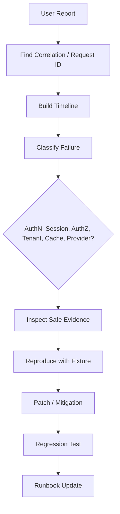
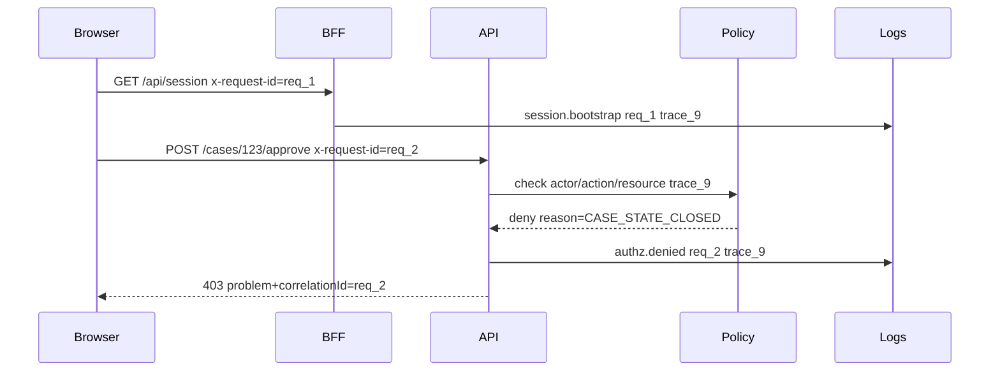
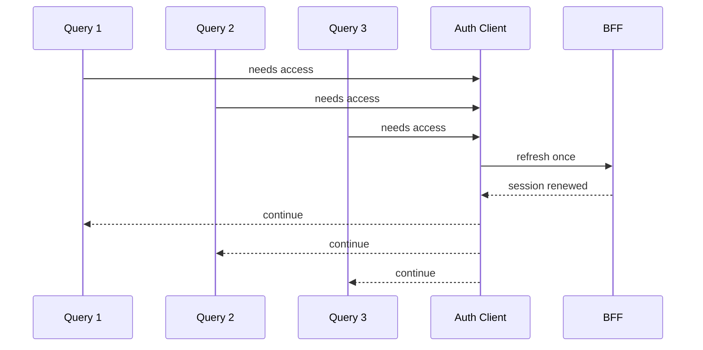

# Part 103 — Debugging Auth in Production

Debugging auth in production is not the same as debugging a component render bug.

A render bug usually asks:

> Why did this component show the wrong thing?

A production auth bug asks:

> Which identity was active, which session snapshot was trusted, which tenant/resource/action was requested, which policy version evaluated the request, which cache or tab saw stale state, and did the system deny or allow correctly?

That is a distributed debugging problem.

A React auth failure may involve:

- browser state,
- cookies,
- in-memory tokens,
- router loaders,
- query cache,
- service worker cache,
- BFF session,
- OAuth provider,
- policy engine,
- downstream API,
- CDN/proxy headers,
- tenant mapping,
- feature flags,
- role/group sync,
- audit pipeline.

The production debugging goal is not “inspect the token.” The goal is to reconstruct a safe, minimal, evidence-backed timeline of the auth decision without exposing credentials or sensitive data.

Reference anchors:

- OWASP Logging Cheat Sheet: https://cheatsheetseries.owasp.org/cheatsheets/Logging_Cheat_Sheet.html
- OWASP Logging Vocabulary Cheat Sheet: https://cheatsheetseries.owasp.org/cheatsheets/Logging_Vocabulary_Cheat_Sheet.html
- OWASP Authorization Cheat Sheet: https://cheatsheetseries.owasp.org/cheatsheets/Authorization_Cheat_Sheet.html
- OWASP Authentication Cheat Sheet: https://cheatsheetseries.owasp.org/cheatsheets/Authentication_Cheat_Sheet.html
- OpenTelemetry Semantic Conventions: https://opentelemetry.io/docs/specs/semconv/
- OpenTelemetry HTTP Semantic Conventions: https://opentelemetry.io/docs/specs/semconv/http/

---

## 1. The Production Auth Debugging Mindset

Never begin with “the frontend is broken” or “the backend is wrong.”

Begin with four questions:

1. **Who did the system think the actor was?**
2. **What did the actor try to do?**
3. **Which resource and tenant were involved?**
4. **Which authority made the decision?**

Auth debugging is mostly boundary debugging.



The dangerous shortcut is decoding a token in the browser and concluding the user “should have access.” A token claim is evidence, not a final authorization decision. The real answer is in the server-side decision path.

---

## 2. Production Auth Debugging Invariants

These invariants keep debugging safe and useful.

| Invariant | Meaning |
|---|---|
| Never log credentials | No access token, refresh token, ID token, authorization code, session ID, CSRF token, magic link, reset token, raw cookie. |
| Correlate everything | Every auth event should connect to `requestId`, `traceId`, `sessionIdHash`, `actorId`, and release version where safe. |
| Use stable codes | UI copy can change; machine-readable error codes must remain stable. |
| Prefer hashes over raw identifiers | Use salted/hash identifiers for session/token correlation where possible. |
| Separate audit from debug logs | Debug logs help engineers; audit logs record security-relevant facts. |
| Denial is not always failure | A `403` can mean the system worked correctly. |
| Frontend state is a witness | It can report what it saw, but it is not the authority. |
| Reproduction needs fixtures | Do not reproduce by copying production tokens. |

A debugging system that requires engineers to paste real tokens into Slack is already broken.

---

## 3. Auth Failure Classification

Before reading logs, classify the symptom.

| Symptom | Likely category | First evidence to inspect |
|---|---|---|
| User cannot login | Authentication / IdP / callback | Login transaction, OAuth callback, provider error, redirect state. |
| User logs in but app loops | Session bootstrap / redirect | `/session`, route loader redirects, return URL validation. |
| User suddenly logged out | Session expiry / refresh / revocation | Refresh events, cookie expiry, token family status. |
| Button visible but action denied | UI permission stale / backend correct | Permission snapshot version, action response. |
| Button hidden but API allows action | UI projection bug | `/permissions`, component logic, feature flag intersection. |
| User sees wrong tenant data | Tenant context / cache isolation | tenantId in route/query/server decision. |
| One tab works, another fails | Cross-tab coordination | auth epoch, BroadcastChannel/storage event, query cache. |
| Mobile browser fails only | Cookie/SameSite/redirect/CORS | cookie attributes, browser behavior, callback URL. |
| After role change, UI stale | Cache invalidation | permission epoch, event bus, query invalidation. |
| Admin impersonation oddity | Actor/subject confusion | audit actor/subject, session projection, banner state. |

Classification prevents random log spelunking.

---

## 4. The Auth Debug Timeline

A useful timeline is ordered by evidence, not by guess.

Minimum timeline fields:

```ts
export type AuthDebugTimelineEvent = {
  at: string;                 // ISO time
  source: 'browser' | 'bff' | 'api' | 'idp' | 'policy' | 'audit';
  event: string;              // stable event name
  requestId?: string;
  traceId?: string;
  sessionHash?: string;
  actorId?: string;
  subjectId?: string;
  tenantId?: string;
  routeId?: string;
  action?: string;
  resourceType?: string;
  resourceIdHash?: string;
  decision?: 'allow' | 'deny' | 'challenge' | 'unknown';
  reasonCode?: string;
  policyVersion?: string;
  release?: string;
};
```

Example timeline:

```txt
10:04:11 browser auth.bootstrap.started route=/cases/123
10:04:11 bff session.loaded actor=u_123 tenant=t_a sessionHash=s_x policyEpoch=91
10:04:11 api case.read requested actor=u_123 tenant=t_a resource=case#hash_abc
10:04:12 policy decision deny reason=RESOURCE_NOT_IN_TENANT policyVersion=2026.07.08.4
10:04:12 api response 403 problem=AUTHZ_RESOURCE_TENANT_MISMATCH requestId=req_789
10:04:12 browser route.error shown code=AUTHZ_RESOURCE_TENANT_MISMATCH correlation=req_789
```

This timeline tells a different story than “page failed.” It says the system denied access because the case did not belong to the active tenant. That may be correct behavior or data mapping drift, but it is no longer vague.

---

## 5. Correlation IDs: The Spine of Auth Debugging

Every auth-supportable application needs request correlation.



Use two IDs:

| ID | Purpose | User visible? |
|---|---|---|
| `traceId` | Distributed trace across services | Usually no. |
| `correlationId` / `requestId` | Support-visible handle for a specific failed request | Yes, safe if not guessable auth secret. |

A `403` screen should expose a support-safe correlation ID:

```tsx
export function ForbiddenScreen({ problem }: { problem: ProblemDetails }) {
  return (
    <main>
      <h1>Access denied</h1>
      <p>{safeProblemMessage(problem.code)}</p>
      {problem.correlationId && (
        <p className="muted">Reference: {problem.correlationId}</p>
      )}
    </main>
  );
}
```

Do not display internal policy traces to end users.

---

## 6. Safe Auth Logging Schema

A production auth log should be structured, queryable, and redacted by design.

```ts
export type SafeAuthLog = {
  event: string;
  severity: 'debug' | 'info' | 'warn' | 'error' | 'security';
  at: string;
  requestId: string;
  traceId?: string;

  actorId?: string;
  subjectId?: string;
  tenantId?: string;
  sessionHash?: string;

  routeId?: string;
  httpMethod?: string;
  httpStatus?: number;

  action?: string;
  resourceType?: string;
  resourceIdHash?: string;
  decision?: 'allow' | 'deny' | 'challenge';
  reasonCode?: string;

  authEpoch?: number;
  permissionEpoch?: number;
  policyVersion?: string;
  release?: string;

  // Never raw tokens, raw cookies, passwords, reset links, auth codes.
};
```

A bad log:

```txt
Failed request for cookie=session=eyJhbGciOi... accessToken=eyJ...
```

A useful safe log:

```json
{
  "event": "authz.denied",
  "severity": "security",
  "requestId": "req_7VC6",
  "traceId": "tr_8f91",
  "actorId": "usr_123",
  "tenantId": "tenant_abc",
  "sessionHash": "sha256:s:9f1...",
  "action": "case.approve",
  "resourceType": "case",
  "resourceIdHash": "sha256:r:21a...",
  "decision": "deny",
  "reasonCode": "CASE_STATE_CLOSED",
  "policyVersion": "policy-2026-07-08.4",
  "release": "web-2026.07.08.3"
}
```

---

## 7. Redaction Rules

Auth debugging often fails because engineers add temporary logs during an outage. Temporary auth logs usually become permanent credential leaks.

Create a redaction library and make unsafe fields unrepresentable.

```ts
const SECRET_KEYS = [
  'authorization',
  'cookie',
  'set-cookie',
  'access_token',
  'refresh_token',
  'id_token',
  'code',
  'code_verifier',
  'csrf',
  'password',
  'magic_link',
  'reset_token',
];

export function redactAuthPayload(value: unknown): unknown {
  if (Array.isArray(value)) return value.map(redactAuthPayload);

  if (value && typeof value === 'object') {
    return Object.fromEntries(
      Object.entries(value as Record<string, unknown>).map(([key, v]) => {
        const normalized = key.toLowerCase().replace(/[-_]/g, '');
        const isSecret = SECRET_KEYS.some((secret) =>
          normalized.includes(secret.replace(/[-_]/g, '')),
        );
        return [key, isSecret ? '[REDACTED]' : redactAuthPayload(v)];
      }),
    );
  }

  return value;
}
```

Do not rely only on naming. Add tests that intentionally pass token-like strings through logging code and verify they are redacted.

---

## 8. Frontend Debug Snapshot

A support-friendly React app can produce a safe debug snapshot.

The snapshot should include state shape, not secrets.

```ts
export type FrontendAuthDebugSnapshot = {
  release: string;
  buildTime: string;
  routeId: string;
  pathname: string;
  browser: {
    userAgentFamily: string;
    online: boolean;
    visibilityState: DocumentVisibilityState;
  };
  auth: {
    status: 'unknown' | 'anonymous' | 'authenticated' | 'refreshing' | 'expired' | 'forbidden';
    authEpoch: number;
    permissionEpoch?: number;
    tenantId?: string;
    actorId?: string;
    subjectId?: string;
    impersonating: boolean;
    lastBootstrapAt?: string;
    lastRefreshAt?: string;
    lastLogoutAt?: string;
  };
  cache: {
    queryKeysHash: string[];
    tenantScopedKeysOnly: boolean;
  };
  lastAuthErrors: Array<{
    at: string;
    code: string;
    correlationId?: string;
    routeId?: string;
  }>;
};
```

Never include:

- token values,
- raw cookie values,
- authorization code,
- CSRF token,
- password reset link,
- full resource data,
- PII beyond what support is allowed to see,
- localStorage dump,
- full headers.

---

## 9. Debugging 401 vs 403

This distinction matters.

| Status | Meaning | React response |
|---|---|---|
| `401` | Authentication missing/invalid/expired | Attempt session recovery or redirect to login. |
| `403` | Authenticated but not authorized | Show forbidden/access request/step-up depending on reason. |
| `404` | Resource not found or intentionally hidden | Show not found; do not reveal existence. |
| `409` | State/version conflict | Refetch and explain conflict. |
| `419`/`440` | Non-standard expired session codes | Normalize internally if legacy platform uses them. |

Production debugging begins by checking whether the UI classified the response correctly.

A common bug:

```ts
// Bad: treats every auth-ish failure as logout.
if (response.status === 401 || response.status === 403) {
  logout();
}
```

A safer classifier:

```ts
type AuthHttpClassification =
  | { kind: 'recoverable-authentication'; action: 'refresh-or-login' }
  | { kind: 'authorization-denial'; action: 'show-forbidden'; reason?: string }
  | { kind: 'step-up-required'; action: 'challenge'; reason?: string }
  | { kind: 'not-auth-related' };

export function classifyAuthHttpResponse(response: Response, problem?: any): AuthHttpClassification {
  if (response.status === 401) {
    return { kind: 'recoverable-authentication', action: 'refresh-or-login' };
  }

  if (response.status === 403 && problem?.code === 'AUTH_STEP_UP_REQUIRED') {
    return { kind: 'step-up-required', action: 'challenge', reason: problem.code };
  }

  if (response.status === 403) {
    return { kind: 'authorization-denial', action: 'show-forbidden', reason: problem?.code };
  }

  return { kind: 'not-auth-related' };
}
```

---

## 10. Debugging Login Redirect Loops

A redirect loop is usually a state machine bug.

Symptoms:

- app keeps bouncing between `/login` and original route,
- OAuth provider returns to callback repeatedly,
- callback succeeds but `/session` says anonymous,
- `returnTo` points to callback/login route,
- route loader and middleware disagree.

Checklist:

1. Is callback route excluded from auth-required middleware?
2. Is login route excluded?
3. Is `returnTo` internal-only?
4. Is `returnTo` forbidden from pointing to `/login`, `/logout`, or `/auth/callback`?
5. Did callback successfully create app session?
6. Did response set cookie with correct `Secure`, `SameSite`, `Path`, and domain?
7. Is the browser blocking third-party/cross-site cookie behavior?
8. Is the session bootstrap endpoint cached incorrectly?
9. Is client hydration using stale anonymous state?
10. Are there multiple tabs broadcasting outdated logout events?

A safe redirect classifier:

```ts
const AUTH_INTERNAL_BLOCKLIST = ['/login', '/logout', '/auth/callback'];

export function normalizeReturnTo(raw: string | null): string {
  if (!raw) return '/';

  let url: URL;
  try {
    url = new URL(raw, window.location.origin);
  } catch {
    return '/';
  }

  if (url.origin !== window.location.origin) return '/';

  const pathname = url.pathname;
  if (AUTH_INTERNAL_BLOCKLIST.some((blocked) => pathname.startsWith(blocked))) {
    return '/';
  }

  return `${url.pathname}${url.search}${url.hash}`;
}
```

---

## 11. Debugging Session Bootstrap Failures

Session bootstrap is where many false auth bugs appear.

A session bootstrap endpoint usually returns:

```ts
type SessionProjection =
  | { status: 'anonymous' }
  | {
      status: 'authenticated';
      actor: { id: string; displayName: string };
      tenant: { id: string; name: string };
      authEpoch: number;
      permissionEpoch: number;
      capabilities: string[];
    };
```

When production users say “I am logged in but app says I am not,” inspect:

| Evidence | Possible issue |
|---|---|
| Cookie absent in request | Domain/path/SameSite/Secure/CORS/credentials problem. |
| Cookie present, session missing | Server-side session revoked/expired/not replicated. |
| Session present, projection anonymous | BFF mapping bug. |
| Projection authenticated, UI anonymous | Client bootstrap race/hydration/cache issue. |
| Projection old tenant | Tenant switch did not invalidate session/query cache. |
| Projection old permissions | Permission epoch invalidation failed. |

A route loader must not trust cached UI state over session bootstrap for protected data.

---

## 12. Debugging Refresh Storms

A refresh storm happens when many requests simultaneously decide the session needs refresh.

Common causes:

- token expiry threshold too aggressive,
- every API interceptor independently refreshes,
- multi-tab refresh lock missing,
- failed refresh retried indefinitely,
- clock skew miscalculated,
- server returns `401` for downstream outage,
- refresh token rotation race,
- SSR refresh repeated per server component/data fetch,
- TanStack Query retries protected queries after auth failure.



Debug signals:

| Metric/log | Meaning |
|---|---|
| `auth.refresh.started` spike | Clients are reaching expiry together. |
| `auth.refresh.coalesced` low | Single-flight not working. |
| `refresh_token_reuse_detected` | Race or compromise. |
| `401` immediately after refresh | Clock/audience/downstream validation mismatch. |
| `query.retry.after_401` high | Data fetching layer retries incorrectly. |

Single-flight refresh skeleton:

```ts
let refreshPromise: Promise<void> | null = null;

export async function ensureFreshSession(): Promise<void> {
  if (refreshPromise) return refreshPromise;

  refreshPromise = refreshSession()
    .catch((error) => {
      authEvents.emit({ type: 'refresh_failed', error });
      throw error;
    })
    .finally(() => {
      refreshPromise = null;
    });

  return refreshPromise;
}
```

---

## 13. Debugging Permission Drift

Permission drift means the UI and server disagree about whether an action is allowed.

There are three cases.

| Case | Meaning | Fix direction |
|---|---|---|
| UI allows, server denies | Safe but bad UX | Invalidate permission projection, improve stale handling. |
| UI denies, server allows | Bad UX / stale projection | Fix permission projection or cache key. |
| UI allows and server allows incorrectly | Security bug | Fix policy/enforcement immediately. |

Permission drift investigation:

```txt
Given: actorId, tenantId, action, resourceId, requestId
1. Fetch server decision log for requestId.
2. Identify policyVersion and permissionEpoch.
3. Identify frontend permission snapshot version.
4. Compare route metadata action vocabulary.
5. Compare resource state observed by UI vs policy.
6. Check tenant scoping in query key/cache.
7. Check feature flag intersection.
8. Reproduce with golden permission fixture.
```

The important debugging field is not just `allowed`. It is `allowed` plus `reasonCode`, `policyVersion`, `permissionEpoch`, and resource state.

---

## 14. Debugging Tenant Mismatch

Tenant mismatch is one of the most serious classes of React auth bugs because it can become cross-tenant data exposure.

Common causes:

- tenant id omitted from query key,
- tenant id stored in localStorage and stale,
- route param tenant differs from session tenant,
- BFF injects tenant from cookie while UI sends tenant header,
- GraphQL cache shares entities across tenant,
- service worker cache does not vary by tenant,
- admin impersonation changes subject but not tenant context,
- OAuth login maps user to default tenant unexpectedly.

Every protected request should have one canonical tenant source.

```ts
type TenantContextSource =
  | 'server-session'
  | 'route-param-verified'
  | 'explicit-switch-issued-by-server';
```

Debugging table:

| Place | Check |
|---|---|
| URL | Does route tenant match expected tenant? |
| Session projection | Which tenant did server issue? |
| Request headers | Are tenant headers accepted or ignored? |
| API decision | Which tenant did policy use? |
| Query key | Is tenant included? |
| Cache | Was old tenant data retained? |
| Audit | Was tenant switch recorded? |

Rule: never let React choose a tenant the backend has not verified.

---

## 15. Debugging Auth with Browser DevTools Without Leaking Secrets

Browser DevTools are useful, but dangerous.

Safe to inspect:

- status codes,
- URL paths without sensitive query params,
- response problem code,
- `Cache-Control`,
- `SameSite`/`Secure`/`HttpOnly` cookie attributes,
- request/response timing,
- whether `credentials: include` is used,
- CORS preflight outcome,
- correlation ID,
- sanitized session projection shape.

Not safe to share:

- raw request headers,
- raw `Cookie`,
- raw `Authorization`,
- token payload screenshots,
- full localStorage/sessionStorage dump,
- full HAR without sanitization,
- OAuth callback URL with `code` or `state`,
- password reset/magic link URL.

Give support users a “copy safe diagnostics” button instead of asking for screenshots of DevTools.

---

## 16. Production Debug Endpoint Pattern

A debug endpoint can help support, but it must be constrained.

Example:

```http
GET /api/support/auth-debug?correlationId=req_123
```

Requirements:

- support-only permission,
- tenant-scoped,
- audited,
- no secrets,
- no raw policy internals exposed to untrusted support roles,
- rate-limited,
- only recent retention window,
- returns safe timeline.

Response shape:

```json
{
  "correlationId": "req_123",
  "summary": {
    "status": "denied",
    "reasonCode": "CASE_STATE_CLOSED",
    "actorId": "usr_123",
    "tenantId": "tenant_abc",
    "policyVersion": "policy-2026-07-08.4"
  },
  "timeline": [
    {
      "at": "2026-07-08T03:04:11.000Z",
      "source": "api",
      "event": "authz.check.started"
    },
    {
      "at": "2026-07-08T03:04:11.030Z",
      "source": "policy",
      "event": "authz.decision.denied",
      "reasonCode": "CASE_STATE_CLOSED"
    }
  ]
}
```

This endpoint should not become an alternative policy inspection tool for unauthorized actors.

---

## 17. Support Workflow

Production auth debugging often starts in support, not engineering.

A good support flow asks for safe inputs:

1. User email or account identifier.
2. Tenant/org name.
3. Route/action attempted.
4. Time window.
5. Correlation ID from UI if available.
6. Screenshot of user-facing error, not DevTools.
7. Whether issue happens in all browsers/tabs.
8. Whether role/tenant changed recently.

Support should be able to answer:

- Was the user logged in?
- Which tenant was active?
- Was the action denied correctly?
- Was this a stale permission projection?
- Should the user request access?
- Does this require engineering/security escalation?

Support should not be able to:

- view tokens,
- bypass policy,
- impersonate without audit,
- grant broad permission without approval workflow,
- see sensitive resource data outside authorized tenant.

---

## 18. Debug Playbooks by Failure Type

### 18.1 Login callback failure

Check:

- callback route reached?
- `state` matched stored transaction?
- PKCE verifier present?
- token exchange succeeded?
- app session created?
- cookie set with expected attributes?
- browser accepted cookie?
- redirect target safe?

### 18.2 Forbidden after role grant

Check:

- grant committed?
- policy version updated?
- group/SCIM sync delayed?
- permission epoch changed?
- session projection refreshed?
- query cache invalidated?
- route/action vocabulary matches backend?

### 18.3 User sees another tenant’s data

Escalate as potential security incident.

Check:

- resource tenant in database,
- request tenant context,
- API authorization decision,
- cache key tenant dimension,
- CDN/service worker cache,
- logs for other affected tenants,
- recent release touching tenant/query/cache.

### 18.4 Forced logout after deploy

Check:

- cookie name/path/domain changed?
- signing key rotated incorrectly?
- session serialization changed?
- deployment shifted server clock?
- BFF and API disagree on issuer/audience?
- refresh endpoint returns incompatible projection?

### 18.5 Step-up challenge loop

Check:

- server returns `AUTH_STEP_UP_REQUIRED`, not generic `403`,
- challenge completion updates assurance/freshness,
- return URL safe,
- route/action revalidates after step-up,
- stale state does not re-trigger challenge.

---

## 19. Release-aware Debugging

Auth bugs often correlate with release version.

Every auth event should include:

- frontend release,
- backend release,
- BFF release,
- policy version,
- feature flag snapshot or flag version where relevant,
- migration version,
- browser family,
- runtime region/edge location.

Example query:

```sql
SELECT release, reason_code, count(*)
FROM authz_denials
WHERE at > now() - interval '30 minutes'
GROUP BY release, reason_code
ORDER BY count(*) DESC;
```

If a denial spike appears only on one release, rollback may be safer than hot debugging.

---

## 20. Debugging Without Reproducing Production Secrets

Never copy production tokens into local dev.

Safer alternatives:

| Need | Safer approach |
|---|---|
| Reproduce permission decision | Use policy fixture with same actor/role/resource state shape. |
| Reproduce session expiry | Fake clock and test session projection. |
| Reproduce provider error | Mock provider callback error. |
| Reproduce tenant bug | Seed tenant-scoped fixture. |
| Reproduce denied action | Use golden authorization matrix. |
| Reproduce browser cookie issue | Use staging with test identity and matching cookie attributes. |

A good auth platform lets engineers reproduce *conditions*, not secrets.

---

## 21. Debugging Checklist

Use this when production auth behavior is unclear.

```md
## Auth Production Debug Checklist

- [ ] I have a time window.
- [ ] I have a correlation/request ID or user+tenant+route.
- [ ] I know whether the symptom is AuthN, session, AuthZ, tenant, cache, provider, or UI exposure.
- [ ] I did not request raw tokens/cookies from the user.
- [ ] I found the server-side decision, not only the frontend state.
- [ ] I compared auth epoch and permission epoch.
- [ ] I checked tenant context.
- [ ] I checked release/policy version.
- [ ] I checked cache invalidation if behavior differs across tabs/routes.
- [ ] I classified whether the denial was correct or incorrect.
- [ ] I created or updated a regression test.
- [ ] I updated runbook if investigation required tribal knowledge.
```

---

## 22. Common Anti-patterns

| Anti-pattern | Why it fails |
|---|---|
| “Send me your token.” | Credential leak and unsafe practice. |
| Console logging auth context | Usually logs PII/secrets and disappears after reload. |
| Treating all `403` as logout | Confuses authorization with authentication. |
| Debugging only frontend state | Frontend state is not authority. |
| No stable reason codes | Impossible to group/alert/regress. |
| No correlation ID in UI | Support cannot connect user report to logs. |
| Exposing policy internals to users | Can leak resource existence or security logic. |
| Reproducing by copying production data | Privacy/security risk. |
| No tenant in query keys/logs | Cross-tenant bugs become invisible. |
| Temporary verbose auth logs | Temporary secrets tend to become permanent. |

---

## 23. The Mental Model

Production auth debugging is timeline reconstruction across trust boundaries.

The browser tells you what it attempted. The router tells you what route/action was active. The BFF tells you which session projection existed. The API tells you which request arrived. The policy engine tells you which decision was made. The audit log tells you which security-relevant event must be preserved.

Do not debug auth by inspecting a button.

Debug auth by asking:

```txt
actor + subject + tenant + action + resource + context + policy version + session epoch + request id = decision
```

When that equation is observable, production auth stops being folklore and becomes an engineering system.
